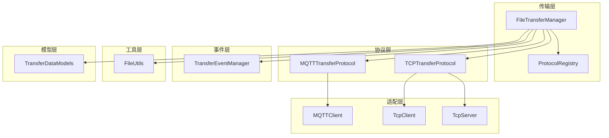
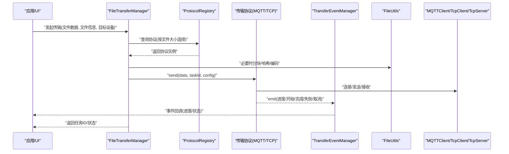
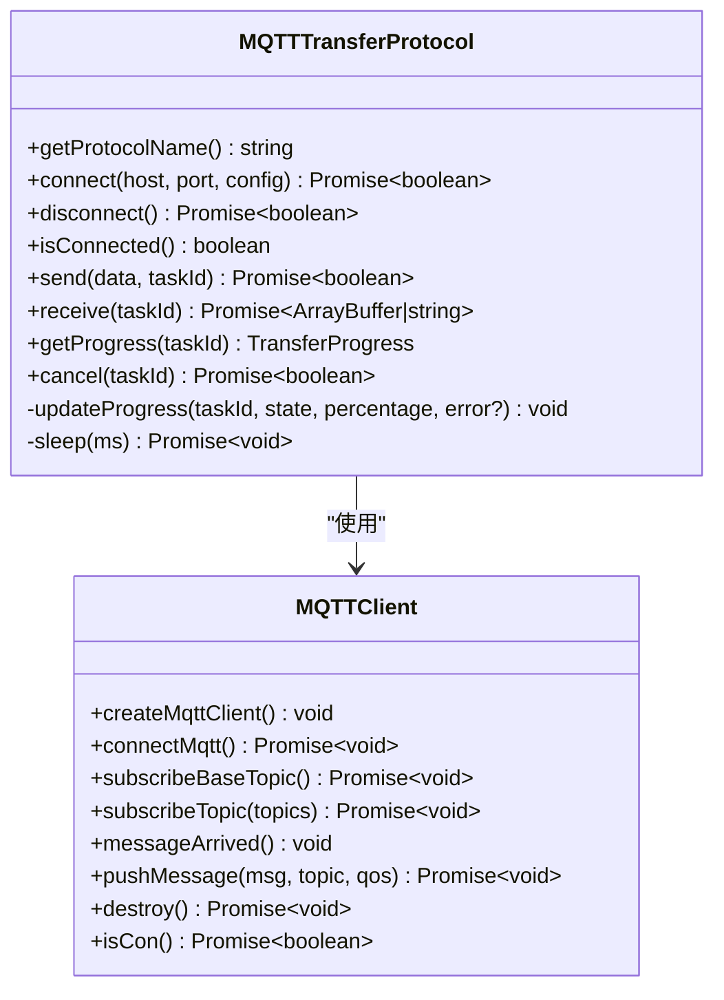
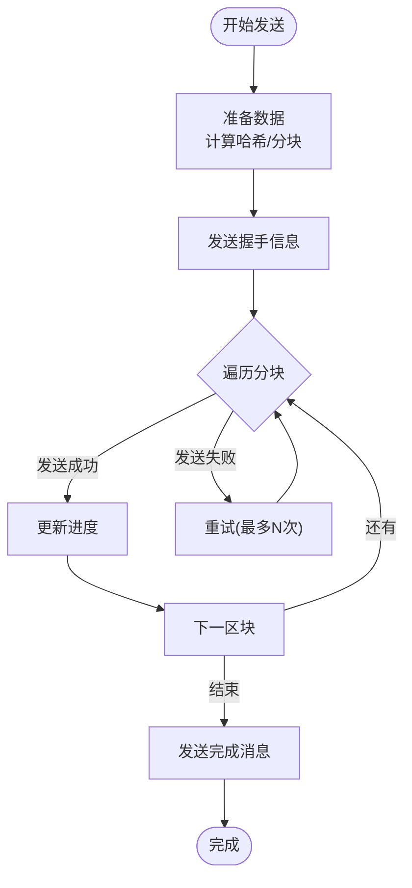
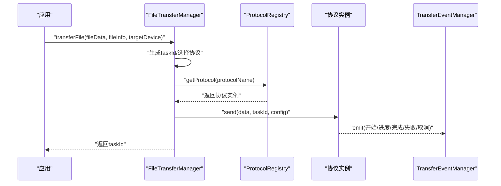
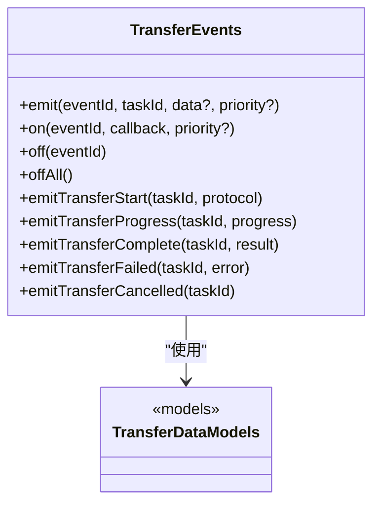
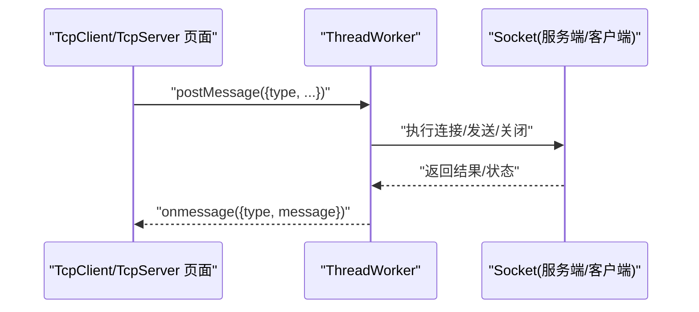
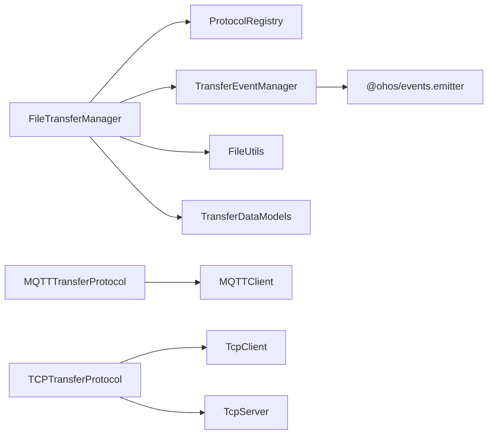

# API 参考文档

<cite>
**本文引用的文件**
- [entry/src/main/ets/manager/broker/MQTTClient.ets](file://entry/src/main/ets/manager/broker/MQTTClient.ets)
- [entry/src/main/ets/manager/broker/MQTTConfig.ets](file://entry/src/main/ets/manager/broker/MQTTConfig.ets)
- [entry/src/main/ets/manager/broker/socket/TcpClient.ets](file://entry/src/main/ets/manager/broker/socket/TcpClient.ets)
- [entry/src/main/ets/manager/broker/socket/TcpServer.ets](file://entry/src/main/ets/manager/broker/socket/TcpServer.ets)
- [entry/src/main/ets/manager/transfer/FileTransferManager.ets](file://entry/src/main/ets/manager/transfer/FileTransferManager.ets)
- [entry/src/main/ets/manager/transfer/protocol/TransferProtocolInterface.ets](file://entry/src/main/ets/manager/transfer/protocol/TransferProtocolInterface.ets)
- [entry/src/main/ets/manager/transfer/protocol/ProtocolRegistry.ets](file://entry/src/main/ets/manager/transfer/protocol/ProtocolRegistry.ets)
- [entry/src/main/ets/manager/transfer/protocol/MQTTTransferProtocol.ets](file://entry/src/main/ets/manager/transfer/protocol/MQTTTransferProtocol.ets)
- [entry/src/main/ets/manager/transfer/protocol/TCPTransferProtocol.ets](file://entry/src/main/ets/manager/transfer/protocol/TCPTransferProtocol.ets)
- [entry/src/main/ets/manager/transfer/model/TransferDataModels.ets](file://entry/src/main/ets/manager/transfer/model/TransferDataModels.ets)
- [entry/src/main/ets/manager/transfer/utils/FileUtils.ets](file://entry/src/main/ets/manager/transfer/utils/FileUtils.ets)
- [entry/src/main/ets/manager/transfer/event/TransferEvents.ets](file://entry/src/main/ets/manager/transfer/event/TransferEvents.ets)
- [entry/src/main/ets/pages/TestClientPage.ets](file://entry/src/main/ets/pages/TestClientPage.ets)
</cite>

## 目录
1. [简介](#简介)
2. [项目结构](#项目结构)
3. [核心组件](#核心组件)
4. [架构总览](#架构总览)
5. [详细组件分析](#详细组件分析)
6. [依赖关系分析](#依赖关系分析)
7. [性能考量](#性能考量)
8. [故障排查指南](#故障排查指南)
9. [结论](#结论)
10. [附录](#附录)

## 简介
本参考文档面向 OpenHarmony 应用中的文件传输与设备间通信能力，聚焦以下协议与能力：
- MQTT（发布/订阅）：用于小文件与控制消息的可靠传输与事件驱动交互。
- TCP（套接字）：用于大文件分块传输与双向数据通道。
- 事件系统：统一的传输事件与进度回调机制。
- 工具与模型：文件分块、哈希校验、传输配置与任务模型。

文档涵盖协议特性、数据模型、调用流程、错误处理、性能优化与调试建议，并提供常见用例与客户端集成指引。

## 项目结构
项目采用“模块化+协议抽象”的设计，核心位于 entry/src/main/ets/manager/transfer 与 entry/src/main/ets/manager/broker 下：
- 传输层：FileTransferManager 统一调度，协议注册中心动态选择 MQTT 或 TCP。
- 协议层：MQTTTransferProtocol、TCPTransferProtocol 实现具体传输细节。
- 事件层：TransferEventManager 提供传输生命周期事件。
- 工具层：FileUtils 提供分块、重组、哈希等通用能力。
- 模型层：TransferDataModels 定义任务、文件、分块等数据结构。
- 适配层：MQTTClient 与 TcpClient/TcpServer 提供底层连接与消息通道。

图表来源
- [entry/src/main/ets/manager/transfer/FileTransferManager.ets](file://entry/src/main/ets/manager/transfer/FileTransferManager.ets#L1-L375)
- [entry/src/main/ets/manager/transfer/protocol/ProtocolRegistry.ets](file://entry/src/main/ets/manager/transfer/protocol/ProtocolRegistry.ets#L1-L93)
- [entry/src/main/ets/manager/transfer/protocol/MQTTTransferProtocol.ets](file://entry/src/main/ets/manager/transfer/protocol/MQTTTransferProtocol.ets#L1-L185)
- [entry/src/main/ets/manager/transfer/protocol/TCPTransferProtocol.ets](file://entry/src/main/ets/manager/transfer/protocol/TCPTransferProtocol.ets#L1-L351)
- [entry/src/main/ets/manager/transfer/event/TransferEvents.ets](file://entry/src/main/ets/manager/transfer/event/TransferEvents.ets#L1-L206)
- [entry/src/main/ets/manager/transfer/utils/FileUtils.ets](file://entry/src/main/ets/manager/transfer/utils/FileUtils.ets#L1-L193)
- [entry/src/main/ets/manager/transfer/model/TransferDataModels.ets](file://entry/src/main/ets/manager/transfer/model/TransferDataModels.ets#L1-L113)
- [entry/src/main/ets/manager/broker/MQTTClient.ets](file://entry/src/main/ets/manager/broker/MQTTClient.ets#L1-L223)
- [entry/src/main/ets/manager/broker/socket/TcpClient.ets](file://entry/src/main/ets/manager/broker/socket/TcpClient.ets#L1-L246)
- [entry/src/main/ets/manager/broker/socket/TcpServer.ets](file://entry/src/main/ets/manager/broker/socket/TcpServer.ets#L1-L287)

章节来源
- [entry/src/main/ets/manager/transfer/FileTransferManager.ets](file://entry/src/main/ets/manager/transfer/FileTransferManager.ets#L1-L375)
- [entry/src/main/ets/manager/transfer/protocol/ProtocolRegistry.ets](file://entry/src/main/ets/manager/transfer/protocol/ProtocolRegistry.ets#L1-L93)

## 核心组件
- FileTransferManager：统一入口，负责任务编排、协议选择、事件派发与资源清理。
- ProtocolRegistry：协议注册与查找中心，支持动态扩展。
- MQTTTransferProtocol：基于 MQTT 的小文件直传与事件驱动。
- TCPTransferProtocol：基于 TCP 的大文件分块传输与握手协议。
- TransferEventManager：传输事件总线，提供进度、开始、完成、失败、取消等事件。
- FileUtils：文件分块、重组、哈希计算与编码转换。
- TransferDataModels：任务、文件、分块、握手消息等数据模型。
- MQTTClient：MQTT 客户端封装，负责连接、订阅、发布与消息分发。
- TcpClient/TcpServer：TCP 客户端与服务端 UI 与 Worker 交互入口。

章节来源
- [entry/src/main/ets/manager/transfer/FileTransferManager.ets](file://entry/src/main/ets/manager/transfer/FileTransferManager.ets#L17-L375)
- [entry/src/main/ets/manager/transfer/protocol/TransferProtocolInterface.ets](file://entry/src/main/ets/manager/transfer/protocol/TransferProtocolInterface.ets#L1-L120)
- [entry/src/main/ets/manager/transfer/protocol/ProtocolRegistry.ets](file://entry/src/main/ets/manager/transfer/protocol/ProtocolRegistry.ets#L1-L93)
- [entry/src/main/ets/manager/transfer/protocol/MQTTTransferProtocol.ets](file://entry/src/main/ets/manager/transfer/protocol/MQTTTransferProtocol.ets#L1-L185)
- [entry/src/main/ets/manager/transfer/protocol/TCPTransferProtocol.ets](file://entry/src/main/ets/manager/transfer/protocol/TCPTransferProtocol.ets#L1-L351)
- [entry/src/main/ets/manager/transfer/event/TransferEvents.ets](file://entry/src/main/ets/manager/transfer/event/TransferEvents.ets#L1-L206)
- [entry/src/main/ets/manager/transfer/utils/FileUtils.ets](file://entry/src/main/ets/manager/transfer/utils/FileUtils.ets#L1-L193)
- [entry/src/main/ets/manager/transfer/model/TransferDataModels.ets](file://entry/src/main/ets/manager/transfer/model/TransferDataModels.ets#L1-L113)
- [entry/src/main/ets/manager/broker/MQTTClient.ets](file://entry/src/main/ets/manager/broker/MQTTClient.ets#L24-L223)
- [entry/src/main/ets/manager/broker/socket/TcpClient.ets](file://entry/src/main/ets/manager/broker/socket/TcpClient.ets#L1-L246)
- [entry/src/main/ets/manager/broker/socket/TcpServer.ets](file://entry/src/main/ets/manager/broker/socket/TcpServer.ets#L1-L287)

## 架构总览
下图展示从应用层到传输层、协议层与适配层的整体交互：

图表来源
- [entry/src/main/ets/manager/transfer/FileTransferManager.ets](file://entry/src/main/ets/manager/transfer/FileTransferManager.ets#L105-L187)
- [entry/src/main/ets/manager/transfer/protocol/ProtocolRegistry.ets](file://entry/src/main/ets/manager/transfer/protocol/ProtocolRegistry.ets#L55-L66)
- [entry/src/main/ets/manager/transfer/protocol/MQTTTransferProtocol.ets](file://entry/src/main/ets/manager/transfer/protocol/MQTTTransferProtocol.ets#L70-L109)
- [entry/src/main/ets/manager/transfer/protocol/TCPTransferProtocol.ets](file://entry/src/main/ets/manager/transfer/protocol/TCPTransferProtocol.ets#L123-L205)
- [entry/src/main/ets/manager/transfer/event/TransferEvents.ets](file://entry/src/main/ets/manager/transfer/event/TransferEvents.ets#L161-L204)
- [entry/src/main/ets/manager/transfer/utils/FileUtils.ets](file://entry/src/main/ets/manager/transfer/utils/FileUtils.ets#L16-L70)
- [entry/src/main/ets/manager/broker/MQTTClient.ets](file://entry/src/main/ets/manager/broker/MQTTClient.ets#L76-L203)
- [entry/src/main/ets/manager/broker/socket/TcpClient.ets](file://entry/src/main/ets/manager/broker/socket/TcpClient.ets#L184-L216)
- [entry/src/main/ets/manager/broker/socket/TcpServer.ets](file://entry/src/main/ets/manager/broker/socket/TcpServer.ets#L184-L252)

## 详细组件分析

### MQTT 传输协议
- 协议选择：文件大小 ≤ 阈值（默认 2MB）时使用 MQTT；否则使用 TCP。
- 连接与订阅：初始化时创建 MQTT 客户端并订阅多个主题，消息到达后通过事件总线分发。
- 发布与重试：支持多次重试与超时控制；完成后更新进度并触发完成事件。
- 事件驱动：通过事件总线向应用层推送传输进度与结果。

图表来源
- [entry/src/main/ets/manager/transfer/protocol/MQTTTransferProtocol.ets](file://entry/src/main/ets/manager/transfer/protocol/MQTTTransferProtocol.ets#L10-L185)
- [entry/src/main/ets/manager/broker/MQTTClient.ets](file://entry/src/main/ets/manager/broker/MQTTClient.ets#L24-L223)

章节来源
- [entry/src/main/ets/manager/transfer/protocol/MQTTTransferProtocol.ets](file://entry/src/main/ets/manager/transfer/protocol/MQTTTransferProtocol.ets#L1-L185)
- [entry/src/main/ets/manager/broker/MQTTClient.ets](file://entry/src/main/ets/manager/broker/MQTTClient.ets#L1-L223)
- [entry/src/main/ets/manager/broker/MQTTConfig.ets](file://entry/src/main/ets/manager/broker/MQTTConfig.ets#L1-L7)

### TCP 传输协议
- 协议选择：文件大小 > 阈值（默认 2MB）时使用 TCP。
- 分块与握手：计算文件哈希，按配置分块，发送握手信息，逐块发送并跟踪进度。
- 重试与超时：每块发送具备重试与超时控制；完成后触发完成事件。
- 服务端/客户端：支持作为服务端监听与作为客户端连接，统一通过 Socket 管理器协调。

图表来源
- [entry/src/main/ets/manager/transfer/protocol/TCPTransferProtocol.ets](file://entry/src/main/ets/manager/transfer/protocol/TCPTransferProtocol.ets#L123-L205)
- [entry/src/main/ets/manager/transfer/utils/FileUtils.ets](file://entry/src/main/ets/manager/transfer/utils/FileUtils.ets#L16-L70)

章节来源
- [entry/src/main/ets/manager/transfer/protocol/TCPTransferProtocol.ets](file://entry/src/main/ets/manager/transfer/protocol/TCPTransferProtocol.ets#L1-L351)
- [entry/src/main/ets/manager/transfer/utils/FileUtils.ets](file://entry/src/main/ets/manager/transfer/utils/FileUtils.ets#L1-L193)

### 文件传输管理器
- 任务编排：根据文件大小自动选择协议，创建任务并维护状态。
- 事件派发：在传输开始、进度更新、完成、失败、取消时派发事件。
- 资源管理：提供取消任务、查询进度、清理已完成任务等能力。
- 配置项：支持自定义大小阈值、TCP 分块大小、重试次数、超时与端口。

图表来源
- [entry/src/main/ets/manager/transfer/FileTransferManager.ets](file://entry/src/main/ets/manager/transfer/FileTransferManager.ets#L105-L187)
- [entry/src/main/ets/manager/transfer/protocol/ProtocolRegistry.ets](file://entry/src/main/ets/manager/transfer/protocol/ProtocolRegistry.ets#L55-L66)
- [entry/src/main/ets/manager/transfer/event/TransferEvents.ets](file://entry/src/main/ets/manager/transfer/event/TransferEvents.ets#L161-L204)

章节来源
- [entry/src/main/ets/manager/transfer/FileTransferManager.ets](file://entry/src/main/ets/manager/transfer/FileTransferManager.ets#L1-L375)

### 数据模型与事件
- 数据模型：FileInfo、ChunkData、TransferTask、TCPHandshakeMessage、TransferOptions。
- 事件体系：TransferEventId 定义传输生命周期事件；TransferEventManager 提供事件发送/监听/移除。
- 进度信息：TransferProgress 统一描述传输状态、字节数、百分比、速度与剩余时间。

图表来源
- [entry/src/main/ets/manager/transfer/model/TransferDataModels.ets](file://entry/src/main/ets/manager/transfer/model/TransferDataModels.ets#L10-L113)
- [entry/src/main/ets/manager/transfer/event/TransferEvents.ets](file://entry/src/main/ets/manager/transfer/event/TransferEvents.ets#L62-L206)

章节来源
- [entry/src/main/ets/manager/transfer/model/TransferDataModels.ets](file://entry/src/main/ets/manager/transfer/model/TransferDataModels.ets#L1-L113)
- [entry/src/main/ets/manager/transfer/event/TransferEvents.ets](file://entry/src/main/ets/manager/transfer/event/TransferEvents.ets#L1-L206)

### 工具与实用函数
- 文件分块与重组：chunkFile、reassembleChunks。
- 哈希计算与校验：calculateHash、verifyHash。
- 编码转换：arrayBufferToBase64、base64ToArrayBuffer、arrayBufferToString、stringToArrayBuffer。
- 文件信息：generateFileId、getFileInfo（待完善）。

章节来源
- [entry/src/main/ets/manager/transfer/utils/FileUtils.ets](file://entry/src/main/ets/manager/transfer/utils/FileUtils.ets#L1-L193)

### TCP 客户端与服务端（UI 与 Worker）
- UI 交互：TcpClient 与 TcpServer 页面提供输入框、按钮与消息历史展示。
- Worker 通信：页面通过 worker.ThreadWorker 与对应 Worker 通信，发送连接、发送、关闭等指令。
- 日志与状态：通过 hilog 输出与页面文本展示连接状态与消息历史。

图表来源
- [entry/src/main/ets/manager/broker/socket/TcpClient.ets](file://entry/src/main/ets/manager/broker/socket/TcpClient.ets#L184-L236)
- [entry/src/main/ets/manager/broker/socket/TcpServer.ets](file://entry/src/main/ets/manager/broker/socket/TcpServer.ets#L184-L276)

章节来源
- [entry/src/main/ets/manager/broker/socket/TcpClient.ets](file://entry/src/main/ets/manager/broker/socket/TcpClient.ets#L1-L246)
- [entry/src/main/ets/manager/broker/socket/TcpServer.ets](file://entry/src/main/ets/manager/broker/socket/TcpServer.ets#L1-L287)

## 依赖关系分析
- FileTransferManager 依赖 ProtocolRegistry、TransferEventManager、FileUtils、TransferDataModels。
- 协议实现依赖适配层（MQTTClient、TcpClient/TcpServer）与事件系统。
- 事件系统依赖 @ohos/events.emitter，提供事件发送与监听。
- 工具层依赖 OpenHarmony 加密与编码能力，确保哈希与编码一致性。

图表来源
- [entry/src/main/ets/manager/transfer/FileTransferManager.ets](file://entry/src/main/ets/manager/transfer/FileTransferManager.ets#L1-L375)
- [entry/src/main/ets/manager/transfer/protocol/ProtocolRegistry.ets](file://entry/src/main/ets/manager/transfer/protocol/ProtocolRegistry.ets#L1-L93)
- [entry/src/main/ets/manager/transfer/event/TransferEvents.ets](file://entry/src/main/ets/manager/transfer/event/TransferEvents.ets#L1-L206)
- [entry/src/main/ets/manager/broker/MQTTClient.ets](file://entry/src/main/ets/manager/broker/MQTTClient.ets#L1-L223)
- [entry/src/main/ets/manager/broker/socket/TcpClient.ets](file://entry/src/main/ets/manager/broker/socket/TcpClient.ets#L1-L246)
- [entry/src/main/ets/manager/broker/socket/TcpServer.ets](file://entry/src/main/ets/manager/broker/socket/TcpServer.ets#L1-L287)

章节来源
- [entry/src/main/ets/manager/transfer/FileTransferManager.ets](file://entry/src/main/ets/manager/transfer/FileTransferManager.ets#L1-L375)
- [entry/src/main/ets/manager/transfer/event/TransferEvents.ets](file://entry/src/main/ets/manager/transfer/event/TransferEvents.ets#L1-L206)

## 性能考量
- 协议选择：小文件走 MQTT，降低连接开销；大文件走 TCP，提升吞吐与可靠性。
- 分块大小：默认 128KB，可根据网络状况调整以平衡延迟与带宽利用率。
- 重试与超时：合理设置最大重试次数与超时时间，避免阻塞主线程。
- 事件频率：传输进度事件应适度上报，避免频繁渲染导致卡顿。
- 哈希校验：仅在必要时进行，避免重复计算。
- 内存管理：及时清理已完成任务与进度缓存，防止内存泄漏。

## 故障排查指南
- MQTT 连接失败
  - 检查 URL、用户名、密码与主题配置。
  - 确认订阅主题与权限。
  - 查看连接与订阅回调日志。
- TCP 连接/发送失败
  - 检查端口与防火墙设置。
  - 确认服务端已启动监听且客户端 IP/端口正确。
  - 关注分块发送重试与超时日志。
- 传输进度异常
  - 通过 TransferEventManager 监听进度事件，定位卡点。
  - 检查分块重组与哈希校验是否一致。
- 事件未触发
  - 确认事件监听已注册且优先级合适。
  - 检查事件 ID 与回调签名是否匹配。

章节来源
- [entry/src/main/ets/manager/broker/MQTTClient.ets](file://entry/src/main/ets/manager/broker/MQTTClient.ets#L84-L123)
- [entry/src/main/ets/manager/broker/socket/TcpClient.ets](file://entry/src/main/ets/manager/broker/socket/TcpClient.ets#L184-L236)
- [entry/src/main/ets/manager/broker/socket/TcpServer.ets](file://entry/src/main/ets/manager/broker/socket/TcpServer.ets#L184-L276)
- [entry/src/main/ets/manager/transfer/event/TransferEvents.ets](file://entry/src/main/ets/manager/transfer/event/TransferEvents.ets#L115-L130)

## 结论
本项目通过协议抽象与事件驱动实现了跨协议的文件传输能力，结合工具层与数据模型提供了完善的分块、哈希与进度管理。MQTT 适合小文件与低延迟场景，TCP 适合大文件与高吞吐场景。建议在生产环境中根据网络条件与业务需求调整分块大小、重试与超时策略，并通过事件系统与日志进行持续监控与优化。

## 附录

### 常见用例与客户端集成
- 基础传输：准备文件数据与 FileInfo，调用 FileTransferManager.transferFile，自动选择协议。
- 大文件传输：确保文件大小超过阈值，使用 TCP 协议进行分块传输。
- 查询进度：通过 FileTransferManager.getTransferProgress 获取实时进度。
- 取消任务：调用 FileTransferManager.cancelTransfer 取消进行中的任务。
- 自定义配置：setDefaultOptions 调整阈值、分块大小、重试次数、超时与端口。
- 事件监听：通过 TransferEventManager.on 监听传输事件，实现 UI 与日志联动。
- 完整流程：准备文件 → 发起传输 → 等待进度 → 清理已完成任务。

章节来源
- [entry/src/main/ets/manager/transfer/FileTransferManager.ets](file://entry/src/main/ets/manager/transfer/FileTransferManager.ets#L79-L96)
- [entry/src/main/ets/manager/transfer/FileTransferManager.ets](file://entry/src/main/ets/manager/transfer/FileTransferManager.ets#L247-L304)
- [entry/src/main/ets/manager/transfer/event/TransferEvents.ets](file://entry/src/main/ets/manager/transfer/event/TransferEvents.ets#L115-L130)
- [entry/src/main/ets/pages/TestClientPage.ets](file://entry/src/main/ets/pages/TestClientPage.ets#L54-L125)