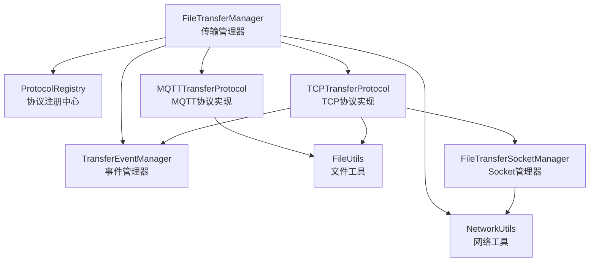
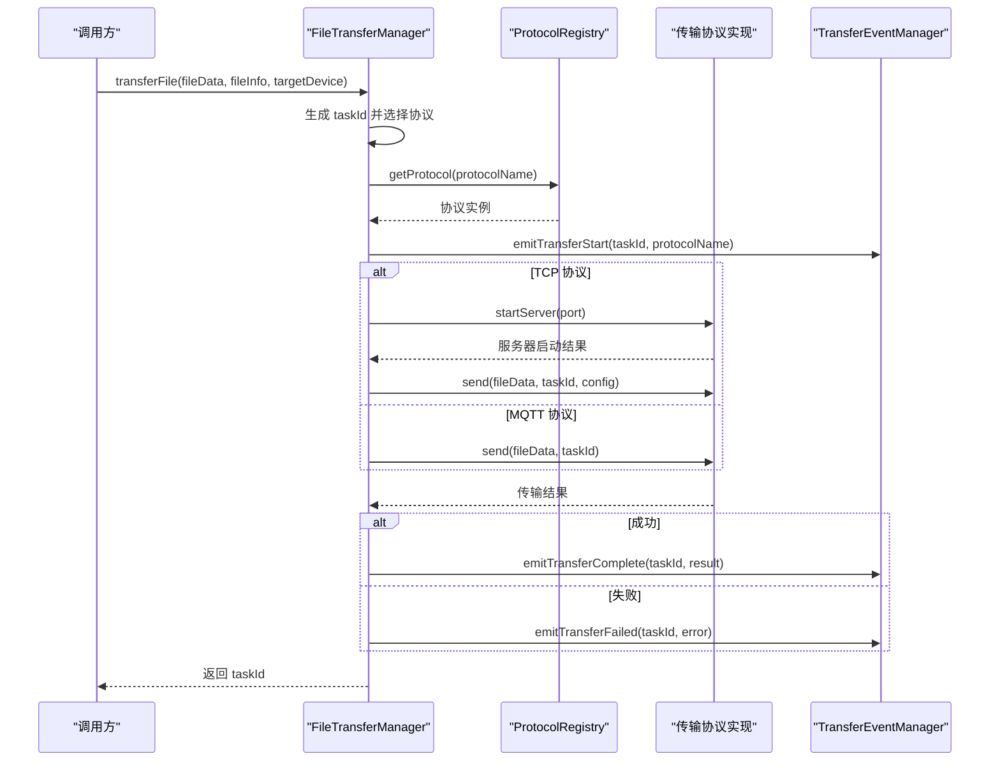
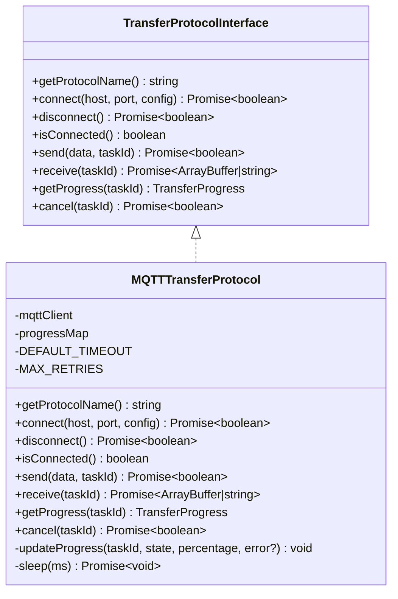
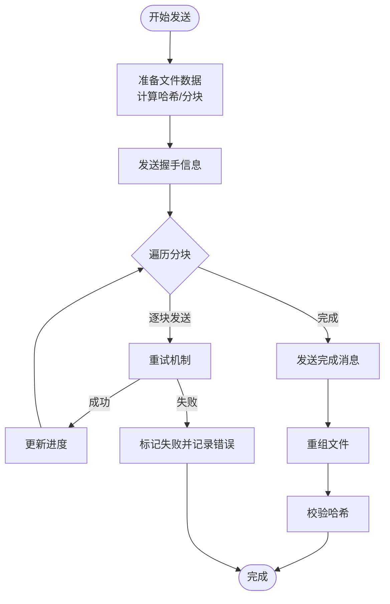
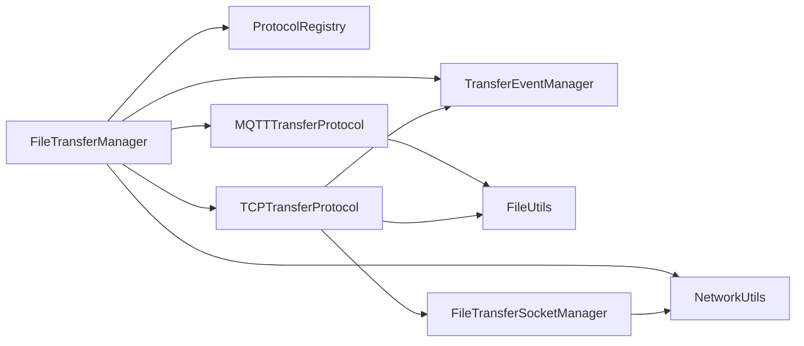

# 传输协议 API

<cite>
**本文引用的文件列表**
- [TransferProtocolInterface.ets](file://entry/src/main/ets/manager/transfer/protocol/TransferProtocolInterface.ets)
- [MQTTTransferProtocol.ets](file://entry/src/main/ets/manager/transfer/protocol/MQTTTransferProtocol.ets)
- [TCPTransferProtocol.ets](file://entry/src/main/ets/manager/transfer/protocol/TCPTransferProtocol.ets)
- [TransferDataModels.ets](file://entry/src/main/ets/manager/transfer/model/TransferDataModels.ets)
- [TransferExamples.ets](file://entry/src/main/ets/manager/transfer/examples/TransferExamples.ets)
- [FileUtils.ets](file://entry/src/main/ets/manager/transfer/utils/FileUtils.ets)
- [FileTransferSocketManager.ets](file://entry/src/main/ets/manager/transfer/socket/FileTransferSocketManager.ets)
- [TransferEvents.ets](file://entry/src/main/ets/manager/transfer/event/TransferEvents.ets)
- [FileTransferManager.ets](file://entry/src/main/ets/manager/transfer/FileTransferManager.ets)
- [ProtocolRegistry.ets](file://entry/src/main/ets/manager/transfer/protocol/ProtocolRegistry.ets)
- [NetworkUtils.ets](file://entry/src/main/ets/manager/transfer/utils/NetworkUtils.ets)
</cite>

## 目录
1. [简介](#简介)
2. [项目结构](#项目结构)
3. [核心组件](#核心组件)
4. [架构概览](#架构概览)
5. [详细组件分析](#详细组件分析)
6. [依赖关系分析](#依赖关系分析)
7. [性能考虑](#性能考虑)
8. [故障排查指南](#故障排查指南)
9. [结论](#结论)
10. [附录](#附录)

## 简介
本文件为传输协议 API 的详细技术文档，涵盖以下内容：
- 传输协议接口规范：协议抽象方法、状态管理、错误处理等
- 具体实现：MQTTTransferProtocol 和 TCPTransferProtocol 的文件传输、数据序列化、进度跟踪等功能
- 数据结构定义：TransferDataModels 中的文件信息、传输配置、状态枚举等
- 使用示例与扩展指南：基于 TransferExamples 的实践案例与最佳实践

本项目采用模块化设计，通过 FileTransferManager 统一调度协议选择与任务管理，并通过事件系统实现跨模块解耦。

## 项目结构
传输协议相关代码位于 entry/src/main/ets/manager/transfer 目录下，主要分为以下层次：
- protocol：协议接口与实现（TransferProtocolInterface、MQTTTransferProtocol、TCPTransferProtocol、ProtocolRegistry）
- model：数据模型（TransferDataModels）
- utils：工具类（FileUtils、NetworkUtils）
- socket：网络套接字管理（FileTransferSocketManager）
- event：事件系统（TransferEvents）
- examples：使用示例（TransferExamples）
- FileTransferManager：传输管理器

图表来源
- [FileTransferManager.ets](file://entry/src/main/ets/manager/transfer/FileTransferManager.ets#L1-L375)
- [ProtocolRegistry.ets](file://entry/src/main/ets/manager/transfer/protocol/ProtocolRegistry.ets#L1-L93)
- [TransferEvents.ets](file://entry/src/main/ets/manager/transfer/event/TransferEvents.ets#L1-L206)
- [FileUtils.ets](file://entry/src/main/ets/manager/transfer/utils/FileUtils.ets#L1-L193)
- [FileTransferSocketManager.ets](file://entry/src/main/ets/manager/transfer/socket/FileTransferSocketManager.ets#L1-L354)
- [NetworkUtils.ets](file://entry/src/main/ets/manager/transfer/utils/NetworkUtils.ets#L1-L131)

章节来源
- [FileTransferManager.ets](file://entry/src/main/ets/manager/transfer/FileTransferManager.ets#L1-L375)
- [ProtocolRegistry.ets](file://entry/src/main/ets/manager/transfer/protocol/ProtocolRegistry.ets#L1-L93)

## 核心组件
本节概述传输协议 API 的核心接口与关键数据结构。

- 传输协议接口（TransferProtocolInterface）
  - 协议名称、连接、断开、连接状态检查
  - 发送/接收数据、进度查询、任务取消
  - 定义 TransferState、TransferConfig、TransferProgress 等核心类型

- 传输数据模型（TransferDataModels）
  - FileInfo：文件元数据
  - ChunkData：分块数据
  - TransferTask：传输任务
  - TCPHandshakeMessage：TCP 握手消息
  - TransferOptions：传输配置选项

- 传输事件系统（TransferEvents）
  - TransferEventId：事件类型枚举
  - TransferEventData：事件数据结构
  - TransferEventManager：事件发送与监听

章节来源
- [TransferProtocolInterface.ets](file://entry/src/main/ets/manager/transfer/protocol/TransferProtocolInterface.ets#L1-L120)
- [TransferDataModels.ets](file://entry/src/main/ets/manager/transfer/model/TransferDataModels.ets#L1-L113)
- [TransferEvents.ets](file://entry/src/main/ets/manager/transfer/event/TransferEvents.ets#L1-L206)

## 架构概览
传输协议的整体架构由 FileTransferManager 统一调度，根据文件大小自动选择协议（小文件走 MQTT，大文件走 TCP），并通过事件系统实现跨模块通信。

图表来源
- [FileTransferManager.ets](file://entry/src/main/ets/manager/transfer/FileTransferManager.ets#L105-L187)
- [ProtocolRegistry.ets](file://entry/src/main/ets/manager/transfer/protocol/ProtocolRegistry.ets#L55-L66)
- [TransferEvents.ets](file://entry/src/main/ets/manager/transfer/event/TransferEvents.ets#L161-L196)

## 详细组件分析

### 传输协议接口规范（TransferProtocolInterface）
- 方法职责
  - getProtocolName：返回协议标识
  - connect/disconnect/isConnected：连接生命周期管理
  - send/receive：数据传输（支持 ArrayBuffer 与字符串）
  - getProgress/cancel：进度查询与任务取消
- 状态管理
  - TransferState：IDLE、CONNECTING、TRANSFERRING、COMPLETED、FAILED、CANCELLED
- 配置与进度
  - TransferConfig：timeout、maxRetries、chunkSize
  - TransferProgress：taskId、state、transferredBytes、totalBytes、progress、speed、estimatedTimeRemaining、error

章节来源
- [TransferProtocolInterface.ets](file://entry/src/main/ets/manager/transfer/protocol/TransferProtocolInterface.ets#L63-L119)

### MQTTTransferProtocol 实现
- 设计要点
  - 基于现有 MQTT 客户端，适用于小文件（≤2MB）的直接传输
  - 通过 MQTTClient 推送消息到特定主题，接收方通过事件监听获取数据
  - 进度管理：使用 Map 存储每个 taskId 的进度，完成后延迟清理
- 数据序列化
  - send：若输入为 ArrayBuffer，转换为 Base64；否则直接使用字符串
  - receive：接口一致性占位，实际通过事件监听实现
- 错误处理
  - 最多重试，每次重试间隔递增
  - 失败时更新进度并记录错误信息

图表来源
- [TransferProtocolInterface.ets](file://entry/src/main/ets/manager/transfer/protocol/TransferProtocolInterface.ets#L63-L119)
- [MQTTTransferProtocol.ets](file://entry/src/main/ets/manager/transfer/protocol/MQTTTransferProtocol.ets#L10-L185)

章节来源
- [MQTTTransferProtocol.ets](file://entry/src/main/ets/manager/transfer/protocol/MQTTTransferProtocol.ets#L1-L185)

### TCPTransferProtocol 实现
- 设计要点
  - 基于 TCP Socket，适用于大文件（>2MB）的分块传输
  - 通过 FileTransferSocketManager 管理连接生命周期
  - 事件驱动：通过 TransferEventManager 发布分块接收、进度更新等事件
- 分块传输
  - FileUtils.chunkFile：按 chunkSize 分块
  - 分块发送：逐块发送并带重试机制
  - 分块接收：等待所有分块到达后重组
- 数据序列化与校验
  - 使用 FileUtils.calculateHash 进行 SHA-256 校验
  - 支持 Base64 编解码与字符串/ArrayBuffer 转换
- 错误处理
  - 分块级重试与整体失败回退
  - 失败时更新进度并记录错误信息

图表来源
- [TCPTransferProtocol.ets](file://entry/src/main/ets/manager/transfer/protocol/TCPTransferProtocol.ets#L123-L205)
- [FileUtils.ets](file://entry/src/main/ets/manager/transfer/utils/FileUtils.ets#L16-L70)

章节来源
- [TCPTransferProtocol.ets](file://entry/src/main/ets/manager/transfer/protocol/TCPTransferProtocol.ets#L1-L351)
- [FileUtils.ets](file://entry/src/main/ets/manager/transfer/utils/FileUtils.ets#L1-L193)

### 数据结构定义（TransferDataModels）
- FileInfo：文件唯一标识、名称、大小、类型、路径、哈希、时间戳等
- ChunkData：分块所属任务、索引、总数、数据、大小、哈希、是否最后一块
- TransferTask：任务 ID、文件信息、源/目标设备、协议、状态、IP/端口、时间戳
- TCPHandshakeMessage：握手消息类型（handshake/start_transfer/chunk/complete/error）、任务 ID、文件/分块信息、错误信息
- TransferOptions：文件大小阈值、TCP 分块大小、最大重试次数、连接超时、TCP 端口

章节来源
- [TransferDataModels.ets](file://entry/src/main/ets/manager/transfer/model/TransferDataModels.ets#L1-L113)

### 传输事件系统（TransferEvents）
- 事件类型：传输开始、进度更新、完成、失败、取消、TCP 连接、分块接收、文件重组
- 事件数据：taskId、eventType、data、timestamp
- 事件管理：emit/on/off/offAll，以及便捷方法 emitTransferStart/Progress/Complete/Failed/Cancelled

章节来源
- [TransferEvents.ets](file://entry/src/main/ets/manager/transfer/event/TransferEvents.ets#L1-L206)

### 文件传输管理器（FileTransferManager）
- 功能
  - 自动协议选择：根据文件大小阈值选择 MQTT 或 TCP
  - 任务管理：创建、跟踪、取消、清理任务
  - 事件发布：传输开始、进度、完成、失败、取消
  - 协议注册：内置注册 MQTT/TCP，默认可扩展
- 关键流程
  - transferFile：生成 taskId、选择协议、触发事件、执行传输、更新状态
  - transferViaTCP：启动服务器、等待连接、发送数据
  - cancelTransfer：调用协议取消、更新状态、触发事件

章节来源
- [FileTransferManager.ets](file://entry/src/main/ets/manager/transfer/FileTransferManager.ets#L1-L375)

### 协议注册中心（ProtocolRegistry）
- 功能
  - 注册/注销协议实现
  - 获取协议实例
  - 列出协议、检查是否存在、清空所有协议
- 作用
  - 为 FileTransferManager 提供协议查找能力，支持扩展新协议

章节来源
- [ProtocolRegistry.ets](file://entry/src/main/ets/manager/transfer/protocol/ProtocolRegistry.ets#L1-L93)

### 网络与文件工具（NetworkUtils、FileUtils）
- NetworkUtils
  - 获取本机 IP、子网掩码、网关
  - 校验 IP 与端口有效性
- FileUtils
  - 文件分块/重组
  - 哈希计算与校验（SHA-256）
  - Base64 编解码与字符串/ArrayBuffer 转换
  - 生成文件 ID

章节来源
- [NetworkUtils.ets](file://entry/src/main/ets/manager/transfer/utils/NetworkUtils.ets#L1-L131)
- [FileUtils.ets](file://entry/src/main/ets/manager/transfer/utils/FileUtils.ets#L1-L193)

### Socket 管理（FileTransferSocketManager）
- 功能
  - 启动/停止 TCP 服务器监听
  - 客户端连接、消息处理、连接池管理
  - 发送数据、关闭连接
- 作用
  - 为 TCPTransferProtocol 提供底层网络能力

章节来源
- [FileTransferSocketManager.ets](file://entry/src/main/ets/manager/transfer/socket/FileTransferSocketManager.ets#L1-L354)

## 依赖关系分析
- FileTransferManager 依赖 ProtocolRegistry、TransferEventManager、NetworkUtils，并根据文件大小选择 MQTT 或 TCP 协议
- MQTTTransferProtocol 依赖 MQTTClient 与 FileUtils
- TCPTransferProtocol 依赖 FileTransferSocketManager、FileUtils、TransferEventManager
- TransferEvents 通过 @ohos/events.emitter 提供事件机制
- NetworkUtils 依赖 @ohos.wifiManager 获取网络信息

图表来源
- [FileTransferManager.ets](file://entry/src/main/ets/manager/transfer/FileTransferManager.ets#L1-L375)
- [ProtocolRegistry.ets](file://entry/src/main/ets/manager/transfer/protocol/ProtocolRegistry.ets#L1-L93)
- [TransferEvents.ets](file://entry/src/main/ets/manager/transfer/event/TransferEvents.ets#L1-L206)
- [FileUtils.ets](file://entry/src/main/ets/manager/transfer/utils/FileUtils.ets#L1-L193)
- [FileTransferSocketManager.ets](file://entry/src/main/ets/manager/transfer/socket/FileTransferSocketManager.ets#L1-L354)
- [NetworkUtils.ets](file://entry/src/main/ets/manager/transfer/utils/NetworkUtils.ets#L1-L131)

章节来源
- [FileTransferManager.ets](file://entry/src/main/ets/manager/transfer/FileTransferManager.ets#L1-L375)

## 性能考虑
- 分块策略
  - TCP 默认分块大小为 128KB，可根据网络环境调整
  - 大文件传输建议使用 TCP，小文件使用 MQTT 降低开销
- 重试与超时
  - 默认最大重试 3 次，超时 30 秒，避免长时间阻塞
- 进度与事件
  - 传输进度与事件驱动有助于前端及时反馈，减少轮询开销
- 内存管理
  - 分块传输避免一次性加载大文件至内存
  - 传输完成后清理进度与任务记录

## 故障排查指南
- 连接问题
  - MQTT：确认 MQTT 客户端已连接，检查主题订阅
  - TCP：确认服务器已启动、端口开放、防火墙允许
- 传输失败
  - 查看 TransferProgress.error 获取错误详情
  - 检查分块重试日志与事件监听是否正常
- 进度异常
  - 确认事件系统正常工作，检查事件监听器注册
  - 验证协议实现的进度更新逻辑

章节来源
- [MQTTTransferProtocol.ets](file://entry/src/main/ets/manager/transfer/protocol/MQTTTransferProtocol.ets#L94-L108)
- [TCPTransferProtocol.ets](file://entry/src/main/ets/manager/transfer/protocol/TCPTransferProtocol.ets#L200-L240)
- [TransferEvents.ets](file://entry/src/main/ets/manager/transfer/event/TransferEvents.ets#L78-L107)

## 结论
传输协议 API 通过统一接口抽象与模块化设计，实现了对 MQTT 与 TCP 协议的支持，具备完善的进度跟踪、事件系统与错误处理机制。FileTransferManager 提供了自动协议选择与任务管理能力，适合在 OpenHarmony 生态中进行文件传输场景的快速集成与扩展。

## 附录

### 使用示例与最佳实践
- 基本传输：小于 2MB 文件自动使用 MQTT，大于 2MB 使用 TCP
- 自定义配置：通过 setDefaultOptions 调整阈值、分块大小、重试次数与超时
- 事件监听：使用 TransferEventManager 监听传输开始、进度、完成、失败、取消等事件
- 任务管理：通过 FileTransferManager 的任务查询与取消接口进行管理
- 扩展协议：通过 ProtocolRegistry 注册自定义协议实现

章节来源
- [TransferExamples.ets](file://entry/src/main/ets/manager/transfer/examples/TransferExamples.ets#L1-L201)
- [FileTransferManager.ets](file://entry/src/main/ets/manager/transfer/FileTransferManager.ets#L79-L96)
- [TransferEvents.ets](file://entry/src/main/ets/manager/transfer/event/TransferEvents.ets#L115-L130)