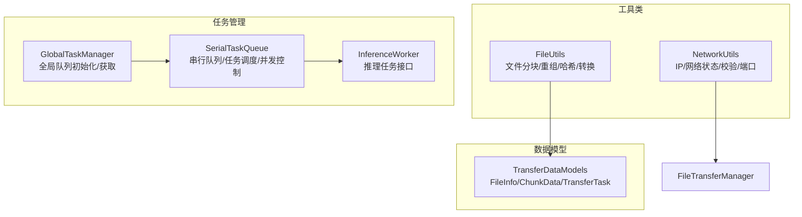
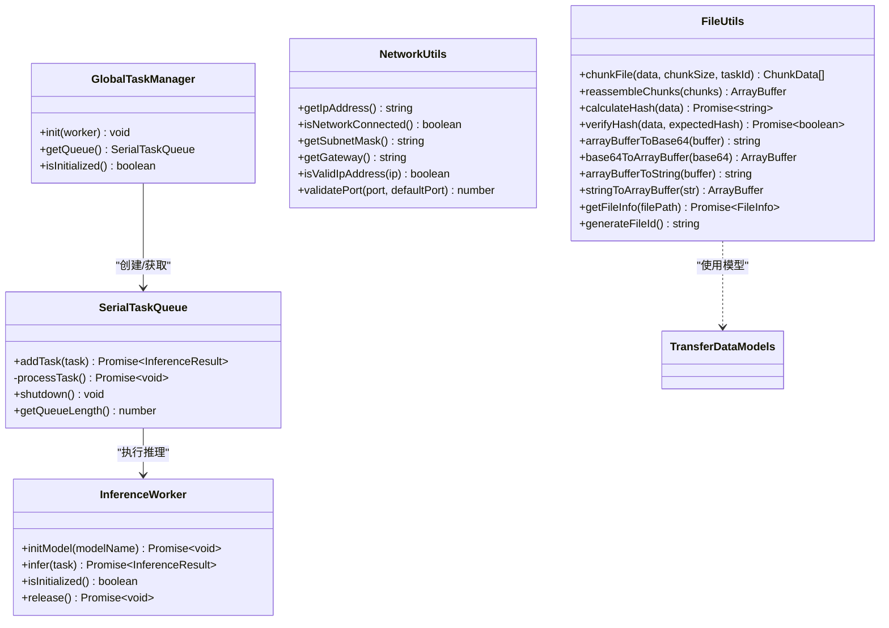
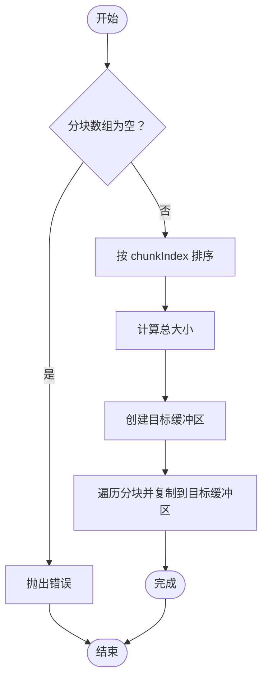
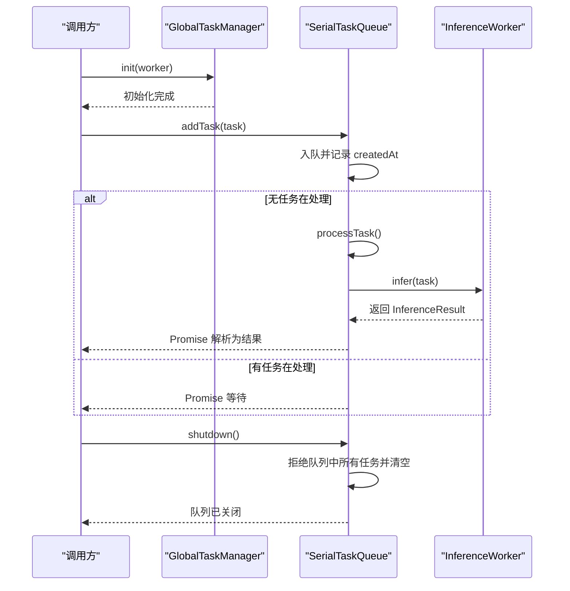
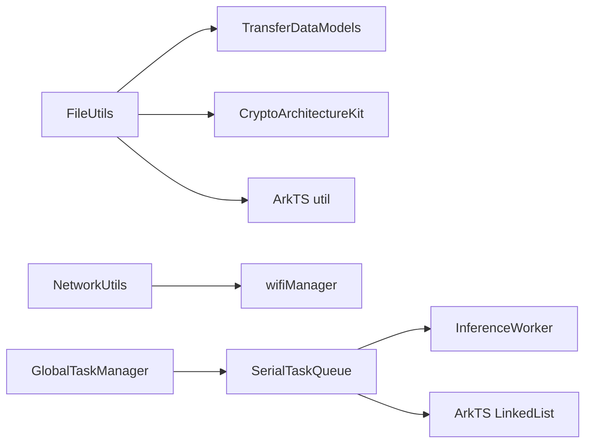

# 工具 API

<cite>
**本文引用的文件**
- [FileUtils.ets](file://entry/src/main/ets/manager/transfer/utils/FileUtils.ets)
- [NetworkUtils.ets](file://entry/src/main/ets/manager/transfer/utils/NetworkUtils.ets)
- [GlobalTaskManager.ets](file://entry/src/main/ets/manager/worker/GlobalTaskManager.ets)
- [SerialTaskQueue.ets](file://entry/src/main/ets/manager/worker/SerialTaskQueue.ets)
- [InferenceWorker.ets](file://entry/src/main/ets/manager/worker/InferenceWorker.ets)
- [TransferDataModels.ets](file://entry/src/main/ets/manager/transfer/model/TransferDataModels.ets)
- [TransferExamples.ets](file://entry/src/main/ets/manager/transfer/examples/TransferExamples.ets)
- [FileTransferManager.ets](file://entry/src/main/ets/manager/transfer/FileTransferManager.ets)
- [index.ets](file://entry/src/main/ets/manager/transfer/index.ets)
- [IMPLEMENTATION_SUMMARY.md](file://entry/src/main/ets/manager/transfer/IMPLEMENTATION_SUMMARY.md)
</cite>

## 目录
1. [简介](#简介)
2. [项目结构](#项目结构)
3. [核心组件](#核心组件)
4. [架构总览](#架构总览)
5. [详细组件分析](#详细组件分析)
6. [依赖关系分析](#依赖关系分析)
7. [性能考虑](#性能考虑)
8. [故障排查指南](#故障排查指南)
9. [结论](#结论)
10. [附录](#附录)

## 简介
本文件为工具 API 的详细文档，聚焦以下工具类与任务管理接口：
- 文件工具：FileUtils（文件分块、重组、哈希计算、格式转换、文件信息生成）
- 网络工具：NetworkUtils（IP 地址获取、网络状态检测、子网掩码/网关获取、IP 格式校验、端口有效性校验）
- 任务管理：GlobalTaskManager（全局任务队列初始化与获取）、SerialTaskQueue（串行任务队列、任务调度、并发控制、队列关闭与长度查询）、InferenceWorker（推理任务与结果接口）

文档提供接口说明、调用流程、最佳实践与常见问题排查，帮助开发者快速上手并稳定集成。

## 项目结构
工具 API 所在模块位于 entry/src/main/ets/manager/transfer 与 entry/src/main/ets/manager/worker 下，采用按功能域分层的组织方式：
- transfer/utils：文件与网络工具类
- transfer/model：传输数据模型
- transfer/examples：使用示例
- worker：任务管理与推理工作线程接口
- transfer/FileTransferManager：文件传输管理器（统一入口，非本文重点，但与工具类协同使用）

图表来源
- [FileUtils.ets](file://entry/src/main/ets/manager/transfer/utils/FileUtils.ets#L1-L193)
- [NetworkUtils.ets](file://entry/src/main/ets/manager/transfer/utils/NetworkUtils.ets#L1-L131)
- [GlobalTaskManager.ets](file://entry/src/main/ets/manager/worker/GlobalTaskManager.ets#L1-L27)
- [SerialTaskQueue.ets](file://entry/src/main/ets/manager/worker/SerialTaskQueue.ets#L1-L104)
- [InferenceWorker.ets](file://entry/src/main/ets/manager/worker/InferenceWorker.ets#L1-L90)
- [TransferDataModels.ets](file://entry/src/main/ets/manager/transfer/model/TransferDataModels.ets#L1-L113)

章节来源
- [index.ets](file://entry/src/main/ets/manager/transfer/index.ets#L1-L45)
- [IMPLEMENTATION_SUMMARY.md](file://entry/src/main/ets/manager/transfer/IMPLEMENTATION_SUMMARY.md#L1-L320)

## 核心组件
- FileUtils：提供文件分块、重组、哈希计算（SHA-256）、Base64 与 ArrayBuffer 互转、字符串与 ArrayBuffer 互转、文件信息生成与唯一 ID 生成等能力。
- NetworkUtils：提供获取设备 IP、WiFi 连接状态、子网掩码、网关、IPv4 格式校验、端口有效性校验等网络检测与辅助能力。
- GlobalTaskManager：全局任务队列的初始化与获取入口，确保单例队列存在。
- SerialTaskQueue：串行任务队列，负责任务入队、顺序执行、并发控制（单任务处理）、队列关闭与长度查询。
- InferenceWorker：推理任务接口，定义模型初始化、推理执行、初始化状态检查与可选资源释放。

章节来源
- [FileUtils.ets](file://entry/src/main/ets/manager/transfer/utils/FileUtils.ets#L1-L193)
- [NetworkUtils.ets](file://entry/src/main/ets/manager/transfer/utils/NetworkUtils.ets#L1-L131)
- [GlobalTaskManager.ets](file://entry/src/main/ets/manager/worker/GlobalTaskManager.ets#L1-L27)
- [SerialTaskQueue.ets](file://entry/src/main/ets/manager/worker/SerialTaskQueue.ets#L1-L104)
- [InferenceWorker.ets](file://entry/src/main/ets/manager/worker/InferenceWorker.ets#L1-L90)

## 架构总览
工具类与任务管理器之间的协作关系如下：

图表来源
- [FileUtils.ets](file://entry/src/main/ets/manager/transfer/utils/FileUtils.ets#L1-L193)
- [NetworkUtils.ets](file://entry/src/main/ets/manager/transfer/utils/NetworkUtils.ets#L1-L131)
- [GlobalTaskManager.ets](file://entry/src/main/ets/manager/worker/GlobalTaskManager.ets#L1-L27)
- [SerialTaskQueue.ets](file://entry/src/main/ets/manager/worker/SerialTaskQueue.ets#L1-L104)
- [InferenceWorker.ets](file://entry/src/main/ets/manager/worker/InferenceWorker.ets#L1-L90)
- [TransferDataModels.ets](file://entry/src/main/ets/manager/transfer/model/TransferDataModels.ets#L1-L113)

## 详细组件分析

### FileUtils（文件工具）
- 功能概览
  - 文件分块：按指定块大小切分文件数据，返回包含索引、总数、是否最后一块等信息的分块数组。
  - 分块重组：按 chunkIndex 排序后合并为完整 ArrayBuffer。
  - 哈希计算：使用 SHA-256 计算文件哈希，返回十六进制字符串；支持哈希验证。
  - 编码转换：Base64 与 ArrayBuffer 互转；字符串与 ArrayBuffer 互转。
  - 文件信息：生成 FileInfo 对象（文件名、路径、唯一 ID、时间戳等）；生成唯一文件 ID。

- 关键接口与行为
  - chunkFile(data, chunkSize=128KB, taskId) → ChunkData[]
  - reassembleChunks(chunks) → ArrayBuffer
  - calculateHash(data) → Promise<string>
  - verifyHash(data, expectedHash) → Promise<boolean>
  - arrayBufferToBase64(buffer) → string
  - base64ToArrayBuffer(base64) → ArrayBuffer
  - arrayBufferToString(buffer) → string
  - stringToArrayBuffer(str) → ArrayBuffer
  - getFileInfo(filePath) → Promise<FileInfo>
  - generateFileId() → string

- 复杂度与性能
  - 分块与重组：时间复杂度 O(n)，n 为数据长度；重组时按索引排序，整体 O(n log n)。
  - 哈希计算：O(n)，受底层加密库影响。
  - 转换操作：O(n)，主要为字节拷贝与编码/解码。

- 错误处理
  - 重组空数组抛出错误；哈希计算异常捕获并抛出；日志输出便于定位。

- 使用示例与最佳实践
  - 分块与重组：适用于大文件传输或内存受限场景，建议配合 SerialTaskQueue 串行处理。
  - 哈希校验：传输前后分别计算哈希，确保数据一致性。
  - 编码转换：在需要跨协议或跨模块传递时使用 Base64；注意内存占用。
  - 文件信息：结合 NetworkUtils 获取本地 IP 作为来源标识，生成唯一文件 ID 便于追踪。

章节来源
- [FileUtils.ets](file://entry/src/main/ets/manager/transfer/utils/FileUtils.ets#L1-L193)
- [TransferDataModels.ets](file://entry/src/main/ets/manager/transfer/model/TransferDataModels.ets#L10-L48)
- [TransferExamples.ets](file://entry/src/main/ets/manager/transfer/examples/TransferExamples.ets#L121-L150)

#### 分块与重组流程图

图表来源
- [FileUtils.ets](file://entry/src/main/ets/manager/transfer/utils/FileUtils.ets#L46-L70)

### NetworkUtils（网络工具）
- 功能概览
  - 获取设备 IP：从 WiFi 管理器获取 IP 信息并格式化为点分十进制。
  - 网络状态检测：检查 WiFi 是否激活。
  - 子网掩码与网关：从 IP 信息中解析并格式化。
  - IP 格式校验：正则与数值范围双重校验。
  - 端口校验：对端口进行范围校验，无效时回退默认端口。

- 关键接口与行为
  - getIpAddress() → string
  - isNetworkConnected() → boolean
  - getSubnetMask() → string
  - getGateway() → string
  - isValidIpAddress(ip) → boolean
  - validatePort(port, defaultPort) → number

- 错误处理
  - 任何异常均记录错误日志并返回安全默认值（如空字符串、默认端口）。

- 使用示例与最佳实践
  - 在传输前调用 getIpAddress() 与 isNetworkConnected() 判断网络状态。
  - 使用 isValidIpAddress() 校验用户输入的 IP；validatePort() 校验端口范围。
  - 子网掩码与网关可用于网络诊断与路由分析。

章节来源
- [NetworkUtils.ets](file://entry/src/main/ets/manager/transfer/utils/NetworkUtils.ets#L1-L131)

### GlobalTaskManager 与 SerialTaskQueue（任务管理）
- 功能概览
  - GlobalTaskManager：全局单例，负责初始化 SerialTaskQueue 并提供获取接口；提供初始化状态检查。
  - SerialTaskQueue：串行任务队列，支持任务入队（非阻塞）、顺序执行、并发控制（单任务处理）、队列关闭与长度查询；内部使用链表存储任务信息。

- 关键接口与行为
  - GlobalTaskManager.init(worker)：初始化全局队列（单例）。
  - GlobalTaskManager.getQueue()：获取全局队列实例（未初始化抛错）。
  - GlobalTaskManager.isInitialized()：检查初始化状态。
  - SerialTaskQueue.addTask(task)：返回 Promise，任务入队后若无任务在处理则立即开始处理。
  - SerialTaskQueue.shutdown()：拒绝队列中所有任务并清空队列。
  - SerialTaskQueue.getQueueLength()：返回当前队列长度。

- 并发控制与调度
  - isProcessing 标志位确保同一时刻仅有一个任务在执行。
  - 队列为空或正在处理时不会重复触发处理流程。
  - 任务完成后自动检查队列是否仍有剩余任务并继续处理。

- 错误处理
  - 任务执行异常时拒绝对应 Promise，并记录错误日志。
  - shutdown 时对队列中所有任务执行拒绝回调。

- 使用示例与最佳实践
  - 先通过 GlobalTaskManager.init(worker) 初始化队列，再通过 getQueue() 获取实例。
  - 使用 addTask(task) 提交任务，等待 Promise 解析得到推理结果。
  - 在应用退出或不再需要时调用 shutdown() 清理队列，避免悬挂任务。

章节来源
- [GlobalTaskManager.ets](file://entry/src/main/ets/manager/worker/GlobalTaskManager.ets#L1-L27)
- [SerialTaskQueue.ets](file://entry/src/main/ets/manager/worker/SerialTaskQueue.ets#L1-L104)
- [InferenceWorker.ets](file://entry/src/main/ets/manager/worker/InferenceWorker.ets#L75-L90)

#### 串行任务队列处理时序图

图表来源
- [GlobalTaskManager.ets](file://entry/src/main/ets/manager/worker/GlobalTaskManager.ets#L8-L21)
- [SerialTaskQueue.ets](file://entry/src/main/ets/manager/worker/SerialTaskQueue.ets#L24-L83)
- [InferenceWorker.ets](file://entry/src/main/ets/manager/worker/InferenceWorker.ets#L76-L89)

## 依赖关系分析
- FileUtils 依赖
  - TransferDataModels：使用 FileInfo、ChunkData 等数据结构。
  - CryptoArchitectureKit：用于 SHA-256 哈希计算。
  - ArkTS util：用于 Base64、TextEncoder/Decoder 等转换。

- NetworkUtils 依赖
  - wifiManager：获取 IP、子网掩码、网关与 WiFi 状态。

- GlobalTaskManager 与 SerialTaskQueue 依赖
  - InferenceWorker：执行推理任务。
  - ArkTS LinkedList：队列存储与操作。

图表来源
- [FileUtils.ets](file://entry/src/main/ets/manager/transfer/utils/FileUtils.ets#L5-L8)
- [NetworkUtils.ets](file://entry/src/main/ets/manager/transfer/utils/NetworkUtils.ets#L5-L1)
- [GlobalTaskManager.ets](file://entry/src/main/ets/manager/worker/GlobalTaskManager.ets#L1-L3)
- [SerialTaskQueue.ets](file://entry/src/main/ets/manager/worker/SerialTaskQueue.ets#L1-L3)
- [InferenceWorker.ets](file://entry/src/main/ets/manager/worker/InferenceWorker.ets#L1-L1)

章节来源
- [FileUtils.ets](file://entry/src/main/ets/manager/transfer/utils/FileUtils.ets#L1-L193)
- [NetworkUtils.ets](file://entry/src/main/ets/manager/transfer/utils/NetworkUtils.ets#L1-L131)
- [GlobalTaskManager.ets](file://entry/src/main/ets/manager/worker/GlobalTaskManager.ets#L1-L27)
- [SerialTaskQueue.ets](file://entry/src/main/ets/manager/worker/SerialTaskQueue.ets#L1-L104)
- [InferenceWorker.ets](file://entry/src/main/ets/manager/worker/InferenceWorker.ets#L1-L90)

## 性能考虑
- 分块传输
  - FileUtils 默认分块大小为 128KB，适合大多数传输场景；可根据网络状况调整以平衡内存占用与吞吐量。
- 哈希计算
  - SHA-256 计算成本与数据大小线性相关；建议仅在必要时计算，避免重复计算。
- 队列并发
  - SerialTaskQueue 采用串行执行，避免并发竞争与资源争用；如需更高吞吐，可考虑扩展为多队列或多 Worker。
- 资源管理
  - shutdown() 用于清理队列，防止内存泄漏；建议在应用生命周期关键节点调用。

## 故障排查指南
- FileUtils
  - 重组时报空数组错误：确保传入的分块数组非空且已按 chunkIndex 排序。
  - 哈希计算失败：检查数据是否有效，确认加密库可用；查看错误日志定位具体原因。
- NetworkUtils
  - 获取 IP 失败：确认设备已连接 WiFi，权限允许访问网络信息；若失败返回空字符串，需降级处理。
  - 端口无效：validatePort 会回退到默认端口，检查调用处是否预期使用默认值。
- GlobalTaskManager/SerialTaskQueue
  - 未初始化即获取队列：确保先调用 init(worker)，否则会抛出初始化错误。
  - 任务长时间不执行：检查是否存在任务在处理（isProcessing），或队列是否被 shutdown() 清空。
  - 队列中任务过多：通过 getQueueLength() 监控队列长度，必要时增加并发或限流。

章节来源
- [FileUtils.ets](file://entry/src/main/ets/manager/transfer/utils/FileUtils.ets#L46-L99)
- [NetworkUtils.ets](file://entry/src/main/ets/manager/transfer/utils/NetworkUtils.ets#L12-L29)
- [GlobalTaskManager.ets](file://entry/src/main/ets/manager/worker/GlobalTaskManager.ets#L16-L21)
- [SerialTaskQueue.ets](file://entry/src/main/ets/manager/worker/SerialTaskQueue.ets#L51-L83)

## 结论
本文档系统梳理了 FileUtils、NetworkUtils、GlobalTaskManager、SerialTaskQueue 与 InferenceWorker 的接口与使用方法，提供了流程图与最佳实践建议。通过合理的分块与哈希校验、可靠的网络检测与任务串行调度，可构建稳定高效的文件传输与推理执行体系。

## 附录
- 使用示例参考
  - 分块与哈希：参见 TransferExamples 中的示例 8 与 9。
  - 完整传输流程：参见 TransferExamples 中的示例 10。
- 统一导出
  - 通过 index.ets 导出所有公共接口，便于模块化引入与使用。

章节来源
- [TransferExamples.ets](file://entry/src/main/ets/manager/transfer/examples/TransferExamples.ets#L121-L186)
- [index.ets](file://entry/src/main/ets/manager/transfer/index.ets#L1-L45)
- [IMPLEMENTATION_SUMMARY.md](file://entry/src/main/ets/manager/transfer/IMPLEMENTATION_SUMMARY.md#L125-L137)