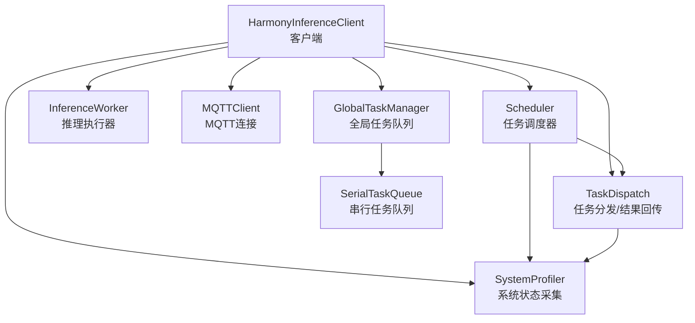
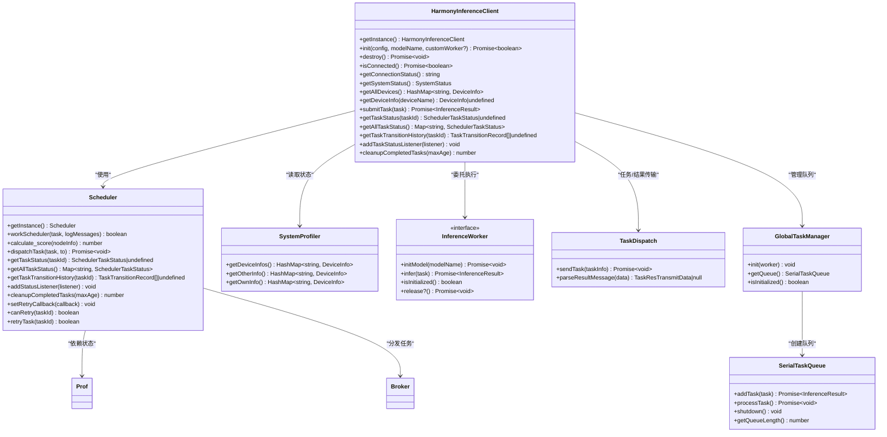
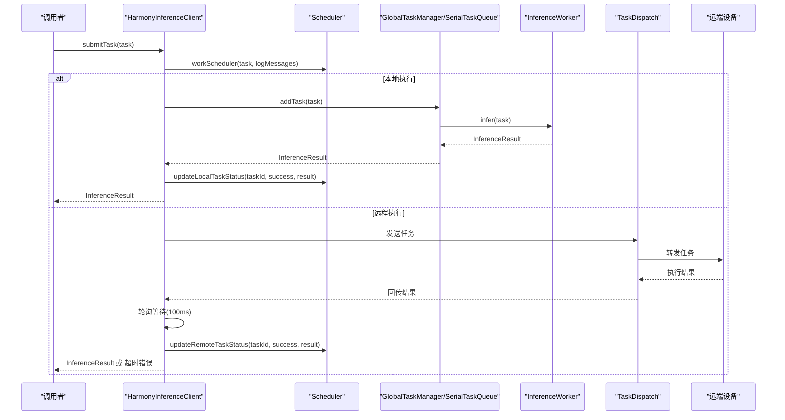
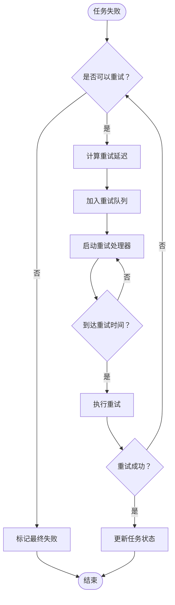
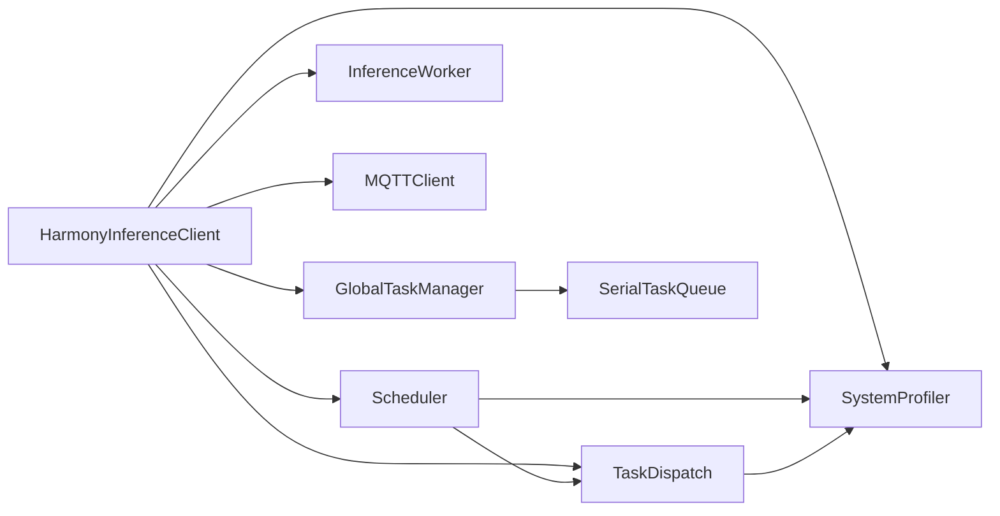
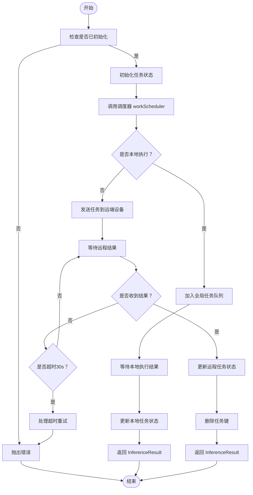

# HarmonyInferenceClient API

<cite>
**本文引用的文件列表**
- [HarmonyInferenceClient.ets](file://entry/src/main/ets/manager/HarmonyInferenceClient.ets)
- [Scheduler.ets](file://entry/src/main/ets/manager/scheduler/Scheduler.ets)
- [InferenceWorker.ets](file://entry/src/main/ets/manager/worker/InferenceWorker.ets)
- [SystemProfiler.ets](file://entry/src/main/ets/manager/monitor/SystemProfiler.ets)
- [GlobalTaskManager.ets](file://entry/src/main/ets/manager/worker/GlobalTaskManager.ets)
- [SerialTaskQueue.ets](file://entry/src/main/ets/manager/worker/SerialTaskQueue.ets)
- [TestClientPage.ets](file://entry/src/main/ets/pages/TestClientPage.ets)
- [ImageIdModelManager.ets](file://entry/src/main/ets/TestImageTask/ImageIdModelManager.ets)
- [TaskDispatch.ets](file://entry/src/main/ets/manager/broker/task/TaskDispatch.ets)
</cite>

## 更新摘要
**变更内容**
- 新增深度集成调度器的任务状态跟踪系统
- 添加统一的任务状态查询 API：`getTaskStatus()`、`getAllTaskStatus()`、`getTaskTransitionHistory()`
- 新增实时任务状态通知机制：`addTaskStatusListener()`
- 增强重试机制：完整的失败类型分类、指数退避策略、重试队列管理
- 新增任务状态清理功能：`cleanupCompletedTasks()`
- 更新任务提交流程以支持状态跟踪和重试机制

## 目录
1. [简介](#简介)
2. [项目结构](#项目结构)
3. [核心组件](#核心组件)
4. [架构总览](#架构总览)
5. [详细组件分析](#详细组件分析)
6. [任务状态管理系统](#任务状态管理系统)
7. [重试机制集成](#重试机制集成)
8. [依赖关系分析](#依赖关系分析)
9. [性能考量](#性能考量)
10. [故障排查指南](#故障排查指南)
11. [结论](#结论)
12. [附录](#附录)

## 简介
本文件为 HarmonyInferenceClient 类的详细 API 文档，覆盖其单例模式实现、初始化方法 init() 的配置参数与返回值、销毁方法 destroy() 的资源清理流程、连接状态检查方法 isConnected() 与 getConnectionStatus()、任务提交方法 submitTask() 的参数类型 InferenceTask、返回值 InferenceResult、异步处理机制与超时处理，以及系统状态获取方法 getSystemStatus()、getAllDevices()、getDeviceInfo() 的数据结构与使用场景。**特别新增**：深度集成调度器的任务状态跟踪系统，支持统一的任务状态查询、实时状态通知和完整的重试机制管理。

## 项目结构
HarmonyInferenceClient 位于管理模块中，负责统一协调 MQTT 通信、任务调度、推理执行与系统状态采集。其关键依赖包括：
- 任务与结果的数据结构定义（InferenceTask、InferenceResult）
- 任务调度器（Scheduler），基于系统状态评分决定本地或远程执行，提供完整的任务状态跟踪
- 系统状态采集器（SystemProfiler），提供设备信息与性能指标
- 推理执行器（InferenceWorker），抽象推理执行接口
- 任务分发与结果回传（TaskDispatch），用于跨设备传输
- 全局任务队列（GlobalTaskManager/SerialTaskQueue），管理本地任务执行

**图表来源**
- [HarmonyInferenceClient.ets:45-80](file://entry/src/main/ets/manager/HarmonyInferenceClient.ets#L45-L80)
- [Scheduler.ets:141-305](file://entry/src/main/ets/manager/scheduler/Scheduler.ets#L141-L305)
- [GlobalTaskManager.ets:4-27](file://entry/src/main/ets/manager/worker/GlobalTaskManager.ets#L4-L27)
- [SerialTaskQueue.ets:13-21](file://entry/src/main/ets/manager/worker/SerialTaskQueue.ets#L13-L21)

**章节来源**
- [HarmonyInferenceClient.ets:1-602](file://entry/src/main/ets/manager/HarmonyInferenceClient.ets#L1-L602)
- [Scheduler.ets:1-960](file://entry/src/main/ets/manager/scheduler/Scheduler.ets#L1-L960)
- [GlobalTaskManager.ets:1-27](file://entry/src/main/ets/manager/worker/GlobalTaskManager.ets#L1-L27)
- [SerialTaskQueue.ets:1-107](file://entry/src/main/ets/manager/worker/SerialTaskQueue.ets#L1-L107)

## 核心组件
- **单例模式**：通过静态 getInstance() 返回唯一实例，避免重复初始化带来的资源浪费
- **初始化 init(config, modelName, customWorker?)**：建立 MQTT 连接、注册事件监听、初始化模型与全局任务队列、启动设备状态同步
- **销毁 destroy()**：关闭 MQTT、释放推理执行器资源、移除事件监听、重置初始化状态
- **连接状态检查 isConnected()/getConnectionStatus()**：前者返回布尔值，后者返回字符串状态
- **系统状态获取 getSystemStatus()/getAllDevices()/getDeviceInfo()**：返回设备信息与性能指标
- **任务提交 submitTask(task)**：通过调度器判断本地或远程执行，本地走队列执行，远程则等待结果回传并带超时控制
- **任务状态管理**：**新增** 统一的任务状态查询、实时状态通知、任务流转历史记录
- **重试机制**：**新增** 完整的任务重试管理，包括失败类型分类、指数退避策略

**章节来源**
- [HarmonyInferenceClient.ets:45-602](file://entry/src/main/ets/manager/HarmonyInferenceClient.ets#L45-L602)
- [Scheduler.ets:131-960](file://entry/src/main/ets/manager/scheduler/Scheduler.ets#L131-L960)

## 架构总览
HarmonyInferenceClient 作为上层统一入口，内部组合多个子系统：
- **通信层**：MQTTClient 负责连接与事件订阅
- **调度层**：Scheduler 基于 SystemProfiler 的设备信息进行评分与任务分发，提供完整的任务状态跟踪
- **执行层**：InferenceWorker 抽象推理执行，支持本地模型与自定义 Worker
- **数据层**：TaskDispatch 负责任务与结果的跨设备传输
- **状态层**：SystemProfiler 采集设备 CPU、内存、存储、电量、网络延迟等指标
- **队列层**：GlobalTaskManager/SerialTaskQueue 管理本地任务执行队列

**图表来源**
- [HarmonyInferenceClient.ets:45-602](file://entry/src/main/ets/manager/HarmonyInferenceClient.ets#L45-L602)
- [Scheduler.ets:131-960](file://entry/src/main/ets/manager/scheduler/Scheduler.ets#L131-L960)
- [GlobalTaskManager.ets:4-27](file://entry/src/main/ets/manager/worker/GlobalTaskManager.ets#L4-L27)
- [SerialTaskQueue.ets:13-107](file://entry/src/main/ets/manager/worker/SerialTaskQueue.ets#L13-L107)

## 详细组件分析

### 单例模式实现
- 静态私有实例变量保存唯一实例
- getInstance() 方法在首次调用时创建实例，后续直接返回
- 构造函数私有化，防止外部直接 new

**章节来源**
- [HarmonyInferenceClient.ets:75-80](file://entry/src/main/ets/manager/HarmonyInferenceClient.ets#L75-L80)

### 初始化方法 init(config, modelName, customWorker?)
- **参数**
  - config: MQTTConfig，包含 url、clientId、userName、password、topic、qos
  - modelName: string，模型名称
  - customWorker?: InferenceWorker，可选自定义推理执行器，默认使用 ModelManager
- **返回值**
  - Promise<boolean>，初始化成功返回 true，失败返回 false
- **流程**
  - 设置 MQTTOption.clientId
  - 初始化 MQTT 客户端并启动连接状态定时检测
  - 注册事件监听器，处理设备状态、延迟、参数优化与任务分配等主题
  - 选择 customWorker 或默认 ModelManager，初始化模型
  - 初始化全局任务队列
  - 启动设备状态同步（每 10 秒更新一次）
  - **新增** 设置重试回调，启动重试资源管理

**章节来源**
- [HarmonyInferenceClient.ets:163-198](file://entry/src/main/ets/manager/HarmonyInferenceClient.ets#L163-L198)

### 销毁方法 destroy()
- **流程**
  - 若未初始化则直接返回
  - 关闭 MQTT 连接并置空
  - 调用 worker.release()（若存在）释放资源
  - 移除结果事件监听
  - **新增** 清理重试资源，停止设备状态同步
  - 重置 isInitialized 标记
- **异常**
  - 捕获错误并抛出包含原始错误信息的新 Error

**章节来源**
- [HarmonyInferenceClient.ets:200-233](file://entry/src/main/ets/manager/HarmonyInferenceClient.ets#L200-L233)

### 连接状态检查方法
- **isConnected(): Promise<boolean>**
  - 若无 MQTT 客户端实例，返回 false
  - 否则调用 mqttClient.isCon() 并返回结果
- **getConnectionStatus(): string**
  - 返回内部维护的连接状态字符串（Connected/Disconnected/Error）

**章节来源**
- [HarmonyInferenceClient.ets:236-244](file://entry/src/main/ets/manager/HarmonyInferenceClient.ets#L236-L244)

### 系统状态获取方法
- **getSystemStatus(): SystemStatus**
  - 返回包含 ownDevice、otherDevices、allDevices 的聚合状态
- **getAllDevices(): HashMap<string, DeviceInfo>**
  - 返回所有设备信息
- **getDeviceInfo(deviceName: string): DeviceInfo | undefined**
  - 根据设备名查询设备信息

**数据结构**
- **SystemStatus**
  - ownDevice: HashMap<string, DeviceInfo>
  - otherDevices: HashMap<string, DeviceInfo>
  - allDevices: HashMap<string, DeviceInfo>
- **DeviceInfo**
  - deviceName: string
  - batteryLevel: number
  - memoryUsage: number
  - cpuUsage: number
  - storageFree: number
  - latency: number

**使用场景**
- 展示设备列表与性能指标
- 任务调度前评估可用节点
- 监控设备健康状况

**章节来源**
- [HarmonyInferenceClient.ets:278-304](file://entry/src/main/ets/manager/HarmonyInferenceClient.ets#L278-L304)

### 任务提交方法 submitTask(task)
- **参数**
  - task: InferenceTask，必须为 InferenceTask 类型
- **返回值**
  - Promise<InferenceResult>，本地执行直接返回结果；远程执行通过轮询等待结果，超时后抛出错误
- **异步处理机制**
  - 调用 Scheduler.workScheduler 判断是否本地执行
  - 本地执行：通过 GlobalTaskManager.getQueue().addTask(task) 加入队列并等待结果
  - 远程执行：启动轮询（每 100ms）从 taskResultMap 中取出结果，30 秒超时后拒绝
- **超时处理**
  - 30 秒超时后抛出错误，提示"任务超时"
- **状态跟踪**
  - **新增** 通过 Scheduler 管理任务状态，支持实时状态查询和通知

**图表来源**
- [HarmonyInferenceClient.ets:395-481](file://entry/src/main/ets/manager/HarmonyInferenceClient.ets#L395-L481)
- [Scheduler.ets:208-281](file://entry/src/main/ets/manager/scheduler/Scheduler.ets#L208-L281)

**章节来源**
- [HarmonyInferenceClient.ets:395-481](file://entry/src/main/ets/manager/HarmonyInferenceClient.ets#L395-L481)

## 任务状态管理系统

### 统一任务状态查询
- **getTaskStatus(taskId): SchedulerTaskStatus | undefined**
  - 优先从 Scheduler 获取详细的调度状态，如果不存在则返回 undefined
- **getAllTaskStatus(): Map<string, SchedulerTaskStatus>**
  - 合并 Scheduler 中的调度状态和本地缓存状态
  - 返回所有任务状态的 Map 副本

### 任务流转历史记录
- **getTaskTransitionHistory(taskId: string): TaskTransitionRecord[] | undefined**
  - 获取指定任务的完整状态流转历史
  - 包含时间戳、状态变更、执行节点、变更说明等信息

### 实时状态通知
- **addTaskStatusListener(listener: (taskId: string, status: SchedulerTaskStatus) => void): void**
  - 注册任务状态变更监听器
  - 当任务状态发生变化时，自动通知所有监听器
  - 支持多个监听器同时监听

### 任务状态清理
- **cleanupCompletedTasks(maxAge: number = 3600000): number**
  - 清理已完成的任务记录
  - 默认保留1小时，超过时间的已完成/失败任务将被清理
  - 返回清理的任务数量

**章节来源**
- [HarmonyInferenceClient.ets:314-369](file://entry/src/main/ets/manager/HarmonyInferenceClient.ets#L314-L369)
- [Scheduler.ets:432-467](file://entry/src/main/ets/manager/scheduler/Scheduler.ets#L432-L467)
- [Scheduler.ets:474-493](file://entry/src/main/ets/manager/scheduler/Scheduler.ets#L474-L493)

## 重试机制集成

### 重试配置管理
- **setRetryConfig(config: Partial<RetryConfig>): void**
  - 设置重试配置，支持部分配置更新
- **getRetryConfig(): RetryConfig**
  - 获取当前重试配置的完整副本

### 重试状态查询
- **getTaskRetryCount(taskId: string): number**
  - 获取任务当前重试次数
- **canRetryTask(taskId: string): boolean**
  - 判断任务是否可以重试
- **retryTask(taskId: string): boolean**
  - 手动触发任务重试（仅失败状态的任务）

### 失败类型分类
- **handleLocalExecutionFailure(taskId: string, error: string): void**
  - 处理本地执行失败
- **handleRemoteExecutionFailure(taskId: string, error: string): void**
  - 处理远程执行失败
- **handleResultTimeout(taskId: string): void**
  - 处理结果接收超时
- **handleTransmissionFailure(taskId: string, error: string): void**
  - 处理任务传输失败

### 指数退避策略
- **calculateRetryDelay(retryCount: number): number**
  - 使用指数退避策略计算重试延迟
  - 支持随机抖动，避免雪崩效应
  - 默认基础延迟1000ms，最大延迟10000ms

**图表来源**
- [Scheduler.ets:710-765](file://entry/src/main/ets/manager/scheduler/Scheduler.ets#L710-L765)
- [Scheduler.ets:771-829](file://entry/src/main/ets/manager/scheduler/Scheduler.ets#L771-L829)

**章节来源**
- [HarmonyInferenceClient.ets:489-598](file://entry/src/main/ets/manager/HarmonyInferenceClient.ets#L489-L598)
- [Scheduler.ets:636-957](file://entry/src/main/ets/manager/scheduler/Scheduler.ets#L636-L957)

## 依赖关系分析
- **组件耦合**
  - HarmonyInferenceClient 与 Scheduler、SystemProfiler、InferenceWorker、TaskDispatch、GlobalTaskManager 存在强依赖
  - 通过接口与事件解耦，便于替换与扩展
  - **新增** Scheduler 作为核心状态管理中心，深度集成到整个系统架构中
- **外部依赖**
  - MQTTClient：负责连接与事件订阅
  - SystemProfiler：采集设备状态
  - InferenceWorker：抽象推理执行
  - TaskDispatch：任务与结果传输
  - GlobalTaskManager/SerialTaskQueue：本地任务队列管理

**图表来源**
- [HarmonyInferenceClient.ets:45-602](file://entry/src/main/ets/manager/HarmonyInferenceClient.ets#L45-L602)
- [Scheduler.ets:131-960](file://entry/src/main/ets/manager/scheduler/Scheduler.ets#L131-L960)
- [GlobalTaskManager.ets:4-27](file://entry/src/main/ets/manager/worker/GlobalTaskManager.ets#L4-L27)

**章节来源**
- [HarmonyInferenceClient.ets:1-602](file://entry/src/main/ets/manager/HarmonyInferenceClient.ets#L1-L602)
- [Scheduler.ets:1-960](file://entry/src/main/ets/manager/scheduler/Scheduler.ets#L1-L960)

## 性能考量
- **连接状态轮询**：每 10 秒检查一次 MQTT 连接，建议根据实际网络环境调整频率
- **任务轮询间隔**：远程任务轮询间隔为 100ms，超时时间为 30 秒，平衡了响应速度与资源消耗
- **调度评分**：基于 CPU、内存、电量、存储、延迟等指标加权评分，合理分配任务负载
- **队列处理**：串行队列保证任务有序执行，避免并发冲突
- **状态跟踪开销**：任务状态管理会增加内存占用，可通过 cleanupCompletedTasks 定期清理
- **重试队列管理**：重试处理器每 200ms 检查一次，避免频繁轮询造成性能问题

## 故障排查指南
- **初始化失败**
  - 检查 MQTT 配置（url、clientId、用户名/密码、topic、qos）
  - 确认模型名称与路径正确
  - 查看控制台输出的错误信息
- **连接异常**
  - 使用 isConnected() 与 getConnectionStatus() 检查连接状态
  - 确认网络连通性与 MQTT 服务可用
- **任务超时**
  - 检查远端设备是否正常运行与网络延迟
  - 调整超时时间或优化任务执行时间
  - **新增** 检查重试机制是否正常工作
- **状态查询异常**
  - **新增** 确认 Scheduler 是否正确初始化
  - 检查任务 ID 是否正确传递
  - 验证状态监听器是否正确注册
- **资源释放**
  - 调用 destroy() 后确认 MQTT 已断开、事件监听已移除、Worker 资源已释放
  - **新增** 确认重试队列已清理，定时器已停止

**章节来源**
- [HarmonyInferenceClient.ets:200-233](file://entry/src/main/ets/manager/HarmonyInferenceClient.ets#L200-L233)
- [HarmonyInferenceClient.ets:236-244](file://entry/src/main/ets/manager/HarmonyInferenceClient.ets#L236-L244)
- [HarmonyInferenceClient.ets:476-481](file://entry/src/main/ets/manager/HarmonyInferenceClient.ets#L476-L481)

## 结论
HarmonyInferenceClient 提供了统一的推理客户端入口，结合调度与系统状态采集实现智能的任务分发与执行。**最新版本**深度集成了调度器的任务状态跟踪系统，提供了统一的任务状态查询、实时状态通知和完整的重试机制管理。其单例设计、完善的生命周期管理与异步超时机制，使其适用于多设备协同的推理场景。通过清晰的接口与事件驱动架构，开发者可以便捷地集成与扩展推理能力，同时获得完整的任务状态可视化和故障诊断支持。

## 附录

### API 参考摘要
- **单例**
  - getInstance(): HarmonyInferenceClient
- **初始化**
  - init(config: MQTTConfig, modelName: string, customWorker?: InferenceWorker): Promise<boolean>
- **销毁**
  - destroy(): Promise<void>
- **连接状态**
  - isConnected(): Promise<boolean>
  - getConnectionStatus(): string
- **系统状态**
  - getSystemStatus(): SystemStatus
  - getAllDevices(): HashMap<string, DeviceInfo>
  - getDeviceInfo(deviceName: string): DeviceInfo | undefined
- **任务提交**
  - submitTask(task: InferenceTask): Promise<InferenceResult>
- **任务状态管理**（**新增**）
  - getTaskStatus(taskId: string): SchedulerTaskStatus | undefined
  - getAllTaskStatus(): Map<string, SchedulerTaskStatus>
  - getTaskTransitionHistory(taskId: string): TaskTransitionRecord[] | undefined
  - addTaskStatusListener(listener: (taskId: string, status: SchedulerTaskStatus) => void): void
  - cleanupCompletedTasks(maxAge?: number): number
- **重试机制**（**新增**）
  - setRetryConfig(config: Partial<RetryConfig>): void
  - getRetryConfig(): RetryConfig
  - getTaskRetryCount(taskId: string): number
  - canRetryTask(taskId: string): boolean
  - retryTask(taskId: string): boolean

**章节来源**
- [HarmonyInferenceClient.ets:75-80](file://entry/src/main/ets/manager/HarmonyInferenceClient.ets#L75-L80)
- [HarmonyInferenceClient.ets:163-198](file://entry/src/main/ets/manager/HarmonyInferenceClient.ets#L163-L198)
- [HarmonyInferenceClient.ets:200-233](file://entry/src/main/ets/manager/HarmonyInferenceClient.ets#L200-L233)
- [HarmonyInferenceClient.ets:236-244](file://entry/src/main/ets/manager/HarmonyInferenceClient.ets#L236-L244)
- [HarmonyInferenceClient.ets:278-304](file://entry/src/main/ets/manager/HarmonyInferenceClient.ets#L278-L304)
- [HarmonyInferenceClient.ets:395-481](file://entry/src/main/ets/manager/HarmonyInferenceClient.ets#L395-L481)
- [HarmonyInferenceClient.ets:314-369](file://entry/src/main/ets/manager/HarmonyInferenceClient.ets#L314-L369)
- [HarmonyInferenceClient.ets:561-598](file://entry/src/main/ets/manager/HarmonyInferenceClient.ets#L561-L598)

### 数据结构参考
- **InferenceTask**
  - taskId: string
  - modelName?: string
  - type: InferenceInputType
  - data: ImageInputData | TextInputData | AudioInputData | ArrayBuffer
  - params?: Record<string, string | number | boolean | ArrayBuffer>
- **InferenceResult**
  - success: boolean
  - message?: string
  - result?: ImageResult | TextResult | AudioResult | CustomResult
- **SystemStatus**
  - ownDevice: HashMap<string, DeviceInfo>
  - otherDevices: HashMap<string, DeviceInfo>
  - allDevices: HashMap<string, DeviceInfo>
- **DeviceInfo**
  - deviceName: string
  - batteryLevel: number
  - memoryUsage: number
  - cpuUsage: number
  - storageFree: number
  - latency: number
- **SchedulerTaskStatus**（**新增**）
  - taskId: string
  - status: TaskScheduleStatus
  - createdAt: number
  - updatedAt: number
  - targetNode?: string
  - result?: InferenceResult
  - error?: string
  - transitionHistory: TaskTransitionRecord[]
  - retryCount: number
  - maxRetries: number
  - lastFailureReason?: string
  - lastFailureType?: FailureType
  - originalTask?: InferenceTask
- **TaskTransitionRecord**（**新增**）
  - timestamp: number
  - status: TaskScheduleStatus
  - node: string
  - message?: string
- **RetryConfig**（**新增**）
  - maxRetries: number
  - baseDelayMs: number
  - maxDelayMs: number
  - exponentialBackoff: boolean

**章节来源**
- [InferenceWorker.ets:1-90](file://entry/src/main/ets/manager/worker/InferenceWorker.ets#L1-L90)
- [SystemProfiler.ets:10-33](file://entry/src/main/ets/manager/monitor/SystemProfiler.ets#L10-L33)
- [HarmonyInferenceClient.ets:35-48](file://entry/src/main/ets/manager/HarmonyInferenceClient.ets#L35-L48)
- [Scheduler.ets:99-129](file://entry/src/main/ets/manager/scheduler/Scheduler.ets#L99-L129)
- [Scheduler.ets:87-96](file://entry/src/main/ets/manager/scheduler/Scheduler.ets#L87-L96)
- [Scheduler.ets:38-47](file://entry/src/main/ets/manager/scheduler/Scheduler.ets#L38-L47)

### 使用示例（代码片段路径）
- **初始化客户端**
  - 示例路径：[TestClientPage.ets:90-96](file://entry/src/main/ets/pages/TestClientPage.ets#L90-L96)
- **检查连接状态**
  - 示例路径：[TestClientPage.ets:99-104](file://entry/src/main/ets/pages/TestClientPage.ets#L99-L104)
- **获取系统状态**
  - 示例路径：[TestClientPage.ets:107-111](file://entry/src/main/ets/pages/TestClientPage.ets#L107-L111)
- **提交推理任务**
  - 示例路径：[TestClientPage.ets:130-145](file://entry/src/main/ets/pages/TestClientPage.ets#L130-L145)
- **销毁客户端**
  - 示例路径：[TestClientPage.ets:154-160](file://entry/src/main/ets/pages/TestClientPage.ets#L154-L160)
- **任务状态查询**（**新增**）
  - 示例路径：[TestClientPage.ets:130-145](file://entry/src/main/ets/pages/TestClientPage.ets#L130-L145)
- **实时状态监听**（**新增**）
  - 示例路径：[TestClientPage.ets:130-145](file://entry/src/main/ets/pages/TestClientPage.ets#L130-L145)

### 任务提交流程图

**图表来源**
- [HarmonyInferenceClient.ets:395-481](file://entry/src/main/ets/manager/HarmonyInferenceClient.ets#L395-L481)
- [Scheduler.ets:208-281](file://entry/src/main/ets/manager/scheduler/Scheduler.ets#L208-L281)