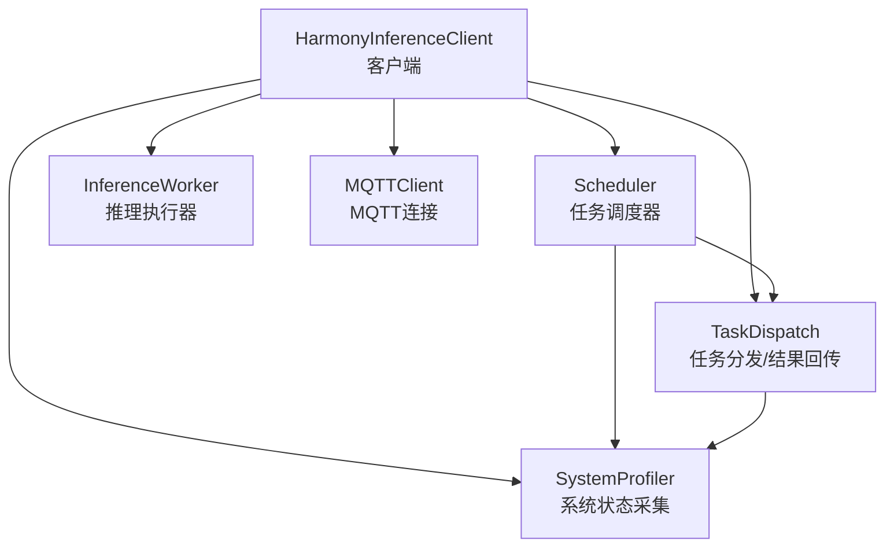
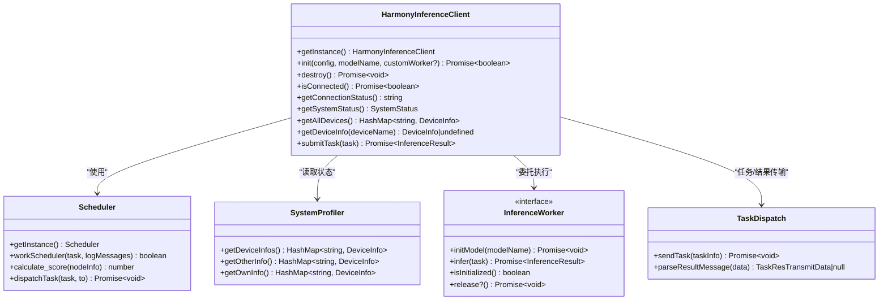
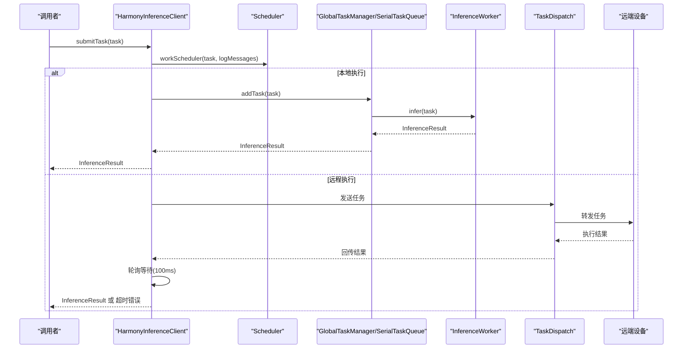
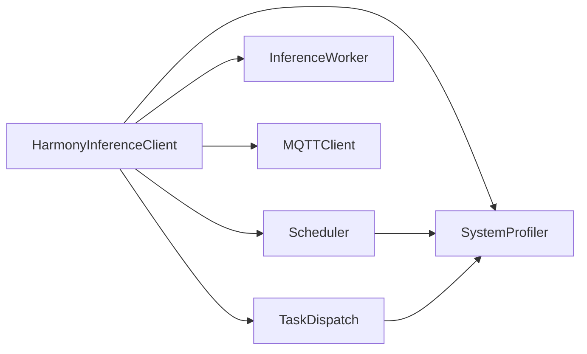
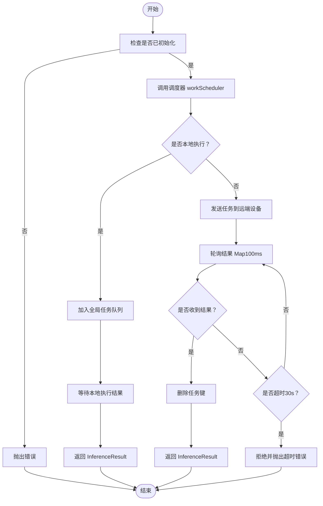

# HarmonyInferenceClient API

<cite>
**本文引用的文件列表**
- [HarmonyInferenceClient.ets](file://entry/src/main/ets/manager/HarmonyInferenceClient.ets)
- [InferenceWorker.ets](file://entry/src/main/ets/manager/worker/InferenceWorker.ets)
- [Scheduler.ets](file://entry/src/main/ets/manager/scheduler/Scheduler.ets)
- [SystemProfiler.ets](file://entry/src/main/ets/manager/monitor/SystemProfiler.ets)
- [TestClientPage.ets](file://entry/src/main/ets/pages/TestClientPage.ets)
- [ImageIdModelManager.ets](file://entry/src/main/ets/TestImageTask/ImageIdModelManager.ets)
- [TaskDispatch.ets](file://entry/src/main/ets/manager/broker/task/TaskDispatch.ets)
</cite>

## 目录
1. [简介](#简介)
2. [项目结构](#项目结构)
3. [核心组件](#核心组件)
4. [架构总览](#架构总览)
5. [详细组件分析](#详细组件分析)
6. [依赖关系分析](#依赖关系分析)
7. [性能考量](#性能考量)
8. [故障排查指南](#故障排查指南)
9. [结论](#结论)
10. [附录](#附录)

## 简介
本文件为 HarmonyInferenceClient 类的详细 API 文档，覆盖其单例模式实现、初始化方法 init() 的配置参数与返回值、销毁方法 destroy() 的资源清理流程、连接状态检查方法 isConnected() 与 getConnectionStatus()、任务提交方法 submitTask() 的参数类型 InferenceTask、返回值 InferenceResult、异步处理机制与超时处理，以及系统状态获取方法 getSystemStatus()、getAllDevices()、getDeviceInfo() 的数据结构与使用场景。同时提供完整示例路径，展示如何正确初始化客户端、提交推理任务与处理结果。

## 项目结构
HarmonyInferenceClient 位于管理模块中，负责统一协调 MQTT 通信、任务调度、推理执行与系统状态采集。其关键依赖包括：
- 任务与结果的数据结构定义（InferenceTask、InferenceResult）
- 任务调度器（Scheduler），基于系统状态评分决定本地或远程执行
- 系统状态采集器（SystemProfiler），提供设备信息与性能指标
- 推理执行器（InferenceWorker），抽象推理执行接口
- 任务分发与结果回传（TaskDispatch），用于跨设备传输

图表来源
- [HarmonyInferenceClient.ets](file://entry/src/main/ets/manager/HarmonyInferenceClient.ets#L52-L357)
- [Scheduler.ets](file://entry/src/main/ets/manager/scheduler/Scheduler.ets#L14-L105)
- [SystemProfiler.ets](file://entry/src/main/ets/manager/monitor/SystemProfiler.ets#L43-L120)
- [InferenceWorker.ets](file://entry/src/main/ets/manager/worker/InferenceWorker.ets#L75-L90)
- [TaskDispatch.ets](file://entry/src/main/ets/manager/broker/task/TaskDispatch.ets#L98-L102)

章节来源
- [HarmonyInferenceClient.ets](file://entry/src/main/ets/manager/HarmonyInferenceClient.ets#L1-L357)
- [Scheduler.ets](file://entry/src/main/ets/manager/scheduler/Scheduler.ets#L1-L105)
- [SystemProfiler.ets](file://entry/src/main/ets/manager/monitor/SystemProfiler.ets#L1-L120)
- [InferenceWorker.ets](file://entry/src/main/ets/manager/worker/InferenceWorker.ets#L1-L90)
- [TaskDispatch.ets](file://entry/src/main/ets/manager/broker/task/TaskDispatch.ets#L1-L102)

## 核心组件
- 单例模式：通过静态 getInstance() 返回唯一实例，避免重复初始化带来的资源浪费。
- 初始化 init(config, modelName, customWorker?)：建立 MQTT 连接、注册事件监听、初始化模型与全局任务队列、启动设备状态同步。
- 销毁 destroy()：关闭 MQTT、释放推理执行器资源、移除事件监听、重置初始化状态。
- 连接状态检查 isConnected()/getConnectionStatus()：前者返回布尔值，后者返回字符串状态。
- 系统状态获取 getSystemStatus()/getAllDevices()/getDeviceInfo()：返回设备信息与性能指标。
- 任务提交 submitTask(task)：通过调度器判断本地或远程执行，本地走队列执行，远程则等待结果回传并带超时控制。

章节来源
- [HarmonyInferenceClient.ets](file://entry/src/main/ets/manager/HarmonyInferenceClient.ets#L52-L357)
- [InferenceWorker.ets](file://entry/src/main/ets/manager/worker/InferenceWorker.ets#L1-L90)
- [Scheduler.ets](file://entry/src/main/ets/manager/scheduler/Scheduler.ets#L14-L105)
- [SystemProfiler.ets](file://entry/src/main/ets/manager/monitor/SystemProfiler.ets#L43-L120)
- [TaskDispatch.ets](file://entry/src/main/ets/manager/broker/task/TaskDispatch.ets#L98-L102)

## 架构总览
HarmonyInferenceClient 作为上层统一入口，内部组合多个子系统：
- 通信层：MQTTClient 负责连接与事件订阅
- 调度层：Scheduler 基于 SystemProfiler 的设备信息进行评分与任务分发
- 执行层：InferenceWorker 抽象推理执行，支持本地模型与自定义 Worker
- 数据层：TaskDispatch 负责任务与结果的跨设备传输
- 状态层：SystemProfiler 采集设备 CPU、内存、存储、电量、网络延迟等指标

图表来源
- [HarmonyInferenceClient.ets](file://entry/src/main/ets/manager/HarmonyInferenceClient.ets#L52-L357)
- [Scheduler.ets](file://entry/src/main/ets/manager/scheduler/Scheduler.ets#L14-L105)
- [SystemProfiler.ets](file://entry/src/main/ets/manager/monitor/SystemProfiler.ets#L43-L120)
- [InferenceWorker.ets](file://entry/src/main/ets/manager/worker/InferenceWorker.ets#L75-L90)
- [TaskDispatch.ets](file://entry/src/main/ets/manager/broker/task/TaskDispatch.ets#L98-L102)

## 详细组件分析

### 单例模式实现
- 静态私有实例变量保存唯一实例
- getInstance() 方法在首次调用时创建实例，后续直接返回
- 构造函数私有化，防止外部直接 new

章节来源
- [HarmonyInferenceClient.ets](file://entry/src/main/ets/manager/HarmonyInferenceClient.ets#L74-L80)
- [HarmonyInferenceClient.ets](file://entry/src/main/ets/manager/HarmonyInferenceClient.ets#L67-L72)

### 初始化方法 init(config, modelName, customWorker?)
- 参数
  - config: MQTTConfig，包含 url、clientId、userName、password、topic、qos
  - modelName: string，模型名称
  - customWorker?: InferenceWorker，可选自定义推理执行器，默认使用 ModelManager
- 返回值
  - Promise<boolean>，初始化成功返回 true，失败返回 false
- 流程
  - 设置 MQTTOption.clientId
  - 初始化 MQTT 客户端并启动连接状态定时检测
  - 注册事件监听器，处理设备状态、延迟、参数优化与任务分配等主题
  - 选择 customWorker 或默认 ModelManager，初始化模型
  - 初始化全局任务队列
  - 启动设备状态同步（每 10 秒更新一次）

章节来源
- [HarmonyInferenceClient.ets](file://entry/src/main/ets/manager/HarmonyInferenceClient.ets#L163-L196)
- [HarmonyInferenceClient.ets](file://entry/src/main/ets/manager/HarmonyInferenceClient.ets#L83-L114)
- [HarmonyInferenceClient.ets](file://entry/src/main/ets/manager/HarmonyInferenceClient.ets#L116-L154)

### 销毁方法 destroy()
- 流程
  - 若未初始化则直接返回
  - 关闭 MQTT 连接并置空
  - 调用 worker.release()（若存在）释放资源
  - 移除结果事件监听
  - 重置 isInitialized 标记
- 异常
  - 捕获错误并抛出包含原始错误信息的新 Error

章节来源
- [HarmonyInferenceClient.ets](file://entry/src/main/ets/manager/HarmonyInferenceClient.ets#L198-L225)

### 连接状态检查方法
- isConnected(): Promise<boolean>
  - 若无 MQTT 客户端实例，返回 false
  - 否则调用 mqttClient.isCon() 并返回结果
- getConnectionStatus(): string
  - 返回内部维护的连接状态字符串（Connected/Disconnected/Error）

章节来源
- [HarmonyInferenceClient.ets](file://entry/src/main/ets/manager/HarmonyInferenceClient.ets#L228-L236)
- [HarmonyInferenceClient.ets](file://entry/src/main/ets/manager/HarmonyInferenceClient.ets#L98-L108)

### 系统状态获取方法
- getSystemStatus(): SystemStatus
  - 返回包含 ownDevice、otherDevices、allDevices 的聚合状态
- getAllDevices(): HashMap<string, DeviceInfo>
  - 返回所有设备信息
- getDeviceInfo(deviceName: string): DeviceInfo | undefined
  - 根据设备名查询设备信息

数据结构
- SystemStatus
  - ownDevice: HashMap<string, DeviceInfo>
  - otherDevices: HashMap<string, DeviceInfo>
  - allDevices: HashMap<string, DeviceInfo>
- DeviceInfo
  - deviceName: string
  - batteryLevel: number
  - memoryUsage: number
  - cpuUsage: number
  - storageFree: number
  - latency: number

使用场景
- 展示设备列表与性能指标
- 任务调度前评估可用节点
- 监控设备健康状况

章节来源
- [HarmonyInferenceClient.ets](file://entry/src/main/ets/manager/HarmonyInferenceClient.ets#L256-L282)
- [SystemProfiler.ets](file://entry/src/main/ets/manager/monitor/SystemProfiler.ets#L10-L33)
- [SystemProfiler.ets](file://entry/src/main/ets/manager/monitor/SystemProfiler.ets#L43-L120)

### 任务提交方法 submitTask(task)
- 参数
  - task: InferenceTask，必须为 InferenceTask 类型
- 返回值
  - Promise<InferenceResult>，本地执行直接返回结果；远程执行通过轮询等待结果，超时后抛出错误
- 异步处理机制
  - 调用 Scheduler.workScheduler 判断是否本地执行
  - 本地执行：通过 GlobalTaskManager.getQueue().addTask(task) 加入队列并等待结果
  - 远程执行：启动轮询（每 100ms）从 taskResultMap 中取出结果，30 秒超时后拒绝
- 超时处理
  - 30 秒超时后抛出错误，提示“任务超时”

图表来源
- [HarmonyInferenceClient.ets](file://entry/src/main/ets/manager/HarmonyInferenceClient.ets#L309-L353)
- [Scheduler.ets](file://entry/src/main/ets/manager/scheduler/Scheduler.ets#L30-L57)
- [TaskDispatch.ets](file://entry/src/main/ets/manager/broker/task/TaskDispatch.ets#L98-L102)

章节来源
- [HarmonyInferenceClient.ets](file://entry/src/main/ets/manager/HarmonyInferenceClient.ets#L309-L353)
- [Scheduler.ets](file://entry/src/main/ets/manager/scheduler/Scheduler.ets#L30-L57)
- [TaskDispatch.ets](file://entry/src/main/ets/manager/broker/task/TaskDispatch.ets#L98-L102)

### 任务状态与结果处理
- 任务状态查询
  - getTaskStatus(taskId): TaskStatus | undefined
  - getAllTaskStatus(): Map<string, TaskStatus>
- 结果处理
  - 通过事件监听器接收结果消息，解析为 TaskResTransmitData 并存入 taskResultMap
  - submitTask 在远程执行分支中轮询该 Map 获取结果

章节来源
- [HarmonyInferenceClient.ets](file://entry/src/main/ets/manager/HarmonyInferenceClient.ets#L285-L306)
- [HarmonyInferenceClient.ets](file://entry/src/main/ets/manager/HarmonyInferenceClient.ets#L294-L306)

## 依赖关系分析
- 组件耦合
  - HarmonyInferenceClient 与 Scheduler、SystemProfiler、InferenceWorker、TaskDispatch 存在强依赖
  - 通过接口与事件解耦，便于替换与扩展
- 外部依赖
  - MQTTClient：负责连接与事件订阅
  - SystemProfiler：采集设备状态
  - InferenceWorker：抽象推理执行
  - TaskDispatch：任务与结果传输

图表来源
- [HarmonyInferenceClient.ets](file://entry/src/main/ets/manager/HarmonyInferenceClient.ets#L52-L357)
- [Scheduler.ets](file://entry/src/main/ets/manager/scheduler/Scheduler.ets#L14-L105)
- [SystemProfiler.ets](file://entry/src/main/ets/manager/monitor/SystemProfiler.ets#L43-L120)
- [TaskDispatch.ets](file://entry/src/main/ets/manager/broker/task/TaskDispatch.ets#L98-L102)

章节来源
- [HarmonyInferenceClient.ets](file://entry/src/main/ets/manager/HarmonyInferenceClient.ets#L1-L357)
- [Scheduler.ets](file://entry/src/main/ets/manager/scheduler/Scheduler.ets#L1-L105)
- [SystemProfiler.ets](file://entry/src/main/ets/manager/monitor/SystemProfiler.ets#L1-L120)
- [TaskDispatch.ets](file://entry/src/main/ets/manager/broker/task/TaskDispatch.ets#L1-L102)

## 性能考量
- 连接状态轮询：每 10 秒检查一次 MQTT 连接，建议根据实际网络环境调整频率
- 任务轮询间隔：远程任务轮询间隔为 100ms，超时时间为 30 秒，平衡了响应速度与资源消耗
- 调度评分：基于 CPU、内存、电量、存储、延迟等指标加权评分，合理分配任务负载
- 队列处理：串行队列保证任务有序执行，避免并发冲突

[本节为通用性能建议，无需特定文件引用]

## 故障排查指南
- 初始化失败
  - 检查 MQTT 配置（url、clientId、用户名/密码、topic、qos）
  - 确认模型名称与路径正确
  - 查看控制台输出的错误信息
- 连接异常
  - 使用 isConnected() 与 getConnectionStatus() 检查连接状态
  - 确认网络连通性与 MQTT 服务可用
- 任务超时
  - 检查远端设备是否正常运行与网络延迟
  - 调整超时时间或优化任务执行时间
- 资源释放
  - 调用 destroy() 后确认 MQTT 已断开、事件监听已移除、Worker 资源已释放

章节来源
- [HarmonyInferenceClient.ets](file://entry/src/main/ets/manager/HarmonyInferenceClient.ets#L198-L225)
- [HarmonyInferenceClient.ets](file://entry/src/main/ets/manager/HarmonyInferenceClient.ets#L228-L236)
- [HarmonyInferenceClient.ets](file://entry/src/main/ets/manager/HarmonyInferenceClient.ets#L342-L346)

## 结论
HarmonyInferenceClient 提供了统一的推理客户端入口，结合调度与系统状态采集实现智能的任务分发与执行。其单例设计、完善的生命周期管理与异步超时机制，使其适用于多设备协同的推理场景。通过清晰的接口与事件驱动架构，开发者可以便捷地集成与扩展推理能力。

[本节为总结性内容，无需特定文件引用]

## 附录

### API 参考摘要
- 单例
  - getInstance(): HarmonyInferenceClient
- 初始化
  - init(config: MQTTConfig, modelName: string, customWorker?: InferenceWorker): Promise<boolean>
- 销毁
  - destroy(): Promise<void>
- 连接状态
  - isConnected(): Promise<boolean>
  - getConnectionStatus(): string
- 系统状态
  - getSystemStatus(): SystemStatus
  - getAllDevices(): HashMap<string, DeviceInfo>
  - getDeviceInfo(deviceName: string): DeviceInfo | undefined
- 任务提交
  - submitTask(task: InferenceTask): Promise<InferenceResult>

章节来源
- [HarmonyInferenceClient.ets](file://entry/src/main/ets/manager/HarmonyInferenceClient.ets#L74-L80)
- [HarmonyInferenceClient.ets](file://entry/src/main/ets/manager/HarmonyInferenceClient.ets#L163-L196)
- [HarmonyInferenceClient.ets](file://entry/src/main/ets/manager/HarmonyInferenceClient.ets#L198-L225)
- [HarmonyInferenceClient.ets](file://entry/src/main/ets/manager/HarmonyInferenceClient.ets#L228-L236)
- [HarmonyInferenceClient.ets](file://entry/src/main/ets/manager/HarmonyInferenceClient.ets#L256-L282)
- [HarmonyInferenceClient.ets](file://entry/src/main/ets/manager/HarmonyInferenceClient.ets#L309-L353)

### 数据结构参考
- InferenceTask
  - taskId: string
  - modelName?: string
  - type: InferenceInputType
  - data: ImageInputData | TextInputData | AudioInputData | ArrayBuffer
  - params?: Record<string, string | number | boolean | ArrayBuffer>
- InferenceResult
  - success: boolean
  - message?: string
  - result?: ImageResult | TextResult | AudioResult | CustomResult
- SystemStatus
  - ownDevice: HashMap<string, DeviceInfo>
  - otherDevices: HashMap<string, DeviceInfo>
  - allDevices: HashMap<string, DeviceInfo>
- DeviceInfo
  - deviceName: string
  - batteryLevel: number
  - memoryUsage: number
  - cpuUsage: number
  - storageFree: number
  - latency: number

章节来源
- [InferenceWorker.ets](file://entry/src/main/ets/manager/worker/InferenceWorker.ets#L2-L90)
- [SystemProfiler.ets](file://entry/src/main/ets/manager/monitor/SystemProfiler.ets#L10-L33)
- [HarmonyInferenceClient.ets](file://entry/src/main/ets/manager/HarmonyInferenceClient.ets#L35-L48)

### 使用示例（代码片段路径）
- 初始化客户端
  - 示例路径：[TestClientPage.ets](file://entry/src/main/ets/pages/TestClientPage.ets#L54-L61)
- 检查连接状态
  - 示例路径：[TestClientPage.ets](file://entry/src/main/ets/pages/TestClientPage.ets#L64-L69)
- 获取系统状态
  - 示例路径：[TestClientPage.ets](file://entry/src/main/ets/pages/TestClientPage.ets#L72-L76)
- 提交推理任务
  - 示例路径：[TestClientPage.ets](file://entry/src/main/ets/pages/TestClientPage.ets#L95-L110)
- 销毁客户端
  - 示例路径：[TestClientPage.ets](file://entry/src/main/ets/pages/TestClientPage.ets#L119-L125)

### 任务提交流程图

图表来源
- [HarmonyInferenceClient.ets](file://entry/src/main/ets/manager/HarmonyInferenceClient.ets#L309-L353)
- [Scheduler.ets](file://entry/src/main/ets/manager/scheduler/Scheduler.ets#L30-L57)