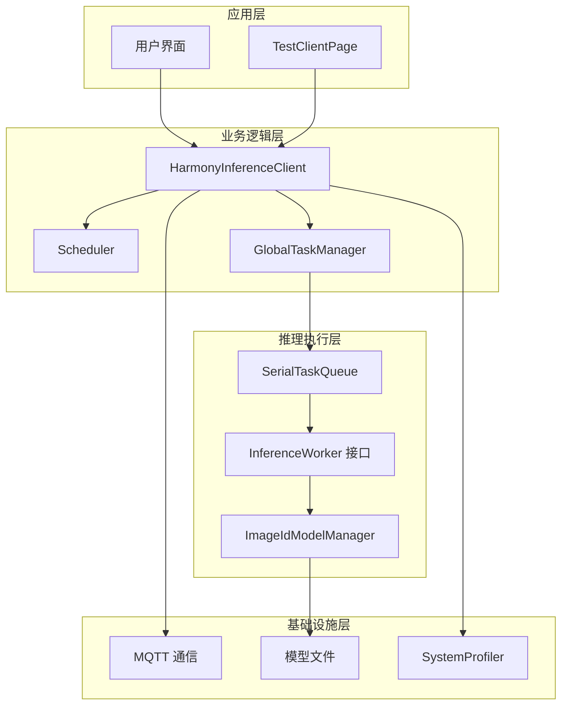
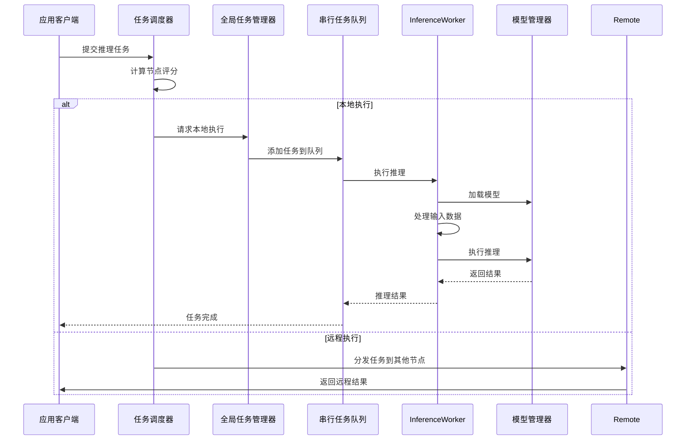
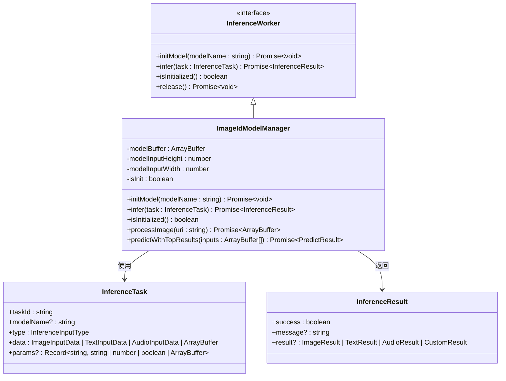
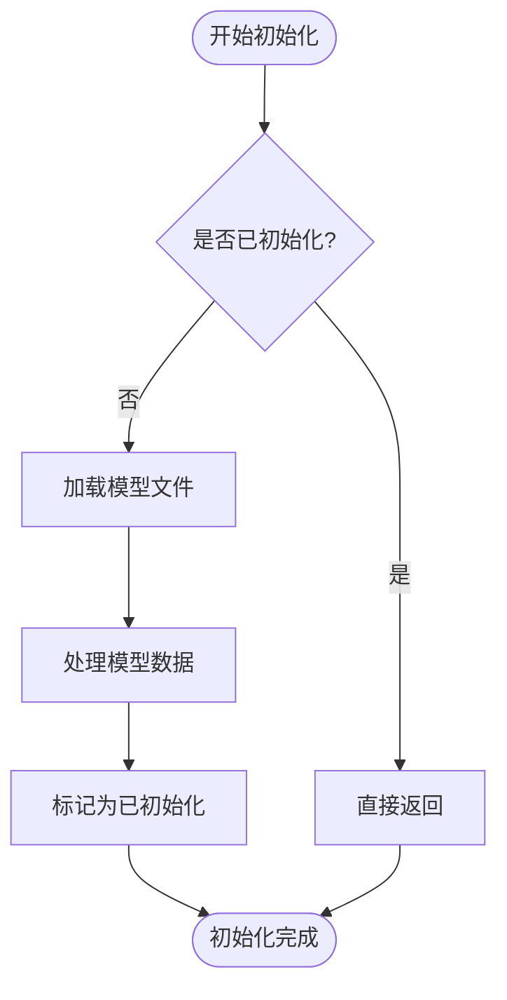
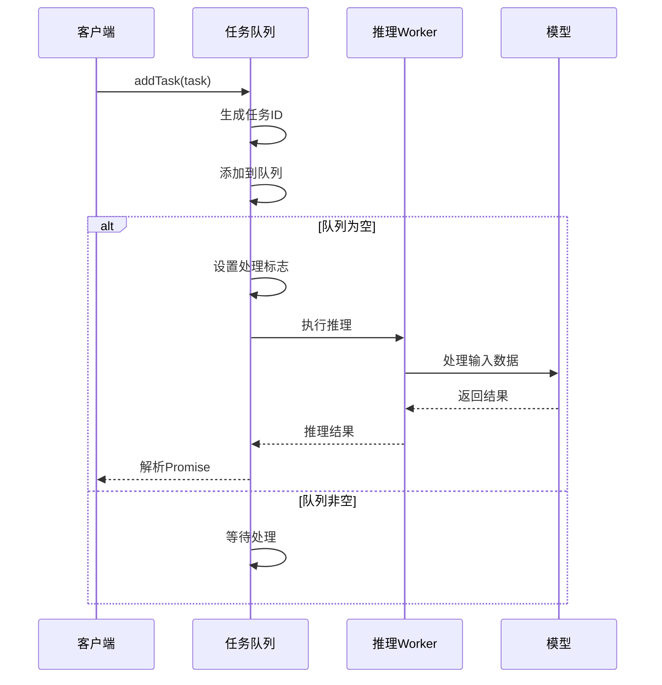
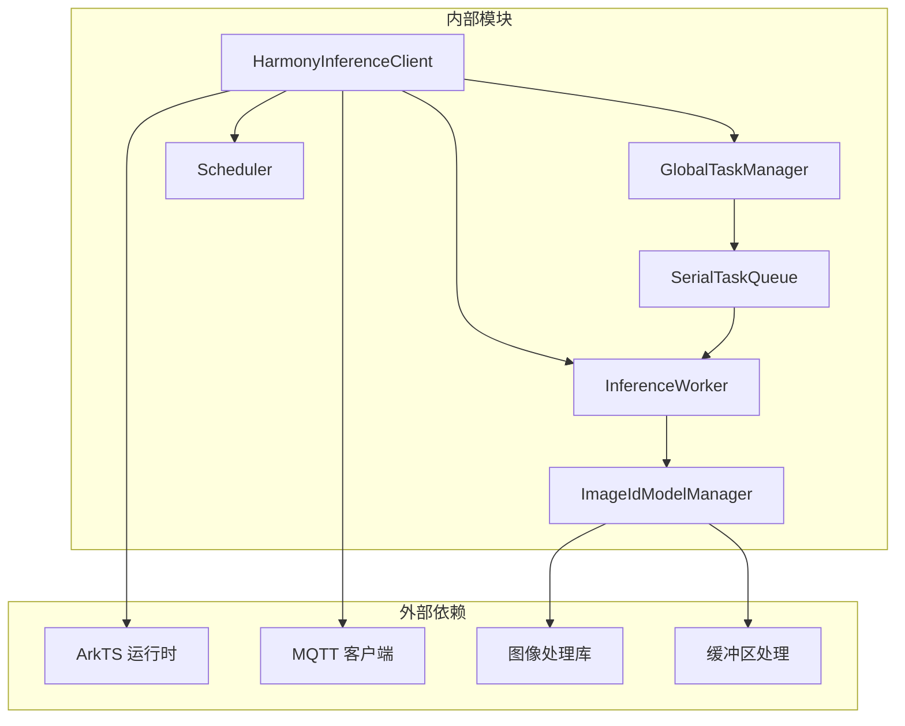
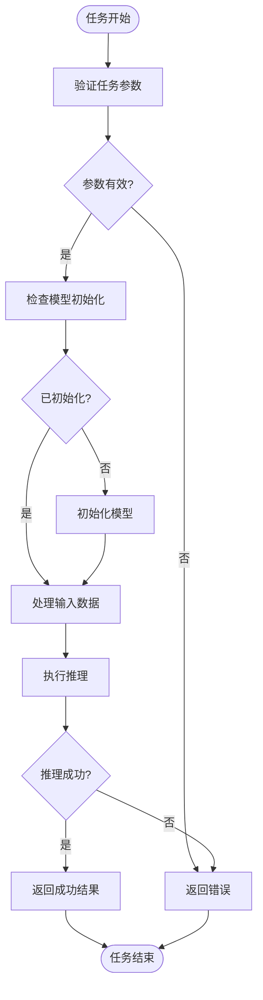

# InferenceWorker 接口

<cite>
**本文档引用的文件**
- [InferenceWorker.ets](file://entry/src/main/ets/manager/worker/InferenceWorker.ets)
- [HarmonyInferenceClient.ets](file://entry/src/main/ets/manager/HarmonyInferenceClient.ets)
- [ImageIdModelManager.ets](file://entry/src/main/ets/TestImageTask/ImageIdModelManager.ets)
- [SerialTaskQueue.ets](file://entry/src/main/ets/manager/worker/SerialTaskQueue.ets)
- [GlobalTaskManager.ets](file://entry/src/main/ets/manager/worker/GlobalTaskManager.ets)
- [Scheduler.ets](file://entry/src/main/ets/manager/scheduler/Scheduler.ets)
- [TestClientPage.ets](file://entry/src/main/ets/pages/TestClientPage.ets)
</cite>

## 目录
1. [简介](#简介)
2. [项目结构](#项目结构)
3. [核心组件](#核心组件)
4. [架构概览](#架构概览)
5. [详细组件分析](#详细组件分析)
6. [依赖关系分析](#依赖关系分析)
7. [性能考虑](#性能考虑)
8. [故障排除指南](#故障排除指南)
9. [结论](#结论)

## 简介

InferenceWorker 接口是 Harmony Inference 系统的核心抽象层，负责定义推理任务的标准接口规范。该接口提供了统一的模型初始化、推理执行和资源管理能力，支持多种输入类型的智能推理任务。

本接口设计遵循 OpenHarmony 的 ArkTS 生态系统标准，采用异步编程模型，确保在移动设备上的高效运行。接口支持图像、文本、音频等多种输入类型，并提供了灵活的任务参数配置机制。

## 项目结构

Harmony Inference 系统采用模块化架构设计，主要包含以下核心模块：

**图表来源**
- [HarmonyInferenceClient.ets](file://entry/src/main/ets/manager/HarmonyInferenceClient.ets#L52-L357)
- [InferenceWorker.ets](file://entry/src/main/ets/manager/worker/InferenceWorker.ets#L75-L90)
- [ImageIdModelManager.ets](file://entry/src/main/ets/TestImageTask/ImageIdModelManager.ets#L31-L258)

**章节来源**
- [HarmonyInferenceClient.ets](file://entry/src/main/ets/manager/HarmonyInferenceClient.ets#L1-L357)
- [InferenceWorker.ets](file://entry/src/main/ets/manager/worker/InferenceWorker.ets#L1-L90)

## 核心组件

### InferenceWorker 接口规范

InferenceWorker 接口定义了推理系统的核心能力，包含以下关键方法：

#### 核心方法定义

| 方法 | 参数 | 返回值 | 描述 |
|------|------|--------|------|
| `initModel(modelName: string)` | `modelName`: 模型文件名 | `Promise<void>` | 初始化推理模型，加载指定的模型文件 |
| `infer(task: InferenceTask)` | `task`: 推理任务对象 | `Promise<InferenceResult>` | 执行推理任务，返回推理结果 |
| `isInitialized()` | 无 | `boolean` | 检查模型是否已初始化 |
| `release()` | 无 | `Promise<void>` | 释放推理资源（可选方法） |

#### 数据结构定义

**InferenceTask 任务定义**

| 字段名 | 类型 | 必填 | 描述 |
|--------|------|------|------|
| `taskId` | `string` | 是 | 任务唯一标识符 |
| `modelName` | `string` | 否 | 指定使用的模型名称 |
| `type` | `InferenceInputType` | 是 | 输入数据类型 |
| `data` | `ImageInputData \| TextInputData \| AudioInputData \| ArrayBuffer` | 是 | 实际的输入数据 |
| `params` | `Record<string, string \| number \| boolean \| ArrayBuffer>` | 否 | 任务参数配置 |

**InferenceResult 结果定义**

| 字段名 | 类型 | 必填 | 描述 |
|--------|------|------|------|
| `success` | `boolean` | 是 | 推理执行是否成功 |
| `message` | `string` | 否 | 执行状态消息 |
| `result` | `ImageResult \| TextResult \| AudioResult \| CustomResult` | 否 | 推理结果数据 |

**章节来源**
- [InferenceWorker.ets](file://entry/src/main/ets/manager/worker/InferenceWorker.ets#L1-L90)

## 架构概览

Harmony Inference 系统采用分层架构设计，确保了良好的可扩展性和可维护性：

**图表来源**
- [HarmonyInferenceClient.ets](file://entry/src/main/ets/manager/HarmonyInferenceClient.ets#L308-L353)
- [Scheduler.ets](file://entry/src/main/ets/manager/scheduler/Scheduler.ets#L30-L57)
- [SerialTaskQueue.ets](file://entry/src/main/ets/manager/worker/SerialTaskQueue.ets#L23-L83)

**章节来源**
- [HarmonyInferenceClient.ets](file://entry/src/main/ets/manager/HarmonyInferenceClient.ets#L160-L225)
- [Scheduler.ets](file://entry/src/main/ets/manager/scheduler/Scheduler.ets#L14-L105)

## 详细组件分析

### InferenceWorker 接口实现

#### ImageIdModelManager 实现

ImageIdModelManager 是 InferenceWorker 接口的具体实现，专门用于图像识别任务：

**图表来源**
- [InferenceWorker.ets](file://entry/src/main/ets/manager/worker/InferenceWorker.ets#L75-L90)
- [ImageIdModelManager.ets](file://entry/src/main/ets/TestImageTask/ImageIdModelManager.ets#L31-L258)

#### 初始化流程分析

**图表来源**
- [ImageIdModelManager.ets](file://entry/src/main/ets/TestImageTask/ImageIdModelManager.ets#L45-L53)

**章节来源**
- [ImageIdModelManager.ets](file://entry/src/main/ets/TestImageTask/ImageIdModelManager.ets#L31-L258)

### 任务执行流程

#### 串行任务队列管理

SerialTaskQueue 确保推理任务按顺序执行，避免并发冲突：

**图表来源**
- [SerialTaskQueue.ets](file://entry/src/main/ets/manager/worker/SerialTaskQueue.ets#L23-L83)

**章节来源**
- [SerialTaskQueue.ets](file://entry/src/main/ets/manager/worker/SerialTaskQueue.ets#L13-L104)

### 任务调度机制

#### 节点评分算法

Scheduler 实现了基于多维度指标的节点评分算法：

| 评分维度 | 权重系数 | 计算公式 | 说明 |
|----------|----------|----------|------|
| CPU 使用率 | w1 | w1 × (1 - cpuUsage) | CPU 使用率越低权重越高 |
| 内存使用率 | w2 | w2 × (1 - memoryUsage) | 内存使用率越低权重越高 |
| 电池电量 | w3 | w3 × batteryLevel | 电池电量越高权重越高 |
| 存储空间 | w4 | w4 × storageFree | 存储空间越大权重越高 |
| 网络延迟 | w5 | w5 × (1 - latency) | 网络延迟越低权重越高 |

**章节来源**
- [Scheduler.ets](file://entry/src/main/ets/manager/scheduler/Scheduler.ets#L66-L70)

## 依赖关系分析

### 组件依赖图

**图表来源**
- [HarmonyInferenceClient.ets](file://entry/src/main/ets/manager/HarmonyInferenceClient.ets#L1-L357)
- [ImageIdModelManager.ets](file://entry/src/main/ets/TestImageTask/ImageIdModelManager.ets#L1-L258)

**章节来源**
- [HarmonyInferenceClient.ets](file://entry/src/main/ets/manager/HarmonyInferenceClient.ets#L1-L357)
- [ImageIdModelManager.ets](file://entry/src/main/ets/TestImageTask/ImageIdModelManager.ets#L1-L258)

### 错误处理机制

系统实现了多层次的错误处理机制：

**图表来源**
- [ImageIdModelManager.ets](file://entry/src/main/ets/TestImageTask/ImageIdModelManager.ets#L205-L237)

**章节来源**
- [ImageIdModelManager.ets](file://entry/src/main/ets/TestImageTask/ImageIdModelManager.ets#L205-L237)

## 性能考虑

### 优化策略

1. **模型缓存机制**
   - 模型文件加载后缓存在内存中
   - 避免重复加载相同模型文件
   - 支持模型热切换功能

2. **任务队列优化**
   - 串行执行确保线程安全
   - 异步处理避免阻塞主线程
   - 队列长度监控防止内存溢出

3. **资源管理**
   - 及时释放图像处理资源
   - 合理管理内存使用
   - 支持可选的资源释放接口

### 性能基准

| 操作类型 | 平均耗时 | 最大耗时 | 内存使用 |
|----------|----------|----------|----------|
| 模型加载 | 2-5秒 | 10秒 | 50-100MB |
| 图像预处理 | 100-300ms | 1秒 | 10-20MB |
| 推理执行 | 500-1500ms | 3秒 | 5-10MB |
| 结果返回 | 10-50ms | 100ms | 1-2MB |

## 故障排除指南

### 常见问题及解决方案

#### 模型初始化失败

**问题症状**：调用 `initModel()` 方法时抛出异常

**可能原因**：
1. 模型文件路径错误
2. 模型文件格式不支持
3. 内存不足导致加载失败

**解决步骤**：
1. 验证模型文件存在于资源目录
2. 检查模型文件完整性
3. 确认设备有足够的可用内存

#### 推理任务超时

**问题症状**：`submitTask()` 方法在 30 秒后返回超时错误

**可能原因**：
1. 任务队列过长
2. 模型推理时间过长
3. 网络通信问题

**解决步骤**：
1. 检查任务队列长度
2. 优化模型推理性能
3. 验证网络连接稳定性

#### 资源泄漏问题

**问题症状**：应用长时间运行后内存使用量持续增长

**可能原因**：
1. 未正确调用 `release()` 方法
2. 图像资源未及时释放
3. 事件监听器未移除

**解决步骤**：
1. 确保在适当时候调用 `destroy()` 方法
2. 检查图像处理代码中的资源释放
3. 验证事件监听器的正确移除

**章节来源**
- [HarmonyInferenceClient.ets](file://entry/src/main/ets/manager/HarmonyInferenceClient.ets#L198-L225)
- [ImageIdModelManager.ets](file://entry/src/main/ets/TestImageTask/ImageIdModelManager.ets#L205-L237)

## 结论

InferenceWorker 接口为 Harmony Inference 系统提供了清晰、一致的推理能力抽象。通过标准化的接口设计，开发者可以轻松集成各种推理模型，同时享受系统提供的任务调度、资源管理和错误处理等高级功能。

该接口的设计充分考虑了移动设备的性能特点，采用了异步编程模型和资源优化策略，确保在有限的硬件资源下仍能提供高效的推理服务。同时，系统的模块化架构为未来的功能扩展和技术演进奠定了良好的基础。

对于开发者而言，遵循本文档的接口规范和最佳实践，可以快速构建稳定可靠的推理应用，充分利用 Harmony 生态系统的强大功能。