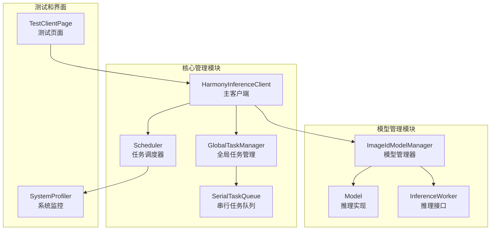
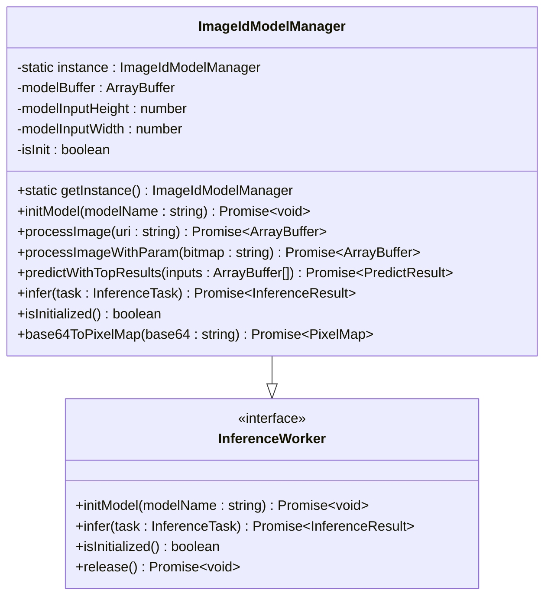
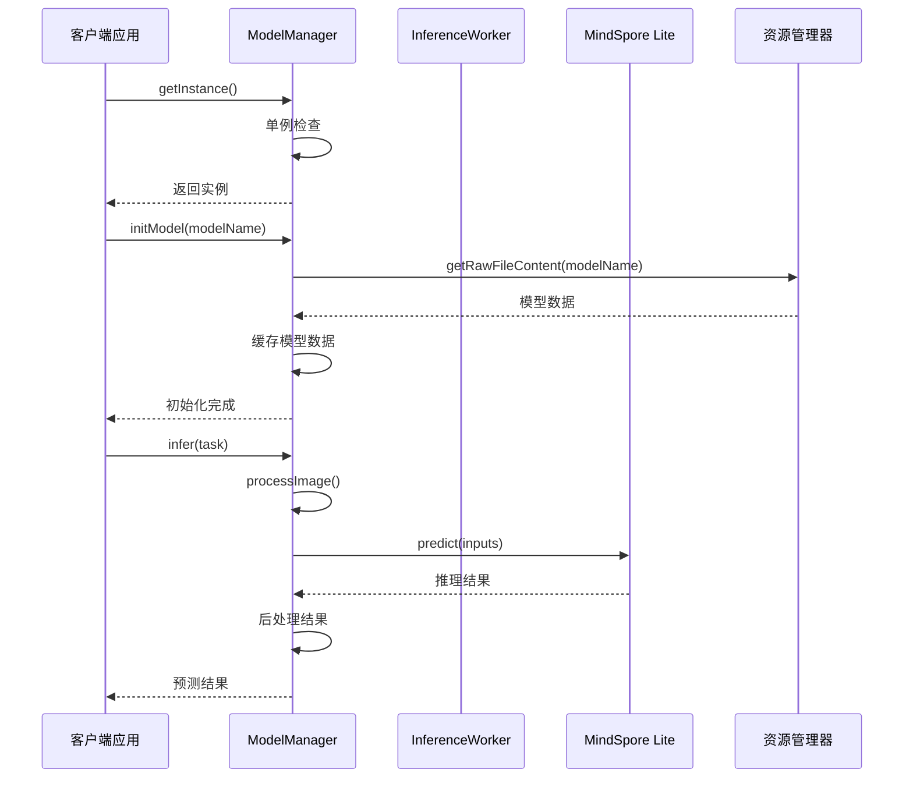
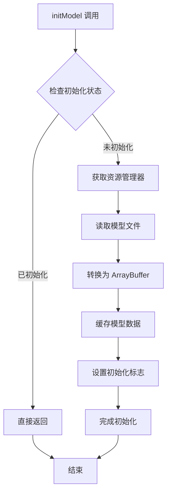
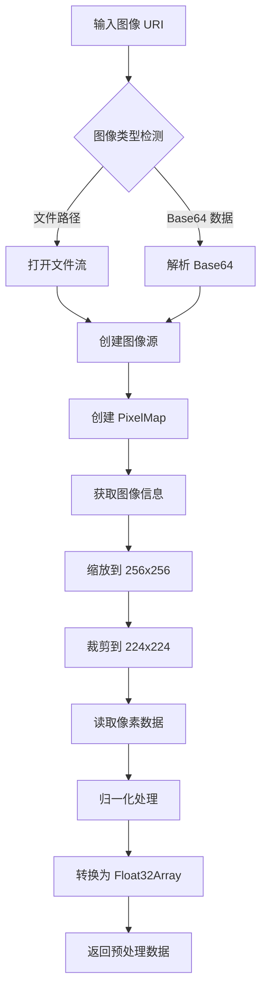
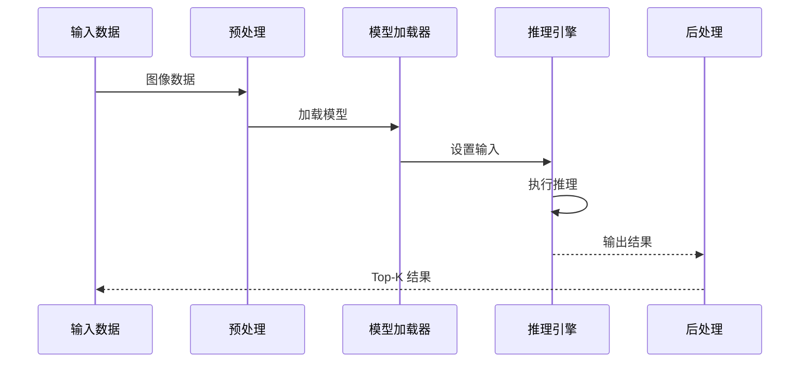
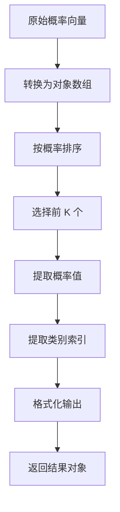
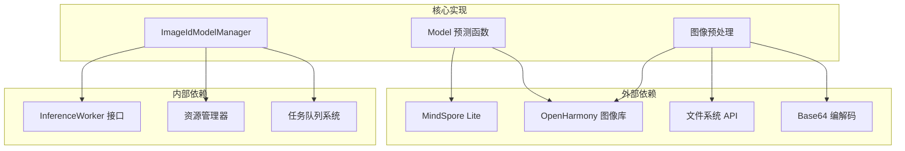
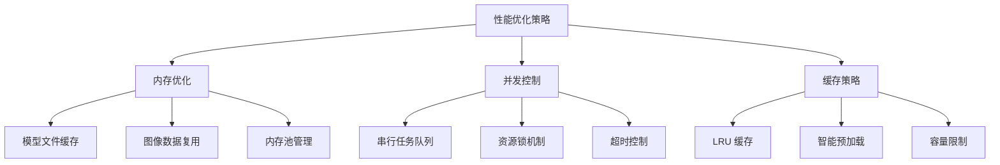

# ModelManager API

<cite>
**本文引用的文件**
- [ImageIdModelManager.ets](file://entry/src/main/ets/TestImageTask/ImageIdModelManager.ets)
- [Model.ets](file://entry/src/main/ets/TestImageTask/Model.ets)
- [InferenceWorker.ets](file://entry/src/main/ets/manager/worker/InferenceWorker.ets)
- [HarmonyInferenceClient.ets](file://entry/src/main/ets/manager/HarmonyInferenceClient.ets)
- [GlobalTaskManager.ets](file://entry/src/main/ets/manager/worker/GlobalTaskManager.ets)
- [SerialTaskQueue.ets](file://entry/src/main/ets/manager/worker/SerialTaskQueue.ets)
- [Scheduler.ets](file://entry/src/main/ets/manager/scheduler/Scheduler.ets)
- [TestClientPage.ets](file://entry/src/main/ets/pages/TestClientPage.ets)
</cite>

## 目录
1. [简介](#简介)
2. [项目结构](#项目结构)
3. [核心组件](#核心组件)
4. [架构概览](#架构概览)
5. [详细组件分析](#详细组件分析)
6. [依赖关系分析](#依赖关系分析)
7. [性能考虑](#性能考虑)
8. [故障排除指南](#故障排除指南)
9. [结论](#结论)

## 简介

ModelManager 是一个基于 OpenHarmony 平台的 AI 模型管理器，专门用于图像识别任务。该组件实现了单例模式设计，提供了完整的模型生命周期管理、图像预处理、模型推理和结果后处理功能。它支持 MindSpore Lite 框架，能够高效地在设备端进行机器学习推理。

该 API 文档详细记录了 ModelManager 的实现细节，包括单例模式实现、初始化过程、模型加载机制、缓存管理策略以及资源优化技术。同时涵盖了模型切换方法、参数配置选项和状态查询接口的完整使用指南。

## 项目结构

该项目采用模块化的架构设计，主要包含以下关键目录和文件：



**图表来源**
- [HarmonyInferenceClient.ets](file://entry/src/main/ets/manager/HarmonyInferenceClient.ets#L52-L80)
- [ImageIdModelManager.ets](file://entry/src/main/ets/TestImageTask/ImageIdModelManager.ets#L31-L43)
- [Scheduler.ets](file://entry/src/main/ets/manager/scheduler/Scheduler.ets#L14-L81)

**章节来源**
- [HarmonyInferenceClient.ets](file://entry/src/main/ets/manager/HarmonyInferenceClient.ets#L1-L357)
- [ImageIdModelManager.ets](file://entry/src/main/ets/TestImageTask/ImageIdModelManager.ets#L1-L258)

## 核心组件

### ModelManager 类概述

ModelManager 是一个实现了 InferenceWorker 接口的单例类，专门负责图像识别任务的完整生命周期管理。该类提供了以下核心功能：

- **单例模式实现**：确保整个应用中只有一个模型管理器实例
- **模型加载管理**：从资源管理器加载和缓存模型文件
- **图像预处理**：支持多种图像格式的标准化处理
- **推理执行**：集成 MindSpore Lite 进行高效的机器学习推理
- **结果后处理**：提取置信度最高的预测结果

### 主要属性和配置

| 属性名 | 类型 | 默认值 | 描述 |
|--------|------|--------|------|
| modelBuffer | ArrayBuffer | new ArrayBuffer(0) | 模型文件的内存缓冲区 |
| modelInputHeight | number | 224 | 模型输入图像的高度 |
| modelInputWidth | number | 224 | 模型输入图像的宽度 |
| isInit | boolean | false | 模型初始化状态标志 |

### 关键方法概览



**图表来源**
- [ImageIdModelManager.ets](file://entry/src/main/ets/TestImageTask/ImageIdModelManager.ets#L31-L43)
- [InferenceWorker.ets](file://entry/src/main/ets/manager/worker/InferenceWorker.ets#L76-L89)

**章节来源**
- [ImageIdModelManager.ets](file://entry/src/main/ets/TestImageTask/ImageIdModelManager.ets#L31-L258)
- [InferenceWorker.ets](file://entry/src/main/ets/manager/worker/InferenceWorker.ets#L1-L90)

## 架构概览

ModelManager 采用分层架构设计，确保了良好的可维护性和扩展性：



**图表来源**
- [HarmonyInferenceClient.ets](file://entry/src/main/ets/manager/HarmonyInferenceClient.ets#L163-L196)
- [ImageIdModelManager.ets](file://entry/src/main/ets/TestImageTask/ImageIdModelManager.ets#L45-L53)
- [Model.ets](file://entry/src/main/ets/TestImageTask/Model.ets#L5-L39)

## 详细组件分析

### 单例模式实现

ModelManager 采用了经典的单例模式实现，确保在整个应用程序生命周期内只有一个实例存在：

```mermaid
flowchart TD
A[调用 getInstance()] --> B{检查实例是否存在?}
B --> |是| C[返回现有实例]
B --> |否| D[创建新实例]
D --> E[设置静态实例变量]
E --> F[返回新实例]
C --> G[结束]
F --> G
```

**图表来源**
- [ImageIdModelManager.ets](file://entry/src/main/ets/TestImageTask/ImageIdModelManager.ets#L37-L43)

### 初始化过程

模型初始化过程包含多个步骤，确保资源的有效加载和配置：



**图表来源**
- [ImageIdModelManager.ets](file://entry/src/main/ets/TestImageTask/ImageIdModelManager.ets#L45-L53)

### 图像预处理流程

ModelManager 支持多种图像输入格式，并提供统一的预处理管道：



**图表来源**
- [ImageIdModelManager.ets](file://entry/src/main/ets/TestImageTask/ImageIdModelManager.ets#L55-L95)
- [ImageIdModelManager.ets](file://entry/src/main/ets/TestImageTask/ImageIdModelManager.ets#L120-L133)

### 推理执行流程

模型推理过程遵循标准的机器学习工作流程：



**图表来源**
- [Model.ets](file://entry/src/main/ets/TestImageTask/Model.ets#L5-L39)
- [ImageIdModelManager.ets](file://entry/src/main/ets/TestImageTask/ImageIdModelManager.ets#L174-L186)

### 结果后处理

推理结果的后处理提供了用户友好的输出格式：



**图表来源**
- [ImageIdModelManager.ets](file://entry/src/main/ets/TestImageTask/ImageIdModelManager.ets#L188-L202)

**章节来源**
- [ImageIdModelManager.ets](file://entry/src/main/ets/TestImageTask/ImageIdModelManager.ets#L31-L258)
- [Model.ets](file://entry/src/main/ets/TestImageTask/Model.ets#L1-L42)

## 依赖关系分析

ModelManager 的依赖关系体现了清晰的分层架构：



**图表来源**
- [ImageIdModelManager.ets](file://entry/src/main/ets/TestImageTask/ImageIdModelManager.ets#L1-L8)
- [Model.ets](file://entry/src/main/ets/TestImageTask/Model.ets#L1-L2)

### 关键依赖项

| 依赖项 | 版本要求 | 用途 | 重要性 |
|--------|----------|------|--------|
| @ohos.ai.mindSporeLite | 最新版本 | 模型推理引擎 | 核心 |
| @ohos.multimedia.image | 最新版本 | 图像处理 | 核心 |
| @ohos.util | 最新版本 | Base64 编解码 | 辅助 |
| @kit.CoreFileKit | 最新版本 | 文件操作 | 辅助 |

**章节来源**
- [ImageIdModelManager.ets](file://entry/src/main/ets/TestImageTask/ImageIdModelManager.ets#L1-L8)
- [Model.ets](file://entry/src/main/ets/TestImageTask/Model.ets#L1-L2)

## 性能考虑

### 内存管理策略

ModelManager 实现了多层内存管理机制：

1. **模型缓存**：模型文件加载后缓存在内存中，避免重复 IO 操作
2. **图像数据池化**：预处理后的图像数据使用 Float32Array 进行高效存储
3. **资源释放**：提供显式的资源清理接口，支持手动释放内存

### 性能优化技术



### 资源优化机制

| 优化技术 | 实现方式 | 效果 |
|----------|----------|------|
| 模型缓存 | 内存中持久化模型数据 | 减少重复加载时间 |
| 图像预处理缓存 | 缓存处理后的图像数据 | 避免重复预处理 |
| 任务队列 | 串行执行避免资源竞争 | 提高稳定性 |
| 超时控制 | 异步操作超时保护 | 防止资源泄露 |

**章节来源**
- [ImageIdModelManager.ets](file://entry/src/main/ets/TestImageTask/ImageIdModelManager.ets#L33-L36)
- [SerialTaskQueue.ets](file://entry/src/main/ets/manager/worker/SerialTaskQueue.ets#L13-L104)

## 故障排除指南

### 常见问题及解决方案

#### 模型加载失败

**症状**：`initModel` 方法抛出异常或返回失败

**可能原因**：
1. 模型文件路径错误
2. 模型文件损坏
3. 权限不足访问资源

**解决方法**：
```typescript
try {
    await modelManager.initModel('model.ms');
} catch (error) {
    console.error('模型加载失败:', error);
    // 检查模型文件是否存在
    // 验证文件完整性
    // 确认权限设置
}
```

#### 推理结果异常

**症状**：推理结果为空或异常

**可能原因**：
1. 图像预处理失败
2. 模型输入维度不匹配
3. 内存不足

**解决方法**：
```typescript
const result = await modelManager.infer(task);
if (!result.success) {
    console.error('推理失败:', result.message);
    // 检查输入数据格式
    // 验证模型兼容性
    // 监控内存使用情况
}
```

#### 内存泄漏问题

**症状**：长时间运行后内存使用持续增长

**预防措施**：
1. 定期检查 `isInitialized` 状态
2. 及时调用 `release` 方法释放资源
3. 监控任务队列长度

**章节来源**
- [ImageIdModelManager.ets](file://entry/src/main/ets/TestImageTask/ImageIdModelManager.ets#L80-L87)
- [SerialTaskQueue.ets](file://entry/src/main/ets/manager/worker/SerialTaskQueue.ets#L86-L97)

## 结论

ModelManager 提供了一个完整、高效的图像识别模型管理解决方案。其设计特点包括：

1. **单例模式保证**：确保资源的有效共享和管理
2. **完整的生命周期管理**：从模型加载到结果输出的全流程支持
3. **高性能实现**：优化的内存管理和并发控制
4. **易于扩展**：清晰的接口设计支持不同类型的模型

该组件为 OpenHarmony 平台上的 AI 应用开发提供了坚实的基础，开发者可以基于此框架快速构建各种机器学习推理应用。

通过本文档的详细说明，开发者可以充分理解 ModelManager 的实现原理和最佳实践，从而在实际项目中正确使用和扩展这一重要的组件。