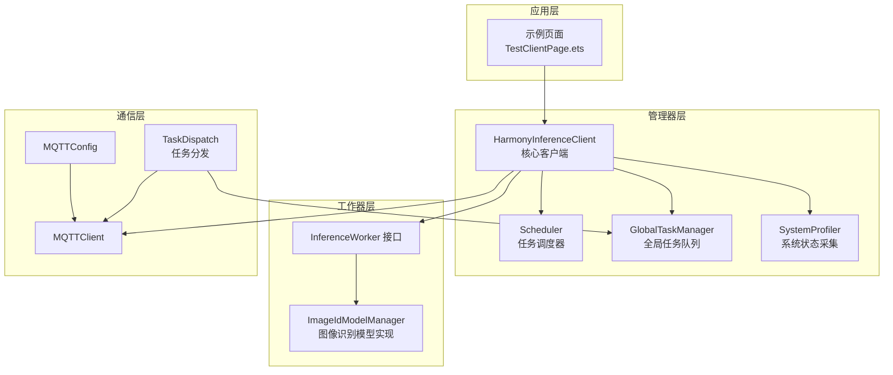
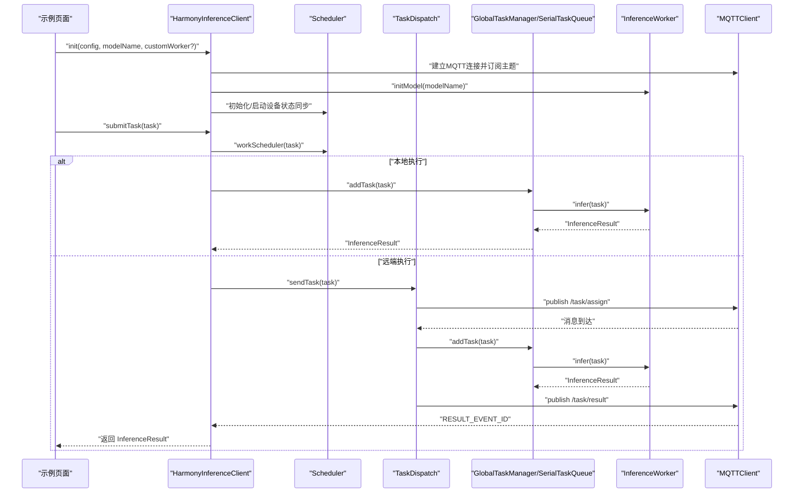
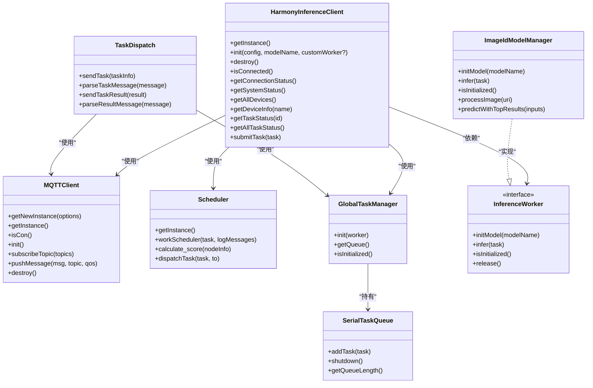

# 核心 API

<cite>
**本文引用的文件列表**
- [HarmonyInferenceClient.ets](file://entry/src/main/ets/manager/HarmonyInferenceClient.ets)
- [InferenceWorker.ets](file://entry/src/main/ets/manager/worker/InferenceWorker.ets)
- [SerialTaskQueue.ets](file://entry/src/main/ets/manager/worker/SerialTaskQueue.ets)
- [GlobalTaskManager.ets](file://entry/src/main/ets/manager/worker/GlobalTaskManager.ets)
- [MQTTClient.ets](file://entry/src/main/ets/manager/broker/MQTTClient.ets)
- [MQTTConfig.ets](file://entry/src/main/ets/manager/broker/MQTTConfig.ets)
- [Scheduler.ets](file://entry/src/main/ets/manager/scheduler/Scheduler.ets)
- [SystemProfiler.ets](file://entry/src/main/ets/manager/monitor/SystemProfiler.ets)
- [TaskDispatch.ets](file://entry/src/main/ets/manager/broker/task/TaskDispatch.ets)
- [ImageIdModelManager.ets](file://entry/src/main/ets/TestImageTask/ImageIdModelManager.ets)
- [TestClientPage.ets](file://entry/src/main/ets/pages/TestClientPage.ets)
</cite>

## 目录
1. [简介](#简介)
2. [项目结构](#项目结构)
3. [核心组件](#核心组件)
4. [架构总览](#架构总览)
5. [详细组件分析](#详细组件分析)
6. [依赖关系分析](#依赖关系分析)
7. [性能考量](#性能考量)
8. [故障排查指南](#故障排查指南)
9. [结论](#结论)
10. [附录](#附录)

## 简介
本文件为核心 API 的权威文档，聚焦 HarmonyInferenceClient 类与 InferenceWorker 接口规范，涵盖初始化、销毁、任务提交、状态查询、结果获取、模型管理与任务分发等能力。文档提供方法签名、参数与返回值说明、异常处理策略、使用示例与最佳实践，帮助开发者快速集成与稳定运行推理任务。

## 项目结构
该工程采用按职责分层的组织方式：
- manager 层：核心推理客户端、调度器、任务分发、MQTT 通信、系统状态采集
- worker 层：推理 Worker 接口与具体实现（图像识别模型）
- broker 层：MQTT 客户端、任务传输协议、参数同步、节点信息同步
- pages 层：示例页面，演示如何使用客户端 API
- TestImageTask 层：图像识别模型管理与推理实现

图表来源
- [HarmonyInferenceClient.ets](file://entry/src/main/ets/manager/HarmonyInferenceClient.ets#L52-L357)
- [Scheduler.ets](file://entry/src/main/ets/manager/scheduler/Scheduler.ets#L14-L105)
- [GlobalTaskManager.ets](file://entry/src/main/ets/manager/worker/GlobalTaskManager.ets#L4-L27)
- [SystemProfiler.ets](file://entry/src/main/ets/manager/monitor/SystemProfiler.ets#L43-L120)
- [InferenceWorker.ets](file://entry/src/main/ets/manager/worker/InferenceWorker.ets#L75-L90)
- [ImageIdModelManager.ets](file://entry/src/main/ets/TestImageTask/ImageIdModelManager.ets#L31-L258)
- [MQTTClient.ets](file://entry/src/main/ets/manager/broker/MQTTClient.ets#L24-L223)
- [MQTTConfig.ets](file://entry/src/main/ets/manager/broker/MQTTConfig.ets#L4-L7)
- [TaskDispatch.ets](file://entry/src/main/ets/manager/broker/task/TaskDispatch.ets#L98-L302)

章节来源
- [HarmonyInferenceClient.ets](file://entry/src/main/ets/manager/HarmonyInferenceClient.ets#L1-L357)
- [TestClientPage.ets](file://entry/src/main/ets/pages/TestClientPage.ets#L1-L151)

## 核心组件
- HarmonyInferenceClient：推理客户端，负责初始化、销毁、连接状态检查、系统状态获取、任务提交与结果等待、事件监听与结果分发。
- InferenceWorker 接口：定义推理 Worker 的统一规范，包括模型初始化、推理执行、初始化状态检查与可选资源释放。
- SerialTaskQueue：串行任务队列，保证推理任务顺序执行与并发安全。
- GlobalTaskManager：全局任务队列管理器，提供单例访问与初始化。
- MQTTClient：MQTT 客户端，负责连接、订阅、消息发布与事件派发。
- Scheduler：任务调度器，基于系统状态与权重参数选择最优节点执行任务。
- SystemProfiler：系统状态采集器，聚合设备 CPU、内存、存储、电量、网络延迟等信息。
- TaskDispatch：任务分发与结果回传，支持小文件直接传输与大文件 TCP 传输。
- ImageIdModelManager：图像识别模型管理与推理实现，作为 InferenceWorker 的具体实现。

章节来源
- [HarmonyInferenceClient.ets](file://entry/src/main/ets/manager/HarmonyInferenceClient.ets#L52-L357)
- [InferenceWorker.ets](file://entry/src/main/ets/manager/worker/InferenceWorker.ets#L75-L90)
- [SerialTaskQueue.ets](file://entry/src/main/ets/manager/worker/SerialTaskQueue.ets#L13-L104)
- [GlobalTaskManager.ets](file://entry/src/main/ets/manager/worker/GlobalTaskManager.ets#L4-L27)
- [MQTTClient.ets](file://entry/src/main/ets/manager/broker/MQTTClient.ets#L24-L223)
- [Scheduler.ets](file://entry/src/main/ets/manager/scheduler/Scheduler.ets#L14-L105)
- [SystemProfiler.ets](file://entry/src/main/ets/manager/monitor/SystemProfiler.ets#L43-L120)
- [TaskDispatch.ets](file://entry/src/main/ets/manager/broker/task/TaskDispatch.ets#L98-L302)
- [ImageIdModelManager.ets](file://entry/src/main/ets/TestImageTask/ImageIdModelManager.ets#L31-L258)

## 架构总览
HarmonyInferenceClient 作为核心入口，协调 MQTT 通信、任务调度、系统状态采集与推理执行。任务提交后，调度器根据节点评分决定本地执行或分发到其他节点；本地执行通过全局任务队列串行化处理；远端执行通过 MQTT 与 TCP 协议进行任务与结果传输。

图表来源
- [HarmonyInferenceClient.ets](file://entry/src/main/ets/manager/HarmonyInferenceClient.ets#L163-L353)
- [Scheduler.ets](file://entry/src/main/ets/manager/scheduler/Scheduler.ets#L30-L103)
- [TaskDispatch.ets](file://entry/src/main/ets/manager/broker/task/TaskDispatch.ets#L107-L212)
- [GlobalTaskManager.ets](file://entry/src/main/ets/manager/worker/GlobalTaskManager.ets#L8-L21)
- [SerialTaskQueue.ets](file://entry/src/main/ets/manager/worker/SerialTaskQueue.ets#L24-L83)
- [MQTTClient.ets](file://entry/src/main/ets/manager/broker/MQTTClient.ets#L153-L182)

## 详细组件分析

### HarmonyInferenceClient 类 API 规范
- 单例模式：通过静态工厂方法获取实例，避免重复初始化。
- 初始化 init(config, modelName, customWorker?): Promise<boolean>
  - 参数
    - config: MQTTConfig
      - url: string
      - clientId: string
      - userName?: string
      - password?: string
      - topic?: string
      - qos?: number
    - modelName: string
    - customWorker?: InferenceWorker
  - 返回值: Promise<boolean>，初始化成功返回 true，失败返回 false
  - 异常处理: 捕获初始化过程中的错误并返回 false
  - 作用: 建立 MQTT 连接、注册事件监听、初始化模型、启动设备状态同步、初始化全局任务队列
- 销毁 destroy(): Promise<void>
  - 返回值: Promise<void>
  - 异常处理: 捕获销毁过程中的错误并抛出
  - 作用: 关闭 MQTT 连接、调用 Worker 的 release（如存在）、移除事件监听、重置状态
- 连接状态 isConnected(): Promise<boolean>
  - 返回值: Promise<boolean>
  - 作用: 查询 MQTT 连接状态
- 连接状态字符串 getConnectionStatus(): string
  - 返回值: string
  - 作用: 返回连接状态字符串（Connected/Disconnected/Error）
- 系统状态获取
  - getSystemStatus(): SystemStatus
    - 返回值: SystemStatus
      - ownDevice: HashMap<string, DeviceInfo>
      - otherDevices: HashMap<string, DeviceInfo>
      - allDevices: HashMap<string, DeviceInfo>
  - getAllDevices(): HashMap<string, DeviceInfo>
  - getDeviceInfo(deviceName: string): DeviceInfo | undefined
- 任务状态与结果
  - getTaskStatus(taskId: string): TaskStatus | undefined
  - getAllTaskStatus(): Map<string, TaskStatus>
  - submitTask(task: InferenceTask): Promise<InferenceResult>
    - 参数: InferenceTask
    - 返回值: Promise<InferenceResult>
    - 异常处理: 若未初始化抛出错误；远端执行时内部轮询等待结果，超时抛出错误
    - 作用: 调度器决策本地或远端执行；本地执行直接返回队列结果；远端执行等待结果并返回

章节来源
- [HarmonyInferenceClient.ets](file://entry/src/main/ets/manager/HarmonyInferenceClient.ets#L52-L357)

### InferenceWorker 接口规范
- initModel(modelName: string): Promise<void>
  - 作用: 初始化模型
- infer(task: InferenceTask): Promise<InferenceResult>
  - 作用: 执行推理，返回 InferenceResult
- isInitialized(): boolean
  - 作用: 检查模型是否已初始化
- release?(): Promise<void>
  - 作用: 可选，释放资源

InferenceTask 定义
- taskId: string
- modelName?: string
- type: InferenceInputType
  - IMAGE | TEXT | AUDIO | VIDEO | OTHER
- data: ImageInputData | TextInputData | AudioInputData | ArrayBuffer
- params?: Record<string, string | number | boolean | ArrayBuffer>

InferenceResult 定义
- success: boolean
- message?: string
- result?: ImageResult | TextResult | AudioResult | CustomResult

实现示例：ImageIdModelManager
- 实现了 InferenceWorker 接口，支持 IMAGE 类型输入
- infer(task): 对 IMAGE 输入进行预处理与推理，返回 ImageResult

章节来源
- [InferenceWorker.ets](file://entry/src/main/ets/manager/worker/InferenceWorker.ets#L1-L90)
- [ImageIdModelManager.ets](file://entry/src/main/ets/TestImageTask/ImageIdModelManager.ets#L31-L258)

### 任务队列与调度
- SerialTaskQueue.addTask(task): Promise<InferenceResult>
  - 作用: 将任务加入队列，串行执行，返回 Promise
- GlobalTaskManager.init(worker): void
  - 作用: 初始化全局任务队列
- GlobalTaskManager.getQueue(): SerialTaskQueue
  - 作用: 获取全局任务队列实例
- Scheduler.workScheduler(task, logMessages): boolean
  - 作用: 基于系统状态与权重参数选择本地执行或远端分发

章节来源
- [SerialTaskQueue.ets](file://entry/src/main/ets/manager/worker/SerialTaskQueue.ets#L13-L104)
- [GlobalTaskManager.ets](file://entry/src/main/ets/manager/worker/GlobalTaskManager.ets#L4-L27)
- [Scheduler.ets](file://entry/src/main/ets/manager/scheduler/Scheduler.ets#L30-L103)

### 通信与任务分发
- MQTTClient
  - getNewInstance(options): MQTTClient
  - getInstance(): MQTTClient
  - isCon(): Promise<boolean>
  - init(): Promise<void>
  - subscribeTopic(topics: string[]): Promise<void>
  - pushMessage(msg: string, topic?: string, qos?: number): Promise<void>
  - destroy(): Promise<void>
- TaskDispatch
  - sendTask(taskInfo: TaskTransmitData): Promise<boolean>
  - parseTaskMessage(message: string): Promise<void>
  - sendTaskResult(result: TaskResTransmitData): void
  - parseResultMessage(message: string): TaskResTransmitData | null

章节来源
- [MQTTClient.ets](file://entry/src/main/ets/manager/broker/MQTTClient.ets#L24-L223)
- [TaskDispatch.ets](file://entry/src/main/ets/manager/broker/task/TaskDispatch.ets#L98-L302)

### 系统状态采集
- SystemProfiler
  - getDeviceInfos(): HashMap<string, DeviceInfo>
  - getOtherInfo(): HashMap<string, DeviceInfo>
  - getOwnInfo(): HashMap<string, DeviceInfo>
  - getDeviceName(): void
  - getCpuInfo(): Promise<void>
  - getMemoryInfo(): void
  - getStatfsInfo(): void
  - getBatteryInfo(): void
  - updateLatency(): void
- DeviceInfo
  - deviceName: string
  - batteryLevel: number
  - memoryUsage: number
  - cpuUsage: number
  - storageFree: number
  - latency: number

章节来源
- [SystemProfiler.ets](file://entry/src/main/ets/manager/monitor/SystemProfiler.ets#L43-L120)

### 使用示例与最佳实践
- 示例页面 TestClientPage 展示了初始化、连接状态检查、系统状态获取、提交任务与销毁客户端的完整流程
- 推荐做法
  - 先调用 init 完成初始化与模型加载
  - 使用 isConnected 检查连接状态
  - 通过 getSystemStatus 获取设备状态，辅助理解网络环境
  - submitTask 前确保已初始化，远端任务建议设置合理超时
  - destroy 时确保释放资源，避免内存泄漏

章节来源
- [TestClientPage.ets](file://entry/src/main/ets/pages/TestClientPage.ets#L1-L151)

## 依赖关系分析
- HarmonyInferenceClient 依赖 MQTTClient、Scheduler、GlobalTaskManager、SystemProfiler、InferenceWorker
- TaskDispatch 依赖 MQTTClient、GlobalTaskManager、InferenceTask/Result、网络与文件工具
- ImageIdModelManager 实现 InferenceWorker 接口，依赖多媒体与模型推理能力
- MQTTConfig 为 MQTTClient 提供默认 clientId

图表来源
- [HarmonyInferenceClient.ets](file://entry/src/main/ets/manager/HarmonyInferenceClient.ets#L52-L357)
- [MQTTClient.ets](file://entry/src/main/ets/manager/broker/MQTTClient.ets#L24-L223)
- [Scheduler.ets](file://entry/src/main/ets/manager/scheduler/Scheduler.ets#L14-L105)
- [GlobalTaskManager.ets](file://entry/src/main/ets/manager/worker/GlobalTaskManager.ets#L4-L27)
- [SerialTaskQueue.ets](file://entry/src/main/ets/manager/worker/SerialTaskQueue.ets#L13-L104)
- [InferenceWorker.ets](file://entry/src/main/ets/manager/worker/InferenceWorker.ets#L75-L90)
- [ImageIdModelManager.ets](file://entry/src/main/ets/TestImageTask/ImageIdModelManager.ets#L31-L258)
- [TaskDispatch.ets](file://entry/src/main/ets/manager/broker/task/TaskDispatch.ets#L98-L302)

## 性能考量
- 串行队列：SerialTaskQueue 保证任务顺序执行，避免并发冲突，但可能成为瓶颈。建议合理控制任务规模与频率。
- 调度策略：Scheduler 基于 CPU、内存、电量、存储、延迟等指标加权评分，选择最优节点执行，提升整体吞吐。
- 传输优化：TaskDispatch 对大文件采用 TCP 传输，减少 MQTT 压力；对小文件直接 MQTT 传输，降低复杂度。
- 状态采集：SystemProfiler 通过并发采集与缓存，定期更新设备状态，避免频繁系统调用带来的开销。
- 超时与轮询：远端任务等待结果采用定时轮询与超时控制，避免长时间占用资源。

[本节为通用性能建议，无需列出章节来源]

## 故障排查指南
- 初始化失败
  - 检查 MQTT 配置（url、clientId、topic、qos），确认网络连通性
  - 确认模型文件存在且可读
  - 查看控制台日志定位错误原因
- 连接不稳定
  - 使用 isConnected 与 getConnectionStatus 检查连接状态
  - 检查 MQTT 服务器可达性与认证信息
- 任务超时
  - submitTask 默认 30 秒超时，远端任务建议增加重试或优化网络
  - 检查目标节点是否正确接收任务与返回结果
- 资源释放
  - destroy 时若出现错误，需捕获并记录，确保不会遗漏清理步骤
- 事件监听
  - 确认 RESULT_EVENT_ID 事件监听已正确注册与移除

章节来源
- [HarmonyInferenceClient.ets](file://entry/src/main/ets/manager/HarmonyInferenceClient.ets#L198-L225)
- [MQTTClient.ets](file://entry/src/main/ets/manager/broker/MQTTClient.ets#L206-L220)
- [TaskDispatch.ets](file://entry/src/main/ets/manager/broker/task/TaskDispatch.ets#L288-L298)

## 结论
HarmonyInferenceClient 提供了从初始化、连接管理、系统状态采集、任务提交到结果回传的完整推理能力。通过 InferenceWorker 接口与 ImageIdModelManager 实现，开发者可灵活替换或扩展模型实现。配合 Scheduler 与 TaskDispatch，系统可在多设备间高效分发任务，满足边缘推理场景的需求。建议在生产环境中结合日志与监控，持续优化调度策略与传输路径。

[本节为总结性内容，无需列出章节来源]

## 附录

### 方法与参数速查
- HarmonyInferenceClient
  - init(config, modelName, customWorker?): Promise<boolean>
  - destroy(): Promise<void>
  - isConnected(): Promise<boolean>
  - getConnectionStatus(): string
  - getSystemStatus(): SystemStatus
  - getAllDevices(): HashMap<string, DeviceInfo>
  - getDeviceInfo(deviceName: string): DeviceInfo | undefined
  - getTaskStatus(taskId: string): TaskStatus | undefined
  - getAllTaskStatus(): Map<string, TaskStatus>
  - submitTask(task: InferenceTask): Promise<InferenceResult>
- InferenceWorker
  - initModel(modelName: string): Promise<void>
  - infer(task: InferenceTask): Promise<InferenceResult>
  - isInitialized(): boolean
  - release?(): Promise<void>
- SerialTaskQueue
  - addTask(task: InferenceTask): Promise<InferenceResult>
  - shutdown(): void
  - getQueueLength(): number
- GlobalTaskManager
  - init(worker: InferenceWorker): void
  - getQueue(): SerialTaskQueue
  - isInitialized(): boolean
- MQTTClient
  - getNewInstance(options: MQTTOptionsType): MQTTClient
  - getInstance(): MQTTClient
  - isCon(): Promise<boolean>
  - init(): Promise<void>
  - subscribeTopic(topics: string[]): Promise<void>
  - pushMessage(msg: string, topic?: string, qos?: number): Promise<void>
  - destroy(): Promise<void>
- Scheduler
  - getInstance(): Scheduler
  - workScheduler(task: InferenceTask, logMessages: string[]): boolean
  - calculate_score(nodeInfo: DeviceInfo): number
  - dispatchTask(task: InferenceTask, to: string): Promise<void>
- TaskDispatch
  - sendTask(taskInfo: TaskTransmitData): Promise<boolean>
  - parseTaskMessage(message: string): Promise<void>
  - sendTaskResult(result: TaskResTransmitData): void
  - parseResultMessage(message: string): TaskResTransmitData | null

章节来源
- [HarmonyInferenceClient.ets](file://entry/src/main/ets/manager/HarmonyInferenceClient.ets#L163-L353)
- [InferenceWorker.ets](file://entry/src/main/ets/manager/worker/InferenceWorker.ets#L75-L90)
- [SerialTaskQueue.ets](file://entry/src/main/ets/manager/worker/SerialTaskQueue.ets#L24-L102)
- [GlobalTaskManager.ets](file://entry/src/main/ets/manager/worker/GlobalTaskManager.ets#L8-L26)
- [MQTTClient.ets](file://entry/src/main/ets/manager/broker/MQTTClient.ets#L47-L220)
- [Scheduler.ets](file://entry/src/main/ets/manager/scheduler/Scheduler.ets#L76-L103)
- [TaskDispatch.ets](file://entry/src/main/ets/manager/broker/task/TaskDispatch.ets#L107-L298)