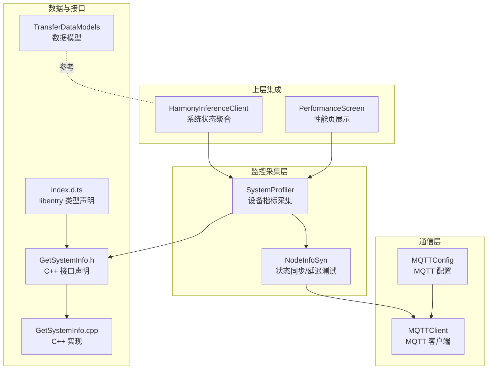
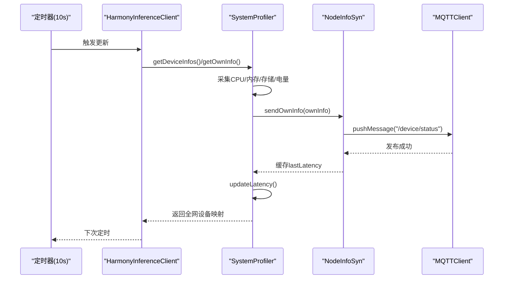
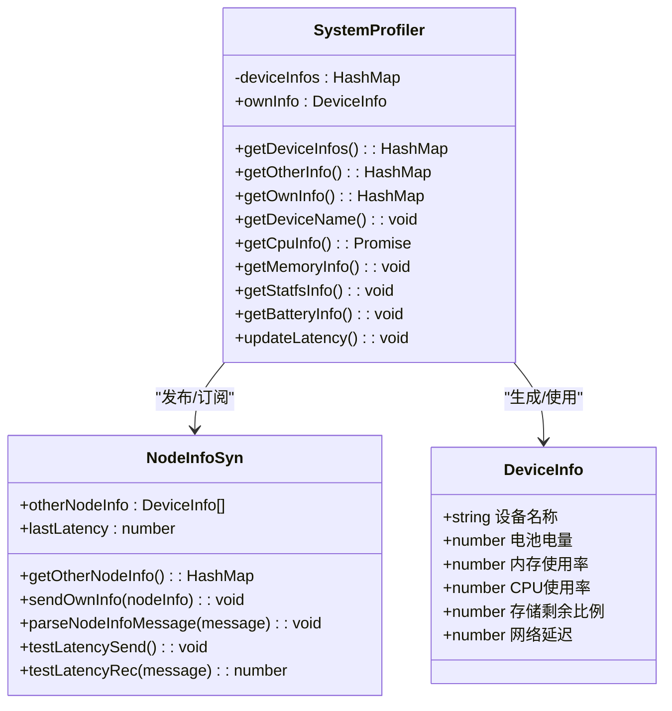
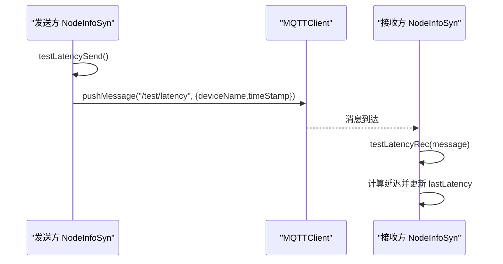
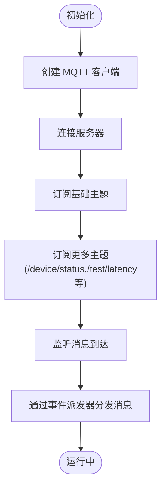
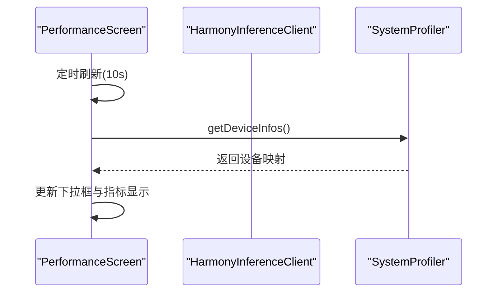
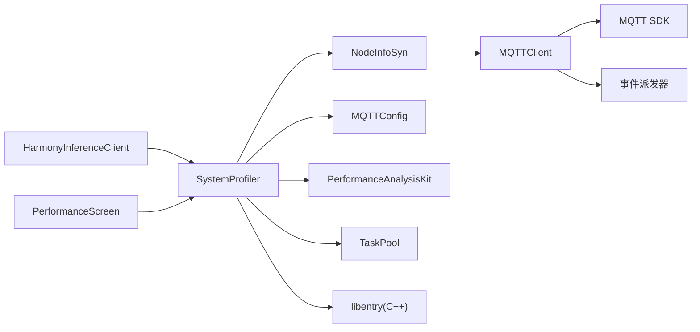

# 监控 API

<cite>
**本文引用的文件**
- [SystemProfiler.ets](file://entry/src/main/ets/manager/monitor/SystemProfiler.ets)
- [NodeInfoSyn.ets](file://entry/src/main/ets/manager/broker/monitor/NodeInfoSyn.ets)
- [MQTTClient.ets](file://entry/src/main/ets/manager/broker/MQTTClient.ets)
- [MQTTConfig.ets](file://entry/src/main/ets/manager/broker/MQTTConfig.ets)
- [HarmonyInferenceClient.ets](file://entry/src/main/ets/manager/HarmonyInferenceClient.ets)
- [PerformanceScreen.ets](file://entry/src/main/ets/pages/tabs/PerformanceScreen.ets)
- [ParamSyn.ets](file://entry/src/main/ets/manager/broker/paramOpt/ParamSyn.ets)
- [TransferDataModels.ets](file://entry/src/main/ets/manager/transfer/model/TransferDataModels.ets)
- [GetSystemInfo.h](file://entry/src/main/cpp/GetSystemInfo.h)
- [GetSystemInfo.cpp](file://entry/src/main/cpp/GetSystemInfo.cpp)
- [index.d.ts](file://entry/src/main/cpp/types/libentry/index.d.ts)
</cite>

## 目录
1. [简介](#简介)
2. [项目结构](#项目结构)
3. [核心组件](#核心组件)
4. [架构总览](#架构总览)
5. [详细组件分析](#详细组件分析)
6. [依赖关系分析](#依赖关系分析)
7. [性能考虑](#性能考虑)
8. [故障排查指南](#故障排查指南)
9. [结论](#结论)
10. [附录](#附录)

## 简介
本文件为监控 API 的详细技术文档，聚焦以下目标：
- 记录 SystemProfiler 类的监控方法：设备信息获取、性能指标收集、状态同步等
- 详细说明 NodeInfoSyn 的设备状态同步接口：信息收集、状态广播、延迟测量等
- 明确监控数据的格式定义与使用方式
- 提供监控系统的集成示例与性能优化建议

监控系统采用 MQTT 广播机制，SystemProfiler 负责采集本机系统指标并通过 NodeInfoSyn 发布；NodeInfoSyn 负责订阅/解析其他设备的状态消息，并支持延迟测试；HarmonyInferenceClient 作为上层调用方定期拉取全网设备状态视图。

## 项目结构
监控相关代码主要分布在以下模块：
- 监控采集：SystemProfiler（设备指标采集）、NodeInfoSyn（状态同步与延迟）
- 通信层：MQTTClient（MQTT 客户端封装）、MQTTConfig（MQTT 连接配置）
- 上层集成：HarmonyInferenceClient（系统状态聚合）、PerformanceScreen（UI 展示）
- 数据模型：TransferDataModels（传输相关模型，便于理解系统数据结构）

**图表来源**
- [SystemProfiler.ets](file://entry/src/main/ets/manager/monitor/SystemProfiler.ets#L1-L120)
- [NodeInfoSyn.ets](file://entry/src/main/ets/manager/broker/monitor/NodeInfoSyn.ets#L1-L173)
- [MQTTClient.ets](file://entry/src/main/ets/manager/broker/MQTTClient.ets#L1-L223)
- [MQTTConfig.ets](file://entry/src/main/ets/manager/broker/MQTTConfig.ets#L1-L7)
- [HarmonyInferenceClient.ets](file://entry/src/main/ets/manager/HarmonyInferenceClient.ets#L240-L357)
- [PerformanceScreen.ets](file://entry/src/main/ets/pages/tabs/PerformanceScreen.ets#L1-L204)
- [TransferDataModels.ets](file://entry/src/main/ets/manager/transfer/model/TransferDataModels.ets#L1-L113)
- [GetSystemInfo.h](file://entry/src/main/cpp/GetSystemInfo.h#L1-L23)
- [GetSystemInfo.cpp](file://entry/src/main/cpp/GetSystemInfo.cpp#L72-L115)
- [index.d.ts](file://entry/src/main/cpp/types/libentry/index.d.ts#L1-L5)

**章节来源**
- [SystemProfiler.ets](file://entry/src/main/ets/manager/monitor/SystemProfiler.ets#L1-L120)
- [NodeInfoSyn.ets](file://entry/src/main/ets/manager/broker/monitor/NodeInfoSyn.ets#L1-L173)
- [MQTTClient.ets](file://entry/src/main/ets/manager/broker/MQTTClient.ets#L1-L223)
- [MQTTConfig.ets](file://entry/src/main/ets/manager/broker/MQTTConfig.ets#L1-L7)
- [HarmonyInferenceClient.ets](file://entry/src/main/ets/manager/HarmonyInferenceClient.ets#L240-L357)
- [PerformanceScreen.ets](file://entry/src/main/ets/pages/tabs/PerformanceScreen.ets#L1-L204)
- [TransferDataModels.ets](file://entry/src/main/ets/manager/transfer/model/TransferDataModels.ets#L1-L113)
- [GetSystemInfo.h](file://entry/src/main/cpp/GetSystemInfo.h#L1-L23)
- [GetSystemInfo.cpp](file://entry/src/main/cpp/GetSystemInfo.cpp#L72-L115)
- [index.d.ts](file://entry/src/main/cpp/types/libentry/index.d.ts#L1-L5)

## 核心组件
- SystemProfiler：负责采集本机设备指标（CPU、内存、存储、电量、延迟），并将本机状态通过 NodeInfoSyn 广播出去，同时合并其他设备状态形成全网视图。
- NodeInfoSyn：负责订阅/解析其他设备状态消息，维护其他设备列表；支持延迟测试消息的发送与接收，计算并缓存最近一次延迟。
- MQTTClient：封装 MQTT 客户端生命周期、订阅主题、消息发布与事件派发。
- MQTTConfig：提供 MQTT 连接参数，其中 clientId 来源于设备市场名称。
- HarmonyInferenceClient：定时触发 SystemProfiler 更新，聚合全网设备状态，提供查询接口。
- PerformanceScreen：UI 层展示设备状态，周期性刷新并选择目标设备查看指标。

**章节来源**
- [SystemProfiler.ets](file://entry/src/main/ets/manager/monitor/SystemProfiler.ets#L43-L119)
- [NodeInfoSyn.ets](file://entry/src/main/ets/manager/broker/monitor/NodeInfoSyn.ets#L40-L172)
- [MQTTClient.ets](file://entry/src/main/ets/manager/broker/MQTTClient.ets#L24-L223)
- [MQTTConfig.ets](file://entry/src/main/ets/manager/broker/MQTTConfig.ets#L4-L6)
- [HarmonyInferenceClient.ets](file://entry/src/main/ets/manager/HarmonyInferenceClient.ets#L240-L282)
- [PerformanceScreen.ets](file://entry/src/main/ets/pages/tabs/PerformanceScreen.ets#L42-L60)

## 架构总览
监控系统采用“采集-同步-广播-消费”的架构模式：
- 采集层：SystemProfiler 通过系统 API 与 C++ 接口获取 CPU、内存、存储、电量等指标
- 同步层：NodeInfoSyn 维护本机与远端设备状态，负责延迟测试
- 通信层：MQTTClient 统一处理连接、订阅、发布与事件派发
- 消费层：HarmonyInferenceClient 与 UI 页面（PerformanceScreen）消费状态数据

**图表来源**
- [HarmonyInferenceClient.ets](file://entry/src/main/ets/manager/HarmonyInferenceClient.ets#L246-L267)
- [SystemProfiler.ets](file://entry/src/main/ets/manager/monitor/SystemProfiler.ets#L71-L116)
- [NodeInfoSyn.ets](file://entry/src/main/ets/manager/broker/monitor/NodeInfoSyn.ets#L63-L80)
- [MQTTClient.ets](file://entry/src/main/ets/manager/broker/MQTTClient.ets#L190-L203)

## 详细组件分析

### SystemProfiler 组件分析
SystemProfiler 是监控数据的核心采集与聚合器，其职责包括：
- 设备信息结构体：DeviceInfo，包含设备名称、CPU 使用率、内存使用率、存储剩余比例、电池电量、网络延迟
- 采集方法：
  - getDeviceName：使用 MQTT 客户端 ID 作为设备名称
  - getCpuInfo：异步获取系统 CPU 使用率，使用并发任务池执行
  - getMemoryInfo：通过 libentry 的 C++ 接口获取内存使用率
  - getStatfsInfo：读取应用目录的可用空间与总空间，计算存储剩余比例
  - getBatteryInfo：读取电池电量状态
  - updateLatency：根据 NodeInfoSyn 的 lastLatency 计算本机延迟
- 同步方法：
  - getOtherInfo：返回其他设备的 DeviceInfo 映射
  - getOwnInfo：执行上述采集步骤，调用 NodeInfoSyn 发布本机状态，并将本机信息加入设备映射
  - getDeviceInfos：合并本机与远端设备信息，返回统一映射

**图表来源**
- [SystemProfiler.ets](file://entry/src/main/ets/manager/monitor/SystemProfiler.ets#L10-L119)
- [NodeInfoSyn.ets](file://entry/src/main/ets/manager/broker/monitor/NodeInfoSyn.ets#L40-L172)

**章节来源**
- [SystemProfiler.ets](file://entry/src/main/ets/manager/monitor/SystemProfiler.ets#L10-L119)
- [GetSystemInfo.h](file://entry/src/main/cpp/GetSystemInfo.h#L11-L22)
- [GetSystemInfo.cpp](file://entry/src/main/cpp/GetSystemInfo.cpp#L72-L115)
- [index.d.ts](file://entry/src/main/cpp/types/libentry/index.d.ts#L1-L5)

### NodeInfoSyn 组件分析
NodeInfoSyn 负责设备状态的同步与延迟测试：
- 数据结构：
  - NodeInfoObj：用于解析节点状态消息，包含设备名称、评分、参数(DeviceInfo)
  - LatencyInfoObj：用于解析延迟测试消息，包含设备名称与时间戳
- 方法：
  - getOtherNodeInfo：将内部数组转换为 HashMap，键为设备名称
  - sendOwnInfo：构造 JSON 消息并发布到 "/device/status" 主题
  - parseNodeInfoMessage：解析远端设备状态消息，去重并更新列表
  - testLatencySend：发布包含当前时间戳的延迟测试消息到 "/test/latency"
  - testLatencyRec：解析延迟测试消息，计算往返时间并更新 lastLatency

**图表来源**
- [NodeInfoSyn.ets](file://entry/src/main/ets/manager/broker/monitor/NodeInfoSyn.ets#L131-L170)
- [MQTTClient.ets](file://entry/src/main/ets/manager/broker/MQTTClient.ets#L190-L203)

**章节来源**
- [NodeInfoSyn.ets](file://entry/src/main/ets/manager/broker/monitor/NodeInfoSyn.ets#L15-L172)

### MQTTClient 与 MQTTConfig
- MQTTClient：单例客户端，负责创建、连接、订阅多个主题、消息派发与销毁；内置事件派发器，将消息转发给上层模块
- MQTTConfig：提供 clientId（设备市场名称）、URL、用户名、密码、主题、QoS 等配置项

**图表来源**
- [MQTTClient.ets](file://entry/src/main/ets/manager/broker/MQTTClient.ets#L68-L182)
- [MQTTConfig.ets](file://entry/src/main/ets/manager/broker/MQTTConfig.ets#L4-L6)

**章节来源**
- [MQTTClient.ets](file://entry/src/main/ets/manager/broker/MQTTClient.ets#L24-L223)
- [MQTTConfig.ets](file://entry/src/main/ets/manager/broker/MQTTConfig.ets#L1-L7)

### HarmonyInferenceClient 与 PerformanceScreen
- HarmonyInferenceClient：定时触发 SystemProfiler 更新，聚合全网设备状态，提供查询接口（获取全部设备、指定设备信息）
- PerformanceScreen：UI 层周期性刷新，展示 CPU、内存、存储、电池等指标，并支持选择不同设备查看

**图表来源**
- [PerformanceScreen.ets](file://entry/src/main/ets/pages/tabs/PerformanceScreen.ets#L29-L60)
- [HarmonyInferenceClient.ets](file://entry/src/main/ets/manager/HarmonyInferenceClient.ets#L246-L282)

**章节来源**
- [HarmonyInferenceClient.ets](file://entry/src/main/ets/manager/HarmonyInferenceClient.ets#L240-L282)
- [PerformanceScreen.ets](file://entry/src/main/ets/pages/tabs/PerformanceScreen.ets#L1-L204)

## 依赖关系分析
- SystemProfiler 依赖：
  - NodeInfoSyn：用于发布本机状态与获取远端状态
  - MQTTConfig：用于获取设备名称
  - 性能分析 Kit：获取 CPU 使用率
  - 任务池：并发执行 CPU 采样
  - C++ 接口：libentry 提供内存使用率
- NodeInfoSyn 依赖：
  - MQTTClient：发布/订阅消息
  - 时间服务：获取当前时间戳进行延迟计算
- MQTTClient 依赖：
  - MQTT SDK：连接、订阅、发布
  - 事件派发器：消息分发

**图表来源**
- [SystemProfiler.ets](file://entry/src/main/ets/manager/monitor/SystemProfiler.ets#L1-L9)
- [NodeInfoSyn.ets](file://entry/src/main/ets/manager/broker/monitor/NodeInfoSyn.ets#L5-L9)
- [MQTTClient.ets](file://entry/src/main/ets/manager/broker/MQTTClient.ets#L1-L10)
- [HarmonyInferenceClient.ets](file://entry/src/main/ets/manager/HarmonyInferenceClient.ets#L240-L267)
- [PerformanceScreen.ets](file://entry/src/main/ets/pages/tabs/PerformanceScreen.ets#L1-L4)

**章节来源**
- [SystemProfiler.ets](file://entry/src/main/ets/manager/monitor/SystemProfiler.ets#L1-L9)
- [NodeInfoSyn.ets](file://entry/src/main/ets/manager/broker/monitor/NodeInfoSyn.ets#L5-L9)
- [MQTTClient.ets](file://entry/src/main/ets/manager/broker/MQTTClient.ets#L1-L10)

## 性能考虑
- CPU 采样并发化：SystemProfiler 使用任务池并发执行 CPU 采样，避免阻塞主线程
- 采样频率控制：HarmonyInferenceClient 与 PerformanceScreen 均以 10 秒为周期刷新，平衡实时性与资源消耗
- 内存与存储采样：内存使用率来自 C++ 接口，存储剩余比例来自文件系统统计，均采用同步调用，注意在 UI 刷新周期内执行
- MQTT 消息体积：设备状态消息包含固定字段，建议保持字段精简，避免频繁大体积消息导致网络拥塞
- 延迟计算：NodeInfoSyn 的延迟测试基于时间戳差值，建议在网络稳定场景下进行测试，避免瞬时抖动影响

[本节为通用性能建议，不直接分析具体文件]

## 故障排查指南
- MQTT 未初始化：当 MQTTClient 未创建实例时，getInstance 会抛出异常，需先初始化 MQTTClient
- 连接失败：检查 MQTTConfig 中的 URL、用户名、密码是否正确
- 订阅失败：确认订阅主题列表是否包含所需主题（如 /device/status、/test/latency）
- CPU 采样异常：SystemProfiler 的 CPU 采样可能因权限或平台差异抛出业务错误，需捕获并记录
- 存储/内存采样异常：statfs 或 libentry 接口调用失败时会记录错误日志，检查上下文与权限
- 延迟测试无效：若未收到对应设备的延迟测试响应，lastLatency 不会更新，需检查网络连通性与主题订阅

**章节来源**
- [MQTTClient.ets](file://entry/src/main/ets/manager/broker/MQTTClient.ets#L52-L58)
- [SystemProfiler.ets](file://entry/src/main/ets/manager/monitor/SystemProfiler.ets#L35-L41)
- [NodeInfoSyn.ets](file://entry/src/main/ets/manager/broker/monitor/NodeInfoSyn.ets#L150-L170)

## 结论
监控 API 通过 SystemProfiler 与 NodeInfoSyn 实现了设备指标的采集与同步，结合 MQTTClient 的消息机制实现了跨设备的状态共享与延迟测量。HarmonyInferenceClient 与 UI 页面提供了稳定的消费入口。整体设计具备良好的可扩展性与可维护性，适合在多设备协同场景中部署。

[本节为总结性内容，不直接分析具体文件]

## 附录

### 监控数据格式定义
- 设备状态消息（发布到 /device/status）：
  - 字段：deviceName（设备名称）、params（包含 DeviceInfo 的完整字段）
  - DeviceInfo 字段：deviceName、cpuUsage、memoryUsage、storageFree、batteryLevel、latency
- 延迟测试消息（发布到 /test/latency）：
  - 字段：deviceName（设备名称）、timeStamp（时间戳）
- 其他设备状态解析对象：
  - NodeInfoObj：deviceName、score、params（DeviceInfo）

**章节来源**
- [NodeInfoSyn.ets](file://entry/src/main/ets/manager/broker/monitor/NodeInfoSyn.ets#L63-L98)
- [NodeInfoSyn.ets](file://entry/src/main/ets/manager/broker/monitor/NodeInfoSyn.ets#L131-L149)

### 集成示例与最佳实践
- 初始化 MQTT 客户端：确保 MQTTClient 已初始化并完成订阅
- 定时刷新：在 HarmonyInferenceClient 中按 10 秒间隔调用 getSystemStatus 获取全网状态
- UI 展示：在 PerformanceScreen 中周期性调用 getDeviceInfos 并渲染指标
- 参数同步（可选）：如需动态调整策略，可使用 ParamSyn 解析参数消息并获取最新参数数组

**章节来源**
- [HarmonyInferenceClient.ets](file://entry/src/main/ets/manager/HarmonyInferenceClient.ets#L246-L267)
- [PerformanceScreen.ets](file://entry/src/main/ets/pages/tabs/PerformanceScreen.ets#L29-L60)
- [ParamSyn.ets](file://entry/src/main/ets/manager/broker/paramOpt/ParamSyn.ets#L13-L39)