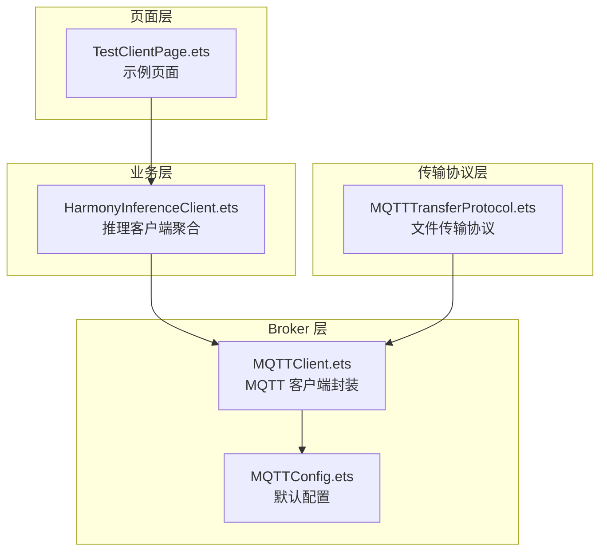
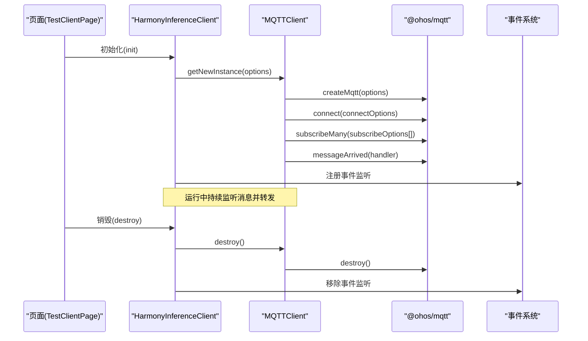
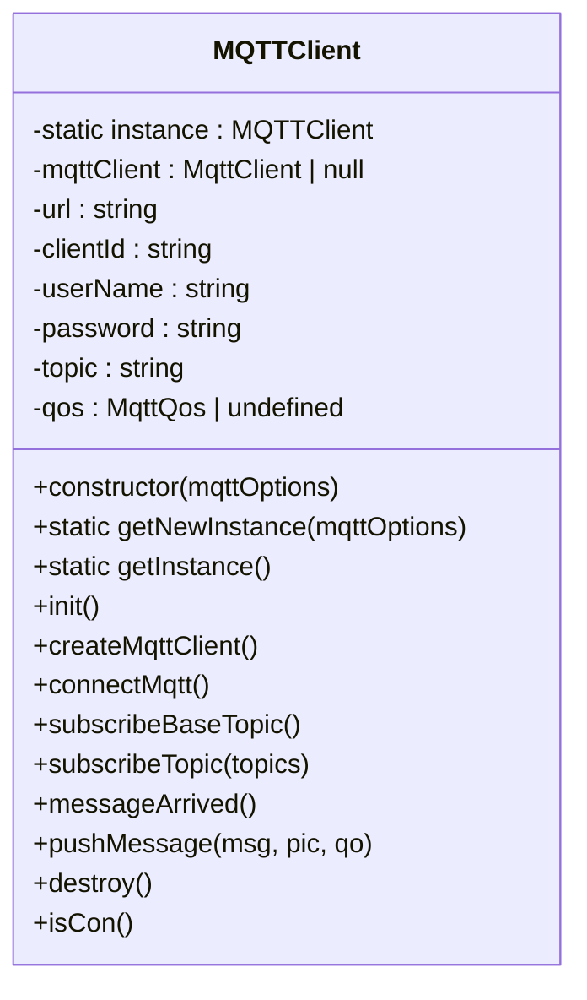
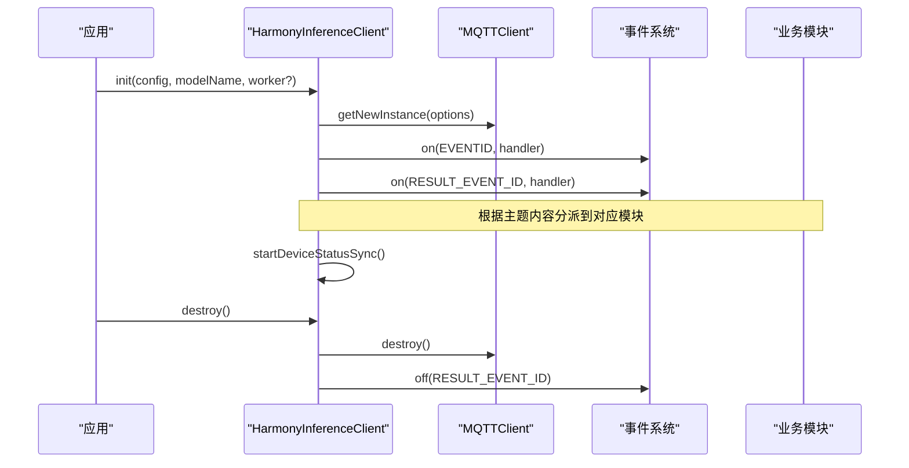
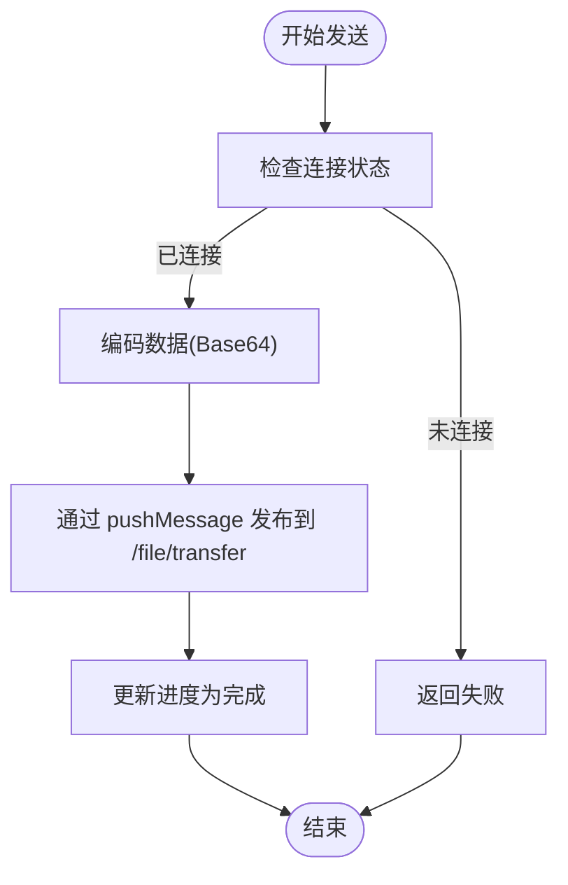
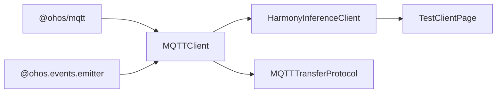

# MQTT 客户端 API

<cite>
**本文引用的文件列表**
- [MQTTClient.ets](file://entry/src/main/ets/manager/broker/MQTTClient.ets)
- [MQTTConfig.ets](file://entry/src/main/ets/manager/broker/MQTTConfig.ets)
- [HarmonyInferenceClient.ets](file://entry/src/main/ets/manager/HarmonyInferenceClient.ets)
- [TestClientPage.ets](file://entry/src/main/ets/pages/TestClientPage.ets)
- [MQTTTransferProtocol.ets](file://entry/src/main/ets/manager/transfer/protocol/MQTTTransferProtocol.ets)
- [TransferExamples.ets](file://entry/src/main/ets/manager/transfer/examples/TransferExamples.ets)
</cite>

## 目录
1. [简介](#简介)
2. [项目结构](#项目结构)
3. [核心组件](#核心组件)
4. [架构总览](#架构总览)
5. [详细组件分析](#详细组件分析)
6. [依赖关系分析](#依赖关系分析)
7. [性能考虑](#性能考虑)
8. [故障排查指南](#故障排查指南)
9. [结论](#结论)
10. [附录](#附录)

## 简介
本文件为 MQTT 客户端 API 的详细技术文档，覆盖 MQTTClient 类的完整接口、配置项说明、连接与订阅流程、消息收发方法以及资源清理流程。文档同时提供最佳实践与使用示例，帮助开发者快速集成并稳定运行基于 MQTT 的消息通信。

## 项目结构
MQTT 客户端相关代码主要位于 entry/src/main/ets/manager/broker 目录下，配合上层业务模块 HarmonyInferenceClient 使用，并在页面 TestClientPage 中提供可运行示例。

图表来源
- [MQTTClient.ets](file://entry/src/main/ets/manager/broker/MQTTClient.ets#L1-L223)
- [MQTTConfig.ets](file://entry/src/main/ets/manager/broker/MQTTConfig.ets#L1-L7)
- [HarmonyInferenceClient.ets](file://entry/src/main/ets/manager/HarmonyInferenceClient.ets#L1-L357)
- [TestClientPage.ets](file://entry/src/main/ets/pages/TestClientPage.ets#L1-L151)
- [MQTTTransferProtocol.ets](file://entry/src/main/ets/manager/transfer/protocol/MQTTTransferProtocol.ets#L1-L185)

章节来源
- [MQTTClient.ets](file://entry/src/main/ets/manager/broker/MQTTClient.ets#L1-L223)
- [MQTTConfig.ets](file://entry/src/main/ets/manager/broker/MQTTConfig.ets#L1-L7)
- [HarmonyInferenceClient.ets](file://entry/src/main/ets/manager/HarmonyInferenceClient.ets#L1-L357)
- [TestClientPage.ets](file://entry/src/main/ets/pages/TestClientPage.ets#L1-L151)
- [MQTTTransferProtocol.ets](file://entry/src/main/ets/manager/transfer/protocol/MQTTTransferProtocol.ets#L1-L185)

## 核心组件
- MQTTClient：对系统 MQTT 能力的封装，负责连接、订阅、消息收发与销毁。
- MQTTOptionsType：MQTT 连接与订阅的基础配置接口。
- HarmonyInferenceClient：业务聚合层，负责初始化 MQTT、事件监听、任务调度与资源释放。
- MQTTTransferProtocol：基于 MQTT 的文件传输协议实现，复用 MQTTClient 进行消息发送。

章节来源
- [MQTTClient.ets](file://entry/src/main/ets/manager/broker/MQTTClient.ets#L15-L22)
- [HarmonyInferenceClient.ets](file://entry/src/main/ets/manager/HarmonyInferenceClient.ets#L25-L33)
- [MQTTTransferProtocol.ets](file://entry/src/main/ets/manager/transfer/protocol/MQTTTransferProtocol.ets#L10-L18)

## 架构总览
MQTT 客户端采用“业务聚合层 + 传输协议层 + Broker 层”的分层设计：
- 业务层通过 HarmonyInferenceClient 统一管理 MQTT 客户端生命周期与事件路由。
- 传输协议层通过 MQTTTransferProtocol 复用 MQTTClient 实现文件传输。
- Broker 层提供 MQTTClient 对系统能力的封装，包含连接、订阅、消息收发与销毁。

图表来源
- [TestClientPage.ets](file://entry/src/main/ets/pages/TestClientPage.ets#L54-L61)
- [HarmonyInferenceClient.ets](file://entry/src/main/ets/manager/HarmonyInferenceClient.ets#L163-L196)
- [MQTTClient.ets](file://entry/src/main/ets/manager/broker/MQTTClient.ets#L76-L104)

## 详细组件分析

### MQTTOptionsType 接口
MQTTOptionsType 定义了 MQTT 客户端的最小配置集合，用于构造 MQTTClient。

- 字段
  - url?: string：服务器地址，支持 tcp://、ssl://、ws://、wss:// 等协议。
  - clientId?: string：客户端标识符，需唯一且符合 UTF-8 编码。
  - userName?: string：用户名（可选）。
  - password?: string：密码（可选）。
  - topic?: string：默认主题名称（可选）。
  - qos?: MqttQos | undefined：服务质量等级（0/1/2），默认 undefined。

章节来源
- [MQTTClient.ets](file://entry/src/main/ets/manager/broker/MQTTClient.ets#L15-L22)

### MQTTClient 类
MQTTClient 封装了系统 MQTT 能力，提供连接、订阅、消息收发与销毁等方法。

- 构造函数
  - 参数：MQTTOptionsType
  - 行为：读取配置并调用 init() 完成实例化流程。

- 静态工厂
  - getNewInstance(mqttOptions)：创建并返回单例实例。
  - getInstance()：获取已存在的单例实例；若未初始化则抛出错误。

- 连接管理
  - createMqttClient()：创建 MqttAsync 客户端实例，设置持久化类型。
  - connectMqtt()：发起连接，支持用户名/密码、自动重连、超时与 MQTT 版本控制。

- 主题订阅
  - subscribeBaseTopic()：订阅基础主题，并自动追加一组常用主题。
  - subscribeTopic(topics: string[])：批量订阅多个主题。

- 消息处理
  - messageArrived()：注册消息到达回调，区分特殊结果主题并发出不同优先级事件。
  - pushMessage(msg: string, pic?: string, qo?: MqttQos)：向指定主题发布消息。

- 资源清理
  - destroy()：销毁底层客户端并移除事件监听。

- 辅助方法
  - isCon(): Promise<boolean>：检查连接状态。

图表来源
- [MQTTClient.ets](file://entry/src/main/ets/manager/broker/MQTTClient.ets#L24-L220)

章节来源
- [MQTTClient.ets](file://entry/src/main/ets/manager/broker/MQTTClient.ets#L35-L104)
- [MQTTClient.ets](file://entry/src/main/ets/manager/broker/MQTTClient.ets#L106-L145)
- [MQTTClient.ets](file://entry/src/main/ets/manager/broker/MQTTClient.ets#L147-L182)
- [MQTTClient.ets](file://entry/src/main/ets/manager/broker/MQTTClient.ets#L184-L203)
- [MQTTClient.ets](file://entry/src/main/ets/manager/broker/MQTTClient.ets#L205-L219)

### HarmonyInferenceClient 与事件路由
HarmonyInferenceClient 作为业务聚合层，负责：
- 初始化 MQTT 客户端与事件监听器。
- 根据主题内容分派到不同的业务模块（设备状态、参数优化、任务分配、结果处理）。
- 提供连接状态查询、模型初始化、任务提交与销毁等能力。

图表来源
- [HarmonyInferenceClient.ets](file://entry/src/main/ets/manager/HarmonyInferenceClient.ets#L83-L114)
- [HarmonyInferenceClient.ets](file://entry/src/main/ets/manager/HarmonyInferenceClient.ets#L116-L154)
- [HarmonyInferenceClient.ets](file://entry/src/main/ets/manager/HarmonyInferenceClient.ets#L198-L225)

章节来源
- [HarmonyInferenceClient.ets](file://entry/src/main/ets/manager/HarmonyInferenceClient.ets#L83-L114)
- [HarmonyInferenceClient.ets](file://entry/src/main/ets/manager/HarmonyInferenceClient.ets#L116-L154)
- [HarmonyInferenceClient.ets](file://entry/src/main/ets/manager/HarmonyInferenceClient.ets#L198-L225)

### MQTTTransferProtocol 与文件传输
MQTTTransferProtocol 基于 MQTTClient 实现小文件（≤2MB）的直接传输，提供进度跟踪与重试机制。

- 关键行为
  - connect/disconnect：检查与保持连接状态。
  - send：将数据转换为 Base64 并通过 pushMessage 发送到 /file/transfer 主题。
  - receive：通过事件监听被动接收（接口一致性）。
  - 进度与重试：维护进度映射，最多重试 3 次，超时 30 秒。

图表来源
- [MQTTTransferProtocol.ets](file://entry/src/main/ets/manager/transfer/protocol/MQTTTransferProtocol.ets#L70-L109)

章节来源
- [MQTTTransferProtocol.ets](file://entry/src/main/ets/manager/transfer/protocol/MQTTTransferProtocol.ets#L10-L185)

## 依赖关系分析
- MQTTClient 依赖系统 @ohos/mqtt 能力与事件系统 @ohos.events.emitter。
- HarmonyInferenceClient 依赖 MQTTClient，并通过事件系统分发消息到各业务模块。
- MQTTTransferProtocol 依赖 MQTTClient 与工具类，实现文件传输。

图表来源
- [MQTTClient.ets](file://entry/src/main/ets/manager/broker/MQTTClient.ets#L1-L10)
- [HarmonyInferenceClient.ets](file://entry/src/main/ets/manager/HarmonyInferenceClient.ets#L1-L13)
- [MQTTTransferProtocol.ets](file://entry/src/main/ets/manager/transfer/protocol/MQTTTransferProtocol.ets#L5-L8)

章节来源
- [MQTTClient.ets](file://entry/src/main/ets/manager/broker/MQTTClient.ets#L1-L10)
- [HarmonyInferenceClient.ets](file://entry/src/main/ets/manager/HarmonyInferenceClient.ets#L1-L13)
- [MQTTTransferProtocol.ets](file://entry/src/main/ets/manager/transfer/protocol/MQTTTransferProtocol.ets#L5-L8)

## 性能考虑
- 连接参数
  - automaticReconnect：启用自动重连，提升网络波动下的稳定性。
  - connectTimeout：合理设置超时，避免阻塞初始化流程。
  - MQTTVersion：优先尝试 3.1.1，兼容性更佳。
- 订阅策略
  - subscribeMany 批量订阅，减少多次往返开销。
  - 基础主题 + 动态主题组合，避免重复订阅。
- 消息处理
  - messageArrived 回调中区分主题，避免无谓的事件分发。
  - 结果主题使用更高优先级事件，确保及时处理。
- 发布策略
  - pushMessage 支持动态主题与 QoS，按需选择 0/1/2。
- 文件传输
  - 小文件直接通过 MQTT 发送，避免额外协议开销。
  - 大文件建议使用 TCP 协议（由传输模块自动选择）。

[本节为通用性能建议，无需具体文件分析]

## 故障排查指南
- 连接失败
  - 检查 url、clientId、用户名/密码是否正确。
  - 观察 connectMqtt 的错误回调日志，确认网络可达与服务器配置。
- 订阅失败
  - 确认 topic 与 qos 设置正确。
  - 检查 subscribeMany 返回的错误信息，逐个排查主题。
- 消息未到达
  - 确认 messageArrived 回调已注册。
  - 检查事件监听是否被移除（destroy 后会移除监听）。
- 资源未释放
  - destroy 后需确保事件监听被移除，避免内存泄漏。
- 页面示例问题
  - 参考 TestClientPage 的初始化与销毁流程，确保按顺序调用。

章节来源
- [MQTTClient.ets](file://entry/src/main/ets/manager/broker/MQTTClient.ets#L85-L104)
- [MQTTClient.ets](file://entry/src/main/ets/manager/broker/MQTTClient.ets#L107-L145)
- [MQTTClient.ets](file://entry/src/main/ets/manager/broker/MQTTClient.ets#L147-L182)
- [MQTTClient.ets](file://entry/src/main/ets/manager/broker/MQTTClient.ets#L205-L219)
- [TestClientPage.ets](file://entry/src/main/ets/pages/TestClientPage.ets#L54-L61)

## 结论
本文档系统梳理了 MQTT 客户端 API 的接口、配置与使用方式，结合业务层与传输层的实际实现，提供了清晰的架构图、流程图与最佳实践。建议在生产环境中：
- 明确配置项与主题命名规范；
- 使用事件系统进行解耦；
- 合理设置 QoS 与重连策略；
- 在页面与业务层分别进行初始化与销毁管理。

[本节为总结性内容，无需具体文件分析]

## 附录

### 使用示例与最佳实践
- 连接配置
  - 在页面中定义 MQTTConfig，包含 url、clientId、userName、password、topic、qos。
  - 通过 HarmonyInferenceClient.init(config, modelName) 完成初始化。
- 主题订阅
  - 使用 subscribeBaseTopic() 订阅基础主题，再通过 subscribeTopic() 订阅扩展主题。
- 消息发送
  - 使用 pushMessage(msg, topic, qos) 发布消息到指定主题。
- 事件监听
  - 在业务层注册事件监听，根据主题内容分派到相应模块。
- 资源清理
  - 页面销毁时调用 destroy()，确保 MQTT 客户端与事件监听被释放。

章节来源
- [TestClientPage.ets](file://entry/src/main/ets/pages/TestClientPage.ets#L20-L44)
- [HarmonyInferenceClient.ets](file://entry/src/main/ets/manager/HarmonyInferenceClient.ets#L163-L196)
- [MQTTClient.ets](file://entry/src/main/ets/manager/broker/MQTTClient.ets#L107-L145)
- [MQTTClient.ets](file://entry/src/main/ets/manager/broker/MQTTClient.ets#L184-L203)
- [MQTTClient.ets](file://entry/src/main/ets/manager/broker/MQTTClient.ets#L205-L219)

### 默认配置参考
- MQTTOption：提供默认 clientId，来源于设备市场名称，便于设备标识。

章节来源
- [MQTTConfig.ets](file://entry/src/main/ets/manager/broker/MQTTConfig.ets#L4-L6)