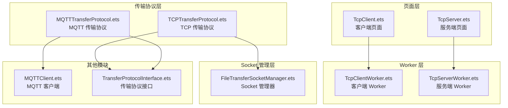
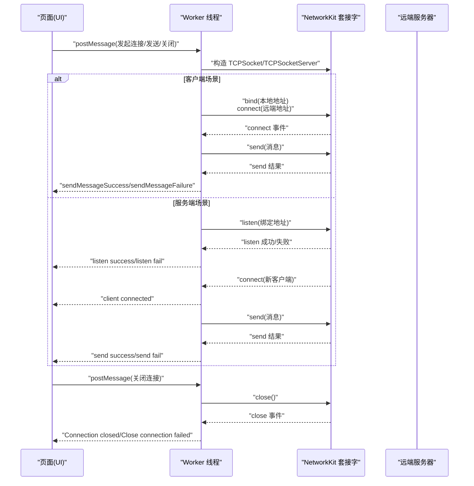
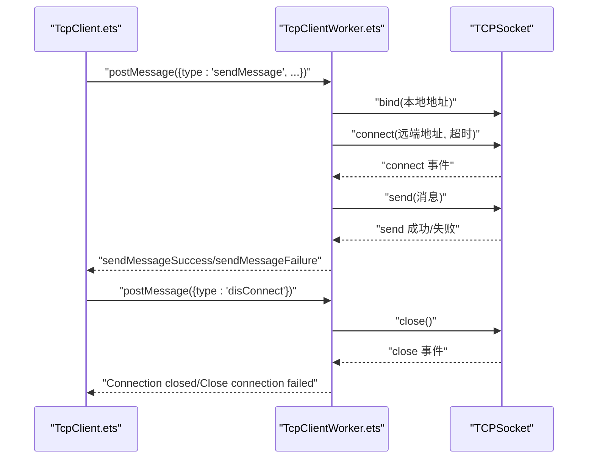
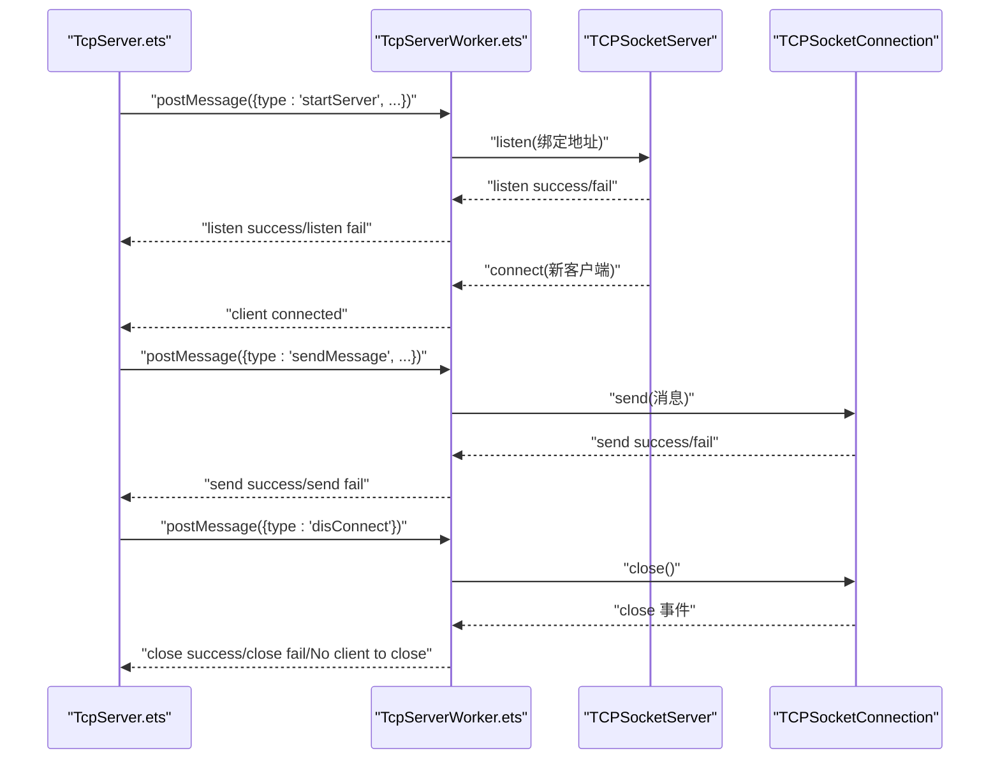
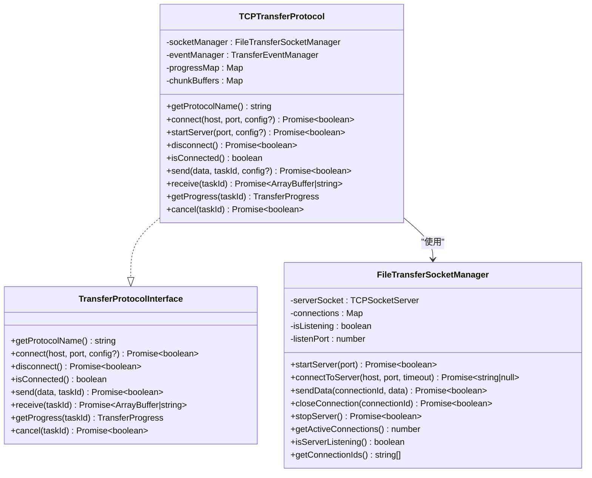
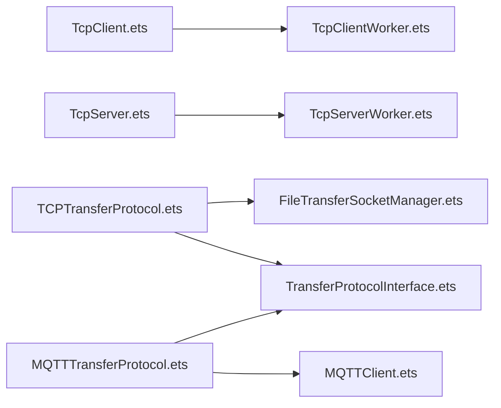

# TCP 通信 API

<cite>
**本文引用的文件**
- [TcpClient.ets](file://entry/src/main/ets/manager/broker/socket/TcpClient.ets)
- [TcpServer.ets](file://entry/src/main/ets/manager/broker/socket/TcpServer.ets)
- [TcpClientWorker.ets](file://entry/src/main/ets/workers/TcpClientWorker.ets)
- [TcpServerWorker.ets](file://entry/src/main/ets/workers/TcpServerWorker.ets)
- [TCPTransferProtocol.ets](file://entry/src/main/ets/manager/transfer/protocol/TCPTransferProtocol.ets)
- [TransferProtocolInterface.ets](file://entry/src/main/ets/manager/transfer/protocol/TransferProtocolInterface.ets)
- [FileTransferSocketManager.ets](file://entry/src/main/ets/manager/transfer/socket/FileTransferSocketManager.ets)
- [MQTTClient.ets](file://entry/src/main/ets/manager/broker/MQTTClient.ets)
- [MQTTTransferProtocol.ets](file://entry/src/main/ets/manager/transfer/protocol/MQTTTransferProtocol.ets)
</cite>

## 目录
1. [简介](#简介)
2. [项目结构](#项目结构)
3. [核心组件](#核心组件)
4. [架构总览](#架构总览)
5. [详细组件分析](#详细组件分析)
6. [依赖关系分析](#依赖关系分析)
7. [性能考量](#性能考量)
8. [故障排查指南](#故障排查指南)
9. [结论](#结论)
10. [附录](#附录)

## 简介
本文件为 TCP 通信 API 的权威文档，覆盖 TcpClient 与 TcpServer 的完整接口规范与使用说明。重点包括：
- TcpClient 的连接建立、数据发送、接收处理与连接管理（含异步连接、错误处理与连接状态监控）
- TcpServer 的服务端功能（启动监听、客户端连接管理、并发处理与数据传输）
- TCP 与 MQTT 两种通信方式的差异与适用场景
- 完整使用示例（客户端连接流程、服务器监听机制、数据传输协议与异常处理策略）

## 项目结构
本项目采用“前端页面 + Worker 线程 + 网络套接字”的分层设计：
- 页面层：负责用户交互与事件触发
- Worker 层：封装底层网络套接字操作，避免阻塞主线程
- 传输协议层：抽象统一的传输接口，支持 TCP 与 MQTT 两种实现

图表来源
- [TcpClient.ets](file://entry/src/main/ets/manager/broker/socket/TcpClient.ets#L184-L236)
- [TcpServer.ets](file://entry/src/main/ets/manager/broker/socket/TcpServer.ets#L184-L276)
- [TcpClientWorker.ets](file://entry/src/main/ets/workers/TcpClientWorker.ets#L33-L154)
- [TcpServerWorker.ets](file://entry/src/main/ets/workers/TcpServerWorker.ets#L34-L172)
- [TCPTransferProtocol.ets](file://entry/src/main/ets/manager/transfer/protocol/TCPTransferProtocol.ets#L23-L38)
- [MQTTTransferProtocol.ets](file://entry/src/main/ets/manager/transfer/protocol/MQTTTransferProtocol.ets#L10-L18)
- [FileTransferSocketManager.ets](file://entry/src/main/ets/manager/transfer/socket/FileTransferSocketManager.ets#L31-L56)
- [TransferProtocolInterface.ets](file://entry/src/main/ets/manager/transfer/protocol/TransferProtocolInterface.ets#L63-L119)

章节来源
- [TcpClient.ets](file://entry/src/main/ets/manager/broker/socket/TcpClient.ets#L1-L246)
- [TcpServer.ets](file://entry/src/main/ets/manager/broker/socket/TcpServer.ets#L1-L287)

## 核心组件
- TcpClient：提供客户端连接、发送消息、关闭连接的能力，通过 Worker 线程执行底层网络操作，并通过消息通道回传状态与结果。
- TcpServer：提供启动监听、接收消息、向客户端发送消息、关闭连接的能力，同样通过 Worker 线程处理网络事件。
- TCPTransferProtocol：实现统一的传输协议接口，封装 TCP 文件传输的握手、分块、重试与进度上报。
- FileTransferSocketManager：统一管理 TCP Socket 的生命周期，支持服务端监听与客户端连接。
- MQTTClient 与 MQTTTransferProtocol：提供基于 MQTT 的消息发布/订阅能力，适用于小文件或事件驱动场景。

章节来源
- [TcpClientWorker.ets](file://entry/src/main/ets/workers/TcpClientWorker.ets#L28-L154)
- [TcpServerWorker.ets](file://entry/src/main/ets/workers/TcpServerWorker.ets#L26-L172)
- [TCPTransferProtocol.ets](file://entry/src/main/ets/manager/transfer/protocol/TCPTransferProtocol.ets#L23-L351)
- [FileTransferSocketManager.ets](file://entry/src/main/ets/manager/transfer/socket/FileTransferSocketManager.ets#L31-L354)
- [MQTTClient.ets](file://entry/src/main/ets/manager/broker/MQTTClient.ets#L24-L223)
- [MQTTTransferProtocol.ets](file://entry/src/main/ets/manager/transfer/protocol/MQTTTransferProtocol.ets#L10-L185)

## 架构总览
下图展示了 TCP 通信的端到端调用链路与事件流转：

图表来源
- [TcpClient.ets](file://entry/src/main/ets/manager/broker/socket/TcpClient.ets#L184-L236)
- [TcpServer.ets](file://entry/src/main/ets/manager/broker/socket/TcpServer.ets#L184-L276)
- [TcpClientWorker.ets](file://entry/src/main/ets/workers/TcpClientWorker.ets#L33-L154)
- [TcpServerWorker.ets](file://entry/src/main/ets/workers/TcpServerWorker.ets#L34-L172)

## 详细组件分析

### TcpClient 组件
- 功能职责
  - 构建 UI 并收集用户输入（服务端 IP/端口、消息内容）
  - 通过 Worker 线程发起连接与发送请求
  - 监听 Worker 回传的事件，更新消息历史与状态
- 关键接口
  - connectToServer：组装消息并发送至 Worker，订阅回传事件
  - closeConnection：请求 Worker 关闭连接并处理回传状态
- 异步与错误处理
  - 使用 postMessage/onmessage 进行异步通信
  - Worker 内部捕获连接/发送/关闭过程中的异常并通过消息回传 UI
- 连接状态监控
  - UI 侧通过消息历史与日志展示连接状态变化

图表来源
- [TcpClient.ets](file://entry/src/main/ets/manager/broker/socket/TcpClient.ets#L184-L236)
- [TcpClientWorker.ets](file://entry/src/main/ets/workers/TcpClientWorker.ets#L33-L154)

章节来源
- [TcpClient.ets](file://entry/src/main/ets/manager/broker/socket/TcpClient.ets#L184-L236)
- [TcpClientWorker.ets](file://entry/src/main/ets/workers/TcpClientWorker.ets#L33-L154)

### TcpServer 组件
- 功能职责
  - 构建 UI 并允许用户设置监听端口
  - 启动监听、接收客户端连接、处理消息与发送响应
  - 提供关闭连接能力
- 关键接口
  - startServer：启动监听并将状态回传 UI
  - sendMessage：向已连接客户端发送消息
  - closeConnection：关闭当前客户端连接
- 并发处理
  - Worker 内部维护单个客户端连接对象，收到新连接会覆盖旧连接
  - 通过事件回调处理消息与关闭事件
- 错误处理
  - 监听失败、发送失败、无客户端可关闭等情况均通过消息回传 UI

图表来源
- [TcpServer.ets](file://entry/src/main/ets/manager/broker/socket/TcpServer.ets#L184-L276)
- [TcpServerWorker.ets](file://entry/src/main/ets/workers/TcpServerWorker.ets#L34-L172)

章节来源
- [TcpServer.ets](file://entry/src/main/ets/manager/broker/socket/TcpServer.ets#L184-L276)
- [TcpServerWorker.ets](file://entry/src/main/ets/workers/TcpServerWorker.ets#L34-L172)

### TCPTransferProtocol 与 FileTransferSocketManager
- TCPTransferProtocol
  - 实现统一传输协议接口，提供连接、启动服务器、发送/接收、断开、进度查询与取消能力
  - 支持分块传输、重试机制与进度上报
- FileTransferSocketManager
  - 统一管理 TCP Socket 生命周期，支持服务端监听与客户端连接
  - 提供连接池、连接信息记录与消息处理钩子

图表来源
- [TransferProtocolInterface.ets](file://entry/src/main/ets/manager/transfer/protocol/TransferProtocolInterface.ets#L63-L119)
- [TCPTransferProtocol.ets](file://entry/src/main/ets/manager/transfer/protocol/TCPTransferProtocol.ets#L23-L351)
- [FileTransferSocketManager.ets](file://entry/src/main/ets/manager/transfer/socket/FileTransferSocketManager.ets#L31-L354)

章节来源
- [TCPTransferProtocol.ets](file://entry/src/main/ets/manager/transfer/protocol/TCPTransferProtocol.ets#L23-L351)
- [FileTransferSocketManager.ets](file://entry/src/main/ets/manager/transfer/socket/FileTransferSocketManager.ets#L31-L354)
- [TransferProtocolInterface.ets](file://entry/src/main/ets/manager/transfer/protocol/TransferProtocolInterface.ets#L63-L119)

### MQTT 通信对比
- MQTTClient
  - 提供连接、订阅、发布、销毁等能力，内置自动重连与事件监听
- MQTTTransferProtocol
  - 基于现有 MQTT 客户端实现小文件传输，采用重试与进度上报
- 与 TCP 的区别
  - MQTT：面向主题的发布/订阅，适合事件驱动与小文件传输；TCP：点对点可靠传输，适合大文件分块传输
  - MQTT 更易扩展多客户端广播，TCP 更适合高吞吐、可控的文件传输

章节来源
- [MQTTClient.ets](file://entry/src/main/ets/manager/broker/MQTTClient.ets#L24-L223)
- [MQTTTransferProtocol.ets](file://entry/src/main/ets/manager/transfer/protocol/MQTTTransferProtocol.ets#L10-L185)

## 依赖关系分析
- 页面与 Worker 的耦合度低，通过消息通道解耦
- TCPTransferProtocol 依赖 FileTransferSocketManager 管理连接
- MQTTTransferProtocol 依赖 MQTTClient 客户端
- 传输协议统一实现 TransferProtocolInterface 接口，便于替换与扩展

图表来源
- [TcpClient.ets](file://entry/src/main/ets/manager/broker/socket/TcpClient.ets#L1-L246)
- [TcpServer.ets](file://entry/src/main/ets/manager/broker/socket/TcpServer.ets#L1-L287)
- [TcpClientWorker.ets](file://entry/src/main/ets/workers/TcpClientWorker.ets#L16-L24)
- [TcpServerWorker.ets](file://entry/src/main/ets/workers/TcpServerWorker.ets#L16-L24)
- [TCPTransferProtocol.ets](file://entry/src/main/ets/manager/transfer/protocol/TCPTransferProtocol.ets#L5-L10)
- [MQTTTransferProtocol.ets](file://entry/src/main/ets/manager/transfer/protocol/MQTTTransferProtocol.ets#L5-L8)
- [FileTransferSocketManager.ets](file://entry/src/main/ets/manager/transfer/socket/FileTransferSocketManager.ets#L5-L8)
- [TransferProtocolInterface.ets](file://entry/src/main/ets/manager/transfer/protocol/TransferProtocolInterface.ets#L5-L10)

章节来源
- [TcpClient.ets](file://entry/src/main/ets/manager/broker/socket/TcpClient.ets#L1-L246)
- [TcpServer.ets](file://entry/src/main/ets/manager/broker/socket/TcpServer.ets#L1-L287)
- [TcpClientWorker.ets](file://entry/src/main/ets/workers/TcpClientWorker.ets#L16-L24)
- [TcpServerWorker.ets](file://entry/src/main/ets/workers/TcpServerWorker.ets#L16-L24)
- [TCPTransferProtocol.ets](file://entry/src/main/ets/manager/transfer/protocol/TCPTransferProtocol.ets#L5-L10)
- [MQTTTransferProtocol.ets](file://entry/src/main/ets/manager/transfer/protocol/MQTTTransferProtocol.ets#L5-L8)
- [FileTransferSocketManager.ets](file://entry/src/main/ets/manager/transfer/socket/FileTransferSocketManager.ets#L5-L8)
- [TransferProtocolInterface.ets](file://entry/src/main/ets/manager/transfer/protocol/TransferProtocolInterface.ets#L5-L10)

## 性能考量
- 异步非阻塞：通过 Worker 线程处理网络 I/O，避免阻塞 UI
- 超时控制：连接与发送均设置超时，防止长时间挂起
- 事件驱动：基于事件回调处理消息与关闭，降低轮询开销
- 分块传输：大文件采用分块与重试，提升稳定性与可观测性
- 连接复用：Socket 管理器统一维护连接池，减少频繁创建销毁

## 故障排查指南
- 常见问题
  - 连接失败：检查 IP/端口、网络权限与防火墙设置
  - 发送失败：确认连接状态、消息格式与服务端是否接收
  - 无客户端可关闭：确保已建立有效连接后再关闭
- 日志定位
  - Worker 内部使用性能分析工具输出关键事件与错误信息
  - 页面侧通过消息历史记录状态变化
- 建议流程
  - 先验证网络连通性
  - 再检查服务端监听状态
  - 最后核对消息格式与事件回调

章节来源
- [TcpClientWorker.ets](file://entry/src/main/ets/workers/TcpClientWorker.ets#L76-L154)
- [TcpServerWorker.ets](file://entry/src/main/ets/workers/TcpServerWorker.ets#L78-L172)
- [TcpClient.ets](file://entry/src/main/ets/manager/broker/socket/TcpClient.ets#L184-L236)
- [TcpServer.ets](file://entry/src/main/ets/manager/broker/socket/TcpServer.ets#L184-L276)

## 结论
本项目提供了完整的 TCP 通信能力与统一的传输协议抽象，既满足简单消息收发，又支持大文件分块传输与进度监控。通过 Worker 线程与事件驱动模型，保证了 UI 的流畅性与系统的可扩展性。结合 MQTT 的事件驱动特性，可在不同场景下灵活选择合适的通信方案。

## 附录

### 使用示例（客户端连接流程）
- 在页面输入服务端 IP/端口与消息内容
- 点击“连接”按钮，页面通过 Worker 发起连接与发送
- Worker 完成后回传成功/失败消息，页面更新历史记录

章节来源
- [TcpClient.ets](file://entry/src/main/ets/manager/broker/socket/TcpClient.ets#L184-L236)
- [TcpClientWorker.ets](file://entry/src/main/ets/workers/TcpClientWorker.ets#L33-L154)

### 使用示例（服务器监听机制）
- 在页面输入监听端口
- 点击“启动服务器”，Worker 执行监听并回传状态
- 客户端连接后，服务端回传“client connected”
- 页面可向客户端发送消息并查看回传结果

章节来源
- [TcpServer.ets](file://entry/src/main/ets/manager/broker/socket/TcpServer.ets#L184-L276)
- [TcpServerWorker.ets](file://entry/src/main/ets/workers/TcpServerWorker.ets#L34-L172)

### 数据传输协议与异常处理策略
- 协议策略
  - TCP：点对点可靠传输，适合大文件分块与进度监控
  - MQTT：事件驱动，适合小文件与多客户端广播
- 异常处理
  - 超时、连接失败、发送失败均通过消息回传 UI
  - 重试机制与进度上报增强可观测性

章节来源
- [TCPTransferProtocol.ets](file://entry/src/main/ets/manager/transfer/protocol/TCPTransferProtocol.ets#L123-L205)
- [MQTTTransferProtocol.ets](file://entry/src/main/ets/manager/transfer/protocol/MQTTTransferProtocol.ets#L70-L109)