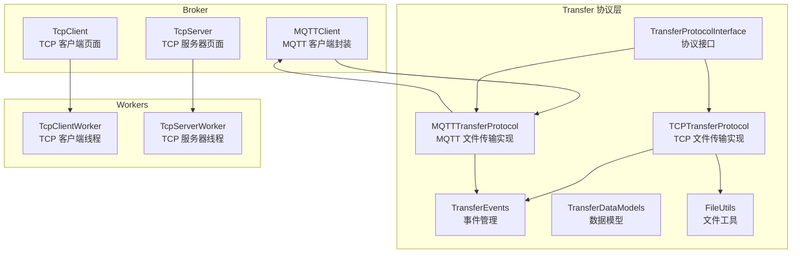
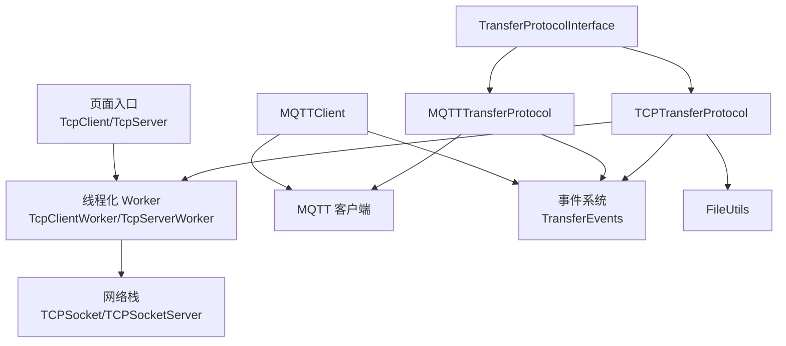
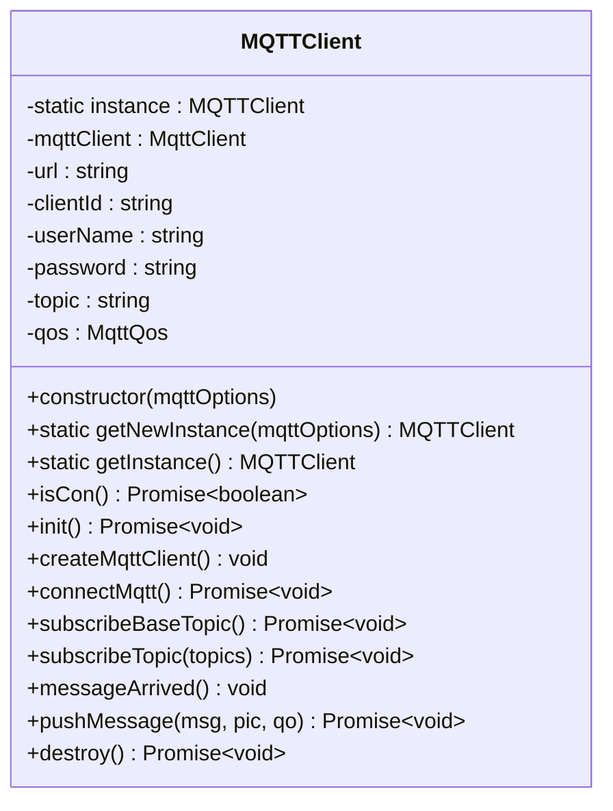
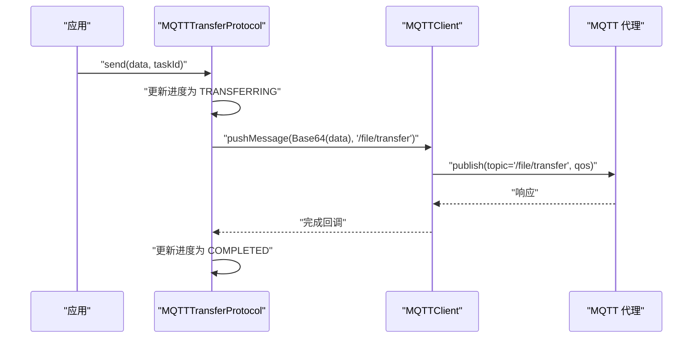
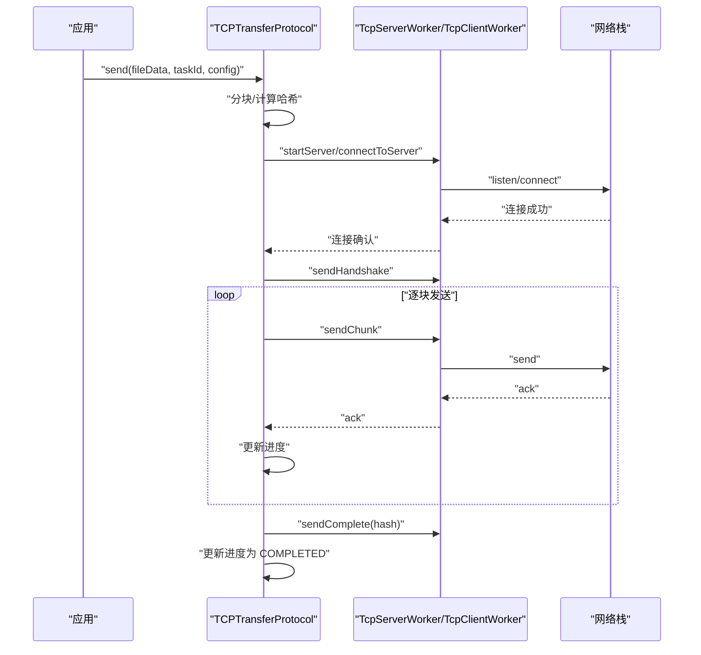
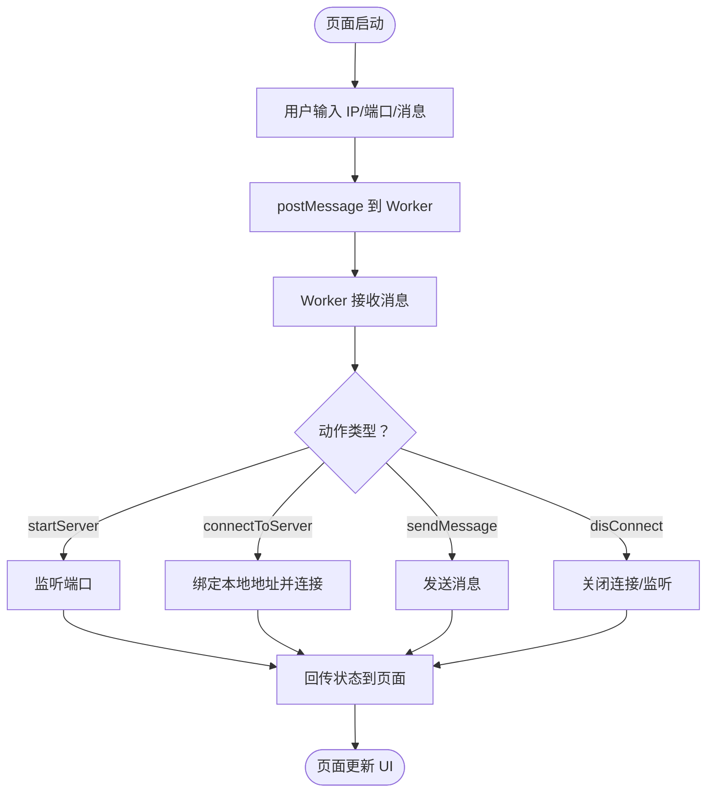
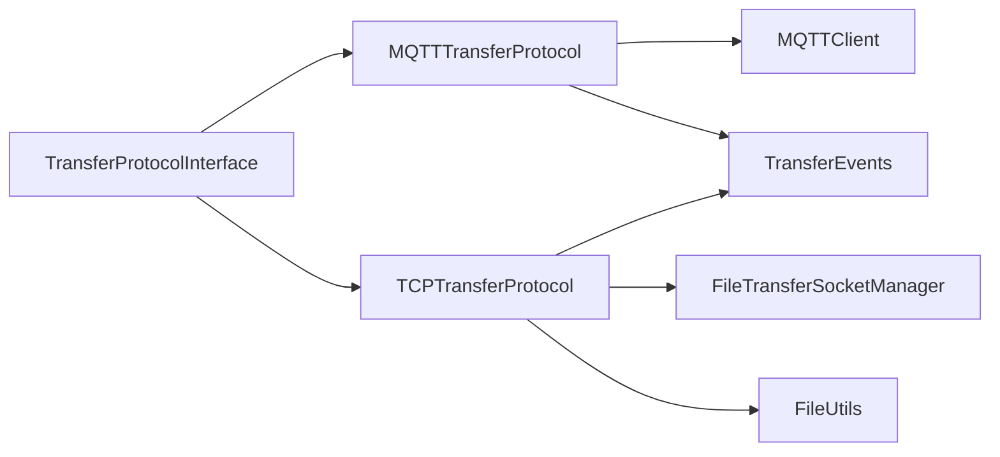

# 通信 API

<cite>
**本文引用的文件**
- [MQTTClient.ets](file://entry/src/main/ets/manager/broker/MQTTClient.ets)
- [MQTTConfig.ets](file://entry/src/main/ets/manager/broker/MQTTConfig.ets)
- [MQTTTransferProtocol.ets](file://entry/src/main/ets/manager/transfer/protocol/MQTTTransferProtocol.ets)
- [TCPTransferProtocol.ets](file://entry/src/main/ets/manager/transfer/protocol/TCPTransferProtocol.ets)
- [TransferProtocolInterface.ets](file://entry/src/main/ets/manager/transfer/protocol/TransferProtocolInterface.ets)
- [TransferEvents.ets](file://entry/src/main/ets/manager/transfer/event/TransferEvents.ets)
- [TransferDataModels.ets](file://entry/src/main/ets/manager/transfer/model/TransferDataModels.ets)
- [FileUtils.ets](file://entry/src/main/ets/manager/transfer/utils/FileUtils.ets)
- [TransferExamples.ets](file://entry/src/main/ets/manager/transfer/examples/TransferExamples.ets)
- [TcpClient.ets](file://entry/src/main/ets/manager/broker/socket/TcpClient.ets)
- [TcpServer.ets](file://entry/src/main/ets/manager/broker/socket/TcpServer.ets)
- [TcpClientWorker.ets](file://entry/src/main/ets/workers/TcpClientWorker.ets)
- [TcpServerWorker.ets](file://entry/src/main/ets/workers/TcpServerWorker.ets)
</cite>

## 目录
1. [简介](#简介)
2. [项目结构](#项目结构)
3. [核心组件](#核心组件)
4. [架构总览](#架构总览)
5. [详细组件分析](#详细组件分析)
6. [依赖关系分析](#依赖关系分析)
7. [性能考量](#性能考量)
8. [故障排查指南](#故障排查指南)
9. [结论](#结论)
10. [附录](#附录)

## 简介
本文件为通信 API 的详细技术文档，覆盖以下内容：
- MQTTClient 类的完整方法说明：连接配置、消息发布/订阅、事件监听、连接状态管理与销毁
- MQTT 配置参数、连接状态管理、消息格式与主题订阅策略
- TCP 通信相关的客户端与服务器 API：连接建立、数据传输、错误处理与线程化工作流
- 文件传输协议抽象与实现：MQTT 与 TCP 两种协议的统一接口、进度跟踪、事件驱动
- 通信协议示例与最佳实践建议

## 项目结构
通信相关代码主要分布在如下模块：
- broker：MQTT 客户端封装与 TCP 客户端/服务器页面入口
- transfer：文件传输协议层（接口、实现、事件、数据模型、工具）
- workers：TCP 通信的线程化实现（客户端与服务器）

图表来源
- [MQTTClient.ets](file://entry/src/main/ets/manager/broker/MQTTClient.ets#L24-L220)
- [TcpClient.ets](file://entry/src/main/ets/manager/broker/socket/TcpClient.ets#L1-L246)
- [TcpServer.ets](file://entry/src/main/ets/manager/broker/socket/TcpServer.ets#L1-L287)
- [MQTTTransferProtocol.ets](file://entry/src/main/ets/manager/transfer/protocol/MQTTTransferProtocol.ets#L10-L184)
- [TCPTransferProtocol.ets](file://entry/src/main/ets/manager/transfer/protocol/TCPTransferProtocol.ets#L23-L350)
- [TransferEvents.ets](file://entry/src/main/ets/manager/transfer/event/TransferEvents.ets#L62-L205)
- [TransferDataModels.ets](file://entry/src/main/ets/manager/transfer/model/TransferDataModels.ets#L10-L112)
- [FileUtils.ets](file://entry/src/main/ets/manager/transfer/utils/FileUtils.ets#L8-L192)
- [TcpClientWorker.ets](file://entry/src/main/ets/workers/TcpClientWorker.ets#L16-L179)
- [TcpServerWorker.ets](file://entry/src/main/ets/workers/TcpServerWorker.ets#L16-L201)

章节来源
- [MQTTClient.ets](file://entry/src/main/ets/manager/broker/MQTTClient.ets#L1-L223)
- [TcpClient.ets](file://entry/src/main/ets/manager/broker/socket/TcpClient.ets#L1-L246)
- [TcpServer.ets](file://entry/src/main/ets/manager/broker/socket/TcpServer.ets#L1-L287)
- [MQTTTransferProtocol.ets](file://entry/src/main/ets/manager/transfer/protocol/MQTTTransferProtocol.ets#L1-L185)
- [TCPTransferProtocol.ets](file://entry/src/main/ets/manager/transfer/protocol/TCPTransferProtocol.ets#L1-L351)
- [TransferEvents.ets](file://entry/src/main/ets/manager/transfer/event/TransferEvents.ets#L1-L206)
- [TransferDataModels.ets](file://entry/src/main/ets/manager/transfer/model/TransferDataModels.ets#L1-L113)
- [FileUtils.ets](file://entry/src/main/ets/manager/transfer/utils/FileUtils.ets#L1-L193)
- [TcpClientWorker.ets](file://entry/src/main/ets/workers/TcpClientWorker.ets#L1-L179)
- [TcpServerWorker.ets](file://entry/src/main/ets/workers/TcpServerWorker.ets#L1-L201)

## 核心组件
- MQTTClient：对系统 MQTT 客户端的封装，负责连接、订阅、消息收发、事件派发与销毁
- MQTTTransferProtocol：基于 MQTT 的文件传输实现，负责连接检查、消息发布、进度上报
- TCPTransferProtocol：基于 TCP 的文件传输实现，负责连接/监听、分块传输、握手、进度与事件
- TransferProtocolInterface：传输协议统一接口，定义 connect/disconnect/isConnected/send/receive/getProgress/cancel
- TransferEvents：传输事件管理，提供事件的发送、监听、移除与批量清理
- TransferDataModels：传输相关数据模型（文件、分块、任务、握手消息、传输配置）
- FileUtils：文件工具，提供分块、重组、哈希计算、Base64 编解码、字符串与 ArrayBuffer 转换
- TcpClient/TcpServer 页面：UI 入口，通过线程化 Worker 与网络栈交互
- TcpClientWorker/TcpServerWorker：线程化 TCP 通信实现，处理 connect/send/close 等网络事件

章节来源
- [MQTTClient.ets](file://entry/src/main/ets/manager/broker/MQTTClient.ets#L24-L220)
- [MQTTTransferProtocol.ets](file://entry/src/main/ets/manager/transfer/protocol/MQTTTransferProtocol.ets#L10-L184)
- [TCPTransferProtocol.ets](file://entry/src/main/ets/manager/transfer/protocol/TCPTransferProtocol.ets#L23-L350)
- [TransferProtocolInterface.ets](file://entry/src/main/ets/manager/transfer/protocol/TransferProtocolInterface.ets#L63-L119)
- [TransferEvents.ets](file://entry/src/main/ets/manager/transfer/event/TransferEvents.ets#L62-L205)
- [TransferDataModels.ets](file://entry/src/main/ets/manager/transfer/model/TransferDataModels.ets#L10-L112)
- [FileUtils.ets](file://entry/src/main/ets/manager/transfer/utils/FileUtils.ets#L8-L192)
- [TcpClient.ets](file://entry/src/main/ets/manager/broker/socket/TcpClient.ets#L1-L246)
- [TcpServer.ets](file://entry/src/main/ets/manager/broker/socket/TcpServer.ets#L1-L287)
- [TcpClientWorker.ets](file://entry/src/main/ets/workers/TcpClientWorker.ets#L16-L179)
- [TcpServerWorker.ets](file://entry/src/main/ets/workers/TcpServerWorker.ets#L16-L201)

## 架构总览
下图展示 MQTT 与 TCP 两类传输协议在系统中的位置与交互关系。

图表来源
- [MQTTClient.ets](file://entry/src/main/ets/manager/broker/MQTTClient.ets#L24-L220)
- [MQTTTransferProtocol.ets](file://entry/src/main/ets/manager/transfer/protocol/MQTTTransferProtocol.ets#L10-L184)
- [TCPTransferProtocol.ets](file://entry/src/main/ets/manager/transfer/protocol/TCPTransferProtocol.ets#L23-L350)
- [TransferEvents.ets](file://entry/src/main/ets/manager/transfer/event/TransferEvents.ets#L62-L205)
- [FileUtils.ets](file://entry/src/main/ets/manager/transfer/utils/FileUtils.ets#L8-L192)
- [TcpClientWorker.ets](file://entry/src/main/ets/workers/TcpClientWorker.ets#L16-L179)
- [TcpServerWorker.ets](file://entry/src/main/ets/workers/TcpServerWorker.ets#L16-L201)

## 详细组件分析

### MQTTClient 类 API 文档
- 功能概述
  - 单例封装系统 MQTT 客户端，负责连接、订阅、消息收发、事件派发与销毁
  - 内置基础主题订阅与通用主题批量订阅
  - 通过事件系统向应用层派发消息

- 关键字段
  - url：服务器地址（协议支持 tcp/ssl/ws/wss）
  - clientId：客户端标识
  - userName/password：认证凭据
  - topic：默认发布/订阅主题
  - qos：服务质量等级

- 关键方法
  - 构造函数：接收 MQTTOptionsType，初始化并触发 init
  - getNewInstance：创建新实例
  - getInstance：获取单例实例（未初始化时抛错）
  - isCon：异步检查连接状态
  - init：创建客户端、连接、订阅基础主题、注册消息监听
  - createMqttClient：创建系统 MQTT 客户端实例
  - connectMqtt：连接服务器（支持用户名/密码、超时、自动重连、MQTT 版本）
  - subscribeBaseTopic：订阅基础主题，并追加订阅一组常用主题
  - subscribeTopic：批量订阅主题
  - messageArrived：注册消息到达回调，解析主题并派发事件
  - pushMessage：发布消息到指定主题（默认使用默认主题与 QoS）
  - destroy：销毁客户端并清理事件监听

- 事件派发
  - 通用事件：EVENTID（高优先级）
  - 结果事件：RESULT_EVENT_ID（即时优先级）

- 连接状态管理
  - 通过系统客户端 isConnected 判断
  - 支持自动重连与超时控制

- 消息格式与主题
  - payload：字符串（或 Base64 编码的二进制数据）
  - 主题：默认 topic；常用主题包括设备列表、状态、任务分配、任务结果、优化参数、测试延迟等

- 错误处理
  - 连接/订阅/发布均包含错误捕获与日志输出
  - 未初始化访问 getInstance 抛出错误

章节来源
- [MQTTClient.ets](file://entry/src/main/ets/manager/broker/MQTTClient.ets#L15-L220)
- [MQTTConfig.ets](file://entry/src/main/ets/manager/broker/MQTTConfig.ets#L1-L7)

#### MQTTClient 类图

图表来源
- [MQTTClient.ets](file://entry/src/main/ets/manager/broker/MQTTClient.ets#L24-L220)

### MQTTTransferProtocol 文件传输协议
- 协议接口实现
  - getProtocolName：返回协议名称
  - connect：检查 MQTT 连接状态（异步）
  - disconnect：通常无需主动断开
  - isConnected：同步检查（建议使用异步 isCon）
  - send：将数据转换为 Base64 并发布到 /file/transfer 主题
  - receive：接口一致性占位（MQTT 为推送模式）
  - getProgress/cancel：进度跟踪与取消
  - 进度清理：完成后 1 分钟内清理

- 重试与超时
  - 默认超时 30 秒，最多重试 3 次
  - 失败时更新进度并携带错误信息

- 与 MQTTClient 的耦合
  - 通过单例获取 MQTT 客户端实例
  - 依赖其连接状态与消息发布能力

章节来源
- [MQTTTransferProtocol.ets](file://entry/src/main/ets/manager/transfer/protocol/MQTTTransferProtocol.ets#L10-L184)

#### MQTT 文件传输序列图

图表来源
- [MQTTTransferProtocol.ets](file://entry/src/main/ets/manager/transfer/protocol/MQTTTransferProtocol.ets#L70-L109)
- [MQTTClient.ets](file://entry/src/main/ets/manager/broker/MQTTClient.ets#L190-L203)

### TCPTransferProtocol 文件传输协议
- 协议接口实现
  - getProtocolName：返回协议名称
  - connect：作为客户端连接到远端服务器（带超时）
  - startServer：作为服务端启动监听（默认端口）
  - disconnect：停止服务器
  - isConnected：检查服务器监听或活跃连接数
  - send：大文件分块传输（默认 128KB/块），发送握手、逐块发送、完成通知
  - receive：等待并重组分块，计算哈希校验
  - getProgress/cancel：进度跟踪与取消
  - 进度清理：完成后 1 分钟内清理

- 分块与哈希
  - 分块：按 chunkSize 切分，记录索引与总数
  - 哈希：SHA-256，用于完整性校验
  - Base64：MQTT 传输场景下的二进制编码

- 事件与进度
  - 通过 TransferEvents 发送传输开始/进度/完成/失败/取消等事件
  - 进度包含已传字节、总字节、百分比与可选错误信息

- 错误处理
  - 连接/监听/发送/接收均包含 try/catch 与错误上报
  - 超过最大重试次数后标记失败并清理进度

章节来源
- [TCPTransferProtocol.ets](file://entry/src/main/ets/manager/transfer/protocol/TCPTransferProtocol.ets#L23-L350)
- [TransferEvents.ets](file://entry/src/main/ets/manager/transfer/event/TransferEvents.ets#L62-L205)
- [FileUtils.ets](file://entry/src/main/ets/manager/transfer/utils/FileUtils.ets#L8-L192)

#### TCP 文件传输序列图

图表来源
- [TCPTransferProtocol.ets](file://entry/src/main/ets/manager/transfer/protocol/TCPTransferProtocol.ets#L123-L205)
- [TcpServerWorker.ets](file://entry/src/main/ets/workers/TcpServerWorker.ets#L52-L118)
- [TcpClientWorker.ets](file://entry/src/main/ets/workers/TcpClientWorker.ets#L47-L132)

### TransferProtocolInterface 与数据模型
- TransferProtocolInterface：定义协议统一接口，便于扩展新的传输方式
- TransferState：空闲/连接中/传输中/完成/失败/取消
- TransferProgress：任务进度信息（taskId/state/transferredBytes/totalBytes/progress/speed/eta/error）
- TransferConfig：超时、重试次数、分块大小
- TransferDataModels：FileInfo、ChunkData、TransferTask、TCPHandshakeMessage、TransferOptions

章节来源
- [TransferProtocolInterface.ets](file://entry/src/main/ets/manager/transfer/protocol/TransferProtocolInterface.ets#L6-L119)
- [TransferDataModels.ets](file://entry/src/main/ets/manager/transfer/model/TransferDataModels.ets#L10-L112)

### TransferEvents 事件系统
- TransferEventId：传输开始、进度、完成、失败、取消、TCP 连接、分块接收、文件重组等事件 ID
- TransferEventManager：事件发送/监听/移除/批量移除
- 支持优先级控制与时间戳记录

章节来源
- [TransferEvents.ets](file://entry/src/main/ets/manager/transfer/event/TransferEvents.ets#L11-L205)

### FileUtils 文件工具
- 分块与重组：chunkFile、reassembleChunks
- 哈希：calculateHash、verifyHash（SHA-256）
- 编解码：arrayBufferToBase64、base64ToArrayBuffer、arrayBufferToString、stringToArrayBuffer
- 文件信息：getFileInfo、generateFileId

章节来源
- [FileUtils.ets](file://entry/src/main/ets/manager/transfer/utils/FileUtils.ets#L8-L192)

### TCP 页面与线程化实现
- TcpClient/TcpServer 页面：提供 UI 输入（IP/端口/消息），通过 workerPort 与 Worker 通信
- TcpClientWorker：绑定本地地址、连接远端、发送消息、事件监听与关闭
- TcpServerWorker：监听端口、接受连接、接收消息、发送消息、关闭连接

章节来源
- [TcpClient.ets](file://entry/src/main/ets/manager/broker/socket/TcpClient.ets#L1-L246)
- [TcpServer.ets](file://entry/src/main/ets/manager/broker/socket/TcpServer.ets#L1-L287)
- [TcpClientWorker.ets](file://entry/src/main/ets/workers/TcpClientWorker.ets#L16-L179)
- [TcpServerWorker.ets](file://entry/src/main/ets/workers/TcpServerWorker.ets#L16-L201)

#### TCP 页面到 Worker 的交互流程

图表来源
- [TcpClient.ets](file://entry/src/main/ets/manager/broker/socket/TcpClient.ets#L184-L235)
- [TcpServer.ets](file://entry/src/main/ets/manager/broker/socket/TcpServer.ets#L184-L276)
- [TcpClientWorker.ets](file://entry/src/main/ets/workers/TcpClientWorker.ets#L33-L154)
- [TcpServerWorker.ets](file://entry/src/main/ets/workers/TcpServerWorker.ets#L34-L172)

## 依赖关系分析
- 协议层依赖
  - MQTTTransferProtocol 依赖 MQTTClient 与 TransferEvents
  - TCPTransferProtocol 依赖 FileTransferSocketManager（单例）、TransferEventManager、FileUtils
- 数据与工具
  - TransferDataModels 为协议层提供统一数据结构
  - FileUtils 为 TCP 分块与 MQTT 编解码提供支撑
- UI 与线程
  - TcpClient/TcpServer 页面通过 workerPort 与 TcpClientWorker/TcpServerWorker 交互
  - Worker 通过网络栈与远端设备通信

图表来源
- [TransferProtocolInterface.ets](file://entry/src/main/ets/manager/transfer/protocol/TransferProtocolInterface.ets#L63-L119)
- [MQTTTransferProtocol.ets](file://entry/src/main/ets/manager/transfer/protocol/MQTTTransferProtocol.ets#L10-L18)
- [TCPTransferProtocol.ets](file://entry/src/main/ets/manager/transfer/protocol/TCPTransferProtocol.ets#L23-L38)
- [MQTTClient.ets](file://entry/src/main/ets/manager/broker/MQTTClient.ets#L24-L27)
- [TransferEvents.ets](file://entry/src/main/ets/manager/transfer/event/TransferEvents.ets#L62-L75)
- [FileUtils.ets](file://entry/src/main/ets/manager/transfer/utils/FileUtils.ets#L8-L192)

章节来源
- [TransferProtocolInterface.ets](file://entry/src/main/ets/manager/transfer/protocol/TransferProtocolInterface.ets#L63-L119)
- [MQTTTransferProtocol.ets](file://entry/src/main/ets/manager/transfer/protocol/MQTTTransferProtocol.ets#L10-L18)
- [TCPTransferProtocol.ets](file://entry/src/main/ets/manager/transfer/protocol/TCPTransferProtocol.ets#L23-L38)

## 性能考量
- MQTT
  - 小文件传输建议使用 MQTT，避免分块开销
  - 合理设置 QoS 与自动重连，平衡可靠性与性能
  - 大消息建议 Base64 编码，注意内存占用
- TCP
  - 大文件传输建议使用 TCP，分块大小默认 128KB，可根据网络状况调整
  - 重试次数与超时时间影响传输稳定性，应结合业务需求调优
  - 哈希校验确保完整性，但会增加 CPU 开销
- 事件与进度
  - 频繁事件派发可能带来 UI 压力，建议合并或限频
  - 进度清理避免长期持有内存

## 故障排查指南
- MQTT
  - 连接失败：检查 url、clientId、用户名/密码、自动重连与超时设置
  - 订阅失败：确认主题存在与权限，查看日志输出
  - 发布失败：检查 payload 格式与主题，查看错误日志
  - 未初始化：getInstance 前需先调用 getNewInstance
- TCP
  - 连接/监听失败：检查端口占用、防火墙、IP 地址与超时设置
  - 发送失败：确认客户端已连接，检查网络栈回调与错误信息
  - 接收失败：确认分块缓存与重组逻辑，校验哈希
- 事件
  - 事件未触发：确认事件 ID 与优先级，检查监听注册与移除时机
  - 进度异常：检查进度更新逻辑与清理策略

章节来源
- [MQTTClient.ets](file://entry/src/main/ets/manager/broker/MQTTClient.ets#L85-L104)
- [MQTTTransferProtocol.ets](file://entry/src/main/ets/manager/transfer/protocol/MQTTTransferProtocol.ets#L70-L109)
- [TCPTransferProtocol.ets](file://entry/src/main/ets/manager/transfer/protocol/TCPTransferProtocol.ets#L123-L205)
- [TransferEvents.ets](file://entry/src/main/ets/manager/transfer/event/TransferEvents.ets#L115-L154)

## 结论
本通信 API 体系通过统一的协议接口抽象，实现了 MQTT 与 TCP 两种传输方式的无缝集成。MQTT 适合小文件与低延迟场景，TCP 适合大文件与高可靠场景。配合事件系统与进度跟踪，能够满足复杂文件传输需求。建议在实际部署中根据网络环境与业务特征合理选择协议与参数，并遵循本文的最佳实践。

## 附录
- 通信协议示例
  - MQTT 文件传输示例：参见 [TransferExamples.ets](file://entry/src/main/ets/manager/transfer/examples/TransferExamples.ets#L10-L28)
  - 大文件 TCP 传输示例：参见 [TransferExamples.ets](file://entry/src/main/ets/manager/transfer/examples/TransferExamples.ets#L31-L48)
  - 自定义配置示例：参见 [TransferExamples.ets](file://entry/src/main/ets/manager/transfer/examples/TransferExamples.ets#L77-L92)
  - 事件监听示例：参见 [TransferExamples.ets](file://entry/src/main/ets/manager/transfer/examples/TransferExamples.ets#L95-L104)
  - 完整传输流程示例：参见 [TransferExamples.ets](file://entry/src/main/ets/manager/transfer/examples/TransferExamples.ets#L154-L186)

章节来源
- [TransferExamples.ets](file://entry/src/main/ets/manager/transfer/examples/TransferExamples.ets#L10-L186)