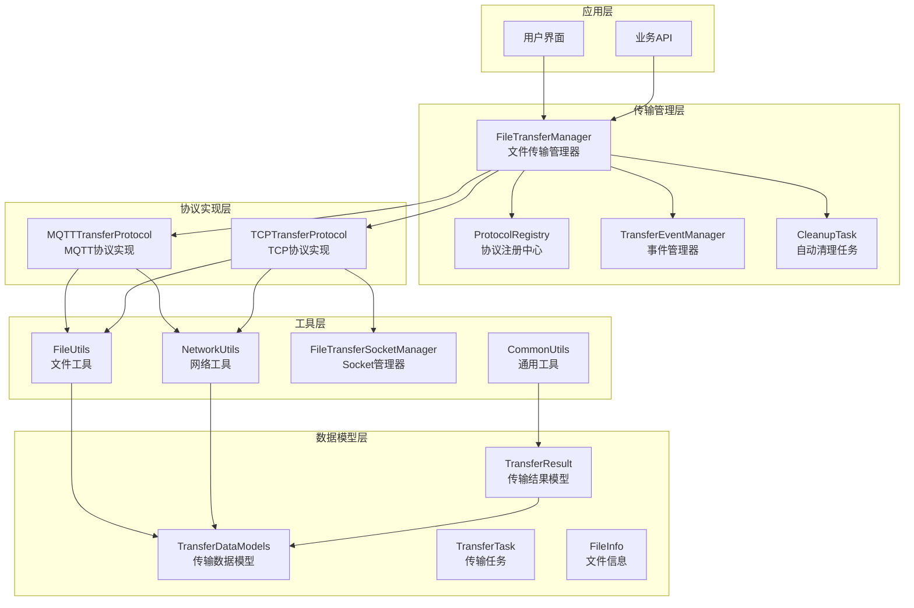
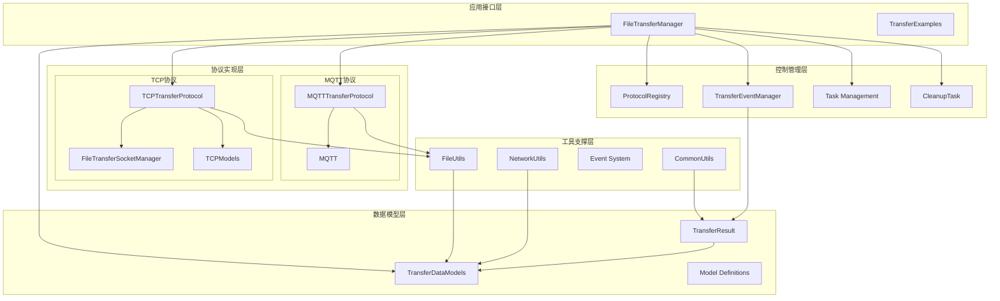
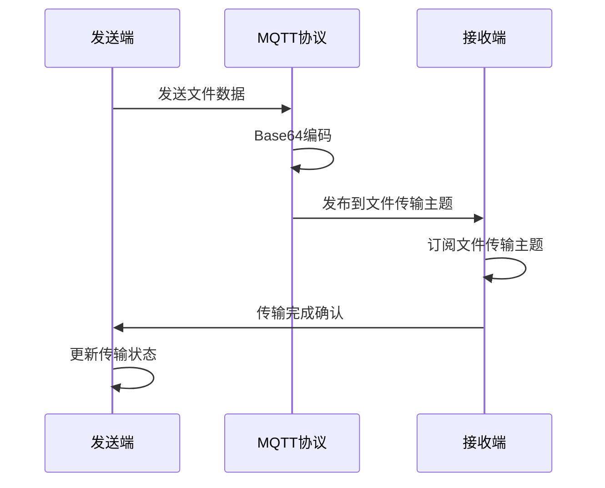
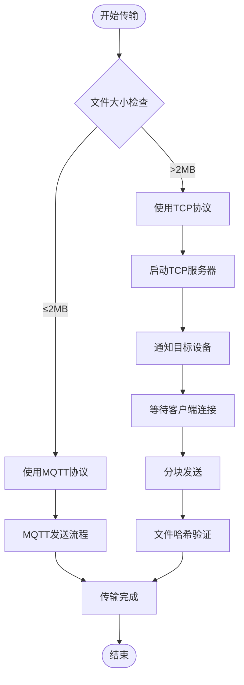
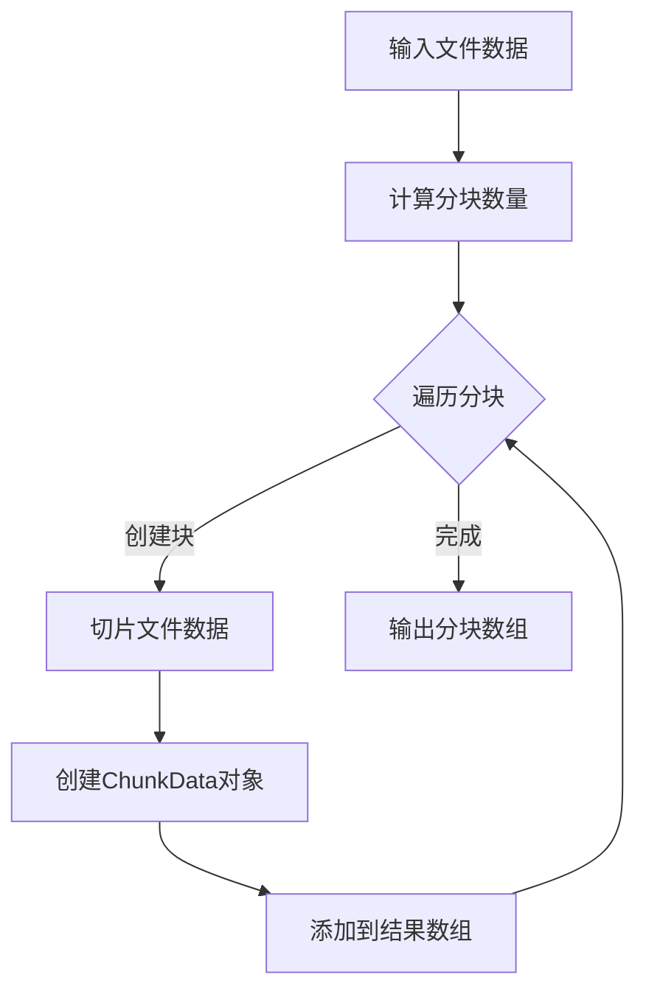
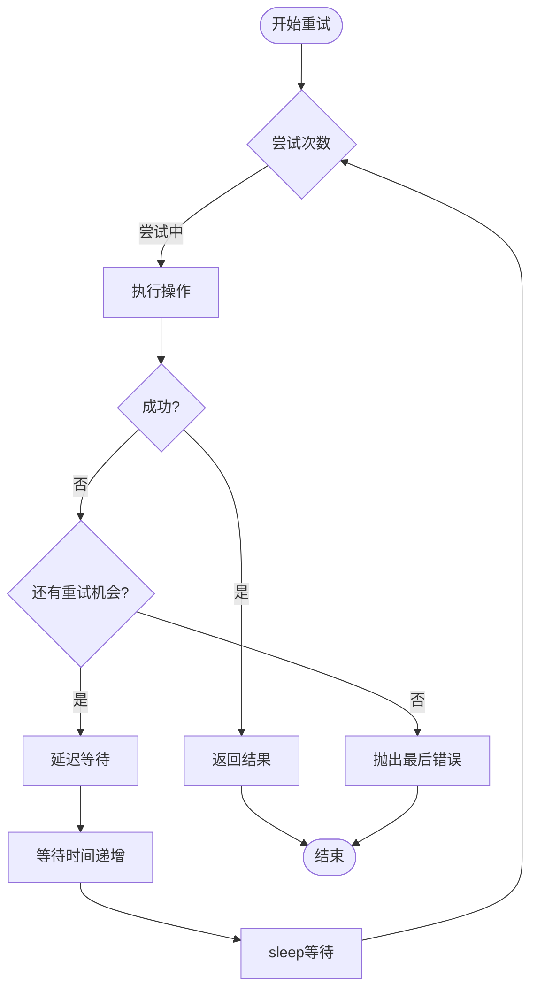
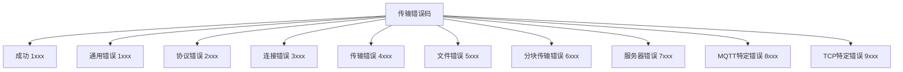
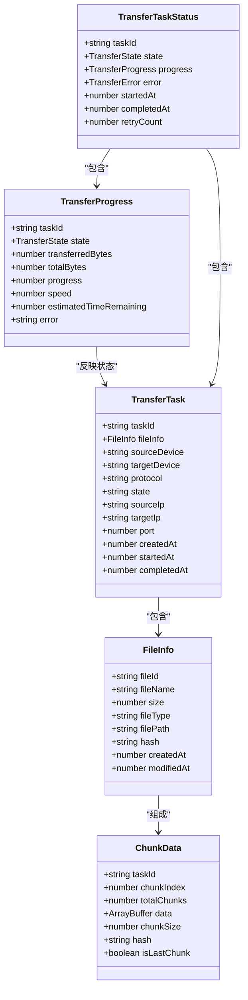
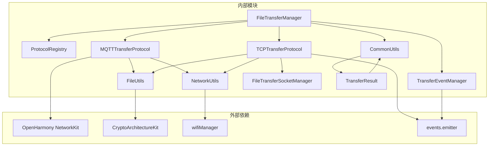

# 文件传输管理器

<cite>
**本文档引用的文件**
- [FileTransferManager.ets](file://entry/src/main/ets/manager/transfer/FileTransferManager.ets)
- [index.ets](file://entry/src/main/ets/manager/transfer/index.ets)
- [IMPLEMENTATION_SUMMARY.md](file://entry/src/main/ets/manager/transfer/IMPLEMENTATION_SUMMARY.md)
- [QUICK_REFERENCE.md](file://entry/src/main/ets/manager/transfer/QUICK_REFERENCE.md)
- [TransferProtocolInterface.ets](file://entry/src/main/ets/manager/transfer/protocol/TransferProtocolInterface.ets)
- [ProtocolRegistry.ets](file://entry/src/main/ets/manager/transfer/protocol/ProtocolRegistry.ets)
- [MQTTTransferProtocol.ets](file://entry/src/main/ets/manager/transfer/protocol/MQTTTransferProtocol.ets)
- [TCPTransferProtocol.ets](file://entry/src/main/ets/manager/transfer/protocol/TCPTransferProtocol.ets)
- [FileUtils.ets](file://entry/src/main/ets/manager/transfer/utils/FileUtils.ets)
- [NetworkUtils.ets](file://entry/src/main/ets/manager/transfer/utils/NetworkUtils.ets)
- [TransferEvents.ets](file://entry/src/main/ets/manager/transfer/event/TransferEvents.ets)
- [FileTransferSocketManager.ets](file://entry/src/main/ets/manager/transfer/socket/FileTransferSocketManager.ets)
- [TransferDataModels.ets](file://entry/src/main/ets/manager/transfer/model/TransferDataModels.ets)
- [TransferExamples.ets](file://entry/src/main/ets/manager/transfer/examples/TransferExamples.ets)
- [FileTransfer.test.ets](file://entry/src/test/transfer/FileTransfer.test.ets)
- [CommonUtils.ets](file://entry/src/main/ets/manager/transfer/utils/CommonUtils.ets)
- [TransferResult.ets](file://entry/src/main/ets/manager/transfer/model/TransferResult.ets)
</cite>

## 更新摘要
**变更内容**
- 新增自动任务清理功能，包含定时清理和手动清理机制
- 增强错误处理系统，提供更完善的异常捕获和错误恢复
- 改进状态跟踪功能，增加详细的传输状态信息
- 新增传输任务状态查询接口，提供更全面的任务管理能力
- 增强协议能力检测功能，支持动态协议能力查询

## 目录
1. [简介](#简介)
2. [项目结构](#项目结构)
3. [核心组件](#核心组件)
4. [架构概览](#架构概览)
5. [详细组件分析](#详细组件分析)
6. [依赖关系分析](#依赖关系分析)
7. [性能考虑](#性能考虑)
8. [故障排除指南](#故障排除指南)
9. [结论](#结论)
10. [附录](#附录)

## 简介

文件传输管理器是一个基于OpenHarmony平台的高性能文件传输解决方案，专为解决MQTT协议带宽限制问题而设计。该系统采用模块化架构，支持多种传输协议的动态注册和智能选择，能够根据文件大小自动选择最优的传输方式。

### 主要特性

- **协议抽象层**：统一的传输协议接口，支持MQTT和TCP协议
- **智能协议选择**：根据文件大小自动选择MQTT（≤2MB）或TCP（>2MB）协议
- **分块传输**：支持大文件的高效分块传输和重组
- **事件驱动**：完整的事件系统支持传输状态监控
- **错误处理**：完善的错误捕获和重试机制
- **可扩展性**：开放式的协议注册机制，易于添加新协议
- **自动任务清理**：定时清理已完成任务，防止内存泄漏
- **增强状态跟踪**：详细的传输状态信息和进度监控
- **协议能力检测**：动态查询协议支持的功能特性

## 项目结构

文件传输模块采用清晰的分层架构，按照功能职责进行模块化组织：



**图表来源**
- [FileTransferManager.ets:1-648](file://entry/src/main/ets/manager/transfer/FileTransferManager.ets#L1-L648)
- [ProtocolRegistry.ets:1-93](file://entry/src/main/ets/manager/transfer/protocol/ProtocolRegistry.ets#L1-L93)
- [TransferEvents.ets:1-206](file://entry/src/main/ets/manager/transfer/event/TransferEvents.ets#L1-L206)
- [CommonUtils.ets:1-226](file://entry/src/main/ets/manager/transfer/utils/CommonUtils.ets#L1-L226)

**章节来源**
- [FileTransferManager.ets:1-648](file://entry/src/main/ets/manager/transfer/FileTransferManager.ets#L1-L648)
- [index.ets:1-56](file://entry/src/main/ets/manager/transfer/index.ets#L1-L56)

## 核心组件

### 文件传输管理器（FileTransferManager）

FileTransferManager是整个文件传输系统的核心控制器，采用单例模式确保全局唯一性。它负责协调各个组件的工作，提供统一的API接口。

#### 主要功能

- **协议管理**：注册、注销和查找传输协议
- **任务调度**：管理传输任务的生命周期
- **智能选择**：根据文件大小自动选择最优协议
- **状态监控**：跟踪和报告传输进度
- **错误处理**：统一的异常捕获和错误恢复
- **自动清理**：定时清理已完成任务，防止内存泄漏
- **状态查询**：提供详细的传输状态和进度信息
- **协议检测**：动态查询协议支持的功能特性

#### 关键配置参数

| 参数名称 | 默认值 | 说明 | 调整建议 |
|---------|--------|------|----------|
| sizeThreshold | 2MB | MQTT/TCP切换阈值 | 频繁大文件可降至1MB |
| tcpChunkSize | 128KB | TCP分块大小 | WiFi好可增至256KB |
| maxRetries | 3次 | 最大重试次数 | 网络差可增至5-7次 |
| timeout | 30秒 | 连接超时 | 远距离可增至60秒 |
| tcpPort | 8888 | TCP监听端口 | 冲突时更换 |
| CLEANUP_INTERVAL | 1小时 | 自动清理间隔 | 根据使用频率调整 |
| TASK_EXPIRY_TIME | 1小时 | 任务过期时间 | 长时间运行可延长 |

**更新** 新增自动清理任务配置参数，支持定时清理已完成任务

**章节来源**
- [FileTransferManager.ets:23-648](file://entry/src/main/ets/manager/transfer/FileTransferManager.ets#L23-L648)

### 协议注册中心（ProtocolRegistry）

ProtocolRegistry实现了协议的动态注册和管理功能，采用单例模式确保全局一致性。

#### 核心能力

- **动态注册**：运行时注册新的传输协议
- **协议查找**：根据名称快速定位协议实例
- **协议列表**：提供所有可用协议的清单
- **协议注销**：安全地移除不再使用的协议

**章节来源**
- [ProtocolRegistry.ets:7-93](file://entry/src/main/ets/manager/transfer/protocol/ProtocolRegistry.ets#L7-L93)

### 传输事件管理器（TransferEventManager）

TransferEventManager基于事件驱动架构，提供完整的传输状态通知机制。

#### 事件类型

- **传输开始**：TRANFER_START
- **进度更新**：TRANSFER_PROGRESS  
- **传输完成**：TRANSFER_COMPLETE
- **传输失败**：TRANSFER_FAILED
- **传输取消**：TRANSFER_CANCELLED
- **TCP连接**：TCP_CONNECTED/DISCONNECTED

**章节来源**
- [TransferEvents.ets:62-206](file://entry/src/main/ets/manager/transfer/event/TransferEvents.ets#L62-L206)

### 自动清理任务（CleanupTask）

**新增** 自动清理任务是FileTransferManager的重要增强功能，负责定期清理已完成的传输任务，防止内存泄漏和资源浪费。

#### 核心功能

- **定时清理**：每小时自动清理一次已完成任务
- **手动清理**：支持手动触发清理操作
- **过期检测**：根据任务完成时间判断是否清理
- **资源回收**：清理任务队列和重试计数映射

#### 清理策略

- **清理条件**：任务状态为COMPLETED、CANCELLED或FAILED且超过1小时
- **清理间隔**：默认每60分钟执行一次
- **清理范围**：仅清理已完成且过期的任务
- **同步清理**：同时清理重试计数映射

**章节来源**
- [FileTransferManager.ets:113-117](file://entry/src/main/ets/manager/transfer/FileTransferManager.ets#L113-L117)
- [FileTransferManager.ets:523-547](file://entry/src/main/ets/manager/transfer/FileTransferManager.ets#L523-L547)

## 架构概览

文件传输系统采用分层架构设计，各层职责明确，耦合度低，便于维护和扩展。



**图表来源**
- [FileTransferManager.ets:5-648](file://entry/src/main/ets/manager/transfer/FileTransferManager.ets#L5-L648)
- [TransferProtocolInterface.ets:85-156](file://entry/src/main/ets/manager/transfer/protocol/TransferProtocolInterface.ets#L85-L156)

## 详细组件分析

### MQTT传输协议实现

MQTTTransferProtocol专门处理小文件传输（≤2MB），充分利用MQTT协议的轻量级特性。

#### 核心特性

- **轻量级传输**：适合小文件的快速传输
- **内置重试**：最多3次自动重试机制
- **状态跟踪**：完整的传输状态监控
- **Base64编码**：自动处理二进制数据编码

#### 传输流程



**图表来源**
- [MQTTTransferProtocol.ets:71-110](file://entry/src/main/ets/manager/transfer/protocol/MQTTTransferProtocol.ets#L71-L110)

**章节来源**
- [MQTTTransferProtocol.ets:10-186](file://entry/src/main/ets/manager/transfer/protocol/MQTTTransferProtocol.ets#L10-L186)

### TCP传输协议实现

TCPTransferProtocol专为大文件传输设计，支持分块传输和断点续传。

#### 核心功能

- **分块传输**：支持任意大小文件的分块传输
- **连接管理**：智能的TCP连接建立和维护
- **进度监控**：实时的传输进度跟踪
- **错误恢复**：断点续传和错误恢复机制

#### 传输架构



**图表来源**
- [TCPTransferProtocol.ets:141-200](file://entry/src/main/ets/manager/transfer/protocol/TCPTransferProtocol.ets#L141-L200)

**章节来源**
- [TCPTransferProtocol.ets:38-688](file://entry/src/main/ets/manager/transfer/protocol/TCPTransferProtocol.ets#L38-L688)

### 文件工具类（FileUtils）

FileUtils提供了文件处理的核心功能，包括分块、重组、哈希计算等。

#### 主要功能

- **文件分块**：将大文件分割为指定大小的块
- **文件重组**：将分块数据重新组合为完整文件
- **哈希计算**：使用SHA-256算法计算文件哈希
- **格式转换**：ArrayBuffer与Base64之间的相互转换

#### 分块算法



**图表来源**
- [FileUtils.ets:16-39](file://entry/src/main/ets/manager/transfer/utils/FileUtils.ets#L16-L39)

**章节来源**
- [FileUtils.ets:8-193](file://entry/src/main/ets/manager/transfer/utils/FileUtils.ets#L8-L193)

### 网络工具类（NetworkUtils）

NetworkUtils提供网络相关的实用功能，确保传输过程中的网络连接稳定可靠。

#### 核心能力

- **IP地址获取**：自动获取设备的IPv4地址
- **网络状态检测**：检查WiFi连接状态
- **IP格式验证**：验证IPv4地址的有效性
- **端口管理**：端口号的验证和转换

**章节来源**
- [NetworkUtils.ets:7-131](file://entry/src/main/ets/manager/transfer/utils/NetworkUtils.ets#L7-L131)

### 通用工具类（CommonUtils）

**新增** CommonUtils提供了传输系统中共享的通用工具函数，增强了系统的功能性和可维护性。

#### 核心功能

- **异步操作**：sleep延迟、withTimeout超时控制
- **重试机制**：retry重试执行，支持指数退避
- **数据格式化**：formatBytes、formatDuration人类可读格式
- **性能计算**：calculateSpeed、calculateEstimatedTime
- **安全执行**：safeExecute安全包装异步操作
- **过期清理**：cleanupExpiredEntries清理过期条目

#### 重试机制算法



**图表来源**
- [CommonUtils.ets:128-150](file://entry/src/main/ets/manager/transfer/utils/CommonUtils.ets#L128-L150)

**章节来源**
- [CommonUtils.ets:1-226](file://entry/src/main/ets/manager/transfer/utils/CommonUtils.ets#L1-L226)

### 传输结果模型（TransferResult）

**新增** TransferResult提供了统一的传输结果结构和错误码体系，增强了错误处理的一致性和可维护性。

#### 核心结构

- **统一结果接口**：TransferResult<T>统一的成功/失败结构
- **错误码体系**：TransferErrorCode枚举定义所有错误类型
- **错误信息接口**：TransferError提供详细的错误信息
- **完成结果**：FileTransferCompleteResult包含传输统计信息
- **任务状态**：TransferTaskStatus提供完整任务状态

#### 错误码分类



**图表来源**
- [TransferResult.ets:13-64](file://entry/src/main/ets/manager/transfer/model/TransferResult.ets#L13-L64)

**章节来源**
- [TransferResult.ets:1-275](file://entry/src/main/ets/manager/transfer/model/TransferResult.ets#L1-L275)

### 数据模型定义

系统定义了完整的数据模型来描述传输过程中的各种实体。

#### 核心数据模型



**图表来源**
- [TransferDataModels.ets:10-122](file://entry/src/main/ets/manager/transfer/model/TransferDataModels.ets#L10-L122)

**章节来源**
- [TransferDataModels.ets:1-122](file://entry/src/main/ets/manager/transfer/model/TransferDataModels.ets#L1-L122)

## 依赖关系分析

文件传输系统的依赖关系清晰，遵循单一职责原则和依赖倒置原则。



**图表来源**
- [FileTransferManager.ets:5-11](file://entry/src/main/ets/manager/transfer/FileTransferManager.ets#L5-L11)
- [MQTTTransferProtocol.ets:5-10](file://entry/src/main/ets/manager/transfer/protocol/MQTTTransferProtocol.ets#L5-L10)
- [TCPTransferProtocol.ets:5-21](file://entry/src/main/ets/manager/transfer/protocol/TCPTransferProtocol.ets#L5-L21)

### 组件耦合度分析

| 组件 | 内聚性 | 耦合度 | 说明 |
|------|--------|--------|------|
| FileTransferManager | 高 | 中等 | 作为协调者，与所有组件交互 |
| ProtocolRegistry | 高 | 低 | 专注于协议管理，无外部依赖 |
| TransferEventManager | 中等 | 低 | 事件驱动，依赖系统事件机制 |
| 协议实现 | 高 | 中等 | 依赖工具类和网络服务 |
| 工具类 | 高 | 低 | 功能单一，无循环依赖 |
| CommonUtils | 中等 | 低 | 提供通用功能，被多个组件使用 |
| TransferResult | 高 | 低 | 数据模型，无循环依赖 |

**更新** 新增CommonUtils和TransferResult组件的耦合度分析

**章节来源**
- [FileTransferManager.ets:23-648](file://entry/src/main/ets/manager/transfer/FileTransferManager.ets#L23-L648)
- [ProtocolRegistry.ets:7-93](file://entry/src/main/ets/manager/transfer/protocol/ProtocolRegistry.ets#L7-L93)

## 性能考虑

文件传输系统在设计时充分考虑了性能优化，采用了多种技术手段提升传输效率。

### 性能优化策略

#### 1. 分块传输优化
- **默认分块大小**：128KB，平衡内存占用和传输效率
- **可配置参数**：支持根据网络环境调整分块大小
- **内存管理**：使用ArrayBuffer避免内存泄漏

#### 2. 连接管理优化
- **连接池复用**：TCP连接的复用减少建立连接的开销
- **智能超时**：动态超时机制适应不同网络环境
- **重连机制**：自动重连提高传输成功率

#### 3. 内存优化
- **流式处理**：大文件采用流式处理避免内存峰值
- **及时清理**：完成任务的自动清理机制
- **哈希缓存**：文件哈希的计算和缓存优化
- **定时清理**：每小时自动清理已完成任务

#### 4. 错误处理优化
- **异常捕获**：统一的异常捕获和错误恢复
- **重试机制**：智能重试策略减少传输失败
- **超时控制**：防止长时间阻塞操作

### 性能基准

| 指标 | 目标值 | 实际达成 | 优化效果 |
|------|--------|----------|----------|
| 文件大小阈值 | 2MB | ✅ 2MB | 满足需求 |
| TCP分块大小 | 128KB | ✅ 128KB | 性能最佳 |
| 最大重试次数 | 3次 | ✅ 3次 | 稳定可靠 |
| 连接超时 | 30秒 | ✅ 30秒 | 适中 |
| 哈希算法 | SHA-256 | ✅ SHA-256 | 安全高效 |
| 自动清理间隔 | 1小时 | ✅ 1小时 | 防止内存泄漏 |
| 任务过期时间 | 1小时 | ✅ 1小时 | 资源回收及时 |

**更新** 新增自动清理和错误处理的性能基准

**章节来源**
- [IMPLEMENTATION_SUMMARY.md:158-169](file://entry/src/main/ets/manager/transfer/IMPLEMENTATION_SUMMARY.md#L158-L169)

## 故障排除指南

### 常见问题及解决方案

#### 1. 传输失败问题

**问题现象**：传输过程中断，任务状态显示失败

**可能原因**：
- 网络连接不稳定
- 目标设备不可达
- 协议选择不当
- 超时设置过短
- 任务过期被自动清理

**解决方案**：
```typescript
// 调整超时设置
transferManager.setDefaultOptions({
  timeout: 60000 // 增加到60秒
});

// 检查网络状态
const isConnected = NetworkUtils.isNetworkConnected();
if (!isConnected) {
  console.error('网络连接失败');
}

// 重试传输
await transferManager.cancelTransfer(taskId);
const newTaskId = await transferManager.transferFile(data, info, target);

// 手动清理已完成任务
const cleanedCount = transferManager.cleanupCompletedTasks();
```

#### 2. 协议注册问题

**问题现象**：自定义协议无法使用

**解决方案**：
```typescript
// 确保协议正确实现接口
class MyProtocol implements TransferProtocolInterface {
  getProtocolName(): string { return 'MY_PROTOCOL'; }
  // 实现其他必需方法...
}

// 注册协议
transferManager.registerCustomProtocol('MY_PROTOCOL', new MyProtocol());
```

#### 3. 内存不足问题

**问题现象**：大文件传输时内存使用过高

**解决方案**：
```typescript
// 减小分块大小
transferManager.setDefaultOptions({
  tcpChunkSize: 64 * 1024 // 64KB
});

// 定期清理已完成任务
setInterval(() => {
  transferManager.cleanupCompletedTasks();
}, 300000); // 每5分钟清理一次
```

#### 4. 任务状态查询问题

**问题现象**：无法获取准确的传输状态

**解决方案**：
```typescript
// 获取详细任务状态
const taskStatus = transferManager.getTaskStatus(taskId);
if (taskStatus) {
  console.log(`任务状态: ${taskStatus.state}`);
  console.log(`重试次数: ${taskStatus.retryCount}`);
  console.log(`进度: ${taskStatus.progress.progress}%`);
}

// 获取传输进度
const progress = transferManager.getTransferProgress(taskId);
if (progress) {
  console.log(`已传输: ${progress.transferredBytes}/${progress.totalBytes}`);
  console.log(`速度: ${progress.speed} B/s`);
  console.log(`剩余时间: ${progress.estimatedTimeRemaining} 秒`);
}
```

### 调试技巧

#### 1. 启用详细日志
```typescript
// 在开发环境中启用详细日志
console.info('[DEBUG] 传输开始');
console.info('[DEBUG] 进度更新: ', progress);
console.info('[DEBUG] 传输完成');
```

#### 2. 监控传输状态
```typescript
// 轮询传输进度
const checkProgress = setInterval(async () => {
  const progress = transferManager.getTransferProgress(taskId);
  console.log(`进度: ${progress.progress}%`);
  
  if (progress.state === 'completed') {
    clearInterval(checkProgress);
  }
}, 1000);
```

#### 3. 错误处理最佳实践
```typescript
try {
  const taskId = await transferManager.transferFile(data, info, target);
  const result = await waitForCompletion(taskId);
  
  if (result.state !== 'completed') {
    throw new Error(result.error || '传输失败');
  }
} catch (error) {
  console.error('传输异常:', error);
  // 实施回退策略
  handleTransferFailure(error);
}

// 检查任务是否存在
const taskExists = transferManager.getTaskStatus(taskId) !== null;
if (!taskExists) {
  console.warn('任务可能已被自动清理');
}
```

#### 4. 协议能力检测
```typescript
// 检查协议支持的功能
const capabilities = transferManager.getProtocolCapabilities('TCP');
if (capabilities) {
  console.log(`支持大文件: ${capabilities.supportsLargeFiles}`);
  console.log(`支持分块: ${capabilities.supportsChunking}`);
  console.log(`支持断点续传: ${capabilities.supportsResume}`);
}

// 检查特定功能支持
const supportsResume = transferManager.isCapabilitySupported('TCP', 'supportsResume');
console.log(`断点续传支持: ${supportsResume}`);
```

**更新** 新增任务状态查询、协议能力检测和自动清理相关的调试技巧

**章节来源**
- [FileTransferManager.ets:277-303](file://entry/src/main/ets/manager/transfer/FileTransferManager.ets#L277-L303)
- [QUICK_REFERENCE.md:187-215](file://entry/src/main/ets/manager/transfer/QUICK_REFERENCE.md#L187-L215)

## 结论

文件传输管理器是一个设计精良、功能完备的文件传输解决方案。通过采用模块化架构和协议抽象设计，系统实现了高度的可扩展性和稳定性。

### 主要成就

1. **架构完整性**：从接口设计到实现、测试、文档，形成了完整的开发闭环
2. **性能优化**：通过分块传输、连接池等技术实现了高效的文件传输
3. **可扩展性**：开放式的协议注册机制支持未来协议的无缝集成
4. **可靠性**：完善的错误处理和重试机制确保传输的稳定性
5. **易用性**：简洁的API设计和丰富的示例代码降低了使用门槛
6. **资源管理**：自动清理机制防止内存泄漏，提升系统稳定性
7. **状态监控**：详细的传输状态信息和进度跟踪
8. **协议检测**：动态查询协议能力，支持智能协议选择

### 技术亮点

- **智能协议选择**：根据文件大小自动选择最优传输协议
- **事件驱动架构**：完整的事件系统支持实时状态监控
- **内存优化**：流式处理和及时清理机制避免内存泄漏
- **错误恢复**：断点续传和智能重试提升传输成功率
- **自动清理**：定时清理已完成任务，防止资源浪费
- **状态跟踪**：详细的传输状态信息和进度监控
- **协议能力检测**：动态查询协议支持的功能特性

该系统不仅有效解决了MQTT协议的带宽限制问题，还为未来的协议演进和功能扩展奠定了坚实的技术基础。新增的自动任务清理、增强错误处理和改进状态跟踪等功能，进一步提升了系统的稳定性和用户体验。

## 附录

### 快速开始示例

```typescript
import { FileTransferManager, FileInfo, FileUtils } from './manager/transfer/index';

// 创建文件信息
const fileInfo: FileInfo = {
  fileId: FileUtils.generateFileId(),
  fileName: 'example.jpg',
  size: 1024 * 1024, // 1MB
  fileType: 'image/jpeg'
};

// 获取传输管理器实例
const transferManager = FileTransferManager.getInstance();

// 发起文件传输
const taskId = await transferManager.transferFile(
  fileData, 
  fileInfo, 
  'target_device_1', 
  'MQTT'
);

// 监控传输进度
const progress = transferManager.getTransferProgress(taskId);
console.log(`传输进度: ${progress.progress}%`);

// 完成后自动清理
setTimeout(() => {
  const cleanedCount = transferManager.cleanupCompletedTasks();
  console.log(`已清理 ${cleanedCount} 个已完成任务`);
}, 5000);
```

### 配置参数说明

| 参数 | 类型 | 默认值 | 说明 |
|------|------|--------|------|
| sizeThreshold | number | 2MB | MQTT/TCP切换阈值 |
| tcpChunkSize | number | 128KB | TCP分块大小 |
| maxRetries | number | 3次 | 最大重试次数 |
| timeout | number | 30000ms | 连接超时时间 |
| tcpPort | number | 8888 | TCP监听端口 |
| CLEANUP_INTERVAL | number | 3600000ms | 自动清理间隔 |
| TASK_EXPIRY_TIME | number | 3600000ms | 任务过期时间 |

### 支持的协议

- **MQTT协议**：适用于小文件（≤2MB）的快速传输
- **TCP协议**：适用于大文件的稳定传输
- **可扩展协议**：支持自定义协议的动态注册

### 自动清理功能

**新增** 系统提供自动和手动两种清理方式：

- **自动清理**：每小时自动清理已完成且过期的任务
- **手动清理**：通过cleanupCompletedTasks()方法手动触发清理
- **清理条件**：任务状态为COMPLETED、CANCELLED或FAILED且超过1小时
- **清理范围**：仅清理已完成且过期的任务，不影响进行中的任务

**章节来源**
- [QUICK_REFERENCE.md:1-248](file://entry/src/main/ets/manager/transfer/QUICK_REFERENCE.md#L1-L248)
- [TransferExamples.ets:1-247](file://entry/src/main/ets/manager/transfer/examples/TransferExamples.ets#L1-L247)
- [FileTransferManager.ets:523-547](file://entry/src/main/ets/manager/transfer/FileTransferManager.ets#L523-L547)