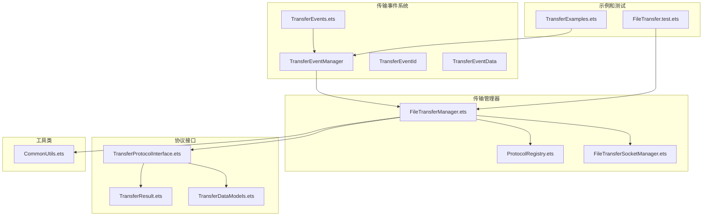
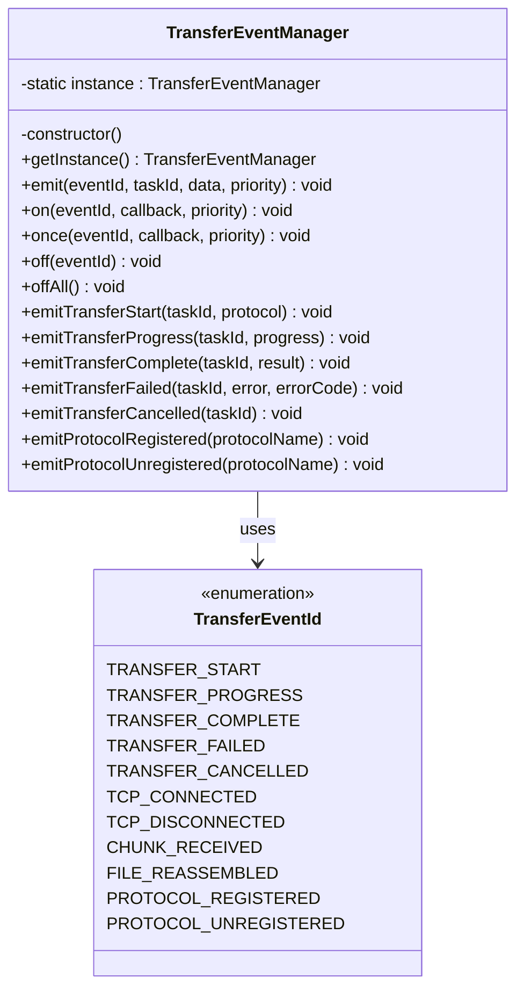
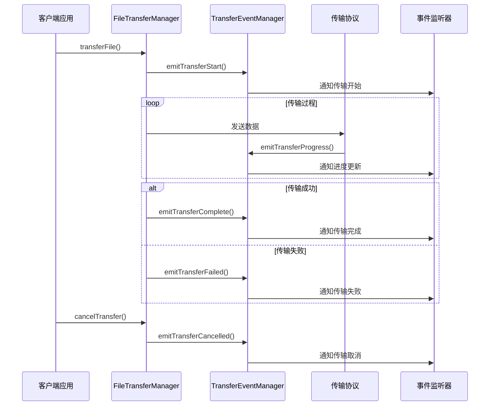
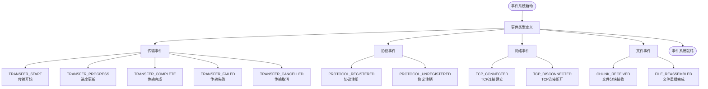
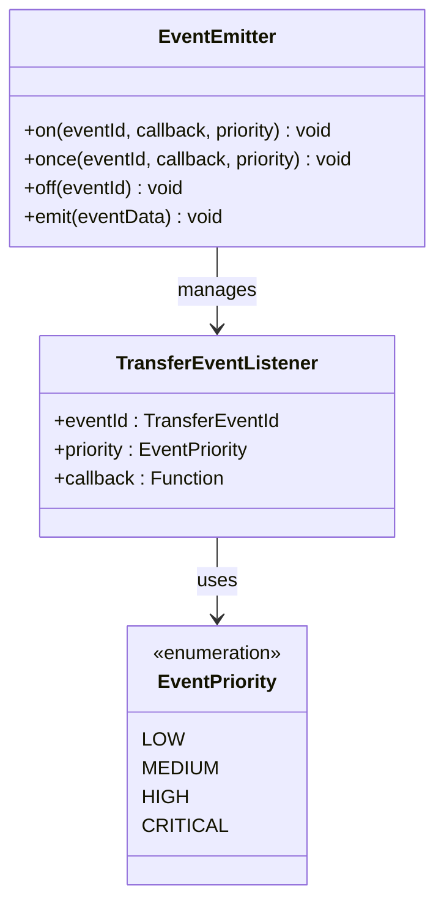
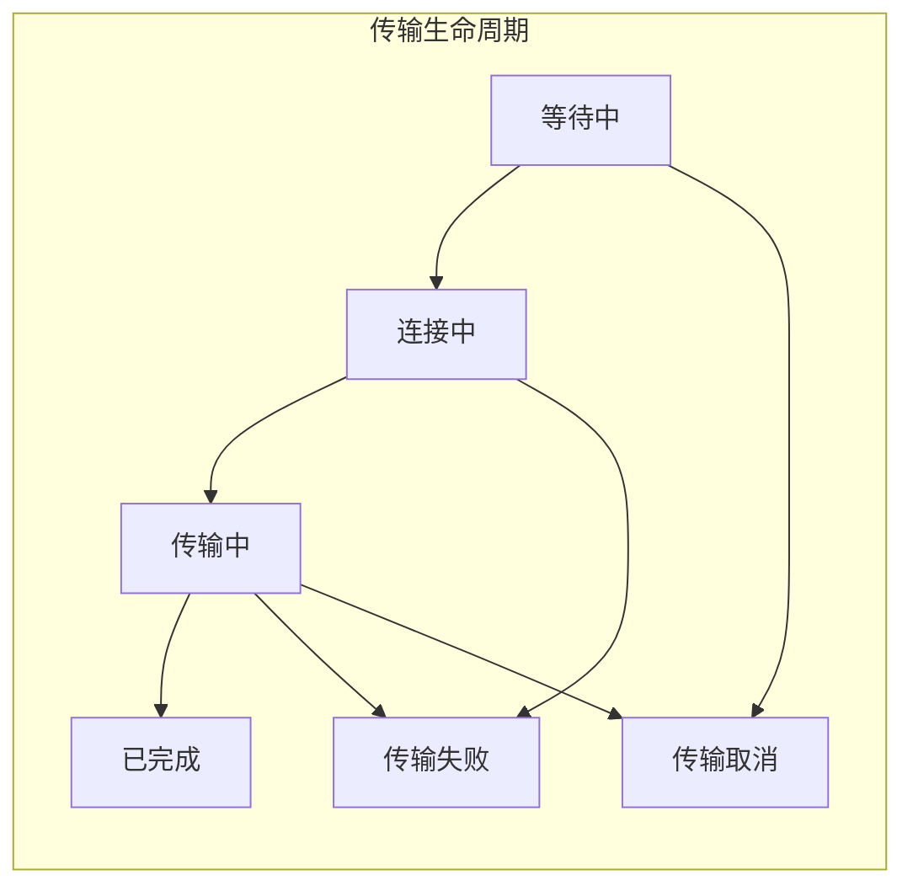
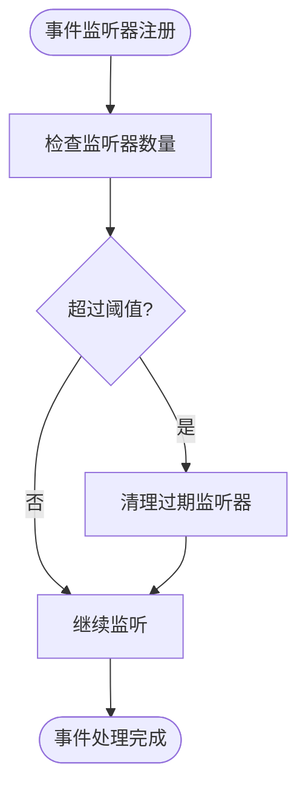

# Transfer Events

<cite>
**本文档引用的文件**
- [TransferEvents.ets](file://entry/src/main/ets/manager/transfer/event/TransferEvents.ets)
- [TransferExamples.ets](file://entry/src/main/ets/manager/transfer/examples/TransferExamples.ets)
- [index.ets](file://entry/src/main/ets/manager/transfer/index.ets)
- [FileTransferManager.ets](file://entry/src/main/ets/manager/transfer/FileTransferManager.ets)
- [TransferProtocolInterface.ets](file://entry/src/main/ets/manager/transfer/protocol/TransferProtocolInterface.ets)
- [TransferResult.ets](file://entry/src/main/ets/manager/transfer/model/TransferResult.ets)
- [CommonUtils.ets](file://entry/src/main/ets/manager/transfer/utils/CommonUtils.ets)
- [ProtocolRegistry.ets](file://entry/src/main/ets/manager/transfer/protocol/ProtocolRegistry.ets)
- [TransferDataModels.ets](file://entry/src/main/ets/manager/transfer/model/TransferDataModels.ets)
- [FileTransferSocketManager.ets](file://entry/src/main/ets/manager/transfer/socket/FileTransferSocketManager.ets)
- [FileTransfer.test.ets](file://entry/src/test/transfer/FileTransfer.test.ets)
</cite>

## 目录
1. [简介](#简介)
2. [项目结构](#项目结构)
3. [核心组件](#核心组件)
4. [架构概览](#架构概览)
5. [详细组件分析](#详细组件分析)
6. [依赖关系分析](#依赖关系分析)
7. [性能考虑](#性能考虑)
8. [故障排除指南](#故障排除指南)
9. [结论](#结论)

## 简介

Transfer Events 是 OpenHarmony 文件传输模块中的事件管理系统，负责在整个文件传输生命周期中提供事件驱动的通信机制。该系统采用发布-订阅模式，允许各个组件通过标准化的事件接口进行解耦通信，支持传输开始、进度更新、完成、失败、取消等多种事件类型。

该事件系统的核心价值在于：
- **解耦设计**：传输管理器与事件监听器分离
- **标准化接口**：统一的事件格式和回调机制
- **可扩展性**：支持自定义协议和事件类型
- **实时监控**：提供传输过程的实时状态反馈

## 项目结构

文件传输模块采用清晰的分层架构，主要目录结构如下：



**图表来源**
- [TransferEvents.ets:1-308](file://entry/src/main/ets/manager/transfer/event/TransferEvents.ets#L1-L308)
- [FileTransferManager.ets:1-648](file://entry/src/main/ets/manager/transfer/FileTransferManager.ets#L1-L648)

**章节来源**
- [TransferEvents.ets:1-308](file://entry/src/main/ets/manager/transfer/event/TransferEvents.ets#L1-L308)
- [index.ets:1-94](file://entry/src/main/ets/manager/transfer/index.ets#L1-L94)

## 核心组件

### 事件管理器 (TransferEventManager)

TransferEventManager 是事件系统的核心组件，提供单例模式的事件管理功能：



**图表来源**
- [TransferEvents.ets:128-308](file://entry/src/main/ets/manager/transfer/event/TransferEvents.ets#L128-L308)

### 事件数据模型

事件系统定义了完整的数据结构来封装传输过程中的各种信息：

| 组件 | 描述 | 关键字段 |
|------|------|----------|
| **TransferEventData** | 通用事件数据接口 | taskId, eventType, data, timestamp |
| **TransferStartEventData** | 传输开始事件数据 | taskId, eventType, data(protocol) |
| **TransferProgressEventData** | 传输进度事件数据 | taskId, eventType, data(progress) |
| **TransferCompleteEventData** | 传输完成事件数据 | taskId, eventType, data(fileInfo, duration) |
| **TransferFailedEventData** | 传输失败事件数据 | taskId, eventType, data(error, errorCode) |

**章节来源**
- [TransferEvents.ets:40-122](file://entry/src/main/ets/manager/transfer/event/TransferEvents.ets#L40-L122)

## 架构概览

Transfer Events 采用事件驱动架构，通过标准化的事件接口实现组件间的松耦合通信：



**图表来源**
- [FileTransferManager.ets:167-274](file://entry/src/main/ets/manager/transfer/FileTransferManager.ets#L167-L274)
- [TransferEvents.ets:150-306](file://entry/src/main/ets/manager/transfer/event/TransferEvents.ets#L150-L306)

## 详细组件分析

### 事件类型系统

Transfer Events 定义了完整的事件类型体系，涵盖文件传输的各个阶段：



**图表来源**
- [TransferEvents.ets:12-35](file://entry/src/main/ets/manager/transfer/event/TransferEvents.ets#L12-L35)

### 事件监听机制

事件监听系统提供了灵活的监听配置和优先级管理：



**图表来源**
- [TransferEvents.ets:115-122](file://entry/src/main/ets/manager/transfer/event/TransferEvents.ets#L115-L122)

**章节来源**
- [TransferEvents.ets:181-230](file://entry/src/main/ets/manager/transfer/event/TransferEvents.ets#L181-L230)

### 传输管理器集成

FileTransferManager 作为事件系统的协调者，负责在传输生命周期中触发相应的事件：



**图表来源**
- [FileTransferManager.ets:182-274](file://entry/src/main/ets/manager/transfer/FileTransferManager.ets#L182-L274)

**章节来源**
- [FileTransferManager.ets:207-274](file://entry/src/main/ets/manager/transfer/FileTransferManager.ets#L207-L274)

## 依赖关系分析

Transfer Events 系统与其他组件的依赖关系如下：

```mermaid
graph TB
subgraph "核心依赖"
TE[TransferEvents.ets]
FTM[FileTransferManager.ets]
TPI[TransferProtocolInterface.ets]
end
subgraph "支持组件"
PR[ProtocolRegistry.ets]
FS[FileTransferSocketManager.ets]
TR[TransferResult.ets]
TDM[TransferDataModels.ets]
CU[CommonUtils.ets]
end
subgraph "外部依赖"
EM[@ohos/events.emitter]
NS[@kit.NetworkKit]
BS[@kit.BasicServicesKit]
end
TE --> EM
FTM --> TE
FTM --> PR
FTM --> FS
FTM --> TPI
TPI --> TR
TPI --> TDM
FS --> NS
FS --> BS
FTM --> CU
```

**图表来源**
- [TransferEvents.ets:5-7](file://entry/src/main/ets/manager/transfer/event/TransferEvents.ets#L5-L7)
- [FileTransferSocketManager.ets:5-7](file://entry/src/main/ets/manager/transfer/socket/FileTransferSocketManager.ets#L5-L7)

**章节来源**
- [index.ets:1-94](file://entry/src/main/ets/manager/transfer/index.ets#L1-L94)

## 性能考虑

Transfer Events 系统在设计时充分考虑了性能优化：

### 事件处理优化

1. **优先级队列**：支持不同优先级的事件处理
2. **内存管理**：自动清理过期事件监听器
3. **批量处理**：支持事件批处理减少系统调用

### 内存管理策略



### 性能监控指标

- **事件处理延迟**：平均事件响应时间
- **内存使用率**：事件监听器和数据结构占用
- **CPU 使用率**：事件循环和回调执行开销
- **并发处理能力**：同时处理的事件数量

## 故障排除指南

### 常见问题及解决方案

| 问题类型 | 症状 | 解决方案 |
|----------|------|----------|
| 事件未触发 | 监听器无响应 | 检查事件 ID 和优先级配置 |
| 事件重复触发 | 同一事件多次回调 | 确认一次性监听器的正确使用 |
| 内存泄漏 | 监听器未释放 | 调用 off() 或 offAll() 方法 |
| 性能问题 | 事件处理延迟高 | 优化事件优先级和批量处理 |

### 调试技巧

1. **启用详细日志**：查看事件发送和接收的详细信息
2. **监控内存使用**：定期检查监听器数量和内存占用
3. **性能分析**：使用性能分析工具检测事件处理瓶颈

**章节来源**
- [TransferEvents.ets:163-173](file://entry/src/main/ets/manager/transfer/event/TransferEvents.ets#L163-L173)

## 结论

Transfer Events 系统为 OpenHarmony 文件传输模块提供了强大而灵活的事件驱动架构。通过标准化的事件接口和完善的生命周期管理，该系统实现了组件间的高效解耦和实时通信。

### 主要优势

1. **高度解耦**：事件生产者和消费者完全分离
2. **可扩展性**：支持自定义事件类型和监听器
3. **实时性**：提供传输过程的实时状态反馈
4. **可靠性**：完善的错误处理和恢复机制

### 应用场景

- **文件传输监控**：实时跟踪传输进度和状态
- **协议扩展**：支持新的传输协议和事件类型
- **调试诊断**：提供详细的传输过程日志
- **用户界面更新**：驱动 UI 组件的状态变化

该事件系统为 OpenHarmony 的文件传输功能奠定了坚实的技术基础，为后续的功能扩展和性能优化提供了良好的架构支撑。