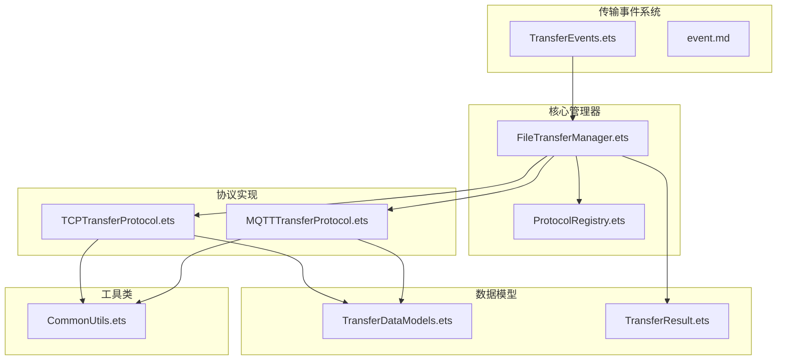
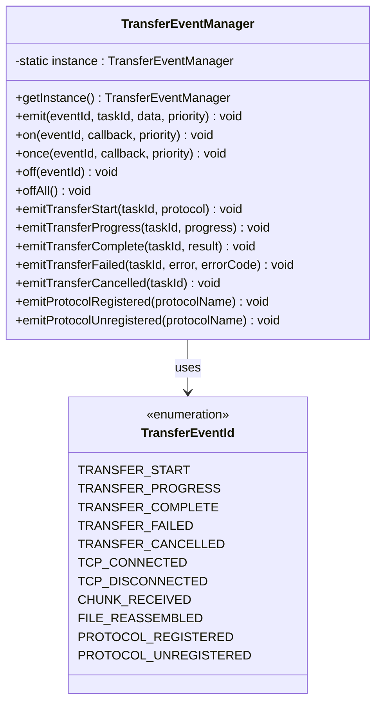
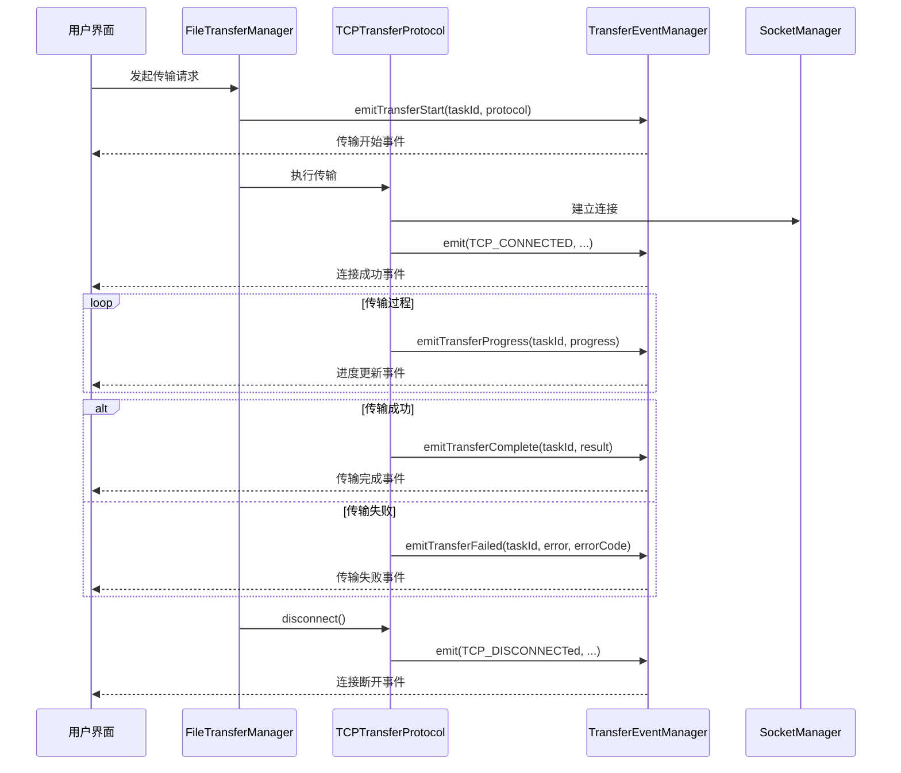
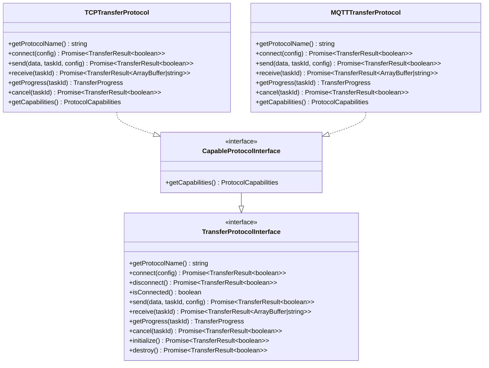
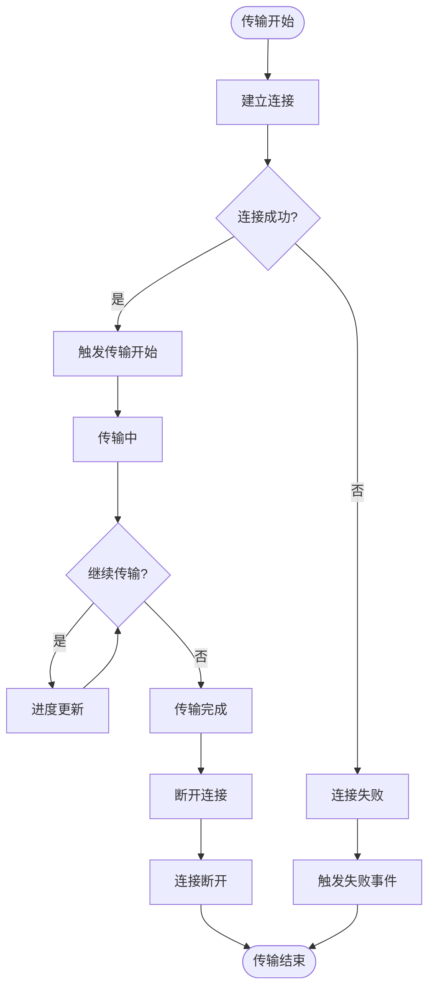
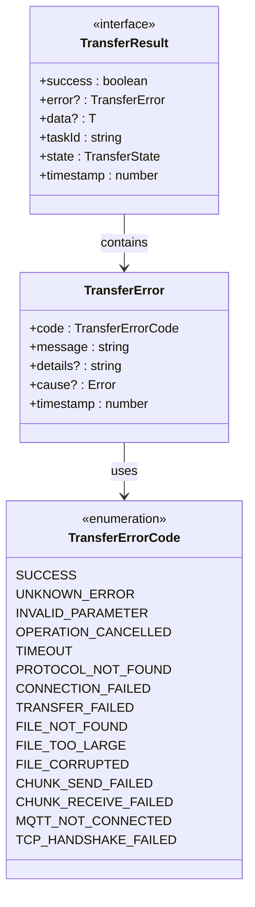
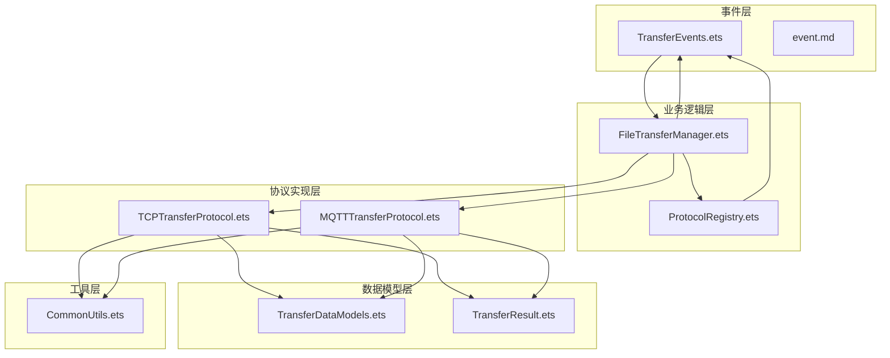

# 传输事件文档

<cite>
**本文档引用的文件**
- [TransferEvents.ets](file://entry/src/main/ets/manager/transfer/event/TransferEvents.ets)
- [event.md](file://entry/src/main/ets/manager/transfer/event/event.md)
- [TransferExamples.ets](file://entry/src/main/ets/manager/transfer/examples/TransferExamples.ets)
- [index.ets](file://entry/src/main/ets/manager/transfer/index.ets)
- [FileTransferManager.ets](file://entry/src/main/ets/manager/transfer/FileTransferManager.ets)
- [TransferDataModels.ets](file://entry/src/main/ets/manager/transfer/model/TransferDataModels.ets)
- [TransferResult.ets](file://entry/src/main/ets/manager/transfer/model/TransferResult.ets)
- [TransferProtocolInterface.ets](file://entry/src/main/ets/manager/transfer/protocol/TransferProtocolInterface.ets)
- [ProtocolRegistry.ets](file://entry/src/main/ets/manager/transfer/protocol/ProtocolRegistry.ets)
- [CommonUtils.ets](file://entry/src/main/ets/manager/transfer/utils/CommonUtils.ets)
- [TCPTransferProtocol.ets](file://entry/src/main/ets/manager/transfer/protocol/TCPTransferProtocol.ets)
- [MQTTTransferProtocol.ets](file://entry/src/main/ets/manager/transfer/protocol/MQTTTransferProtocol.ets)
- [QUICK_REFERENCE.md](file://entry/src/main/ets/manager/transfer/QUICK_REFERENCE.md)
</cite>

## 目录
1. [简介](#简介)
2. [项目结构](#项目结构)
3. [核心组件](#核心组件)
4. [架构概览](#架构概览)
5. [详细组件分析](#详细组件分析)
6. [依赖关系分析](#依赖关系分析)
7. [性能考虑](#性能考虑)
8. [故障排除指南](#故障排除指南)
9. [结论](#结论)

## 简介

传输事件系统是 OpenHarmony 文件传输模块的核心组成部分，负责在整个传输过程中提供事件驱动的通知机制。该系统采用发布-订阅模式，通过统一的事件管理器来协调各个传输协议的状态变化和进度更新。

系统支持多种传输协议（TCP 和 MQTT），提供完整的传输生命周期事件管理，包括传输开始、进度更新、完成、失败、取消等事件类型。每个事件都携带详细的任务信息和状态数据，便于上层应用进行实时监控和用户界面更新。

## 项目结构

文件传输模块采用清晰的分层架构设计，主要包含以下核心目录：

**图表来源**
- [TransferEvents.ets:1-308](file://entry/src/main/ets/manager/transfer/event/TransferEvents.ets#L1-L308)
- [FileTransferManager.ets:1-685](file://entry/src/main/ets/manager/transfer/FileTransferManager.ets#L1-L685)
- [TCPTransferProtocol.ets:1-200](file://entry/src/main/ets/manager/transfer/protocol/TCPTransferProtocol.ets#L1-L200)

**章节来源**
- [index.ets:1-94](file://entry/src/main/ets/manager/transfer/index.ets#L1-L94)
- [QUICK_REFERENCE.md:1-248](file://entry/src/main/ets/manager/transfer/QUICK_REFERENCE.md#L1-L248)

## 核心组件

### 传输事件管理器

传输事件管理器是整个事件系统的核心，提供单例模式的事件管理功能：

**图表来源**
- [TransferEvents.ets:128-308](file://entry/src/main/ets/manager/transfer/event/TransferEvents.ets#L128-L308)

### 传输事件数据结构

系统定义了完整的事件数据结构，确保事件信息的完整性和一致性：

| 事件类型 | 数据结构 | 描述 |
|---------|----------|------|
| 传输开始 | TransferStartEventData | 包含协议信息的传输开始事件 |
| 进度更新 | TransferProgressEventData | 实时传输进度信息 |
| 传输完成 | TransferCompleteEventData | 完整的传输结果数据 |
| 传输失败 | TransferFailedEventData | 错误信息和错误码 |
| 协议事件 | ProtocolEventData | 协议注册和注销事件 |

**章节来源**
- [TransferEvents.ets:37-122](file://entry/src/main/ets/manager/transfer/event/TransferEvents.ets#L37-L122)

## 架构概览

传输事件系统采用事件驱动架构，通过统一的事件管理器协调各个组件之间的通信：

**图表来源**
- [FileTransferManager.ets:167-287](file://entry/src/main/ets/manager/transfer/FileTransferManager.ets#L167-L287)
- [TCPTransferProtocol.ets:136-166](file://entry/src/main/ets/manager/transfer/protocol/TCPTransferProtocol.ets#L136-L166)
- [TransferEvents.ets:143-173](file://entry/src/main/ets/manager/transfer/event/TransferEvents.ets#L143-L173)

## 详细组件分析

### 传输协议接口

传输协议接口定义了所有协议必须实现的标准方法：

**图表来源**
- [TransferProtocolInterface.ets:91-161](file://entry/src/main/ets/manager/transfer/protocol/TransferProtocolInterface.ets#L91-L161)
- [TCPTransferProtocol.ets:87-130](file://entry/src/main/ets/manager/transfer/protocol/TCPTransferProtocol.ets#L87-L130)
- [MQTTTransferProtocol.ets:54-96](file://entry/src/main/ets/manager/transfer/protocol/MQTTTransferProtocol.ets#L54-L96)

### 事件生命周期流程

传输事件遵循严格的生命周期管理：

**图表来源**
- [event.md:257-286](file://entry/src/main/ets/manager/transfer/event/event.md#L257-L286)

**章节来源**
- [TransferProtocolInterface.ets:13-28](file://entry/src/main/ets/manager/transfer/protocol/TransferProtocolInterface.ets#L13-L28)
- [TransferEvents.ets:12-35](file://entry/src/main/ets/manager/transfer/event/TransferEvents.ets#L12-L35)

### 传输结果管理系统

系统提供了完整的错误处理和结果管理机制：

**图表来源**
- [TransferResult.ets:86-99](file://entry/src/main/ets/manager/transfer/model/TransferResult.ets#L86-L99)
- [TransferResult.ets:69-80](file://entry/src/main/ets/manager/transfer/model/TransferResult.ets#L69-L80)
- [TransferResult.ets:13-64](file://entry/src/main/ets/manager/transfer/model/TransferResult.ets#L13-L64)

**章节来源**
- [TransferResult.ets:1-275](file://entry/src/main/ets/manager/transfer/model/TransferResult.ets#L1-L275)

## 依赖关系分析

传输事件系统具有清晰的依赖层次结构：

**图表来源**
- [index.ets:5-94](file://entry/src/main/ets/manager/transfer/index.ets#L5-L94)
- [FileTransferManager.ets:5-29](file://entry/src/main/ets/manager/transfer/FileTransferManager.ets#L5-L29)

**章节来源**
- [index.ets:1-94](file://entry/src/main/ets/manager/transfer/index.ets#L1-L94)

## 性能考虑

传输事件系统在设计时充分考虑了性能优化：

### 事件处理优化
- **优先级管理**：支持事件优先级设置，确保关键事件能够及时处理
- **批量处理**：进度更新事件支持批量处理，减少UI刷新频率
- **内存管理**：事件监听器支持一次性监听和批量移除，避免内存泄漏

### 传输性能优化
- **分块传输**：TCP协议支持分块传输，提高大文件传输效率
- **并发控制**：支持多个传输任务的并发管理
- **资源复用**：连接池管理和资源复用机制

### 监控和诊断
- **性能指标**：内置传输速度、剩余时间等性能指标计算
- **错误追踪**：完整的错误链路追踪和日志记录
- **状态监控**：实时传输状态监控和异常检测

## 故障排除指南

### 常见问题及解决方案

| 问题类型 | 症状 | 可能原因 | 解决方案 |
|---------|------|---------|---------|
| 事件不触发 | UI无响应 | 事件监听器未正确注册 | 检查事件监听器注册代码 |
| 传输失败 | 传输状态显示失败 | 网络连接问题或协议错误 | 查看错误码和错误详情 |
| 进度不更新 | 进度条卡住 | 事件处理阻塞或UI线程问题 | 检查事件处理逻辑和线程安全 |
| 内存泄漏 | 应用内存持续增长 | 事件监听器未正确移除 | 确保在适当时机调用offAll() |

### 调试技巧

1. **启用详细日志**：在开发环境中启用详细的事件日志输出
2. **事件追踪**：使用任务ID追踪特定传输任务的完整生命周期
3. **状态检查**：定期检查传输状态和进度信息
4. **错误分析**：分析错误码和错误详情，定位问题根因

**章节来源**
- [TransferResult.ets:239-275](file://entry/src/main/ets/manager/transfer/model/TransferResult.ets#L239-L275)
- [CommonUtils.ets:85-150](file://entry/src/main/ets/manager/transfer/utils/CommonUtils.ets#L85-L150)

## 结论

传输事件系统通过事件驱动的方式，为OpenHarmony文件传输提供了强大而灵活的通知机制。系统的设计充分考虑了可扩展性、性能和易用性，支持多种传输协议和复杂的传输场景。

关键优势包括：
- **事件驱动架构**：提供实时的传输状态通知
- **协议无关设计**：支持多种传输协议的统一管理
- **完整的生命周期**：覆盖传输的全过程事件管理
- **强大的错误处理**：完善的错误码体系和错误处理机制
- **性能优化**：针对大文件传输和高并发场景的优化设计

该系统为开发者提供了构建复杂文件传输应用的坚实基础，通过清晰的API设计和完善的事件机制，能够满足各种实际应用场景的需求。