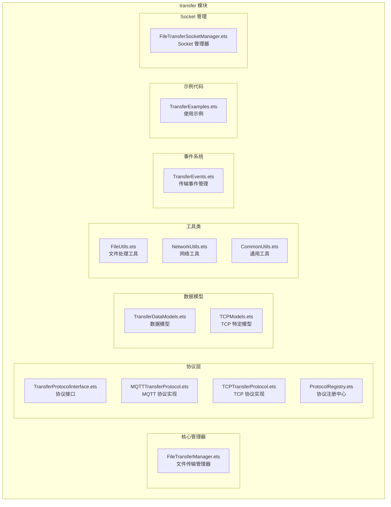
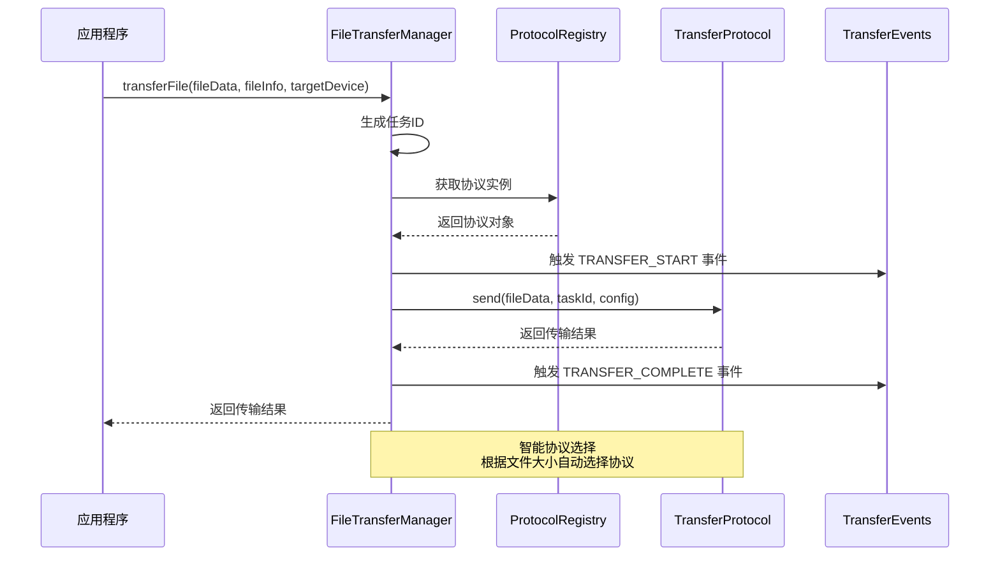
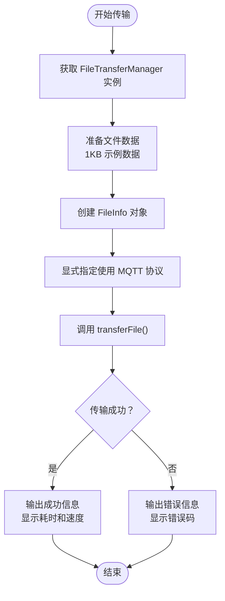
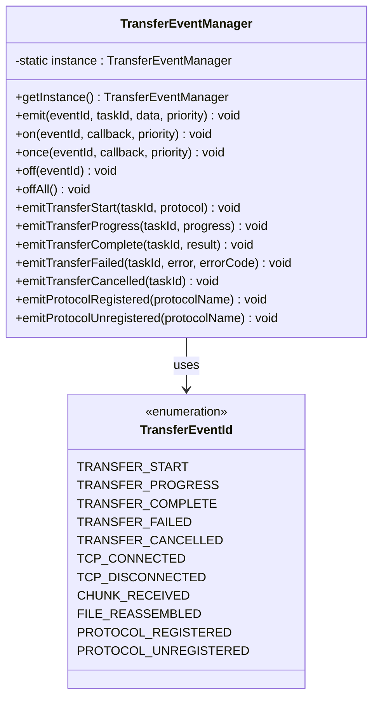
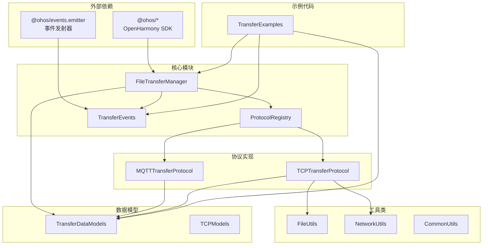
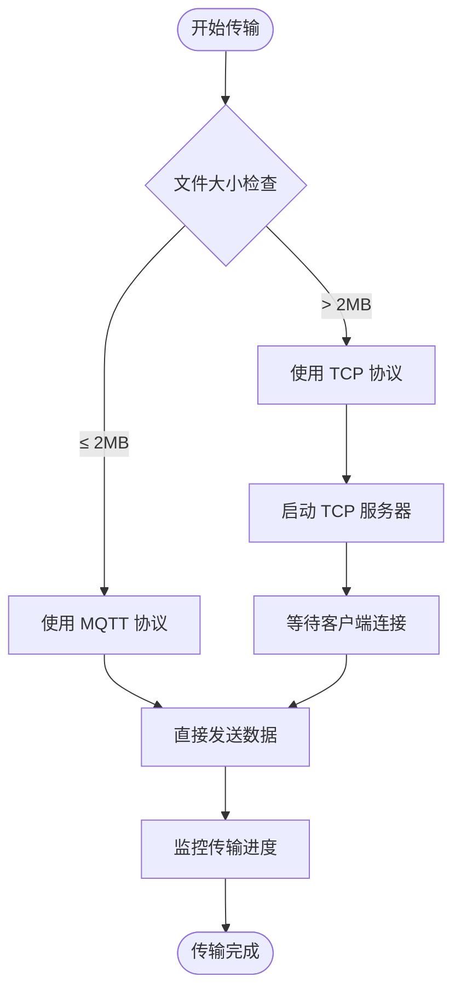

# Transfer Examples

<cite>
**本文档引用的文件**
- [TransferExamples.ets](file://entry/src/main/ets/manager/transfer/examples/TransferExamples.ets)
- [FileTransferManager.ets](file://entry/src/main/ets/manager/transfer/FileTransferManager.ets)
- [index.ets](file://entry/src/main/ets/manager/transfer/index.ets)
- [TransferDataModels.ets](file://entry/src/main/ets/manager/transfer/model/TransferDataModels.ets)
- [TransferProtocolInterface.ets](file://entry/src/main/ets/manager/transfer/protocol/TransferProtocolInterface.ets)
- [TransferEvents.ets](file://entry/src/main/ets/manager/transfer/event/TransferEvents.ets)
- [CommonUtils.ets](file://entry/src/main/ets/manager/transfer/utils/CommonUtils.ets)
- [FileTransfer.test.ets](file://entry/src/test/transfer/FileTransfer.test.ets)
- [IMPLEMENTATION_SUMMARY.md](file://entry/src/main/ets/manager/transfer/IMPLEMENTATION_SUMMARY.md)
- [TaskDispatch.ets](file://entry/src/main/ets/manager/broker/task/TaskDispatch.ets)
</cite>

## 目录
1. [简介](#简介)
2. [项目结构](#项目结构)
3. [核心组件](#核心组件)
4. [架构概览](#架构概览)
5. [详细组件分析](#详细组件分析)
6. [依赖关系分析](#依赖关系分析)
7. [性能考虑](#性能考虑)
8. [故障排除指南](#故障排除指南)
9. [结论](#结论)

## 简介

Transfer Examples 是 OpenHarmony 文件传输模块中的完整使用示例集合，展示了如何在实际应用中使用文件传输功能。该示例涵盖了从基本文件传输到高级功能的10个完整示例，包括协议选择、进度监控、错误处理、自定义配置等核心功能。

该模块基于 OpenHarmony API 20 开发，提供了跨协议的文件传输解决方案，支持 MQTT 和 TCP 两种传输协议，并具备智能协议选择、分块传输、进度跟踪、错误恢复等高级特性。

## 项目结构

文件传输模块采用清晰的分层架构设计，主要包含以下核心目录：



**图表来源**
- [TransferExamples.ets:1-247](file://entry/src/main/ets/manager/transfer/examples/TransferExamples.ets#L1-L247)
- [FileTransferManager.ets:1-648](file://entry/src/main/ets/manager/transfer/FileTransferManager.ets#L1-L648)

**章节来源**
- [TransferExamples.ets:1-247](file://entry/src/main/ets/manager/transfer/examples/TransferExamples.ets#L1-L247)
- [IMPLEMENTATION_SUMMARY.md:170-200](file://entry/src/main/ets/manager/transfer/IMPLEMENTATION_SUMMARY.md#L170-L200)

## 核心组件

### FileTransferManager - 核心管理器

FileTransferManager 是整个文件传输系统的核心，提供统一的文件传输管理接口。它实现了单例模式，确保在整个应用中只有一个传输管理器实例。

**主要功能特性：**
- **协议选择**：根据文件大小自动选择最优协议（≤2MB 使用 MQTT，>2MB 使用 TCP）
- **任务管理**：创建、监控、取消传输任务
- **进度跟踪**：实时获取传输进度和状态
- **配置管理**：支持自定义传输参数
- **事件系统**：提供完整的事件通知机制

**章节来源**
- [FileTransferManager.ets:40-648](file://entry/src/main/ets/manager/transfer/FileTransferManager.ets#L40-L648)

### TransferProtocolInterface - 协议抽象层

定义了所有传输协议的标准接口，确保不同协议之间的兼容性和一致性。

**核心接口方法：**
- `send()`: 发送数据
- `receive()`: 接收数据  
- `connect()`: 建立连接
- `disconnect()`: 断开连接
- `getProgress()`: 获取传输进度
- `cancel()`: 取消传输任务

**章节来源**
- [TransferProtocolInterface.ets:85-156](file://entry/src/main/ets/manager/transfer/protocol/TransferProtocolInterface.ets#L85-L156)

### TransferDataModels - 数据模型

定义了文件传输过程中的核心数据结构，包括文件信息、传输任务、进度等。

**关键数据模型：**
- `FileInfo`: 文件元数据（名称、大小、类型、哈希等）
- `TransferTask`: 传输任务信息
- `TransferProgress`: 传输进度信息
- `TransferOptions`: 传输配置选项

**章节来源**
- [TransferDataModels.ets:10-170](file://entry/src/main/ets/manager/transfer/model/TransferDataModels.ets#L10-L170)

## 架构概览

文件传输模块采用了分层架构设计，确保了良好的可扩展性和可维护性：



**图表来源**
- [FileTransferManager.ets:167-274](file://entry/src/main/ets/manager/transfer/FileTransferManager.ets#L167-L274)
- [TransferEvents.ets:244-288](file://entry/src/main/ets/manager/transfer/event/TransferEvents.ets#L244-L288)

## 详细组件分析

### TransferExamples - 使用示例

TransferExamples 提供了10个完整的使用示例，涵盖了文件传输的各种使用场景：

#### 示例1：基本文件传输（显式指定 MQTT 协议）



**图表来源**
- [TransferExamples.ets:12-35](file://entry/src/main/ets/manager/transfer/examples/TransferExamples.ets#L12-L35)

#### 示例2：大文件传输（显式指定 TCP 协议）

针对大文件传输场景，示例展示了如何处理3MB大小的文件：

**关键特性：**
- 使用 TCP 协议进行大文件传输
- 支持分块传输机制
- 自动断点续传支持

**章节来源**
- [TransferExamples.ets:40-60](file://entry/src/main/ets/manager/transfer/examples/TransferExamples.ets#L40-L60)

#### 示例3：查询传输进度

展示了如何实时监控传输进度：

**进度信息包括：**
- 已传输字节数和总字节数
- 传输进度百分比
- 当前传输速度
- 预计剩余时间

**章节来源**
- [TransferExamples.ets:65-80](file://entry/src/main/ets/manager/transfer/examples/TransferExamples.ets#L65-L80)

#### 示例4：取消传输任务

演示了如何取消正在进行的传输任务：

**取消流程：**
- 检查任务是否存在
- 调用协议层的取消方法
- 更新任务状态为 CANCELLED
- 触发取消事件

**章节来源**
- [TransferExamples.ets:85-95](file://entry/src/main/ets/manager/transfer/examples/TransferExamples.ets#L85-L95)

#### 示例5：自定义配置

展示了如何配置传输参数：

**可配置参数：**
- 文件大小阈值（默认2MB）
- TCP 分块大小（默认128KB）
- 最大重试次数（默认3次）
- 连接超时时间（默认30秒）
- TCP 监听端口（默认8888）

**章节来源**
- [TransferExamples.ets:100-113](file://entry/src/main/ets/manager/transfer/examples/TransferExamples.ets#L100-L113)

#### 示例9：错误处理

演示了如何处理各种传输错误：

**错误类型包括：**
- 协议未找到错误
- 连接失败错误
- 传输超时错误
- 其他未知错误

**章节来源**
- [TransferExamples.ets:163-191](file://entry/src/main/ets/manager/transfer/examples/TransferExamples.ets#L163-L191)

#### 示例10：完整传输流程

展示了从开始到结束的完整传输流程：

**完整流程：**
1. 准备文件数据
2. 发起传输请求
3. 监控传输进度
4. 处理传输结果
5. 清理已完成任务

**章节来源**
- [TransferExamples.ets:196-232](file://entry/src/main/ets/manager/transfer/examples/TransferExamples.ets#L196-L232)

### 协议实现分析

#### MQTTTransferProtocol - MQTT 协议适配器

适用于小文件传输（≤2MB），具有以下特点：
- 直接传输，无需复杂的握手过程
- 内置重试机制（最多3次）
- 支持进度跟踪和状态管理
- 复用现有的 MQTTClient 类

#### TCPTransferProtocol - TCP 协议适配器

适用于大文件传输（>2MB），具有以下特点：
- 支持分块传输
- 集成 FileTransferSocketManager
- 实现完整的握手、分块发送、完成通知流程
- 支持断点续传和进度监控

**章节来源**
- [IMPLEMENTATION_SUMMARY.md:51-77](file://entry/src/main/ets/manager/transfer/IMPLEMENTATION_SUMMARY.md#L51-L77)

### 事件系统分析

TransferEvents 提供了完整的事件驱动架构：



**图表来源**
- [TransferEvents.ets:128-307](file://entry/src/main/ets/manager/transfer/event/TransferEvents.ets#L128-L307)

**章节来源**
- [TransferEvents.ets:1-308](file://entry/src/main/ets/manager/transfer/event/TransferEvents.ets#L1-L308)

## 依赖关系分析

文件传输模块的依赖关系体现了清晰的分层设计：



**图表来源**
- [index.ets:1-94](file://entry/src/main/ets/manager/transfer/index.ets#L1-L94)
- [FileTransferManager.ets:5-29](file://entry/src/main/ets/manager/transfer/FileTransferManager.ets#L5-L29)

**章节来源**
- [index.ets:1-94](file://entry/src/main/ets/manager/transfer/index.ets#L1-L94)

## 性能考虑

### 分块传输优化

文件传输模块采用了智能分块传输策略：

**默认配置：**
- 文件大小阈值：2MB
- TCP 分块大小：128KB
- 最大重试次数：3次
- 连接超时：30秒
- TCP 监听端口：8888

**性能优化特性：**
- **内存效率**：分块传输减少内存占用
- **并发处理**：异步操作避免阻塞
- **连接复用**：连接池管理提高效率
- **自动清理**：定时清理过期任务

### 协议选择策略

模块实现了智能协议选择机制：



**图表来源**
- [TaskDispatch.ets:114-170](file://entry/src/main/ets/manager/broker/task/TaskDispatch.ets#L114-L170)

**章节来源**
- [TaskDispatch.ets:100-170](file://entry/src/main/ets/manager/broker/task/TaskDispatch.ets#L100-L170)

## 故障排除指南

### 常见问题及解决方案

#### 1. 协议未找到错误

**症状：** 传输失败，错误码为 PROTOCOL_NOT_FOUND

**原因：** 指定的协议名称不正确或协议未注册

**解决方案：**
- 检查协议名称拼写
- 确认协议已正确注册
- 使用 `listProtocols()` 方法查看可用协议

#### 2. 连接失败错误

**症状：** 传输过程中连接中断

**原因：** 网络问题、目标设备离线、端口不可用

**解决方案：**
- 检查网络连接状态
- 验证目标设备 IP 地址和端口
- 增加重试次数配置

#### 3. 传输超时错误

**症状：** 传输在指定时间内未完成

**原因：** 网络延迟过高、文件过大、服务器响应慢

**解决方案：**
- 增加超时时间配置
- 优化网络环境
- 考虑使用 TCP 协议进行大文件传输

#### 4. 进度查询失败

**症状：** `getTransferProgress()` 返回 null

**原因：** 任务不存在或协议不支持进度查询

**解决方案：**
- 确认任务 ID 正确
- 检查协议是否实现进度查询接口
- 使用 `getActiveTasks()` 获取活动任务列表

**章节来源**
- [TransferExamples.ets:175-191](file://entry/src/main/ets/manager/transfer/examples/TransferExamples.ets#L175-L191)

### 调试技巧

#### 1. 启用详细日志

模块在关键操作处都有详细的日志输出，便于调试：

```typescript
console.info(`[FileTransferManager] 任务 ${taskId} 使用协议：${protocolName}`);
console.info(`[FileTransferManager] 传输完成，taskId=${taskId}`);
console.error('[FileTransferManager] 传输异常:', transferError.message);
```

#### 2. 使用事件监听

通过事件系统可以实时监控传输状态：

```typescript
TransferEventManager.getInstance().on(
  TransferEventId.TRANSFER_PROGRESS,
  (eventData) => {
    console.info(`进度更新：${eventData.data.progress}%`);
  }
);
```

#### 3. 检查任务状态

使用以下方法检查传输状态：

```typescript
const tasks = transferManager.getActiveTasks();
const status = transferManager.getTaskStatus(taskId);
const progress = transferManager.getTransferProgress(taskId);
```

**章节来源**
- [TransferEvents.ets:150-173](file://entry/src/main/ets/manager/transfer/event/TransferEvents.ets#L150-L173)

## 结论

Transfer Examples 展示了一个完整、健壮且易于使用的文件传输解决方案。该模块具有以下显著优势：

### 技术优势

1. **架构设计优秀**：采用分层架构，职责分离明确
2. **协议抽象完善**：统一的协议接口支持多种传输协议
3. **功能丰富全面**：涵盖从基础传输到高级功能的所有场景
4. **错误处理完善**：全面的错误处理和恢复机制
5. **性能优化到位**：智能分块、连接池等优化措施

### 使用价值

1. **易于集成**：简洁的 API 设计，便于在现有项目中集成
2. **扩展性强**：开放的协议注册机制，支持自定义协议扩展
3. **文档完善**：完整的使用指南和示例代码
4. **测试覆盖**：全面的单元测试和集成测试

### 应用场景

该文件传输模块适用于以下场景：
- **设备间文件传输**：多设备协作场景下的文件共享
- **模型文件传输**：AI 推理模型的大文件传输
- **系统升级**：固件和软件包的远程更新
- **数据备份**：重要数据的跨设备备份

通过 Transfer Examples，开发者可以快速理解和掌握文件传输模块的使用方法，为实际项目开发提供可靠的技术支撑。