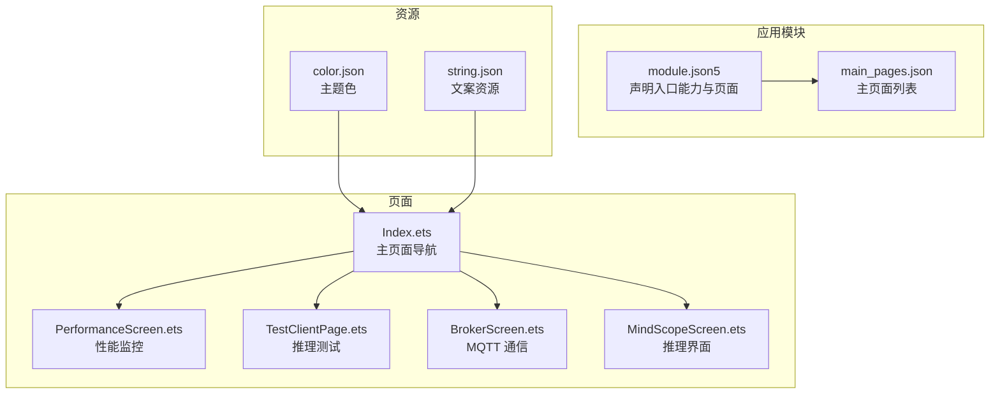
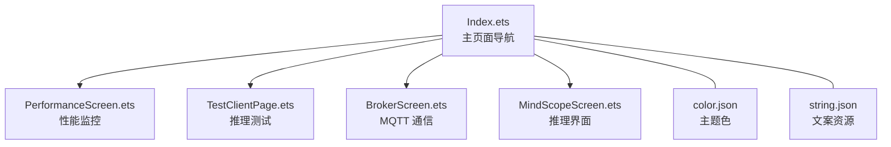
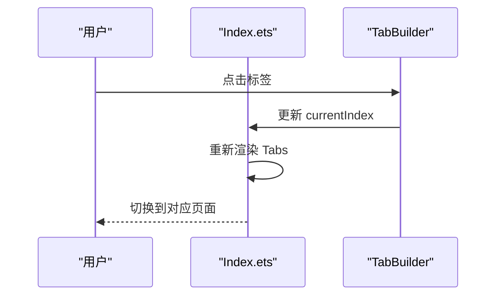
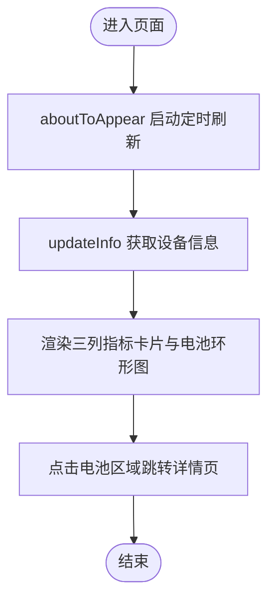
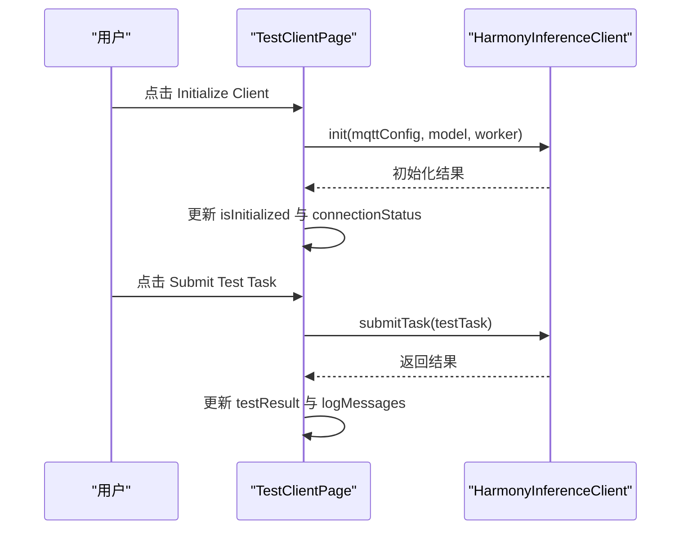
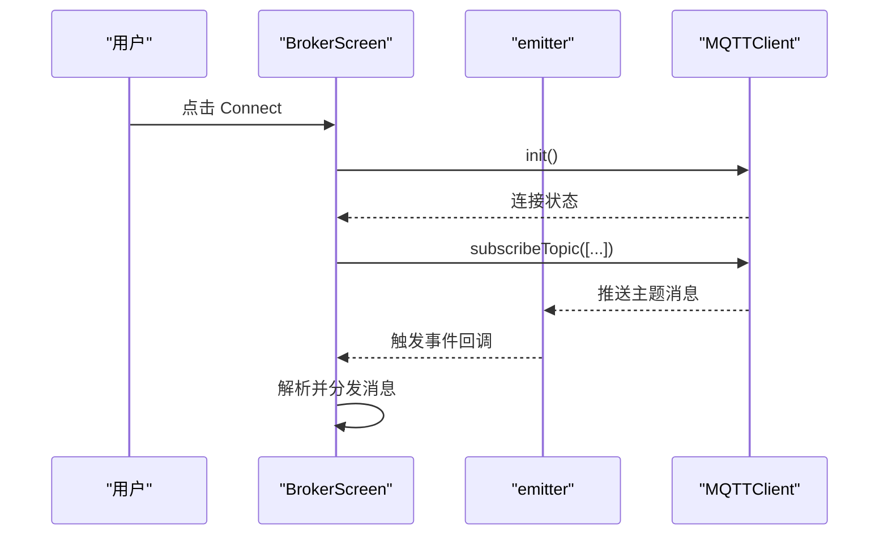
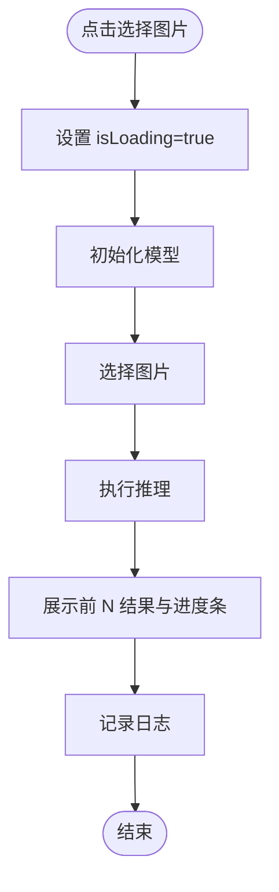
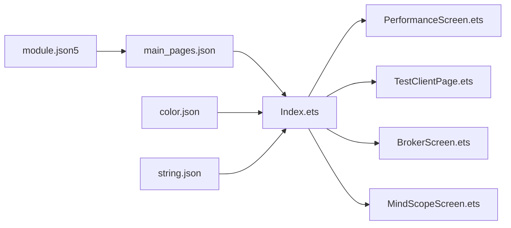

# UI 界面系统

<cite>
**本文引用的文件**
- [AppScope/app.json5](file://AppScope/app.json5)
- [entry/src/main/module.json5](file://entry/src/main/module.json5)
- [entry/src/main/resources/base/profile/main_pages.json](file://entry/src/main/resources/base/profile/main_pages.json)
- [entry/src/main/resources/base/element/color.json](file://entry/src/main/resources/base/element/color.json)
- [entry/src/main/resources/base/element/string.json](file://entry/src/main/resources/base/element/string.json)
- [entry/src/main/ets/pages/Index.ets](file://entry/src/main/ets/pages/Index.ets)
- [entry/src/main/ets/pages/tabs/BrokerScreen.ets](file://entry/src/main/ets/pages/tabs/BrokerScreen.ets)
- [entry/src/main/ets/pages/tabs/MindScopeScreen.ets](file://entry/src/main/ets/pages/tabs/MindScopeScreen.ets)
- [entry/src/main/ets/pages/tabs/PerformanceScreen.ets](file://entry/src/main/ets/pages/tabs/PerformanceScreen.ets)
- [entry/src/main/ets/pages/TestClientPage.ets](file://entry/src/main/ets/pages/TestClientPage.ets)
</cite>

## 目录
1. [简介](#简介)
2. [项目结构](#项目结构)
3. [核心组件](#核心组件)
4. [架构总览](#架构总览)
5. [详细组件分析](#详细组件分析)
6. [依赖关系分析](#依赖关系分析)
7. [性能考虑](#性能考虑)
8. [故障排查指南](#故障排查指南)
9. [结论](#结论)
10. [附录](#附录)

## 简介
本文件为 UI 界面系统的组件级文档，聚焦主页面导航、性能监控界面与推理测试界面的设计与实现。文档从视觉外观、行为与交互模式出发，梳理属性、事件、插槽与自定义选项；提供可复用的使用示例与代码片段路径；给出响应式布局与无障碍访问建议；记录组件状态、动画与过渡效果；说明样式自定义与主题支持；并覆盖跨浏览器兼容性与性能优化策略，以及组件组合与与其他 UI 元素的集成方式。

## 项目结构
该应用采用 ArkTS + ArkUI 的页面组织方式，入口模块在 module.json5 中声明，主页面通过 main_pages.json 指定。资源通过 color.json 与 string.json 提供主题色与文案国际化。主页面 Index.ets 使用 Tabs 组织多个子页面，当前默认展示性能与测试相关页面。

**图示来源**
- [entry/src/main/module.json5](file://entry/src/main/module.json5#L1-L86)
- [entry/src/main/resources/base/profile/main_pages.json](file://entry/src/main/resources/base/profile/main_pages.json#L1-L6)
- [entry/src/main/resources/base/element/color.json](file://entry/src/main/resources/base/element/color.json#L1-L64)
- [entry/src/main/resources/base/element/string.json](file://entry/src/main/resources/base/element/string.json#L1-L340)
- [entry/src/main/ets/pages/Index.ets](file://entry/src/main/ets/pages/Index.ets#L1-L75)
- [entry/src/main/ets/pages/tabs/PerformanceScreen.ets](file://entry/src/main/ets/pages/tabs/PerformanceScreen.ets#L1-L204)
- [entry/src/main/ets/pages/TestClientPage.ets](file://entry/src/main/ets/pages/TestClientPage.ets#L1-L151)
- [entry/src/main/ets/pages/tabs/BrokerScreen.ets](file://entry/src/main/ets/pages/tabs/BrokerScreen.ets#L1-L162)
- [entry/src/main/ets/pages/tabs/MindScopeScreen.ets](file://entry/src/main/ets/pages/tabs/MindScopeScreen.ets#L1-L285)

**章节来源**
- [entry/src/main/module.json5](file://entry/src/main/module.json5#L1-L86)
- [entry/src/main/resources/base/profile/main_pages.json](file://entry/src/main/resources/base/profile/main_pages.json#L1-L6)
- [entry/src/main/resources/base/element/color.json](file://entry/src/main/resources/base/element/color.json#L1-L64)
- [entry/src/main/resources/base/element/string.json](file://entry/src/main/resources/base/element/string.json#L1-L340)
- [entry/src/main/ets/pages/Index.ets](file://entry/src/main/ets/pages/Index.ets#L1-L75)

## 核心组件
- 主页面导航（Index）
  - 角色：作为 Tabs 容器，承载“性能”“推理”“通信”等子页面标签页。
  - 关键状态：currentIndex、isPageShow、bottomHeight。
  - 行为：点击标签页切换索引；底部留白由 StorageLink(bottomHeight) 控制。
  - 插槽与自定义：TabBar 使用自定义构建器 TabBuilder，支持选中态图标与标题颜色差异化。
  - 代码片段路径：[主页面导航](file://entry/src/main/ets/pages/Index.ets#L30-L72)

- 性能监控界面（Performance）
  - 角色：展示 CPU、内存、存储与电池状态，支持设备选择与轮询刷新。
  - 关键状态：batteryState、memorySize、cpuUsage、statfsFreeSize、deviceInfos、deviceNames、isRefreshing。
  - 行为：aboutToAppear 启动定时刷新；点击“电池管家”区域跳转到电池详情页。
  - 插槽与自定义：UsageColumn 与 TitleRow 为可复用布局构建器；SelectTitleBar 支持设备选择。
  - 代码片段路径：[性能监控界面](file://entry/src/main/ets/pages/tabs/PerformanceScreen.ets#L14-L204)

- 推理测试界面（TestClientPage）
  - 角色：演示 Harmony Inference Client 初始化、连接检查、系统状态查询与任务提交。
  - 关键状态：connectionStatus、testResult、logMessages、systemStatus、isInitialized。
  - 行为：初始化后可提交测试任务；日志自动追加时间戳并限制条数。
  - 插槽与自定义：无显式插槽，通过按钮事件驱动状态更新。
  - 代码片段路径：[推理测试界面](file://entry/src/main/ets/pages/TestClientPage.ets#L11-L151)

- MQTT 通信界面（BrokerScreen）
  - 角色：展示 MQTT 连接状态、订阅主题、发送与接收消息。
  - 关键状态：brokerUrl、connectionStatus、sendMsg、receiveMsg。
  - 行为：定时检查连接状态；订阅设备列表、状态、任务与参数主题；接收消息后解析并分发。
  - 插槽与自定义：无显式插槽，通过 Row/Column/Button/TextInput 等组合实现。
  - 代码片段路径：[MQTT 通信界面](file://entry/src/main/ets/pages/tabs/BrokerScreen.ets#L21-L162)

- 推理界面（MindSpore）
  - 角色：图像分类推理流程演示，展示图片选择、预处理、推理与结果可视化。
  - 关键状态：modelName、modelInputHeight、modelInputWidth、uris、max、maxIndex、maxArray、maxIndexArray、labelsNameMmap、logMessages、isLoading。
  - 行为：选择图片后触发模型初始化与推理；展示前 N 高概率类别与进度条。
  - 插槽与自定义：无显式插槽，通过 ForEach/Progress/Image/LoadingProgress 等组合实现。
  - 代码片段路径：[推理界面](file://entry/src/main/ets/pages/tabs/MindScopeScreen.ets#L20-L285)

**章节来源**
- [entry/src/main/ets/pages/Index.ets](file://entry/src/main/ets/pages/Index.ets#L11-L75)
- [entry/src/main/ets/pages/tabs/PerformanceScreen.ets](file://entry/src/main/ets/pages/tabs/PerformanceScreen.ets#L14-L204)
- [entry/src/main/ets/pages/TestClientPage.ets](file://entry/src/main/ets/pages/TestClientPage.ets#L11-L151)
- [entry/src/main/ets/pages/tabs/BrokerScreen.ets](file://entry/src/main/ets/pages/tabs/BrokerScreen.ets#L21-L162)
- [entry/src/main/ets/pages/tabs/MindScopeScreen.ets](file://entry/src/main/ets/pages/tabs/MindScopeScreen.ets#L20-L285)

## 架构总览
下图展示了主页面导航与各子页面之间的关系，以及与系统资源与主题色的关联。

**图示来源**
- [entry/src/main/ets/pages/Index.ets](file://entry/src/main/ets/pages/Index.ets#L1-L75)
- [entry/src/main/resources/base/element/color.json](file://entry/src/main/resources/base/element/color.json#L1-L64)
- [entry/src/main/resources/base/element/string.json](file://entry/src/main/resources/base/element/string.json#L1-L340)
- [entry/src/main/ets/pages/tabs/PerformanceScreen.ets](file://entry/src/main/ets/pages/tabs/PerformanceScreen.ets#L1-L204)
- [entry/src/main/ets/pages/TestClientPage.ets](file://entry/src/main/ets/pages/TestClientPage.ets#L1-L151)
- [entry/src/main/ets/pages/tabs/BrokerScreen.ets](file://entry/src/main/ets/pages/tabs/BrokerScreen.ets#L1-L162)
- [entry/src/main/ets/pages/tabs/MindScopeScreen.ets](file://entry/src/main/ets/pages/tabs/MindScopeScreen.ets#L1-L285)

## 详细组件分析

### 主页面导航（Index）分析
- 视觉外观
  - 底部固定标签栏，选中态与未选中态图标区分；文字大小与颜色随选中状态变化。
  - 标签栏高度与边框设置，居中对齐，点击区域明确。
- 行为与交互
  - 点击标签切换 currentIndex，从而驱动 Tabs 内容区切换。
  - 页面显示/隐藏时更新 isPageShow，便于子页面按需处理生命周期。
- 属性与事件
  - 属性：currentIndex、isPageShow、bottomHeight。
  - 事件：onClick 切换标签；Tabs 的 index 与 barPosition 控制标签栏位置与滚动行为。
- 插槽与自定义
  - 自定义 TabBuilder：支持传入标题、目标索引与选中/未选中图标，返回 Column 组合体。
- 代码片段路径
  - [主页面导航构建器](file://entry/src/main/ets/pages/Index.ets#L30-L48)
  - [主页面 Tabs 与标签栏](file://entry/src/main/ets/pages/Index.ets#L50-L72)

**图示来源**
- [entry/src/main/ets/pages/Index.ets](file://entry/src/main/ets/pages/Index.ets#L30-L72)

**章节来源**
- [entry/src/main/ets/pages/Index.ets](file://entry/src/main/ets/pages/Index.ets#L11-L75)

### 性能监控界面（Performance）分析
- 视觉外观
  - 使用 GridRow/GridCol 实现三列信息卡布局；环形 Gauge 展示电池百分比，颜色随等级渐变。
  - 背景图与背景尺寸设置，提升视觉层次。
- 行为与交互
  - aboutToAppear 启动定时器每 10 秒刷新一次设备信息；SelectTitleBar 支持设备选择回调。
  - 点击“电池管家”区域跳转至电池详情页。
- 属性与事件
  - 属性：batteryState、memorySize、cpuUsage、statfsFreeSize、deviceInfos、deviceNames、isRefreshing。
  - 事件：SelectTitleBar 的 onSelected 回调；Gauge 的点击事件用于路由跳转。
- 插槽与自定义
  - UsageColumn 与 TitleRow 为可复用布局构建器，便于扩展更多指标卡片。
- 代码片段路径
  - [性能监控界面构建](file://entry/src/main/ets/pages/tabs/PerformanceScreen.ets#L104-L204)
  - [设备选择与信息展示](file://entry/src/main/ets/pages/tabs/PerformanceScreen.ets#L42-L60)

**图示来源**
- [entry/src/main/ets/pages/tabs/PerformanceScreen.ets](file://entry/src/main/ets/pages/tabs/PerformanceScreen.ets#L29-L60)

**章节来源**
- [entry/src/main/ets/pages/tabs/PerformanceScreen.ets](file://entry/src/main/ets/pages/tabs/PerformanceScreen.ets#L14-L204)

### 推理测试界面（TestClientPage）分析
- 视觉外观
  - 垂直滚动布局，按钮与文本块清晰分层；日志区域固定高度并可滚动。
- 行为与交互
  - 初始化客户端、检查连接、获取系统状态、提交测试任务、销毁客户端。
  - 日志自动添加时间戳并限制最多 20 条。
- 属性与事件
  - 属性：connectionStatus、testResult、logMessages、systemStatus、isInitialized。
  - 事件：按钮 onClick 触发异步操作；submitTask 返回结果后更新 testResult。
- 插槽与自定义
  - 无显式插槽，通过按钮与文本组合实现功能。
- 代码片段路径
  - [推理测试界面构建](file://entry/src/main/ets/pages/TestClientPage.ets#L45-L151)

**图示来源**
- [entry/src/main/ets/pages/TestClientPage.ets](file://entry/src/main/ets/pages/TestClientPage.ets#L54-L110)

**章节来源**
- [entry/src/main/ets/pages/TestClientPage.ets](file://entry/src/main/ets/pages/TestClientPage.ets#L11-L151)

### MQTT 通信界面（BrokerScreen）分析
- 视觉外观
  - 输入框、按钮与消息列表构成简洁的通信面板；消息列表限制最大行数并带背景色。
- 行为与交互
  - 定时检查连接状态；订阅设备列表、状态、任务与参数主题；接收消息后解析并分发到节点同步、参数同步与任务派发模块。
- 属性与事件
  - 属性：brokerUrl、connectionStatus、sendMsg、receiveMsg。
  - 事件：Button 的 onClick 触发连接/断开与消息发送；定时器周期性清理旧消息。
- 插槽与自定义
  - 无显式插槽，通过 Row/Column/Button/TextInput/Scroll 组合实现。
- 代码片段路径
  - [MQTT 通信界面构建](file://entry/src/main/ets/pages/tabs/BrokerScreen.ets#L71-L162)

**图示来源**
- [entry/src/main/ets/pages/tabs/BrokerScreen.ets](file://entry/src/main/ets/pages/tabs/BrokerScreen.ets#L30-L56)

**章节来源**
- [entry/src/main/ets/pages/tabs/BrokerScreen.ets](file://entry/src/main/ets/pages/tabs/BrokerScreen.ets#L21-L162)

### 推理界面（MindSpore）分析
- 视觉外观
  - 图片预览区域带圆角边框；结果卡片展示前 N 类别及其置信度进度条；阴影与圆角增强卡片质感。
- 行为与交互
  - 选择图片后初始化模型并执行推理；展示前 N 高概率类别与百分比；日志记录流程步骤。
- 属性与事件
  - 属性：modelName、modelInputHeight、modelInputWidth、uris、max、maxIndex、maxArray、maxIndexArray、labelsNameMmap、logMessages、isLoading。
  - 事件：Button 的 onClick 触发图片选择与推理流程。
- 插槽与自定义
  - 无显式插槽，通过 ForEach/Progress/Image/LoadingProgress 组合实现。
- 代码片段路径
  - [推理界面构建](file://entry/src/main/ets/pages/tabs/MindScopeScreen.ets#L145-L285)

**图示来源**
- [entry/src/main/ets/pages/tabs/MindScopeScreen.ets](file://entry/src/main/ets/pages/tabs/MindScopeScreen.ets#L208-L285)

**章节来源**
- [entry/src/main/ets/pages/tabs/MindScopeScreen.ets](file://entry/src/main/ets/pages/tabs/MindScopeScreen.ets#L20-L285)

## 依赖关系分析
- 模块与页面
  - module.json5 声明入口能力与页面集合；main_pages.json 指定首页。
- 资源与主题
  - color.json 提供品牌色、状态色与背景色；string.json 提供多语言文案。
- 页面间耦合
  - Index 作为容器，不直接依赖子页面业务逻辑，仅通过 Tabs 索引控制。
  - 子页面各自维护内部状态与交互，避免强耦合。
- 外部依赖
  - 性能监控依赖系统 Profiler；MQTT 通信依赖 MQTTClient 与事件发射器；推理测试依赖 HarmonyInferenceClient 与 InferenceWorker。

**图示来源**
- [entry/src/main/module.json5](file://entry/src/main/module.json5#L1-L86)
- [entry/src/main/resources/base/profile/main_pages.json](file://entry/src/main/resources/base/profile/main_pages.json#L1-L6)
- [entry/src/main/resources/base/element/color.json](file://entry/src/main/resources/base/element/color.json#L1-L64)
- [entry/src/main/resources/base/element/string.json](file://entry/src/main/resources/base/element/string.json#L1-L340)
- [entry/src/main/ets/pages/Index.ets](file://entry/src/main/ets/pages/Index.ets#L1-L75)
- [entry/src/main/ets/pages/tabs/PerformanceScreen.ets](file://entry/src/main/ets/pages/tabs/PerformanceScreen.ets#L1-L204)
- [entry/src/main/ets/pages/TestClientPage.ets](file://entry/src/main/ets/pages/TestClientPage.ets#L1-L151)
- [entry/src/main/ets/pages/tabs/BrokerScreen.ets](file://entry/src/main/ets/pages/tabs/BrokerScreen.ets#L1-L162)
- [entry/src/main/ets/pages/tabs/MindScopeScreen.ets](file://entry/src/main/ets/pages/tabs/MindScopeScreen.ets#L1-L285)

**章节来源**
- [entry/src/main/module.json5](file://entry/src/main/module.json5#L1-L86)
- [entry/src/main/resources/base/profile/main_pages.json](file://entry/src/main/resources/base/profile/main_pages.json#L1-L6)
- [entry/src/main/resources/base/element/color.json](file://entry/src/main/resources/base/element/color.json#L1-L64)
- [entry/src/main/resources/base/element/string.json](file://entry/src/main/resources/base/element/string.json#L1-L340)
- [entry/src/main/ets/pages/Index.ets](file://entry/src/main/ets/pages/Index.ets#L1-L75)

## 性能考虑
- 渲染与滚动
  - 大量文本或长列表场景建议使用虚拟化或分页加载；当前页面普遍采用 Scroll 容器，注意避免一次性渲染过多节点。
- 状态更新频率
  - 性能监控界面每 10 秒刷新一次；MQTT 接收消息每 5 秒清理一次历史消息，避免内存膨胀。
- 异步操作
  - 推理测试与 MQTT 发送消息均为异步操作，应避免阻塞主线程；合理使用状态节流与去抖。
- 资源管理
  - 推理测试界面在销毁客户端时重置状态，确保资源释放；MQTT 在断开连接时清理订阅与定时器。
- 动画与过渡
  - 当前页面未使用复杂动画；如需过渡效果，建议使用轻量级过渡并限制动画时长，避免掉帧。

[本节为通用指导，无需列出具体文件来源]

## 故障排查指南
- 连接状态异常
  - 检查 MQTT 初始化与连接状态查询逻辑；确认 brokerUrl 与网络权限。
  - 参考路径：[MQTT 连接状态检查](file://entry/src/main/ets/pages/tabs/BrokerScreen.ets#L57-L69)
- 推理流程中断
  - 确认模型初始化与图片选择流程是否成功；查看日志消息定位阶段。
  - 参考路径：[推理流程日志](file://entry/src/main/ets/pages/tabs/MindScopeScreen.ets#L250-L285)
- 页面刷新不生效
  - 检查 aboutToAppear 中的定时器与状态更新；确认设备选择回调是否正确触发。
  - 参考路径：[性能监控定时刷新](file://entry/src/main/ets/pages/tabs/PerformanceScreen.ets#L29-L34)
- 日志溢出
  - 推理测试界面限制日志条数；如需保留更长时间日志，可在组件内调整上限。
  - 参考路径：[日志限制](file://entry/src/main/ets/pages/TestClientPage.ets#L143-L150)

**章节来源**
- [entry/src/main/ets/pages/tabs/BrokerScreen.ets](file://entry/src/main/ets/pages/tabs/BrokerScreen.ets#L57-L69)
- [entry/src/main/ets/pages/tabs/MindScopeScreen.ets](file://entry/src/main/ets/pages/tabs/MindScopeScreen.ets#L250-L285)
- [entry/src/main/ets/pages/tabs/PerformanceScreen.ets](file://entry/src/main/ets/pages/tabs/PerformanceScreen.ets#L29-L34)
- [entry/src/main/ets/pages/TestClientPage.ets](file://entry/src/main/ets/pages/TestClientPage.ets#L143-L150)

## 结论
本 UI 界面系统以 Index 为导航中枢，围绕性能监控、推理测试与 MQTT 通信三大核心场景构建页面。通过主题色与文案资源统一风格，结合可复用的布局构建器与状态管理，实现了清晰的用户交互与良好的可维护性。建议在后续迭代中引入更丰富的动画与无障碍能力，并持续优化大列表渲染与异步操作的性能表现。

[本节为总结性内容，无需列出具体文件来源]

## 附录
- 响应式设计与无障碍访问
  - 响应式：使用 Flex/Scroll/GridRow 等布局适配不同屏幕尺寸；为关键控件设置最小点击热区。
  - 无障碍：为按钮与输入框设置 focusable 与可读性标签；为图片提供替代文本描述。
- 样式自定义与主题支持
  - 通过 color.json 定义品牌色与状态色；在组件中使用 $r('app.color.*') 引用，便于全局主题切换。
- 跨浏览器兼容性
  - ArkTS/ArkUI 在不同设备上行为一致；注意避免使用实验性 API；对异步接口增加错误兜底。
- 组件组合与集成
  - 将常用布局封装为 @Builder 函数（如 UsageColumn、TitleRow），提升复用性；在 Index 中通过 Tabs 管理多页面切换。

[本节为通用指导，无需列出具体文件来源]