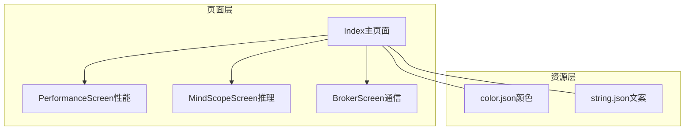
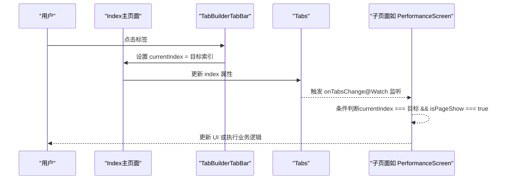
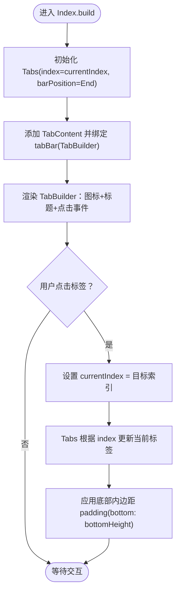
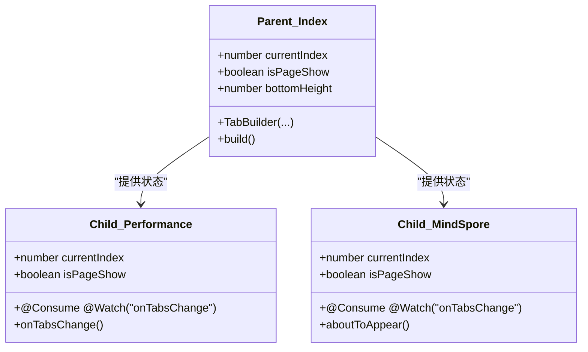
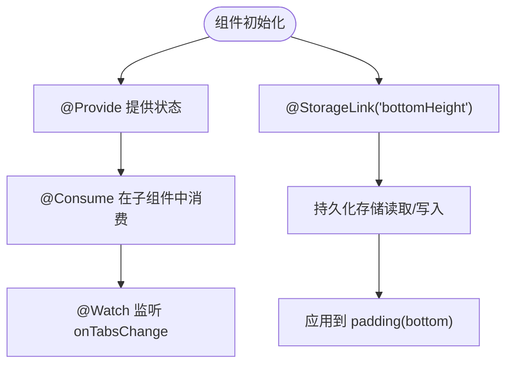
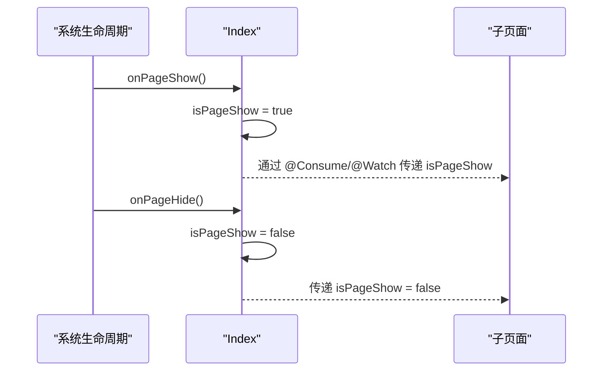
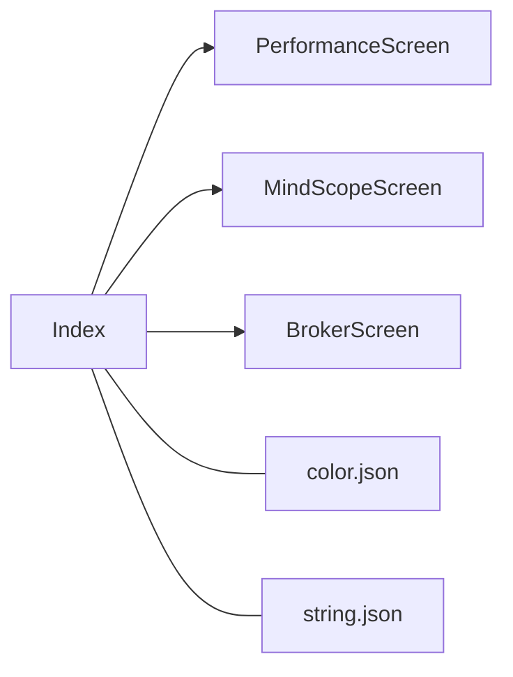

# 主页面导航

<cite>
**本文引用的文件**
- [Index.ets](file://entry/src/main/ets/pages/Index.ets)
- [PerformanceScreen.ets](file://entry/src/main/ets/pages/tabs/PerformanceScreen.ets)
- [MindScopeScreen.ets](file://entry/src/main/ets/pages/tabs/MindScopeScreen.ets)
- [BrokerScreen.ets](file://entry/src/main/ets/pages/tabs/BrokerScreen.ets)
- [color.json](file://entry/src/main/resources/base/element/color.json)
- [string.json](file://entry/src/main/resources/base/element/string.json)
</cite>

## 目录
1. [简介](#简介)
2. [项目结构](#项目结构)
3. [核心组件](#核心组件)
4. [架构总览](#架构总览)
5. [组件详细分析](#组件详细分析)
6. [依赖关系分析](#依赖关系分析)
7. [性能考量](#性能考量)
8. [故障排查指南](#故障排查指南)
9. [结论](#结论)
10. [附录](#附录)

## 简介
本文件围绕主页面导航的标签页实现进行系统化文档化，重点覆盖以下方面：
- Index 页面的标签页导航设计与实现
- TabBuilder 组件的设计思路、使用方式与交互逻辑
- 导航状态管理（currentIndex）与页面显示隐藏状态（isPageShow）的协同
- 样式定制与主题色使用
- @Provide 装饰器的父子状态同步机制
- @StorageLink 的持久化存储机制（bottomHeight）
- 页面显示隐藏状态处理、底部高度适配与全屏模式支持
- 导航组件的使用示例与最佳实践
- 跨设备兼容性与响应式布局建议

## 项目结构
主页面导航位于入口页面目录下，采用“页面 + 子页面”的分层组织方式：
- 入口页面：Index（主容器，承载 Tabs 与 TabBar）
- 子页面：PerformanceScreen（性能监控）、MindScopeScreen（推理）、BrokerScreen（通信）
- 资源：颜色与文案等基础资源文件

**图表来源**
- [Index.ets](file://entry/src/main/ets/pages/Index.ets#L1-L75)
- [PerformanceScreen.ets](file://entry/src/main/ets/pages/tabs/PerformanceScreen.ets#L1-L204)
- [MindScopeScreen.ets](file://entry/src/main/ets/pages/tabs/MindScopeScreen.ets#L1-L285)
- [BrokerScreen.ets](file://entry/src/main/ets/pages/tabs/BrokerScreen.ets#L1-L162)
- [color.json](file://entry/src/main/resources/base/element/color.json#L1-L64)
- [string.json](file://entry/src/main/resources/base/element/string.json#L1-L340)

**章节来源**
- [Index.ets](file://entry/src/main/ets/pages/Index.ets#L1-L75)
- [PerformanceScreen.ets](file://entry/src/main/ets/pages/tabs/PerformanceScreen.ets#L1-L204)
- [MindScopeScreen.ets](file://entry/src/main/ets/pages/tabs/MindScopeScreen.ets#L1-L285)
- [BrokerScreen.ets](file://entry/src/main/ets/pages/tabs/BrokerScreen.ets#L1-L162)
- [color.json](file://entry/src/main/resources/base/element/color.json#L1-L64)
- [string.json](file://entry/src/main/resources/base/element/string.json#L1-L340)

## 核心组件
- Index 主页面
  - 提供导航状态：currentIndex（当前选中标签索引）
  - 提供页面可见性：isPageShow（页面显示/隐藏状态）
  - 提供底部高度：bottomHeight（通过 @StorageLink 从存储读取）
  - 自定义 TabBar 构建器：TabBuilder
  - 使用 Tabs 组件承载子页面内容
- 子页面组件
  - PerformanceScreen：性能监控与设备信息展示
  - MindScopeScreen：MindSpore 推理流程与结果展示
  - BrokerScreen：MQTT 通信与消息订阅

关键装饰器与特性
- @Provide：在父组件中声明并提供状态给后代组件
- @StorageLink：将组件状态与持久化存储键绑定，实现跨会话记忆
- @Consume + @Watch：在子组件中消费父组件提供的状态，并监听变更事件

**章节来源**
- [Index.ets](file://entry/src/main/ets/pages/Index.ets#L11-L28)
- [PerformanceScreen.ets](file://entry/src/main/ets/pages/tabs/PerformanceScreen.ets#L17-L27)
- [MindScopeScreen.ets](file://entry/src/main/ets/pages/tabs/MindScopeScreen.ets#L22-L24)
- [BrokerScreen.ets](file://entry/src/main/ets/pages/tabs/BrokerScreen.ets#L1-L162)

## 架构总览
Index 作为根容器，负责：
- 维护导航状态（currentIndex）
- 维护页面可见性（isPageShow）
- 维护底部安全区高度（bottomHeight）
- 渲染 Tabs 与自定义 TabBar（TabBuilder）

子页面通过 @Consume + @Watch 订阅父组件状态，在标签切换或页面显示/隐藏时触发相应逻辑。

**图表来源**
- [Index.ets](file://entry/src/main/ets/pages/Index.ets#L30-L48)
- [PerformanceScreen.ets](file://entry/src/main/ets/pages/tabs/PerformanceScreen.ets#L36-L41)
- [MindScopeScreen.ets](file://entry/src/main/ets/pages/tabs/MindScopeScreen.ets#L119-L123)

## 组件详细分析

### Index 主页面与 TabBuilder
- 导航状态
  - currentIndex：用于控制当前激活的标签页
  - isPageShow：用于标记页面是否处于显示状态（onPageShow/onPageHide）
- 底部高度适配
  - bottomHeight 通过 @StorageLink('bottomHeight') 从持久化存储读取，用于动态调整页面内边距
- TabBar 自定义
  - TabBuilder 是一个 @Builder 方法，返回一个 Column，包含选中态图标、标题文本与点击行为
  - 点击事件直接设置 currentIndex，从而驱动 Tabs 切换
  - 选中态样式通过条件渲染切换图标与文字颜色
- Tabs 配置
  - barPosition：设置为底部（End）
  - barMode：固定模式（Fixed），避免滚动时标签栏消失
  - scrollable：禁用滑动，保证标签页数量较少时的稳定性
  - padding：底部内边距使用 bottomHeight 动态适配

**图表来源**
- [Index.ets](file://entry/src/main/ets/pages/Index.ets#L50-L72)

**章节来源**
- [Index.ets](file://entry/src/main/ets/pages/Index.ets#L11-L28)
- [Index.ets](file://entry/src/main/ets/pages/Index.ets#L30-L48)
- [Index.ets](file://entry/src/main/ets/pages/Index.ets#L50-L72)

### 子页面状态联动（@Consume + @Watch）
- 性能页（PerformanceScreen）
  - @Consume @Watch('onTabsChange') 订阅父组件状态
  - onTabsChange 中可根据 currentIndex 与 isPageShow 执行特定逻辑
- 推理页（MindScopeScreen）
  - 同样通过 @Consume @Watch('onTabsChange') 订阅父组件状态
  - 在 aboutToAppear 中注册事件监听，接收业务事件并更新 UI
- 通信页（BrokerScreen）
  - 该页不参与标签页切换逻辑，但可复用相同的状态联动模式

**图表来源**
- [Index.ets](file://entry/src/main/ets/pages/Index.ets#L13-L14)
- [PerformanceScreen.ets](file://entry/src/main/ets/pages/tabs/PerformanceScreen.ets#L17-L19)
- [MindScopeScreen.ets](file://entry/src/main/ets/pages/tabs/MindScopeScreen.ets#L22-L24)

**章节来源**
- [PerformanceScreen.ets](file://entry/src/main/ets/pages/tabs/PerformanceScreen.ets#L17-L41)
- [MindScopeScreen.ets](file://entry/src/main/ets/pages/tabs/MindScopeScreen.ets#L22-L24)
- [MindScopeScreen.ets](file://entry/src/main/ets/pages/tabs/MindScopeScreen.ets#L119-L139)

### @Provide 与 @StorageLink 的使用
- @Provide
  - 在父组件中声明并提供状态（currentIndex、isPageShow），供子组件通过 @Consume 访问
  - 适合父子组件之间的状态共享与解耦
- @StorageLink('bottomHeight')
  - 将 bottomHeight 与持久化存储键绑定，实现跨会话记忆底部高度
  - 在不同设备或系统设置变化时，仍能保持一致的视觉体验

**图表来源**
- [Index.ets](file://entry/src/main/ets/pages/Index.ets#L13-L17)
- [Index.ets](file://entry/src/main/ets/pages/Index.ets#L71-L71)

**章节来源**
- [Index.ets](file://entry/src/main/ets/pages/Index.ets#L13-L17)
- [Index.ets](file://entry/src/main/ets/pages/Index.ets#L71-L71)

### 页面显示隐藏状态处理
- onPageShow/onPageHide
  - 在页面显示时设置 isPageShow = true
  - 在页面隐藏时设置 isPageShow = false
- 子组件 onTabsChange
  - 结合 currentIndex 与 isPageShow 判断是否执行业务逻辑
  - 适用于仅在目标标签且页面可见时才刷新数据或处理事件

**图表来源**
- [Index.ets](file://entry/src/main/ets/pages/Index.ets#L19-L28)
- [PerformanceScreen.ets](file://entry/src/main/ets/pages/tabs/PerformanceScreen.ets#L36-L41)

**章节来源**
- [Index.ets](file://entry/src/main/ets/pages/Index.ets#L19-L28)
- [PerformanceScreen.ets](file://entry/src/main/ets/pages/tabs/PerformanceScreen.ets#L36-L41)

### 样式定制与主题色
- 主题色引用
  - 选中态文字颜色使用品牌色（$r('app.color.brand')）
  - 未选中态文字颜色使用字体色（$r('app.color.font'））
- 背景色与边框
  - TabBar 背景与上边框通过内联样式设置，保证与整体风格一致
- 资源文件
  - color.json 定义了品牌色、背景色、字体色等
  - string.json 提供文案资源（可用于国际化扩展）

**章节来源**
- [Index.ets](file://entry/src/main/ets/pages/Index.ets#L37-L38)
- [color.json](file://entry/src/main/resources/base/element/color.json#L1-L64)
- [string.json](file://entry/src/main/resources/base/element/string.json#L1-L340)

### 底部高度适配与全屏模式支持
- 底部高度适配
  - 通过 @StorageLink('bottomHeight') 读取存储中的底部高度值
  - 应用到 Tabs 的 padding(bottom) 中，实现安全区适配
- 全屏模式
  - Index 中保留了启用/禁用全屏的注释调用（themeManager.enableFullScreen/disableFullScreen）
  - 可按需开启全屏模式，减少系统导航栏对 UI 的遮挡

**章节来源**
- [Index.ets](file://entry/src/main/ets/pages/Index.ets#L17-L17)
- [Index.ets](file://entry/src/main/ets/pages/Index.ets#L71-L71)
- [Index.ets](file://entry/src/main/ets/pages/Index.ets#L20-L27)

### 导航组件使用示例与最佳实践
- 使用示例
  - 在 Index 中定义 TabBuilder，传入标题、目标索引与图标资源
  - 在 Tabs 中为每个 TabContent 绑定 tabBar(TabBuilder(...))
  - 通过点击事件设置 currentIndex，实现标签切换
- 最佳实践
  - 固定标签栏：barMode 设为 Fixed，避免滚动时标签栏消失
  - 禁用滑动：scrollable=false，适用于标签数量较少的场景
  - 状态联动：使用 @Provide/@Consume/@Watch 实现父子组件状态同步
  - 持久化记忆：使用 @StorageLink 记忆底部高度等用户偏好
  - 样式一致性：统一使用资源文件中的颜色与尺寸

**章节来源**
- [Index.ets](file://entry/src/main/ets/pages/Index.ets#L50-L72)
- [Index.ets](file://entry/src/main/ets/pages/Index.ets#L30-L48)

### 跨设备兼容性与响应式布局
- 响应式建议
  - 使用百分比宽度与约束尺寸，避免硬编码像素
  - 图标与文字采用相对尺寸，保证在不同屏幕密度下的可读性
  - 使用 padding/margin 的动态值（如 bottomHeight）适配安全区
- 兼容性建议
  - 在不同设备上测试标签栏高度与内容区域的协调
  - 对于存在刘海屏或底部安全区的设备，优先使用 @StorageLink 的 bottomHeight
  - 如需全屏模式，结合系统主题管理器进行适配

**章节来源**
- [Index.ets](file://entry/src/main/ets/pages/Index.ets#L71-L71)

## 依赖关系分析
- 组件依赖
  - Index 依赖各子页面组件（Performance、MindSpore、Broker）
  - 子页面通过 @Consume 订阅父组件状态
- 资源依赖
  - 颜色与文案资源由资源文件提供，统一管理主题与文案
- 外部接口
  - 生命周期方法（onPageShow/onPageHide）用于页面可见性管理
  - @StorageLink 用于持久化存储键绑定

**图表来源**
- [Index.ets](file://entry/src/main/ets/pages/Index.ets#L1-L4)
- [PerformanceScreen.ets](file://entry/src/main/ets/pages/tabs/PerformanceScreen.ets#L1-L4)
- [MindScopeScreen.ets](file://entry/src/main/ets/pages/tabs/MindScopeScreen.ets#L1-L11)
- [BrokerScreen.ets](file://entry/src/main/ets/pages/tabs/BrokerScreen.ets#L1-L7)
- [color.json](file://entry/src/main/resources/base/element/color.json#L1-L64)
- [string.json](file://entry/src/main/resources/base/element/string.json#L1-L340)

**章节来源**
- [Index.ets](file://entry/src/main/ets/pages/Index.ets#L1-L4)
- [PerformanceScreen.ets](file://entry/src/main/ets/pages/tabs/PerformanceScreen.ets#L1-L4)
- [MindScopeScreen.ets](file://entry/src/main/ets/pages/tabs/MindScopeScreen.ets#L1-L11)
- [BrokerScreen.ets](file://entry/src/main/ets/pages/tabs/BrokerScreen.ets#L1-L7)

## 性能考量
- 状态同步开销
  - @Provide/@Consume/@Watch 的组合在父子组件间建立轻量级状态通道，通常开销较小
- 渲染优化
  - Tabs 的 barMode=Fixed 与 scrollable=false 减少不必要的重排
  - TabBuilder 内部仅包含少量静态元素与条件渲染，避免复杂计算
- 资源访问
  - 颜色与图标资源通过 $r 引用，建议集中管理，避免重复加载

[本节为通用指导，无需列出具体文件来源]

## 故障排查指南
- 标签页不切换
  - 检查 TabBuilder 的 onClick 是否正确设置 currentIndex
  - 确认 Tabs 的 index 绑定是否指向同一状态
- 样式异常
  - 检查 color.json 中的颜色键是否存在
  - 确认选中态与未选中态的颜色引用是否正确
- 底部留白异常
  - 检查 @StorageLink('bottomHeight') 是否正确读取存储值
  - 确认 padding(bottom) 是否被其他样式覆盖
- 页面可见性逻辑无效
  - 确认子组件是否正确使用 @Consume @Watch('onTabsChange')
  - 检查 onPageShow/onPageHide 是否被调用

**章节来源**
- [Index.ets](file://entry/src/main/ets/pages/Index.ets#L30-L48)
- [Index.ets](file://entry/src/main/ets/pages/Index.ets#L71-L71)
- [PerformanceScreen.ets](file://entry/src/main/ets/pages/tabs/PerformanceScreen.ets#L36-L41)
- [color.json](file://entry/src/main/resources/base/element/color.json#L1-L64)

## 结论
本导航方案通过 Index 主容器与 TabBuilder 自定义标签栏，结合 @Provide/@Consume/@Watch 的状态联动与 @StorageLink 的持久化能力，实现了简洁稳定的主页面导航。配合固定的标签栏与底部安全区适配，能够在多设备环境下提供一致的用户体验。建议在后续迭代中逐步开放更多标签页，并完善全屏模式与响应式布局策略。

[本节为总结性内容，无需列出具体文件来源]

## 附录
- 关键路径参考
  - Index 主页面与 TabBuilder：[Index.ets](file://entry/src/main/ets/pages/Index.ets#L11-L72)
  - 子页面状态联动：[PerformanceScreen.ets](file://entry/src/main/ets/pages/tabs/PerformanceScreen.ets#L17-L41)、[MindScopeScreen.ets](file://entry/src/main/ets/pages/tabs/MindScopeScreen.ets#L22-L24)
  - 资源文件：[color.json](file://entry/src/main/resources/base/element/color.json#L1-L64)、[string.json](file://entry/src/main/resources/base/element/string.json#L1-L340)

[本节为补充信息，无需列出具体文件来源]