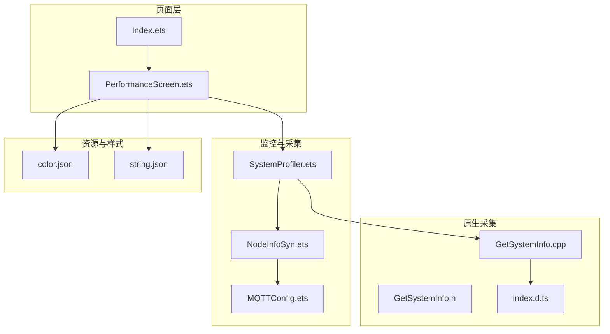
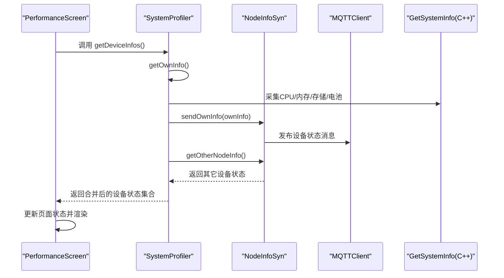
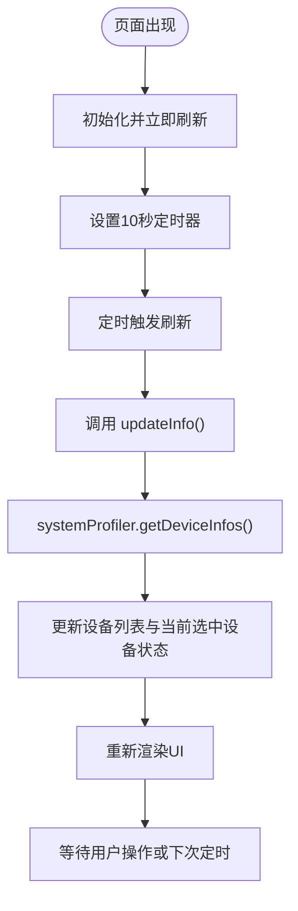
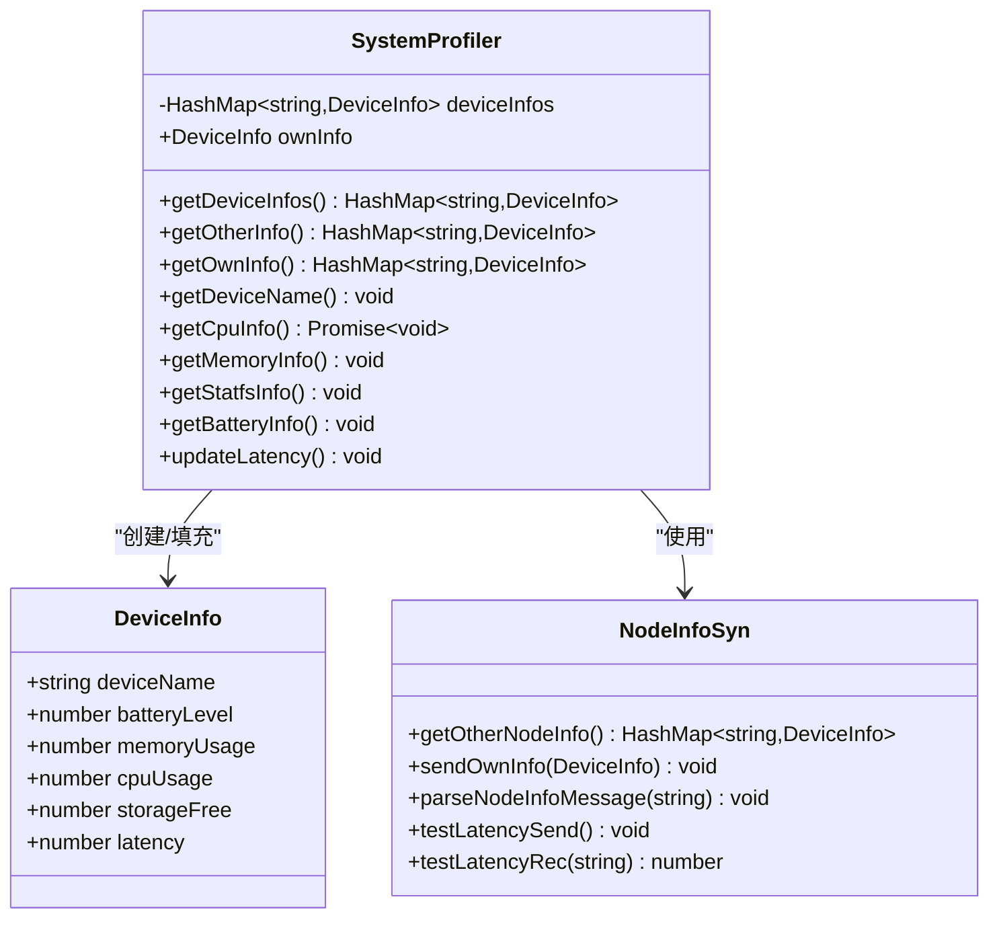
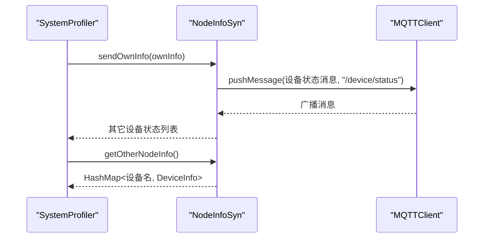
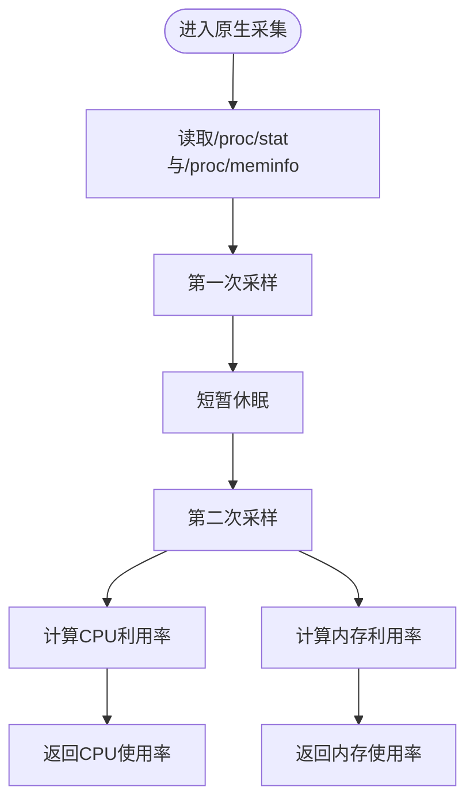
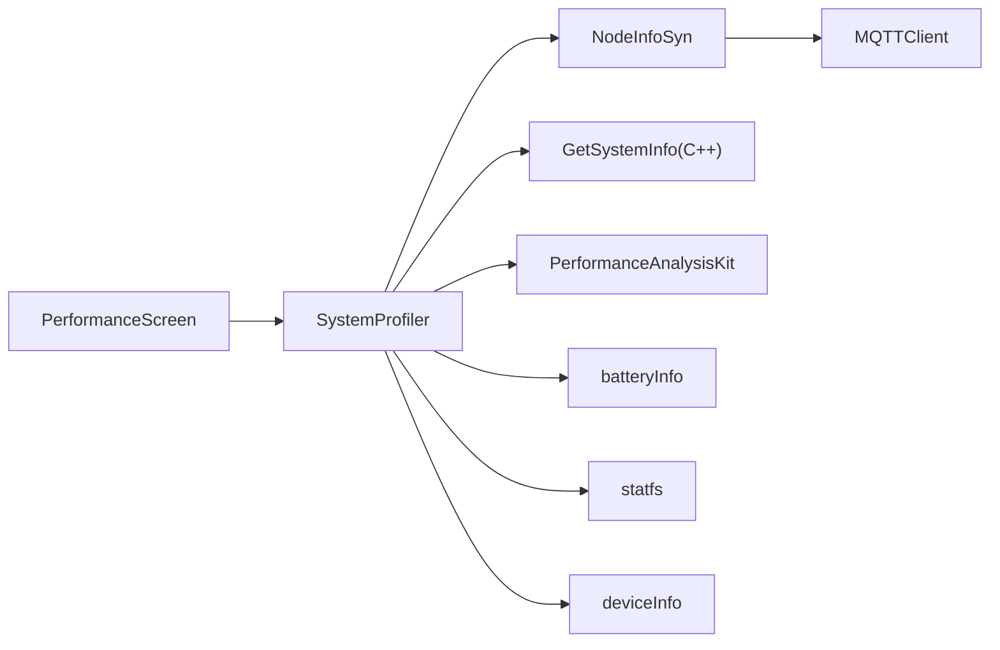

# 性能监控界面

<cite>
**本文引用的文件**
- [PerformanceScreen.ets](file://entry/src/main/ets/pages/tabs/PerformanceScreen.ets)
- [SystemProfiler.ets](file://entry/src/main/ets/manager/monitor/SystemProfiler.ets)
- [NodeInfoSyn.ets](file://entry/src/main/ets/manager/broker/monitor/NodeInfoSyn.ets)
- [MQTTConfig.ets](file://entry/src/main/ets/manager/broker/MQTTConfig.ets)
- [GetSystemInfo.cpp](file://entry/src/main/cpp/GetSystemInfo.cpp)
- [GetSystemInfo.h](file://entry/src/main/cpp/GetSystemInfo.h)
- [index.d.ts](file://entry/src/main/cpp/types/libentry/index.d.ts)
- [color.json](file://entry/src/main/resources/base/element/color.json)
- [string.json](file://entry/src/main/resources/base/element/string.json)
- [Index.ets](file://entry/src/main/ets/pages/Index.ets)
</cite>

## 目录
1. [简介](#简介)
2. [项目结构](#项目结构)
3. [核心组件](#核心组件)
4. [架构总览](#架构总览)
5. [组件详细分析](#组件详细分析)
6. [依赖关系分析](#依赖关系分析)
7. [性能考虑](#性能考虑)
8. [故障排除指南](#故障排除指南)
9. [结论](#结论)
10. [附录](#附录)

## 简介
本文件面向性能监控界面的 UI 组件文档，重点围绕 PerformanceScreen 组件的实现与功能展开，涵盖以下方面：
- 性能指标展示方式：CPU 占用、内存占用、剩余存储、电池状态等
- 实时数据更新机制：定时刷新策略与页面可见性联动
- 图表可视化：环形仪表图（Gauge）展示电池状态
- 设备状态信息收集与显示：本地采集与跨设备同步
- 性能评分与历史数据：当前未实现，但具备扩展基础
- 刷新策略、历史数据存储与查询：当前未实现，建议方案
- 最佳实践与可读性优化：UI 布局、颜色与单位展示
- 故障排除指南：常见问题定位与修复建议

## 项目结构
PerformanceScreen 位于页面层 tabs 目录，通过系统监控模块 SystemProfiler 获取设备状态，并借助 NodeInfoSyn 与其他设备进行状态同步。资源与样式通过资源文件定义。

**图表来源**
- [PerformanceScreen.ets](file://entry/src/main/ets/pages/tabs/PerformanceScreen.ets#L1-L204)
- [SystemProfiler.ets](file://entry/src/main/ets/manager/monitor/SystemProfiler.ets#L1-L119)
- [NodeInfoSyn.ets](file://entry/src/main/ets/manager/broker/monitor/NodeInfoSyn.ets#L1-L173)
- [MQTTConfig.ets](file://entry/src/main/ets/manager/broker/MQTTConfig.ets#L1-L7)
- [GetSystemInfo.cpp](file://entry/src/main/cpp/GetSystemInfo.cpp#L1-L180)
- [GetSystemInfo.h](file://entry/src/main/cpp/GetSystemInfo.h#L1-L23)
- [index.d.ts](file://entry/src/main/cpp/types/libentry/index.d.ts#L1-L5)
- [color.json](file://entry/src/main/resources/base/element/color.json#L1-L64)
- [string.json](file://entry/src/main/resources/base/element/string.json#L1-L340)
- [Index.ets](file://entry/src/main/ets/pages/Index.ets#L1-L75)

**章节来源**
- [PerformanceScreen.ets](file://entry/src/main/ets/pages/tabs/PerformanceScreen.ets#L1-L204)
- [SystemProfiler.ets](file://entry/src/main/ets/manager/monitor/SystemProfiler.ets#L1-L119)
- [NodeInfoSyn.ets](file://entry/src/main/ets/manager/broker/monitor/NodeInfoSyn.ets#L1-L173)
- [MQTTConfig.ets](file://entry/src/main/ets/manager/broker/MQTTConfig.ets#L1-L7)
- [GetSystemInfo.cpp](file://entry/src/main/cpp/GetSystemInfo.cpp#L1-L180)
- [GetSystemInfo.h](file://entry/src/main/cpp/GetSystemInfo.h#L1-L23)
- [index.d.ts](file://entry/src/main/cpp/types/libentry/index.d.ts#L1-L5)
- [color.json](file://entry/src/main/resources/base/element/color.json#L1-L64)
- [string.json](file://entry/src/main/resources/base/element/string.json#L1-L340)
- [Index.ets](file://entry/src/main/ets/pages/Index.ets#L1-L75)

## 核心组件
- PerformanceScreen：性能监控主界面，负责展示 CPU、内存、存储、电池状态，支持设备切换与定时刷新。
- SystemProfiler：系统信息采集与聚合，封装本地采集与跨设备同步。
- NodeInfoSyn：节点信息同步与网络延迟测试，负责设备间状态广播与接收。
- MQTTConfig：MQTT 客户端标识（设备名）来源，基于设备市场名称。
- GetSystemInfo（原生）：提供 CPU 使用率与内存使用率的底层采集能力。

**章节来源**
- [PerformanceScreen.ets](file://entry/src/main/ets/pages/tabs/PerformanceScreen.ets#L14-L60)
- [SystemProfiler.ets](file://entry/src/main/ets/manager/monitor/SystemProfiler.ets#L10-L119)
- [NodeInfoSyn.ets](file://entry/src/main/ets/manager/broker/monitor/NodeInfoSyn.ets#L40-L173)
- [MQTTConfig.ets](file://entry/src/main/ets/manager/broker/MQTTConfig.ets#L4-L6)
- [GetSystemInfo.cpp](file://entry/src/main/cpp/GetSystemInfo.cpp#L10-L49)

## 架构总览
PerformanceScreen 通过 SystemProfiler 获取设备状态集合，其中包含本机状态与其它设备状态；SystemProfiler 调用 NodeInfoSyn 同步状态并通过 MQTT 广播；本地状态由 GetSystemInfo 提供的原生接口采集。

**图表来源**
- [PerformanceScreen.ets](file://entry/src/main/ets/pages/tabs/PerformanceScreen.ets#L42-L60)
- [SystemProfiler.ets](file://entry/src/main/ets/manager/monitor/SystemProfiler.ets#L47-L81)
- [NodeInfoSyn.ets](file://entry/src/main/ets/manager/broker/monitor/NodeInfoSyn.ets#L63-L80)
- [GetSystemInfo.cpp](file://entry/src/main/cpp/GetSystemInfo.cpp#L10-L49)

**章节来源**
- [PerformanceScreen.ets](file://entry/src/main/ets/pages/tabs/PerformanceScreen.ets#L29-L60)
- [SystemProfiler.ets](file://entry/src/main/ets/manager/monitor/SystemProfiler.ets#L47-L81)
- [NodeInfoSyn.ets](file://entry/src/main/ets/manager/broker/monitor/NodeInfoSyn.ets#L63-L80)
- [GetSystemInfo.cpp](file://entry/src/main/cpp/GetSystemInfo.cpp#L10-L49)

## 组件详细分析

### PerformanceScreen 组件
- 角色与职责
  - 展示性能指标：CPU 占用、内存占用、剩余存储、电池状态
  - 支持设备切换：通过下拉选择器切换不同设备的状态
  - 定时刷新：页面出现时启动定时器，每 10 秒刷新一次
  - 页面可见性联动：与 Tabs 的 currentIndex 和 isPageShow 结合，确保仅在性能页活跃时刷新
- 关键状态
  - 电池状态、内存占用、CPU 占用、剩余存储
  - 设备映射（HashMap）、设备名称选项（SelectOption 数组）
  - 刷新标志位（isRefreshing）
- 渲染结构
  - 顶部标题栏
  - 三列指标卡片：CPU、内存、存储
  - 电池管理区域：环形仪表图展示电池剩余百分比
  - 背景图片与容器尺寸约束
- 交互行为
  - 下拉选择器变更时调用 showInfo 显示对应设备状态
  - 点击电池区域跳转至电池详情页

**图表来源**
- [PerformanceScreen.ets](file://entry/src/main/ets/pages/tabs/PerformanceScreen.ets#L29-L60)

**章节来源**
- [PerformanceScreen.ets](file://entry/src/main/ets/pages/tabs/PerformanceScreen.ets#L14-L204)

### SystemProfiler 类
- 角色与职责
  - 聚合本机与其它设备状态，提供统一的设备信息集合
  - 采集本机状态：设备名、CPU、内存、存储、电池、网络延迟
  - 通过 NodeInfoSyn 发送本机状态并接收其它设备状态
- 数据模型
  - DeviceInfo：包含设备名、电池、内存、CPU、存储、延迟
- 采集流程
  - 获取设备名（来自 MQTT 客户端标识）
  - 异步获取 CPU 使用率（PerformanceAnalysisKit）
  - 通过原生接口获取内存使用率
  - 通过 statfs 获取存储剩余比例
  - 读取电池电量（batteryInfo）
  - 计算并更新网络延迟（基于 NodeInfoSyn 的延迟测试）

**图表来源**
- [SystemProfiler.ets](file://entry/src/main/ets/manager/monitor/SystemProfiler.ets#L10-L119)
- [NodeInfoSyn.ets](file://entry/src/main/ets/manager/broker/monitor/NodeInfoSyn.ets#L40-L173)

**章节来源**
- [SystemProfiler.ets](file://entry/src/main/ets/manager/monitor/SystemProfiler.ets#L10-L119)
- [GetSystemInfo.cpp](file://entry/src/main/cpp/GetSystemInfo.cpp#L72-L179)

### NodeInfoSyn 与 MQTT 集成
- 角色与职责
  - 管理其它设备状态列表，提供 HashMap 查询
  - 通过 MQTT 发布本机状态，解析并更新其它设备状态
  - 执行延迟测试，计算网络往返时间
- 关键方法
  - sendOwnInfo：构造消息并发布到 /device/status
  - parseNodeInfoMessage：解析其它设备状态消息并去重更新
  - testLatencySend/testLatencyRec：延迟测试消息的发送与接收

**图表来源**
- [NodeInfoSyn.ets](file://entry/src/main/ets/manager/broker/monitor/NodeInfoSyn.ets#L63-L80)
- [SystemProfiler.ets](file://entry/src/main/ets/manager/monitor/SystemProfiler.ets#L67-L79)

**章节来源**
- [NodeInfoSyn.ets](file://entry/src/main/ets/manager/broker/monitor/NodeInfoSyn.ets#L40-L173)
- [MQTTConfig.ets](file://entry/src/main/ets/manager/broker/MQTTConfig.ets#L4-L6)

### 原生采集模块 GetSystemInfo
- 角色与职责
  - 提供 CPU 使用率与内存使用率的原生采集接口
  - 通过解析 /proc 文件系统计算 CPU 与内存利用率
- 关键算法
  - CPU 利用率：两次采样间隔内空闲时间差与总时间差的比值
  - 内存利用率：1 - 可用内存 / 总内存
- 导出类型
  - index.d.ts 中声明 getMemUsage 与 getCpuUsage 的导出类型

**图表来源**
- [GetSystemInfo.cpp](file://entry/src/main/cpp/GetSystemInfo.cpp#L72-L179)
- [index.d.ts](file://entry/src/main/cpp/types/libentry/index.d.ts#L1-L5)

**章节来源**
- [GetSystemInfo.cpp](file://entry/src/main/cpp/GetSystemInfo.cpp#L10-L179)
- [index.d.ts](file://entry/src/main/cpp/types/libentry/index.d.ts#L1-L5)

### UI 可视化与布局
- 指标卡片
  - 使用 GridRow/GridCol 布局三列展示 CPU、内存、存储
  - 每列包含图标、名称、数值与单位
- 电池管理
  - 使用 Gauge 组件绘制环形仪表图，颜色随数值分段渐变
  - 点击区域跳转至电池详情页
- 样式与主题
  - 字体颜色、背景色、边框圆角、间距等通过资源文件定义
  - 支持浅色/深色主题切换（通过资源引用）

**章节来源**
- [PerformanceScreen.ets](file://entry/src/main/ets/pages/tabs/PerformanceScreen.ets#L76-L204)
- [color.json](file://entry/src/main/resources/base/element/color.json#L1-L64)
- [string.json](file://entry/src/main/resources/base/element/string.json#L1-L340)

## 依赖关系分析
- 组件耦合
  - PerformanceScreen 依赖 SystemProfiler 获取设备状态
  - SystemProfiler 依赖 NodeInfoSyn 进行设备状态同步
  - NodeInfoSyn 依赖 MQTTClient 进行消息广播
  - SystemProfiler 依赖原生 GetSystemInfo 提供底层采集
- 外部依赖
  - PerformanceAnalysisKit：系统 CPU 使用率采集
  - batteryInfo：电池电量采集
  - statfs：文件系统空间统计
  - deviceInfo：设备标识（市场名称）

**图表来源**
- [PerformanceScreen.ets](file://entry/src/main/ets/pages/tabs/PerformanceScreen.ets#L1-L4)
- [SystemProfiler.ets](file://entry/src/main/ets/manager/monitor/SystemProfiler.ets#L1-L8)
- [NodeInfoSyn.ets](file://entry/src/main/ets/manager/broker/monitor/NodeInfoSyn.ets#L1-L9)
- [MQTTConfig.ets](file://entry/src/main/ets/manager/broker/MQTTConfig.ets#L1-L7)
- [GetSystemInfo.cpp](file://entry/src/main/cpp/GetSystemInfo.cpp#L1-L10)

**章节来源**
- [PerformanceScreen.ets](file://entry/src/main/ets/pages/tabs/PerformanceScreen.ets#L1-L4)
- [SystemProfiler.ets](file://entry/src/main/ets/manager/monitor/SystemProfiler.ets#L1-L8)
- [NodeInfoSyn.ets](file://entry/src/main/ets/manager/broker/monitor/NodeInfoSyn.ets#L1-L9)
- [MQTTConfig.ets](file://entry/src/main/ets/manager/broker/MQTTConfig.ets#L1-L7)
- [GetSystemInfo.cpp](file://entry/src/main/cpp/GetSystemInfo.cpp#L1-L10)

## 性能考虑
- 刷新频率
  - 当前每 10 秒刷新一次，适合轻量级监控场景；若设备数量较多或网络延迟较高，可考虑动态调整周期或按需刷新
- 原生采集开销
  - CPU 与内存采集涉及文件系统读取与短暂休眠，建议避免过于频繁的调用
- UI 渲染
  - 使用 setState 合并更新，减少不必要的重绘
  - 指标卡片与仪表图均为轻量组件，注意避免在高频刷新中重复创建复杂对象
- 网络同步
  - MQTT 广播应控制消息大小与频率，避免阻塞主线程

[本节为通用指导，无需列出具体文件来源]

## 故障排除指南
- 无法获取设备状态
  - 检查 SystemProfiler 是否成功调用 getDeviceInfos
  - 确认 NodeInfoSyn 是否正确解析并更新其它设备状态
  - 查看 MQTT 是否正常连接与发布
- 电池/存储/内存数值异常
  - 核对原生采集逻辑是否正确（/proc 文件解析）
  - 检查 statfs 获取路径与权限
- 页面不刷新
  - 确认 aboutToAppear 生命周期钩子已执行
  - 检查定时器是否被销毁或阻塞
- UI 不显示或显示错位
  - 检查资源文件引用（颜色、媒体资源）
  - 确认容器尺寸与约束设置

**章节来源**
- [SystemProfiler.ets](file://entry/src/main/ets/manager/monitor/SystemProfiler.ets#L47-L81)
- [NodeInfoSyn.ets](file://entry/src/main/ets/manager/broker/monitor/NodeInfoSyn.ets#L100-L125)
- [GetSystemInfo.cpp](file://entry/src/main/cpp/GetSystemInfo.cpp#L132-L179)
- [PerformanceScreen.ets](file://entry/src/main/ets/pages/tabs/PerformanceScreen.ets#L29-L60)

## 结论
PerformanceScreen 通过 SystemProfiler 与 NodeInfoSyn 实现了本地与跨设备的性能状态采集与展示，结合原生采集模块提供了稳定的 CPU、内存、存储与电池信息。当前版本聚焦于实时展示与简单交互，尚未实现性能评分与历史数据持久化。后续可在现有基础上扩展评分算法、历史数据存储与查询、以及更丰富的图表可视化。

[本节为总结性内容，无需列出具体文件来源]

## 附录

### 性能指标与展示规范
- CPU 占用：百分比，保留整数
- 内存占用：百分比，保留整数
- 剩余存储：GB，保留一位小数
- 电池状态：百分比，环形仪表图展示

**章节来源**
- [PerformanceScreen.ets](file://entry/src/main/ets/pages/tabs/PerformanceScreen.ets#L120-L147)
- [PerformanceScreen.ets](file://entry/src/main/ets/pages/tabs/PerformanceScreen.ets#L164-L186)

### 刷新策略与历史数据建议
- 刷新策略
  - 页面可见时启用定时器，不可见时暂停或降低频率
  - 支持手动刷新按钮，优先级低于自动刷新
- 历史数据
  - 建议引入本地数据库或内存队列，按时间戳存储最近 N 条记录
  - 提供图表组件展示趋势，支持缩放与导出
- 性能评分
  - 基于 CPU、内存、存储、电池等指标加权计算
  - 评分区间与阈值可通过配置文件管理

[本节为扩展建议，无需列出具体文件来源]