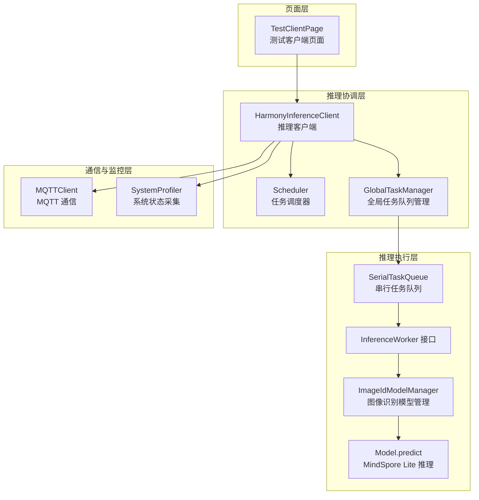
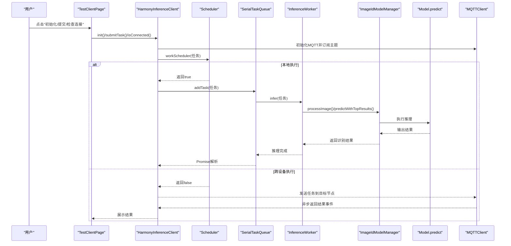
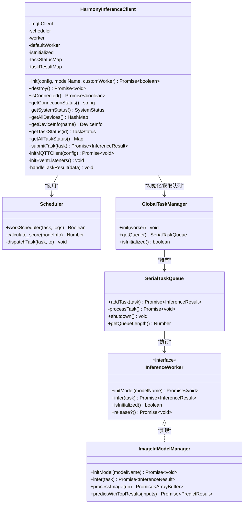
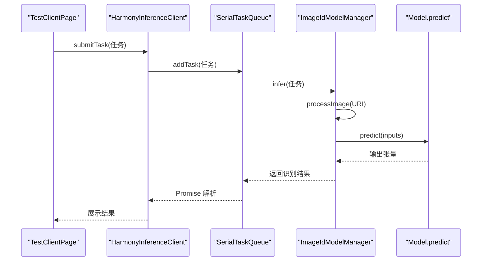
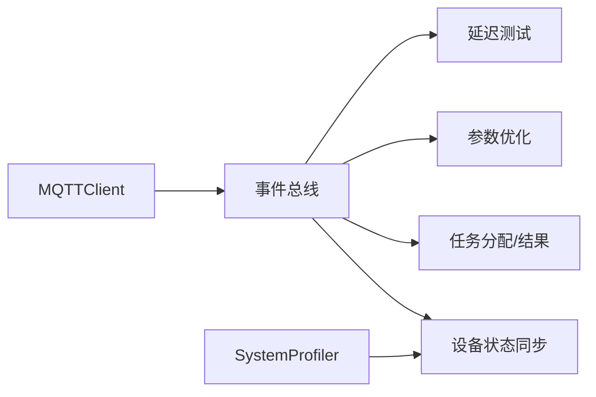
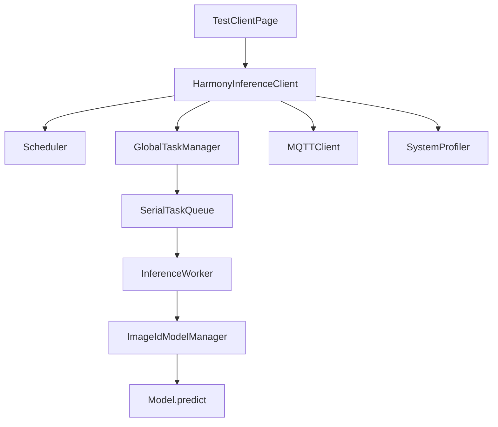

# 推理测试界面

<cite>
**本文引用的文件**
- [TestClientPage.ets](file://entry/src/main/ets/pages/TestClientPage.ets)
- [HarmonyInferenceClient.ets](file://entry/src/main/ets/manager/HarmonyInferenceClient.ets)
- [InferenceWorker.ets](file://entry/src/main/ets/manager/worker/InferenceWorker.ets)
- [ImageIdModelManager.ets](file://entry/src/main/ets/TestImageTask/ImageIdModelManager.ets)
- [GlobalTaskManager.ets](file://entry/src/main/ets/manager/worker/GlobalTaskManager.ets)
- [SerialTaskQueue.ets](file://entry/src/main/ets/manager/worker/SerialTaskQueue.ets)
- [MQTTClient.ets](file://entry/src/main/ets/manager/broker/MQTTClient.ets)
- [SystemProfiler.ets](file://entry/src/main/ets/manager/monitor/SystemProfiler.ets)
</cite>

## 更新摘要
**变更内容**
- 移除了测试页面中的 TODO 注释标记，改进了错误处理实践
- 增强了 HarmonyInferenceClient 的 destroy 方法，确保所有关联资源得到正确释放
- 改进了测试页面的资源管理，包括定时器清理和事件监听器移除
- 完善了错误处理机制，增加了更健壮的异常捕获和资源清理

## 目录
1. [简介](#简介)
2. [项目结构](#项目结构)
3. [核心组件](#核心组件)
4. [架构总览](#架构总览)
5. [详细组件分析](#详细组件分析)
6. [依赖关系分析](#依赖关系分析)
7. [性能考虑](#性能考虑)
8. [故障排查指南](#故障排查指南)
9. [结论](#结论)
10. [附录](#附录)

## 简介
本文件面向推理测试界面的使用者与维护者，系统化梳理 TestClientPage 组件的设计与实现，覆盖以下方面：
- 推理任务的提交界面、图像选择与参数配置
- 测试结果的展示方式、推理状态的实时更新与错误处理
- 测试用例管理、结果对比与性能评估能力
- 使用指南与调试技巧
- 针对易用性与测试数据有效性的改进建议

## 项目结构
推理测试界面位于应用入口页面层，围绕 TestClientPage 组件构建，其后通过 HarmonyInferenceClient 协调 MQTT 通信、任务调度、模型推理与系统状态采集等模块。



**图表来源**
- [TestClientPage.ets:45-141](file://entry/src/main/ets/pages/TestClientPage.ets#L45-L141)
- [HarmonyInferenceClient.ets:163-196](file://entry/src/main/ets/manager/HarmonyInferenceClient.ets#L163-L196)
- [GlobalTaskManager.ets:8-21](file://entry/src/main/ets/manager/worker/GlobalTaskManager.ets#L8-L21)
- [SerialTaskQueue.ets:24-83](file://entry/src/main/ets/manager/worker/SerialTaskQueue.ets#L24-L83)
- [ImageIdModelManager.ets:205-237](file://entry/src/main/ets/TestImageTask/ImageIdModelManager.ets#L205-L237)
- [MQTTClient.ets:68-73](file://entry/src/main/ets/manager/broker/MQTTClient.ets#L68-L73)
- [SystemProfiler.ets:47-81](file://entry/src/main/ets/manager/monitor/SystemProfiler.ets#L47-L81)

**章节来源**
- [TestClientPage.ets:1-151](file://entry/src/main/ets/pages/TestClientPage.ets#L1-L151)
- [HarmonyInferenceClient.ets:1-357](file://entry/src/main/ets/manager/HarmonyInferenceClient.ets#L1-L357)

## 核心组件
- **TestClientPage**：测试界面入口，负责用户交互、状态展示与日志输出。
- **HarmonyInferenceClient**：推理客户端，统一管理 MQTT 连接、事件监听、任务提交与结果获取。
- **Scheduler**：任务调度器，基于系统状态与权重参数选择最优执行节点。
- **GlobalTaskManager/SerialTaskQueue**：本地任务队列，串行执行推理任务。
- **ImageIdModelManager**：图像识别模型管理器，负责图像预处理与推理调用。
- **MQTTClient**：MQTT 通信客户端，负责订阅/发布与事件转发。
- **SystemProfiler**：系统状态采集器，提供设备 CPU、内存、电量、存储与网络延迟等信息。

**章节来源**
- [TestClientPage.ets:11-151](file://entry/src/main/ets/pages/TestClientPage.ets#L11-L151)
- [HarmonyInferenceClient.ets:52-357](file://entry/src/main/ets/manager/HarmonyInferenceClient.ets#L52-L357)
- [GlobalTaskManager.ets:4-27](file://entry/src/main/ets/manager/worker/GlobalTaskManager.ets#L4-L27)
- [SerialTaskQueue.ets:13-104](file://entry/src/main/ets/manager/worker/SerialTaskQueue.ets#L13-L104)
- [ImageIdModelManager.ets:31-258](file://entry/src/main/ets/TestImageTask/ImageIdModelManager.ets#L31-L258)
- [MQTTClient.ets:24-223](file://entry/src/main/ets/manager/broker/MQTTClient.ets#L24-L223)
- [SystemProfiler.ets:43-120](file://entry/src/main/ets/manager/monitor/SystemProfiler.ets#L43-L120)

## 架构总览
下图展示了从页面到推理执行的完整链路，包括本地执行与跨设备分发两种路径。



**图表来源**
- [TestClientPage.ets:54-110](file://entry/src/main/ets/pages/TestClientPage.ets#L54-L110)
- [HarmonyInferenceClient.ets:163-353](file://entry/src/main/ets/manager/HarmonyInferenceClient.ets#L163-L353)
- [SerialTaskQueue.ets:51-83](file://entry/src/main/ets/manager/worker/SerialTaskQueue.ets#L51-L83)
- [ImageIdModelManager.ets:205-237](file://entry/src/main/ets/TestImageTask/ImageIdModelManager.ets#L205-L237)
- [MQTTClient.ets:153-182](file://entry/src/main/ets/manager/broker/MQTTClient.ets#L153-L182)

## 详细组件分析

### TestClientPage 组件设计与实现
- **角色定位**：测试界面入口，提供初始化、连接检查、系统状态查看、任务提交、结果展示与日志输出。
- **状态管理**：
  - 连接状态：连接成功/失败/断开
  - 测试结果：JSON 字符串展示
  - 日志消息：最多保留最近20条，带时间戳
  - 系统状态：聚合所有设备信息并逐项展示
- **交互流程**：
  - 初始化：传入 MQTT 配置、默认模型名与图像识别 Worker
  - 连接检查：轮询 MQTT 客户端连接状态
  - 系统状态：拉取系统状态并渲染
  - 提交任务：校验初始化状态，提交测试任务，捕获异常并记录日志
  - 销毁：释放 MQTT 与 Worker 资源，重置状态
- **数据流**：
  - 页面状态驱动 UI 渲染
  - 任务结果写入状态并在页面展示
  - 日志追加并滚动显示

```mermaid
flowchart TD
Start(["页面启动"]) --> Init["点击"初始化客户端"]
Init --> InitOK{"初始化成功？"}
InitOK -- 否 --> LogFail["记录失败日志"] --> Wait["等待操作"]
InitOK -- 是 --> Ready["标记为已初始化"]
Ready --> ConnCheck["点击"检查连接"]
ConnCheck --> SetConn["更新连接状态"]
Ready --> SysStat["点击"获取系统状态"]
SysStat --> RenderSys["渲染设备列表"]
Ready --> Submit["点击"提交测试任务"]
Submit --> Valid{"已初始化？"}
Valid -- 否 --> LogNotInit["记录未初始化日志"] --> Wait
Valid -- 是 --> TrySubmit["提交任务并等待结果"]
TrySubmit --> ResultOK{"结果成功？"}
ResultOK -- 是 --> ShowRes["展示结果JSON"] --> LogOk["记录成功日志"] --> Wait
ResultOK -- 否 --> LogErr["记录错误日志"] --> Wait
Wait --> Destroy["点击"销毁客户端"]
Destroy --> Reset["重置状态并释放资源"] --> End(["结束"])
```

**图表来源**
- [TestClientPage.ets:54-125](file://entry/src/main/ets/pages/TestClientPage.ets#L54-L125)

**章节来源**
- [TestClientPage.ets:11-151](file://entry/src/main/ets/pages/TestClientPage.ets#L11-L151)

### HarmonyInferenceClient 协调器
- **职责**：
  - 初始化与销毁：建立 MQTT 连接、注册事件监听、初始化 Worker 与全局任务队列
  - 连接状态：定时轮询 MQTT 连接状态并更新
  - 任务提交：调度器决策本地/远程执行，本地走队列，远程等待结果事件
  - 系统状态：聚合自身与其它设备信息
- **关键点**：
  - 事件监听：根据主题分发到不同模块（设备状态、任务分配、参数优化、延迟测试）
  - 结果处理：通过事件机制接收结果并缓存，供远程任务等待解析
  - 超时控制：远程任务最长等待30秒，超时抛错
  - **资源管理**：增强的 destroy 方法确保所有关联资源得到正确释放

**更新** 改进了错误处理实践，增强了 destroy 客户端功能，确保所有关联资源得到正确释放



**图表来源**
- [HarmonyInferenceClient.ets:52-357](file://entry/src/main/ets/manager/HarmonyInferenceClient.ets#L52-L357)
- [GlobalTaskManager.ets:4-27](file://entry/src/main/ets/manager/worker/GlobalTaskManager.ets#L4-L27)
- [SerialTaskQueue.ets:13-104](file://entry/src/main/ets/manager/worker/SerialTaskQueue.ets#L13-L104)
- [ImageIdModelManager.ets:31-258](file://entry/src/main/ets/TestImageTask/ImageIdModelManager.ets#L31-L258)

**章节来源**
- [HarmonyInferenceClient.ets:83-236](file://entry/src/main/ets/manager/HarmonyInferenceClient.ets#L83-L236)
- [HarmonyInferenceClient.ets:284-353](file://entry/src/main/ets/manager/HarmonyInferenceClient.ets#L284-L353)

### 推理执行链路（图像识别）
- **输入**：页面构造的 InferenceTask（类型为图像，包含默认图像 URI 与参数）
- **预处理**：ImageIdModelManager 对 PixelMap 进行缩放、裁剪与归一化
- **推理**：Model.predict 使用 MindSpore Lite 在 CPU 上执行
- **输出**：返回置信度数组与类别索引数组



**图表来源**
- [TestClientPage.ets:95-110](file://entry/src/main/ets/pages/TestClientPage.ets#L95-L110)
- [HarmonyInferenceClient.ets:309-353](file://entry/src/main/ets/manager/HarmonyInferenceClient.ets#L309-L353)
- [SerialTaskQueue.ets:64-66](file://entry/src/main/ets/manager/worker/SerialTaskQueue.ets#L64-L66)
- [ImageIdModelManager.ets:205-237](file://entry/src/main/ets/TestImageTask/ImageIdModelManager.ets#L205-L237)

**章节来源**
- [ImageIdModelManager.ets:55-133](file://entry/src/main/ets/TestImageTask/ImageIdModelManager.ets#L55-L133)
- [ImageIdModelManager.ets:174-202](file://entry/src/main/ets/TestImageTask/ImageIdModelManager.ets#L174-L202)

### 通信与监控
- **MQTTClient**：创建客户端、连接、订阅多个主题、转发消息到事件总线
- **SystemProfiler**：周期性采集 CPU、内存、存储、电量与网络延迟，合并自身与其他设备信息
- **事件路由**：根据主题分发到设备状态同步、任务分配、参数优化、延迟测试等模块



**图表来源**
- [MQTTClient.ets:148-182](file://entry/src/main/ets/manager/broker/MQTTClient.ets#L148-L182)
- [SystemProfiler.ets:47-81](file://entry/src/main/ets/manager/monitor/SystemProfiler.ets#L47-L81)
- [HarmonyInferenceClient.ets:116-154](file://entry/src/main/ets/manager/HarmonyInferenceClient.ets#L116-L154)

**章节来源**
- [MQTTClient.ets:68-123](file://entry/src/main/ets/manager/broker/MQTTClient.ets#L68-L123)
- [SystemProfiler.ets:82-116](file://entry/src/main/ets/manager/monitor/SystemProfiler.ets#L82-L116)

## 依赖关系分析
- **组件耦合**：
  - TestClientPage 仅依赖 HarmonyInferenceClient 的公开 API，低耦合
  - HarmonyInferenceClient 内部依赖 Scheduler、GlobalTaskManager、MQTTClient、SystemProfiler
  - ImageIdModelManager 实现 InferenceWorker 接口，便于替换与扩展
- **外部依赖**：
  - MQTT 通信、系统信息采集、AI 推理框架（MindSpore Lite）
- **潜在风险**：
  - 远程任务等待依赖事件通道，若网络异常可能导致超时
  - 图像预处理依赖资源管理器与媒体库，需确保资源可用



**图表来源**
- [TestClientPage.ets:11-151](file://entry/src/main/ets/pages/TestClientPage.ets#L11-L151)
- [HarmonyInferenceClient.ets:52-357](file://entry/src/main/ets/manager/HarmonyInferenceClient.ets#L52-L357)
- [ImageIdModelManager.ets:31-258](file://entry/src/main/ets/TestImageTask/ImageIdModelManager.ets#L31-L258)

**章节来源**
- [HarmonyInferenceClient.ets:163-236](file://entry/src/main/ets/manager/HarmonyInferenceClient.ets#L163-L236)

## 性能考虑
- **本地执行**：
  - 串行队列避免并发冲突，但吞吐受限；可通过调整线程数与批处理策略提升性能
  - 图像预处理与归一化为 CPU 密集型，建议在主线程外异步执行
- **远程执行**：
  - 任务分发基于节点评分，评分权重可调；网络延迟与电量影响决策
  - 结果等待采用轮询，建议结合心跳与超时策略优化体验
- **资源管理**：
  - 销毁阶段需释放 MQTT 与 Worker 资源，避免内存泄漏
  - 日志数量上限控制，防止 UI 卡顿
  - **定时器清理**：改进的资源管理确保定时器正确清理，防止内存泄漏

## 故障排查指南
- **初始化失败**
  - 检查 MQTT 配置（URL、用户名、密码、主题、QoS）
  - 确认模型文件存在且可读
  - 查看日志输出定位错误
- **连接不稳定**
  - 观察连接状态定时更新逻辑
  - 检查网络与 Broker 可达性
- **任务超时**
  - 远程任务默认30秒超时，检查事件通道是否正常
  - 确认目标节点在线并具备执行能力
- **图像处理异常**
  - 确认图像 URI 可访问
  - 检查预处理尺寸与格式
- **结果为空或异常**
  - 核对模型输入形状与归一化参数
  - 查看推理日志与置信度阈值
- **资源泄漏**
  - 确保正确调用 destroy 方法
  - 检查定时器是否正确清理
  - 验证事件监听器是否被移除

**章节来源**
- [HarmonyInferenceClient.ets:198-225](file://entry/src/main/ets/manager/HarmonyInferenceClient.ets#L198-L225)
- [HarmonyInferenceClient.ets:342-346](file://entry/src/main/ets/manager/HarmonyInferenceClient.ets#L342-L346)
- [SerialTaskQueue.ets:88-100](file://entry/src/main/ets/manager/worker/SerialTaskQueue.ets#L88-L100)

## 结论
TestClientPage 通过 HarmonyInferenceClient 将 UI 与推理系统解耦，形成清晰的职责边界。页面提供直观的初始化、连接检查、系统状态查看、任务提交与日志展示能力；底层通过调度器与任务队列实现本地与远程推理的统一接入。经过改进后，系统在错误处理、资源管理和稳定性方面都有显著提升。建议后续增强：
- 图像选择与参数配置的可视化编辑
- 测试用例管理与结果对比工具
- 性能评估指标（耗时、吞吐、资源占用）的统计与展示
- 更完善的错误提示与重试机制

## 附录

### 使用指南
- **初始化客户端**
  - 填写 MQTT 配置并点击"初始化客户端"
  - 确认连接状态变为"Connected"
- **提交测试任务**
  - 确保已初始化
  - 点击"提交测试任务"，查看结果与日志
- **查看系统状态**
  - 点击"获取系统状态"，查看设备列表与各项指标
- **销毁客户端**
  - 点击"销毁客户端"，释放资源并重置状态

**章节来源**
- [TestClientPage.ets:54-125](file://entry/src/main/ets/pages/TestClientPage.ets#L54-L125)

### 调试技巧
- **启用详细日志**：观察页面日志与控制台输出
- **分段验证**：分别测试初始化、连接检查、系统状态与任务提交
- **网络诊断**：确认 Broker 地址与主题订阅情况
- **资源检查**：确保模型文件与图像资源可用
- **错误处理**：利用改进的错误处理机制进行故障定位
- **资源清理**：确保正确调用 destroy 方法进行资源清理

**章节来源**
- [TestClientPage.ets:143-150](file://entry/src/main/ets/pages/TestClientPage.ets#L143-L150)
- [HarmonyInferenceClient.ets:83-114](file://entry/src/main/ets/manager/HarmonyInferenceClient.ets#L83-L114)
- [HarmonyInferenceClient.ets:198-225](file://entry/src/main/ets/manager/HarmonyInferenceClient.ets#L198-L225)