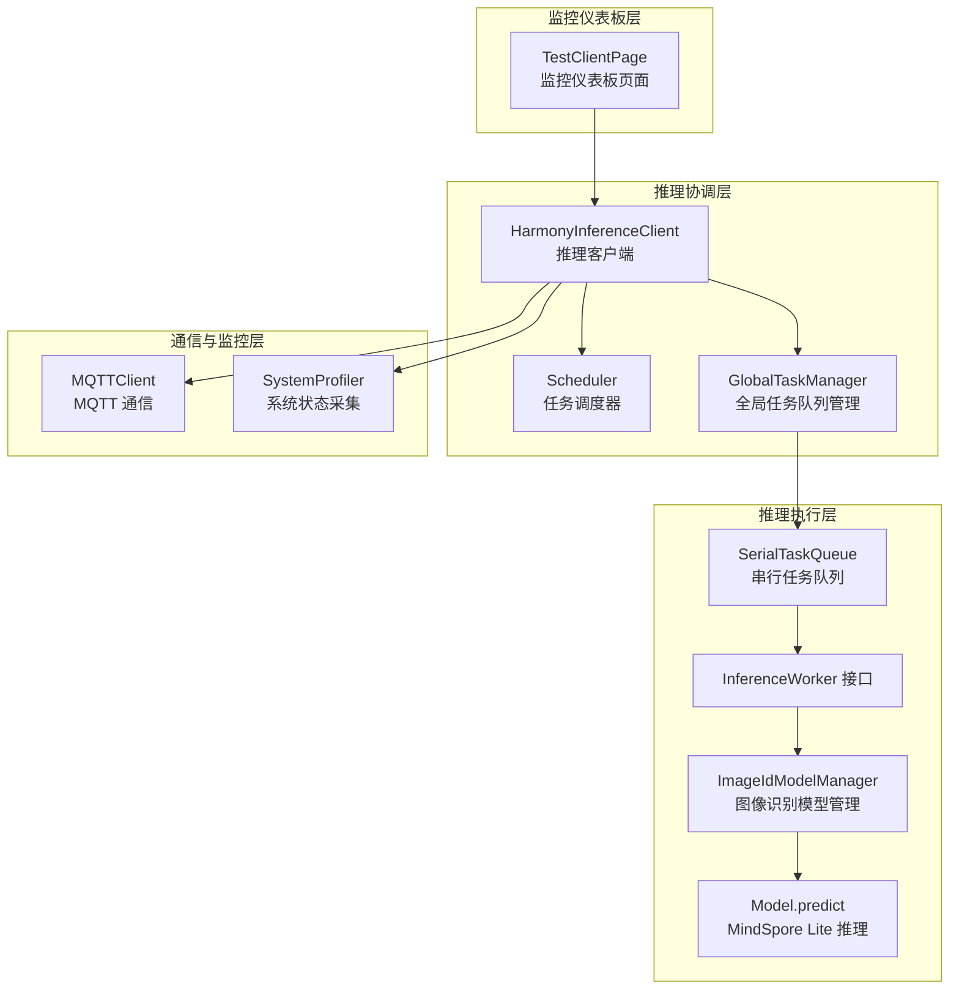
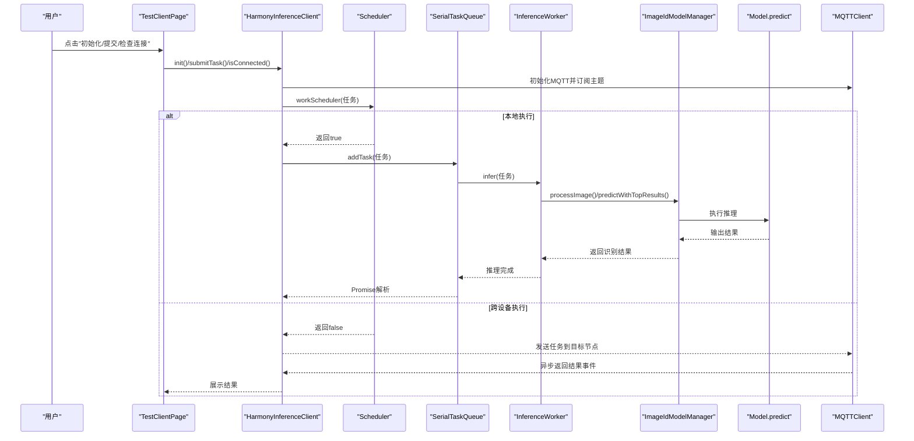
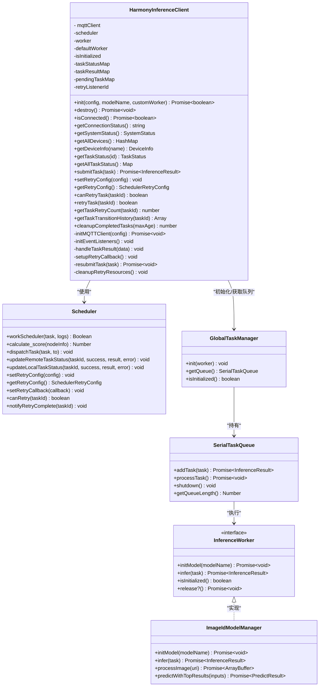
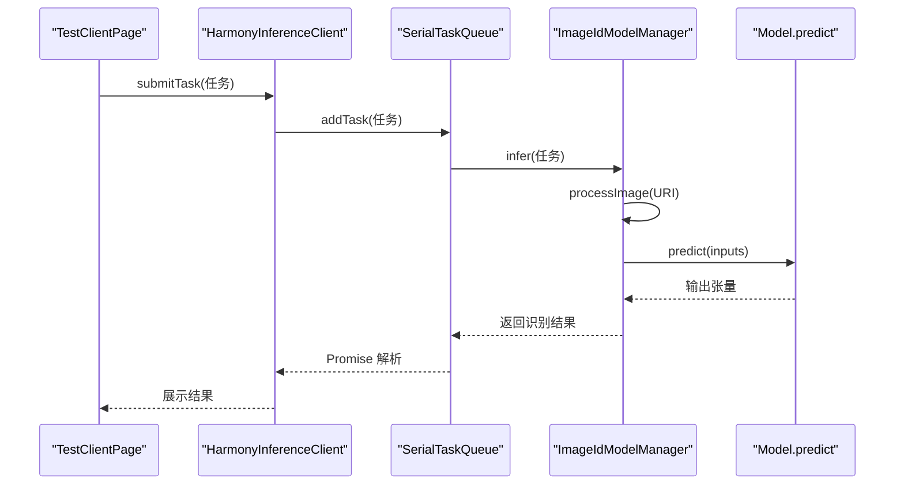
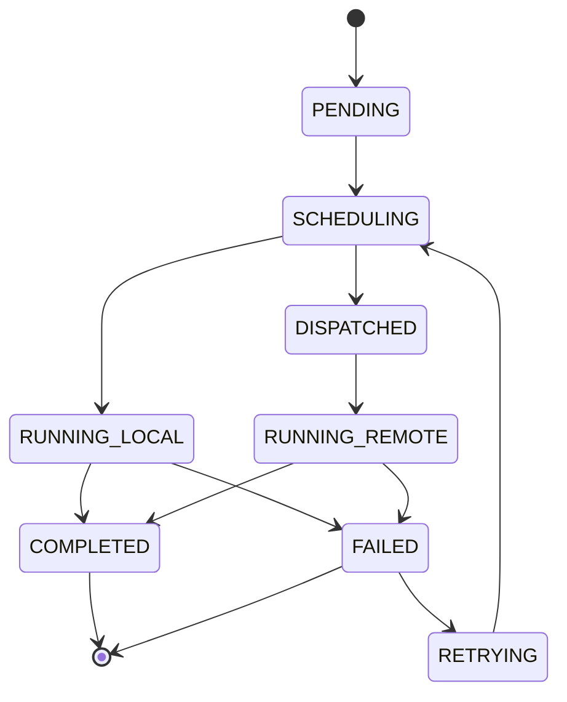
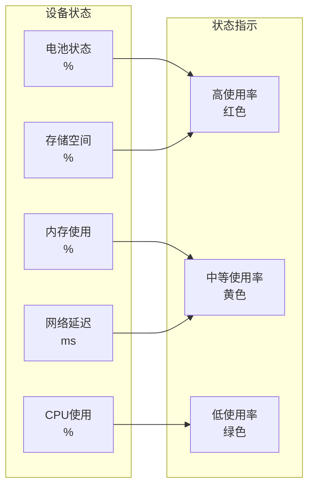
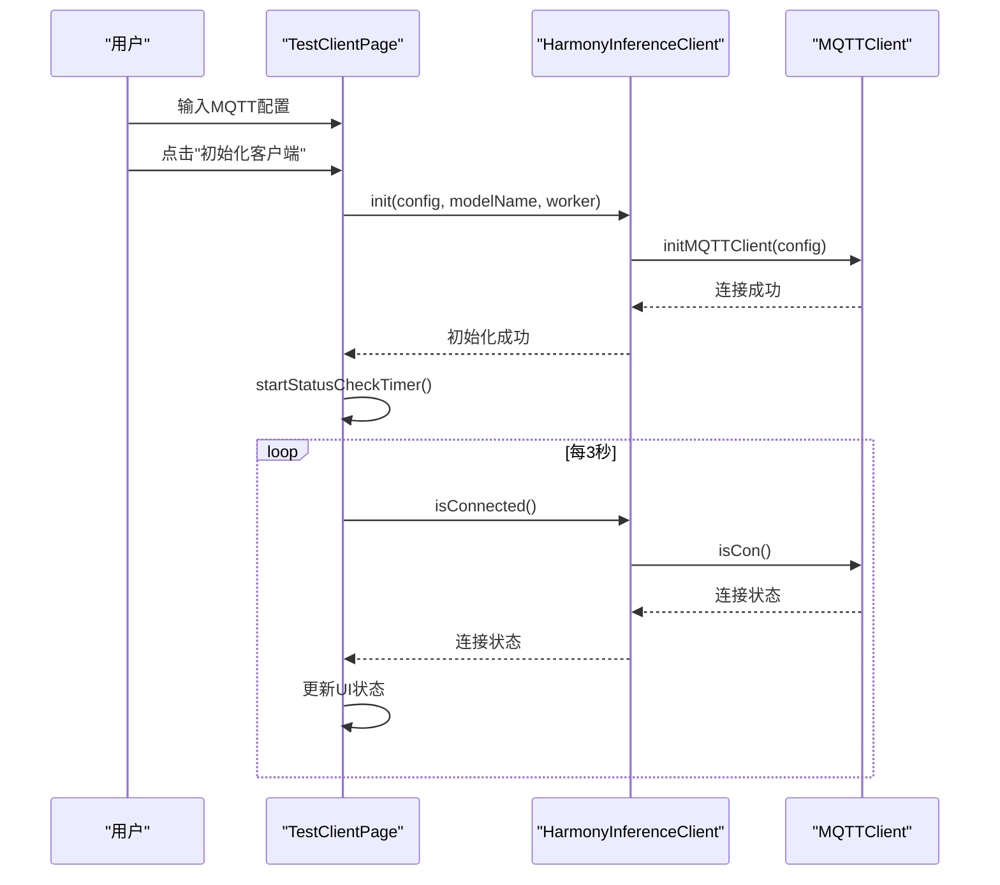
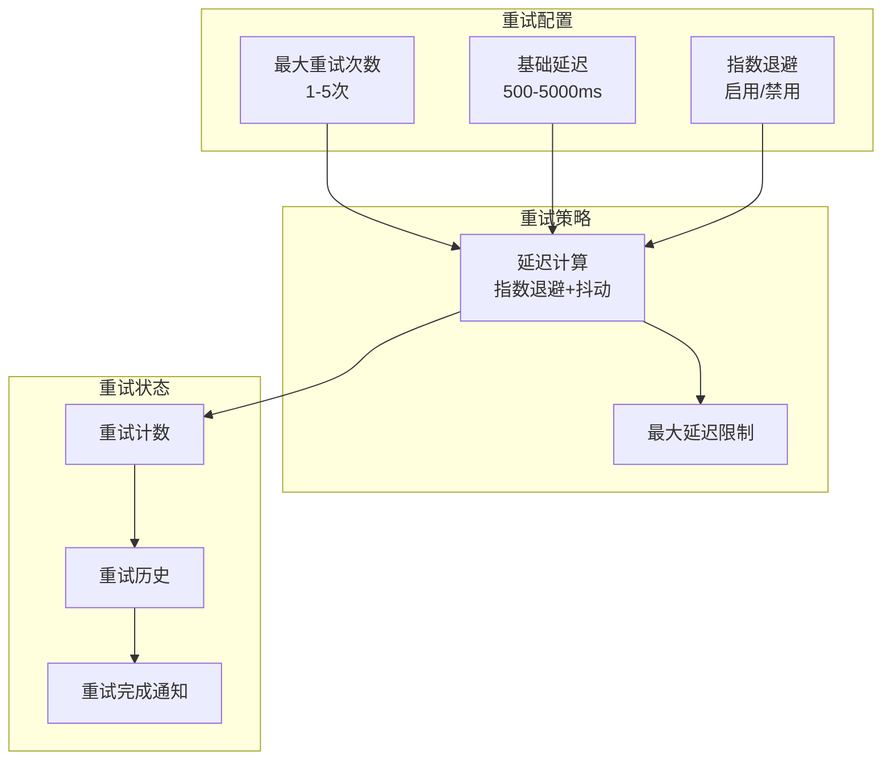
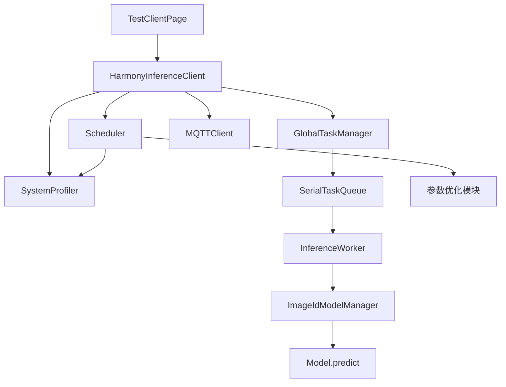

# 推理测试界面

<cite>
**本文引用的文件**
- [TestClientPage.ets](file://entry/src/main/ets/pages/TestClientPage.ets)
- [HarmonyInferenceClient.ets](file://entry/src/main/ets/manager/HarmonyInferenceClient.ets)
- [Scheduler.ets](file://entry/src/main/ets/manager/scheduler/Scheduler.ets)
- [SystemProfiler.ets](file://entry/src/main/ets/manager/monitor/SystemProfiler.ets)
- [MQTTClient.ets](file://entry/src/main/ets/manager/broker/MQTTClient.ets)
- [InferenceWorker.ets](file://entry/src/main/ets/manager/worker/InferenceWorker.ets)
- [ImageIdModelManager.ets](file://entry/src/main/ets/TestImageTask/ImageIdModelManager.ets)
- [GlobalTaskManager.ets](file://entry/src/main/ets/manager/worker/GlobalTaskManager.ets)
- [SerialTaskQueue.ets](file://entry/src/main/ets/manager/worker/SerialTaskQueue.ets)
</cite>

## 更新摘要
**变更内容**
- TestClientPage 组件经历了重大重构，从简单的测试界面升级为全面的监控仪表板
- 新增完整的日志系统（DEBUG/INFO/WARN/ERROR 等级），支持日志过滤、详情显示和自动滚动
- 新增任务监控面板，提供实时进度跟踪、状态可视化、历史记录和手动重试功能
- 新增系统状态卡片，展示设备指标（电池/内存/CPU/存储）和网络延迟
- 新增 MQTT 配置管理，支持动态配置和连接状态监控
- 新增重试机制配置，支持最大重试次数和基础延迟设置
- 新增任务状态监听器，实现实时状态更新和历史记录追踪
- 改进了资源管理，包括定时器清理和事件监听器移除

## 目录
1. [简介](#简介)
2. [项目结构](#项目结构)
3. [核心组件](#核心组件)
4. [架构总览](#架构总览)
5. [详细组件分析](#详细组件分析)
6. [监控仪表板功能](#监控仪表板功能)
7. [日志系统](#日志系统)
8. [任务监控系统](#任务监控系统)
9. [系统状态监控](#系统状态监控)
10. [MQTT 配置管理](#mqtt-配置管理)
11. [重试机制](#重试机制)
12. [依赖关系分析](#依赖关系分析)
13. [性能考虑](#性能考虑)
14. [故障排查指南](#故障排查指南)
15. [结论](#结论)
16. [附录](#附录)

## 简介
本文件面向推理测试界面的使用者与维护者，系统化梳理 TestClientPage 组件的重大重构，从简单的测试界面升级为全面的监控仪表板。涵盖以下方面：
- 推理任务的提交界面、图像选择与参数配置
- 实时任务监控面板、系统状态可视化与 MQTT 配置管理
- 完整的日志系统（DEBUG/INFO/WARN/ERROR 等级）
- 测试结果的展示方式、推理状态的实时更新与错误处理
- 测试用例管理、结果对比与性能评估能力
- 使用指南与调试技巧
- 针对易用性与测试数据有效性的改进建议

## 项目结构
推理测试界面经过重大重构，现在是一个全面的监控仪表板，围绕 TestClientPage 组件构建，提供 MQTT 连接管理、系统状态监控、任务调度监控和日志管理等功能。



**图表来源**
- [TestClientPage.ets:43-100](file://entry/src/main/ets/pages/TestClientPage.ets#L43-L100)
- [HarmonyInferenceClient.ets:45-80](file://entry/src/main/ets/manager/HarmonyInferenceClient.ets#L45-L80)
- [Scheduler.ets:150-217](file://entry/src/main/ets/manager/scheduler/Scheduler.ets#L150-L217)
- [SystemProfiler.ets:43-81](file://entry/src/main/ets/manager/monitor/SystemProfiler.ets#L43-L81)

**章节来源**
- [TestClientPage.ets:1-1371](file://entry/src/main/ets/pages/TestClientPage.ets#L1-L1371)
- [HarmonyInferenceClient.ets:1-644](file://entry/src/main/ets/manager/HarmonyInferenceClient.ets#L1-L644)

## 核心组件
- **TestClientPage**：监控仪表板入口，提供 MQTT 连接管理、系统状态监控、任务监控、日志管理和控制面板。
- **HarmonyInferenceClient**：推理客户端，统一管理 MQTT 连接、事件监听、任务提交与结果获取，支持重试机制配置。
- **Scheduler**：任务调度器，基于系统状态与权重参数选择最优执行节点，提供任务状态监控和重试机制。
- **GlobalTaskManager/SerialTaskQueue**：本地任务队列，串行执行推理任务。
- **ImageIdModelManager**：图像识别模型管理器，负责图像预处理与推理调用。
- **MQTTClient**：MQTT 通信客户端，负责订阅/发布与事件转发。
- **SystemProfiler**：系统状态采集器，提供设备 CPU、内存、电量、存储与网络延迟等信息。

**章节来源**
- [TestClientPage.ets:43-100](file://entry/src/main/ets/pages/TestClientPage.ets#L43-L100)
- [HarmonyInferenceClient.ets:45-80](file://entry/src/main/ets/manager/HarmonyInferenceClient.ets#L45-L80)
- [Scheduler.ets:150-217](file://entry/src/main/ets/manager/scheduler/Scheduler.ets#L150-L217)
- [SystemProfiler.ets:43-81](file://entry/src/main/ets/manager/monitor/SystemProfiler.ets#L43-L81)

## 架构总览
下图展示了从监控仪表板到推理执行的完整链路，包括本地执行与跨设备分发两种路径。



**图表来源**
- [TestClientPage.ets:982-1016](file://entry/src/main/ets/pages/TestClientPage.ets#L982-L1016)
- [HarmonyInferenceClient.ets:410-502](file://entry/src/main/ets/manager/HarmonyInferenceClient.ets#L410-L502)
- [Scheduler.ets:218-291](file://entry/src/main/ets/manager/scheduler/Scheduler.ets#L218-L291)

## 详细组件分析

### TestClientPage 组件设计与实现
**更新** TestClientPage 经历了重大重构，从简单的测试界面升级为全面的监控仪表板，包含以下核心功能：

- **角色定位**：监控仪表板入口，提供 MQTT 连接管理、系统状态监控、任务监控、日志管理和控制面板。
- **状态管理**：
  - MQTT 连接状态：连接成功/失败/断开
  - 系统状态：聚合所有设备信息并逐项展示
  - 任务监控：实时跟踪任务状态、进度和历史记录
  - 日志系统：结构化日志管理，支持等级过滤和详情显示
  - 重试配置：动态配置重试参数
- **交互流程**：
  - 初始化：传入 MQTT 配置、默认模型名与图像识别 Worker
  - 连接检查：轮询 MQTT 客户端连接状态
  - 系统状态：拉取系统状态并渲染设备列表
  - 任务监控：注册状态监听器，实时更新任务状态
  - 日志管理：结构化日志记录和过滤显示
  - 销毁：释放 MQTT 与 Worker 资源，重置状态

```mermaid
flowchart TD
Start(["仪表板启动"]) --> Init["点击"初始化客户端"]
Init --> InitOK{"初始化成功？"}
InitOK -- 否 --> LogFail["记录失败日志"]
InitOK -- 是 --> Ready["标记为已初始化"]
Ready --> ConnCheck["定时检查连接状态"]
ConnCheck --> SetConn["更新连接状态"]
Ready --> SysStat["定时获取系统状态"]
SysStat --> RenderSys["渲染设备列表"]
Ready --> TaskMonitor["注册任务状态监听器"]
TaskMonitor --> MonitorTasks["实时监控任务状态"]
Ready --> ControlPanel["控制面板交互"]
ControlPanel --> Submit["点击"提交测试任务]
Submit --> Valid{"已初始化？"}
Valid -- 否 --> LogNotInit["记录未初始化日志"] --> Wait
Valid -- 是 --> TrySubmit["提交任务并等待结果"]
TrySubmit --> ResultOK{"结果成功？"}
ResultOK -- 是 --> ShowRes["展示结果JSON"] --> LogOk["记录成功日志"] --> Wait
ResultOK -- 否 --> LogErr["记录错误日志"] --> Wait
Wait --> Destroy["点击"销毁客户端"]
Destroy --> Reset["重置状态并释放资源"] --> End(["结束"])
```

**图表来源**
- [TestClientPage.ets:90-139](file://entry/src/main/ets/pages/TestClientPage.ets#L90-L139)
- [TestClientPage.ets:165-218](file://entry/src/main/ets/pages/TestClientPage.ets#L165-L218)

**章节来源**
- [TestClientPage.ets:43-100](file://entry/src/main/ets/pages/TestClientPage.ets#L43-L100)
- [TestClientPage.ets:90-139](file://entry/src/main/ets/pages/TestClientPage.ets#L90-L139)

### HarmonyInferenceClient 协调器
**更新** HarmonyInferenceClient 增强了重试机制和任务监控功能：

- **职责**：
  - 初始化与销毁：建立 MQTT 连接、注册事件监听、初始化 Worker 与全局任务队列
  - 连接状态：定时轮询 MQTT 连接状态并更新
  - 任务提交：调度器决策本地/远程执行，本地走队列，远程等待结果事件
  - 系统状态：聚合自身与其它设备信息
  - 重试机制：支持动态配置重试参数，提供手动重试功能
- **关键点**：
  - 事件监听：根据主题分发到不同模块（设备状态、任务分配、参数优化、延迟测试）
  - 结果处理：通过事件机制接收结果并缓存，供远程任务等待解析
  - 超时控制：远程任务最长等待30秒，超时抛错
  - **资源管理**：增强的 destroy 方法确保所有关联资源得到正确释放
  - **重试支持**：提供重试配置设置、手动重试触发和重试完成通知



**图表来源**
- [HarmonyInferenceClient.ets:45-80](file://entry/src/main/ets/manager/HarmonyInferenceClient.ets#L45-L80)
- [HarmonyInferenceClient.ets:504-641](file://entry/src/main/ets/manager/HarmonyInferenceClient.ets#L504-L641)
- [Scheduler.ets:150-217](file://entry/src/main/ets/manager/scheduler/Scheduler.ets#L150-L217)

**章节来源**
- [HarmonyInferenceClient.ets:163-236](file://entry/src/main/ets/manager/HarmonyInferenceClient.ets#L163-L236)
- [HarmonyInferenceClient.ets:504-641](file://entry/src/main/ets/manager/HarmonyInferenceClient.ets#L504-L641)

### 推理执行链路（图像识别）
- **输入**：页面构造的 InferenceTask（类型为图像，包含默认图像 URI 与参数）
- **预处理**：ImageIdModelManager 对 PixelMap 进行缩放、裁剪与归一化
- **推理**：Model.predict 使用 MindSpore Lite 在 CPU 上执行
- **输出**：返回置信度数组与类别索引数组



**图表来源**
- [TestClientPage.ets:996-1016](file://entry/src/main/ets/pages/TestClientPage.ets#L996-L1016)
- [HarmonyInferenceClient.ets:428-454](file://entry/src/main/ets/manager/HarmonyInferenceClient.ets#L428-L454)

**章节来源**
- [ImageIdModelManager.ets:55-133](file://entry/src/main/ets/TestImageTask/ImageIdModelManager.ets#L55-L133)
- [ImageIdModelManager.ets:174-202](file://entry/src/main/ets/TestImageTask/ImageIdModelManager.ets#L174-L202)

## 监控仪表板功能

### 仪表板布局设计
TestClientPage 现在提供一个完整的监控仪表板，包含以下主要区域：

- **头部区域**：显示应用标题和描述
- **MQTT 连接状态卡片**：显示连接状态、配置输入和控制按钮
- **系统状态卡片**：展示设备列表和性能指标
- **任务监控面板**：实时跟踪任务状态、进度和历史记录
- **控制面板**：任务提交和重试配置
- **日志面板**：结构化日志管理和过滤


**图表来源**
- [TestClientPage.ets:323-350](file://entry/src/main/ets/pages/TestClientPage.ets#L323-L350)
- [TestClientPage.ets:370-474](file://entry/src/main/ets/pages/TestClientPage.ets#L370-L474)
- [TestClientPage.ets:476-510](file://entry/src/main/ets/pages/TestClientPage.ets#L476-L510)
- [TestClientPage.ets:701-773](file://entry/src/main/ets/pages/TestClientPage.ets#L701-L773)
- [TestClientPage.ets:971-1095](file://entry/src/main/ets/pages/TestClientPage.ets#L971-L1095)
- [TestClientPage.ets:1120-1241](file://entry/src/main/ets/pages/TestClientPage.ets#L1120-L1241)

**章节来源**
- [TestClientPage.ets:323-350](file://entry/src/main/ets/pages/TestClientPage.ets#L323-L350)
- [TestClientPage.ets:370-474](file://entry/src/main/ets/pages/TestClientPage.ets#L370-L474)
- [TestClientPage.ets:476-510](file://entry/src/main/ets/pages/TestClientPage.ets#L476-L510)
- [TestClientPage.ets:701-773](file://entry/src/main/ets/pages/TestClientPage.ets#L701-L773)
- [TestClientPage.ets:971-1095](file://entry/src/main/ets/pages/TestClientPage.ets#L971-L1095)
- [TestClientPage.ets:1120-1241](file://entry/src/main/ets/pages/TestClientPage.ets#L1120-L1241)

## 日志系统

### 结构化日志格式
**更新** TestClientPage 现在提供完整的结构化日志系统：

- **日志级别**：DEBUG/INFO/WARN/ERROR 四个级别
- **日志条目**：包含时间戳、级别、消息和可选详情
- **日志过滤**：支持按级别过滤显示
- **日志管理**：支持自动滚动、详情显示和清空功能
- **日志限制**：最多保留100条日志，防止内存泄漏

**日志格式规范**：
```
[时间戳] [级别] [消息] [详情]
```

### 日志系统特性
- **实时记录**：所有操作都有对应的日志记录
- **级别管理**：支持 DEBUG/INFO/WARN/ERROR 级别过滤
- **详情显示**：可选择显示详细信息
- **自动滚动**：新日志自动滚动到底部
- **容量控制**：自动清理超出限制的日志

### 日志使用指南
- **调试模式**：使用 DEBUG 级别查看详细信息
- **生产模式**：使用 INFO/WARN/ERROR 级别关注重要信息
- **错误排查**：查看 ERROR 级别日志定位问题
- **性能监控**：通过日志中的时间戳分析性能瓶颈

**章节来源**
- [TestClientPage.ets:11-25](file://entry/src/main/ets/pages/TestClientPage.ets#L11-L25)
- [TestClientPage.ets:1303-1358](file://entry/src/main/ets/pages/TestClientPage.ets#L1303-L1358)
- [TestClientPage.ets:1327-1342](file://entry/src/main/ets/pages/TestClientPage.ets#L1327-L1342)

## 任务监控系统

### 任务监控面板设计
**更新** TestClientPage 新增了完整的任务监控面板：

- **任务状态跟踪**：实时显示任务状态、进度和节点信息
- **任务历史记录**：显示任务状态流转历史
- **手动重试**：支持失败任务的手动重试
- **任务详情**：显示任务ID、重试次数、耗时等信息
- **批量操作**：支持清空任务记录

### 任务状态管理
- **状态枚举**：PENDING/SCHEDULING/DISPATCHED/RUNNING_LOCAL/RUNNING_REMOTE/COMPLETED/FAILED/CANCELLED/RETRYING
- **进度计算**：根据状态计算进度百分比
- **状态颜色**：不同状态对应不同颜色标识
- **状态描述**：提供人类可读的状态描述

### 任务历史追踪
- **流转记录**：记录任务状态变更的完整历史
- **时间戳**：每个状态变更都有精确的时间戳
- **节点信息**：显示任务执行的节点信息
- **状态消息**：记录状态变更的原因和说明



**图表来源**
- [Scheduler.ets:22-41](file://entry/src/main/ets/manager/scheduler/Scheduler.ets#L22-L41)
- [TestClientPage.ets:220-260](file://entry/src/main/ets/pages/TestClientPage.ets#L220-L260)

**章节来源**
- [TestClientPage.ets:27-40](file://entry/src/main/ets/pages/TestClientPage.ets#L27-L40)
- [TestClientPage.ets:165-218](file://entry/src/main/ets/pages/TestClientPage.ets#L165-L218)
- [TestClientPage.ets:701-773](file://entry/src/main/ets/pages/TestClientPage.ets#L701-L773)
- [TestClientPage.ets:900-969](file://entry/src/main/ets/pages/TestClientPage.ets#L900-L969)

## 系统状态监控

### 系统状态卡片设计
**更新** TestClientPage 新增了系统状态监控功能：

- **设备列表**：显示所有在线设备的状态
- **性能指标**：电池、内存、CPU、存储使用率
- **设备网格**：支持紧凑型和标准型设备卡片
- **本机标识**：标识当前设备为本机
- **实时更新**：定时更新系统状态

### 设备指标展示
- **电池状态**：显示电池剩余百分比
- **内存使用**：显示内存占用率
- **CPU 使用**：显示CPU占用率
- **存储空间**：显示存储剩余百分比
- **网络延迟**：显示网络延迟指标

### 状态可视化
- **颜色编码**：高使用率显示红色，中等使用率显示黄色，低使用率显示绿色
- **进度条**：直观显示各项指标的使用情况
- **网格布局**：支持多设备并排显示



**图表来源**
- [TestClientPage.ets:566-627](file://entry/src/main/ets/pages/TestClientPage.ets#L566-L627)
- [TestClientPage.ets:629-699](file://entry/src/main/ets/pages/TestClientPage.ets#L629-L699)
- [SystemProfiler.ets:10-33](file://entry/src/main/ets/manager/monitor/SystemProfiler.ets#L10-L33)

**章节来源**
- [TestClientPage.ets:476-510](file://entry/src/main/ets/pages/TestClientPage.ets#L476-L510)
- [TestClientPage.ets:566-627](file://entry/src/main/ets/pages/TestClientPage.ets#L566-L627)
- [TestClientPage.ets:629-699](file://entry/src/main/ets/pages/TestClientPage.ets#L629-L699)
- [SystemProfiler.ets:43-120](file://entry/src/main/ets/manager/monitor/SystemProfiler.ets#L43-L120)

## MQTT 配置管理

### MQTT 连接状态管理
**更新** TestClientPage 提供了完整的 MQTT 配置管理功能：

- **连接状态监控**：实时显示连接状态（已连接/未连接/连接异常）
- **动态配置**：支持服务器IP、端口、用户名、密码的动态配置
- **连接控制**：提供初始化和断开连接按钮
- **连接详情**：显示服务器地址和客户端ID
- **自动轮询**：定时检查连接状态

### MQTT 配置界面
- **输入表单**：支持服务器IP、端口、用户名、密码的输入
- **状态指示器**：圆形指示器显示连接状态
- **连接按钮**：根据状态显示不同的按钮文本
- **断开按钮**：仅在已初始化时显示

### 连接状态处理
- **定时检查**：每3秒检查一次连接状态
- **状态更新**：连接状态变化时自动更新UI
- **异常处理**：连接异常时显示错误状态
- **资源管理**：断开连接时清理定时器



**图表来源**
- [TestClientPage.ets:125-163](file://entry/src/main/ets/pages/TestClientPage.ets#L125-L163)
- [TestClientPage.ets:297-307](file://entry/src/main/ets/pages/TestClientPage.ets#L297-L307)
- [HarmonyInferenceClient.ets:83-114](file://entry/src/main/ets/manager/HarmonyInferenceClient.ets#L83-L114)

**章节来源**
- [TestClientPage.ets:370-474](file://entry/src/main/ets/pages/TestClientPage.ets#L370-L474)
- [TestClientPage.ets:125-163](file://entry/src/main/ets/pages/TestClientPage.ets#L125-L163)
- [HarmonyInferenceClient.ets:83-114](file://entry/src/main/ets/manager/HarmonyInferenceClient.ets#L83-L114)

## 重试机制

### 重试配置管理
**更新** TestClientPage 新增了完整的重试机制配置功能：

- **重试配置面板**：可切换显示/隐藏重试配置
- **最大重试次数**：支持1-5次的配置
- **基础延迟**：支持500-5000ms的配置
- **指数退避**：支持指数退避策略
- **手动重试**：支持失败任务的手动重试

### 重试策略
- **指数退避**：延迟时间按1.5倍递增
- **随机抖动**：延迟时间±20%的随机抖动
- **最大延迟**：支持最大延迟限制
- **重试次数**：支持配置最大重试次数

### 重试状态管理
- **重试计数**：跟踪当前重试次数
- **重试历史**：记录重试历史
- **重试完成**：通知重试完成
- **重试失败**：处理重试失败情况



**图表来源**
- [TestClientPage.ets:1018-1051](file://entry/src/main/ets/pages/TestClientPage.ets#L1018-L1051)
- [Scheduler.ets:821-837](file://entry/src/main/ets/manager/scheduler/Scheduler.ets#L821-L837)
- [HarmonyInferenceClient.ets:603-640](file://entry/src/main/ets/manager/HarmonyInferenceClient.ets#L603-L640)

**章节来源**
- [TestClientPage.ets:1018-1051](file://entry/src/main/ets/pages/TestClientPage.ets#L1018-L1051)
- [Scheduler.ets:753-781](file://entry/src/main/ets/manager/scheduler/Scheduler.ets#L753-L781)
- [HarmonyInferenceClient.ets:603-640](file://entry/src/main/ets/manager/HarmonyInferenceClient.ets#L603-L640)

## 依赖关系分析
**更新** TestClientPage 的依赖关系更加复杂，现在包含监控相关的多个模块：

- **组件耦合**：
  - TestClientPage 仅依赖 HarmonyInferenceClient 的公开 API，低耦合
  - HarmonyInferenceClient 内部依赖 Scheduler、GlobalTaskManager、MQTTClient、SystemProfiler
  - ImageIdModelManager 实现 InferenceWorker 接口，便于替换与扩展
  - Scheduler 依赖 SystemProfiler 和参数优化模块
- **外部依赖**：
  - MQTT 通信、系统信息采集、AI 推理框架（MindSpore Lite）
  - 性能分析工具（hidebug）
- **潜在风险**：
  - 远程任务等待依赖事件通道，若网络异常可能导致超时
  - 图像预处理依赖资源管理器与媒体库，需确保资源可用
  - 日志系统可能成为性能瓶颈，需要容量控制



**图表来源**
- [TestClientPage.ets:43-100](file://entry/src/main/ets/pages/TestClientPage.ets#L43-L100)
- [HarmonyInferenceClient.ets:45-80](file://entry/src/main/ets/manager/HarmonyInferenceClient.ets#L45-L80)
- [Scheduler.ets:150-217](file://entry/src/main/ets/manager/scheduler/Scheduler.ets#L150-L217)
- [SystemProfiler.ets:43-81](file://entry/src/main/ets/manager/monitor/SystemProfiler.ets#L43-L81)

**章节来源**
- [HarmonyInferenceClient.ets:163-236](file://entry/src/main/ets/manager/HarmonyInferenceClient.ets#L163-L236)
- [Scheduler.ets:150-217](file://entry/src/main/ets/manager/scheduler/Scheduler.ets#L150-L217)

## 性能考虑
**更新** TestClientPage 的性能考虑更加全面：

- **本地执行**：
  - 串行队列避免并发冲突，但吞吐受限；可通过调整线程数与批处理策略提升性能
  - 图像预处理与归一化为 CPU 密集型，建议在主线程外异步执行
  - 日志系统限制最大100条，防止内存泄漏
- **远程执行**：
  - 任务分发基于节点评分，评分权重可调；网络延迟与电量影响决策
  - 结果等待采用轮询，建议结合心跳与超时策略优化体验
  - 重试机制使用指数退避和抖动，避免雪崩效应
- **资源管理**：
  - 销毁阶段需释放 MQTT 与 Worker 资源，避免内存泄漏
  - 定时器清理：改进的资源管理确保定时器正确清理，防止内存泄漏
  - 事件监听器清理：确保所有监听器正确移除
  - 日志容量控制：防止 UI 卡顿
- **监控性能**：
  - 系统状态定时更新（3秒间隔）
  - 任务状态监听器实时更新
  - 日志自动滚动优化

## 故障排查指南
**更新** TestClientPage 提供了更完善的故障排查功能：

- **初始化失败**
  - 检查 MQTT 配置（URL、用户名、密码、主题、QoS）
  - 确认模型文件存在且可读
  - 查看日志输出定位错误
  - 验证网络连接和 Broker 可达性
- **连接不稳定**
  - 观察连接状态定时更新逻辑
  - 检查网络与 Broker 可达性
  - 查看 MQTT 日志信息
- **任务超时**
  - 远程任务默认30秒超时，检查事件通道是否正常
  - 确认目标节点在线并具备执行能力
  - 检查重试机制配置
- **图像处理异常**
  - 确认图像 URI 可访问
  - 检查预处理尺寸与格式
  - 验证模型文件完整性
- **结果为空或异常**
  - 核对模型输入形状与归一化参数
  - 查看推理日志与置信度阈值
  - 检查任务状态历史记录
- **资源泄漏**
  - 确保正确调用 destroy 方法
  - 检查定时器是否正确清理
  - 验证事件监听器是否被移除
  - 查看日志中的资源清理信息
- **监控功能异常**
  - 检查系统状态定时器是否正常运行
  - 验证任务状态监听器注册
  - 查看日志中的监控信息
- **日志问题**
  - 检查日志格式是否符合结构化规范
  - 确认日志级别设置是否正确
  - 验证日志输出是否包含必要的上下文信息
  - 查看日志容量限制和清理机制

**章节来源**
- [HarmonyInferenceClient.ets:198-225](file://entry/src/main/ets/manager/HarmonyInferenceClient.ets#L198-L225)
- [HarmonyInferenceClient.ets:504-584](file://entry/src/main/ets/manager/HarmonyInferenceClient.ets#L504-L584)
- [TestClientPage.ets:1303-1358](file://entry/src/main/ets/pages/TestClientPage.ets#L1303-L1358)

## 结论
TestClientPage 经历了重大重构，从简单的测试界面升级为全面的监控仪表板。现在提供：

**主要改进**：
- **监控仪表板**：提供 MQTT 连接管理、系统状态监控、任务监控和日志管理的完整界面
- **结构化日志系统**：实现了统一的 DEBUG/INFO/WARN/ERROR 级别日志格式
- **任务监控面板**：实时跟踪任务状态、进度和历史记录，支持手动重试
- **系统状态可视化**：直观展示设备指标和性能数据
- **MQTT 配置管理**：支持动态配置和连接状态监控
- **重试机制**：支持动态配置和手动重试功能
- **错误处理**：增强了错误处理机制，提供了更详细的错误信息和调试支持
- **资源管理**：改进了资源清理机制，确保定时器和事件监听器正确释放

**建议后续增强**：
- 更丰富的测试用例管理与结果对比工具
- 性能评估指标（耗时、吞吐、资源占用）的统计与展示
- 更完善的错误提示与重试机制
- 任务模板和批量执行功能
- 系统状态趋势分析和告警功能

## 附录

### 使用指南
**更新** TestClientPage 的使用指南：

- **初始化客户端**
  - 填写 MQTT 配置并点击"初始化客户端"
  - 确认连接状态变为"已连接"
  - 查看系统状态卡片显示设备列表
- **提交测试任务**
  - 确保已初始化
  - 点击"提交测试任务"，查看结果与日志
  - 查看任务监控面板显示任务状态
- **监控系统状态**
  - 查看系统状态卡片显示设备列表与指标
  - 观察设备状态的实时更新
- **管理日志**
  - 使用日志级别过滤器查看不同级别的日志
  - 启用详情显示查看更多信息
  - 使用自动滚动功能跟踪最新日志
- **配置重试机制**
  - 点击"重试配置"开关显示配置面板
  - 调整最大重试次数和基础延迟
  - 查看重试配置的实时生效

**章节来源**
- [TestClientPage.ets:370-474](file://entry/src/main/ets/pages/TestClientPage.ets#L370-L474)
- [TestClientPage.ets:982-1016](file://entry/src/main/ets/pages/TestClientPage.ets#L982-L1016)
- [TestClientPage.ets:1120-1241](file://entry/src/main/ets/pages/TestClientPage.ets#L1120-L1241)
- [TestClientPage.ets:1018-1051](file://entry/src/main/ets/pages/TestClientPage.ets#L1018-L1051)

### 调试技巧
**更新** TestClientPage 的调试技巧：

- **启用详细日志**：使用 DEBUG 级别查看详细信息
- **分段验证**：分别测试初始化、连接检查、系统状态与任务提交
- **网络诊断**：确认 Broker 地址与主题订阅情况
- **资源检查**：确保模型文件与图像资源可用
- **错误处理**：利用改进的错误处理机制进行故障定位
- **资源清理**：确保正确调用 destroy 方法进行资源清理
- **监控验证**：验证系统状态定时更新和任务状态监听器
- **日志分析**：利用结构化日志格式快速定位问题
- **性能监控**：通过日志中的时间戳和状态信息分析性能瓶颈
- **重试测试**：验证重试机制的配置和手动重试功能

**章节来源**
- [TestClientPage.ets:1303-1358](file://entry/src/main/ets/pages/TestClientPage.ets#L1303-L1358)
- [HarmonyInferenceClient.ets:83-114](file://entry/src/main/ets/manager/HarmonyInferenceClient.ets#L83-L114)
- [HarmonyInferenceClient.ets:504-584](file://entry/src/main/ets/manager/HarmonyInferenceClient.ets#L504-L584)