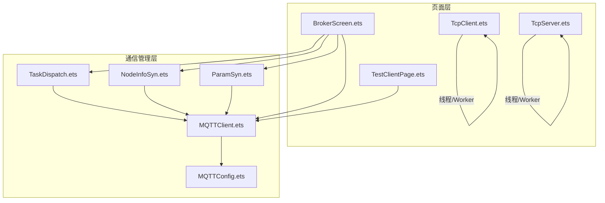
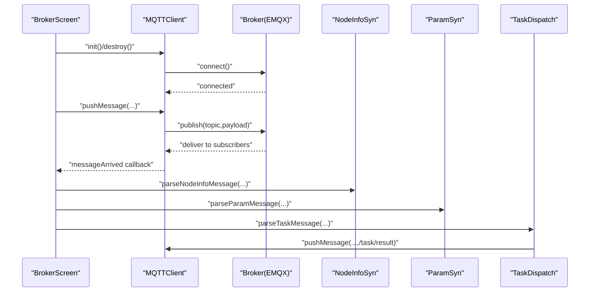
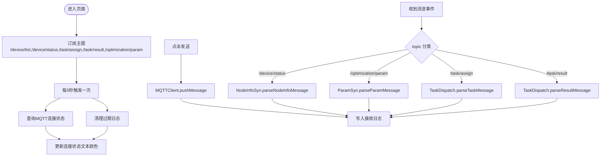
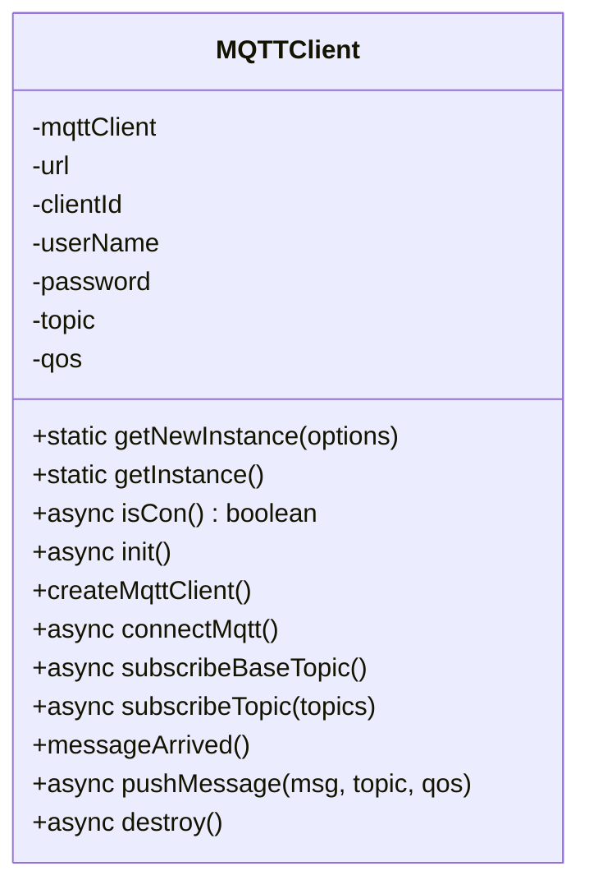
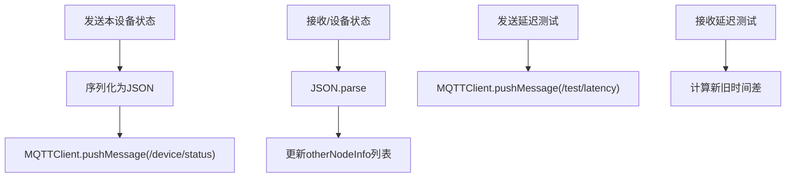
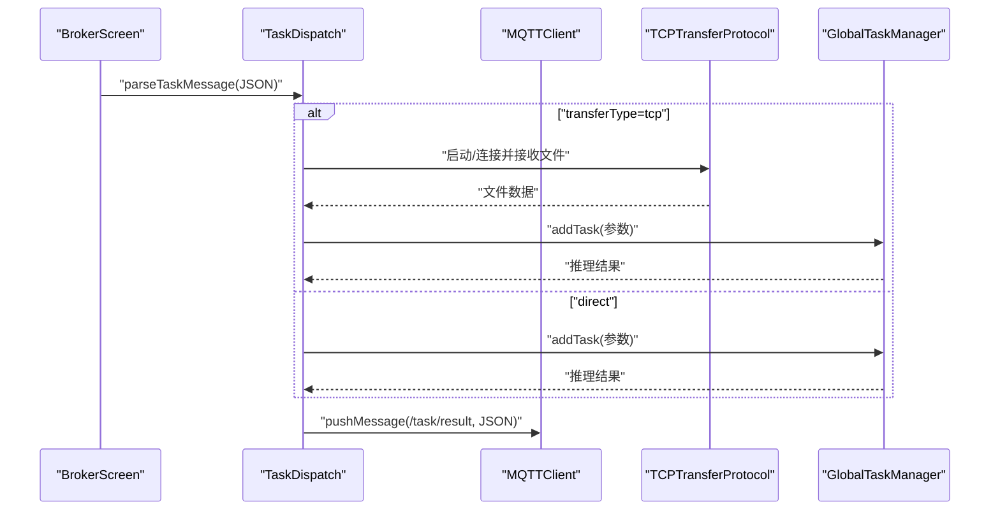
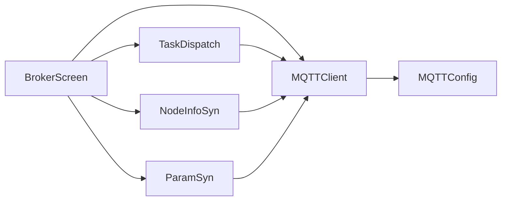

# 通信调试界面

<cite>
**本文引用的文件**
- [BrokerScreen.ets](file://entry/src/main/ets/pages/tabs/BrokerScreen.ets)
- [MQTTClient.ets](file://entry/src/main/ets/manager/broker/MQTTClient.ets)
- [MQTTConfig.ets](file://entry/src/main/ets/manager/broker/MQTTConfig.ets)
- [NodeInfoSyn.ets](file://entry/src/main/ets/manager/broker/monitor/NodeInfoSyn.ets)
- [ParamSyn.ets](file://entry/src/main/ets/manager/broker/paramOpt/ParamSyn.ets)
- [TaskDispatch.ets](file://entry/src/main/ets/manager/broker/task/TaskDispatch.ets)
- [TestClientPage.ets](file://entry/src/main/ets/pages/TestClientPage.ets)
- [TcpClient.ets](file://entry/src/main/ets/manager/broker/socket/TcpClient.ets)
- [TcpServer.ets](file://entry/src/main/ets/manager/broker/socket/TcpServer.ets)
</cite>

## 目录
1. [简介](#简介)
2. [项目结构](#项目结构)
3. [核心组件](#核心组件)
4. [架构总览](#架构总览)
5. [组件详解](#组件详解)
6. [依赖关系分析](#依赖关系分析)
7. [性能与实时性](#性能与实时性)
8. [故障排查指南](#故障排查指南)
9. [结论](#结论)
10. [附录](#附录)

## 简介
本文件面向通信调试界面的使用者与开发者，聚焦 BrokerScreen 组件及其配套的 MQTT 通信能力，涵盖消息发送与接收、设备状态监控、连接状态指示、错误诊断、消息格式验证、网络延迟测量与连接质量评估，并提供最佳实践与常见问题解决方案，帮助提升调试界面的实时性与通信数据可视化效果。

## 项目结构
该工程采用按功能域划分的目录组织方式，通信调试界面位于页面层，核心通信能力封装在 manager/broker 下，包括 MQTT 客户端、主题订阅、消息解析与任务分发等模块；同时提供 TCP 通信示例页面，便于对比与扩展。

图示来源
- [BrokerScreen.ets](file://entry/src/main/ets/pages/tabs/BrokerScreen.ets#L1-L162)
- [MQTTClient.ets](file://entry/src/main/ets/manager/broker/MQTTClient.ets#L1-L223)
- [MQTTConfig.ets](file://entry/src/main/ets/manager/broker/MQTTConfig.ets#L1-L7)
- [NodeInfoSyn.ets](file://entry/src/main/ets/manager/broker/monitor/NodeInfoSyn.ets#L1-L173)
- [ParamSyn.ets](file://entry/src/main/ets/manager/broker/paramOpt/ParamSyn.ets#L1-L40)
- [TaskDispatch.ets](file://entry/src/main/ets/manager/broker/task/TaskDispatch.ets#L1-L302)
- [TcpClient.ets](file://entry/src/main/ets/manager/broker/socket/TcpClient.ets#L1-L246)
- [TcpServer.ets](file://entry/src/main/ets/manager/broker/socket/TcpServer.ets#L1-L287)
- [TestClientPage.ets](file://entry/src/main/ets/pages/TestClientPage.ets#L1-L151)

章节来源
- [BrokerScreen.ets](file://entry/src/main/ets/pages/tabs/BrokerScreen.ets#L1-L162)
- [MQTTClient.ets](file://entry/src/main/ets/manager/broker/MQTTClient.ets#L1-L223)
- [MQTTConfig.ets](file://entry/src/main/ets/manager/broker/MQTTConfig.ets#L1-L7)
- [NodeInfoSyn.ets](file://entry/src/main/ets/manager/broker/monitor/NodeInfoSyn.ets#L1-L173)
- [ParamSyn.ets](file://entry/src/main/ets/manager/broker/paramOpt/ParamSyn.ets#L1-L40)
- [TaskDispatch.ets](file://entry/src/main/ets/manager/broker/task/TaskDispatch.ets#L1-L302)
- [TcpClient.ets](file://entry/src/main/ets/manager/broker/socket/TcpClient.ets#L1-L246)
- [TcpServer.ets](file://entry/src/main/ets/manager/broker/socket/TcpServer.ets#L1-L287)
- [TestClientPage.ets](file://entry/src/main/ets/pages/TestClientPage.ets#L1-L151)

## 核心组件
- BrokerScreen：调试界面入口，负责连接状态展示、消息发送与接收日志展示、定时刷新与订阅主题。
- MQTTClient：MQTT 客户端封装，提供连接、订阅、发布、销毁与连接状态查询。
- MQTTConfig：MQTT 客户端配置，如 clientId 等。
- NodeInfoSyn：节点信息同步与网络延迟测试，解析设备状态消息、维护设备列表、计算延迟。
- ParamSyn：参数消息解析与保存，提供参数读取接口。
- TaskDispatch：任务分发与结果回传，支持小文件直接传输与大文件 TCP 传输两种模式。
- TcpClient/TcpServer：TCP 通信示例页面，演示 Worker 线程与消息收发流程，可作为对比参考。

章节来源
- [BrokerScreen.ets](file://entry/src/main/ets/pages/tabs/BrokerScreen.ets#L1-L162)
- [MQTTClient.ets](file://entry/src/main/ets/manager/broker/MQTTClient.ets#L1-L223)
- [MQTTConfig.ets](file://entry/src/main/ets/manager/broker/MQTTConfig.ets#L1-L7)
- [NodeInfoSyn.ets](file://entry/src/main/ets/manager/broker/monitor/NodeInfoSyn.ets#L1-L173)
- [ParamSyn.ets](file://entry/src/main/ets/manager/broker/paramOpt/ParamSyn.ets#L1-L40)
- [TaskDispatch.ets](file://entry/src/main/ets/manager/broker/task/TaskDispatch.ets#L1-L302)
- [TcpClient.ets](file://entry/src/main/ets/manager/broker/socket/TcpClient.ets#L1-L246)
- [TcpServer.ets](file://entry/src/main/ets/manager/broker/socket/TcpServer.ets#L1-L287)

## 架构总览
下图展示了 BrokerScreen 与 MQTT 通信栈、主题订阅、消息解析与任务分发的整体交互关系。

图示来源
- [BrokerScreen.ets](file://entry/src/main/ets/pages/tabs/BrokerScreen.ets#L30-L56)
- [MQTTClient.ets](file://entry/src/main/ets/manager/broker/MQTTClient.ets#L68-L123)
- [NodeInfoSyn.ets](file://entry/src/main/ets/manager/broker/monitor/NodeInfoSyn.ets#L100-L125)
- [ParamSyn.ets](file://entry/src/main/ets/manager/broker/paramOpt/ParamSyn.ets#L25-L29)
- [TaskDispatch.ets](file://entry/src/main/ets/manager/broker/task/TaskDispatch.ets#L187-L212)

## 组件详解

### BrokerScreen 组件
- 功能概述
  - 提供 Broker URL 输入、连接/断开控制、连接状态指示。
  - 支持手动发送消息与接收消息日志展示。
  - 定时检查连接状态并清理过期日志。
  - 订阅多个主题，通过事件总线转发到具体解析器。
- 关键行为
  - 生命周期钩子中启动定时器与订阅主题。
  - 事件监听器解析消息并分派到 NodeInfoSyn、ParamSyn、TaskDispatch。
  - 连接状态通过异步查询 MQTTClient 的连接状态更新。
  - 发送消息调用 MQTTClient 的 pushMessage。
- UI 特性
  - 使用滚动容器与胶囊按钮，适配移动端布局。
  - 接收日志区域限制最大行数，避免过度渲染。

图示来源
- [BrokerScreen.ets](file://entry/src/main/ets/pages/tabs/BrokerScreen.ets#L30-L56)
- [BrokerScreen.ets](file://entry/src/main/ets/pages/tabs/BrokerScreen.ets#L119-L130)
- [BrokerScreen.ets](file://entry/src/main/ets/pages/tabs/BrokerScreen.ets#L112-L117)

章节来源
- [BrokerScreen.ets](file://entry/src/main/ets/pages/tabs/BrokerScreen.ets#L1-L162)

### MQTTClient 组件
- 设计要点
  - 单例模式，统一管理 MQTT 客户端生命周期。
  - 支持基础连接、订阅、发布、销毁与连接状态查询。
  - 内置基础主题订阅与通用消息到达回调，通过事件总线分发到 UI。
- 关键流程
  - 初始化：创建客户端 → 连接 → 订阅基础主题 → 订阅所需主题 → 注册消息到达回调。
  - 发布：构造 publish 请求并处理结果。
  - 销毁：释放资源并移除事件监听。

图示来源
- [MQTTClient.ets](file://entry/src/main/ets/manager/broker/MQTTClient.ets#L24-L220)

章节来源
- [MQTTClient.ets](file://entry/src/main/ets/manager/broker/MQTTClient.ets#L1-L223)

### MQTTConfig 配置
- 作用：为 MQTT 客户端提供默认配置，如 clientId 来源于设备信息。
- 影响：确保每个设备拥有唯一的客户端标识，避免冲突。

章节来源
- [MQTTConfig.ets](file://entry/src/main/ets/manager/broker/MQTTConfig.ets#L1-L7)

### NodeInfoSyn 设备状态与延迟测试
- 功能
  - 解析设备状态消息，维护其他设备信息列表。
  - 发送本设备状态到 /device/status。
  - 发送/接收延迟测试消息，计算往返时延。
- 数据模型
  - 设备信息对象包含设备名、CPU/内存/存储/电量/延迟等指标。
  - 延迟测试消息包含设备名与时间戳。

图示来源
- [NodeInfoSyn.ets](file://entry/src/main/ets/manager/broker/monitor/NodeInfoSyn.ets#L63-L80)
- [NodeInfoSyn.ets](file://entry/src/main/ets/manager/broker/monitor/NodeInfoSyn.ets#L100-L125)
- [NodeInfoSyn.ets](file://entry/src/main/ets/manager/broker/monitor/NodeInfoSyn.ets#L131-L142)
- [NodeInfoSyn.ets](file://entry/src/main/ets/manager/broker/monitor/NodeInfoSyn.ets#L150-L170)

章节来源
- [NodeInfoSyn.ets](file://entry/src/main/ets/manager/broker/monitor/NodeInfoSyn.ets#L1-L173)

### ParamSyn 参数同步
- 功能：解析优化参数消息，保存并提供读取接口。
- 用途：在调试界面中展示或联动参数变化。

章节来源
- [ParamSyn.ets](file://entry/src/main/ets/manager/broker/paramOpt/ParamSyn.ets#L1-L40)

### TaskDispatch 任务分发与结果回传
- 功能
  - 小文件：直接通过 MQTT 发布任务消息。
  - 大文件：启动 TCP 传输协议，通过 MQTT 通知目标设备发起 TCP 连接。
  - 解析任务消息，本地执行推理，回传结果。
- 关键点
  - 估算数据大小，超过阈值走 TCP。
  - 通过事件总线区分任务结果与普通消息。

图示来源
- [TaskDispatch.ets](file://entry/src/main/ets/manager/broker/task/TaskDispatch.ets#L107-L126)
- [TaskDispatch.ets](file://entry/src/main/ets/manager/broker/task/TaskDispatch.ets#L133-L165)
- [TaskDispatch.ets](file://entry/src/main/ets/manager/broker/task/TaskDispatch.ets#L187-L212)
- [TaskDispatch.ets](file://entry/src/main/ets/manager/broker/task/TaskDispatch.ets#L272-L281)

章节来源
- [TaskDispatch.ets](file://entry/src/main/ets/manager/broker/task/TaskDispatch.ets#L1-L302)

### TCP 通信示例（对比参考）
- TcpClient：通过 Worker 线程与服务端通信，展示消息收发与连接状态。
- TcpServer：启动服务端监听，处理客户端连接与消息转发。
- 价值：为 MQTT 调试提供 TCP 通道的对照实现，便于理解线程与事件模型。

章节来源
- [TcpClient.ets](file://entry/src/main/ets/manager/broker/socket/TcpClient.ets#L1-L246)
- [TcpServer.ets](file://entry/src/main/ets/manager/broker/socket/TcpServer.ets#L1-L287)

## 依赖关系分析
- 组件耦合
  - BrokerScreen 依赖 MQTTClient、NodeInfoSyn、ParamSyn、TaskDispatch。
  - MQTTClient 依赖 MQTTConfig 并通过事件总线向外分发消息。
  - TaskDispatch 依赖 MQTTClient、网络工具与文件工具，实现 TCP 传输。
- 可能的循环依赖
  - 未发现直接循环依赖；事件总线单向分发，避免了环路。
- 外部依赖
  - @ohos/mqtt 提供 MQTT 异步客户端能力。
  - @ohos.events.emitter 提供跨组件事件分发。
  - @ohos.deviceInfo、@ohos.wifiManager 等系统能力。

图示来源
- [BrokerScreen.ets](file://entry/src/main/ets/pages/tabs/BrokerScreen.ets#L1-L162)
- [MQTTClient.ets](file://entry/src/main/ets/manager/broker/MQTTClient.ets#L1-L223)
- [MQTTConfig.ets](file://entry/src/main/ets/manager/broker/MQTTConfig.ets#L1-L7)
- [NodeInfoSyn.ets](file://entry/src/main/ets/manager/broker/monitor/NodeInfoSyn.ets#L1-L173)
- [ParamSyn.ets](file://entry/src/main/ets/manager/broker/paramOpt/ParamSyn.ets#L1-L40)
- [TaskDispatch.ets](file://entry/src/main/ets/manager/broker/task/TaskDispatch.ets#L1-L302)

## 性能与实时性
- 实时性保障
  - BrokerScreen 使用定时器周期性检查连接状态与清理日志，确保 UI 与状态一致。
  - MQTTClient 在消息到达时立即通过事件总线分发，降低端到端延迟。
- 渲染优化
  - 接收日志区域限制最大行数，避免长列表导致的卡顿。
  - 使用滚动容器与胶囊按钮，提升移动端交互体验。
- 传输策略
  - 小文件直接 MQTT 传输，低延迟高吞吐。
  - 大文件走 TCP 传输，避免 MQTT 负载过大。
- 建议
  - 对高频日志进行去重与采样。
  - 对任务结果与普通消息使用不同主题，减少解析负担。
  - 在 UI 层引入虚拟列表或分页加载，进一步优化大数据量展示。

[本节为通用建议，无需列出章节来源]

## 故障排查指南
- 连接失败
  - 检查 Broker URL 与网络连通性。
  - 查看 MQTTClient 的连接回调与错误日志。
  - 确认用户名/密码与服务器鉴权配置。
- 订阅不到消息
  - 确认已订阅目标主题。
  - 检查消息到达回调是否注册。
  - 核对主题命名与权限。
- 发送失败
  - 确认 MQTTClient 已初始化且处于连接状态。
  - 检查 QoS 与负载格式。
- 设备状态不更新
  - 确认 /device/status 主题消息格式正确。
  - 检查 NodeInfoSyn 的解析逻辑与过滤条件。
- 延迟测试异常
  - 确认 /test/latency 主题消息包含设备名与时间戳。
  - 检查系统时间戳获取与单位换算。
- 任务结果未回传
  - 确认 /task/result 主题发布成功。
  - 检查 TaskDispatch 的结果解析与过滤逻辑。

章节来源
- [BrokerScreen.ets](file://entry/src/main/ets/pages/tabs/BrokerScreen.ets#L57-L69)
- [MQTTClient.ets](file://entry/src/main/ets/manager/broker/MQTTClient.ets#L84-L104)
- [NodeInfoSyn.ets](file://entry/src/main/ets/manager/broker/monitor/NodeInfoSyn.ets#L150-L170)
- [TaskDispatch.ets](file://entry/src/main/ets/manager/broker/task/TaskDispatch.ets#L288-L298)

## 结论
BrokerScreen 与 MQTT 通信栈提供了完整的调试界面能力：连接管理、消息收发、设备状态监控、参数同步与任务分发。通过事件总线解耦与主题分类，系统具备良好的可扩展性。结合 TCP 示例与性能优化建议，可在复杂网络环境下实现稳定高效的通信调试体验。

[本节为总结性内容，无需列出章节来源]

## 附录

### 消息格式与主题约定
- 设备状态消息
  - 主题：/device/status
  - 字段：deviceName、params(cpuUsage/mem/storage/battery/latency)
- 参数优化消息
  - 主题：/optimization/param
  - 字段：param[]
- 任务分配消息
  - 主题：/task/assign
  - 字段：taskId、fromClient、toClient、timestamp、params、transferType、sourceIp、fileHash
- 任务结果消息
  - 主题：/task/result
  - 字段：taskId、fromClient、toClient、timestamp、params
- 延迟测试消息
  - 主题：/test/latency
  - 字段：deviceName、timeStamp

章节来源
- [NodeInfoSyn.ets](file://entry/src/main/ets/manager/broker/monitor/NodeInfoSyn.ets#L82-L98)
- [ParamSyn.ets](file://entry/src/main/ets/manager/broker/paramOpt/ParamSyn.ets#L5-L7)
- [TaskDispatch.ets](file://entry/src/main/ets/manager/broker/task/TaskDispatch.ets#L16-L57)
- [TaskDispatch.ets](file://entry/src/main/ets/manager/broker/task/TaskDispatch.ets#L63-L92)
- [NodeInfoSyn.ets](file://entry/src/main/ets/manager/broker/monitor/NodeInfoSyn.ets#L128-L142)

### 最佳实践
- 使用独立主题承载不同类型消息，便于 UI 分区展示与解析分流。
- 对高频消息进行采样与去重，降低 UI 渲染压力。
- 将任务结果与普通消息通过事件 ID 区分，避免误判。
- 在 UI 层增加“清空日志”、“复制日志”等辅助操作，提升调试效率。
- 对网络异常与重连场景进行明确提示，增强可观测性。

[本节为通用建议，无需列出章节来源]