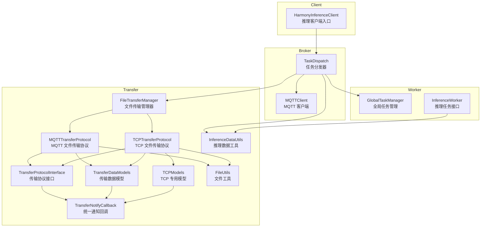
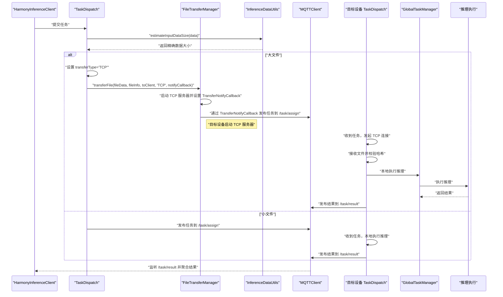
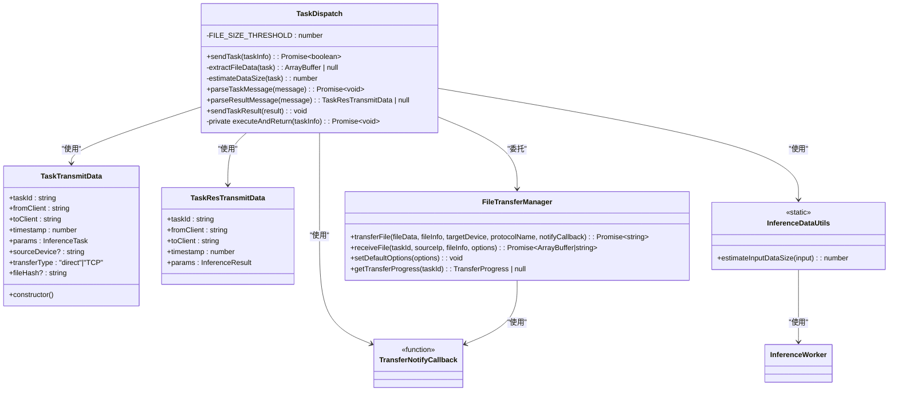
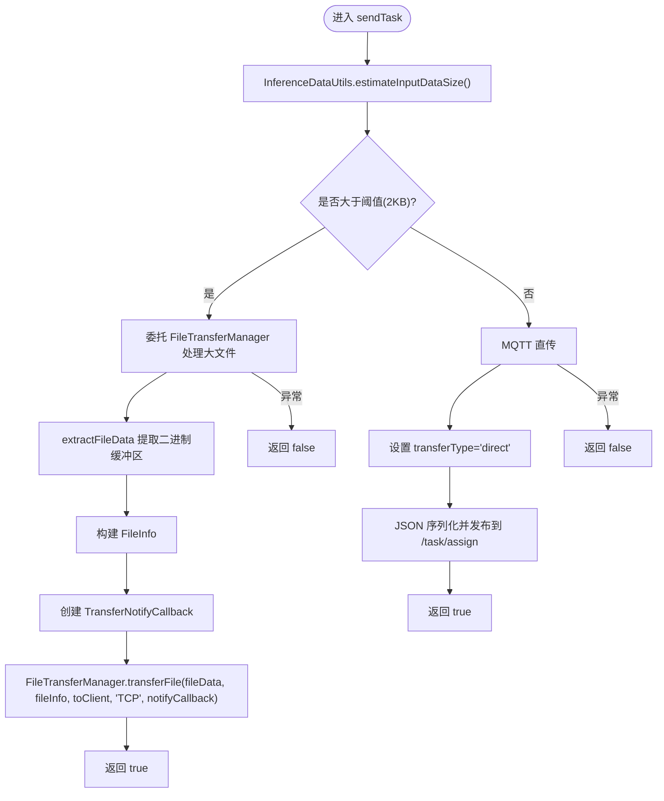
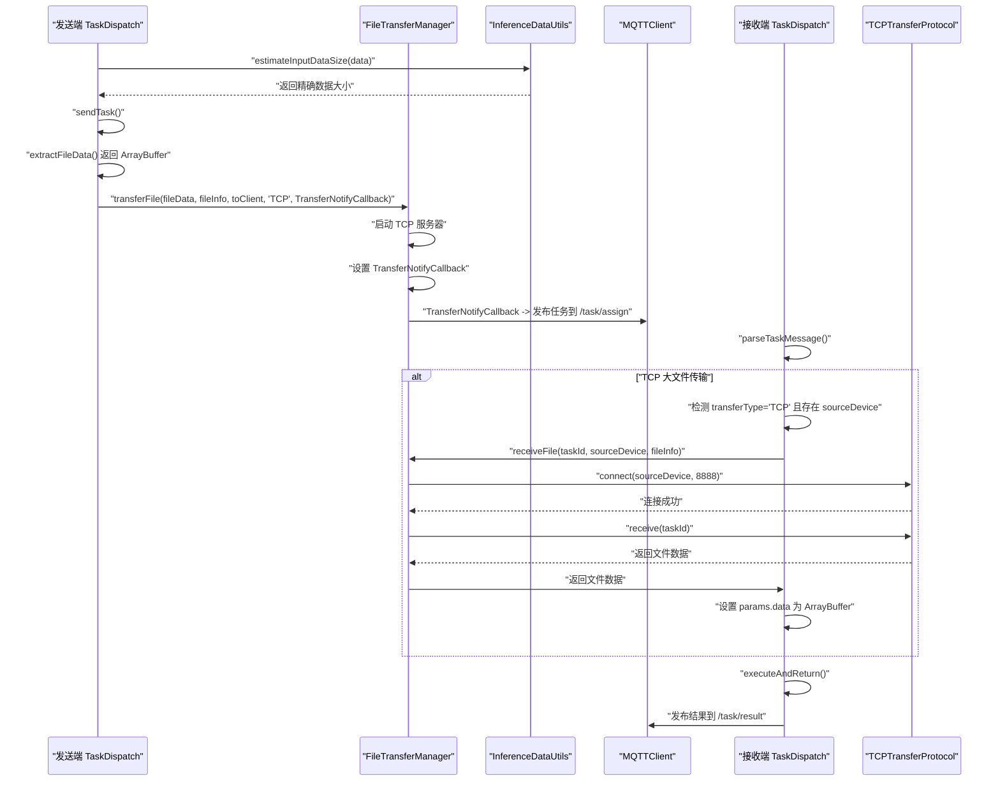
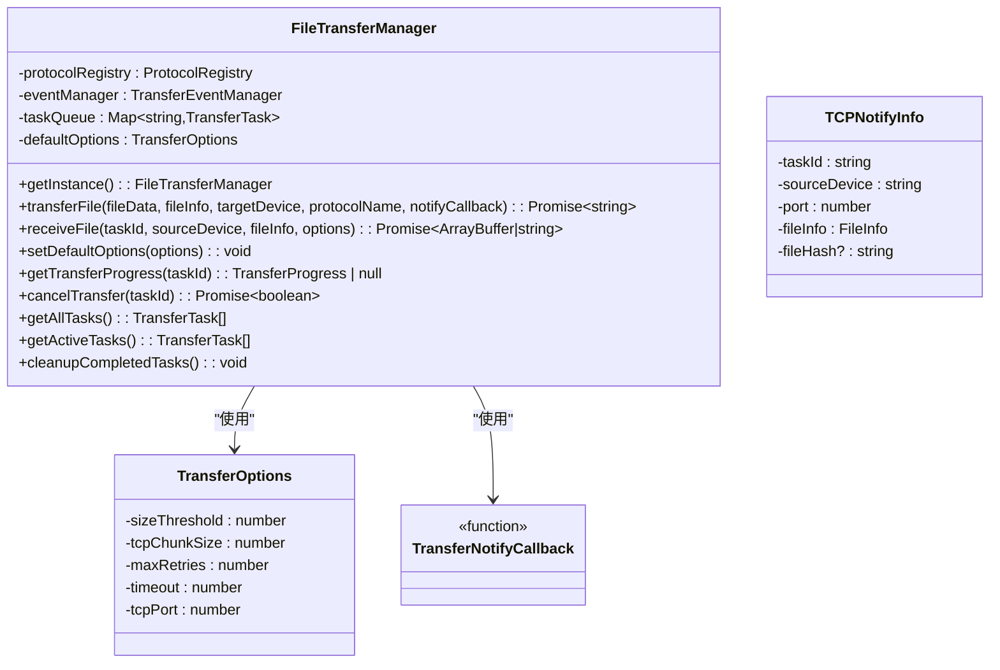
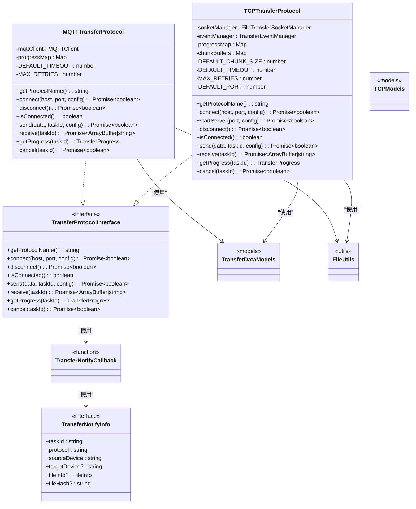
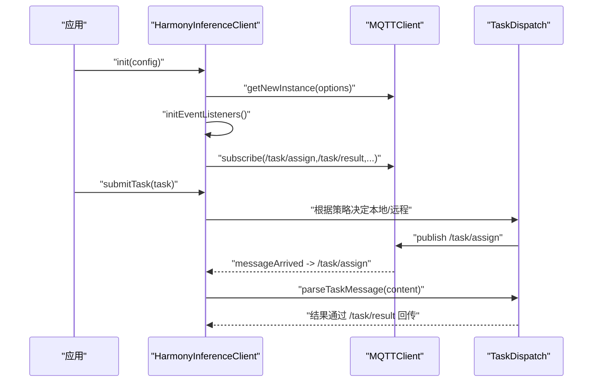
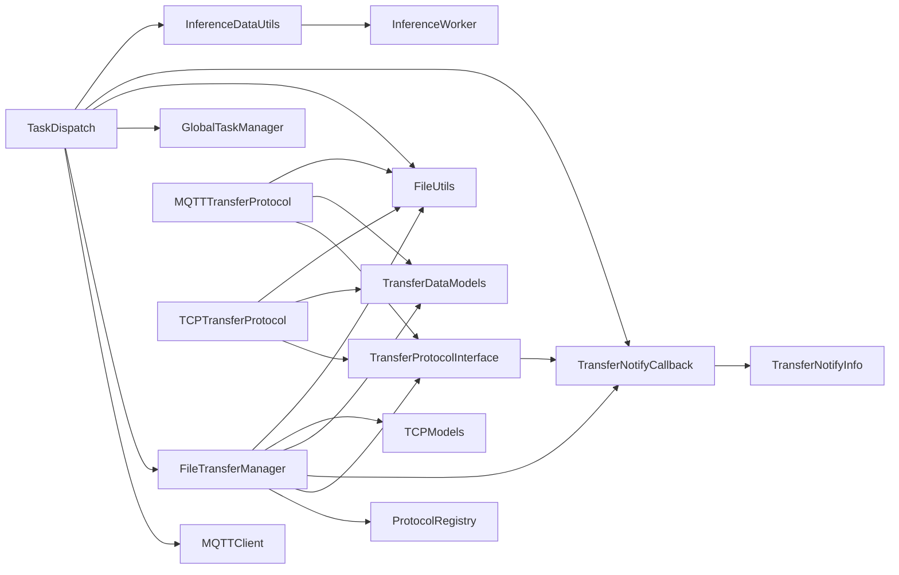

# 任务分发机制

<cite>
**本文引用的文件**
- [TaskDispatch.ets](file://entry/src/main/ets/manager/broker/task/TaskDispatch.ets)
- [InferenceDataUtils.ets](file://entry/src/main/ets/manager/worker/InferenceDataUtils.ets)
- [MQTTClient.ets](file://entry/src/main/ets/manager/broker/MQTTClient.ets)
- [FileTransferManager.ets](file://entry/src/main/ets/manager/transfer/FileTransferManager.ets)
- [MQTTTransferProtocol.ets](file://entry/src/main/ets/manager/transfer/protocol/MQTTTransferProtocol.ets)
- [TCPTransferProtocol.ets](file://entry/src/main/ets/manager/transfer/protocol/TCPTransferProtocol.ets)
- [TransferProtocolInterface.ets](file://entry/src/main/ets/manager/transfer/protocol/TransferProtocolInterface.ets)
- [TransferDataModels.ets](file://entry/src/main/ets/manager/transfer/model/TransferDataModels.ets)
- [TCPModels.ets](file://entry/src/main/ets/manager/transfer/model/TCPModels.ets)
- [FileUtils.ets](file://entry/src/main/ets/manager/transfer/utils/FileUtils.ets)
- [HarmonyInferenceClient.ets](file://entry/src/main/ets/manager/HarmonyInferenceClient.ets)
- [GlobalTaskManager.ets](file://entry/src/main/ets/manager/worker/GlobalTaskManager.ets)
- [MQTTConfig.ets](file://entry/src/main/ets/manager/broker/MQTTConfig.ets)
- [TransferExamples.ets](file://entry/src/main/ets/manager/transfer/examples/TransferExamples.ets)
- [InferenceWorker.ets](file://entry/src/main/ets/manager/worker/InferenceWorker.ets)
</cite>

## 更新摘要
**所做更改**
- TaskDispatch 模块增强了日志记录能力，提供详细的上下文信息包括任务ID、协议名称和设备信息
- 改善了任务生命周期管理的可见性，每个关键操作都有详细的日志输出
- 新增了统一的日志格式，使用 `[HarmonyInference] [模块名]` 前缀
- 增强了错误处理的可观测性，所有异常都有详细的错误信息输出
- 优化了任务状态跟踪，包括数据大小估算、文件传输、结果回传等关键步骤

## 目录
1. [简介](#简介)
2. [项目结构](#项目结构)
3. [核心组件](#核心组件)
4. [架构总览](#架构总览)
5. [详细组件分析](#详细组件分析)
6. [依赖关系分析](#依赖关系分析)
7. [性能考量](#性能考量)
8. [故障排查指南](#故障排查指南)
9. [结论](#结论)
10. [附录](#附录)

## 简介
本文件围绕任务分发机制进行深入实现文档编写，重点解释 TaskDispatch 类的设计理念与实现原理，涵盖任务序列化、传输格式封装、智能协议选择（MQTT/TCP）、文件大小估算、网络传输协议选择与切换、sendTask 方法的工作流程、TaskTransmitData 数据结构设计、错误处理与重试策略，以及与 MQTT 通信模块和文件传输系统的集成方式与数据流转过程。同时提供本地任务执行与远程任务传输的完整使用示例，帮助开发者快速理解与正确使用该机制。

**更新** 本次更新反映了任务分发系统的最新优化：TaskDispatch 模块增强了日志记录能力，现在提供详细的上下文信息包括任务ID、协议名称和设备信息，显著改善了任务生命周期管理的可见性。系统采用统一的日志格式，每个关键操作都有详细的日志输出，便于调试和监控。

## 项目结构
任务分发机制位于 entry 模块的 manager 子目录下，主要涉及以下子模块：
- broker：负责设备间通信与任务分发，包含 MQTT 客户端与任务分发器
- transfer：负责文件传输协议与数据模型，包含 MQTT/TCP 协议实现、传输数据模型与工具类
- worker：负责推理任务的队列与执行
- manager：对外提供统一的推理客户端入口，协调各模块

**图表来源**
- [TaskDispatch.ets:1-324](file://entry/src/main/ets/manager/broker/task/TaskDispatch.ets#L1-L324)
- [FileTransferManager.ets:1-685](file://entry/src/main/ets/manager/transfer/FileTransferManager.ets#L1-L685)
- [MQTTClient.ets:24-223](file://entry/src/main/ets/manager/broker/MQTTClient.ets#L24-L223)
- [MQTTTransferProtocol.ets:1-294](file://entry/src/main/ets/manager/transfer/protocol/MQTTTransferProtocol.ets#L1-L294)
- [TCPTransferProtocol.ets:1-685](file://entry/src/main/ets/manager/transfer/protocol/TCPTransferProtocol.ets#L1-L685)
- [TransferProtocolInterface.ets:1-163](file://entry/src/main/ets/manager/transfer/protocol/TransferProtocolInterface.ets#L1-L163)
- [TransferDataModels.ets:1-170](file://entry/src/main/ets/manager/transfer/model/TransferDataModels.ets#L1-L170)
- [TCPModels.ets:1-148](file://entry/src/main/ets/manager/transfer/model/TCPModels.ets#L1-L148)
- [FileUtils.ets:1-193](file://entry/src/main/ets/manager/transfer/utils/FileUtils.ets#L1-L193)
- [HarmonyInferenceClient.ets:52-357](file://entry/src/main/ets/manager/HarmonyInferenceClient.ets#L52-L357)
- [GlobalTaskManager.ets:4-27](file://entry/src/main/ets/manager/worker/GlobalTaskManager.ets#L4-L27)
- [InferenceDataUtils.ets:1-36](file://entry/src/main/ets/manager/worker/InferenceDataUtils.ets#L1-L36)
- [InferenceWorker.ets:1-127](file://entry/src/main/ets/manager/worker/InferenceWorker.ets#L1-L127)

**章节来源**
- [TaskDispatch.ets:1-324](file://entry/src/main/ets/manager/broker/task/TaskDispatch.ets#L1-L324)
- [FileTransferManager.ets:1-685](file://entry/src/main/ets/manager/transfer/FileTransferManager.ets#L1-L685)
- [MQTTClient.ets:1-223](file://entry/src/main/ets/manager/broker/MQTTClient.ets#L1-L223)
- [MQTTTransferProtocol.ets:1-294](file://entry/src/main/ets/manager/transfer/protocol/MQTTTransferProtocol.ets#L1-L294)
- [TCPTransferProtocol.ets:1-685](file://entry/src/main/ets/manager/transfer/protocol/TCPTransferProtocol.ets#L1-L685)
- [TransferProtocolInterface.ets:1-163](file://entry/src/main/ets/manager/transfer/protocol/TransferProtocolInterface.ets#L1-L163)
- [TransferDataModels.ets:1-170](file://entry/src/main/ets/manager/transfer/model/TransferDataModels.ets#L1-L170)
- [TCPModels.ets:1-148](file://entry/src/main/ets/manager/transfer/model/TCPModels.ets#L1-L148)
- [FileUtils.ets:1-193](file://entry/src/main/ets/manager/transfer/utils/FileUtils.ets#L1-L193)
- [HarmonyInferenceClient.ets:1-357](file://entry/src/main/ets/manager/HarmonyInferenceClient.ets#L1-L357)
- [GlobalTaskManager.ets:1-27](file://entry/src/main/ets/manager/worker/GlobalTaskManager.ets#L1-L27)
- [InferenceDataUtils.ets:1-36](file://entry/src/main/ets/manager/worker/InferenceDataUtils.ets#L1-L36)
- [InferenceWorker.ets:1-127](file://entry/src/main/ets/manager/worker/InferenceWorker.ets#L1-L127)

## 核心组件
- TaskDispatch：任务分发器，负责任务序列化、智能协议选择（MQTT/TCP）、文件大小估算、目标选择、结果回传与错误处理
- FileTransferManager：文件传输管理器，统一管理文件传输任务，提供智能协议选择和传输管理功能
- MQTTClient：MQTT 客户端，负责连接、订阅、发布消息与事件派发
- MQTTTransferProtocol/TCPTransferProtocol：文件传输协议实现，分别用于小文件直传与大文件分块传输
- TransferProtocolInterface：传输协议接口抽象，统一协议行为
- TransferDataModels/TCPModels：传输数据模型，定义文件元数据、分块数据、传输任务、握手消息与配置选项
- TransferNotifyCallback：统一的通知回调类型，用于协议就绪后的通知机制
- FileUtils：文件工具，提供分块、重组、哈希计算与 Base64 编解码
- GlobalTaskManager：全局任务队列管理，负责本地推理任务的排队与执行
- HarmonyInferenceClient：对外推理客户端入口，负责初始化、事件监听、任务提交与结果聚合
- InferenceDataUtils：推理数据工具，提供统一的数据大小估算功能
- InferenceWorker：推理任务接口，定义统一的输入输出数据结构

**章节来源**
- [TaskDispatch.ets:99-324](file://entry/src/main/ets/manager/broker/task/TaskDispatch.ets#L99-L324)
- [FileTransferManager.ets:23-685](file://entry/src/main/ets/manager/transfer/FileTransferManager.ets#L23-L685)
- [MQTTClient.ets:24-223](file://entry/src/main/ets/manager/broker/MQTTClient.ets#L24-L223)
- [MQTTTransferProtocol.ets:10-294](file://entry/src/main/ets/manager/transfer/protocol/MQTTTransferProtocol.ets#L10-L294)
- [TCPTransferProtocol.ets:39-685](file://entry/src/main/ets/manager/transfer/protocol/TCPTransferProtocol.ets#L39-L685)
- [TransferProtocolInterface.ets:64-163](file://entry/src/main/ets/manager/transfer/protocol/TransferProtocolInterface.ets#L64-L163)
- [TransferDataModels.ets:10-170](file://entry/src/main/ets/manager/transfer/model/TransferDataModels.ets#L10-L170)
- [TCPModels.ets:25-148](file://entry/src/main/ets/manager/transfer/model/TCPModels.ets#L25-L148)
- [FileUtils.ets:8-193](file://entry/src/main/ets/manager/transfer/utils/FileUtils.ets#L8-L193)
- [GlobalTaskManager.ets:4-27](file://entry/src/main/ets/manager/worker/GlobalTaskManager.ets#L4-L27)
- [HarmonyInferenceClient.ets:52-357](file://entry/src/main/ets/manager/HarmonyInferenceClient.ets#L52-L357)
- [InferenceDataUtils.ets:3-36](file://entry/src/main/ets/manager/worker/InferenceDataUtils.ets#L3-L36)
- [InferenceWorker.ets:1-127](file://entry/src/main/ets/manager/worker/InferenceWorker.ets#L1-L127)

## 架构总览
任务分发的整体流程如下：
- 任务提交：HarmonyInferenceClient 提交推理任务，调度器决定本地或远程执行
- 本地执行：若本地执行，直接加入 GlobalTaskManager 的队列并执行，结果通过 TaskDispatch 回传
- 远程执行：若远程执行，TaskDispatch 将任务序列化并通过 MQTT 发布到 /task/assign 主题；目标设备收到消息后，若为大文件则通过 TCP 协议传输，否则直接在 MQTT 上接收任务并执行
- 智能协议选择：TaskDispatch 集成 FileTransferManager，根据任务数据大小自动选择 MQTT 直传或 TCP 分块传输
- 统一通知回调：重构后的通知回调系统使用 TransferNotifyCallback 类型，提供统一的协议就绪通知机制
- 统一数据估算：使用 InferenceDataUtils.estimateInputDataSize 函数进行精确的数据大小估算
- 结果回传：执行完成后，通过 /task/result 主题回传结果，HarmonyInferenceClient 监听并聚合结果
- **增强日志记录**：每个关键操作都有详细的日志输出，包括任务ID、协议名称和设备信息

**图表来源**
- [TaskDispatch.ets:125-185](file://entry/src/main/ets/manager/broker/task/TaskDispatch.ets#L125-L185)
- [FileTransferManager.ets:167-287](file://entry/src/main/ets/manager/transfer/FileTransferManager.ets#L167-L287)
- [MQTTClient.ets:147-182](file://entry/src/main/ets/manager/broker/MQTTClient.ets#L147-L182)
- [HarmonyInferenceClient.ets:136-151](file://entry/src/main/ets/manager/HarmonyInferenceClient.ets#L136-L151)
- [InferenceDataUtils.ets:7-24](file://entry/src/main/ets/manager/worker/InferenceDataUtils.ets#L7-L24)

## 详细组件分析

### TaskDispatch 类设计与实现
- 设计理念
  - 统一的任务序列化与反序列化，保证跨设备一致的数据格式
  - 智能协议选择：根据任务数据大小自动选择 MQTT 直传或 TCP 分块传输
  - 集成文件传输系统：委托 FileTransferManager 处理大文件传输，提升整体传输效率
  - 事件驱动：通过 MQTT 主题与事件总线实现松耦合的消息传递
  - 可扩展性：遵循 TransferProtocolInterface 抽象，便于新增传输协议
  - 统一通知回调：使用新的 TransferNotifyCallback 类型，提供一致的通知机制
  - 精确数据估算：使用 InferenceDataUtils.estimateInputDataSize 函数进行统一的数据大小估算
  - 二进制缓冲区处理：重构数据提取逻辑，直接处理二进制缓冲区
  - **增强日志记录**：提供详细的上下文信息，包括任务ID、协议名称和设备信息
- 关键职责
  - sendTask：任务发送与智能协议选择
  - extractFileData/estimateDataSize：文件数据提取与大小估算
  - parseTaskMessage/parseResultMessage：任务与结果消息解析
  - sendTaskResult：结果回传
  - executeAndReturn：本地推理执行

**图表来源**
- [TaskDispatch.ets:99-324](file://entry/src/main/ets/manager/broker/task/TaskDispatch.ets#L99-L324)
- [FileTransferManager.ets:23-685](file://entry/src/main/ets/manager/transfer/FileTransferManager.ets#L23-L685)
- [TransferProtocolInterface.ets:40-43](file://entry/src/main/ets/manager/transfer/protocol/TransferProtocolInterface.ets#L40-L43)
- [InferenceDataUtils.ets:3-36](file://entry/src/main/ets/manager/worker/InferenceDataUtils.ets#L3-L36)
- [InferenceWorker.ets:69-74](file://entry/src/main/ets/manager/worker/InferenceWorker.ets#L69-L74)

**章节来源**
- [TaskDispatch.ets:99-324](file://entry/src/main/ets/manager/broker/task/TaskDispatch.ets#L99-L324)

#### sendTask 方法工作流程
- 输入：TaskTransmitData 对象
- 流程：
  - 使用 InferenceDataUtils.estimateInputDataSize 估算任务数据大小
  - 若超过阈值（2KB），调用 FileTransferManager.transferFile：设置 transferType='TCP'，构建 FileInfo，通过 TransferNotifyCallback 通知目标设备发起 TCP 连接
  - 若未超过阈值，直接将 TaskTransmitData JSON 序列化后通过 MQTT 发布到 /task/assign 主题
  - 异常捕获并返回失败
- 输出：Promise<boolean>，表示发送是否成功
- **增强日志记录**：每个步骤都有详细的日志输出，包括任务ID、协议名称和设备信息

**更新** 本次更新优化了大文件传输逻辑，现在在调用 `FileTransferManager.transferFile` 时显式指定协议名称为 `'TCP'`，确保大文件传输使用 TCP 协议而非自动选择。同时使用新的 TransferNotifyCallback 类型进行统一的通知回调处理，并引入了精确的数据大小估算函数。所有操作都有详细的日志记录，包括任务ID、协议名称和设备信息。

**图表来源**
- [TaskDispatch.ets:125-185](file://entry/src/main/ets/manager/broker/task/TaskDispatch.ets#L125-L185)
- [InferenceDataUtils.ets:7-24](file://entry/src/main/ets/manager/worker/InferenceDataUtils.ets#L7-L24)

**章节来源**
- [TaskDispatch.ets:125-185](file://entry/src/main/ets/manager/broker/task/TaskDispatch.ets#L125-L185)

#### TaskTransmitData 数据结构设计
- 字段说明
  - taskId：任务唯一标识
  - fromClient：发送方客户端标识
  - toClient：接收方客户端标识
  - timestamp：时间戳，用于后续计算任务总耗时
  - params：推理任务参数详情（包含任务类型与输入数据）
  - sourceDevice：源设备标识（如 IP 地址或设备 ID，具体含义由传输协议决定）
  - transferType：传输类型，'direct' 或 'TCP'
  - fileHash：文件哈希值（用于校验）
- 设计目的
  - 封装任务与路由信息，便于跨设备传输
  - 支持不同传输协议的差异化字段
  - 保证序列化/反序列化的稳定性
  - 初始化时使用空 ArrayBuffer 确保正确的二进制数据处理

**更新** 本次更新优化了 TaskTransmitData 的初始化过程，现在使用空 ArrayBuffer 实例进行初始化，确保 ImageInputData 的 buffer 字段正确设置为空缓冲区，为后续的大文件传输做好准备。

**章节来源**
- [TaskDispatch.ets:18-69](file://entry/src/main/ets/manager/broker/task/TaskDispatch.ets#L18-L69)

#### 文件大小估算与智能协议选择
- estimateDataSize：使用 InferenceDataUtils.estimateInputDataSize 函数估算数据大小
  - 文本类型：基于文本长度估算（UTF-8 简单估算）
  - 图像类型：直接返回 buffer.byteLength，确保二进制缓冲区的精确大小
  - 其他类型：返回 buffer.byteLength
- fileSizeThreshold：2KB 作为 MQTT 与 TCP 的分界点
- extractFileData：从推理任务中提取文件数据
  - 图像类型：直接返回 ArrayBuffer，不再进行 Base64 编码转换
  - 其他类型：返回 null

**更新** 本次更新引入了专门的 InferenceDataUtils.estimateInputDataSize 函数，提供了更精确的数据大小估算算法。重构了数据提取逻辑，现在直接处理二进制缓冲区而非性能考量，确保数据传输的准确性。

**章节来源**
- [TaskDispatch.ets:209-212](file://entry/src/main/ets/manager/broker/task/TaskDispatch.ets#L209-L212)
- [InferenceDataUtils.ets:7-24](file://entry/src/main/ets/manager/worker/InferenceDataUtils.ets#L7-L24)
- [TaskDispatch.ets:192-202](file://entry/src/main/ets/manager/broker/task/TaskDispatch.ets#L192-L202)

#### 任务结果回传与解析
- sendTaskResult：将 TaskResTransmitData JSON 序列化后发布到 /task/result 主题
- parseResultMessage：解析结果消息，仅返回本设备发出的任务结果（通过 fromClient 与 ownName 比较）

**章节来源**
- [TaskDispatch.ets:294-321](file://entry/src/main/ets/manager/broker/task/TaskDispatch.ets#L294-L321)

#### 大文件传输流程（TCP）
- 发送端（TaskDispatch.sendTask）
  - 调用 FileTransferManager.transferFile，传入 TransferNotifyCallback
  - TransferNotifyCallback：设置 transferType='TCP'、sourceDevice、清空数据缓冲区，通过 MQTT 发布任务通知
- 接收端（TaskDispatch.parseTaskMessage）
  - 收到任务后，调用 FileTransferManager.receiveFile 主动连接源设备
  - 接收文件数据并校验哈希
  - 将文件数据设置到任务参数中（如为图片类型）
  - 本地执行推理并将结果回传

**更新** 本次更新优化了任务解析逻辑，改进了对直接执行和 TCP 大文件传输场景的处理。现在在接收端能够更准确地区分两种传输类型，并相应地执行不同的处理流程。同时使用统一的 TransferNotifyCallback 类型进行通知回调处理。所有操作都有详细的日志记录，包括任务ID、协议名称和设备信息。

**图表来源**
- [TaskDispatch.ets:125-185](file://entry/src/main/ets/manager/broker/task/TaskDispatch.ets#L125-L185)
- [TaskDispatch.ets:220-272](file://entry/src/main/ets/manager/broker/task/TaskDispatch.ets#L220-L272)
- [FileTransferManager.ets:300-429](file://entry/src/main/ets/manager/transfer/FileTransferManager.ets#L300-L429)
- [TCPTransferProtocol.ets:71-343](file://entry/src/main/ets/manager/transfer/protocol/TCPTransferProtocol.ets#L71-L343)
- [InferenceDataUtils.ets:7-24](file://entry/src/main/ets/manager/worker/InferenceDataUtils.ets#L7-L24)

**章节来源**
- [TaskDispatch.ets:125-185](file://entry/src/main/ets/manager/broker/task/TaskDispatch.ets#L125-L185)
- [TaskDispatch.ets:220-272](file://entry/src/main/ets/manager/broker/task/TaskDispatch.ets#L220-L272)
- [FileTransferManager.ets:300-429](file://entry/src/main/ets/manager/transfer/FileTransferManager.ets#L300-L429)
- [TCPTransferProtocol.ets:71-343](file://entry/src/main/ets/manager/transfer/protocol/TCPTransferProtocol.ets#L71-L343)
- [InferenceDataUtils.ets:7-24](file://entry/src/main/ets/manager/worker/InferenceDataUtils.ets#L7-L24)

### 文件传输系统集成
- FileTransferManager
  - 单例模式，统一管理所有文件传输任务
  - 默认注册 MQTT 和 TCP 协议
  - 提供 transferFile 和 receiveFile 两个核心方法
  - 支持配置管理、进度查询、任务取消、事件监听
  - 统一通知回调：使用 TransferNotifyCallback 类型处理协议就绪通知
  - **增强日志记录**：每个关键操作都有详细的日志输出，包括任务ID和协议名称
- 智能协议选择
  - 基于文件大小阈值（2MB）自动选择协议
  - 支持自定义配置（sizeThreshold、tcpChunkSize、maxRetries、timeout、tcpPort）
  - 通过 ProtocolRegistry 管理协议注册
- TCP 传输通知机制
  - TransferNotifyCallback：统一的通知回调类型，TCP 服务器就绪后通知目标设备发起连接
  - TCPNotifyInfo：包含 taskId、sourceDevice、port、fileInfo、fileHash
  - 通过 MQTT 传输通知消息

**更新** 本次更新反映了通知回调系统的重构：FileTransferManager 现在使用统一的 TransferNotifyCallback 类型，替代之前的特定协议回调类型，提供更好的可扩展性和一致性。同时增强了日志记录能力，每个关键操作都有详细的日志输出。

**图表来源**
- [FileTransferManager.ets:23-685](file://entry/src/main/ets/manager/transfer/FileTransferManager.ets#L23-L685)
- [TCPModels.ets:26-33](file://entry/src/main/ets/manager/transfer/model/TCPModels.ets#L26-L33)
- [TransferProtocolInterface.ets:40-43](file://entry/src/main/ets/manager/transfer/protocol/TransferProtocolInterface.ets#L40-L43)

**章节来源**
- [FileTransferManager.ets:23-685](file://entry/src/main/ets/manager/transfer/FileTransferManager.ets#L23-L685)
- [TCPModels.ets:26-33](file://entry/src/main/ets/manager/transfer/model/TCPModels.ets#L26-L33)
- [TransferProtocolInterface.ets:40-43](file://entry/src/main/ets/manager/transfer/protocol/TransferProtocolInterface.ets#L40-L43)

### 传输协议与数据模型
- TransferProtocolInterface：定义协议接口，包括连接、断开、发送、接收、进度查询与取消
- TransferNotifyCallback：统一的通知回调类型，用于协议就绪后的通知机制
- TransferNotifyInfo：通用通知信息接口，包含任务标识、协议名称、设备信息等
- MQTTTransferProtocol：基于 MQTT 的小文件传输，内置重试与进度上报
- TCPTransferProtocol：基于 TCP 的大文件分块传输，支持握手、分块、重试与哈希校验
- TransferDataModels：定义 FileInfo、ChunkData、TransferTask、TransferOptions 等数据结构
- TCPModels：定义 TCP 专用数据结构，包括 TCPNotifyInfo、TCPTransferConfig、TCPMessage 等
- FileUtils：提供分块、重组、哈希计算、Base64 编解码等工具

**更新** 本次更新包含了新的通知回调系统：TransferNotifyCallback 类型定义、TransferNotifyInfo 通用接口、以及 TCPModels 中的 TCPNotifyInfo 扩展。所有协议都有详细的日志记录，包括协议名称和设备信息。

**图表来源**
- [TransferProtocolInterface.ets:64-163](file://entry/src/main/ets/manager/transfer/protocol/TransferProtocolInterface.ets#L64-L163)
- [TransferProtocolInterface.ets:40-43](file://entry/src/main/ets/manager/transfer/protocol/TransferProtocolInterface.ets#L40-L43)
- [TransferProtocolInterface.ets:46-62](file://entry/src/main/ets/manager/transfer/protocol/TransferProtocolInterface.ets#L46-L62)
- [MQTTTransferProtocol.ets:10-294](file://entry/src/main/ets/manager/transfer/protocol/MQTTTransferProtocol.ets#L10-L294)
- [TCPTransferProtocol.ets:39-685](file://entry/src/main/ets/manager/transfer/protocol/TCPTransferProtocol.ets#L39-L685)
- [TransferDataModels.ets:10-170](file://entry/src/main/ets/manager/transfer/model/TransferDataModels.ets#L10-L170)
- [TCPModels.ets:25-148](file://entry/src/main/ets/manager/transfer/model/TCPModels.ets#L25-L148)
- [FileUtils.ets:8-193](file://entry/src/main/ets/manager/transfer/utils/FileUtils.ets#L8-L193)

**章节来源**
- [TransferProtocolInterface.ets:1-163](file://entry/src/main/ets/manager/transfer/protocol/TransferProtocolInterface.ets#L1-L163)
- [TransferProtocolInterface.ets:40-43](file://entry/src/main/ets/manager/transfer/protocol/TransferProtocolInterface.ets#L40-L43)
- [TransferProtocolInterface.ets:46-62](file://entry/src/main/ets/manager/transfer/protocol/TransferProtocolInterface.ets#L46-L62)
- [MQTTTransferProtocol.ets:1-294](file://entry/src/main/ets/manager/transfer/protocol/MQTTTransferProtocol.ets#L1-L294)
- [TCPTransferProtocol.ets:1-685](file://entry/src/main/ets/manager/transfer/protocol/TCPTransferProtocol.ets#L1-L685)
- [TransferDataModels.ets:1-170](file://entry/src/main/ets/manager/transfer/model/TransferDataModels.ets#L1-L170)
- [TCPModels.ets:1-148](file://entry/src/main/ets/manager/transfer/model/TCPModels.ets#L1-L148)
- [FileUtils.ets:1-193](file://entry/src/main/ets/manager/transfer/utils/FileUtils.ets#L1-L193)

### 与 MQTT 通信模块的集成
- MQTTClient
  - 单例模式，负责连接、订阅、发布与事件派发
  - 订阅 /task/assign 与 /task/result 等主题
  - 通过事件总线向上层派发消息
  - **增强日志记录**：每个关键操作都有详细的日志输出，包括主题名称和连接状态
- HarmonyInferenceClient
  - 初始化 MQTT 客户端与事件监听器
  - 监听 /task/assign 与 /task/result 主题，调用 TaskDispatch 进行解析与结果处理
  - 提交任务时根据调度策略决定本地或远程执行

**图表来源**
- [MQTTClient.ets:47-182](file://entry/src/main/ets/manager/broker/MQTTClient.ets#L47-L182)
- [HarmonyInferenceClient.ets:83-154](file://entry/src/main/ets/manager/HarmonyInferenceClient.ets#L83-L154)
- [TaskDispatch.ets:220-272](file://entry/src/main/ets/manager/broker/task/TaskDispatch.ets#L220-L272)

**章节来源**
- [MQTTClient.ets:24-223](file://entry/src/main/ets/manager/broker/MQTTClient.ets#L24-L223)
- [HarmonyInferenceClient.ets:83-154](file://entry/src/main/ets/manager/HarmonyInferenceClient.ets#L83-L154)
- [TaskDispatch.ets:220-272](file://entry/src/main/ets/manager/broker/task/TaskDispatch.ets#L220-L272)

### 使用示例（本地与远程）
- 本地任务执行
  - 调度器判断本地执行，直接加入 GlobalTaskManager 队列并执行
  - 结果通过 TaskDispatch 回传到 /task/result
- 远程任务传输
  - 小文件：TaskDispatch 直接通过 MQTT 发布到 /task/assign
  - 大文件：TaskDispatch 委托 FileTransferManager.transferFile，设置 transferType='TCP'，启动 TCP 服务器并通过 TransferNotifyCallback 发布任务通知，目标设备通过 TCP 接收文件并执行

**更新** 本次更新提供了更准确的使用示例，强调了显式指定 TCP 协议的重要性以及改进的文件大小估算算法如何影响协议选择。同时展示了新的 TransferNotifyCallback 类型在通知回调中的使用。所有操作都有详细的日志记录，便于调试和监控。

**章节来源**
- [HarmonyInferenceClient.ets:309-353](file://entry/src/main/ets/manager/HarmonyInferenceClient.ets#L309-L353)
- [TaskDispatch.ets:125-185](file://entry/src/main/ets/manager/broker/task/TaskDispatch.ets#L125-L185)
- [TaskDispatch.ets:220-272](file://entry/src/main/ets/manager/broker/task/TaskDispatch.ets#L220-L272)
- [GlobalTaskManager.ets:4-27](file://entry/src/main/ets/manager/worker/GlobalTaskManager.ets#L4-L27)

### InferenceDataUtils 数据估算工具
- 设计目的
  - 提供统一的数据大小估算功能，支持多种输入类型
  - 确保二进制缓冲区的精确大小计算
  - 为任务分发提供准确的数据大小信息
- 核心功能
  - estimateInputDataSize：根据输入类型估算数据大小
  - isBufferInput：判断输入是否为二进制缓冲区
  - estimateStringSize：估算字符串大小（UTF-8）
- 实现特点
  - 图像类型：直接返回 buffer.byteLength，确保二进制数据的精确大小
  - 文本类型：基于字符数估算，使用 UTF-8 简单估算（平均 2 字节/字符）
  - 其他类型：返回 buffer.byteLength

**更新** 本次更新引入了专门的 InferenceDataUtils 类，提供了统一的数据大小估算功能。该工具类完全重写了数据提取逻辑，现在直接处理二进制缓冲区，确保数据传输的准确性。

**章节来源**
- [InferenceDataUtils.ets:3-36](file://entry/src/main/ets/manager/worker/InferenceDataUtils.ets#L3-L36)

### 增强日志记录系统
- **统一日志格式**：所有日志都使用 `[HarmonyInference] [模块名]` 前缀，便于过滤和识别
- **详细上下文信息**：每个日志条目都包含任务ID、协议名称和设备信息
- **关键操作日志**：
  - 任务数据大小估算：包含任务ID和数据大小
  - 协议选择决策：包含协议名称和任务ID
  - 文件传输状态：包含任务ID、协议名称和传输进度
  - 错误处理：包含详细错误信息和任务ID
  - 设备交互：包含源设备和目标设备信息
- **日志级别**：使用 info、error 等不同级别区分操作状态
- **可观测性增强**：每个关键步骤都有详细的日志输出，便于调试和监控

**更新** 本次更新反映了 TaskDispatch 模块的显著改进：增强了日志记录能力，提供详细的上下文信息包括任务ID、协议名称和设备信息，显著改善了任务生命周期管理的可见性。系统采用统一的日志格式，每个关键操作都有详细的日志输出。

**章节来源**
- [TaskDispatch.ets:125-185](file://entry/src/main/ets/manager/broker/task/TaskDispatch.ets#L125-L185)
- [TaskDispatch.ets:220-272](file://entry/src/main/ets/manager/broker/task/TaskDispatch.ets#L220-L272)
- [TaskDispatch.ets:294-321](file://entry/src/main/ets/manager/broker/task/TaskDispatch.ets#L294-L321)

## 依赖关系分析
- TaskDispatch 依赖
  - MQTTClient：用于消息发布与订阅
  - FileTransferManager：用于大文件传输管理
  - GlobalTaskManager：用于本地任务队列
  - FileUtils：用于哈希校验与数据转换
  - TransferNotifyCallback：用于统一的通知回调处理
  - InferenceDataUtils：用于精确的数据大小估算
- FileTransferManager 依赖
  - ProtocolRegistry：协议注册中心
  - TransferProtocolInterface：统一协议抽象
  - TransferNotifyCallback：统一通知回调类型
  - MQTTTransferProtocol/TCPTransferProtocol：具体协议实现
  - TransferDataModels/TCPModels：协议所需数据结构
  - FileUtils：协议所需工具能力
- 协议层依赖
  - TransferProtocolInterface：统一协议抽象
  - TransferNotifyCallback：统一通知回调类型
  - TransferNotifyInfo：通用通知信息接口
  - MQTTTransferProtocol/TCPTransferProtocol：具体协议实现
  - TransferDataModels：协议所需数据结构
  - FileUtils：协议所需工具能力
- 数据层依赖
  - InferenceDataUtils：统一数据大小估算
  - InferenceWorker：统一输入输出数据结构

**更新** 本次更新反映了通知回调系统的重构依赖关系：TaskDispatch 和 FileTransferManager 现在都依赖于统一的 TransferNotifyCallback 类型。同时新增了 InferenceDataUtils 作为数据估算工具的依赖。所有组件都有增强的日志记录能力。

**图表来源**
- [TaskDispatch.ets:1-11](file://entry/src/main/ets/manager/broker/task/TaskDispatch.ets#L1-L11)
- [FileTransferManager.ets:5-29](file://entry/src/main/ets/manager/transfer/FileTransferManager.ets#L5-L29)
- [TransferProtocolInterface.ets:40-43](file://entry/src/main/ets/manager/transfer/protocol/TransferProtocolInterface.ets#L40-L43)
- [TransferProtocolInterface.ets:46-62](file://entry/src/main/ets/manager/transfer/protocol/TransferProtocolInterface.ets#L46-L62)
- [MQTTTransferProtocol.ets:5-23](file://entry/src/main/ets/manager/transfer/protocol/MQTTTransferProtocol.ets#L5-L23)
- [TCPTransferProtocol.ets:5-21](file://entry/src/main/ets/manager/transfer/protocol/TCPTransferProtocol.ets#L5-L21)
- [TransferDataModels.ets:10-170](file://entry/src/main/ets/manager/transfer/model/TransferDataModels.ets#L10-L170)
- [TCPModels.ets:6-148](file://entry/src/main/ets/manager/transfer/model/TCPModels.ets#L6-L148)
- [FileUtils.ets:5-7](file://entry/src/main/ets/manager/transfer/utils/FileUtils.ets#L5-L7)
- [InferenceDataUtils.ets:1](file://entry/src/main/ets/manager/worker/InferenceDataUtils.ets#L1)
- [InferenceWorker.ets:1](file://entry/src/main/ets/manager/worker/InferenceWorker.ets#L1)

**章节来源**
- [TaskDispatch.ets:1-11](file://entry/src/main/ets/manager/broker/task/TaskDispatch.ets#L1-L11)
- [FileTransferManager.ets:5-29](file://entry/src/main/ets/manager/transfer/FileTransferManager.ets#L5-L29)
- [TransferProtocolInterface.ets:40-43](file://entry/src/main/ets/manager/transfer/protocol/TransferProtocolInterface.ets#L40-L43)
- [TransferProtocolInterface.ets:46-62](file://entry/src/main/ets/manager/transfer/protocol/TransferProtocolInterface.ets#L46-L62)
- [MQTTTransferProtocol.ets:5-23](file://entry/src/main/ets/manager/transfer/protocol/MQTTTransferProtocol.ets#L5-L23)
- [TCPTransferProtocol.ets:5-21](file://entry/src/main/ets/manager/transfer/protocol/TCPTransferProtocol.ets#L5-L21)
- [TransferDataModels.ets:10-170](file://entry/src/main/ets/manager/transfer/model/TransferDataModels.ets#L10-L170)
- [TCPModels.ets:6-148](file://entry/src/main/ets/manager/transfer/model/TCPModels.ets#L6-L148)
- [FileUtils.ets:5-7](file://entry/src/main/ets/manager/transfer/utils/FileUtils.ets#L5-L7)
- [InferenceDataUtils.ets:1](file://entry/src/main/ets/manager/worker/InferenceDataUtils.ets#L1)
- [InferenceWorker.ets:1](file://entry/src/main/ets/manager/worker/InferenceWorker.ets#L1)

## 性能考量
- 智能协议选择：通过 2KB 阈值估算文件大小，避免不必要的 TCP 传输
- 传输阈值：2KB 作为 MQTT 与 TCP 的分界点，兼顾 MQTT 的轻量与 TCP 的可靠性
- 重试策略：MQTT 传输最多 3 次重试，指数退避等待；TCP 分块发送失败按块重试
- 进度上报：协议层维护 TransferProgress，便于 UI 层展示与用户反馈
- 哈希校验：大文件传输后进行 SHA-256 校验，确保数据完整性
- 文件分块：TCP 传输默认 128KB 分块，支持自定义配置
- 连接池：TCPTransferProtocol 支持连接复用，减少连接开销
- 统一通知回调：使用 TransferNotifyCallback 类型，提供更好的性能和一致性
- 精确数据估算：使用 InferenceDataUtils.estimateInputDataSize 函数，提供准确的数据大小估算
- 二进制缓冲区处理：直接处理二进制缓冲区，避免 Base64 编码转换的性能损失
- **增强日志记录**：统一的日志格式和详细的上下文信息，不影响性能但显著提升可观测性

**更新** 本次更新反映了性能优化的最新进展，包括更精确的数据大小估算算法、显式协议选择机制、统一通知回调类型以及重构后的通知回调系统，这些优化显著提升了系统的性能和可靠性。同时增强了日志记录能力，提供详细的上下文信息但不影响性能。

**章节来源**
- [TaskDispatch.ets:112-115](file://entry/src/main/ets/manager/broker/task/TaskDispatch.ets#L112-L115)
- [TaskDispatch.ets:209-212](file://entry/src/main/ets/manager/broker/task/TaskDispatch.ets#L209-L212)
- [FileTransferManager.ets:56-62](file://entry/src/main/ets/manager/transfer/FileTransferManager.ets#L56-L62)
- [MQTTTransferProtocol.ets:58-61](file://entry/src/main/ets/manager/transfer/protocol/MQTTTransferProtocol.ets#L58-L61)
- [MQTTTransferProtocol.ets:166-200](file://entry/src/main/ets/manager/transfer/protocol/MQTTTransferProtocol.ets#L166-L200)
- [TCPTransferProtocol.ets:47-51](file://entry/src/main/ets/manager/transfer/protocol/TCPTransferProtocol.ets#L47-L51)
- [TCPTransferProtocol.ets:152-154](file://entry/src/main/ets/manager/transfer/protocol/TCPTransferProtocol.ets#L152-L154)
- [FileUtils.ets:16-39](file://entry/src/main/ets/manager/transfer/utils/FileUtils.ets#L16-L39)
- [InferenceDataUtils.ets:7-24](file://entry/src/main/ets/manager/worker/InferenceDataUtils.ets#L7-L24)

## 故障排查指南
- MQTT 连接问题
  - 确认 MQTTClient 已初始化且连接成功
  - 检查订阅的主题列表是否包含 /task/assign 与 /task/result
- 任务未到达目标设备
  - 检查 TaskTransmitData 中 toClient 与目标设备 ownName 是否一致
  - 确认 MQTT 主题发布成功且目标设备已订阅
- 大文件传输失败
  - 检查 sourceDevice 是否正确设置
  - 确认目标设备 TCP 服务器已启动并监听 8888 端口
  - 校验文件哈希是否一致
  - 检查 TransferNotifyCallback 是否正确触发
- 协议选择问题
  - 确认 fileSizeThreshold 配置是否合理
  - 检查 FileTransferManager 是否正确注册了协议
- 结果未回传
  - 检查 sendTaskResult 是否成功发布到 /task/result
  - 确认 HarmonyInferenceClient 的 RESULT_EVENT_ID 事件监听是否生效
- 通知回调问题
  - 检查 TransferNotifyCallback 类型定义是否正确导入
  - 确认回调函数签名与 TransferNotifyCallback 接口一致
  - 验证通知信息的传递和处理流程
- 数据估算问题
  - 检查 InferenceDataUtils.estimateInputDataSize 函数是否正确返回数据大小
  - 确认二进制缓冲区的 byteLength 是否正确
  - 验证数据类型判断逻辑
- 数据提取问题
  - 检查 extractFileData 方法是否正确返回 ArrayBuffer
  - 确认二进制缓冲区的处理逻辑
  - 验证空缓冲区的初始化过程
- **增强日志记录问题**
  - 检查日志格式是否符合 `[HarmonyInference] [模块名]` 标准
  - 确认日志中包含任务ID、协议名称和设备信息
  - 验证错误日志是否包含详细错误信息
  - 检查日志级别是否正确使用

**更新** 本次更新增加了针对新优化功能的故障排查指导，特别是关于显式 TCP 协议选择、改进的数据大小估算算法、统一通知回调类型以及重构后的通知回调系统的故障诊断。同时增加了增强日志记录系统的故障排查指南。

**章节来源**
- [MQTTClient.ets:52-65](file://entry/src/main/ets/manager/broker/MQTTClient.ets#L52-L65)
- [MQTTClient.ets:107-145](file://entry/src/main/ets/manager/broker/MQTTClient.ets#L107-L145)
- [TaskDispatch.ets:140-151](file://entry/src/main/ets/manager/broker/task/TaskDispatch.ets#L140-L151)
- [TaskDispatch.ets:294-321](file://entry/src/main/ets/manager/broker/task/TaskDispatch.ets#L294-L321)
- [HarmonyInferenceClient.ets:141-151](file://entry/src/main/ets/manager/HarmonyInferenceClient.ets#L141-L151)
- [InferenceDataUtils.ets:7-24](file://entry/src/main/ets/manager/worker/InferenceDataUtils.ets#L7-L24)

## 结论
任务分发机制通过 TaskDispatch 集成 FileTransferManager，实现了智能协议选择与文件大小估算功能，将任务序列化并通过 MQTT/TCP 协议可靠地在设备间传输，结合 GlobalTaskManager 实现本地推理执行与结果回传。其设计具备良好的可扩展性与健壮性，能够根据任务规模自动选择最优传输协议，并提供完善的错误处理与进度反馈能力。配合 HarmonyInferenceClient 的统一入口，开发者可以便捷地实现本地与远程推理任务的混合执行。

**更新** 本次更新反映了最新的系统优化成果，包括显式 TCP 协议选择、增强的数据大小估算算法、优化的任务解析逻辑、统一的通知回调系统以及重构后的通知回调类型，这些改进显著提升了系统的性能、可靠性和可维护性。特别是 TaskDispatch 模块的增强日志记录能力，提供了详细的上下文信息，显著改善了任务生命周期管理的可见性。

## 附录
- 完整使用示例参考
  - 本地任务执行：HarmonyInferenceClient.submitTask 在本地队列执行并返回结果
  - 远程任务传输：TaskDispatch.sendTask 发送任务，目标设备通过 MQTT 或 TCP 接收并执行
  - 文件传输示例：参考 TransferExamples 中的示例函数，展示协议选择、进度查询与哈希校验等
- 配置建议
  - 根据网络环境调整 sizeThreshold 阈值
  - 大文件传输建议使用 TCP 协议
  - 可通过 setDefaultOptions 自定义传输参数
- 通知回调使用指南
  - 导入 TransferNotifyCallback 类型
  - 实现回调函数，处理协议就绪通知
  - 在 FileTransferManager.transferFile 中传入回调函数
  - 确保回调函数签名与接口定义一致
- 数据估算使用指南
  - 导入 InferenceDataUtils 类
  - 调用 estimateInputDataSize 函数进行数据大小估算
  - 确保输入数据类型正确
  - 验证二进制缓冲区的处理逻辑
- **增强日志记录使用指南**
  - 查看统一的日志格式：`[HarmonyInference] [模块名]`
  - 确认日志包含任务ID、协议名称和设备信息
  - 使用日志进行调试和监控
  - 按模块名过滤日志输出

**更新** 本次更新提供了更多关于新优化功能的使用指导，包括如何利用显式协议选择、改进的估算算法、统一通知回调类型以及重构后的通知回调系统来优化系统性能。同时增加了增强日志记录系统的使用指南。

**章节来源**
- [HarmonyInferenceClient.ets:309-353](file://entry/src/main/ets/manager/HarmonyInferenceClient.ets#L309-L353)
- [TaskDispatch.ets:125-185](file://entry/src/main/ets/manager/broker/task/TaskDispatch.ets#L125-L185)
- [TransferExamples.ets:1-201](file://entry/src/main/ets/manager/transfer/examples/TransferExamples.ets#L1-L201)
- [InferenceDataUtils.ets:7-24](file://entry/src/main/ets/manager/worker/InferenceDataUtils.ets#L7-L24)