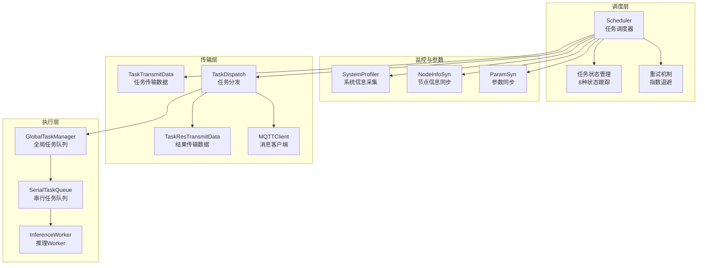
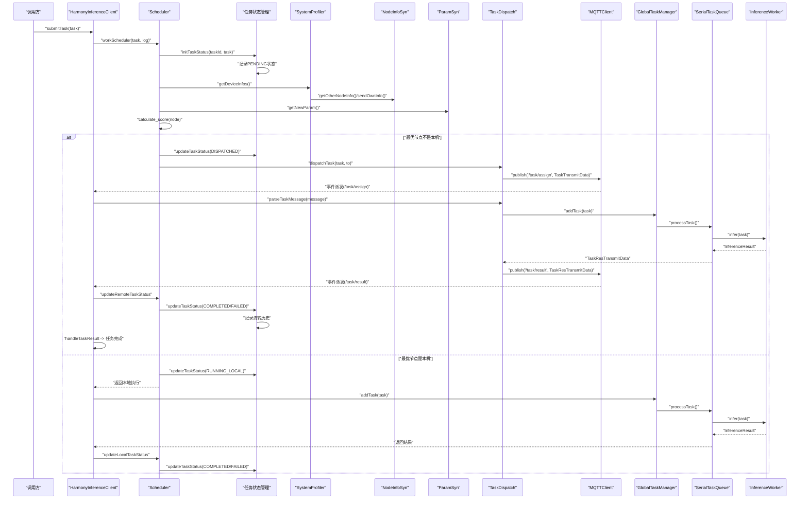
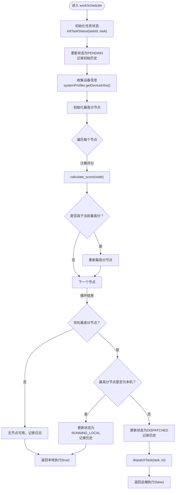
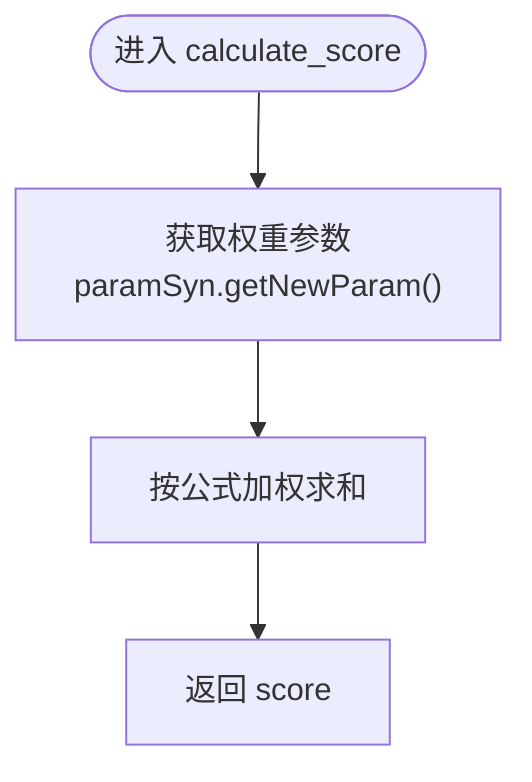
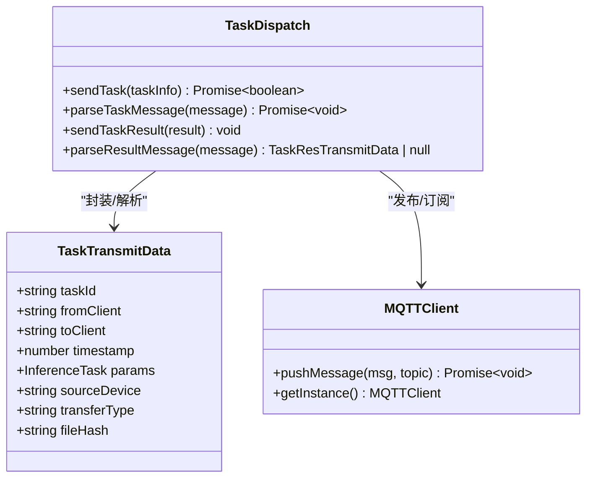
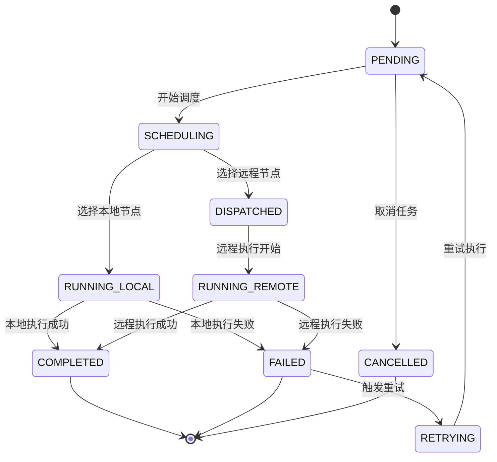
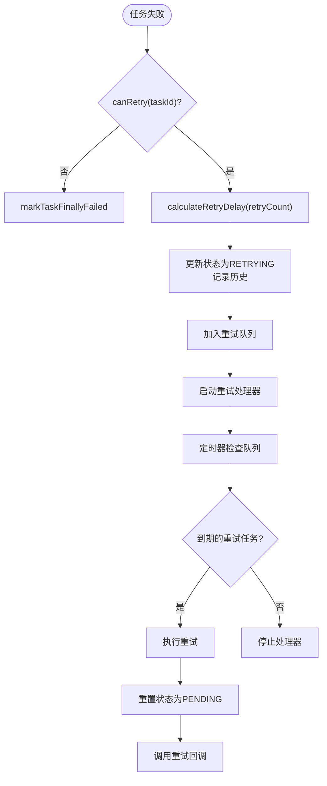
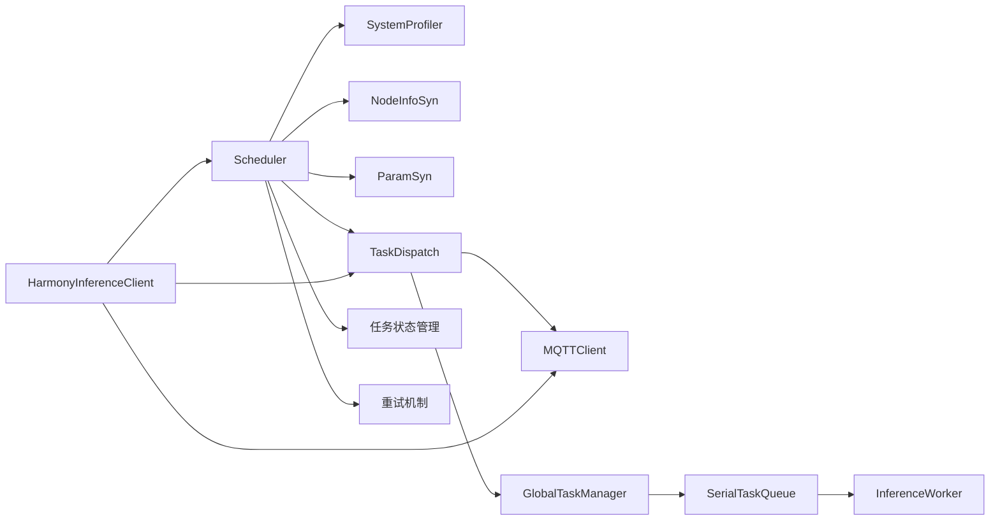

# 任务调度器

<cite>
**本文引用的文件**
- [Scheduler.ets](file://entry/src/main/ets/manager/scheduler/Scheduler.ets)
- [TaskDispatch.ets](file://entry/src/main/ets/manager/broker/task/TaskDispatch.ets)
- [SystemProfiler.ets](file://entry/src/main/ets/manager/monitor/SystemProfiler.ets)
- [ParamSyn.ets](file://entry/src/main/ets/manager/broker/paramOpt/ParamSyn.ets)
- [NodeInfoSyn.ets](file://entry/src/main/ets/manager/broker/monitor/NodeInfoSyn.ets)
- [InferenceWorker.ets](file://entry/src/main/ets/manager/worker/InferenceWorker.ets)
- [GlobalTaskManager.ets](file://entry/src/main/ets/manager/worker/GlobalTaskManager.ets)
- [SerialTaskQueue.ets](file://entry/src/main/ets/manager/worker/SerialTaskQueue.ets)
- [MQTTClient.ets](file://entry/src/main/ets/manager/broker/MQTTClient.ets)
- [HarmonyInferenceClient.ets](file://entry/src/main/ets/manager/HarmonyInferenceClient.ets)
- [TransferDataModels.ets](file://entry/src/main/ets/manager/transfer/model/TransferDataModels.ets)
</cite>

## 目录
1. [简介](#简介)
2. [项目结构](#项目结构)
3. [核心组件](#核心组件)
4. [架构总览](#架构总览)
5. [详细组件分析](#详细组件分析)
6. [任务状态管理系统](#任务状态管理系统)
7. [重试机制](#重试机制)
8. [依赖关系分析](#依赖关系分析)
9. [性能考量](#性能考量)
10. [故障排查指南](#故障排查指南)
11. [结论](#结论)
12. [附录](#附录)

## 简介
本文件面向开发者，系统化阐述任务调度器的实现与使用，重点覆盖以下方面：
- Scheduler 类的核心职责：设备信息收集、节点评分计算、任务决策与分发
- calculate_score 评分算法的原理与权重来源
- 单例模式与 getInstance 的作用
- dispatchTask 的任务分发机制与 TaskTransmitData 的封装流程
- **新增**：完整的任务状态管理系统，包括8种任务状态、状态跟踪、历史记录和实时通知
- **新增**：智能重试机制，支持指数退避和多种失败类型的处理
- 使用示例与最佳实践，帮助正确地进行任务分配与结果处理

## 项目结构
任务调度器位于 entry 模块的 manager/scheduler 目录下，围绕设备信息采集、参数同步、任务分发与执行队列形成闭环。MQTT 作为消息通道，负责节点状态同步、参数下发与任务/结果消息的传输。**新增**的任务状态管理系统为整个调度流程提供了完整的可观测性和可靠性保障。

**图表来源**
- [Scheduler.ets:141-187](file://entry/src/main/ets/manager/scheduler/Scheduler.ets#L141-L187)
- [SystemProfiler.ets:43-120](file://entry/src/main/ets/manager/monitor/SystemProfiler.ets#L43-L120)
- [NodeInfoSyn.ets:40-173](file://entry/src/main/ets/manager/broker/monitor/NodeInfoSyn.ets#L40-L173)
- [ParamSyn.ets:13-40](file://entry/src/main/ets/manager/broker/paramOpt/ParamSyn.ets#L13-L40)
- [TaskDispatch.ets:98-302](file://entry/src/main/ets/manager/broker/task/TaskDispatch.ets#L98-L302)
- [GlobalTaskManager.ets:4-27](file://entry/src/main/ets/manager/worker/GlobalTaskManager.ets#L4-L27)
- [SerialTaskQueue.ets:13-104](file://entry/src/main/ets/manager/worker/SerialTaskQueue.ets#L13-L104)
- [InferenceWorker.ets:1-90](file://entry/src/main/ets/manager/worker/InferenceWorker.ets#L1-L90)
- [MQTTClient.ets:24-223](file://entry/src/main/ets/manager/broker/MQTTClient.ets#L24-L223)

**章节来源**
- [Scheduler.ets:1-105](file://entry/src/main/ets/manager/scheduler/Scheduler.ets#L1-L105)
- [SystemProfiler.ets:1-120](file://entry/src/main/ets/manager/monitor/SystemProfiler.ets#L1-L120)
- [TaskDispatch.ets:1-302](file://entry/src/main/ets/manager/broker/task/TaskDispatch.ets#L1-L302)

## 核心组件
- 调度器 Scheduler：负责收集设备信息、计算节点评分、做出本地/远程执行决策，并在需要时分发任务
- **新增**：任务状态管理系统：跟踪每个任务的完整生命周期状态，提供实时状态查询和历史记录
- **新增**：智能重试机制：支持指数退避策略，自动处理各种失败场景
- 传输模块 TaskDispatch：封装任务数据、选择传输协议（MQTT 或 TCP）、发送任务与结果
- 系统信息 SystemProfiler：聚合本机与其它节点的设备信息
- 参数同步 ParamSyn：维护评分权重参数，支持运行时更新
- 执行队列 GlobalTaskManager/SerialTaskQueue：串行执行本地推理任务
- MQTTClient：统一的 MQTT 客户端，负责订阅/发布与事件派发
- HarmonyInferenceClient：对外暴露的客户端入口，协调初始化、事件监听与任务提交

**章节来源**
- [Scheduler.ets:14-105](file://entry/src/main/ets/manager/scheduler/Scheduler.ets#L14-L105)
- [TaskDispatch.ets:98-302](file://entry/src/main/ets/manager/broker/task/TaskDispatch.ets#L98-L302)
- [SystemProfiler.ets:43-120](file://entry/src/main/ets/manager/monitor/SystemProfiler.ets#L43-L120)
- [ParamSyn.ets:13-40](file://entry/src/main/ets/manager/broker/paramOpt/ParamSyn.ets#L13-L40)
- [GlobalTaskManager.ets:4-27](file://entry/src/main/ets/manager/worker/GlobalTaskManager.ets#L4-L27)
- [SerialTaskQueue.ets:13-104](file://entry/src/main/ets/manager/worker/SerialTaskQueue.ets#L13-L104)
- [MQTTClient.ets:24-223](file://entry/src/main/ets/manager/broker/MQTTClient.ets#L24-L223)
- [HarmonyInferenceClient.ets:52-357](file://entry/src/main/ets/manager/HarmonyInferenceClient.ets#L52-L357)

## 架构总览
调度器工作流概览如下：

**图表来源**
- [HarmonyInferenceClient.ets:309-353](file://entry/src/main/ets/manager/HarmonyInferenceClient.ets#L309-L353)
- [Scheduler.ets:30-57](file://entry/src/main/ets/manager/scheduler/Scheduler.ets#L30-L57)
- [SystemProfiler.ets:47-81](file://entry/src/main/ets/manager/monitor/SystemProfiler.ets#L47-L81)
- [NodeInfoSyn.ets:40-80](file://entry/src/main/ets/manager/broker/monitor/NodeInfoSyn.ets#L40-L80)
- [ParamSyn.ets:35-37](file://entry/src/main/ets/manager/broker/paramOpt/ParamSyn.ets#L35-L37)
- [TaskDispatch.ets:107-126](file://entry/src/main/ets/manager/broker/task/TaskDispatch.ets#L107-L126)
- [MQTTClient.ets:148-182](file://entry/src/main/ets/manager/broker/MQTTClient.ets#L148-L182)
- [GlobalTaskManager.ets:16-21](file://entry/src/main/ets/manager/worker/GlobalTaskManager.ets#L16-L21)
- [SerialTaskQueue.ets:51-83](file://entry/src/main/ets/manager/worker/SerialTaskQueue.ets#L51-L83)
- [InferenceWorker.ets:76-89](file://entry/src/main/ets/manager/worker/InferenceWorker.ets#L76-L89)

## 详细组件分析

### Scheduler 类：设备信息收集、评分与决策
- 设备信息收集
  - 通过 SystemProfiler.getDeviceInfos() 聚合本机与其它节点的 DeviceInfo
  - 本机信息由 SystemProfiler.getOwnInfo() 采集，包括 CPU、内存、存储、电池与网络延迟
  - 其它节点信息由 NodeInfoSyn 维护，周期性通过 MQTT 广播/订阅更新
- 节点评分计算
  - 调用 calculate_score(nodeInfo)，使用 ParamSyn.getNewParam() 获取权重参数
  - 评分公式综合考虑：CPU 使用率、内存使用率、电池电量、存储空间、网络延迟
  - 评分越高表示节点越适合执行任务
- 任务决策
  - 遍历所有节点，选择评分最高的节点
  - 若最高分节点不是本机，则调用 dispatchTask 分发任务；否则本地执行
- 单例模式
  - 提供 getInstance()，保证全局唯一调度实例，避免重复初始化与状态不一致

**图表来源**
- [Scheduler.ets:208-281](file://entry/src/main/ets/manager/scheduler/Scheduler.ets#L208-L281)
- [SystemProfiler.ets:47-81](file://entry/src/main/ets/manager/monitor/SystemProfiler.ets#L47-L81)
- [ParamSyn.ets:35-37](file://entry/src/main/ets/manager/broker/paramOpt/ParamSyn.ets#L35-L37)

**章节来源**
- [Scheduler.ets:14-105](file://entry/src/main/ets/manager/scheduler/Scheduler.ets#L14-L105)
- [SystemProfiler.ets:43-120](file://entry/src/main/ets/manager/monitor/SystemProfiler.ets#L43-L120)
- [NodeInfoSyn.ets:40-173](file://entry/src/main/ets/manager/broker/monitor/NodeInfoSyn.ets#L40-L173)
- [ParamSyn.ets:13-40](file://entry/src/main/ets/manager/broker/paramOpt/ParamSyn.ets#L13-L40)

### calculate_score 评分算法原理
- 输入：节点 DeviceInfo，包含 cpuUsage、memoryUsage、batteryLevel、storageFree、latency
- 权重：ParamSyn.getNewParam() 返回 [w1, w2, w3, w4, w5]
- 计算：
  - score = w1*(1 - cpuUsage) + w2*(1 - memoryUsage) + w3*batteryLevel + w4*storageFree + w5*(1 - latency)
- 解释：
  - CPU/内存使用率取 1 - usage，越低评分越高
  - 电池电量与存储空间直接加分
  - 网络延迟取 1 - latency，越低越好
- 参数来源与更新
  - 默认权重 [1,1,1,1,1]
  - 通过 MQTT 主题 /optimization/param 接收参数更新，ParamSyn.parseParamMessage 解析并替换当前权重

**图表来源**
- [Scheduler.ets:66-70](file://entry/src/main/ets/manager/scheduler/Scheduler.ets#L66-L70)
- [ParamSyn.ets:25-37](file://entry/src/main/ets/manager/broker/paramOpt/ParamSyn.ets#L25-L37)

**章节来源**
- [Scheduler.ets:66-70](file://entry/src/main/ets/manager/scheduler/Scheduler.ets#L66-L70)
- [ParamSyn.ets:13-40](file://entry/src/main/ets/manager/broker/paramOpt/ParamSyn.ets#L13-L40)

### 单例模式与 getInstance
- Scheduler 采用静态字段保存唯一实例
- getInstance() 在首次调用时创建实例，后续直接返回
- 作用：确保调度策略与状态在应用生命周期内一致，避免重复初始化带来的资源浪费与竞态

**章节来源**
- [Scheduler.ets:76-81](file://entry/src/main/ets/manager/scheduler/Scheduler.ets#L76-L81)

### dispatchTask 任务分发机制与 TaskTransmitData 封装
- TaskTransmitData 字段
  - taskId、fromClient、toClient、timestamp、params（推理任务）、可选 sourceIp、transferType、fileHash
- 封装流程
  - 读取系统时间戳，填充 TaskTransmitData
  - 通过 TaskDispatch.sendTask(taskInfo) 发送
- 传输协议选择
  - 小文件：直接通过 MQTT 主题 /task/assign 发布
  - 大文件：TaskDispatch 内部切换 TCP 传输，设置 transferType='tcp' 并携带 sourceIp
- 接收与执行
  - 目标设备收到消息后，若为本地执行则加入 GlobalTaskManager 的 SerialTaskQueue，由 InferenceWorker 执行推理
  - 执行完成后通过 /task/result 回传结果

**图表来源**
- [TaskDispatch.ets:16-92](file://entry/src/main/ets/manager/broker/task/TaskDispatch.ets#L16-L92)
- [TaskDispatch.ets:107-126](file://entry/src/main/ets/manager/broker/task/TaskDispatch.ets#L107-L126)
- [TaskDispatch.ets:187-212](file://entry/src/main/ets/manager/broker/task/TaskDispatch.ets#L187-L212)
- [TaskDispatch.ets:272-281](file://entry/src/main/ets/manager/broker/task/TaskDispatch.ets#L272-L281)
- [MQTTClient.ets:190-203](file://entry/src/main/ets/manager/broker/MQTTClient.ets#L190-L203)

**章节来源**
- [TaskDispatch.ets:16-92](file://entry/src/main/ets/manager/broker/task/TaskDispatch.ets#L16-L92)
- [TaskDispatch.ets:107-126](file://entry/src/main/ets/manager/broker/task/TaskDispatch.ets#L107-L126)
- [TaskDispatch.ets:187-212](file://entry/src/main/ets/manager/broker/task/TaskDispatch.ets#L187-L212)
- [TaskDispatch.ets:272-281](file://entry/src/main/ets/manager/broker/task/TaskDispatch.ets#L272-L281)

### 执行队列与本地推理
- GlobalTaskManager.init(worker) 初始化全局串行队列
- SerialTaskQueue.addTask(task) 非阻塞入队，首个任务触发 processTask
- processTask 串行执行，调用 InferenceWorker.infer(task) 获取结果
- 队列为空或异常时自动恢复，支持 shutdown 清空队列

**章节来源**
- [GlobalTaskManager.ets:4-27](file://entry/src/main/ets/manager/worker/GlobalTaskManager.ets#L4-L27)
- [SerialTaskQueue.ets:13-104](file://entry/src/main/ets/manager/worker/SerialTaskQueue.ets#L13-L104)
- [InferenceWorker.ets:76-89](file://entry/src/main/ets/manager/worker/InferenceWorker.ets#L76-L89)

## 任务状态管理系统

### 8种任务状态枚举
SchedulerTaskStatus 定义了任务在调度生命周期中的完整状态集合：

- **PENDING**：任务已创建，等待调度决策
- **SCHEDULING**：正在评估节点性能，进行调度决策  
- **DISPATCHED**：任务已分发到远程节点
- **RUNNING_LOCAL**：任务正在本地执行
- **RUNNING_REMOTE**：任务正在远程节点执行
- **COMPLETED**：任务执行完成
- **FAILED**：任务执行失败
- **CANCELLED**：任务已取消
- **RETRYING**：任务等待重试

**图表来源**
- [Scheduler.ets:13-32](file://entry/src/main/ets/manager/scheduler/Scheduler.ets#L13-L32)

### 任务状态跟踪映射
- **taskStatusMap**：存储所有被调度任务的状态信息，key为taskId
- **状态监听器**：支持注册多个监听器，实时通知外部状态变更
- **状态更新机制**：每次状态变更都会记录到 transitionHistory 中

### 任务流转历史记录
- **TaskTransitionRecord**：记录任务状态变更的历史轨迹
- **字段**：timestamp、status、node、message
- **用途**：提供完整的任务生命周期追踪，便于调试和分析

### 实时状态查询接口
- **getTaskStatus(taskId)**：获取指定任务的状态信息
- **getAllTaskStatus()**：获取所有任务的状态映射
- **getTasksByStatus(status)**：按状态筛选任务列表
- **getTaskTransitionHistory(taskId)**：获取任务的流转历史记录

**章节来源**
- [Scheduler.ets:102-129](file://entry/src/main/ets/manager/scheduler/Scheduler.ets#L102-L129)
- [Scheduler.ets:316-467](file://entry/src/main/ets/manager/scheduler/Scheduler.ets#L316-L467)
- [Scheduler.ets:432-467](file://entry/src/main/ets/manager/scheduler/Scheduler.ets#L432-L467)

## 重试机制

### 重试配置
- **maxRetries**：最大重试次数，默认3次
- **baseDelayMs**：基础延迟时间，默认1000ms  
- **maxDelayMs**：最大延迟时间，默认10000ms
- **exponentialBackoff**：是否启用指数退避，默认true

### 失败类型枚举
- **SCHEDULING_FAILED**：调度决策失败
- **LOCAL_EXECUTION_FAILED**：本地执行失败
- **REMOTE_EXECUTION_FAILED**：远程执行失败
- **TRANSMISSION_FAILED**：任务传输失败
- **RESULT_TIMEOUT**：结果接收超时
- **UNKNOWN**：未知错误

### 重试队列管理
- **retryQueue**：存储待重试的任务
- **retryProcessor**：定时检查重试队列并执行到期的重试任务
- **自动清理**：支持清理过期任务记录

### 重试策略
- **指数退避**：delay = baseDelay * 1.5^retryCount
- **随机抖动**：0.8-1.2倍的随机延迟，避免雪崩效应
- **最大延迟限制**：防止重试间隔无限增长

**图表来源**
- [Scheduler.ets:710-829](file://entry/src/main/ets/manager/scheduler/Scheduler.ets#L710-L829)

**章节来源**
- [Scheduler.ets:38-81](file://entry/src/main/ets/manager/scheduler/Scheduler.ets#L38-L81)
- [Scheduler.ets:636-765](file://entry/src/main/ets/manager/scheduler/Scheduler.ets#L636-L765)
- [Scheduler.ets:849-894](file://entry/src/main/ets/manager/scheduler/Scheduler.ets#L849-L894)

## 依赖关系分析
- Scheduler 依赖 SystemProfiler、NodeInfoSyn、ParamSyn、TaskDispatch、InferenceTask、systemDateTime
- **新增**：任务状态管理依赖 systemDateTime 进行时间戳记录
- **新增**：重试机制依赖 systemDateTime 和定时器进行延迟控制
- TaskDispatch 依赖 MQTTClient、GlobalTaskManager、SerialTaskQueue、InferenceWorker、NetworkUtils、FileUtils
- HarmonyInferenceClient 作为门面，串联 MQTT、调度器、执行队列与事件监听

**图表来源**
- [Scheduler.ets:1-8](file://entry/src/main/ets/manager/scheduler/Scheduler.ets#L1-L8)
- [TaskDispatch.ets:1-10](file://entry/src/main/ets/manager/broker/task/TaskDispatch.ets#L1-L10)
- [HarmonyInferenceClient.ets:1-14](file://entry/src/main/ets/manager/HarmonyInferenceClient.ets#L1-L14)

**章节来源**
- [Scheduler.ets:1-8](file://entry/src/main/ets/manager/scheduler/Scheduler.ets#L1-L8)
- [TaskDispatch.ets:1-10](file://entry/src/main/ets/manager/broker/task/TaskDispatch.ets#L1-L10)
- [HarmonyInferenceClient.ets:1-14](file://entry/src/main/ets/manager/HarmonyInferenceClient.ets#L1-L14)

## 性能考量
- 评分计算复杂度：O(N)，N 为在线节点数，建议控制网络规模或定期清理离线节点
- 传输选择：小文件走 MQTT，大文件走 TCP，避免 MQTT 负载过高
- 队列串行化：SerialTaskQueue 保证推理顺序与资源安全，但吞吐受限，可结合并发策略评估
- 参数动态调整：通过 /optimization/param 实时更新权重，建议在稳定场景固定权重以减少抖动
- **新增**：状态跟踪开销：任务状态映射表和历史记录会占用内存，建议定期清理过期任务
- **新增**：重试处理器：定时器检查队列，建议合理设置检查频率避免过度消耗CPU

## 故障排查指南
- 调度无节点
  - 检查 NodeInfoSyn 是否正确订阅 /device/status 并更新 otherNodeInfo
  - 确认本机信息已通过 sendOwnInfo 发布
- 任务未分发
  - 检查 MQTTClient 是否已连接且订阅 /task/assign
  - 确认 TaskDispatch.sendTask 成功发布消息
- 任务未执行
  - 目标设备需确保 GlobalTaskManager 已初始化，且 SerialTaskQueue 正常运行
  - 检查 /task/result 是否回传成功
- 参数未生效
  - 确认 /optimization/param 消息格式正确，ParamSyn.parseParamMessage 能解析
- 网络延迟不准
  - 检查 /test/latency 流程，确保双方设备时间戳一致
- **新增**：状态查询失败
  - 检查 taskStatusMap 是否正确初始化
  - 确认状态监听器注册成功
- **新增**：重试无效
  - 检查 retryConfig 配置是否正确
  - 确认重试处理器是否正常启动
  - 验证原始任务数据是否完整保存

**章节来源**
- [NodeInfoSyn.ets:100-170](file://entry/src/main/ets/manager/broker/monitor/NodeInfoSyn.ets#L100-L170)
- [TaskDispatch.ets:107-126](file://entry/src/main/ets/manager/broker/task/TaskDispatch.ets#L107-L126)
- [MQTTClient.ets:125-145](file://entry/src/main/ets/manager/broker/MQTTClient.ets#L125-L145)
- [GlobalTaskManager.ets:16-21](file://entry/src/main/ets/manager/worker/GlobalTaskManager.ets#L16-L21)
- [SerialTaskQueue.ets:51-83](file://entry/src/main/ets/manager/worker/SerialTaskQueue.ets#L51-L83)

## 结论
Scheduler 通过系统化的设备信息采集、可调权重评分与智能传输选择，实现了高效的分布式任务调度。**新增的完整任务状态管理系统**为整个调度流程提供了强大的可观测性和可靠性保障，包括8种状态跟踪、实时历史记录和智能重试机制。配合串行执行队列与 MQTT 事件机制，既保证了任务的可靠分发与执行，又提供了清晰的扩展点（如动态权重、TCP 大文件传输、状态监控和重试策略）。建议在生产环境中结合网络状况与业务负载，合理设置权重与阈值，并持续监控节点状态与任务时延。

## 附录

### 使用示例与最佳实践
- 初始化与连接
  - 通过 HarmonyInferenceClient.init 配置 MQTT、加载模型、启动设备状态同步
  - 确保 MQTTClient 已连接并订阅必要主题
- 提交任务
  - 使用 HarmonyInferenceClient.submitTask(task) 提交推理任务
  - 任务将由 Scheduler 决策本地或远程执行
  - **新增**：通过 addTaskStatusListener 监听任务状态变化
- 动态权重
  - 通过 MQTT 主题 /optimization/param 下发权重数组，ParamSyn 自动更新
- 大文件传输
  - 当任务数据超过阈值时，TaskDispatch 自动切换 TCP 传输，注意目标设备需建立 TCP 连接
- 结果处理
  - 监听 /task/result，HarmonyInferenceClient.handleTaskResult 会将结果缓存并返回给调用方
- **新增**：任务状态查询
  - 使用 getTaskStatus(taskId) 获取单个任务状态
  - 使用 getAllTaskStatus() 获取所有任务状态
  - 使用 getTaskTransitionHistory(taskId) 获取任务历史记录
- **新增**：重试配置
  - 使用 setRetryConfig() 配置重试策略
  - 使用 canRetry(taskId) 检查是否可以重试
  - 使用 retryTask(taskId) 手动触发重试
- 最佳实践
  - 固定权重：在稳定场景固定权重，减少调度抖动
  - 节点治理：定期清理长时间无响应的节点，降低评分计算开销
  - 超时与重试：结合任务超时策略与 MQTT QoS，提升鲁棒性
  - **新增**：状态监控：合理设置状态清理策略，避免内存泄漏
  - **新增**：重试策略：根据业务特性调整重试次数和延迟策略

**章节来源**
- [HarmonyInferenceClient.ets:163-196](file://entry/src/main/ets/manager/HarmonyInferenceClient.ets#L163-L196)
- [HarmonyInferenceClient.ets:309-353](file://entry/src/main/ets/manager/HarmonyInferenceClient.ets#L309-L353)
- [TaskDispatch.ets:107-126](file://entry/src/main/ets/manager/broker/task/TaskDispatch.ets#L107-L126)
- [ParamSyn.ets:25-37](file://entry/src/main/ets/manager/broker/paramOpt/ParamSyn.ets#L25-L37)
- [Scheduler.ets:432-467](file://entry/src/main/ets/manager/scheduler/Scheduler.ets#L432-L467)
- [Scheduler.ets:636-765](file://entry/src/main/ets/manager/scheduler/Scheduler.ets#L636-L765)