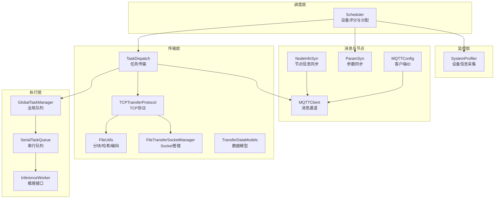
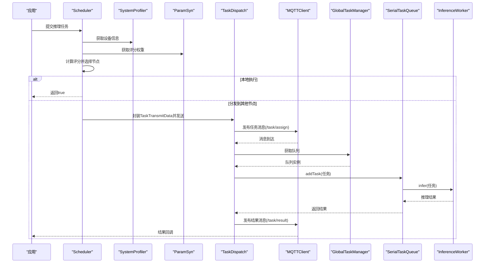
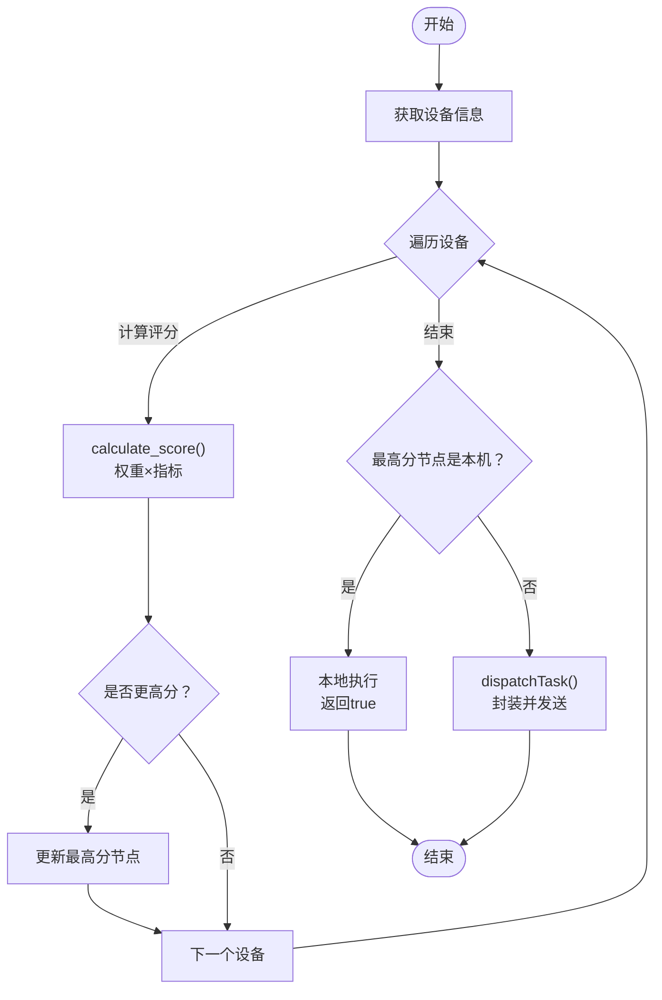
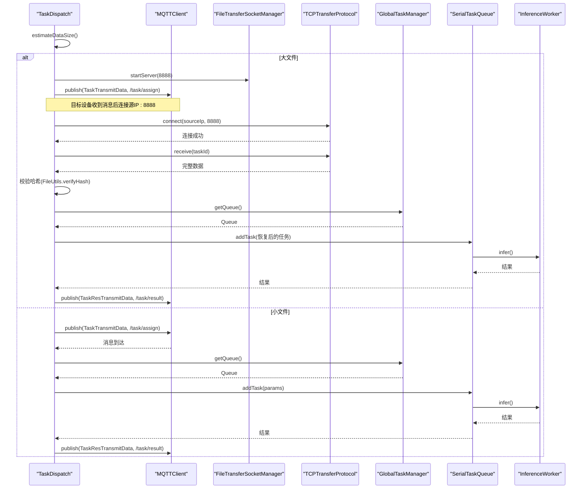
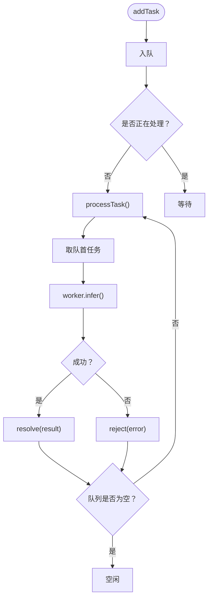
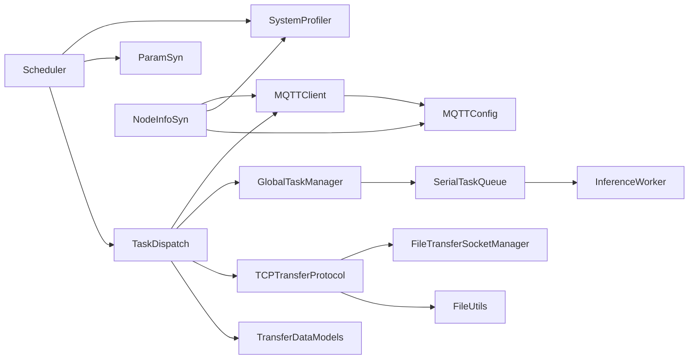

# 任务调度系统

<cite>
**本文引用的文件**
- [Scheduler.ets](file://entry/src/main/ets/manager/scheduler/Scheduler.ets)
- [TaskDispatch.ets](file://entry/src/main/ets/manager/broker/task/TaskDispatch.ets)
- [SerialTaskQueue.ets](file://entry/src/main/ets/manager/worker/SerialTaskQueue.ets)
- [GlobalTaskManager.ets](file://entry/src/main/ets/manager/worker/GlobalTaskManager.ets)
- [InferenceWorker.ets](file://entry/src/main/ets/manager/worker/InferenceWorker.ets)
- [SystemProfiler.ets](file://entry/src/main/ets/manager/monitor/SystemProfiler.ets)
- [ParamSyn.ets](file://entry/src/main/ets/manager/broker/paramOpt/ParamSyn.ets)
- [NodeInfoSyn.ets](file://entry/src/main/ets/manager/broker/monitor/NodeInfoSyn.ets)
- [MQTTClient.ets](file://entry/src/main/ets/manager/broker/MQTTClient.ets)
- [MQTTConfig.ets](file://entry/src/main/ets/manager/broker/MQTTConfig.ets)
- [TCPTransferProtocol.ets](file://entry/src/main/ets/manager/transfer/protocol/TCPTransferProtocol.ets)
- [FileUtils.ets](file://entry/src/main/ets/manager/transfer/utils/FileUtils.ets)
- [FileTransferSocketManager.ets](file://entry/src/main/ets/manager/transfer/socket/FileTransferSocketManager.ets)
- [TransferDataModels.ets](file://entry/src/main/ets/manager/transfer/model/TransferDataModels.ets)
</cite>

## 目录
1. [简介](#简介)
2. [项目结构](#项目结构)
3. [核心组件](#核心组件)
4. [架构总览](#架构总览)
5. [详细组件分析](#详细组件分析)
6. [依赖关系分析](#依赖关系分析)
7. [性能考量](#性能考量)
8. [故障排查指南](#故障排查指南)
9. [结论](#结论)
10. [附录](#附录)

## 简介
本文件面向任务调度系统，聚焦以下子功能：
- Scheduler 的设备评分算法与任务分配策略
- TaskDispatch 的任务序列化与跨设备传输机制（含 MQTT 与 TCP）
- 任务队列与执行链路（SerialTaskQueue、GlobalTaskManager、InferenceWorker）

文档提供代码级图示与流程图，帮助初学者理解整体工作流，同时为资深开发者提供实现细节、接口定义、参数与返回值说明、错误处理与优化建议。

## 项目结构
系统采用“模块化+分层”组织方式：
- scheduler：调度器，负责设备评分与任务分配
- broker：消息与节点信息同步，包括 MQTT、参数同步、节点信息同步
- worker：任务队列与推理执行
- transfer：传输协议与工具，支持 MQTT 直传与 TCP 大文件分块传输
- monitor：系统信息采集与设备信息聚合

图表来源
- [Scheduler.ets](file://entry/src/main/ets/manager/scheduler/Scheduler.ets#L14-L105)
- [TaskDispatch.ets](file://entry/src/main/ets/manager/broker/task/TaskDispatch.ets#L98-L302)
- [SystemProfiler.ets](file://entry/src/main/ets/manager/monitor/SystemProfiler.ets#L43-L120)
- [NodeInfoSyn.ets](file://entry/src/main/ets/manager/broker/monitor/NodeInfoSyn.ets#L40-L173)
- [ParamSyn.ets](file://entry/src/main/ets/manager/broker/paramOpt/ParamSyn.ets#L13-L40)
- [MQTTClient.ets](file://entry/src/main/ets/manager/broker/MQTTClient.ets#L24-L223)
- [MQTTConfig.ets](file://entry/src/main/ets/manager/broker/MQTTConfig.ets#L4-L7)
- [TCPTransferProtocol.ets](file://entry/src/main/ets/manager/transfer/protocol/TCPTransferProtocol.ets#L23-L351)
- [FileTransferSocketManager.ets](file://entry/src/main/ets/manager/transfer/socket/FileTransferSocketManager.ets#L31-L354)
- [FileUtils.ets](file://entry/src/main/ets/manager/transfer/utils/FileUtils.ets#L8-L193)
- [TransferDataModels.ets](file://entry/src/main/ets/manager/transfer/model/TransferDataModels.ets#L10-L113)
- [GlobalTaskManager.ets](file://entry/src/main/ets/manager/worker/GlobalTaskManager.ets#L4-L27)
- [SerialTaskQueue.ets](file://entry/src/main/ets/manager/worker/SerialTaskQueue.ets#L13-L103)
- [InferenceWorker.ets](file://entry/src/main/ets/manager/worker/InferenceWorker.ets#L1-L90)

章节来源
- [Scheduler.ets](file://entry/src/main/ets/manager/scheduler/Scheduler.ets#L14-L105)
- [TaskDispatch.ets](file://entry/src/main/ets/manager/broker/task/TaskDispatch.ets#L98-L302)
- [SystemProfiler.ets](file://entry/src/main/ets/manager/monitor/SystemProfiler.ets#L43-L120)

## 核心组件
- Scheduler：单例调度器，收集设备信息，计算评分，决定本地执行或分发
- TaskDispatch：任务传输编排，区分 MQTT 直传与 TCP 大文件传输，负责结果回传
- SerialTaskQueue：串行任务队列，保证推理任务顺序执行
- GlobalTaskManager：全局队列管理器，提供单例队列访问
- InferenceWorker：推理接口抽象，定义模型初始化与推理执行
- SystemProfiler：系统信息采集，提供设备性能指标
- NodeInfoSyn/ParamSyn：节点信息与参数的同步与广播
- MQTTClient/MQTTConfig：MQTT 客户端与配置
- TCPTransferProtocol/FileTransferSocketManager：TCP 传输协议与 Socket 管理
- FileUtils/TransferDataModels：文件分块、哈希、编码与传输数据模型

章节来源
- [Scheduler.ets](file://entry/src/main/ets/manager/scheduler/Scheduler.ets#L14-L105)
- [TaskDispatch.ets](file://entry/src/main/ets/manager/broker/task/TaskDispatch.ets#L98-L302)
- [SerialTaskQueue.ets](file://entry/src/main/ets/manager/worker/SerialTaskQueue.ets#L13-L103)
- [GlobalTaskManager.ets](file://entry/src/main/ets/manager/worker/GlobalTaskManager.ets#L4-L27)
- [InferenceWorker.ets](file://entry/src/main/ets/manager/worker/InferenceWorker.ets#L1-L90)
- [SystemProfiler.ets](file://entry/src/main/ets/manager/monitor/SystemProfiler.ets#L43-L120)
- [NodeInfoSyn.ets](file://entry/src/main/ets/manager/broker/monitor/NodeInfoSyn.ets#L40-L173)
- [ParamSyn.ets](file://entry/src/main/ets/manager/broker/paramOpt/ParamSyn.ets#L13-L40)
- [MQTTClient.ets](file://entry/src/main/ets/manager/broker/MQTTClient.ets#L24-L223)
- [MQTTConfig.ets](file://entry/src/main/ets/manager/broker/MQTTConfig.ets#L4-L7)
- [TCPTransferProtocol.ets](file://entry/src/main/ets/manager/transfer/protocol/TCPTransferProtocol.ets#L23-L351)
- [FileTransferSocketManager.ets](file://entry/src/main/ets/manager/transfer/socket/FileTransferSocketManager.ets#L31-L354)
- [FileUtils.ets](file://entry/src/main/ets/manager/transfer/utils/FileUtils.ets#L8-L193)
- [TransferDataModels.ets](file://entry/src/main/ets/manager/transfer/model/TransferDataModels.ets#L10-L113)

## 架构总览
系统通过 MQTT 广播设备信息与任务指令，调度器基于评分算法选择最优节点；小文件通过 MQTT 直传，大文件通过 TCP 分块传输；接收端将任务入队执行并回传结果。

图表来源
- [Scheduler.ets](file://entry/src/main/ets/manager/scheduler/Scheduler.ets#L30-L103)
- [TaskDispatch.ets](file://entry/src/main/ets/manager/broker/task/TaskDispatch.ets#L107-L212)
- [GlobalTaskManager.ets](file://entry/src/main/ets/manager/worker/GlobalTaskManager.ets#L16-L21)
- [SerialTaskQueue.ets](file://entry/src/main/ets/manager/worker/SerialTaskQueue.ets#L24-L82)
- [InferenceWorker.ets](file://entry/src/main/ets/manager/worker/InferenceWorker.ets#L76-L89)
- [MQTTClient.ets](file://entry/src/main/ets/manager/broker/MQTTClient.ets#L153-L182)

## 详细组件分析

### Scheduler：设备评分与任务分配
- 单例模式，全局唯一调度实例
- 工作流程
  - 收集设备信息：从 SystemProfiler 获取设备集合
  - 遍历设备，计算评分：使用 ParamSyn 的权重参数与设备指标
  - 选择最高分节点：若最高分不是本机，则分发任务
  - 本地执行：返回 true，由调用方继续处理
- 评分算法
  - 输入：设备指标（CPU、内存、电量、存储、延迟）
  - 权重：ParamSyn.getNewParam() 返回的数组
  - 计算：加权求和，评分越高越适合执行
- 任务分发
  - 封装 TaskTransmitData（包含任务ID、来源/去向、时间戳、参数）
  - 通过 TaskDispatch 发送到目标节点

图表来源
- [Scheduler.ets](file://entry/src/main/ets/manager/scheduler/Scheduler.ets#L30-L103)
- [ParamSyn.ets](file://entry/src/main/ets/manager/broker/paramOpt/ParamSyn.ets#L35-L37)
- [SystemProfiler.ets](file://entry/src/main/ets/manager/monitor/SystemProfiler.ets#L47-L81)

章节来源
- [Scheduler.ets](file://entry/src/main/ets/manager/scheduler/Scheduler.ets#L14-L105)
- [ParamSyn.ets](file://entry/src/main/ets/manager/broker/paramOpt/ParamSyn.ets#L13-L40)
- [SystemProfiler.ets](file://entry/src/main/ets/manager/monitor/SystemProfiler.ets#L43-L120)

### TaskDispatch：任务序列化与跨设备传输
- 任务数据模型
  - TaskTransmitData：携带任务ID、来源/去向、时间戳、推理任务参数、可选传输类型与源IP
  - TaskResTransmitData：结果回传载体
- 传输策略
  - 小文件（< 2MB）：直接通过 MQTT 发布到 /task/assign
  - 大文件（≥ 2MB）：启动 TCP 服务器，发布包含源IP与传输类型的任务消息，目标设备主动连接并传输
- 接收与执行
  - 若消息目标为本机：加入全局队列执行，完成后回传结果
  - 若为 TCP 大文件：建立连接，接收分块，校验哈希，恢复数据后执行
- 结果回传
  - 通过 MQTT 发布到 /task/result

图表来源
- [TaskDispatch.ets](file://entry/src/main/ets/manager/broker/task/TaskDispatch.ets#L107-L281)
- [TCPTransferProtocol.ets](file://entry/src/main/ets/manager/transfer/protocol/TCPTransferProtocol.ets#L80-L240)
- [FileTransferSocketManager.ets](file://entry/src/main/ets/manager/transfer/socket/FileTransferSocketManager.ets#L63-L228)
- [FileUtils.ets](file://entry/src/main/ets/manager/transfer/utils/FileUtils.ets#L107-L115)
- [GlobalTaskManager.ets](file://entry/src/main/ets/manager/worker/GlobalTaskManager.ets#L16-L21)
- [SerialTaskQueue.ets](file://entry/src/main/ets/manager/worker/SerialTaskQueue.ets#L24-L82)
- [InferenceWorker.ets](file://entry/src/main/ets/manager/worker/InferenceWorker.ets#L76-L89)

章节来源
- [TaskDispatch.ets](file://entry/src/main/ets/manager/broker/task/TaskDispatch.ets#L98-L302)
- [TCPTransferProtocol.ets](file://entry/src/main/ets/manager/transfer/protocol/TCPTransferProtocol.ets#L23-L351)
- [FileTransferSocketManager.ets](file://entry/src/main/ets/manager/transfer/socket/FileTransferSocketManager.ets#L31-L354)
- [FileUtils.ets](file://entry/src/main/ets/manager/transfer/utils/FileUtils.ets#L8-L193)

### SerialTaskQueue：任务序列化机制
- 串行执行：确保同一队列内任务按提交顺序串行执行
- Promise 包装：addTask 返回 Promise，便于调用方等待结果
- 状态控制：isProcessing 控制并发，避免重复处理
- 异常处理：捕获执行异常并 reject，保证队列健康
- 清理：shutdown 时拒绝队列中剩余任务并清空

图表来源
- [SerialTaskQueue.ets](file://entry/src/main/ets/manager/worker/SerialTaskQueue.ets#L24-L82)

章节来源
- [SerialTaskQueue.ets](file://entry/src/main/ets/manager/worker/SerialTaskQueue.ets#L13-L103)
- [GlobalTaskManager.ets](file://entry/src/main/ets/manager/worker/GlobalTaskManager.ets#L4-L27)

### InferenceWorker：推理接口与任务模型
- InferenceTask：包含任务ID、模型名、输入类型与数据、可选参数
- InferenceResult：包含执行状态、可选消息与结果数据
- InferenceWorker 接口：initModel、infer、isInitialized、release（可选）
- 支持多种输入类型：图像、文本、音频、视频、其他

章节来源
- [InferenceWorker.ets](file://entry/src/main/ets/manager/worker/InferenceWorker.ets#L1-L90)

### SystemProfiler/NodeInfoSyn/ParamSyn：设备信息与参数同步
- SystemProfiler：采集 CPU、内存、存储、电量、延迟，合并本机与其它节点信息
- NodeInfoSyn：广播本机设备信息，接收并维护其它节点信息，支持延迟测试
- ParamSyn：接收参数更新消息，维护当前生效的权重数组

章节来源
- [SystemProfiler.ets](file://entry/src/main/ets/manager/monitor/SystemProfiler.ets#L43-L120)
- [NodeInfoSyn.ets](file://entry/src/main/ets/manager/broker/monitor/NodeInfoSyn.ets#L40-L173)
- [ParamSyn.ets](file://entry/src/main/ets/manager/broker/paramOpt/ParamSyn.ets#L13-L40)

### MQTTClient/MQTTConfig：消息通道
- 单例客户端，自动连接、订阅基础主题
- 订阅 /device/list、/device/status、/task/assign、/task/result、/optimization/param、/test/latency
- 事件派发：RESULT_EVENT_ID 用于结果消息

章节来源
- [MQTTClient.ets](file://entry/src/main/ets/manager/broker/MQTTClient.ets#L24-L223)
- [MQTTConfig.ets](file://entry/src/main/ets/manager/broker/MQTTConfig.ets#L4-L7)

### TCPTransferProtocol/FileTransferSocketManager/FileUtils/TransferDataModels：传输协议与工具
- TCPTransferProtocol：分块传输、握手、进度跟踪、事件触发、取消与清理
- FileTransferSocketManager：统一管理 TCP 服务器与客户端连接
- FileUtils：分块、重组、哈希计算与校验、Base64 编解码
- TransferDataModels：文件信息、分块数据、传输任务、握手消息、传输配置

章节来源
- [TCPTransferProtocol.ets](file://entry/src/main/ets/manager/transfer/protocol/TCPTransferProtocol.ets#L23-L351)
- [FileTransferSocketManager.ets](file://entry/src/main/ets/manager/transfer/socket/FileTransferSocketManager.ets#L31-L354)
- [FileUtils.ets](file://entry/src/main/ets/manager/transfer/utils/FileUtils.ets#L8-L193)
- [TransferDataModels.ets](file://entry/src/main/ets/manager/transfer/model/TransferDataModels.ets#L10-L113)

## 依赖关系分析
- Scheduler 依赖 SystemProfiler、ParamSyn、TaskDispatch
- TaskDispatch 依赖 MQTTClient、GlobalTaskManager、SerialTaskQueue、InferenceWorker、TCPTransferProtocol、FileUtils
- GlobalTaskManager 依赖 SerialTaskQueue
- SerialTaskQueue 依赖 InferenceWorker
- TCPTransferProtocol 依赖 FileTransferSocketManager、FileUtils、TransferDataModels
- NodeInfoSyn 依赖 MQTTClient、SystemProfiler、MQTTConfig
- MQTTClient 依赖 MQTTConfig

图表来源
- [Scheduler.ets](file://entry/src/main/ets/manager/scheduler/Scheduler.ets#L1-L105)
- [TaskDispatch.ets](file://entry/src/main/ets/manager/broker/task/TaskDispatch.ets#L1-L302)
- [GlobalTaskManager.ets](file://entry/src/main/ets/manager/worker/GlobalTaskManager.ets#L1-L27)
- [SerialTaskQueue.ets](file://entry/src/main/ets/manager/worker/SerialTaskQueue.ets#L1-L103)
- [InferenceWorker.ets](file://entry/src/main/ets/manager/worker/InferenceWorker.ets#L1-L90)
- [SystemProfiler.ets](file://entry/src/main/ets/manager/monitor/SystemProfiler.ets#L1-L120)
- [NodeInfoSyn.ets](file://entry/src/main/ets/manager/broker/monitor/NodeInfoSyn.ets#L1-L173)
- [MQTTClient.ets](file://entry/src/main/ets/manager/broker/MQTTClient.ets#L1-L223)
- [MQTTConfig.ets](file://entry/src/main/ets/manager/broker/MQTTConfig.ets#L1-L7)
- [TCPTransferProtocol.ets](file://entry/src/main/ets/manager/transfer/protocol/TCPTransferProtocol.ets#L1-L351)
- [FileTransferSocketManager.ets](file://entry/src/main/ets/manager/transfer/socket/FileTransferSocketManager.ets#L1-L354)
- [FileUtils.ets](file://entry/src/main/ets/manager/transfer/utils/FileUtils.ets#L1-L193)
- [TransferDataModels.ets](file://entry/src/main/ets/manager/transfer/model/TransferDataModels.ets#L1-L113)

## 性能考量
- 评分算法复杂度：O(N)，N 为在线设备数量，适合局域网规模
- 任务队列串行：避免并发冲突，但吞吐受限；可考虑按任务类型拆分队列
- MQTT 直传：低延迟，适合小文件；大文件切换 TCP，避免消息体过大
- TCP 分块传输：默认 128KB 块，可配置；带重试与哈希校验，保证可靠性
- 系统信息采集：异步任务池执行 CPU 采集，降低主线程阻塞
- 延迟测试：定期更新，影响评分权重

[本节为通用性能讨论，不直接分析具体文件]

## 故障排查指南
- MQTT 未初始化
  - 现象：获取实例时报错
  - 处理：确保先调用初始化流程，再获取实例
  - 参考：[MQTTClient.ets](file://entry/src/main/ets/manager/broker/MQTTClient.ets#L52-L58)
- 任务未执行
  - 现象：本地未收到任务或队列为空
  - 处理：确认目标设备名称与 ownName 一致；检查 /task/assign 订阅
  - 参考：[TaskDispatch.ets](file://entry/src/main/ets/manager/broker/task/TaskDispatch.ets#L199-L211)
- 大文件传输失败
  - 现象：TCP 连接或分块发送失败
  - 处理：检查源IP获取、端口占用、防火墙；查看重试与超时配置
  - 参考：[TaskDispatch.ets](file://entry/src/main/ets/manager/broker/task/TaskDispatch.ets#L133-L165), [TCPTransferProtocol.ets](file://entry/src/main/ets/manager/transfer/protocol/TCPTransferProtocol.ets#L123-L205)
- 哈希校验失败
  - 现象：接收端提示校验失败
  - 处理：确认发送端哈希计算与接收端校验一致
  - 参考：[FileUtils.ets](file://entry/src/main/ets/manager/transfer/utils/FileUtils.ets#L107-L115)
- 评分异常
  - 现象：选择节点不符合预期
  - 处理：检查 ParamSyn 权重更新、SystemProfiler 指标采集
  - 参考：[ParamSyn.ets](file://entry/src/main/ets/manager/broker/paramOpt/ParamSyn.ets#L25-L37), [SystemProfiler.ets](file://entry/src/main/ets/manager/monitor/SystemProfiler.ets#L47-L81)

章节来源
- [MQTTClient.ets](file://entry/src/main/ets/manager/broker/MQTTClient.ets#L52-L58)
- [TaskDispatch.ets](file://entry/src/main/ets/manager/broker/task/TaskDispatch.ets#L133-L165)
- [TCPTransferProtocol.ets](file://entry/src/main/ets/manager/transfer/protocol/TCPTransferProtocol.ets#L123-L205)
- [FileUtils.ets](file://entry/src/main/ets/manager/transfer/utils/FileUtils.ets#L107-L115)
- [ParamSyn.ets](file://entry/src/main/ets/manager/broker/paramOpt/ParamSyn.ets#L25-L37)
- [SystemProfiler.ets](file://entry/src/main/ets/manager/monitor/SystemProfiler.ets#L47-L81)

## 结论
本系统通过 MQTT 与 TCP 协同实现任务的高效分发与可靠执行，调度器以评分算法驱动决策，任务队列保障串行一致性，传输层提供灵活的大文件处理能力。建议在生产环境中：
- 动态调整 ParamSyn 权重以适配不同场景
- 对高并发场景引入队列拆分与负载均衡
- 加强 TCP 传输的握手与心跳机制
- 增加任务超时与重试策略

[本节为总结性内容，不直接分析具体文件]

## 附录

### 接口与数据模型速览
- InferenceTask/InferenceResult：推理任务与结果
- TaskTransmitData/TaskResTransmitData：任务与结果传输载体
- DeviceInfo：设备性能指标
- TransferOptions：传输配置（阈值、块大小、重试、超时、端口）

章节来源
- [InferenceWorker.ets](file://entry/src/main/ets/manager/worker/InferenceWorker.ets#L1-L90)
- [TaskDispatch.ets](file://entry/src/main/ets/manager/broker/task/TaskDispatch.ets#L16-L92)
- [SystemProfiler.ets](file://entry/src/main/ets/manager/monitor/SystemProfiler.ets#L10-L33)
- [TransferDataModels.ets](file://entry/src/main/ets/manager/transfer/model/TransferDataModels.ets#L100-L112)