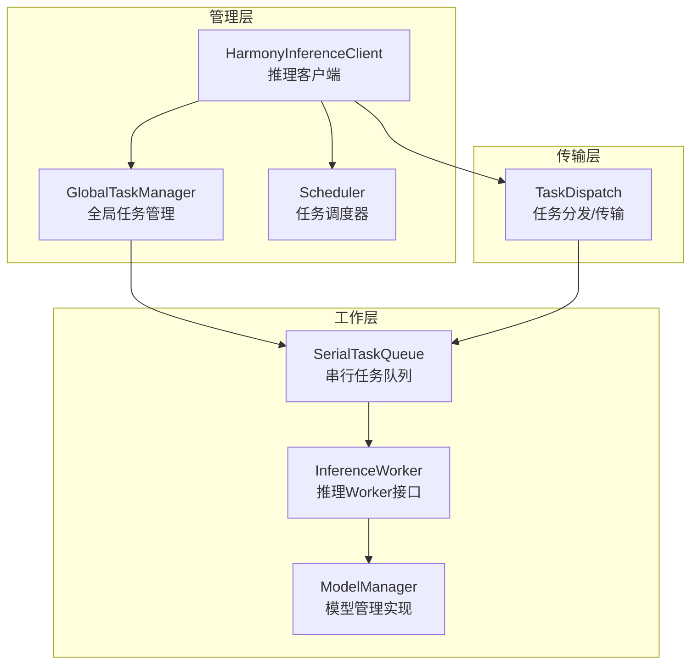
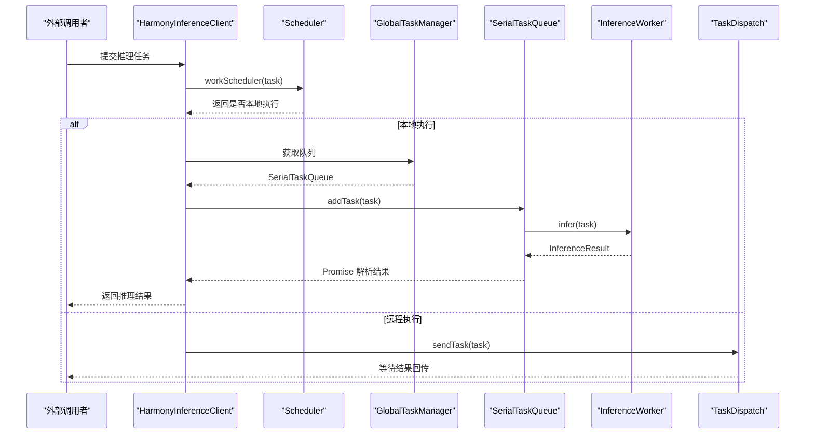
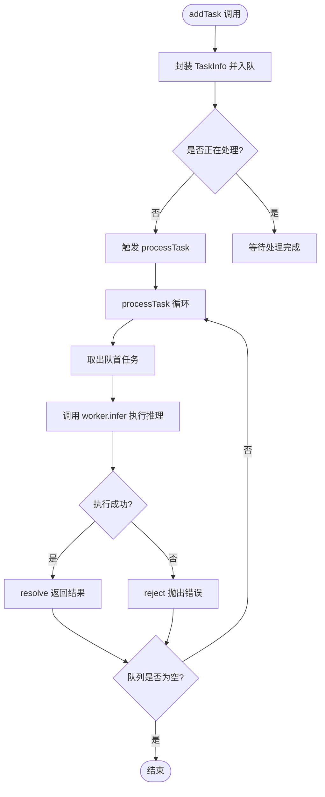
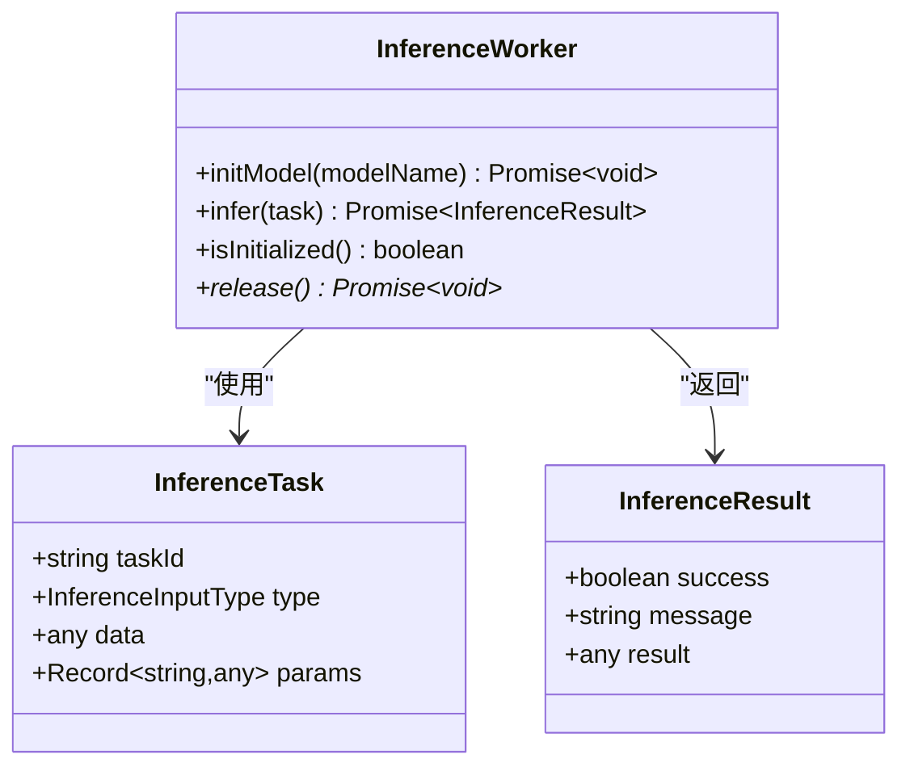
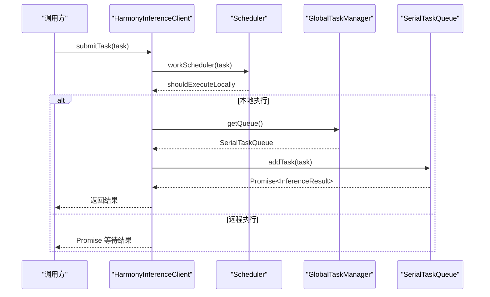
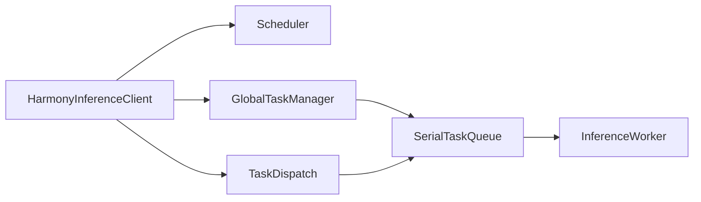

# 串行任务队列

<cite>
**本文档引用的文件**
- [SerialTaskQueue.ets](file://entry/src/main/ets/manager/worker/SerialTaskQueue.ets)
- [InferenceWorker.ets](file://entry/src/main/ets/manager/worker/InferenceWorker.ets)
- [HarmonyInferenceClient.ets](file://entry/src/main/ets/manager/HarmonyInferenceClient.ets)
- [GlobalTaskManager.ets](file://entry/src/main/ets/manager/worker/GlobalTaskManager.ets)
- [Scheduler.ets](file://entry/src/main/ets/manager/scheduler/Scheduler.ets)
- [TaskDispatch.ets](file://entry/src/main/ets/manager/broker/task/TaskDispatch.ets)
- [ImageIdModelManager.ets](file://entry/src/main/ets/TestImageTask/ImageIdModelManager.ets)
</cite>

## 目录
1. [简介](#简介)
2. [项目结构](#项目结构)
3. [核心组件](#核心组件)
4. [架构概览](#架构概览)
5. [详细组件分析](#详细组件分析)
6. [依赖关系分析](#依赖关系分析)
7. [性能考量](#性能考量)
8. [故障排查指南](#故障排查指南)
9. [结论](#结论)

## 简介
本文件面向串行任务队列的设计与实现，重点阐述 SerialTaskQueue 的设计原理、任务执行顺序控制与并发管理机制。文档从系统架构、组件关系、数据流与处理逻辑入手，结合 InferenceWorker 的交互模式、任务优先级处理与错误恢复机制，提供性能优化建议、内存管理策略与线程安全考虑，并记录队列容量限制、超时处理与异常清理机制。

## 项目结构
该模块位于应用入口的 ETS 层，围绕“推理任务”展开，包含以下关键目录与文件：
- manager/worker：串行任务队列与推理 Worker 的实现
- manager：推理客户端、调度器与任务分发模块
- TestImageTask：模型管理与推理实现示例
- broker：任务传输协议与网络通信支持

图表来源
- [HarmonyInferenceClient.ets](file://entry/src/main/ets/manager/HarmonyInferenceClient.ets#L52-L357)
- [GlobalTaskManager.ets](file://entry/src/main/ets/manager/worker/GlobalTaskManager.ets#L4-L27)
- [SerialTaskQueue.ets](file://entry/src/main/ets/manager/worker/SerialTaskQueue.ets#L13-L104)
- [InferenceWorker.ets](file://entry/src/main/ets/manager/worker/InferenceWorker.ets#L75-L90)
- [TaskDispatch.ets](file://entry/src/main/ets/manager/broker/task/TaskDispatch.ets#L98-L302)

章节来源
- [HarmonyInferenceClient.ets](file://entry/src/main/ets/manager/HarmonyInferenceClient.ets#L52-L357)
- [GlobalTaskManager.ets](file://entry/src/main/ets/manager/worker/GlobalTaskManager.ets#L4-L27)
- [SerialTaskQueue.ets](file://entry/src/main/ets/manager/worker/SerialTaskQueue.ets#L13-L104)
- [InferenceWorker.ets](file://entry/src/main/ets/manager/worker/InferenceWorker.ets#L75-L90)
- [TaskDispatch.ets](file://entry/src/main/ets/manager/broker/task/TaskDispatch.ets#L98-L302)

## 核心组件
- 串行任务队列 SerialTaskQueue：负责任务入队、串行执行、状态管理与异常处理。
- 推理 Worker 接口 InferenceWorker：定义模型初始化、推理执行与资源释放等能力。
- 推理客户端 HarmonyInferenceClient：对外暴露统一的提交任务接口，内部协调调度与队列。
- 全局任务管理 GlobalTaskManager：提供全局唯一的串行队列实例。
- 任务分发 TaskDispatch：负责跨设备任务传输、大文件 TCP 传输与结果回传。
- 调度器 Scheduler：基于设备性能评分进行任务本地/远程执行决策。

章节来源
- [SerialTaskQueue.ets](file://entry/src/main/ets/manager/worker/SerialTaskQueue.ets#L13-L104)
- [InferenceWorker.ets](file://entry/src/main/ets/manager/worker/InferenceWorker.ets#L75-L90)
- [HarmonyInferenceClient.ets](file://entry/src/main/ets/manager/HarmonyInferenceClient.ets#L52-L357)
- [GlobalTaskManager.ets](file://entry/src/main/ets/manager/worker/GlobalTaskManager.ets#L4-L27)
- [TaskDispatch.ets](file://entry/src/main/ets/manager/broker/task/TaskDispatch.ets#L98-L302)
- [Scheduler.ets](file://entry/src/main/ets/manager/scheduler/Scheduler.ets#L14-L105)

## 架构概览
串行任务队列在整体架构中承担“本地执行”的核心角色，其工作流如下：
- 外部通过 HarmonyInferenceClient 提交任务；
- Scheduler 决策本地执行还是远程分发；
- 若本地执行，HarmonyInferenceClient 将任务交由 GlobalTaskManager 获取的 SerialTaskQueue；
- SerialTaskQueue 以串行方式调用 InferenceWorker.infer 执行推理；
- 任务完成后通过 Promise 回传结果；
- 若远程执行，HarmonyInferenceClient 通过 TaskDispatch 发送任务并等待结果回传。

图表来源
- [HarmonyInferenceClient.ets](file://entry/src/main/ets/manager/HarmonyInferenceClient.ets#L309-L353)
- [Scheduler.ets](file://entry/src/main/ets/manager/scheduler/Scheduler.ets#L30-L57)
- [GlobalTaskManager.ets](file://entry/src/main/ets/manager/worker/GlobalTaskManager.ets#L16-L21)
- [SerialTaskQueue.ets](file://entry/src/main/ets/manager/worker/SerialTaskQueue.ets#L24-L83)
- [TaskDispatch.ets](file://entry/src/main/ets/manager/broker/task/TaskDispatch.ets#L107-L126)

## 详细组件分析

### SerialTaskQueue 串行任务队列
- 数据结构
  - 使用链表作为底层容器，保证入队/出队的 O(1) 复杂度。
  - 维护 isProcessing 标志位，确保串行执行。
- 任务入队 addTask
  - 生成唯一 taskId，封装 TaskInfo 并加入队列。
  - 若当前未在处理，则立即触发 processTask。
- 任务出队与执行 processTask
  - 取出队首任务，调用 worker.infer 执行推理。
  - 成功则 resolve，失败则 reject。
  - finally 中重置 isProcessing，并递归继续处理剩余任务。
- 异常与清理
  - shutdown 清空队列并拒绝所有任务，重置状态。
- 监控与查询
  - 提供 getQueueLength 查询当前队列长度。

图表来源
- [SerialTaskQueue.ets](file://entry/src/main/ets/manager/worker/SerialTaskQueue.ets#L24-L83)

章节来源
- [SerialTaskQueue.ets](file://entry/src/main/ets/manager/worker/SerialTaskQueue.ets#L13-L104)

### InferenceWorker 推理 Worker 接口
- 角色定位：抽象推理执行能力，屏蔽具体模型实现细节。
- 关键方法
  - initModel：模型初始化
  - infer：执行推理，返回 Promise<InferenceResult>
  - isInitialized：检查初始化状态
  - release（可选）：释放资源
- 数据模型
  - InferenceTask：包含任务标识、输入类型与数据、参数等
  - InferenceResult：包含执行状态、消息与结果数据

图表来源
- [InferenceWorker.ets](file://entry/src/main/ets/manager/worker/InferenceWorker.ets#L2-L90)

章节来源
- [InferenceWorker.ets](file://entry/src/main/ets/manager/worker/InferenceWorker.ets#L2-L90)

### HarmonyInferenceClient 推理客户端
- 单例模式，负责初始化 MQTT、事件监听、模型加载与全局队列初始化。
- submitTask 主流程
  - 调用 Scheduler 决策本地/远程执行。
  - 本地执行：通过 GlobalTaskManager 获取队列并 addTask。
  - 远程执行：等待结果回传，带超时控制。
- 任务状态与结果管理
  - 维护 taskStatusMap 与 taskResultMap，支持查询与清理。

图表来源
- [HarmonyInferenceClient.ets](file://entry/src/main/ets/manager/HarmonyInferenceClient.ets#L309-L353)
- [Scheduler.ets](file://entry/src/main/ets/manager/scheduler/Scheduler.ets#L30-L57)
- [GlobalTaskManager.ets](file://entry/src/main/ets/manager/worker/GlobalTaskManager.ets#L16-L21)
- [SerialTaskQueue.ets](file://entry/src/main/ets/manager/worker/SerialTaskQueue.ets#L24-L83)

章节来源
- [HarmonyInferenceClient.ets](file://entry/src/main/ets/manager/HarmonyInferenceClient.ets#L52-L357)

### GlobalTaskManager 全局任务管理
- 单例模式，负责创建与提供全局唯一的 SerialTaskQueue 实例。
- 提供初始化与查询接口，避免重复初始化。

章节来源
- [GlobalTaskManager.ets](file://entry/src/main/ets/manager/worker/GlobalTaskManager.ets#L4-L27)

### Scheduler 任务调度器
- 基于设备性能评分选择最优节点，决定本地执行或远程分发。
- 评分公式综合 CPU、内存、电量、存储与延迟等指标。

章节来源
- [Scheduler.ets](file://entry/src/main/ets/manager/scheduler/Scheduler.ets#L14-L105)

### TaskDispatch 任务分发与传输
- 支持小文件直接通过 MQTT 传输，大文件通过 TCP 协议传输。
- 接收任务时，若目标设备为本机则加入全局队列执行并回传结果。
- 提供结果解析与过滤，仅保留本设备发出的任务结果。

章节来源
- [TaskDispatch.ets](file://entry/src/main/ets/manager/broker/task/TaskDispatch.ets#L98-L302)

### ModelManager 模型管理实现（示例）
- 实现 InferenceWorker 接口，提供图像推理能力。
- 包含模型初始化、图像预处理、推理执行与结果提取等逻辑。

章节来源
- [ImageIdModelManager.ets](file://entry/src/main/ets/TestImageTask/ImageIdModelManager.ets#L31-L258)

## 依赖关系分析
- 组件耦合
  - HarmonyInferenceClient 依赖 Scheduler、GlobalTaskManager、TaskDispatch。
  - SerialTaskQueue 依赖 InferenceWorker。
  - TaskDispatch 依赖 GlobalTaskManager 与网络传输模块。
- 外部依赖
  - ArkTS LinkedList 用于队列存储。
  - MQTT 与 TCP 传输协议用于跨设备通信。
  - 系统服务与事件总线用于设备状态同步与事件监听。

图表来源
- [HarmonyInferenceClient.ets](file://entry/src/main/ets/manager/HarmonyInferenceClient.ets#L52-L357)
- [GlobalTaskManager.ets](file://entry/src/main/ets/manager/worker/GlobalTaskManager.ets#L4-L27)
- [SerialTaskQueue.ets](file://entry/src/main/ets/manager/worker/SerialTaskQueue.ets#L13-L21)
- [TaskDispatch.ets](file://entry/src/main/ets/manager/broker/task/TaskDispatch.ets#L98-L302)

章节来源
- [HarmonyInferenceClient.ets](file://entry/src/main/ets/manager/HarmonyInferenceClient.ets#L52-L357)
- [GlobalTaskManager.ets](file://entry/src/main/ets/manager/worker/GlobalTaskManager.ets#L4-L27)
- [SerialTaskQueue.ets](file://entry/src/main/ets/manager/worker/SerialTaskQueue.ets#L13-L21)
- [TaskDispatch.ets](file://entry/src/main/ets/manager/broker/task/TaskDispatch.ets#L98-L302)

## 性能考量
- 队列复杂度
  - 入队/出队基于链表，时间复杂度 O(1)，空间复杂度 O(n)。
- 串行执行优势
  - 避免多任务并发竞争共享资源，简化状态一致性问题。
- 并发与吞吐
  - 串行队列天然限制并发度，适合资源受限或需要严格顺序的场景。
- 传输优化
  - 大文件走 TCP，减少 MQTT 压力；小文件直传提升响应速度。
- 资源管理
  - 建议在 InferenceWorker 中实现 release 方法，及时释放模型与中间数据。
  - 对于图像等大对象，尽量在推理前完成预处理，避免重复计算。

## 故障排查指南
- 任务超时
  - 远程执行场景下，submitTask 设置 30 秒超时，可通过增加超时时间或优化网络条件缓解。
- 队列积压
  - 通过 getQueueLength 监控队列长度，必要时调整任务提交速率或拆分任务。
- 异常恢复
  - SerialTaskQueue 的 processTask 已捕获执行异常并 reject，上层应妥善处理 Promise 拒绝。
  - shutdown 可清空队列并拒绝所有任务，适用于优雅停机或重启。
- 网络传输
  - 大文件传输需确保 TCP 服务器启动与目标设备可达，校验文件哈希防止数据损坏。

章节来源
- [HarmonyInferenceClient.ets](file://entry/src/main/ets/manager/HarmonyInferenceClient.ets#L342-L346)
- [SerialTaskQueue.ets](file://entry/src/main/ets/manager/worker/SerialTaskQueue.ets#L85-L97)
- [TaskDispatch.ets](file://entry/src/main/ets/manager/broker/task/TaskDispatch.ets#L133-L165)

## 结论
SerialTaskQueue 通过串行执行与轻量级队列结构，提供了稳定可靠的本地推理执行能力。配合 HarmonyInferenceClient 的统一入口、Scheduler 的智能调度与 TaskDispatch 的跨设备传输，形成从任务提交到结果回传的完整闭环。对于高并发或大规模推理需求，可在保持串行队列核心不变的前提下，引入多队列或多 Worker 并行化策略，并完善优先级与超时控制，以进一步提升系统吞吐与稳定性。