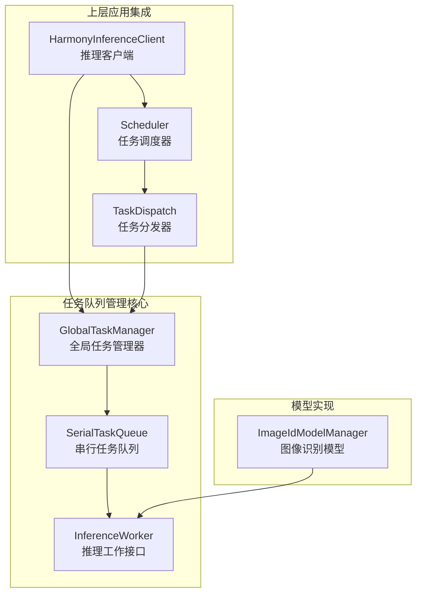
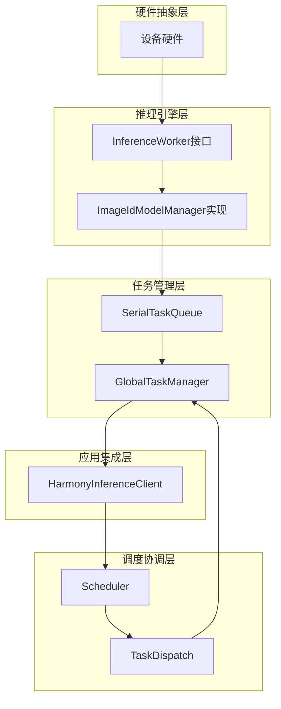
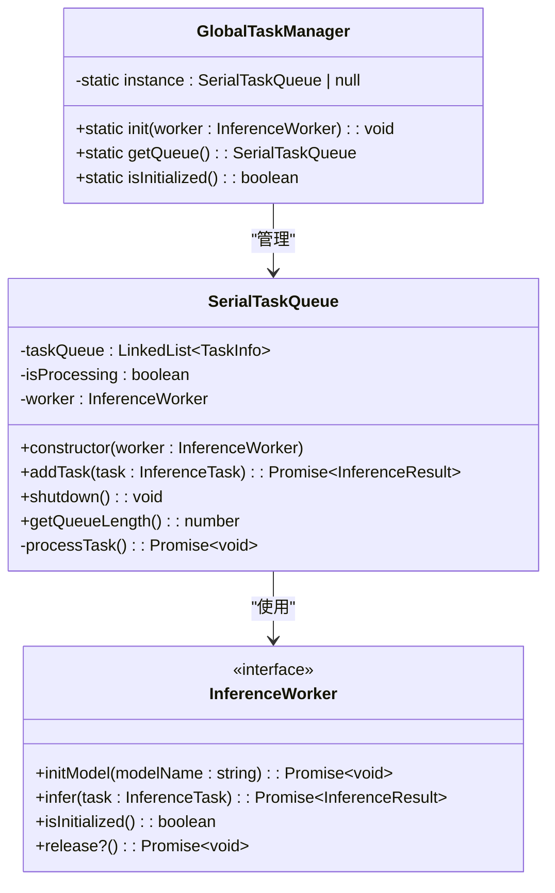
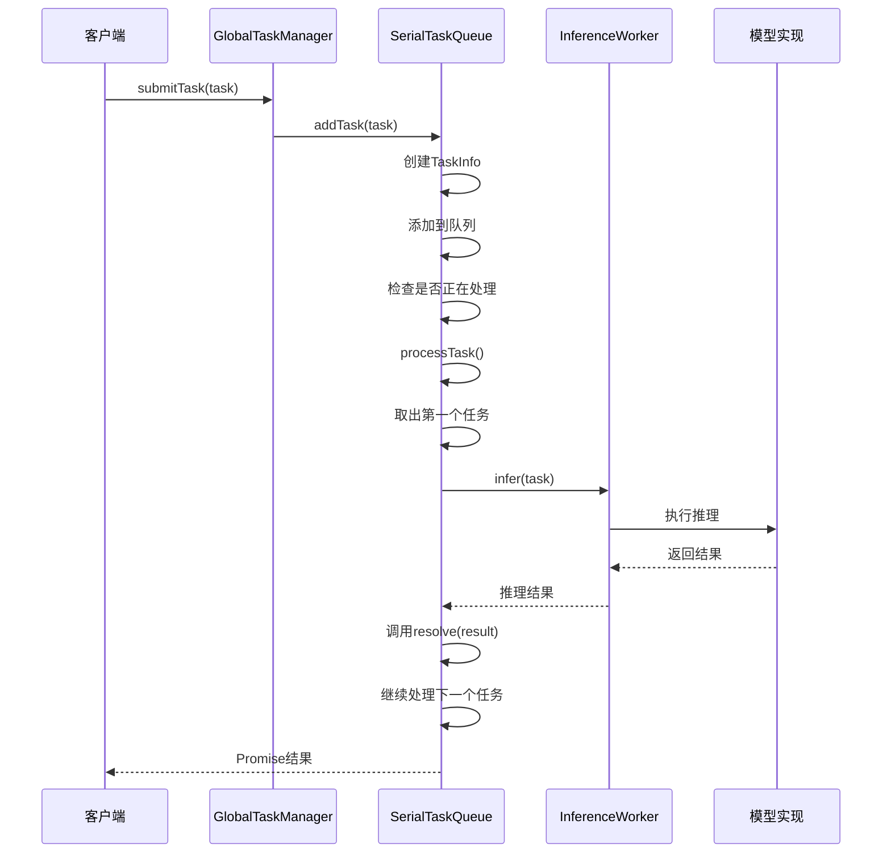
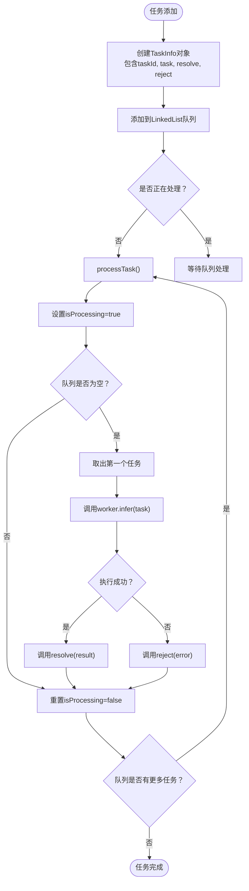
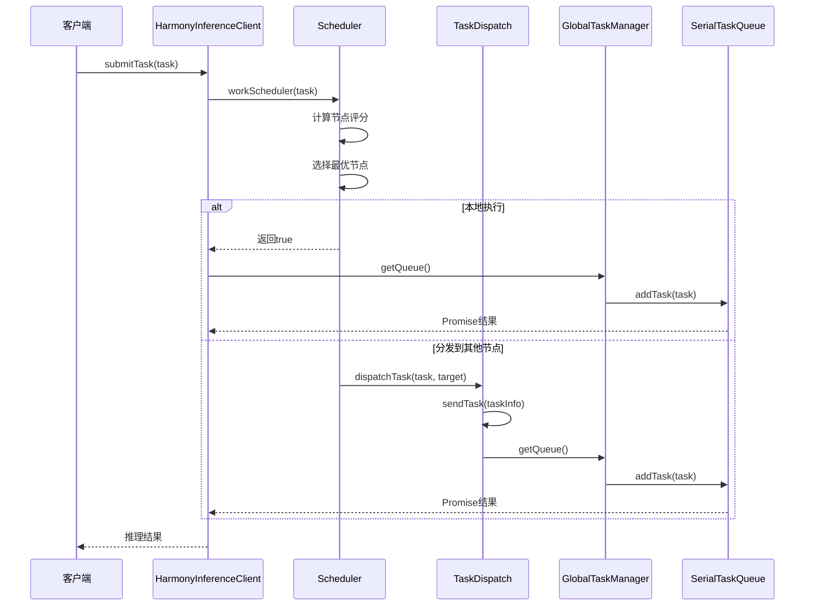
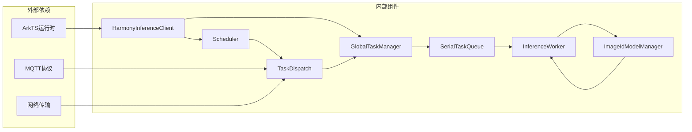

# 任务队列管理

<cite>
**本文档引用的文件**
- [GlobalTaskManager.ets](file://entry/src/main/ets/manager/worker/GlobalTaskManager.ets)
- [SerialTaskQueue.ets](file://entry/src/main/ets/manager/worker/SerialTaskQueue.ets)
- [InferenceWorker.ets](file://entry/src/main/ets/manager/worker/InferenceWorker.ets)
- [HarmonyInferenceClient.ets](file://entry/src/main/ets/manager/HarmonyInferenceClient.ets)
- [TaskDispatch.ets](file://entry/src/main/ets/manager/broker/task/TaskDispatch.ets)
- [ImageIdModelManager.ets](file://entry/src/main/ets/TestImageTask/ImageIdModelManager.ets)
- [Scheduler.ets](file://entry/src/main/ets/manager/scheduler/Scheduler.ets)
</cite>

## 目录
1. [简介](#简介)
2. [项目结构](#项目结构)
3. [核心组件](#核心组件)
4. [架构概览](#架构概览)
5. [详细组件分析](#详细组件分析)
6. [依赖关系分析](#依赖关系分析)
7. [性能考虑](#性能考虑)
8. [故障排除指南](#故障排除指南)
9. [结论](#结论)

## 简介

任务队列管理系统是一个基于 OpenHarmony 平台的分布式推理任务管理框架。该系统实现了全局状态管理、串行任务队列控制以及智能任务调度功能，支持多设备协作的推理任务执行。

系统的核心特性包括：
- **全局状态管理**：通过 GlobalTaskManager 提供统一的任务队列访问接口
- **串行执行控制**：确保推理任务按顺序执行，避免并发冲突
- **智能任务调度**：根据设备性能动态分配任务执行位置
- **分布式任务传输**：支持设备间任务和结果的可靠传输
- **异步任务处理**：基于 Promise 的非阻塞任务提交机制

## 项目结构

任务队列管理系统主要分布在以下目录结构中：



**图表来源**
- [GlobalTaskManager.ets](file://entry/src/main/ets/manager/worker/GlobalTaskManager.ets#L1-L27)
- [SerialTaskQueue.ets](file://entry/src/main/ets/manager/worker/SerialTaskQueue.ets#L1-L103)
- [HarmonyInferenceClient.ets](file://entry/src/main/ets/manager/HarmonyInferenceClient.ets#L1-L357)

**章节来源**
- [GlobalTaskManager.ets](file://entry/src/main/ets/manager/worker/GlobalTaskManager.ets#L1-L27)
- [SerialTaskQueue.ets](file://entry/src/main/ets/manager/worker/SerialTaskQueue.ets#L1-L103)
- [HarmonyInferenceClient.ets](file://entry/src/main/ets/manager/HarmonyInferenceClient.ets#L1-L357)

## 核心组件

### GlobalTaskManager - 全局任务管理器

GlobalTaskManager 是一个单例模式的全局任务管理器，负责维护和提供对任务队列的全局访问。

**主要功能**：
- 单例实例管理
- 任务队列初始化
- 全局访问接口提供

**关键方法**：
- `init(worker: InferenceWorker)`：初始化全局任务队列
- `getQueue(): SerialTaskQueue`：获取任务队列实例
- `isInitialized(): boolean`：检查初始化状态

### SerialTaskQueue - 串行任务队列

SerialTaskQueue 实现了严格的串行执行控制，确保推理任务按顺序处理。

**核心特性**：
- 基于 LinkedList 的任务队列
- 异步任务处理机制
- 自动任务调度
- 错误处理和恢复

**任务生命周期**：
1. 任务添加
2. 任务排队
3. 任务执行
4. 结果返回
5. 下一个任务处理

**章节来源**
- [GlobalTaskManager.ets](file://entry/src/main/ets/manager/worker/GlobalTaskManager.ets#L4-L27)
- [SerialTaskQueue.ets](file://entry/src/main/ets/manager/worker/SerialTaskQueue.ets#L13-L103)

## 架构概览

系统采用分层架构设计，从底层到上层依次为：



**图表来源**
- [HarmonyInferenceClient.ets](file://entry/src/main/ets/manager/HarmonyInferenceClient.ets#L52-L80)
- [Scheduler.ets](file://entry/src/main/ets/manager/scheduler/Scheduler.ets#L14-L105)
- [TaskDispatch.ets](file://entry/src/main/ets/manager/broker/task/TaskDispatch.ets#L98-L302)

## 详细组件分析

### GlobalTaskManager 组件分析



**图表来源**
- [GlobalTaskManager.ets](file://entry/src/main/ets/manager/worker/GlobalTaskManager.ets#L4-L27)
- [SerialTaskQueue.ets](file://entry/src/main/ets/manager/worker/SerialTaskQueue.ets#L13-L21)
- [InferenceWorker.ets](file://entry/src/main/ets/manager/worker/InferenceWorker.ets#L75-L90)

**章节来源**
- [GlobalTaskManager.ets](file://entry/src/main/ets/manager/worker/GlobalTaskManager.ets#L1-L27)
- [SerialTaskQueue.ets](file://entry/src/main/ets/manager/worker/SerialTaskQueue.ets#L1-L103)

### SerialTaskQueue 任务执行流程



**图表来源**
- [HarmonyInferenceClient.ets](file://entry/src/main/ets/manager/HarmonyInferenceClient.ets#L308-L353)
- [SerialTaskQueue.ets](file://entry/src/main/ets/manager/worker/SerialTaskQueue.ets#L24-L82)

**章节来源**
- [SerialTaskQueue.ets](file://entry/src/main/ets/manager/worker/SerialTaskQueue.ets#L50-L82)

### 任务队列处理算法



**图表来源**
- [SerialTaskQueue.ets](file://entry/src/main/ets/manager/worker/SerialTaskQueue.ets#L51-L82)

**章节来源**
- [SerialTaskQueue.ets](file://entry/src/main/ets/manager/worker/SerialTaskQueue.ets#L24-L103)

### 任务调度与分发



**图表来源**
- [HarmonyInferenceClient.ets](file://entry/src/main/ets/manager/HarmonyInferenceClient.ets#L314-L353)
- [Scheduler.ets](file://entry/src/main/ets/manager/scheduler/Scheduler.ets#L30-L57)
- [TaskDispatch.ets](file://entry/src/main/ets/manager/broker/task/TaskDispatch.ets#L187-L212)

**章节来源**
- [HarmonyInferenceClient.ets](file://entry/src/main/ets/manager/HarmonyInferenceClient.ets#L284-L353)
- [Scheduler.ets](file://entry/src/main/ets/manager/scheduler/Scheduler.ets#L29-L105)
- [TaskDispatch.ets](file://entry/src/main/ets/manager/broker/task/TaskDispatch.ets#L98-L302)

## 依赖关系分析

系统组件之间的依赖关系如下：



**图表来源**
- [HarmonyInferenceClient.ets](file://entry/src/main/ets/manager/HarmonyInferenceClient.ets#L1-L14)
- [TaskDispatch.ets](file://entry/src/main/ets/manager/broker/task/TaskDispatch.ets#L1-L10)

**章节来源**
- [HarmonyInferenceClient.ets](file://entry/src/main/ets/manager/HarmonyInferenceClient.ets#L1-L14)
- [TaskDispatch.ets](file://entry/src/main/ets/manager/broker/task/TaskDispatch.ets#L1-L10)

## 性能考虑

### 队列性能优化

1. **内存管理**：使用 LinkedList 实现队列，支持高效的头部插入和删除操作
2. **异步处理**：基于 Promise 的非阻塞任务处理，避免主线程阻塞
3. **自动调度**：当队列为空时自动停止处理，节省系统资源
4. **错误恢复**：异常处理机制确保单个任务失败不影响整体队列运行

### 并发控制策略

- **串行执行**：确保推理任务按顺序执行，避免模型状态冲突
- **状态标志**：使用 `isProcessing` 标志防止并发处理同一任务
- **队列长度监控**：提供 `getQueueLength()` 方法监控队列负载

### 分布式性能优化

- **智能调度**：基于设备性能评分的任务分配，最大化系统整体效率
- **大文件传输优化**：超过阈值的数据使用 TCP 协议传输，提高可靠性
- **结果缓存**：使用 Map 存储任务结果，避免重复计算

## 故障排除指南

### 常见问题及解决方案

#### 1. 任务队列未初始化错误

**问题症状**：
- 调用 `GlobalTaskManager.getQueue()` 抛出异常
- 系统提示 "GlobalTaskManager has not been initialized"

**解决方案**：
```typescript
// 确保先初始化全局任务队列
HarmonyInferenceClient.getInstance().init(mqttConfig, modelName, customWorker);

// 或者手动初始化
const client = HarmonyInferenceClient.getInstance();
await client.init(config, modelName);
GlobalTaskManager.init(worker);
```

#### 2. 任务执行超时

**问题症状**：
- `submitTask()` 调用在 30 秒后抛出超时异常

**解决方案**：
- 检查网络连接状态
- 验证目标设备是否在线
- 增加超时时间或优化任务执行时间

#### 3. 内存泄漏问题

**问题症状**：
- 应用内存持续增长
- 队列任务无法正确清理

**解决方案**：
```typescript
// 正确的资源清理
async destroy() {
    // 关闭任务队列
    const queue = GlobalTaskManager.getQueue();
    queue.shutdown();
    
    // 释放其他资源
    await this.worker.release();
    await this.mqttClient.destroy();
}
```

#### 4. 任务丢失问题

**问题症状**：
- 任务提交后无响应
- 队列长度显示为 0

**解决方案**：
- 检查任务参数格式是否正确
- 验证 InferenceTask 接口实现
- 确认模型初始化状态

**章节来源**
- [GlobalTaskManager.ets](file://entry/src/main/ets/manager/worker/GlobalTaskManager.ets#L16-L21)
- [SerialTaskQueue.ets](file://entry/src/main/ets/manager/worker/SerialTaskQueue.ets#L85-L96)
- [HarmonyInferenceClient.ets](file://entry/src/main/ets/manager/HarmonyInferenceClient.ets#L198-L225)

## 结论

任务队列管理系统通过精心设计的架构实现了高效、可靠的分布式推理任务管理。系统的关键优势包括：

1. **全局状态管理**：GlobalTaskManager 提供统一的任务队列访问接口，简化了组件间的交互
2. **串行执行控制**：SerialTaskQueue 确保推理任务的有序执行，避免了并发冲突
3. **智能调度机制**：Scheduler 基于设备性能的动态任务分配，最大化系统效率
4. **可靠的分布式通信**：TaskDispatch 提供了完善的任务传输和结果回传机制
5. **完善的错误处理**：全面的异常处理和恢复机制确保系统稳定性

该系统为 OpenHarmony 平台上的推理任务管理提供了完整的解决方案，既满足了初学者的学习需求，也为经验丰富的开发者提供了足够的技术深度和扩展空间。