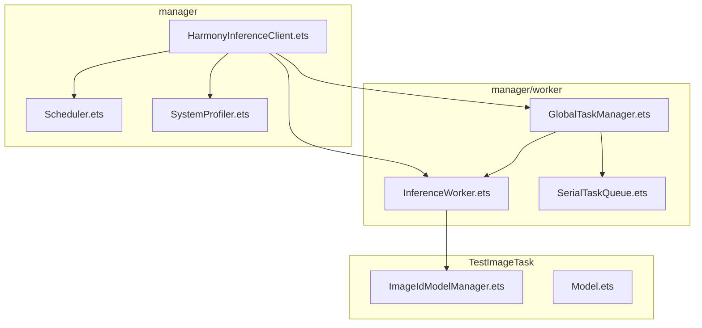
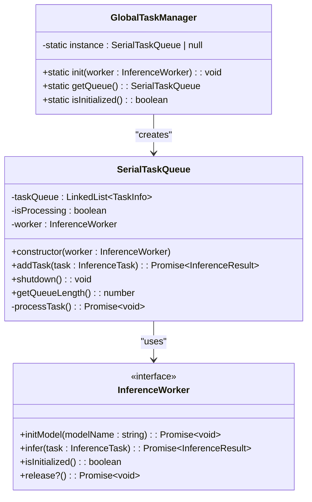
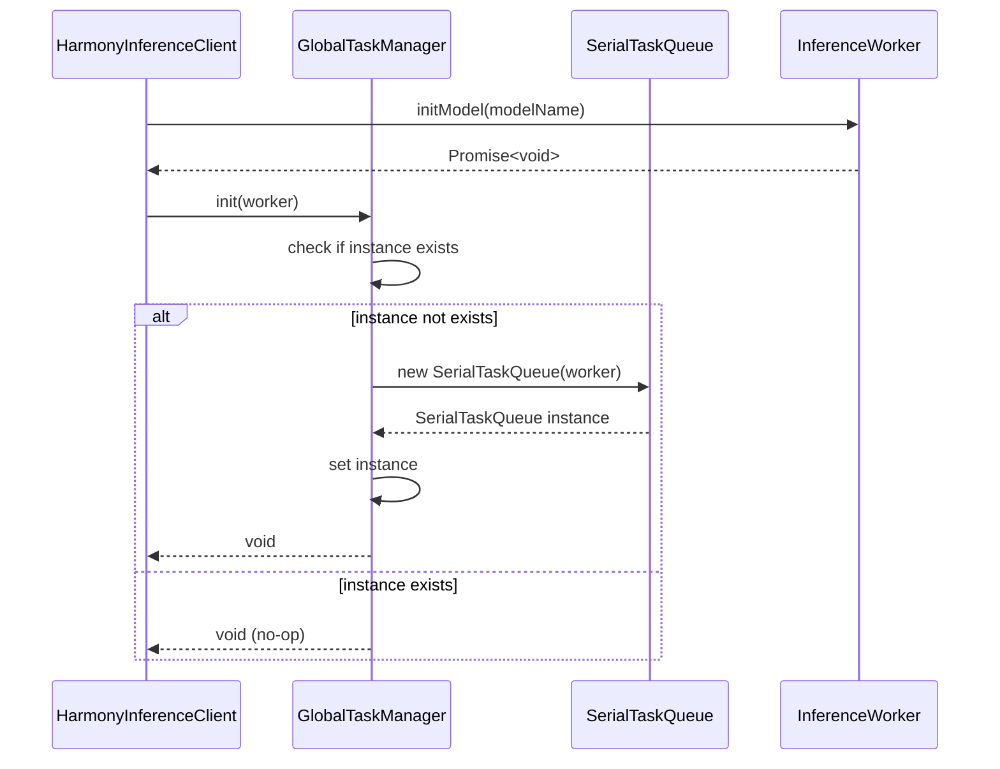
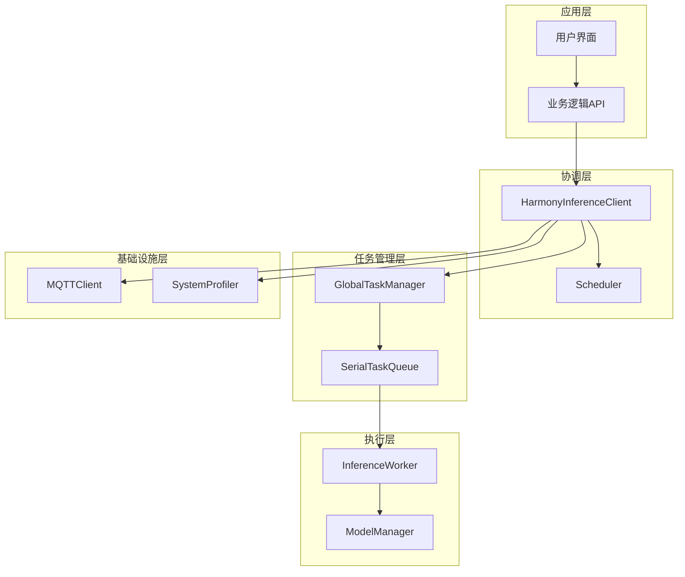
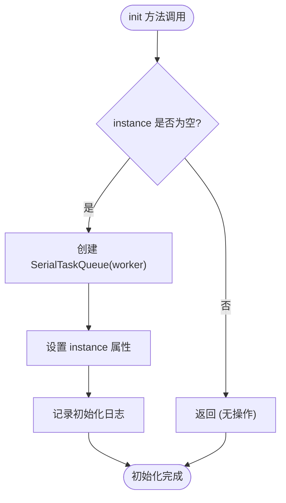
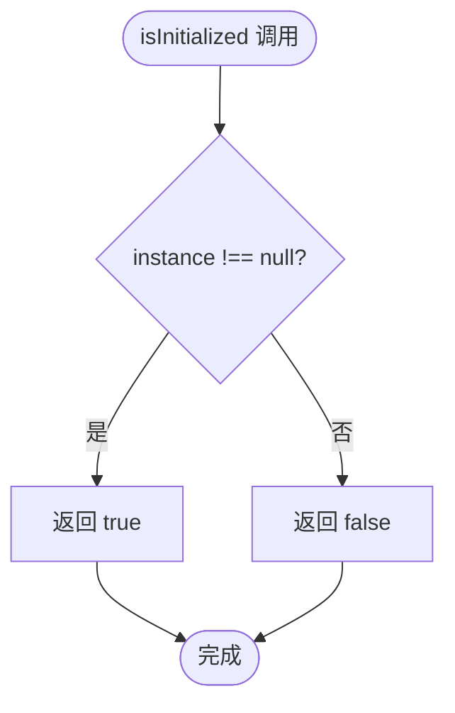
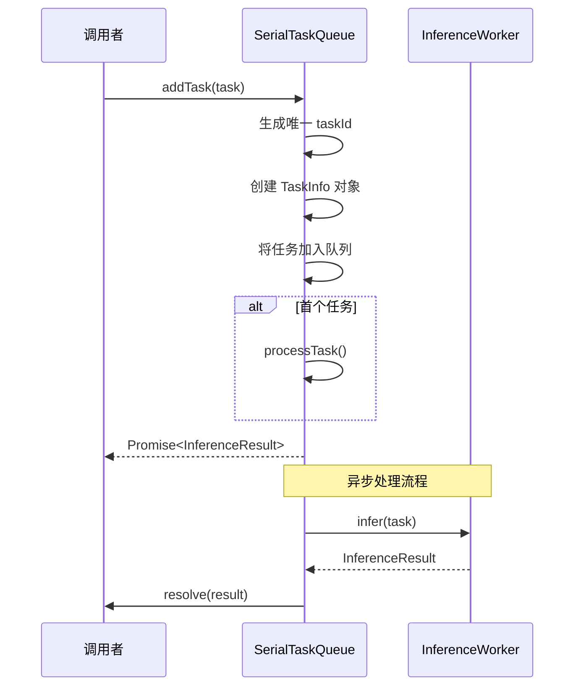
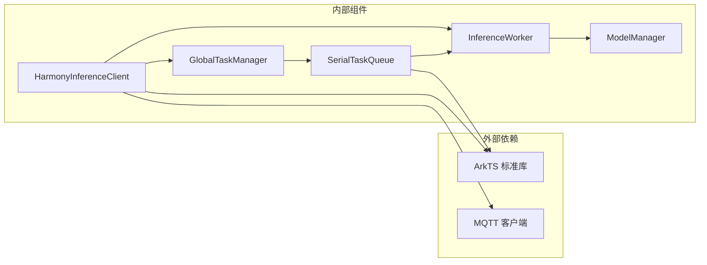
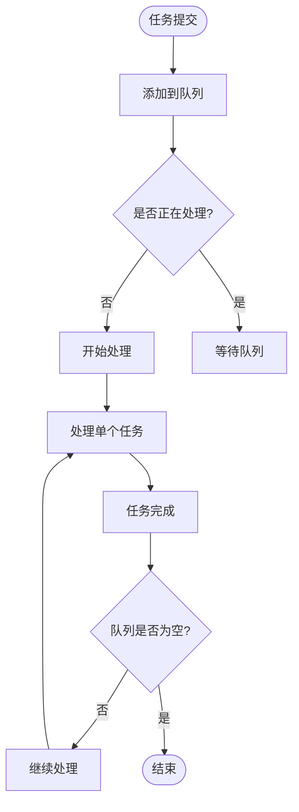
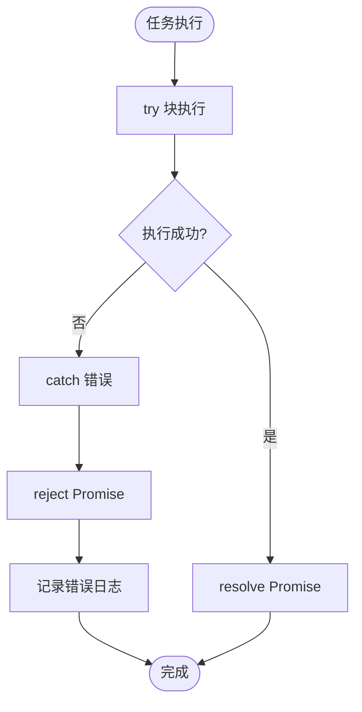

# 全局任务管理器

<cite>
**本文档引用的文件**
- [GlobalTaskManager.ets](file://entry/src/main/ets/manager/worker/GlobalTaskManager.ets)
- [InferenceWorker.ets](file://entry/src/main/ets/manager/worker/InferenceWorker.ets)
- [SerialTaskQueue.ets](file://entry/src/main/ets/manager/worker/SerialTaskQueue.ets)
- [HarmonyInferenceClient.ets](file://entry/src/main/ets/manager/HarmonyInferenceClient.ets)
</cite>

## 目录
1. [简介](#简介)
2. [项目结构](#项目结构)
3. [核心组件](#核心组件)
4. [架构概览](#架构概览)
5. [详细组件分析](#详细组件分析)
6. [依赖关系分析](#依赖关系分析)
7. [性能考虑](#性能考虑)
8. [故障排除指南](#故障排除指南)
9. [结论](#结论)

## 简介

全局任务管理器是 Harmony Inference 系统中的关键组件，负责协调和管理推理任务的执行。该系统采用单例模式设计，确保在整个应用程序生命周期内只有一个任务队列实例存在。本文档深入解析 GlobalTaskManager 的实现细节，包括单例模式、初始化流程、生命周期管理和与其他组件的集成关系。

## 项目结构

Harmony Inference 项目采用模块化架构，主要组件分布在以下目录结构中：

**图表来源**
- [GlobalTaskManager.ets](file://entry/src/main/ets/manager/worker/GlobalTaskManager.ets#L1-L27)
- [InferenceWorker.ets](file://entry/src/main/ets/manager/worker/InferenceWorker.ets#L1-L90)
- [SerialTaskQueue.ets](file://entry/src/main/ets/manager/worker/SerialTaskQueue.ets#L1-L104)
- [HarmonyInferenceClient.ets](file://entry/src/main/ets/manager/HarmonyInferenceClient.ets#L1-L357)

**章节来源**
- [GlobalTaskManager.ets](file://entry/src/main/ets/manager/worker/GlobalTaskManager.ets#L1-L27)
- [HarmonyInferenceClient.ets](file://entry/src/main/ets/manager/HarmonyInferenceClient.ets#L1-L357)

## 核心组件

### GlobalTaskManager 单例模式实现

GlobalTaskManager 采用静态单例模式实现，确保在整个应用程序中只有一个任务队列实例存在：

**图表来源**
- [GlobalTaskManager.ets](file://entry/src/main/ets/manager/worker/GlobalTaskManager.ets#L4-L27)
- [SerialTaskQueue.ets](file://entry/src/main/ets/manager/worker/SerialTaskQueue.ets#L13-L104)
- [InferenceWorker.ets](file://entry/src/main/ets/manager/worker/InferenceWorker.ets#L76-L89)

### 初始化流程详解

初始化流程遵循严格的顺序，确保组件间的正确依赖关系：

**图表来源**
- [HarmonyInferenceClient.ets](file://entry/src/main/ets/manager/HarmonyInferenceClient.ets#L163-L196)
- [GlobalTaskManager.ets](file://entry/src/main/ets/manager/worker/GlobalTaskManager.ets#L8-L13)
- [SerialTaskQueue.ets](file://entry/src/main/ets/manager/worker/SerialTaskQueue.ets#L19-L21)

**章节来源**
- [GlobalTaskManager.ets](file://entry/src/main/ets/manager/worker/GlobalTaskManager.ets#L8-L13)
- [HarmonyInferenceClient.ets](file://entry/src/main/ets/manager/HarmonyInferenceClient.ets#L184-L185)

## 架构概览

整个推理系统的架构采用分层设计，从上层的客户端接口到底层的任务队列管理：

**图表来源**
- [HarmonyInferenceClient.ets](file://entry/src/main/ets/manager/HarmonyInferenceClient.ets#L52-L357)
- [GlobalTaskManager.ets](file://entry/src/main/ets/manager/worker/GlobalTaskManager.ets#L4-L27)
- [SerialTaskQueue.ets](file://entry/src/main/ets/manager/worker/SerialTaskQueue.ets#L13-L104)

## 详细组件分析

### GlobalTaskManager 组件分析

#### 单例模式实现

GlobalTaskManager 使用静态变量存储单例实例，实现了线程安全的单例模式：

| 特性 | 描述 |
|------|------|
| 静态存储 | 使用静态属性 `instance` 存储唯一实例 |
| 延迟初始化 | 在首次调用时才创建实例 |
| 线程安全 | 由于 ETS 的单线程特性，无需额外同步 |
| 内存管理 | 实例在进程生命周期内保持 |

#### 初始化方法 (init)

初始化方法接收 InferenceWorker 实例并创建 SerialTaskQueue：

**图表来源**
- [GlobalTaskManager.ets](file://entry/src/main/ets/manager/worker/GlobalTaskManager.ets#L8-L13)

#### 实例获取方法 (getQueue)

getQueue 方法提供受保护的实例访问机制：

| 功能 | 实现方式 | 错误处理 |
|------|----------|----------|
| 实例验证 | 检查 `instance` 属性 | 抛出错误异常 |
| 实例返回 | 返回存储的实例 | 正常返回 |
| 异常处理 | `null` 检查失败时抛错 | `GlobalTaskManager has not been initialized` |

#### 状态检查方法 (isInitialized)

isInitialized 方法提供简单而高效的初始化状态查询：

**图表来源**
- [GlobalTaskManager.ets](file://entry/src/main/ets/manager/worker/GlobalTaskManager.ets#L24-L26)

**章节来源**
- [GlobalTaskManager.ets](file://entry/src/main/ets/manager/worker/GlobalTaskManager.ets#L4-L27)

### SerialTaskQueue 组件分析

#### 任务队列管理

SerialTaskQueue 实现了先进先出(FIFO)的任务调度机制：

| 组件 | 类型 | 描述 |
|------|------|------|
| 任务容器 | LinkedList | 存储待执行的任务 |
| 处理状态 | boolean | 标识当前是否有任务在处理 |
| 工作器 | InferenceWorker | 执行推理任务的实例 |

#### 任务添加机制

任务添加采用异步 Promise 模式，确保非阻塞操作：

**图表来源**
- [SerialTaskQueue.ets](file://entry/src/main/ets/manager/worker/SerialTaskQueue.ets#L24-L48)
- [SerialTaskQueue.ets](file://entry/src/main/ets/manager/worker/SerialTaskQueue.ets#L51-L83)

#### 任务处理算法

任务处理采用递归异步模式，确保串行执行和资源管理：

| 步骤 | 操作 | 目的 |
|------|------|------|
| 1 | 检查处理状态 | 防止并发处理 |
| 2 | 从队列取出任务 | 获取下一个待执行任务 |
| 3 | 调用推理接口 | 执行实际的推理计算 |
| 4 | 处理结果 | 成功时 resolve，失败时 reject |
| 5 | 递归检查 | 如有剩余任务则继续处理 |

**章节来源**
- [SerialTaskQueue.ets](file://entry/src/main/ets/manager/worker/SerialTaskQueue.ets#L13-L104)

### InferenceWorker 接口分析

InferenceWorker 定义了推理任务的标准接口规范：

#### 核心接口方法

| 方法 | 参数 | 返回值 | 描述 |
|------|------|--------|------|
| `initModel` | `modelName: string` | `Promise<void>` | 初始化指定模型 |
| `infer` | `task: InferenceTask` | `Promise<InferenceResult>` | 执行推理任务 |
| `isInitialized` | 无 | `boolean` | 检查初始化状态 |
| `release` | 可选 | `Promise<void>` | 释放资源 |

#### 任务数据结构

InferenceTask 支持多种输入类型，满足不同场景需求：

| 输入类型 | 数据结构 | 使用场景 |
|----------|----------|----------|
| IMAGE | `ImageInputData` | 图像识别、分类 |
| TEXT | `TextInputData` | 文本分析、翻译 |
| AUDIO | `AudioInputData` | 语音识别、音频处理 |
| OTHER | `ArrayBuffer` | 自定义数据格式 |

**章节来源**
- [InferenceWorker.ets](file://entry/src/main/ets/manager/worker/InferenceWorker.ets#L1-L90)

## 依赖关系分析

### 组件间依赖关系

**图表来源**
- [HarmonyInferenceClient.ets](file://entry/src/main/ets/manager/HarmonyInferenceClient.ets#L1-L14)
- [GlobalTaskManager.ets](file://entry/src/main/ets/manager/worker/GlobalTaskManager.ets#L1-L2)
- [SerialTaskQueue.ets](file://entry/src/main/ets/manager/worker/SerialTaskQueue.ets#L1-L2)

### 耦合度分析

| 组件 | 内聚性 | 耦合度 | 优化建议 |
|------|--------|--------|----------|
| GlobalTaskManager | 高 | 低 | 保持单一职责 |
| SerialTaskQueue | 高 | 中等 | 考虑任务优先级支持 |
| InferenceWorker | 高 | 低 | 接口设计良好 |
| HarmonyInferenceClient | 中等 | 高 | 考虑模块化拆分 |

**章节来源**
- [HarmonyInferenceClient.ets](file://entry/src/main/ets/manager/HarmonyInferenceClient.ets#L52-L357)
- [GlobalTaskManager.ets](file://entry/src/main/ets/manager/worker/GlobalTaskManager.ets#L4-L27)
- [SerialTaskQueue.ets](file://entry/src/main/ets/manager/worker/SerialTaskQueue.ets#L13-L104)

## 性能考虑

### 并发控制策略

系统采用串行执行模式，确保任务按顺序处理，避免资源竞争：

**图表来源**
- [SerialTaskQueue.ets](file://entry/src/main/ets/manager/worker/SerialTaskQueue.ets#L51-L83)

### 内存管理

系统采用及时清理策略，防止内存泄漏：

| 资源类型 | 清理时机 | 清理方式 |
|----------|----------|----------|
| 任务队列 | 应用退出 | `shutdown()` 方法 |
| 事件监听 | 资源释放 | `emitter.off()` |
| Promise 对象 | 异常处理 | 自动垃圾回收 |

### 性能优化建议

1. **批量处理**: 考虑实现任务批处理以提高吞吐量
2. **缓存机制**: 为频繁使用的模型结果添加缓存
3. **异步优化**: 在可能的情况下使用异步处理减少阻塞

## 故障排除指南

### 常见初始化问题

| 问题 | 症状 | 解决方案 |
|------|------|----------|
| 未初始化错误 | `GlobalTaskManager has not been initialized` | 确保先调用 `GlobalTaskManager.init(worker)` |
| 模型加载失败 | `initModel` Promise 拒绝 | 检查模型文件路径和权限 |
| 内存不足 | `Task add failed` 日志 | 检查队列长度和系统内存 |

### 错误处理最佳实践

#### 异常捕获模式

**图表来源**
- [SerialTaskQueue.ets](file://entry/src/main/ets/manager/worker/SerialTaskQueue.ets#L70-L75)

#### 资源清理策略

系统提供了多层资源清理机制：

1. **队列关闭**: `shutdown()` 方法清空所有待处理任务
2. **事件监听**: 使用 `emitter.off()` 移除所有事件监听器
3. **模型释放**: 调用 `worker.release()` 释放推理模型

**章节来源**
- [SerialTaskQueue.ets](file://entry/src/main/ets/manager/worker/SerialTaskQueue.ets#L86-L97)
- [HarmonyInferenceClient.ets](file://entry/src/main/ets/manager/HarmonyInferenceClient.ets#L198-L225)

### 调试技巧

1. **日志分析**: 利用系统提供的详细日志信息定位问题
2. **状态检查**: 使用 `isInitialized()` 和 `getQueueLength()` 检查系统状态
3. **单元测试**: 为关键组件编写单元测试验证功能正确性

## 结论

全局任务管理器作为 Harmony Inference 系统的核心组件，通过精心设计的单例模式和串行任务队列机制，为推理任务提供了可靠的任务管理服务。系统的设计充分考虑了并发控制、资源管理和错误处理，为构建高性能的推理应用奠定了坚实基础。

主要优势包括：
- **可靠性**: 单例模式确保实例一致性
- **可维护性**: 清晰的职责分离和接口设计
- **可扩展性**: 模块化设计支持功能扩展
- **易用性**: 简洁的 API 接口降低使用复杂度

未来可以考虑的改进方向：
- 增加任务优先级支持
- 实现任务超时和重试机制
- 添加性能监控和统计功能
- 支持分布式任务调度