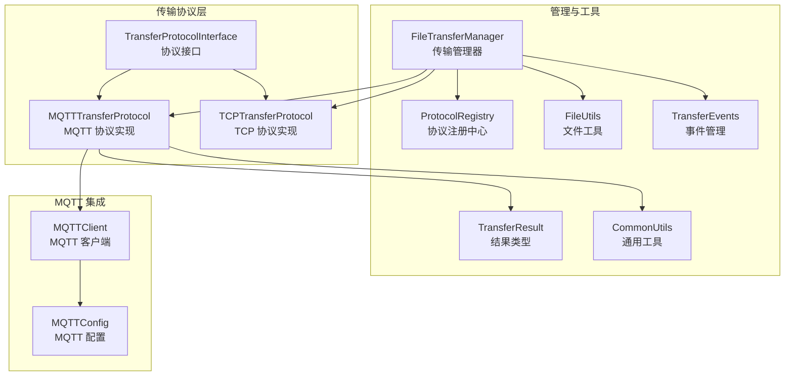
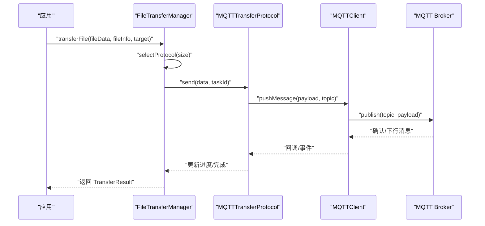
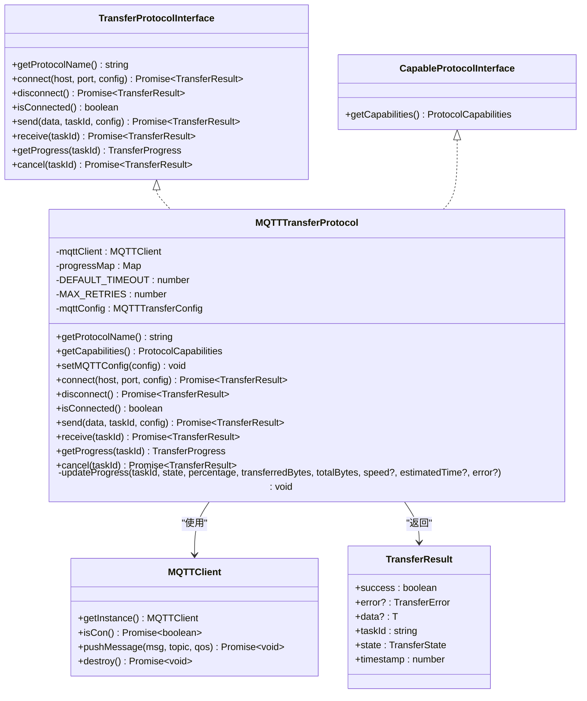
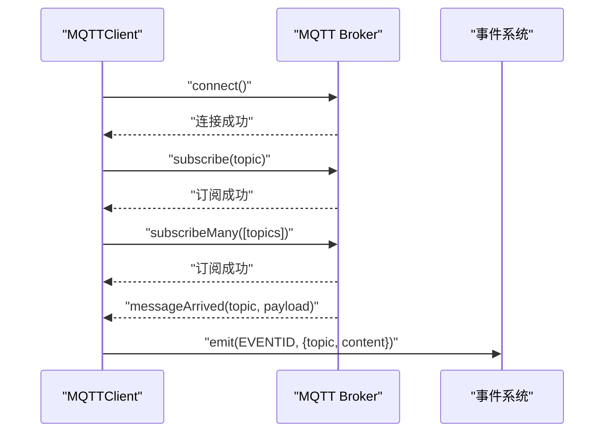
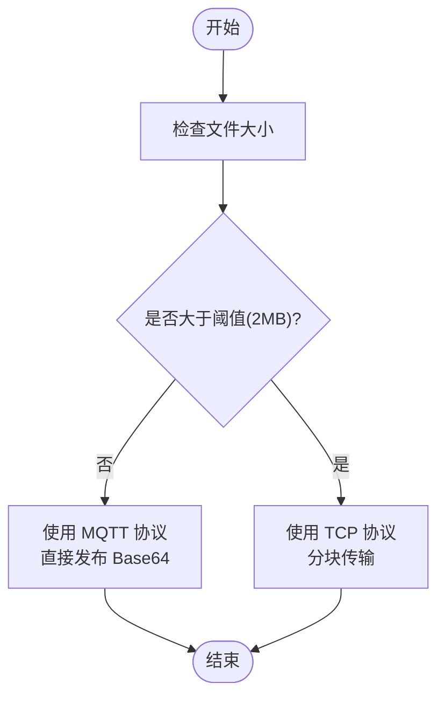
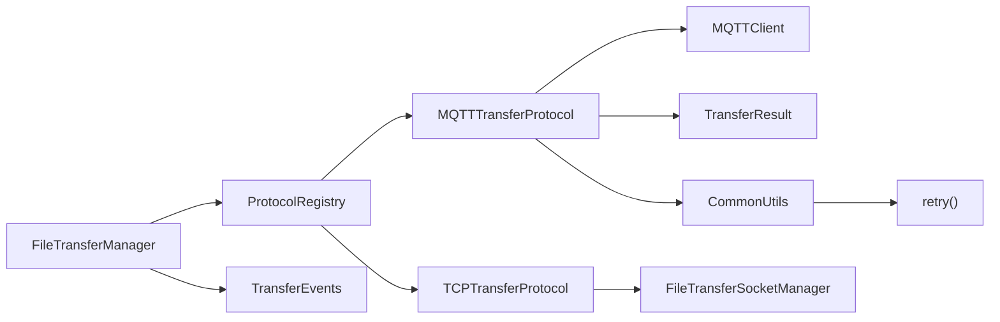

# MQTT 传输协议

<cite>
**本文引用的文件列表**
- [MQTTTransferProtocol.ets](file://entry/src/main/ets/manager/transfer/protocol/MQTTTransferProtocol.ets)
- [TransferProtocolInterface.ets](file://entry/src/main/ets/manager/transfer/protocol/TransferProtocolInterface.ets)
- [ProtocolRegistry.ets](file://entry/src/main/ets/manager/transfer/protocol/ProtocolRegistry.ets)
- [MQTTClient.ets](file://entry/src/main/ets/manager/broker/MQTTClient.ets)
- [MQTTConfig.ets](file://entry/src/main/ets/manager/broker/MQTTConfig.ets)
- [FileUtils.ets](file://entry/src/main/ets/manager/transfer/utils/FileUtils.ets)
- [TransferDataModels.ets](file://entry/src/main/ets/manager/transfer/model/TransferDataModels.ets)
- [TransferEvents.ets](file://entry/src/main/ets/manager/transfer/event/TransferEvents.ets)
- [FileTransferManager.ets](file://entry/src/main/ets/manager/transfer/FileTransferManager.ets)
- [TCPTransferProtocol.ets](file://entry/src/main/ets/manager/transfer/protocol/TCPTransferProtocol.ets)
- [FileTransferSocketManager.ets](file://entry/src/main/ets/manager/transfer/socket/FileTransferSocketManager.ets)
- [TransferExamples.ets](file://entry/src/main/ets/manager/transfer/examples/TransferExamples.ets)
- [QUICK_REFERENCE.md](file://entry/src/main/ets/manager/transfer/QUICK_REFERENCE.md)
- [TransferResult.ets](file://entry/src/main/ets/manager/transfer/model/TransferResult.ets)
- [CommonUtils.ets](file://entry/src/main/ets/manager/transfer/utils/CommonUtils.ets)
</cite>

## 更新摘要
**变更内容**
- 标准化结果类型：引入统一的 TransferResult 接口和错误码体系
- 增强连接管理：改进 MQTT 连接状态检查和错误处理机制
- 优化错误恢复：实现智能重试机制和异常处理
- 新增协议能力接口：支持协议能力查询和动态配置
- 完善进度跟踪：增强传输进度监控和状态管理

## 目录
1. [简介](#简介)
2. [项目结构](#项目结构)
3. [核心组件](#核心组件)
4. [架构总览](#架构总览)
5. [详细组件分析](#详细组件分析)
6. [依赖关系分析](#依赖关系分析)
7. [性能考量](#性能考量)
8. [故障排除指南](#故障排除指南)
9. [结论](#结论)
10. [附录](#附录)

## 简介
本文件对基于 MQTT 的文件传输协议实现进行全面技术文档化，重点围绕 MQTTTransferProtocol 如何在现有 MQTT 客户端之上实现文件传输能力。文档涵盖协议初始化、连接管理、消息发布/订阅机制、文件分块与断点续传策略、错误重试机制、与 MQTTBroker 的集成方式、主题命名规范、消息格式定义、性能优化建议、故障排除以及与其他传输协议的兼容与迁移方案。

**更新** 本版本文档反映了最新的标准化结果类型、增强的连接管理和错误恢复机制，以及协议能力查询功能的实现。

## 项目结构
MQTT 传输协议位于文件传输子系统中，采用"协议接口 + 具体协议实现 + 管理器 + 工具 + 事件"的分层设计：
- 协议接口层：定义统一的传输协议抽象
- 协议实现层：MQTTTransferProtocol、TCPTransferProtocol
- 管理器层：FileTransferManager 统一调度与路由
- 工具层：FileUtils、NetworkUtils 等
- 事件层：TransferEvents 事件总线
- MQTT 集成：MQTTClient、MQTTConfig

**图表来源**
- [MQTTTransferProtocol.ets:1-293](file://entry/src/main/ets/manager/transfer/protocol/MQTTTransferProtocol.ets#L1-L293)
- [TransferProtocolInterface.ets:1-191](file://entry/src/main/ets/manager/transfer/protocol/TransferProtocolInterface.ets#L1-L191)
- [ProtocolRegistry.ets:7-92](file://entry/src/main/ets/manager/transfer/protocol/ProtocolRegistry.ets#L7-L92)
- [FileTransferManager.ets:1-648](file://entry/src/main/ets/manager/transfer/FileTransferManager.ets#L1-L648)
- [MQTTClient.ets:1-223](file://entry/src/main/ets/manager/broker/MQTTClient.ets#L1-L223)
- [MQTTConfig.ets:1-7](file://entry/src/main/ets/manager/broker/MQTTConfig.ets#L1-L7)
- [FileUtils.ets:8-193](file://entry/src/main/ets/manager/transfer/utils/FileUtils.ets#L8-L193)
- [TransferEvents.ets:62-206](file://entry/src/main/ets/manager/transfer/event/TransferEvents.ets#L62-L206)
- [TransferResult.ets:1-275](file://entry/src/main/ets/manager/transfer/model/TransferResult.ets#L1-L275)
- [CommonUtils.ets:1-226](file://entry/src/main/ets/manager/transfer/utils/CommonUtils.ets#L1-L226)

**章节来源**
- [FileTransferManager.ets:1-648](file://entry/src/main/ets/manager/transfer/FileTransferManager.ets#L1-L648)
- [ProtocolRegistry.ets:7-92](file://entry/src/main/ets/manager/transfer/protocol/ProtocolRegistry.ets#L7-L92)
- [MQTTClient.ets:1-223](file://entry/src/main/ets/manager/broker/MQTTClient.ets#L1-L223)

## 核心组件
- 协议接口：定义统一的协议能力，包括连接、发送、接收、进度查询、取消等
- MQTTTransferProtocol：基于现有 MQTT 客户端，实现小文件（≤2MB）的直接传输，支持标准化结果类型
- FileTransferManager：统一调度，自动选择协议（MQTT/TCP），维护任务状态与事件
- MQTTClient：封装底层 MQTT 客户端，负责连接、订阅、发布、事件派发
- FileUtils：文件分块、重组、哈希计算与编码转换
- TransferEvents：传输事件的发布与监听
- ProtocolRegistry：协议注册与发现
- TransferResult：统一的传输结果类型和错误码体系
- CommonUtils：提供重试机制和通用工具函数

**更新** 新增了 TransferResult 统一结果类型和 CommonUtils 重试机制，增强了错误处理和状态管理能力。

**章节来源**
- [TransferProtocolInterface.ets:1-191](file://entry/src/main/ets/manager/transfer/protocol/TransferProtocolInterface.ets#L1-L191)
- [MQTTTransferProtocol.ets:1-293](file://entry/src/main/ets/manager/transfer/protocol/MQTTTransferProtocol.ets#L1-L293)
- [FileTransferManager.ets:1-648](file://entry/src/main/ets/manager/transfer/FileTransferManager.ets#L1-L648)
- [MQTTClient.ets:1-223](file://entry/src/main/ets/manager/broker/MQTTClient.ets#L1-L223)
- [FileUtils.ets:8-193](file://entry/src/main/ets/manager/transfer/utils/FileUtils.ets#L8-L193)
- [TransferEvents.ets:62-206](file://entry/src/main/ets/manager/transfer/event/TransferEvents.ets#L62-L206)
- [ProtocolRegistry.ets:7-92](file://entry/src/main/ets/manager/transfer/protocol/ProtocolRegistry.ets#L7-L92)
- [TransferResult.ets:1-275](file://entry/src/main/ets/manager/transfer/model/TransferResult.ets#L1-L275)
- [CommonUtils.ets:1-226](file://entry/src/main/ets/manager/transfer/utils/CommonUtils.ets#L1-L226)

## 架构总览
MQTT 传输协议在整体架构中的位置如下：
- FileTransferManager 作为入口，根据文件大小选择协议
- MQTTTransferProtocol 通过 MQTTClient 发布消息到指定主题
- MQTTClient 负责连接、订阅、消息派发
- 事件系统用于进度与状态通知
- TransferResult 统一返回结果类型

**图表来源**
- [FileTransferManager.ets:167-274](file://entry/src/main/ets/manager/transfer/FileTransferManager.ets#L167-L274)
- [MQTTTransferProtocol.ets:165-221](file://entry/src/main/ets/manager/transfer/protocol/MQTTTransferProtocol.ets#L165-L221)
- [MQTTClient.ets:190-203](file://entry/src/main/ets/manager/broker/MQTTClient.ets#L190-L203)

## 详细组件分析

### MQTTTransferProtocol 组件分析
- 协议名称：返回固定标识
- 连接管理：复用全局 MQTTClient 实例，检查连接状态；通常无需主动断开
- 发送流程：将 ArrayBuffer 转为 Base64，发布到固定主题；支持有限次重试；更新进度状态
- 接收流程：MQTT 为推送模型，接收通过事件监听；该方法主要用于接口一致性
- 进度与取消：维护 Map 记录进度；取消时更新状态；完成后延迟清理
- **新增** 标准化结果类型：所有操作返回 TransferResult 接口，包含 success、error、data、taskId、state、timestamp 等字段
- **新增** 协议能力查询：支持 getCapabilities() 方法返回协议支持的功能特性
- **新增** 智能重试：使用 CommonUtils.retry() 实现指数退避重试机制

**图表来源**
- [TransferProtocolInterface.ets:85-191](file://entry/src/main/ets/manager/transfer/protocol/TransferProtocolInterface.ets#L85-L191)
- [MQTTTransferProtocol.ets:54-293](file://entry/src/main/ets/manager/transfer/protocol/MQTTTransferProtocol.ets#L54-L293)
- [TransferResult.ets:86-137](file://entry/src/main/ets/manager/transfer/model/TransferResult.ets#L86-L137)
- [MQTTClient.ets:24-223](file://entry/src/main/ets/manager/broker/MQTTClient.ets#L24-L223)

**章节来源**
- [MQTTTransferProtocol.ets:1-293](file://entry/src/main/ets/manager/transfer/protocol/MQTTTransferProtocol.ets#L1-L293)

### MQTTClient 与 MQTTBroker 集成
- 单例模式：getInstance 保证全局唯一
- 初始化流程：创建客户端 -> 连接 -> 订阅基础主题 -> 订阅扩展主题 -> 监听消息
- 发布消息：pushMessage(topic, payload, qos)，默认使用配置中的主题与 QoS
- 订阅主题：支持单主题与多主题订阅；内置常用主题集合
- 事件派发：messageArrived 中根据主题将消息通过事件总线发出

**图表来源**
- [MQTTClient.ets:68-182](file://entry/src/main/ets/manager/broker/MQTTClient.ets#L68-L182)
- [MQTTClient.ets:184-203](file://entry/src/main/ets/manager/broker/MQTTClient.ets#L184-L203)

**章节来源**
- [MQTTClient.ets:1-223](file://entry/src/main/ets/manager/broker/MQTTClient.ets#L1-L223)
- [MQTTConfig.ets:1-7](file://entry/src/main/ets/manager/broker/MQTTConfig.ets#L1-L7)

### 文件分块与断点续传策略
- 分块策略：FileUtils 提供分块与重组能力，支持自定义分块大小
- 断点续传：当前 MQTTTransferProtocol 未实现分块与断点续传；断点续传主要由 TCPTransferProtocol 实现
- 哈希校验：提供 SHA-256 哈希计算与校验，用于完整性验证

**图表来源**
- [FileTransferManager.ets:57-62](file://entry/src/main/ets/manager/transfer/FileTransferManager.ets#L57-L62)
- [FileUtils.ets:16-39](file://entry/src/main/ets/manager/transfer/utils/FileUtils.ets#L16-L39)

**章节来源**
- [FileUtils.ets:8-193](file://entry/src/main/ets/manager/transfer/utils/FileUtils.ets#L8-L193)
- [FileTransferManager.ets:57-62](file://entry/src/main/ets/manager/transfer/FileTransferManager.ets#L57-L62)

### 错误重试机制
- **更新** 智能重试：使用 CommonUtils.retry() 实现指数退避重试机制，支持最大重试次数配置
- **更新** 标准化错误处理：所有错误通过 TransferResult.error 对象返回，包含错误码、消息、详情、原始错误等
- **更新** 连接状态检查：connect() 方法返回 TransferResult，包含连接状态检查和错误信息
- 进度与错误：失败时更新进度状态并携带错误信息
- TCP 发送：分块级别重试，失败后抛出错误并更新进度

**更新** 错误处理机制得到显著增强，实现了统一的错误码体系和标准化的结果返回格式。

**章节来源**
- [MQTTTransferProtocol.ets:165-221](file://entry/src/main/ets/manager/transfer/protocol/MQTTTransferProtocol.ets#L165-L221)
- [CommonUtils.ets:128-150](file://entry/src/main/ets/manager/transfer/utils/CommonUtils.ets#L128-L150)
- [TransferResult.ets:164-184](file://entry/src/main/ets/manager/transfer/model/TransferResult.ets#L164-L184)
- [TCPTransferProtocol.ets:166-178](file://entry/src/main/ets/manager/transfer/protocol/TCPTransferProtocol.ets#L166-L178)

### 协议能力查询与配置
- **新增** 协议能力接口：CapableProtocolInterface 提供 getCapabilities() 方法
- **新增** 能力定义：ProtocolCapabilities 接口描述协议支持的功能特性
- **新增** MQTT 能力：supportsLargeFiles=false、maxFileSize=2MB、supportsChunking=false、supportsResume=false、supportsProgress=false、supportsCancellation=true、requiresActiveConnection=false
- **新增** 配置管理：setMQTTConfig() 方法支持动态配置主题、QoS、保留标志

**更新** 新增了协议能力查询功能，使系统能够动态了解各协议的支持特性。

**章节来源**
- [MQTTTransferProtocol.ets:28-96](file://entry/src/main/ets/manager/transfer/protocol/MQTTTransferProtocol.ets#L28-L96)
- [TransferProtocolInterface.ets:162-191](file://entry/src/main/ets/manager/transfer/protocol/TransferProtocolInterface.ets#L162-L191)

### 与 FileTransferManager 的协作
- 自动协议选择：根据文件大小阈值自动选择 MQTT 或 TCP
- 任务状态管理：维护任务队列，触发事件，更新状态
- 事件驱动：通过 TransferEvents 发布进度、完成、失败等事件
- **更新** 统一结果处理：FileTransferManager 接收和处理 TransferResult 标准化结果

**章节来源**
- [FileTransferManager.ets:167-274](file://entry/src/main/ets/manager/transfer/FileTransferManager.ets#L167-L274)
- [TransferEvents.ets:161-204](file://entry/src/main/ets/manager/transfer/event/TransferEvents.ets#L161-L204)

## 依赖关系分析
- 协议注册：ProtocolRegistry 统一注册与发现协议
- 协议实现：MQTTTransferProtocol 依赖 MQTTClient；TCPTransferProtocol 依赖 FileTransferSocketManager
- 管理器耦合：FileTransferManager 同时依赖两类协议与事件系统
- **新增** 结果类型：所有协议操作返回 TransferResult 统一结果类型
- **新增** 通用工具：使用 CommonUtils.retry() 实现重试机制

**图表来源**
- [ProtocolRegistry.ets:31-66](file://entry/src/main/ets/manager/transfer/protocol/ProtocolRegistry.ets#L31-L66)
- [FileTransferManager.ets:39-73](file://entry/src/main/ets/manager/transfer/FileTransferManager.ets#L39-L73)
- [MQTTTransferProtocol.ets:1-293](file://entry/src/main/ets/manager/transfer/protocol/MQTTTransferProtocol.ets#L1-L293)
- [TCPTransferProtocol.ets:23-38](file://entry/src/main/ets/manager/transfer/protocol/TCPTransferProtocol.ets#L23-L38)
- [TransferResult.ets:1-275](file://entry/src/main/ets/manager/transfer/model/TransferResult.ets#L1-L275)
- [CommonUtils.ets:128-150](file://entry/src/main/ets/manager/transfer/utils/CommonUtils.ets#L128-L150)

**章节来源**
- [ProtocolRegistry.ets:7-92](file://entry/src/main/ets/manager/transfer/protocol/ProtocolRegistry.ets#L7-L92)
- [FileTransferManager.ets:1-648](file://entry/src/main/ets/manager/transfer/FileTransferManager.ets#L1-L648)

## 性能考量
- MQTT 适用场景：小文件（≤2MB）直接传输，避免分块与复杂控制开销
- TCP 适用场景：大文件分块传输，具备断点续传与更稳健的可靠性
- **更新** 配置建议：
  - sizeThreshold：根据网络与业务特征调整（如 1MB）
  - tcpChunkSize：WiFi 环境可增大至 256KB
  - maxRetries：弱网环境可提升至 5-7 次，使用指数退避重试
  - timeout：远距离或高延迟网络可延长至 60s
  - tcpPort：避免冲突，必要时更换端口
- **更新** 资源管理：定期清理已完成任务，避免内存泄漏
- **新增** 连接管理：利用 MQTTClient 的自动重连机制，减少手动连接管理开销

**更新** 性能配置更加灵活，支持指数退避重试和自动连接管理。

**章节来源**
- [QUICK_REFERENCE.md:177-186](file://entry/src/main/ets/manager/transfer/QUICK_REFERENCE.md#L177-L186)
- [FileTransferManager.ets:56-62](file://entry/src/main/ets/manager/transfer/FileTransferManager.ets#L56-L62)
- [FileTransferManager.ets:327-346](file://entry/src/main/ets/manager/transfer/FileTransferManager.ets#L327-L346)
- [CommonUtils.ets:128-150](file://entry/src/main/ets/manager/transfer/utils/CommonUtils.ets#L128-L150)

## 故障排除指南
- MQTT 未连接：检查 MQTTClient 是否已初始化与连接；确认 Broker 地址与凭据
- 发布失败：查看 pushMessage 的错误日志；确认主题与 QoS 设置
- 接收不到消息：确认订阅主题是否正确；检查 messageArrived 的事件派发
- 进度异常：确认 updateProgress 的调用时机；检查事件监听是否注册
- 大文件传输：应使用 TCP 协议；若仍走 MQTT，需调整阈值或改用 TCP
- **更新** 标准化错误：使用 TransferResult.error.code 查看具体错误码，便于定位问题
- **更新** 重试机制：检查 maxRetries 配置，确保网络环境允许适当的重试次数

**更新** 故障排除指南增加了基于 TransferResult 的标准化错误诊断方法。

**章节来源**
- [MQTTClient.ets:59-65](file://entry/src/main/ets/manager/broker/MQTTClient.ets#L59-L65)
- [MQTTClient.ets:190-203](file://entry/src/main/ets/manager/broker/MQTTClient.ets#L190-L203)
- [TransferEvents.ets:115-130](file://entry/src/main/ets/manager/transfer/event/TransferEvents.ets#L115-L130)
- [FileTransferManager.ets:230-240](file://entry/src/main/ets/manager/transfer/FileTransferManager.ets#L230-L240)
- [TransferResult.ets:13-64](file://entry/src/main/ets/manager/transfer/model/TransferResult.ets#L13-L64)

## 结论
MQTTTransferProtocol 在现有 MQTT 客户端基础上，提供了面向小文件的直接传输能力，具备简洁的连接管理与有限重试机制。**更新** 本版本实现了标准化结果类型、增强的连接管理和错误恢复机制，以及协议能力查询功能。对于大文件与高可靠需求，应结合 TCP 协议实现分块传输与断点续传。通过 FileTransferManager 的统一调度与事件系统，实现了良好的可扩展性与可观测性。

## 附录

### 主题命名规范与消息格式
- 主题命名：MQTTTransferProtocol 发布到固定主题；MQTTClient 订阅基础与扩展主题
- 消息格式：payload 为 Base64 编码的文件数据字符串
- QoS：使用配置中的 QoS 等级

**章节来源**
- [MQTTTransferProtocol.ets:64-68](file://entry/src/main/ets/manager/transfer/protocol/MQTTTransferProtocol.ets#L64-L68)
- [MQTTClient.ets:107-145](file://entry/src/main/ets/manager/broker/MQTTClient.ets#L107-L145)
- [MQTTClient.ets:190-203](file://entry/src/main/ets/manager/broker/MQTTClient.ets#L190-L203)

### 使用示例（路径）
- 基本传输（显式指定协议）：参见 [TransferExamples.ets:12-35](file://entry/src/main/ets/manager/transfer/examples/TransferExamples.ets#L12-L35)
- 大文件传输（显式使用 TCP）：参见 [TransferExamples.ets:40-60](file://entry/src/main/ets/manager/transfer/examples/TransferExamples.ets#L40-L60)
- 查询进度与取消任务：参见 [TransferExamples.ets:65-95](file://entry/src/main/ets/manager/transfer/examples/TransferExamples.ets#L65-L95)
- 自定义配置：参见 [TransferExamples.ets:100-113](file://entry/src/main/ets/manager/transfer/examples/TransferExamples.ets#L100-L113)
- 协议能力查询：参见 [TransferExamples.ets:143-158](file://entry/src/main/ets/manager/transfer/examples/TransferExamples.ets#L143-L158)
- 错误处理示例：参见 [TransferExamples.ets:163-191](file://entry/src/main/ets/manager/transfer/examples/TransferExamples.ets#L163-L191)
- 完整传输流程：参见 [TransferExamples.ets:196-247](file://entry/src/main/ets/manager/transfer/examples/TransferExamples.ets#L196-L247)

### 与其他传输协议的兼容与迁移
- 兼容性：通过 ProtocolRegistry 动态注册与发现协议，支持扩展自定义协议
- 迁移方案：
  - 小文件：保持使用 MQTT 协议
  - 大文件：迁移到 TCP 协议，利用其分块与断点续传能力
  - 混合策略：根据文件大小阈值自动切换（已在 FileTransferManager 中实现）
- **新增** 协议能力检测：使用 getCapabilities() 方法动态了解协议支持的功能特性

**更新** 新增了协议能力检测功能，便于动态选择最适合的传输协议。

**章节来源**
- [ProtocolRegistry.ets:31-66](file://entry/src/main/ets/manager/transfer/protocol/ProtocolRegistry.ets#L31-L66)
- [FileTransferManager.ets:94-108](file://entry/src/main/ets/manager/transfer/FileTransferManager.ets#L94-L108)
- [FileTransferManager.ets:57-62](file://entry/src/main/ets/manager/transfer/FileTransferManager.ets#L57-L62)
- [MQTTTransferProtocol.ets:84-96](file://entry/src/main/ets/manager/transfer/protocol/MQTTTransferProtocol.ets#L84-L96)

### 标准化结果类型详解
- **新增** TransferResult 接口：统一的传输操作返回结构
- **新增** TransferErrorCode 枚举：完整的错误码体系
- **新增** createSuccessResult()：创建成功结果的工厂函数
- **新增** createErrorResult()：创建失败结果的工厂函数
- **新增** errorFromException()：从异常创建传输错误的工具函数

**新增** 标准化的结果类型和错误处理机制，提高了系统的可维护性和一致性。

**章节来源**
- [TransferResult.ets:1-275](file://entry/src/main/ets/manager/transfer/model/TransferResult.ets#L1-L275)
- [CommonUtils.ets:128-150](file://entry/src/main/ets/manager/transfer/utils/CommonUtils.ets#L128-L150)