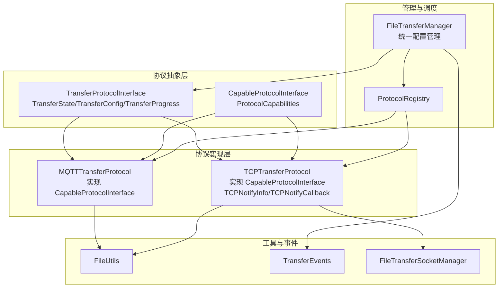
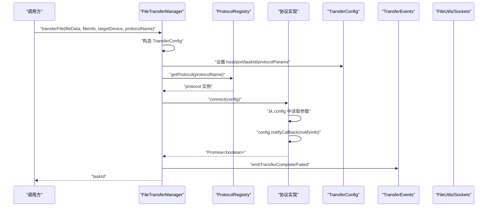
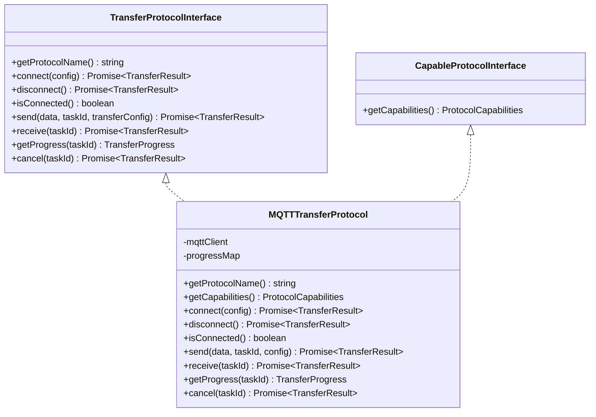
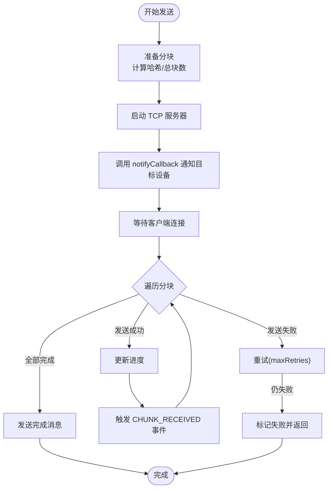
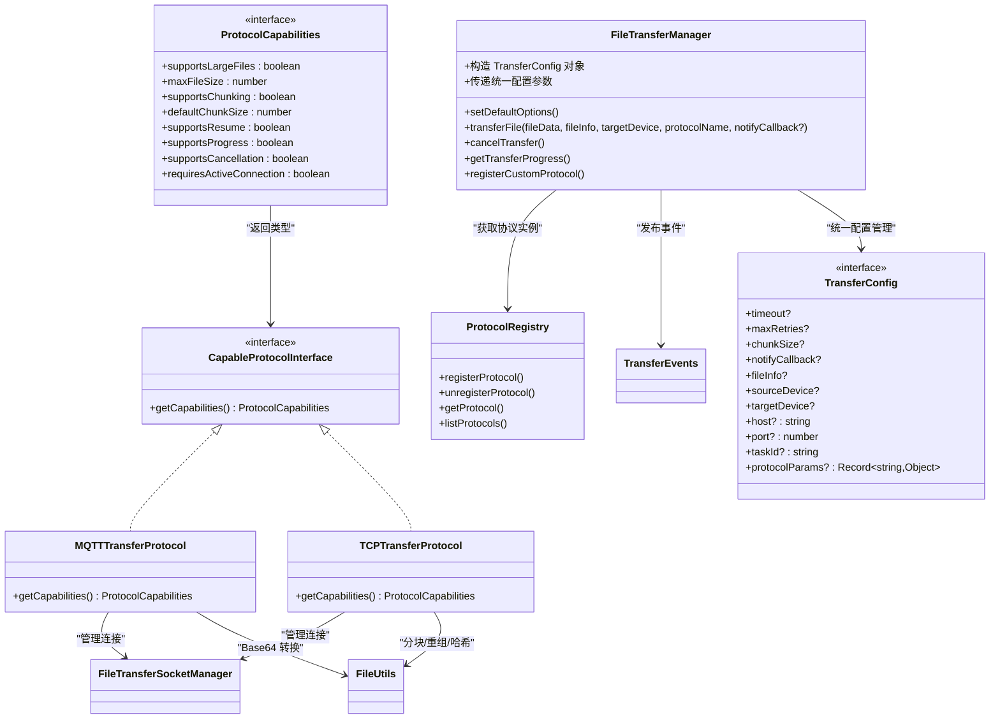

# 传输协议接口

<cite>
**本文引用的文件**
- [TransferProtocolInterface.ets](file://entry/src/main/ets/manager/transfer/protocol/TransferProtocolInterface.ets)
- [TransferDataModels.ets](file://entry/src/main/ets/manager/transfer/model/TransferDataModels.ets)
- [MQTTTransferProtocol.ets](file://entry/src/main/ets/manager/transfer/protocol/MQTTTransferProtocol.ets)
- [TCPTransferProtocol.ets](file://entry/src/main/ets/manager/transfer/protocol/TCPTransferProtocol.ets)
- [ProtocolRegistry.ets](file://entry/src/main/ets/manager/transfer/protocol/ProtocolRegistry.ets)
- [TransferEvents.ets](file://entry/src/main/ets/manager/transfer/event/TransferEvents.ets)
- [FileUtils.ets](file://entry/src/main/ets/manager/transfer/utils/FileUtils.ets)
- [FileTransferSocketManager.ets](file://entry/src/main/ets/manager/transfer/socket/FileTransferSocketManager.ets)
- [FileTransferManager.ets](file://entry/src/main/ets/manager/transfer/FileTransferManager.ets)
- [TransferExamples.ets](file://entry/src/main/ets/manager/transfer/examples/TransferExamples.ets)
- [IMPLEMENTATION_SUMMARY.md](file://entry/src/main/ets/manager/transfer/IMPLEMENTATION_SUMMARY.md)
- [TCPModels.ets](file://entry/src/main/ets/manager/transfer/model/TCPModels.ets)
- [MQTTClient.ets](file://entry/src/main/ets/manager/broker/MQTTClient.ets)
</cite>

## 更新摘要
**变更内容**
- 新增统一配置管理：TransferConfig 接口新增 host、port、taskId、protocolParams 等关键配置字段
- 增强协议连接能力：所有协议实现现在通过统一的 TransferConfig 接口获取连接参数
- 优化协议参数传递：protocolParams 字段支持协议特定的额外配置参数
- 完善任务标识管理：taskId 字段确保跨协议的统一任务跟踪
- 统一连接参数处理：FileTransferManager 现在通过 TransferConfig 统一传递所有连接参数

## 目录
1. [简介](#简介)
2. [项目结构](#项目结构)
3. [核心组件](#核心组件)
4. [架构总览](#架构总览)
5. [详细组件分析](#详细组件分析)
6. [依赖关系分析](#依赖关系分析)
7. [性能考量](#性能考量)
8. [故障排查指南](#故障排查指南)
9. [结论](#结论)
10. [附录](#附录)

## 简介
本文件面向传输协议接口的使用者与扩展开发者，系统化阐述 TransferProtocolInterface 的设计原理与标准化抽象，详解 TransferState 状态枚举、TransferConfig 配置接口、TransferProgress 进度信息的数据结构，以及新增的统一配置管理系统。详细说明 TransferConfig 如何通过 host、port、taskId、protocolParams 等字段实现统一配置管理，以及 FileTransferManager 如何利用这些配置进行智能协议选择和参数传递。记录 getProtocolName()、connect()、disconnect()、isConnected()、send()、receive()、getProgress()、cancel() 等核心方法的参数、返回值和使用模式。包含具体的代码示例展示如何实现自定义传输协议。解释协议抽象的设计理念和扩展机制。提供错误处理和异常情况的处理方案。

## 项目结构
传输协议相关代码位于 entry/src/main/ets/manager/transfer 目录下，采用"协议抽象 + 协议实现 + 管理器 + 工具 + 事件 + Socket 管理"的分层架构：
- 协议抽象层：TransferProtocolInterface、TransferState、TransferConfig、TransferProgress、CapableProtocolInterface、ProtocolCapabilities
- 协议实现层：MQTTTransferProtocol、TCPTransferProtocol
- 管理与调度：FileTransferManager、ProtocolRegistry
- 工具与事件：FileUtils、TransferEvents、FileTransferSocketManager
- 示例与文档：TransferExamples、IMPLEMENTATION_SUMMARY.md
- 专用模型：TCPModels（包含 TCPNotifyInfo）

**图表来源**
- [TransferProtocolInterface.ets:85-196](file://entry/src/main/ets/manager/transfer/protocol/TransferProtocolInterface.ets#L85-L196)
- [MQTTTransferProtocol.ets:54-96](file://entry/src/main/ets/manager/transfer/protocol/MQTTTransferProtocol.ets#L54-L96)
- [TCPTransferProtocol.ets:87-130](file://entry/src/main/ets/manager/transfer/protocol/TCPTransferProtocol.ets#L87-L130)
- [FileTransferManager.ets:337-350](file://entry/src/main/ets/manager/transfer/FileTransferManager.ets#L337-L350)
- [ProtocolRegistry.ets:31-66](file://entry/src/main/ets/manager/transfer/protocol/ProtocolRegistry.ets#L31-L66)
- [FileUtils.ets:16-192](file://entry/src/main/ets/manager/transfer/utils/FileUtils.ets#L16-L192)
- [TransferEvents.ets:11-206](file://entry/src/main/ets/manager/transfer/event/TransferEvents.ets#L11-L206)
- [FileTransferSocketManager.ets:37-436](file://entry/src/main/ets/manager/transfer/socket/FileTransferSocketManager.ets#L37-L436)
- [TCPModels.ets:26-33](file://entry/src/main/ets/manager/transfer/model/TCPModels.ets#L26-L33)

**章节来源**
- [TransferProtocolInterface.ets:85-196](file://entry/src/main/ets/manager/transfer/protocol/TransferProtocolInterface.ets#L85-L196)
- [FileTransferManager.ets:337-350](file://entry/src/main/ets/manager/transfer/FileTransferManager.ets#L337-L350)
- [ProtocolRegistry.ets:31-66](file://entry/src/main/ets/manager/transfer/protocol/ProtocolRegistry.ets#L31-L66)

## 核心组件
- TransferProtocolInterface：定义所有传输协议必须实现的标准接口，包括协议名称、连接、断开、状态检查、数据收发、进度查询与取消等方法。
- CapableProtocolInterface：扩展 TransferProtocolInterface，增加 getCapabilities() 方法，用于查询协议支持的功能特性。
- ProtocolCapabilities：标准化的协议能力描述接口，包含 supportsLargeFiles、supportsChunking、supportsResume、supportsProgress、supportsCancellation、requiresActiveConnection 等能力属性。
- TransferState：标准化的传输生命周期状态，涵盖空闲、连接中、传输中、完成、失败、取消等。
- TransferConfig：**统一配置接口**，包含超时、最大重试次数、分块大小、通知回调、文件信息、设备标识、**连接参数（host、port）**、**任务标识（taskId）**、**协议特定参数（protocolParams）** 等可选参数。
- TransferProgress：传输进度信息的数据结构，包含任务标识、状态、已传输/总字节数、进度百分比、速度、剩余时间、错误信息等。
- TransferNotifyCallback：传输就绪通知回调类型，当协议准备就绪后调用，用于通知目标设备可以开始接收数据。
- TransferNotifyInfo：传输就绪通知信息接口，描述传输通道就绪时的基础信息。

**章节来源**
- [TransferProtocolInterface.ets:34-57](file://entry/src/main/ets/manager/transfer/protocol/TransferProtocolInterface.ets#L34-L57)
- [TransferDataModels.ets:111-124](file://entry/src/main/ets/manager/transfer/model/TransferDataModels.ets#L111-L124)

## 架构总览
传输协议接口通过 FileTransferManager 统一调度，依据文件大小和协议能力自动选择最优协议；协议实现通过 ProtocolRegistry 动态注册与查找；TCP 协议依赖 FileTransferSocketManager 管理底层 Socket 连接；事件系统 TransferEvents 提供传输过程中的事件发布与订阅；FileUtils 提供文件分块、重组与哈希校验等工具能力。**统一的 TransferConfig 配置系统**允许上层应用通过标准化的参数传递方式，实现跨协议的统一配置管理。

**图表来源**
- [FileTransferManager.ets:337-350](file://entry/src/main/ets/manager/transfer/FileTransferManager.ets#L337-L350)
- [ProtocolRegistry.ets:60-66](file://entry/src/main/ets/manager/transfer/protocol/ProtocolRegistry.ets#L60-L66)
- [TransferEvents.ets:161-196](file://entry/src/main/ets/manager/transfer/event/TransferEvents.ets#L161-L196)
- [TCPTransferProtocol.ets:279-298](file://entry/src/main/ets/manager/transfer/protocol/TCPTransferProtocol.ets#L279-L298)
- [FileTransferSocketManager.ets:63-101](file://entry/src/main/ets/manager/transfer/socket/FileTransferSocketManager.ets#L63-L101)

## 详细组件分析

### TransferProtocolInterface 与 CapableProtocolInterface 接口
- TransferProtocolInterface：标准协议接口，定义所有必需的方法
- CapableProtocolInterface：扩展接口，继承 TransferProtocolInterface 并添加 getCapabilities() 方法
- ProtocolCapabilities：协议能力描述接口，标准化协议功能特性声明
- TransferState：IDLE、CONNECTING、TRANSFERRING、COMPLETED、FAILED、CANCELLED、PENDING
- **TransferConfig：统一配置接口**，包含 timeout、maxRetries、chunkSize、notifyCallback、fileInfo、sourceDevice、targetDevice、**host、port、taskId、protocolParams** 等参数
- TransferProgress：taskId、state、transferredBytes、totalBytes、progress、speed、estimatedTimeRemaining、error
- TransferNotifyCallback：(notifyInfo: TransferNotifyInfo) => Promise<void>
- TransferNotifyInfo：taskId、protocol、sourceDevice、targetDevice、fileInfo、fileHash

**章节来源**
- [TransferProtocolInterface.ets:34-57](file://entry/src/main/ets/manager/transfer/protocol/TransferProtocolInterface.ets#L34-L57)
- [TransferDataModels.ets:111-124](file://entry/src/main/ets/manager/transfer/model/TransferDataModels.ets#L111-L124)

### 统一配置管理系统详解
**新增功能**：TransferConfig 接口通过 host、port、taskId、protocolParams 等字段实现统一配置管理，为所有协议提供标准化的参数传递方式。

- **TransferConfig 接口**：
  - timeout：超时时间（毫秒），默认 30000ms
  - maxRetries：重试次数，默认 3 次
  - chunkSize：分块大小（字节），用于大文件分块传输
  - notifyCallback：传输就绪通知回调（可选）
  - fileInfo：文件信息（可选）
  - sourceDevice：源设备标识（可选）
  - targetDevice：目标设备标识（可选）
  - **host：目标主机地址（用于连接）**
  - **port：目标端口（用于连接）**
  - **taskId：任务 ID**
  - **protocolParams：额外协议参数（用于协议特定配置）**

- **FileTransferManager 配置构造**：
  - 统一构造 TransferConfig 对象
  - 从 options 和参数中提取配置
  - 为 TCP 协议设置 host 为 sourceDevice，port 为 tcpPort
  - 传递给协议实现的 connect 方法

- **协议实现参数解析**：
  - MQTTTransferProtocol：忽略 host/port 参数，使用内部 MQTT 客户端
  - TCPTransferProtocol：从 config.host 和 config.port 获取连接参数
  - 支持 protocolParams 字段传递协议特定配置

**章节来源**
- [TransferProtocolInterface.ets:34-57](file://entry/src/main/ets/manager/transfer/protocol/TransferProtocolInterface.ets#L34-L57)
- [FileTransferManager.ets:337-350](file://entry/src/main/ets/manager/transfer/FileTransferManager.ets#L337-L350)
- [TCPTransferProtocol.ets:136-141](file://entry/src/main/ets/manager/transfer/protocol/TCPTransferProtocol.ets#L136-L141)

### MQTTTransferProtocol 实现
- 协议名称：返回固定标识
- 能力描述：supportsLargeFiles=false，maxFileSize=2MB，supportsChunking=false，supportsProgress=false，supportsCancellation=true，requiresActiveConnection=false
- 连接：复用现有 MQTT 客户端，检查连接状态
- 断开：通常无需主动断开
- 发送：将 ArrayBuffer 转 Base64 后通过 MQTT 主题发送，内置重试与进度更新
- 接收：MQTT 为推送模式，此处返回空字符串以满足接口一致性
- 进度：基于内存 Map 维护，完成后延迟清理
- 取消：更新进度为取消状态
- **注意**：MQTT 协议不使用 notifyCallback，因为其通过主题直接传输数据

**图表来源**
- [TransferProtocolInterface.ets:85-196](file://entry/src/main/ets/manager/transfer/protocol/TransferProtocolInterface.ets#L85-L196)
- [TransferProtocolInterface.ets:184-196](file://entry/src/main/ets/manager/transfer/protocol/TransferProtocolInterface.ets#L184-L196)
- [MQTTTransferProtocol.ets:54-96](file://entry/src/main/ets/manager/transfer/protocol/MQTTTransferProtocol.ets#L54-L96)

**章节来源**
- [MQTTTransferProtocol.ets:28-96](file://entry/src/main/ets/manager/transfer/protocol/MQTTTransferProtocol.ets#L28-L96)

### TCPTransferProtocol 实现
- 协议名称：返回固定标识
- 能力描述：supportsLargeFiles=true，maxFileSize=0（无限制），supportsChunking=true，defaultChunkSize=128KB，supportsProgress=true，supportsCancellation=true，requiresActiveConnection=true
- 连接：作为客户端 connectToServer()，或作为服务端 startServer()
- 发送：分块传输，逐块发送并触发 CHUNK_RECEIVED 事件，完成后发送完成消息
- 接收：等待所有分块，重组文件，计算哈希校验
- 进度：基于内存 Map 维护，完成后延迟清理
- 取消：清理该任务的分块缓存并更新进度
- Socket 管理：通过 FileTransferSocketManager 统一管理连接生命周期
- **新增功能**：在启动服务器后调用 notifyCallback 通知目标设备发起连接，使用 protocolParams 传递协议特定配置

**图表来源**
- [TCPTransferProtocol.ets:279-298](file://entry/src/main/ets/manager/transfer/protocol/TCPTransferProtocol.ets#L279-L298)
- [FileTransferSocketManager.ets:167-228](file://entry/src/main/ets/manager/transfer/socket/FileTransferSocketManager.ets#L167-L228)

**章节来源**
- [TCPTransferProtocol.ets:73-130](file://entry/src/main/ets/manager/transfer/protocol/TCPTransferProtocol.ets#L73-L130)
- [TCPTransferProtocol.ets:279-298](file://entry/src/main/ets/manager/transfer/protocol/TCPTransferProtocol.ets#L279-L298)

### FileTransferManager 管理器
- 单例：全局访问点
- 协议注册：默认注册 MQTT 与 TCP 协议
- 协议选择：根据文件大小和协议能力自动选择协议
- 传输流程：创建任务、触发事件、执行协议、更新状态、触发完成/失败事件
- 任务管理：查询进度、状态、活动任务、清理已完成任务
- 自定义协议：registerCustomProtocol() 动态注册
- **新增功能**：统一配置管理，通过 TransferConfig 构造和传递所有连接参数

**章节来源**
- [FileTransferManager.ets:337-350](file://entry/src/main/ets/manager/transfer/FileTransferManager.ets#L337-L350)

### ProtocolRegistry 协议注册中心
- 单例：全局注册中心
- 功能：注册、注销、查找、列举、检查是否存在、清空
- 作用：为 FileTransferManager 提供协议实例的统一入口

**章节来源**
- [ProtocolRegistry.ets:31-66](file://entry/src/main/ets/manager/transfer/protocol/ProtocolRegistry.ets#L31-L66)

### TransferEvents 事件系统
- 事件枚举：传输开始、进度更新、完成、失败、取消、TCP 连接、分块接收、文件重组
- 事件管理：单例，提供 emit/on/off/offAll 以及便捷的 emitTransferStart/Progress/Complete/Failed/Cancelled 方法

**章节来源**
- [TransferEvents.ets:11-206](file://entry/src/main/ets/manager/transfer/event/TransferEvents.ets#L11-L206)

### FileUtils 文件工具
- 分块：chunkFile()
- 重组：reassembleChunks()
- 哈希：calculateHash()/verifyHash()
- 编码转换：arrayBufferToBase64()/base64ToArrayBuffer()/stringToArrayBuffer()/arrayBufferToString()

**章节来源**
- [FileUtils.ets:16-192](file://entry/src/main/ets/manager/transfer/utils/FileUtils.ets#L16-L192)

### FileTransferSocketManager Socket 管理
- 服务器：startServer()、isServerListening()、getListenPort()
- 客户端：connectToServer()、getConnectionIds()
- 数据：sendData()、closeConnection()
- 生命周期：连接池管理、消息处理、关闭服务器

**章节来源**
- [FileTransferSocketManager.ets:37-436](file://entry/src/main/ets/manager/transfer/socket/FileTransferSocketManager.ets#L37-L436)

## 依赖关系分析
- TransferProtocolInterface 是所有协议实现的共同契约，CapableProtocolInterface 扩展了该接口并添加能力查询功能。
- MQTTTransferProtocol 与 TCPTransferProtocol 都实现 CapableProtocolInterface，提供标准化的能力描述。
- FileTransferManager 依赖 ProtocolRegistry 获取协议实例，并通过 TransferEvents 发布传输事件。
- **FileTransferManager 通过统一的 TransferConfig 接口管理所有协议配置**，包括 host、port、taskId、protocolParams 等字段。
- TCPTransferProtocol 依赖 FileTransferSocketManager 进行底层 Socket 管理，依赖 FileUtils 进行分块与哈希。
- MQTTTransferProtocol 依赖 MQTTClient（通过导入可见）与 FileUtils（Base64 转换）。
- ProtocolRegistry 保持不变，但协议现在可以提供统一配置管理。

**图表来源**
- [FileTransferManager.ets:337-350](file://entry/src/main/ets/manager/transfer/FileTransferManager.ets#L337-L350)
- [ProtocolRegistry.ets:31-66](file://entry/src/main/ets/manager/transfer/protocol/ProtocolRegistry.ets#L31-L66)
- [TransferProtocolInterface.ets:184-196](file://entry/src/main/ets/manager/transfer/protocol/TransferProtocolInterface.ets#L184-L196)
- [TransferProtocolInterface.ets:162-179](file://entry/src/main/ets/manager/transfer/protocol/TransferProtocolInterface.ets#L162-L179)
- [MQTTTransferProtocol.ets:54-96](file://entry/src/main/ets/manager/transfer/protocol/MQTTTransferProtocol.ets#L54-L96)
- [TCPTransferProtocol.ets:87-130](file://entry/src/main/ets/manager/transfer/protocol/TCPTransferProtocol.ets#L87-L130)

**章节来源**
- [FileTransferManager.ets:337-350](file://entry/src/main/ets/manager/transfer/FileTransferManager.ets#L337-L350)
- [ProtocolRegistry.ets:31-66](file://entry/src/main/ets/manager/transfer/protocol/ProtocolRegistry.ets#L31-L66)

## 性能考量
- 分块传输：TCP 协议默认分块大小与最大重试次数可通过配置调整，降低内存峰值与提升稳定性。
- 异步非阻塞：所有网络与事件操作均为异步，避免主线程阻塞。
- 连接复用：FileTransferSocketManager 维护连接池，减少频繁创建销毁带来的开销。
- 自动清理：完成/失败任务进度信息与任务队列在一定时间后清理，避免资源泄漏。
- 哈希校验：文件传输完成后进行哈希校验，确保数据完整性。
- **统一配置管理性能**：TransferConfig 的统一管理减少了参数传递的复杂性，提高了配置访问效率。
- **智能协议选择**：基于能力的协议选择减少了不必要的协议尝试，提高整体效率。

**章节来源**
- [TCPTransferProtocol.ets:73-82](file://entry/src/main/ets/manager/transfer/protocol/TCPTransferProtocol.ets#L73-L82)
- [FileTransferManager.ets:337-350](file://entry/src/main/ets/manager/transfer/FileTransferManager.ets#L337-L350)
- [FileUtils.ets:77-99](file://entry/src/main/ets/manager/transfer/utils/FileUtils.ets#L77-L99)

## 故障排查指南
- 连接失败
  - 检查网络连通性与端口可用性
  - 查看 FileTransferSocketManager 的日志与错误输出
  - 确认 FileTransferManager 的默认端口与超时配置
  - **检查 TransferConfig 中的 host、port 参数是否正确设置**
- 传输中断或失败
  - 查看 TransferEvents 中的 TRANSFER_FAILED 事件
  - 检查协议实现中的错误日志与进度状态
  - 对于 TCP，确认分块发送与握手流程是否完成
  - **验证 protocolParams 中的协议特定配置是否正确**
- 进度异常
  - 使用 FileTransferManager.getTransferProgress(taskId) 获取最新进度
  - 确认协议实现中的进度更新逻辑与事件触发
  - **检查 taskId 是否正确传递和识别**
- 取消无效
  - 确认协议实现的 cancel() 是否正确更新状态并清理资源
  - 检查 FileTransferManager 的取消流程是否调用协议 cancel()
  - **验证 cancel 方法是否正确处理 taskId 参数**
- **统一配置管理问题**
  - 确认 TransferConfig 对象是否正确构造
  - 检查 host、port、taskId、protocolParams 字段是否正确设置
  - 验证协议实现是否正确解析 TransferConfig 参数
- **通知回调问题**
  - 确认 notifyCallback 参数是否正确传入
  - 检查回调函数的执行是否出现异常
  - 对于 TCP 协议，确认服务器启动后再调用 notifyCallback

**章节来源**
- [FileTransferSocketManager.ets:63-101](file://entry/src/main/ets/manager/transfer/socket/FileTransferSocketManager.ets#L63-L101)
- [TransferEvents.ets:194-204](file://entry/src/main/ets/manager/transfer/event/TransferEvents.ets#L194-L204)
- [TCPTransferProtocol.ets:279-298](file://entry/src/main/ets/manager/transfer/protocol/TCPTransferProtocol.ets#L279-L298)
- [FileTransferManager.ets:337-350](file://entry/src/main/ets/manager/transfer/FileTransferManager.ets#L337-L350)

## 结论
TransferProtocolInterface 通过标准化抽象实现了协议的统一接口与生命周期管理，结合 CapableProtocolInterface 的能力查询系统，构建了更加智能化的文件传输体系。**新增的统一配置管理系统**通过 TransferConfig 接口的 host、port、taskId、protocolParams 等字段，实现了跨协议的统一配置管理，简化了协议参数传递的复杂性。FileTransferManager 的智能协议选择、ProtocolRegistry 的动态注册、TransferEvents 的事件驱动以及 FileUtils/TCP Socket 管理的工具支撑，使得系统能够根据协议能力和文件特征自动选择最优传输方案。**统一配置管理**进一步增强了系统的灵活性和可扩展性，使协议实现更加简洁一致，为后续新增协议提供了清晰的扩展路径。

## 附录

### API 方法参考与使用模式
- getProtocolName()
  - 用途：返回协议标识字符串
  - 返回：string
  - 使用模式：用于协议注册与事件标识
  - 示例路径：[MQTTTransferProtocol.getProtocolName:77-79](file://entry/src/main/ets/manager/transfer/protocol/MQTTTransferProtocol.ets#L77-L79)、[TCPTransferProtocol.getProtocolName:111-113](file://entry/src/main/ets/manager/transfer/protocol/TCPTransferProtocol.ets#L111-L113)
- connect(config)
  - 用途：建立连接
  - 参数：config(TransferConfig) - 包含统一配置参数
  - 返回：Promise<TransferResult<boolean>>
  - 使用模式：MQTT 直接检查连接；TCP 作为客户端连接或作为服务端监听
  - **更新**：现在通过 TransferConfig 统一传递所有连接参数
  - 示例路径：[MQTTTransferProtocol.connect:119-141](file://entry/src/main/ets/manager/transfer/protocol/MQTTTransferProtocol.ets#L119-L141)、[TCPTransferProtocol.connect:136-166](file://entry/src/main/ets/manager/transfer/protocol/TCPTransferProtocol.ets#L136-L166)
- disconnect()
  - 用途：断开连接
  - 返回：Promise<TransferResult<boolean>>
  - 使用模式：TCP 停止服务器；MQTT 通常不主动断开
  - 示例路径：[MQTTTransferProtocol.disconnect:147-150](file://entry/src/main/ets/manager/transfer/protocol/MQTTTransferProtocol.ets#L147-L150)、[TCPTransferProtocol.disconnect:203-241](file://entry/src/main/ets/manager/transfer/protocol/TCPTransferProtocol.ets#L203-L241)
- isConnected()
  - 用途：检查连接状态
  - 返回：boolean
  - 使用模式：快速判断是否可进行数据传输
  - 示例路径：[MQTTTransferProtocol.isConnected:155-157](file://entry/src/main/ets/manager/transfer/protocol/MQTTTransferProtocol.ets#L155-L157)、[TCPTransferProtocol.isConnected:246-248](file://entry/src/main/ets/manager/transfer/protocol/TCPTransferProtocol.ets#L246-L248)
- send(data, taskId, transferConfig?)
  - 用途：发送数据
  - 参数：data(ArrayBuffer|string)、taskId(string)、transferConfig(TransferConfig?)
  - 返回：Promise<TransferResult<boolean>>
  - 使用模式：MQTT 将数据编码后发送；TCP 分块发送并触发事件；支持 notifyCallback 通知
  - **更新**：现在支持通过 TransferConfig 传递统一配置
  - 示例路径：[MQTTTransferProtocol.send:166-222](file://entry/src/main/ets/manager/transfer/protocol/MQTTTransferProtocol.ets#L166-L222)、[TCPTransferProtocol.send:253-453](file://entry/src/main/ets/manager/transfer/protocol/TCPTransferProtocol.ets#L253-L453)
- receive(taskId)
  - 用途：接收数据
  - 参数：taskId(string)
  - 返回：Promise<TransferResult<ArrayBuffer|string>>
  - 使用模式：MQTT 通过事件监听；TCP 等待并重组分块
  - 示例路径：[MQTTTransferProtocol.receive:229-232](file://entry/src/main/ets/manager/transfer/protocol/MQTTTransferProtocol.ets#L229-L232)、[TCPTransferProtocol.receive:458-525](file://entry/src/main/ets/manager/transfer/protocol/TCPTransferProtocol.ets#L458-L525)
- getProgress(taskId)
  - 用途：查询进度
  - 返回：TransferProgress
  - 使用模式：轮询或事件监听
  - 示例路径：[MQTTTransferProtocol.getProgress:237-249](file://entry/src/main/ets/manager/transfer/protocol/MQTTTransferProtocol.ets#L237-L249)、[TCPTransferProtocol.getProgress:530-542](file://entry/src/main/ets/manager/transfer/protocol/TCPTransferProtocol.ets#L530-L542)
- cancel(taskId)
  - 用途：取消传输
  - 返回：Promise<TransferResult<boolean>>
  - 使用模式：清理资源并更新状态
  - 示例路径：[MQTTTransferProtocol.cancel:254-258](file://entry/src/main/ets/manager/transfer/protocol/MQTTTransferProtocol.ets#L254-L258)、[TCPTransferProtocol.cancel:547-563](file://entry/src/main/ets/manager/transfer/protocol/TCPTransferProtocol.ets#L547-L563)
- **getCapabilities()**（新增）
  - 用途：获取协议能力信息
  - 返回：ProtocolCapabilities
  - 使用模式：用于协议能力查询和智能协议选择
  - 示例路径：[MQTTTransferProtocol.getCapabilities:84-96](file://entry/src/main/ets/manager/transfer/protocol/MQTTTransferProtocol.ets#L84-L96)、[TCPTransferProtocol.getCapabilities:118-130](file://entry/src/main/ets/manager/transfer/protocol/TCPTransferProtocol.ets#L118-L130)

### 统一配置管理系统使用指南
- **TransferConfig 结构**
  - timeout：超时时间（毫秒），默认 30000ms
  - maxRetries：重试次数，默认 3 次
  - chunkSize：分块大小（字节），用于大文件分块传输
  - notifyCallback：传输就绪通知回调（可选）
  - fileInfo：文件信息（可选）
  - sourceDevice：源设备标识（可选）
  - targetDevice：目标设备标识（可选）
  - **host：目标主机地址（用于连接）**
  - **port：目标端口（用于连接）**
  - **taskId：任务 ID**
  - **protocolParams：额外协议参数（用于协议特定配置）**
- **FileTransferManager 配置构造**
  - 统一构造 TransferConfig 对象
  - 为 TCP 协议设置 host 为 sourceDevice，port 为 tcpPort
  - 传递给协议实现的 connect 方法
- **协议实现参数解析**
  - MQTTTransferProtocol：忽略 host/port 参数，使用内部 MQTT 客户端
  - TCPTransferProtocol：从 config.host 和 config.port 获取连接参数
  - 支持 protocolParams 字段传递协议特定配置

**章节来源**
- [TransferProtocolInterface.ets:34-57](file://entry/src/main/ets/manager/transfer/protocol/TransferProtocolInterface.ets#L34-L57)
- [FileTransferManager.ets:337-350](file://entry/src/main/ets/manager/transfer/FileTransferManager.ets#L337-L350)

### 通知回调系统使用指南
- **TransferNotifyCallback 使用**
  - 用途：协议准备就绪后通知目标设备
  - 参数：notifyInfo（实现 TransferNotifyInfo 接口的对象）
  - 返回：Promise<void>
  - 使用场景：TCP 协议启动服务器后通知目标设备发起连接
- **TransferNotifyInfo 结构**
  - taskId：任务唯一标识
  - protocol：协议名称
  - sourceDevice：源设备标识
  - targetDevice：目标设备标识（可选）
  - fileInfo：文件元数据（可选）
  - fileHash：文件哈希值（可选）
- **TCP 专用扩展**
  - TCPNotifyInfo：继承 TransferNotifyInfo，添加 sourceIp 和 port
  - TCPNotifyCallback：专门用于 TCP 协议的通知回调

**章节来源**
- [TransferProtocolInterface.ets:56](file://entry/src/main/ets/manager/transfer/protocol/TransferProtocolInterface.ets#L56)
- [TransferDataModels.ets:111-124](file://entry/src/main/ets/manager/transfer/model/TransferDataModels.ets#L111-L124)
- [TCPModels.ets:26-33](file://entry/src/main/ets/manager/transfer/model/TCPModels.ets#L26-L33)

### 自定义传输协议实现步骤
- 实现 TransferProtocolInterface
  - 参考接口定义：[TransferProtocolInterface:85-156](file://entry/src/main/ets/manager/transfer/protocol/TransferProtocolInterface.ets#L85-L156)
- **实现 CapableProtocolInterface**（推荐）
  - 参考接口定义：[TransferProtocolInterface:184-196](file://entry/src/main/ets/manager/transfer/protocol/TransferProtocolInterface.ets#L184-L196)
  - 实现 getCapabilities() 方法，返回 ProtocolCapabilities 实例
  - 定义协议能力常量，如 MQTT_CAPABILITIES、TCP_CAPABILITIES
- **实现统一配置管理**
  - 在 connect 方法中解析 TransferConfig 参数
  - 支持 host、port、taskId、protocolParams 字段
  - 为协议特定参数提供默认值和验证
- 在 ProtocolRegistry 中注册
  - 参考注册方法：[ProtocolRegistry.registerProtocol:31-38](file://entry/src/main/ets/manager/transfer/protocol/ProtocolRegistry.ets#L31-L38)
- 在 FileTransferManager 中启用
  - 参考注册方法：[FileTransferManager.registerCustomProtocol:353-356](file://entry/src/main/ets/manager/transfer/FileTransferManager.ets#L353-L356)
- **实现通知回调支持**（可选）
  - 在 send 方法中实现 notifyCallback 调用逻辑
  - 返回 TCPNotifyInfo 或自定义通知信息
- 示例参考
  - 基本使用示例：[TransferExamples:12-28](file://entry/src/main/ets/manager/transfer/examples/TransferExamples.ets#L12-L28)

**章节来源**
- [TransferProtocolInterface.ets:85-196](file://entry/src/main/ets/manager/transfer/protocol/TransferProtocolInterface.ets#L85-L196)
- [ProtocolRegistry.ets:31-38](file://entry/src/main/ets/manager/transfer/protocol/ProtocolRegistry.ets#L31-L38)
- [FileTransferManager.ets:353-356](file://entry/src/main/ets/manager/transfer/FileTransferManager.ets#L353-L356)
- [TransferExamples.ets:12-28](file://entry/src/main/ets/manager/transfer/examples/TransferExamples.ets#L12-L28)

### 错误处理与异常情况
- 连接异常：捕获并返回 TransferResult，记录错误日志
- 发送失败：按最大重试次数进行重试，最终失败时更新进度并抛出错误
- 接收失败：计算错误信息并更新进度，抛出错误
- 取消：清理任务相关资源并更新状态
- 事件：通过 TransferEvents 发布失败/取消/完成等事件，便于上层感知
- **统一配置管理异常**：TransferConfig 参数验证失败时返回错误结果
- **通知回调异常**：捕获 notifyCallback 执行中的错误，不影响主传输流程
- **协议能力查询异常**：getProtocolCapabilities() 返回 null，isCapabilitySupported() 返回 false

**章节来源**
- [MQTTTransferProtocol.ets:166-222](file://entry/src/main/ets/manager/transfer/protocol/MQTTTransferProtocol.ets#L166-L222)
- [TCPTransferProtocol.ets:253-453](file://entry/src/main/ets/manager/transfer/protocol/TCPTransferProtocol.ets#L253-L453)
- [TransferEvents.ets:194-204](file://entry/src/main/ets/manager/transfer/event/TransferEvents.ets#L194-L204)
- [FileTransferManager.ets:337-350](file://entry/src/main/ets/manager/transfer/FileTransferManager.ets#L337-L350)