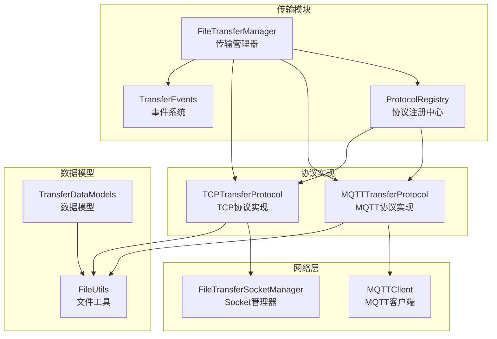
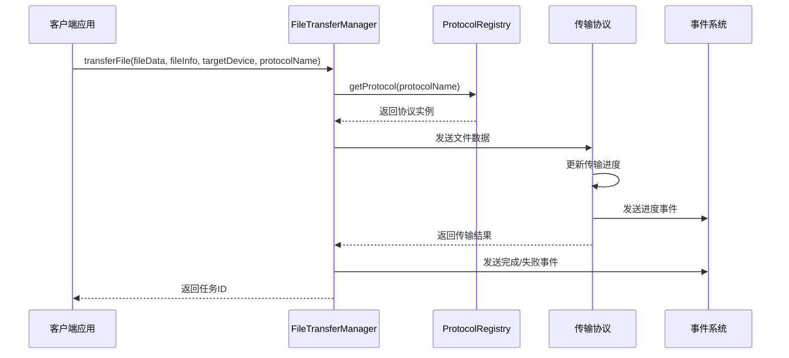
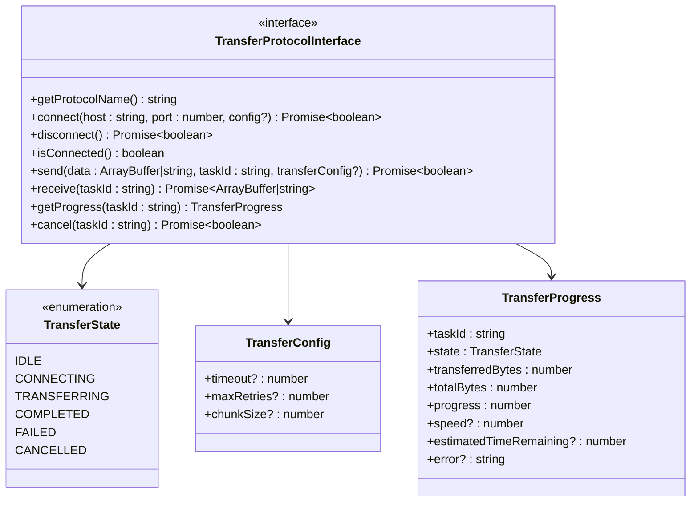
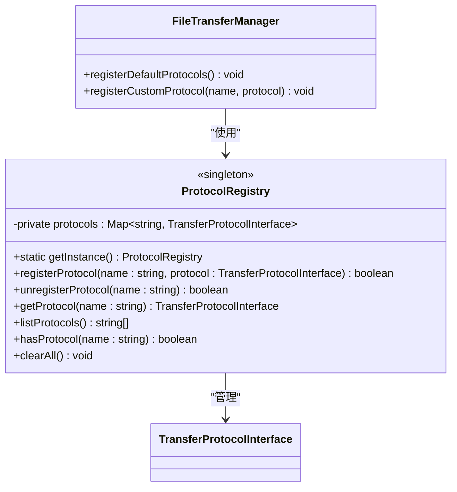
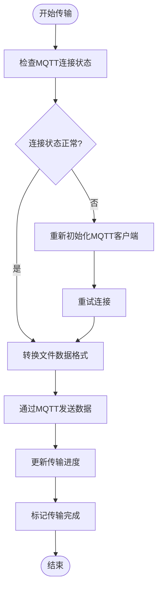
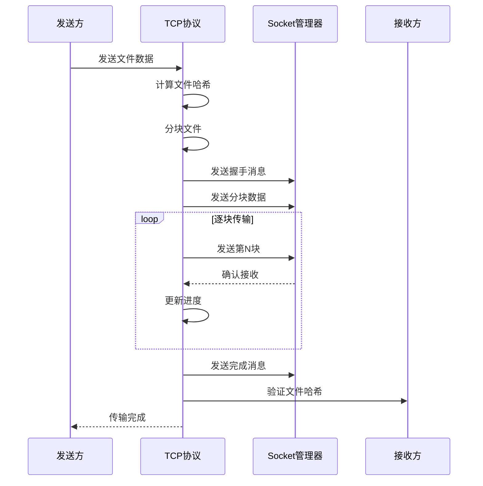
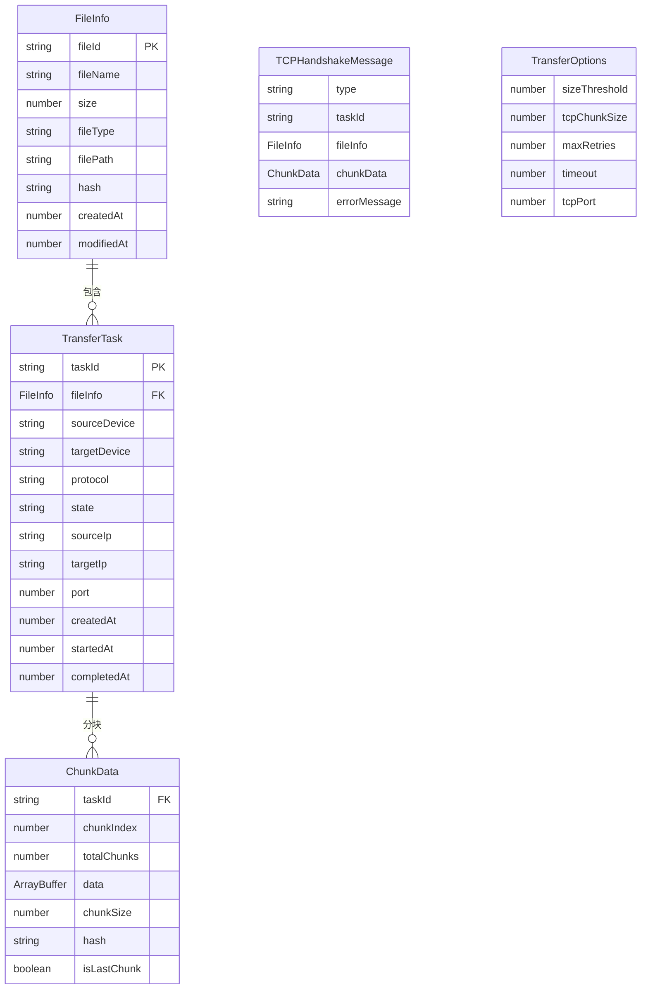
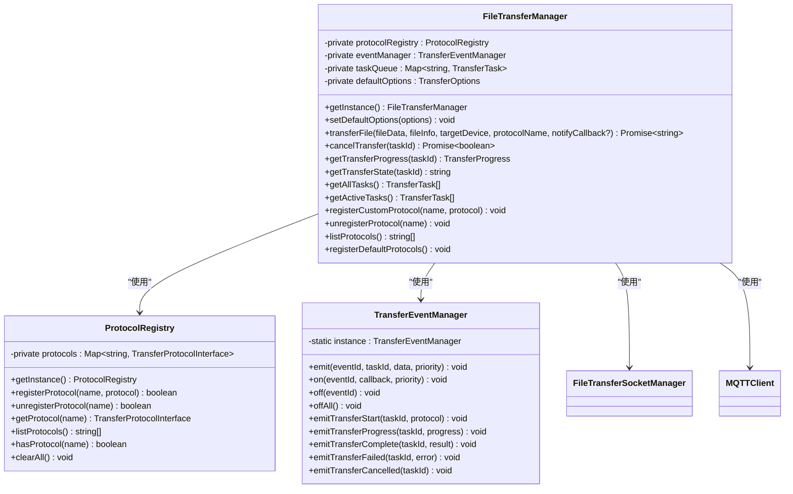
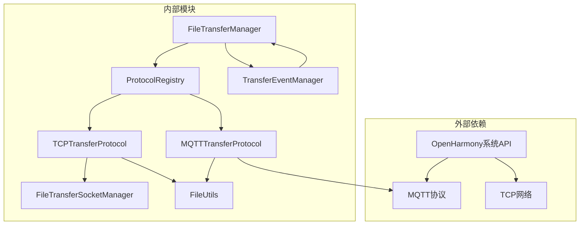

# 传输协议系统

<cite>
**本文档引用的文件**
- [index.ets](file://entry/src/main/ets/manager/transfer/index.ets)
- [TransferDataModels.ets](file://entry/src/main/ets/manager/transfer/model/TransferDataModels.ets)
- [TransferProtocolInterface.ets](file://entry/src/main/ets/manager/transfer/protocol/TransferProtocolInterface.ets)
- [MQTTTransferProtocol.ets](file://entry/src/main/ets/manager/transfer/protocol/MQTTTransferProtocol.ets)
- [TCPTransferProtocol.ets](file://entry/src/main/ets/manager/transfer/protocol/TCPTransferProtocol.ets)
- [ProtocolRegistry.ets](file://entry/src/main/ets/manager/transfer/protocol/ProtocolRegistry.ets)
- [FileTransferManager.ets](file://entry/src/main/ets/manager/transfer/FileTransferManager.ets)
- [TransferEvents.ets](file://entry/src/main/ets/manager/transfer/event/TransferEvents.ets)
- [FileTransferSocketManager.ets](file://entry/src/main/ets/manager/transfer/socket/FileTransferSocketManager.ets)
- [FileUtils.ets](file://entry/src/main/ets/manager/transfer/utils/FileUtils.ets)
- [TransferExamples.ets](file://entry/src/main/ets/manager/transfer/examples/TransferExamples.ets)
- [IMPLEMENTATION_SUMMARY.md](file://entry/src/main/ets/manager/transfer/IMPLEMENTATION_SUMMARY.md)
- [QUICK_REFERENCE.md](file://entry/src/main/ets/manager/transfer/QUICK_REFERENCE.md)
- [MQTTClient.ets](file://entry/src/main/ets/manager/broker/MQTTClient.ets)
</cite>

## 更新摘要
**变更内容**
- 更新了协议架构从单一TCP实现到多协议支持的描述
- 新增了ProtocolRegistry协议注册中心的详细说明
- 更新了FileTransferManager的协议选择机制
- 增强了MQTT和TCP协议实现的技术细节
- 完善了多协议架构的依赖关系分析

## 目录
1. [简介](#简介)
2. [项目结构](#项目结构)
3. [核心组件](#核心组件)
4. [架构概览](#架构概览)
5. [详细组件分析](#详细组件分析)
6. [依赖关系分析](#依赖关系分析)
7. [性能考虑](#性能考虑)
8. [故障排除指南](#故障排除指南)
9. [结论](#结论)
10. [附录](#附录)

## 简介
传输协议系统是一个基于 OpenHarmony 的文件传输模块，提供了协议抽象、多种传输协议实现、数据模型定义和完整的传输管理功能。该系统采用模块化设计，支持 MQTT 和 TCP 两种传输协议，能够根据文件大小自动选择最优的传输方式，并提供完整的进度跟踪、错误处理和事件通知机制。

**更新** 系统现已从单一的TCP实现架构转变为基于TransferProtocolInterface的多协议支持架构，通过ProtocolRegistry实现协议的动态注册和管理。

## 项目结构
传输协议系统采用清晰的分层架构，主要包含以下模块：

**图表来源**
- [FileTransferManager.ets](file://entry/src/main/ets/manager/transfer/FileTransferManager.ets#L45-L80)
- [ProtocolRegistry.ets](file://entry/src/main/ets/manager/transfer/protocol/ProtocolRegistry.ets#L7-L23)
- [MQTTTransferProtocol.ets](file://entry/src/main/ets/manager/transfer/protocol/MQTTTransferProtocol.ets#L10-L18)
- [TCPTransferProtocol.ets](file://entry/src/main/ets/manager/transfer/protocol/TCPTransferProtocol.ets#L23-L38)

**章节来源**
- [index.ets](file://entry/src/main/ets/manager/transfer/index.ets#L1-L58)
- [IMPLEMENTATION_SUMMARY.md](file://entry/src/main/ets/manager/transfer/IMPLEMENTATION_SUMMARY.md#L1-L320)

## 核心组件
传输协议系统的核心由以下关键组件构成：

### 1. 协议抽象层
- **TransferProtocolInterface**: 定义了标准化的协议接口，包括连接、发送、接收、进度查询和取消等方法
- **TransferState**: 传输状态枚举，涵盖空闲、连接中、传输中、完成、失败、取消等状态
- **TransferConfig**: 传输配置接口，支持超时、重试次数、分块大小等参数配置

### 2. 协议注册中心
- **ProtocolRegistry**: 协议注册中心，实现协议的动态注册、查找和管理
- 支持单例模式，提供注册、注销、查询协议的方法
- 支持列出所有可用协议和检查协议是否存在

### 3. 数据模型层
- **FileInfo**: 文件元数据信息，包含文件唯一标识、名称、大小、类型、路径、哈希等属性
- **ChunkData**: 分块数据结构，用于大文件分块传输时的数据组织
- **TransferTask**: 传输任务信息，描述完整的文件传输任务生命周期
- **TransferOptions**: 传输配置选项，支持文件大小阈值、TCP分块大小、重试次数等参数

### 4. 协议实现层
- **MQTTTransferProtocol**: 基于 MQTT 的小文件传输协议，支持直接传输和重试机制
- **TCPTransferProtocol**: 基于 TCP 的大文件传输协议，支持分块传输、握手机制和进度跟踪

**章节来源**
- [TransferProtocolInterface.ets](file://entry/src/main/ets/manager/transfer/protocol/TransferProtocolInterface.ets#L63-L120)
- [ProtocolRegistry.ets](file://entry/src/main/ets/manager/transfer/protocol/ProtocolRegistry.ets#L7-L93)
- [TransferDataModels.ets](file://entry/src/main/ets/manager/transfer/model/TransferDataModels.ets#L10-L113)
- [MQTTTransferProtocol.ets](file://entry/src/main/ets/manager/transfer/protocol/MQTTTransferProtocol.ets#L10-L185)
- [TCPTransferProtocol.ets](file://entry/src/main/ets/manager/transfer/protocol/TCPTransferProtocol.ets#L23-L351)

## 架构概览
系统采用分层架构设计，实现了高度的模块化和可扩展性：

**图表来源**
- [FileTransferManager.ets](file://entry/src/main/ets/manager/transfer/FileTransferManager.ets#L116-L191)
- [ProtocolRegistry.ets](file://entry/src/main/ets/manager/transfer/protocol/ProtocolRegistry.ets#L60-L66)

系统的核心优势在于其协议抽象设计，使得新的传输协议可以轻松集成，同时保持对外接口的稳定性。

**章节来源**
- [FileTransferManager.ets](file://entry/src/main/ets/manager/transfer/FileTransferManager.ets#L38-L73)
- [ProtocolRegistry.ets](file://entry/src/main/ets/manager/transfer/protocol/ProtocolRegistry.ets#L31-L66)

## 详细组件分析

### TransferProtocolInterface 协议抽象
TransferProtocolInterface 定义了标准化的协议接口，确保所有传输协议实现具有一致的行为模式：

**图表来源**
- [TransferProtocolInterface.ets](file://entry/src/main/ets/manager/transfer/protocol/TransferProtocolInterface.ets#L63-L120)

该接口设计遵循了单一职责原则，每个方法都有明确的职责范围，便于理解和维护。

**章节来源**
- [TransferProtocolInterface.ets](file://entry/src/main/ets/manager/transfer/protocol/TransferProtocolInterface.ets#L9-L57)

### ProtocolRegistry 协议注册中心
ProtocolRegistry 实现了协议的动态注册和管理，是多协议架构的核心组件：

**图表来源**
- [ProtocolRegistry.ets](file://entry/src/main/ets/manager/transfer/protocol/ProtocolRegistry.ets#L7-L93)
- [FileTransferManager.ets](file://entry/src/main/ets/manager/transfer/FileTransferManager.ets#L66-L80)

ProtocolRegistry 提供了完整的协议生命周期管理，支持协议的动态注册、注销和查询。

**章节来源**
- [ProtocolRegistry.ets](file://entry/src/main/ets/manager/transfer/protocol/ProtocolRegistry.ets#L7-L93)

### MQTTTransferProtocol 文件传输机制
MQTTTransferProtocol 实现了基于 MQTT 的文件传输协议，专门处理小文件（≤2MB）的直接传输：

**图表来源**
- [MQTTTransferProtocol.ets](file://entry/src/main/ets/manager/transfer/protocol/MQTTTransferProtocol.ets#L70-L109)

MQTT 协议的优势在于其轻量级特性和低延迟，特别适合小文件的快速传输场景。

**章节来源**
- [MQTTTransferProtocol.ets](file://entry/src/main/ets/manager/transfer/protocol/MQTTTransferProtocol.ets#L10-L185)
- [MQTTClient.ets](file://entry/src/main/ets/manager/broker/MQTTClient.ets#L24-L223)

### TCPTransferProtocol 文件传输机制
TCPTransferProtocol 实现了基于 TCP 的大文件传输协议，支持分块传输和完整的传输控制：

**图表来源**
- [TCPTransferProtocol.ets](file://entry/src/main/ets/manager/transfer/protocol/TCPTransferProtocol.ets#L123-L205)
- [FileTransferSocketManager.ets](file://entry/src/main/ets/manager/transfer/socket/FileTransferSocketManager.ets#L236-L263)

TCP 协议提供了可靠的数据传输保证，适用于大文件和对数据完整性要求较高的场景。

**章节来源**
- [TCPTransferProtocol.ets](file://entry/src/main/ets/manager/transfer/protocol/TCPTransferProtocol.ets#L23-L351)
- [FileTransferSocketManager.ets](file://entry/src/main/ets/manager/transfer/socket/FileTransferSocketManager.ets#L31-L354)

### TransferDataModels 数据结构定义
数据模型层定义了传输过程中使用的核心数据结构：

**图表来源**
- [TransferDataModels.ets](file://entry/src/main/ets/manager/transfer/model/TransferDataModels.ets#L10-L113)

这些数据模型确保了传输过程中的数据一致性和完整性。

**章节来源**
- [TransferDataModels.ets](file://entry/src/main/ets/manager/transfer/model/TransferDataModels.ets#L10-L113)

### FileTransferManager 核心管理器
FileTransferManager 作为系统的中央控制器，负责协调各个组件的工作：

**图表来源**
- [FileTransferManager.ets](file://entry/src/main/ets/manager/transfer/FileTransferManager.ets#L17-L375)
- [ProtocolRegistry.ets](file://entry/src/main/ets/manager/transfer/protocol/ProtocolRegistry.ets#L7-L93)
- [TransferEvents.ets](file://entry/src/main/ets/manager/transfer/event/TransferEvents.ets#L62-L206)

**章节来源**
- [FileTransferManager.ets](file://entry/src/main/ets/manager/transfer/FileTransferManager.ets#L17-L375)

## 依赖关系分析
系统采用松耦合的设计，各组件之间的依赖关系清晰明确：

**图表来源**
- [FileTransferManager.ets](file://entry/src/main/ets/manager/transfer/FileTransferManager.ets#L5-L11)
- [MQTTTransferProtocol.ets](file://entry/src/main/ets/manager/transfer/protocol/MQTTTransferProtocol.ets#L5-L8)
- [TCPTransferProtocol.ets](file://entry/src/main/ets/manager/transfer/protocol/TCPTransferProtocol.ets#L5-L9)

这种依赖关系设计确保了系统的可测试性和可维护性。

**章节来源**
- [index.ets](file://entry/src/main/ets/manager/transfer/index.ets#L5-L58)

## 性能考虑
系统在设计时充分考虑了性能优化：

### 1. 分块传输优化
- **默认分块大小**: 128KB，平衡内存占用和传输效率
- **智能阈值**: 2MB 文件大小阈值，自动选择最优协议
- **并发控制**: 支持最大重试3次，避免过度消耗网络资源

### 2. 内存管理
- **流式处理**: 大文件采用分块处理，避免一次性加载到内存
- **及时清理**: 传输完成后自动清理进度记录和连接资源
- **连接池**: TCP连接复用，减少连接建立开销

### 3. 网络优化
- **异步操作**: 所有网络操作采用异步模式，避免阻塞主线程
- **超时控制**: 默认30秒超时，防止长时间等待
- **错误恢复**: 智能重试机制，提高传输成功率

## 故障排除指南
常见问题及解决方案：

### 1. MQTT连接问题
**症状**: MQTT协议无法连接
**原因**: MQTT客户端未正确初始化
**解决方案**:
- 检查MQTT服务器配置
- 确认网络连接状态
- 验证客户端凭据

### 2. TCP传输失败
**症状**: 大文件传输中断
**原因**: 网络不稳定或超时
**解决方案**:
- 增加超时时间配置
- 检查防火墙设置
- 验证端口可用性

### 3. 进度查询异常
**症状**: 无法获取传输进度
**原因**: 任务ID错误或进度记录已清理
**解决方案**:
- 确认任务ID有效性
- 检查任务状态
- 重新查询进度

**章节来源**
- [FileTransferManager.ets](file://entry/src/main/ets/manager/transfer/FileTransferManager.ets#L247-L273)
- [MQTTTransferProtocol.ets](file://entry/src/main/ets/manager/transfer/protocol/MQTTTransferProtocol.ets#L31-L46)

## 结论
传输协议系统是一个设计精良、功能完整的文件传输解决方案。其核心优势包括：

1. **协议抽象设计**: 通过 TransferProtocolInterface 实现了高度的可扩展性
2. **智能协议选择**: 根据文件大小自动选择最优传输协议
3. **完善的错误处理**: 提供重试机制和进度跟踪
4. **模块化架构**: 清晰的职责分离和依赖管理
5. **性能优化**: 分块传输和连接池等优化措施

**更新** 系统现已支持多协议架构，通过ProtocolRegistry实现协议的动态注册和管理，为未来的功能扩展和技术演进奠定了坚实的基础。

## 附录

### 配置选项详解
| 参数名 | 默认值 | 说明 | 使用场景 |
|--------|--------|------|----------|
| sizeThreshold | 2MB | MQTT/TCP切换阈值 | 频繁大文件传输 |
| tcpChunkSize | 128KB | TCP分块大小 | WiFi环境优化 |
| maxRetries | 3次 | 最大重试次数 | 网络不稳定环境 |
| timeout | 30秒 | 连接超时时间 | 远距离传输 |
| tcpPort | 8888 | TCP监听端口 | 端口冲突处理 |

### 使用模式示例
系统提供了多种使用模式，包括基本传输、大文件传输、进度监控、批量传输等场景。

**章节来源**
- [QUICK_REFERENCE.md](file://entry/src/main/ets/manager/transfer/QUICK_REFERENCE.md#L177-L248)
- [TransferExamples.ets](file://entry/src/main/ets/manager/transfer/examples/TransferExamples.ets#L1-L201)