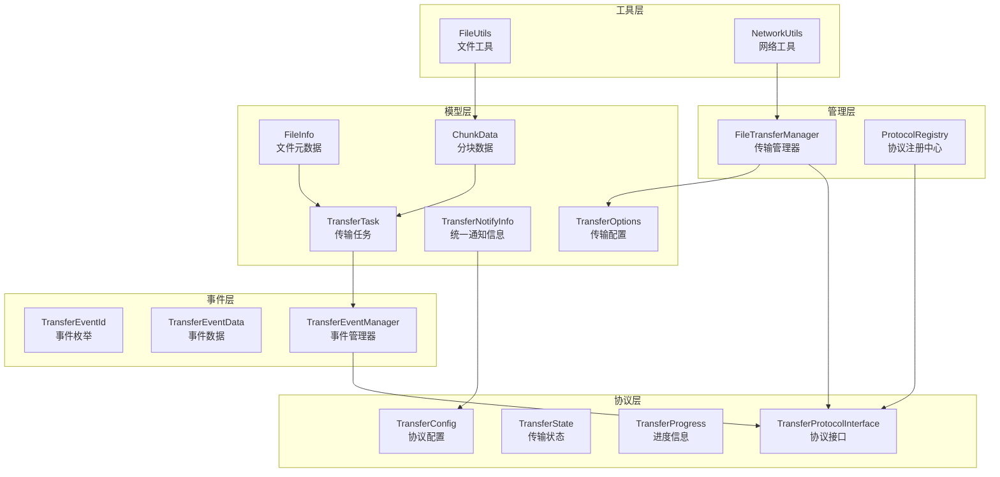
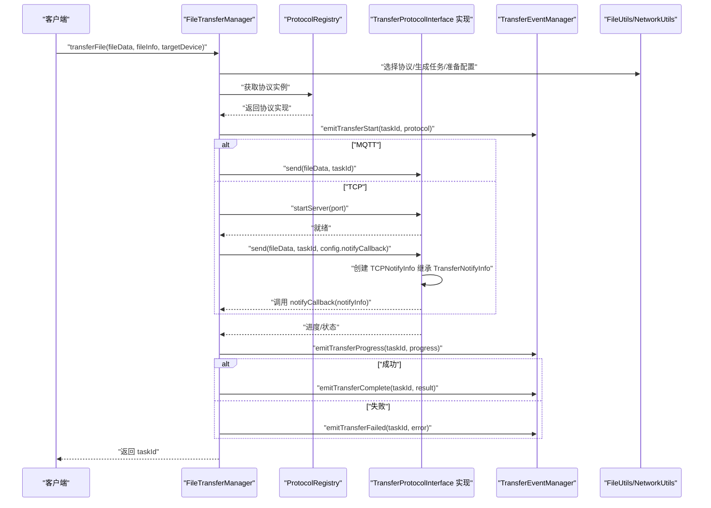
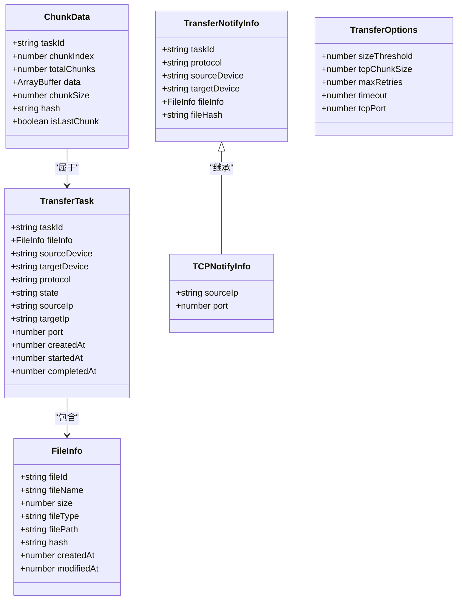
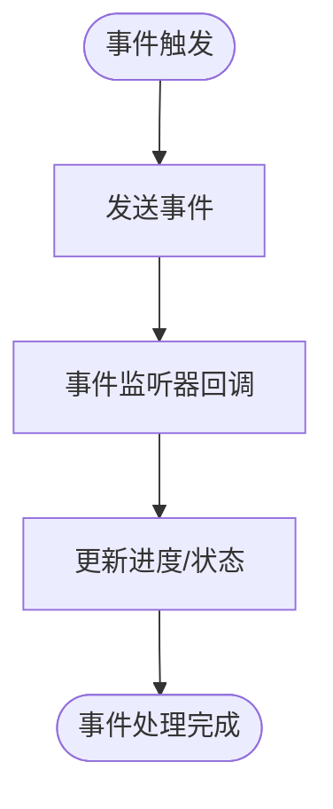
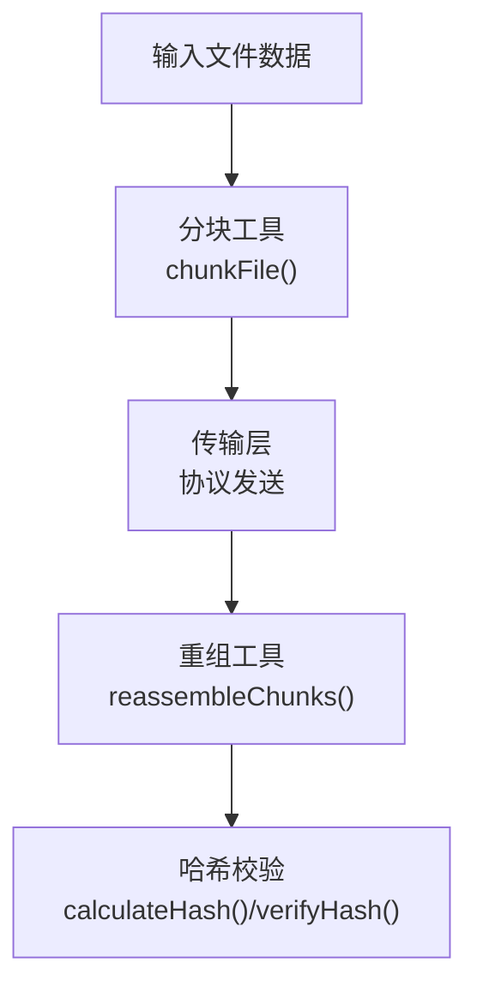
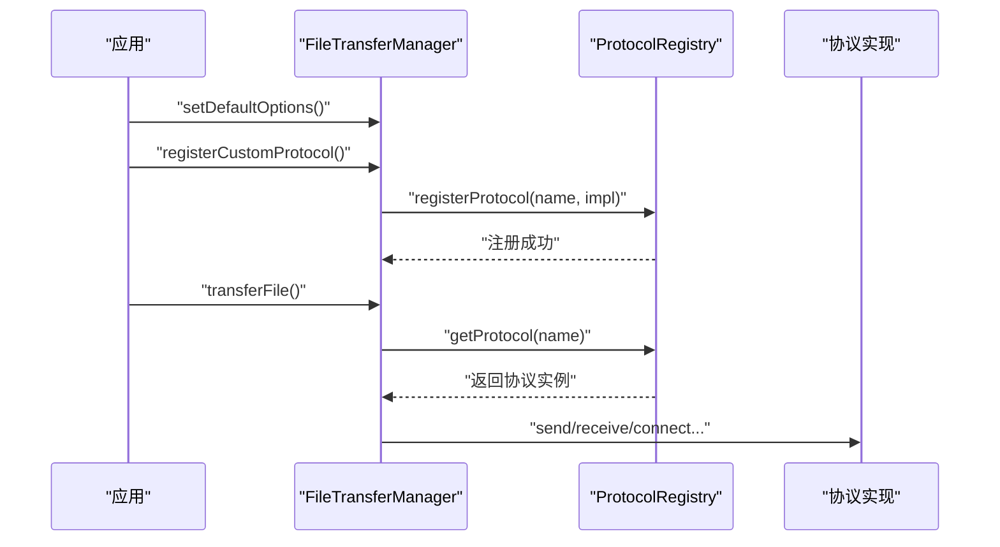
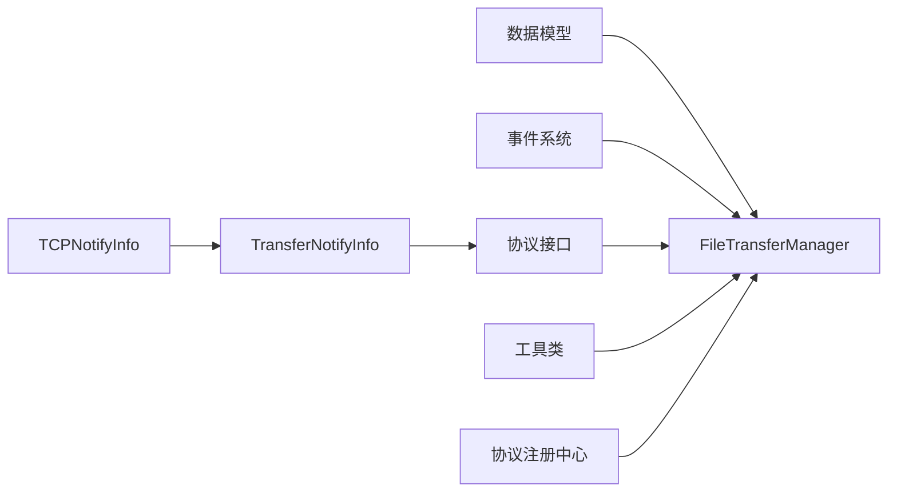

# 传输数据模型

<cite>
**本文引用的文件**
- [TransferDataModels.ets](file://entry/src/main/ets/manager/transfer/model/TransferDataModels.ets)
- [TransferEvents.ets](file://entry/src/main/ets/manager/transfer/event/TransferEvents.ets)
- [TransferProtocolInterface.ets](file://entry/src/main/ets/manager/transfer/protocol/TransferProtocolInterface.ets)
- [FileTransferManager.ets](file://entry/src/main/ets/manager/transfer/FileTransferManager.ets)
- [FileUtils.ets](file://entry/src/main/ets/manager/transfer/utils/FileUtils.ets)
- [NetworkUtils.ets](file://entry/src/main/ets/manager/transfer/utils/NetworkUtils.ets)
- [ProtocolRegistry.ets](file://entry/src/main/ets/manager/transfer/protocol/ProtocolRegistry.ets)
- [TransferExamples.ets](file://entry/src/main/ets/manager/transfer/examples/TransferExamples.ets)
- [index.ets](file://entry/src/main/ets/manager/transfer/index.ets)
- [FileTransfer.test.ets](file://entry/src/test/transfer/FileTransfer.test.ets)
- [IMPLEMENTATION_SUMMARY.md](file://entry/src/main/ets/manager/transfer/IMPLEMENTATION_SUMMARY.md)
- [QUICK_REFERENCE.md](file://entry/src/main/ets/manager/transfer/QUICK_REFERENCE.md)
- [TCPModels.ets](file://entry/src/main/ets/manager/transfer/model/TCPModels.ets)
- [MQTTTransferProtocol.ets](file://entry/src/main/ets/manager/transfer/protocol/MQTTTransferProtocol.ets)
- [TCPTransferProtocol.ets](file://entry/src/main/ets/manager/transfer/protocol/TCPTransferProtocol.ets)
</cite>

## 更新摘要
**变更内容**
- 新增统一通知系统：引入 TransferNotifyInfo 和 TransferNotifyCallback 接口
- 移除协议特定的通知模型，实现协议无关的通知机制
- 更新 TCP 协议通知模型为继承统一通知接口
- 优化通知系统的通用性和可扩展性

## 目录
1. [简介](#简介)
2. [项目结构](#项目结构)
3. [核心组件](#核心组件)
4. [架构总览](#架构总览)
5. [详细组件分析](#详细组件分析)
6. [依赖分析](#依赖分析)
7. [性能考量](#性能考量)
8. [故障排查指南](#故障排查指南)
9. [结论](#结论)
10. [附录](#附录)

## 简介
本文件聚焦于传输数据模型，系统性梳理并解释 TransferDataModels 中定义的数据模型类与接口，包括文件传输任务的数据结构、传输配置模型、进度跟踪模型的设计与用途，并结合事件系统、协议接口、工具类与管理器的使用方式，给出字段语义、数据类型、验证规则、默认值、示例与序列化/反序列化思路、模型间关系、扩展与自定义指南、持久化与缓存策略、以及数据校验与错误处理最佳实践。

**更新** 新增统一通知系统，提供协议无关的通知机制，简化了协议特定的通知模型。

## 项目结构
传输数据模型位于"manager/transfer"目录下，围绕"模型-事件-协议-工具-管理器"的分层组织：
- 模型层：定义数据结构（文件元数据、分块数据、传输任务、通知信息、传输配置）
- 事件层：定义事件枚举、事件数据与事件管理器
- 协议层：定义协议接口、状态枚举、进度信息与配置
- 工具层：文件分块/重组、哈希计算/校验、网络工具
- 管理层：统一调度与任务生命周期管理

**图表来源**
- [TransferDataModels.ets:10-122](file://entry/src/main/ets/manager/transfer/model/TransferDataModels.ets#L10-L122)
- [TransferEvents.ets:11-206](file://entry/src/main/ets/manager/transfer/event/TransferEvents.ets#L11-L206)
- [TransferProtocolInterface.ets:9-163](file://entry/src/main/ets/manager/transfer/protocol/TransferProtocolInterface.ets#L9-L163)
- [FileUtils.ets:8-193](file://entry/src/main/ets/manager/transfer/utils/FileUtils.ets#L8-L193)
- [NetworkUtils.ets:7-131](file://entry/src/main/ets/manager/transfer/utils/NetworkUtils.ets#L7-L131)
- [FileTransferManager.ets:17-375](file://entry/src/main/ets/manager/transfer/FileTransferManager.ets#L17-L375)
- [ProtocolRegistry.ets:7-93](file://entry/src/main/ets/manager/transfer/protocol/ProtocolRegistry.ets#L7-L93)

**章节来源**
- [index.ets:1-45](file://entry/src/main/ets/manager/transfer/index.ets#L1-L45)
- [IMPLEMENTATION_SUMMARY.md:1-320](file://entry/src/main/ets/manager/transfer/IMPLEMENTATION_SUMMARY.md#L1-L320)

## 核心组件
本节对核心数据模型进行逐项说明，涵盖字段含义、数据类型、验证规则与默认值，并给出使用示例与序列化/反序列化建议。

**更新** 新增统一通知系统，提供协议无关的通知机制。

- FileInfo（文件元数据）
  - 字段与类型
    - fileId: string（必填；唯一标识）
    - fileName: string（必填；文件名）
    - size: number（必填；字节）
    - fileType?: string（可选；MIME 类型）
    - filePath?: string（可选；文件路径）
    - hash?: string（可选；哈希值，用于校验）
    - createdAt?: number（可选；创建时间戳）
    - modifiedAt?: number（可选；最后修改时间戳）
  - 验证规则
    - size 必须为非负数；fileName 非空；fileType 符合 MIME 规范；filePath 为有效路径；createdAt/modifiedAt 为合法时间戳
  - 默认值
    - 无硬性默认值；建议由生成器或工具类填充
  - 示例
    - 参考示例：[示例 1-2:12-48](file://entry/src/main/ets/manager/transfer/examples/TransferExamples.ets#L12-L48)
  - 序列化/反序列化
    - JSON 序列化时注意时间戳字段命名一致性；哈希字段可作为字符串存储；必要时对二进制数据采用 Base64 编码

- ChunkData（分块数据）
  - 字段与类型
    - taskId: string（必填；所属任务 ID）
    - chunkIndex: number（必填；从 0 开始的分块索引）
    - totalChunks: number（必填；总块数）
    - data: ArrayBuffer（必填；当前块数据）
    - chunkSize: number（必填；当前块大小）
    - hash?: string（可选；当前块哈希，用于校验）
    - isLastChunk: boolean（必填；是否为最后一块）
  - 验证规则
    - chunkIndex ∈ [0, totalChunks-1]；chunkSize 与 data.byteLength 一致；isLastChunk 与索引关系一致
  - 默认值
    - 无硬性默认值；由分块工具生成
  - 示例
    - 参考示例：[示例 9:139-150](file://entry/src/main/ets/manager/transfer/examples/TransferExamples.ets#L139-L150)
  - 序列化/反序列化
    - data 建议 Base64 编码；其他数值字段可直接序列化；注意跨进程/跨设备传输时的字节序与编码一致性

- TransferTask（传输任务）
  - 字段与类型
    - taskId: string（必填；任务唯一标识）
    - fileInfo: FileInfo（必填；文件信息）
    - sourceDevice: string（必填；源设备标识）
    - targetDevice: string（必填；目标设备标识）
    - protocol: string（必填；使用的传输协议）
    - state: string（必填；当前传输状态）
    - sourceIp?: string（可选；TCP 传输时使用）
    - targetIp?: string（可选；TCP 传输时使用）
    - port?: number（可选；TCP 传输时使用）
    - createdAt: number（必填；创建时间戳）
    - startedAt?: number（可选；开始传输时间戳）
    - completedAt?: number（可选；完成时间戳）
  - 验证规则
    - fileInfo 必须有效；state 属于协议状态集合；sourceIp/targetIp 为合法 IPv4；port 在 1-65535 范围内
  - 默认值
    - 无硬性默认值；由管理器创建时填充
  - 示例
    - 参考示例：[示例 10:155-186](file://entry/src/main/ets/manager/transfer/examples/TransferExamples.ets#L155-L186)
  - 序列化/反序列化
    - JSON 序列化；必要时对二进制数据进行 Base64；注意跨设备时 IP 与端口的可达性

- TransferNotifyInfo（统一通知信息）
  - 字段与类型
    - taskId: string（必填；任务唯一标识）
    - protocol: string（必填；协议名称，如 'TCP', 'MQTT', 'HTTP' 等）
    - sourceDevice: string（必填；源设备标识，如 IP 地址或设备 ID）
    - targetDevice?: string（可选；目标设备标识）
    - fileInfo?: FileInfo（可选；文件元数据）
    - fileHash?: string（可选；文件哈希值，用于校验）
  - 验证规则
    - taskId 必填且唯一；protocol 为有效的协议名称；sourceDevice 为合法标识；fileInfo 与 fileHash 需要配对使用
  - 默认值
    - 无硬性默认值；由协议实现根据实际情况填充
  - 示例
    - 参考示例：[示例 170:169-170](file://entry/src/main/ets/manager/transfer/examples/TransferExamples.ets#L169-L170)
  - 序列化/反序列化
    - JSON 序列化；支持任意协议扩展；必要时对二进制数据进行 Base64 编码

- TransferNotifyCallback（统一通知回调）
  - 类型定义
    - (notifyInfo: TransferNotifyInfo) => Promise<void>
  - 功能描述
    - 当传输协议准备就绪后调用，用于通知目标设备可以开始接收数据
  - 使用场景
    - TCP 协议服务器启动后通知目标设备发起连接
    - 其他协议准备就绪后的通用通知机制
  - 示例
    - 参考示例：[示例 174:174-175](file://entry/src/main/ets/manager/transfer/examples/TransferExamples.ets#L174-L175)

- TransferOptions（传输配置）
  - 字段与类型
    - sizeThreshold?: number（可选；文件大小阈值，字节，默认 2MB）
    - tcpChunkSize?: number（可选；TCP 分块大小，字节，默认 128KB）
    - maxRetries?: number（可选；最大重试次数，默认 3 次）
    - timeout?: number（可选；连接超时，毫秒，默认 30000ms）
    - tcpPort?: number（可选；TCP 监听端口，默认 8888）
  - 验证规则
    - sizeThreshold > 0；tcpChunkSize > 0；maxRetries ≥ 0；timeout > 0；tcpPort ∈ [1, 65535]
  - 默认值
    - 参考默认配置：[默认配置:29-36](file://entry/src/main/ets/manager/transfer/FileTransferManager.ets#L29-L36)
  - 示例
    - 参考示例：[示例 5:78-92](file://entry/src/main/ets/manager/transfer/examples/TransferExamples.ets#L78-L92)
  - 序列化/反序列化
    - JSON 序列化；可作为配置对象持久化；运行时可通过管理器更新

**章节来源**
- [TransferDataModels.ets:10-122](file://entry/src/main/ets/manager/transfer/model/TransferDataModels.ets#L10-L122)
- [TransferExamples.ets:12-186](file://entry/src/main/ets/manager/transfer/examples/TransferExamples.ets#L12-L186)
- [FileTransferManager.ets:29-36](file://entry/src/main/ets/manager/transfer/FileTransferManager.ets#L29-L36)

## 架构总览
传输数据模型与事件系统、协议接口、工具类、管理器协同工作，形成"数据驱动+事件驱动"的传输体系：

**图表来源**
- [FileTransferManager.ets:105-187](file://entry/src/main/ets/manager/transfer/FileTransferManager.ets#L105-L187)
- [ProtocolRegistry.ets:60-66](file://entry/src/main/ets/manager/transfer/protocol/ProtocolRegistry.ets#L60-L66)
- [TransferEvents.ets:161-204](file://entry/src/main/ets/manager/transfer/event/TransferEvents.ets#L161-L204)
- [FileUtils.ets:16-39](file://entry/src/main/ets/manager/transfer/utils/FileUtils.ets#L16-L39)
- [NetworkUtils.ets:12-29](file://entry/src/main/ets/manager/transfer/utils/NetworkUtils.ets#L12-L29)
- [TCPTransferProtocol.ets:164-178](file://entry/src/main/ets/manager/transfer/protocol/TCPTransferProtocol.ets#L164-L178)

## 详细组件分析

### 数据模型类图

**图表来源**
- [TransferDataModels.ets:10-122](file://entry/src/main/ets/manager/transfer/model/TransferDataModels.ets#L10-L122)
- [TCPModels.ets:26-31](file://entry/src/main/ets/manager/transfer/model/TCPModels.ets#L26-L31)

**章节来源**
- [TransferDataModels.ets:10-122](file://entry/src/main/ets/manager/transfer/model/TransferDataModels.ets#L10-L122)
- [TCPModels.ets:26-31](file://entry/src/main/ets/manager/transfer/model/TCPModels.ets#L26-L31)

### 事件与进度模型
- 事件模型
  - 事件 ID：包含传输开始、进度更新、完成、失败、取消、TCP 连接建立/断开、分块接收、文件重组完成等
  - 事件数据：包含 taskId、eventType、data、timestamp
  - 事件管理器：提供 emit/on/off/offAll 等方法，支持优先级
- 进度模型
  - TransferProgress：包含 taskId、state、transferredBytes、totalBytes、progress、speed、estimatedTimeRemaining、error
  - 状态枚举：IDLE、CONNECTING、TRANSFERRING、COMPLETED、FAILED、CANCELLED
  - 协议配置：timeout、maxRetries、chunkSize

**图表来源**
- [TransferEvents.ets:62-206](file://entry/src/main/ets/manager/transfer/event/TransferEvents.ets#L62-L206)
- [TransferProtocolInterface.ets:9-57](file://entry/src/main/ets/manager/transfer/protocol/TransferProtocolInterface.ets#L9-L57)

**章节来源**
- [TransferEvents.ets:11-206](file://entry/src/main/ets/manager/transfer/event/TransferEvents.ets#L11-L206)
- [TransferProtocolInterface.ets:9-57](file://entry/src/main/ets/manager/transfer/protocol/TransferProtocolInterface.ets#L9-L57)

### 工具与网络模型
- 文件工具
  - 分块/重组：chunkFile/reassembleChunks
  - 哈希：calculateHash/verifyHash（SHA-256）
  - 编解码：Base64 与 ArrayBuffer/字符串互转
  - 文件 ID 生成：generateFileId
- 网络工具
  - IP 获取、网络状态检查、子网掩码/网关获取
  - IP 格式验证、端口有效性验证

**图表来源**
- [FileUtils.ets:16-115](file://entry/src/main/ets/manager/transfer/utils/FileUtils.ets#L16-L115)
- [NetworkUtils.ets:12-129](file://entry/src/main/ets/manager/transfer/utils/NetworkUtils.ets#L12-L129)

**章节来源**
- [FileUtils.ets:8-193](file://entry/src/main/ets/manager/transfer/utils/FileUtils.ets#L8-L193)
- [NetworkUtils.ets:7-131](file://entry/src/main/ets/manager/transfer/utils/NetworkUtils.ets#L7-L131)

### 管理器与协议注册
- FileTransferManager
  - 单例；自动协议选择（小文件用 MQTT，大文件用 TCP）
  - 任务队列管理、进度查询、取消、清理
  - 默认配置可更新；支持注册自定义协议
- ProtocolRegistry
  - 协议注册、注销、查找、列举、清空

**图表来源**
- [FileTransferManager.ets:79-96](file://entry/src/main/ets/manager/transfer/FileTransferManager.ets#L79-L96)
- [FileTransferManager.ets:353-356](file://entry/src/main/ets/manager/transfer/FileTransferManager.ets#L353-L356)
- [ProtocolRegistry.ets:31-38](file://entry/src/main/ets/manager/transfer/protocol/ProtocolRegistry.ets#L31-L38)

**章节来源**
- [FileTransferManager.ets:17-375](file://entry/src/main/ets/manager/transfer/FileTransferManager.ets#L17-L375)
- [ProtocolRegistry.ets:7-93](file://entry/src/main/ets/manager/transfer/protocol/ProtocolRegistry.ets#L7-L93)

### 统一通知系统
**新增** 统一通知系统提供了协议无关的通知机制，简化了协议特定的通知模型。

- TransferNotifyInfo（统一通知信息）
  - 基础接口，定义所有传输通知的通用字段
  - 包含任务标识、协议名称、源设备标识、目标设备标识、文件元数据和文件哈希
  - 支持任意协议扩展，通过继承添加协议特定字段
- TransferNotifyCallback（统一通知回调）
  - 通用回调类型，适用于所有传输协议
  - 参数为 TransferNotifyInfo，返回 Promise<void>
  - 简化了协议间的回调接口统一
- 协议特定通知模型
  - TCPNotifyInfo 继承 TransferNotifyInfo，添加 TCP 特有字段（sourceIp、port）
  - 保持向后兼容性，同时提供更具体的协议信息
- 使用场景
  - TCP 协议：服务器启动后通过 notifyCallback 通知目标设备发起连接
  - 其他协议：统一的通知接口，便于扩展新的传输协议

**章节来源**
- [TransferDataModels.ets:102-121](file://entry/src/main/ets/manager/transfer/model/TransferDataModels.ets#L102-L121)
- [TCPModels.ets:26-37](file://entry/src/main/ets/manager/transfer/model/TCPModels.ets#L26-L37)
- [TransferProtocolInterface.ets:43-62](file://entry/src/main/ets/manager/transfer/protocol/TransferProtocolInterface.ets#L43-L62)

## 依赖分析
- 模型依赖
  - TransferTask 依赖 FileInfo 与 ChunkData（间接通过传输流程）
  - TransferNotifyInfo 作为统一通知接口，被 TransferConfig 和协议实现使用
  - TCPNotifyInfo 继承 TransferNotifyInfo，保持向后兼容
- 事件依赖
  - 事件管理器依赖事件枚举与事件数据接口
- 协议依赖
  - 协议接口依赖状态枚举、进度信息与配置
  - 协议配置中的 notifyCallback 使用统一通知回调类型
- 工具依赖
  - 管理器依赖工具类进行分块、哈希与网络信息获取
- 管理器依赖
  - 管理器依赖协议注册中心与事件系统

**图表来源**
- [index.ets:1-45](file://entry/src/main/ets/manager/transfer/index.ets#L1-L45)
- [FileTransferManager.ets:17-44](file://entry/src/main/ets/manager/transfer/FileTransferManager.ets#L17-L44)
- [TransferDataModels.ets:102-121](file://entry/src/main/ets/manager/transfer/model/TransferDataModels.ets#L102-L121)
- [TCPModels.ets:26-37](file://entry/src/main/ets/manager/transfer/model/TCPModels.ets#L26-L37)

**章节来源**
- [index.ets:1-45](file://entry/src/main/ets/manager/transfer/index.ets#L1-L45)

## 性能考量
- 分块传输
  - TCP 分块大小默认 128KB，可根据网络状况调整；过大增加内存压力，过小增加开销
- 连接与超时
  - 默认超时 30000ms，弱网环境可适当增大
- 重试策略
  - 默认最大重试 3 次，网络波动较大时可适度增加
- 任务清理
  - 管理器定期清理已完成/取消/失败任务，避免内存泄漏
- 通知系统
  - 统一通知回调减少了协议特定的处理逻辑，提高了系统整体性能
  - 通知信息的最小化设计，避免不必要的数据传输

**章节来源**
- [FileTransferManager.ets:29-36](file://entry/src/main/ets/manager/transfer/FileTransferManager.ets#L29-L36)
- [FileTransferManager.ets:327-346](file://entry/src/main/ets/manager/transfer/FileTransferManager.ets#L327-L346)

## 故障排查指南
- 常见问题定位
  - 协议未找到：检查协议注册中心是否已注册对应协议
  - 任务不存在：确认 taskId 是否正确，是否已被清理
  - IP/端口无效：使用网络工具验证 IP 格式与端口范围
  - 哈希不匹配：确认哈希计算与校验流程一致
  - 通知失败：检查 notifyCallback 是否正确实现，确保 TransferNotifyInfo 字段完整
- 错误处理最佳实践
  - 传输管理器对异常进行捕获并抛出；事件系统记录错误信息
  - 建议在业务层统一 try-catch，并在失败时触发事件或回退策略
  - 统一通知系统减少了协议特定的错误处理复杂度
- 单元测试参考
  - 协议注册、文件分块/重组、哈希计算/校验、网络工具验证、管理器行为、通知系统等均有覆盖

**章节来源**
- [FileTransfer.test.ets:15-205](file://entry/src/test/transfer/FileTransfer.test.ets#L15-L205)
- [TransferEvents.ets:97-107](file://entry/src/main/ets/manager/transfer/event/TransferEvents.ets#L97-L107)

## 结论
传输数据模型以清晰的接口与稳健的默认值为基础，配合事件系统、协议接口与工具类，实现了从文件元数据、分块数据、传输任务到进度跟踪的完整闭环。通过管理器的统一调度与协议注册中心的动态扩展能力，系统具备良好的可扩展性与可维护性。

**更新** 新的统一通知系统进一步简化了协议间的交互，提供了更加灵活和可扩展的通知机制。通过 TransferNotifyInfo 和 TransferNotifyCallback 的引入，系统实现了协议无关的通知接口，既保持了向后兼容性，又为未来的协议扩展奠定了基础。

建议在实际部署中结合网络环境与业务需求，合理配置阈值、分块大小、重试次数与超时时间，并建立完善的日志与监控体系。统一通知系统为新协议的快速集成提供了便利，降低了开发成本。

## 附录

### 数据模型扩展与自定义指南
- 新增字段
  - 在现有模型中新增字段时，建议保持向后兼容，提供默认值或可选字段
  - 对于通知系统，可以通过继承 TransferNotifyInfo 添加协议特定字段
- 自定义协议
  - 实现协议接口并注册到协议注册中心；通过管理器进行统一调度
  - 使用统一通知回调类型，简化协议间的接口一致性
- 自定义事件
  - 在事件枚举中新增事件类型，并在事件管理器中提供对应的触发方法
- 通知系统扩展
  - 通过继承 TransferNotifyInfo 创建协议特定的通知模型
  - 确保新协议的通知信息包含必要的连接和传输参数

**章节来源**
- [TransferProtocolInterface.ets:63-163](file://entry/src/main/ets/manager/transfer/protocol/TransferProtocolInterface.ets#L63-L163)
- [ProtocolRegistry.ets:31-66](file://entry/src/main/ets/manager/transfer/protocol/ProtocolRegistry.ets#L31-L66)
- [TransferEvents.ets:11-30](file://entry/src/main/ets/manager/transfer/event/TransferEvents.ets#L11-L30)
- [TCPModels.ets:26-37](file://entry/src/main/ets/manager/transfer/model/TCPModels.ets#L26-L37)

### 数据持久化与缓存策略
- 任务队列
  - 管理器内部使用 Map 存储任务，适合短期运行；如需持久化，可在应用层将任务序列化存储
- 配置持久化
  - 传输配置可作为 JSON 对象持久化，应用启动时加载
- 缓存建议
  - 进度信息与最近一次传输结果可缓存于内存；哈希值可缓存以减少重复计算
  - 统一通知信息可以在协议就绪时缓存，避免重复计算连接参数
- 通知系统缓存
  - 通知回调函数可以缓存，提高通知触发的响应速度
  - 通知信息的最小化存储，减少内存占用

**章节来源**
- [FileTransferManager.ets:27-36](file://entry/src/main/ets/manager/transfer/FileTransferManager.ets#L27-L36)
- [FileTransferManager.ets:327-346](file://entry/src/main/ets/manager/transfer/FileTransferManager.ets#L327-L346)

### 数据校验与错误处理最佳实践
- 输入校验
  - 文件大小、端口范围、IP 格式、MIME 类型等均需校验
  - 统一通知信息的字段完整性校验，确保关键连接参数正确
- 错误传播
  - 管理器捕获异常并向上抛出；事件系统记录错误详情
  - 统一通知系统的错误处理应该保持一致的错误格式
- 重试与降级
  - 在弱网或失败场景下，采用指数退避策略并提供降级方案（如切换协议）
  - 通知失败时的重试机制，确保目标设备能够及时收到连接信息
- 通知系统最佳实践
  - 通知回调应该异步处理，避免阻塞主传输流程
  - 通知信息应该包含足够的连接参数，减少目标设备的查询成本
  - 统一的通知接口简化了错误处理和日志记录

**章节来源**
- [NetworkUtils.ets:94-129](file://entry/src/main/ets/manager/transfer/utils/NetworkUtils.ets#L94-L129)
- [FileUtils.ets:77-115](file://entry/src/main/ets/manager/transfer/utils/FileUtils.ets#L77-L115)
- [FileTransferManager.ets:182-186](file://entry/src/main/ets/manager/transfer/FileTransferManager.ets#L182-L186)
- [TCPTransferProtocol.ets:164-178](file://entry/src/main/ets/manager/transfer/protocol/TCPTransferProtocol.ets#L164-L178)