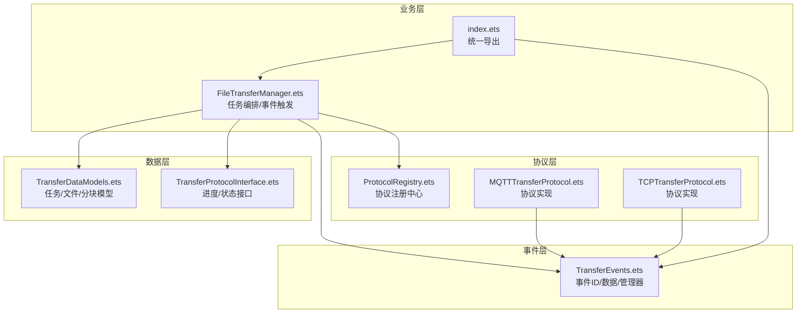
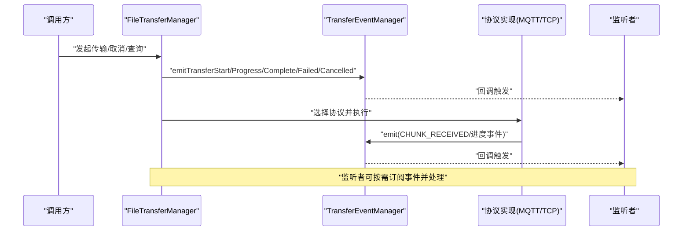
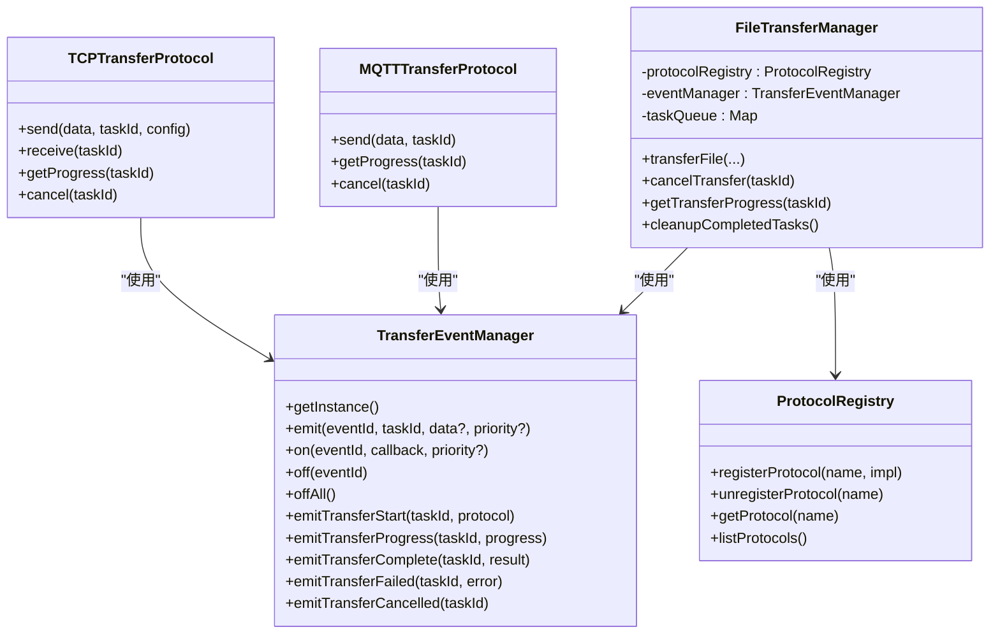

# 事件系统

<cite>
**本文引用的文件**
- [TransferEvents.ets](file://entry/src/main/ets/manager/transfer/event/TransferEvents.ets)
- [TransferProtocolInterface.ets](file://entry/src/main/ets/manager/transfer/protocol/TransferProtocolInterface.ets)
- [index.ets](file://entry/src/main/ets/manager/transfer/index.ets)
- [FileTransferManager.ets](file://entry/src/main/ets/manager/transfer/FileTransferManager.ets)
- [TransferDataModels.ets](file://entry/src/main/ets/manager/transfer/model/TransferDataModels.ets)
- [ProtocolRegistry.ets](file://entry/src/main/ets/manager/transfer/protocol/ProtocolRegistry.ets)
- [MQTTTransferProtocol.ets](file://entry/src/main/ets/manager/transfer/protocol/MQTTTransferProtocol.ets)
- [TCPTransferProtocol.ets](file://entry/src/main/ets/manager/transfer/protocol/TCPTransferProtocol.ets)
- [FileTransfer.test.ets](file://entry/src/test/transfer/FileTransfer.test.ets)
</cite>

## 目录
1. [简介](#简介)
2. [项目结构](#项目结构)
3. [核心组件](#核心组件)
4. [架构总览](#架构总览)
5. [组件详解](#组件详解)
6. [依赖关系分析](#依赖关系分析)
7. [性能考量](#性能考量)
8. [故障排查指南](#故障排查指南)
9. [结论](#结论)
10. [附录](#附录)

## 简介
本文件为传输事件系统提供详尽的API文档与架构说明，重点围绕 TransferEvents 类及其配套的事件管理与传播机制展开。内容涵盖：
- 事件类型与数据结构
- 事件监听与触发时机
- 事件传播与异步处理模式
- 生命周期管理与内存防护
- 性能优化策略
- 使用示例与调试技巧

## 项目结构
传输事件系统位于传输模块的 event 子目录，并与协议层、管理器、数据模型协同工作。关键文件与职责如下：
- 事件定义与管理：TransferEvents.ets
- 事件数据契约：TransferProtocolInterface.ets（包含进度数据结构）
- 模块统一导出：index.ets
- 业务编排与事件触发：FileTransferManager.ets
- 数据模型：TransferDataModels.ets
- 协议注册中心：ProtocolRegistry.ets
- 协议实现与事件使用：MQTTTransferProtocol.ets、TCPTransferProtocol.ets
- 测试与示例：FileTransfer.test.ets

图表来源
- [TransferEvents.ets](file://entry/src/main/ets/manager/transfer/event/TransferEvents.ets#L1-L206)
- [index.ets](file://entry/src/main/ets/manager/transfer/index.ets#L1-L45)
- [FileTransferManager.ets](file://entry/src/main/ets/manager/transfer/FileTransferManager.ets#L1-L375)
- [ProtocolRegistry.ets](file://entry/src/main/ets/manager/transfer/protocol/ProtocolRegistry.ets#L1-L93)
- [MQTTTransferProtocol.ets](file://entry/src/main/ets/manager/transfer/protocol/MQTTTransferProtocol.ets#L1-L185)
- [TCPTransferProtocol.ets](file://entry/src/main/ets/manager/transfer/protocol/TCPTransferProtocol.ets#L1-L351)
- [TransferDataModels.ets](file://entry/src/main/ets/manager/transfer/model/TransferDataModels.ets#L1-L113)
- [TransferProtocolInterface.ets](file://entry/src/main/ets/manager/transfer/protocol/TransferProtocolInterface.ets#L1-L120)

章节来源
- [index.ets](file://entry/src/main/ets/manager/transfer/index.ets#L1-L45)

## 核心组件
- 事件ID枚举：定义传输生命周期内的关键事件，如开始、进度、完成、失败、取消、TCP连接建立/断开、分块接收、文件重组完成等。
- 事件数据结构：包含任务ID、事件类型、可选数据、时间戳等字段。
- 事件监听器配置：指定事件ID、回调与优先级。
- 事件管理器：提供事件发送、监听、移除、批量移除等能力；并提供便捷的“语义化”触发方法（如触发开始、进度、完成、失败、取消）。

章节来源
- [TransferEvents.ets](file://entry/src/main/ets/manager/transfer/event/TransferEvents.ets#L11-L30)
- [TransferEvents.ets](file://entry/src/main/ets/manager/transfer/event/TransferEvents.ets#L35-L44)
- [TransferEvents.ets](file://entry/src/main/ets/manager/transfer/event/TransferEvents.ets#L49-L56)
- [TransferEvents.ets](file://entry/src/main/ets/manager/transfer/event/TransferEvents.ets#L62-L205)

## 架构总览
事件系统采用“事件管理器 + 协议实现”的协作模式：
- FileTransferManager 在传输生命周期的关键节点通过事件管理器发出事件，供上层UI或业务监听。
- 协议实现（MQTT/TCP）在自身内部状态变化时也会通过事件管理器发出相应事件（如分块接收、进度更新）。
- 事件管理器基于底层事件发射器进行事件广播，支持优先级与错误日志。

图表来源
- [FileTransferManager.ets](file://entry/src/main/ets/manager/transfer/FileTransferManager.ets#L105-L187)
- [TransferEvents.ets](file://entry/src/main/ets/manager/transfer/event/TransferEvents.ets#L84-L107)
- [TCPTransferProtocol.ets](file://entry/src/main/ets/manager/transfer/protocol/TCPTransferProtocol.ets#L184-L190)
- [MQTTTransferProtocol.ets](file://entry/src/main/ets/manager/transfer/protocol/MQTTTransferProtocol.ets#L70-L109)

## 组件详解

### 事件ID与数据结构
- 事件ID：涵盖传输开始、进度、完成、失败、取消、TCP连接建立/断开、分块接收、文件重组完成等。
- 事件数据：包含任务ID、事件类型、可选数据、时间戳；回调中可直接获得该结构。
- 进度数据：由协议层提供，包含任务ID、状态、已传字节、总字节、进度百分比、速度、剩余时间、错误信息等。

章节来源
- [TransferEvents.ets](file://entry/src/main/ets/manager/transfer/event/TransferEvents.ets#L11-L30)
- [TransferEvents.ets](file://entry/src/main/ets/manager/transfer/event/TransferEvents.ets#L35-L44)
- [TransferProtocolInterface.ets](file://entry/src/main/ets/manager/transfer/protocol/TransferProtocolInterface.ets#L40-L57)

### 事件监听机制
- 注册监听：通过事件管理器注册特定事件ID的监听，支持指定优先级。
- 回调签名：回调接收事件数据对象，开发者可在其中读取任务ID、事件类型与附加数据。
- 移除监听：支持按事件ID移除监听，或一键移除全部监听，避免内存泄漏。

章节来源
- [TransferEvents.ets](file://entry/src/main/ets/manager/transfer/event/TransferEvents.ets#L115-L130)
- [TransferEvents.ets](file://entry/src/main/ets/manager/transfer/event/TransferEvents.ets#L136-L154)

### 事件触发时机与传播
- 传输开始：FileTransferManager 在创建任务并选择协议后立即触发开始事件。
- 传输进度：协议实现在发送/接收过程中周期性更新进度，触发进度事件。
- 传输完成/失败/取消：根据协议执行结果或用户取消操作触发对应事件。
- 协议特有事件：TCP协议在分块发送完成后触发分块接收事件；MQTT协议在发送完成后触发完成事件。

章节来源
- [FileTransferManager.ets](file://entry/src/main/ets/manager/transfer/FileTransferManager.ets#L138-L180)
- [TCPTransferProtocol.ets](file://entry/src/main/ets/manager/transfer/protocol/TCPTransferProtocol.ets#L184-L190)
- [MQTTTransferProtocol.ets](file://entry/src/main/ets/manager/transfer/protocol/MQTTTransferProtocol.ets#L90-L93)

### 异步处理模式
- 事件发送：事件管理器封装底层事件发射器，保证发送失败时有日志输出。
- 协议异步：协议实现内部使用异步方法（如连接、发送、接收、分块传输），并在关键节点更新进度与触发事件。
- 超时与重试：协议实现内置超时与重试策略，失败时更新进度并触发失败事件。

章节来源
- [TransferEvents.ets](file://entry/src/main/ets/manager/transfer/event/TransferEvents.ets#L97-L106)
- [TCPTransferProtocol.ets](file://entry/src/main/ets/manager/transfer/protocol/TCPTransferProtocol.ets#L123-L205)
- [MQTTTransferProtocol.ets](file://entry/src/main/ets/manager/transfer/protocol/MQTTTransferProtocol.ets#L70-L109)

### 生命周期管理与内存防护
- 单例管理：事件管理器与传输管理器均采用单例模式，确保全局一致性。
- 监听清理：提供按事件ID移除与全部移除接口，避免监听器累积导致内存泄漏。
- 任务清理：传输管理器定期清理已完成/取消/失败的任务，降低内存占用。
- 进度清理：协议实现对已完成/失败的进度记录进行延时清理，避免长期持有。

章节来源
- [TransferEvents.ets](file://entry/src/main/ets/manager/transfer/event/TransferEvents.ets#L62-L75)
- [FileTransferManager.ets](file://entry/src/main/ets/manager/transfer/FileTransferManager.ets#L327-L346)
- [TCPTransferProtocol.ets](file://entry/src/main/ets/manager/transfer/protocol/TCPTransferProtocol.ets#L336-L342)
- [MQTTTransferProtocol.ets](file://entry/src/main/ets/manager/transfer/protocol/MQTTTransferProtocol.ets#L170-L176)

### 使用示例（步骤说明）
以下为典型使用流程，便于快速上手与集成：
- 事件注册
  - 通过事件管理器注册所需事件ID的监听，绑定回调函数。
- 监听器实现
  - 在回调中读取事件数据，解析任务ID与事件类型，执行相应业务逻辑。
- 事件触发
  - 传输管理器在开始、进度、完成、失败、取消等节点自动触发事件；协议实现也可在分块接收等节点触发事件。
- 错误处理
  - 事件发送失败与传输异常均有日志输出，便于定位问题。

章节来源
- [TransferEvents.ets](file://entry/src/main/ets/manager/transfer/event/TransferEvents.ets#L115-L130)
- [FileTransferManager.ets](file://entry/src/main/ets/manager/transfer/FileTransferManager.ets#L138-L180)
- [TCPTransferProtocol.ets](file://entry/src/main/ets/manager/transfer/protocol/TCPTransferProtocol.ets#L184-L190)

### 事件传播机制
- 事件ID映射：事件管理器将事件ID映射到底层事件发射器的事件标识，确保跨模块一致。
- 优先级控制：监听器可设置优先级，影响回调执行顺序。
- 广播与过滤：事件管理器负责事件的广播与过滤，监听者仅接收关注的事件类型。

章节来源
- [TransferEvents.ets](file://entry/src/main/ets/manager/transfer/event/TransferEvents.ets#L115-L130)
- [TransferEvents.ets](file://entry/src/main/ets/manager/transfer/event/TransferEvents.ets#L84-L107)

## 依赖关系分析

图表来源
- [TransferEvents.ets](file://entry/src/main/ets/manager/transfer/event/TransferEvents.ets#L62-L205)
- [FileTransferManager.ets](file://entry/src/main/ets/manager/transfer/FileTransferManager.ets#L17-L54)
- [ProtocolRegistry.ets](file://entry/src/main/ets/manager/transfer/protocol/ProtocolRegistry.ets#L7-L92)
- [MQTTTransferProtocol.ets](file://entry/src/main/ets/manager/transfer/protocol/MQTTTransferProtocol.ets#L10-L185)
- [TCPTransferProtocol.ets](file://entry/src/main/ets/manager/transfer/protocol/TCPTransferProtocol.ets#L23-L351)

章节来源
- [index.ets](file://entry/src/main/ets/manager/transfer/index.ets#L36-L44)

## 性能考量
- 事件发送成本：事件管理器对发送进行封装与日志记录，建议在高频事件（如进度）中合理控制回调复杂度。
- 监听器数量：过多监听器会影响回调链路，建议按需注册与及时清理。
- 任务与进度清理：传输管理器与协议实现均提供清理机制，建议结合业务场景调整清理策略。
- 协议选择：根据文件大小自动选择协议，减少不必要的网络开销与资源占用。

章节来源
- [FileTransferManager.ets](file://entry/src/main/ets/manager/transfer/FileTransferManager.ets#L327-L346)
- [TCPTransferProtocol.ets](file://entry/src/main/ets/manager/transfer/protocol/TCPTransferProtocol.ets#L336-L342)
- [MQTTTransferProtocol.ets](file://entry/src/main/ets/manager/transfer/protocol/MQTTTransferProtocol.ets#L170-L176)

## 故障排查指南
- 事件未触发
  - 检查事件ID是否正确；确认监听器已注册且未被移除。
  - 查看事件发送日志，确认事件管理器发送是否抛出异常。
- 事件回调未执行
  - 确认回调函数签名与事件数据结构一致；检查优先级设置是否影响执行顺序。
- 传输异常
  - 查看传输管理器与协议实现的日志，定位失败阶段（连接、发送、接收、分块）。
  - 对照进度数据，确认状态与百分比是否符合预期。
- 内存泄漏
  - 确保在页面卸载或任务结束时调用移除监听与清理任务的方法。
  - 定期调用清理已完成任务的接口，避免Map持续增长。

章节来源
- [TransferEvents.ets](file://entry/src/main/ets/manager/transfer/event/TransferEvents.ets#L97-L106)
- [FileTransferManager.ets](file://entry/src/main/ets/manager/transfer/FileTransferManager.ets#L247-L273)
- [TCPTransferProtocol.ets](file://entry/src/main/ets/manager/transfer/protocol/TCPTransferProtocol.ets#L200-L205)

## 结论
传输事件系统通过清晰的事件ID定义、规范的事件数据结构与完善的事件管理器，实现了传输生命周期内关键节点的可观测性与可扩展性。配合协议层的异步处理与清理策略，能够在保证性能的同时提供稳定的事件传播机制。建议在实际使用中遵循“按需监听、及时清理”的原则，并结合进度数据与日志进行调试与优化。

## 附录

### API参考（概览）
- 事件ID枚举：包含开始、进度、完成、失败、取消、TCP连接建立/断开、分块接收、文件重组完成等。
- 事件数据接口：包含任务ID、事件类型、可选数据、时间戳。
- 事件监听器配置：包含事件ID、优先级、回调函数。
- 事件管理器方法：
  - 发送事件：emit(eventId, taskId, data?, priority?)
  - 注册监听：on(eventId, callback, priority?)
  - 移除监听：off(eventId)、offAll()
  - 语义化触发：emitTransferStart、emitTransferProgress、emitTransferComplete、emitTransferFailed、emitTransferCancelled
- 传输进度接口：包含状态、已传字节、总字节、进度百分比、速度、剩余时间、错误信息等。

章节来源
- [TransferEvents.ets](file://entry/src/main/ets/manager/transfer/event/TransferEvents.ets#L11-L30)
- [TransferEvents.ets](file://entry/src/main/ets/manager/transfer/event/TransferEvents.ets#L35-L44)
- [TransferEvents.ets](file://entry/src/main/ets/manager/transfer/event/TransferEvents.ets#L49-L56)
- [TransferEvents.ets](file://entry/src/main/ets/manager/transfer/event/TransferEvents.ets#L84-L205)
- [TransferProtocolInterface.ets](file://entry/src/main/ets/manager/transfer/protocol/TransferProtocolInterface.ets#L40-L57)