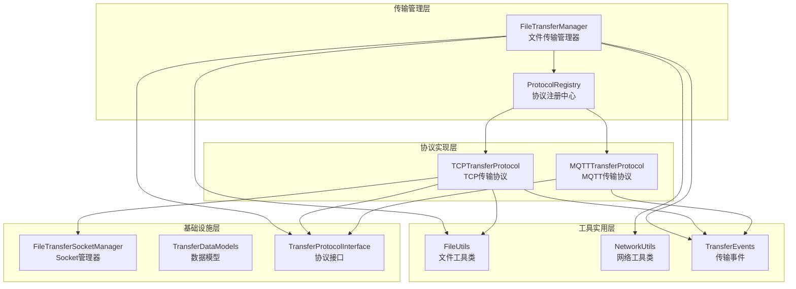
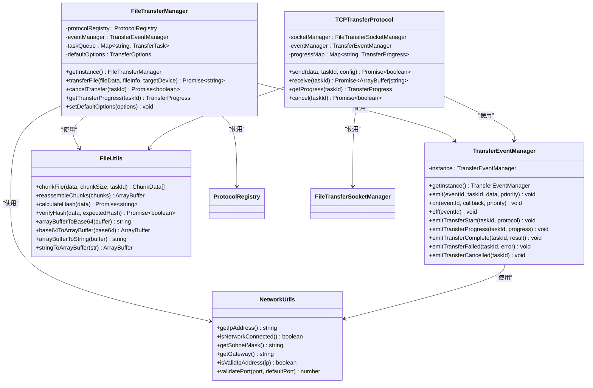
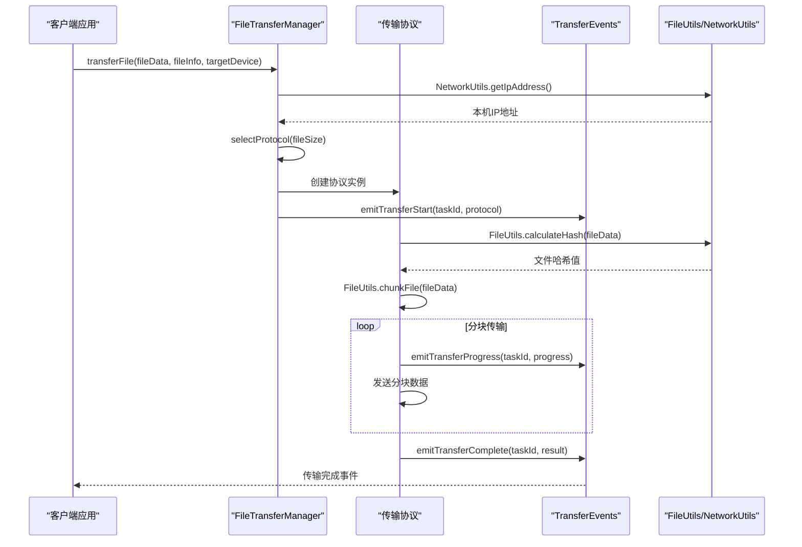
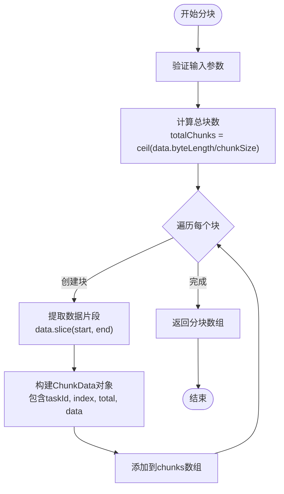
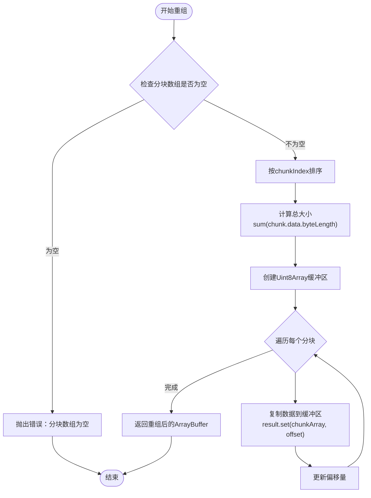
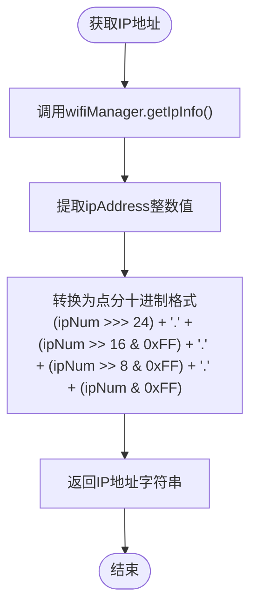
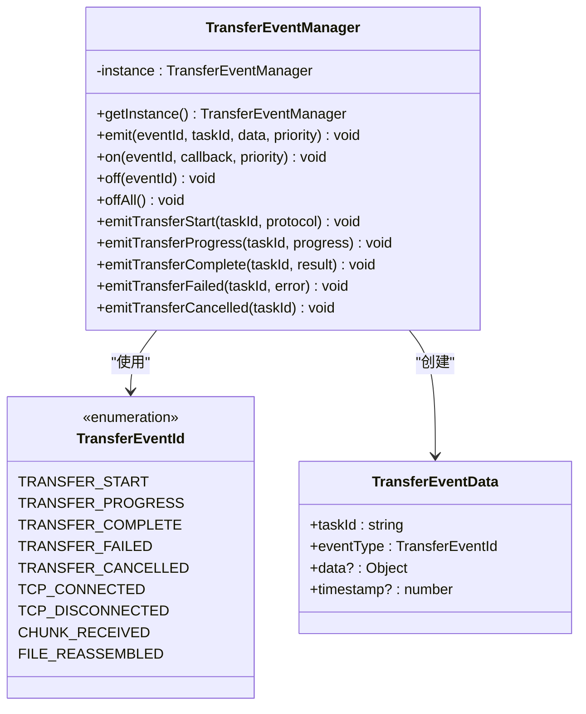
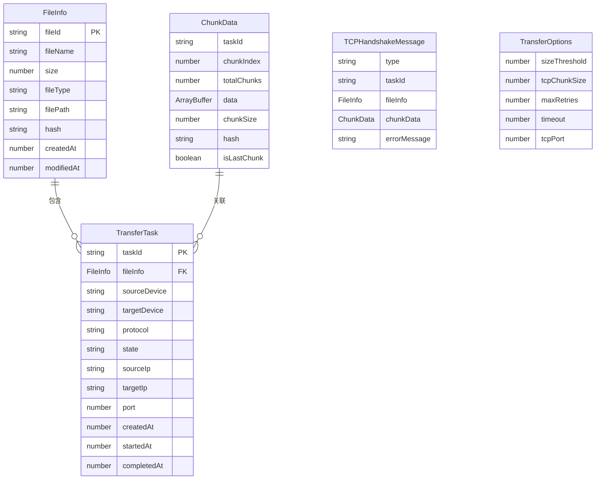
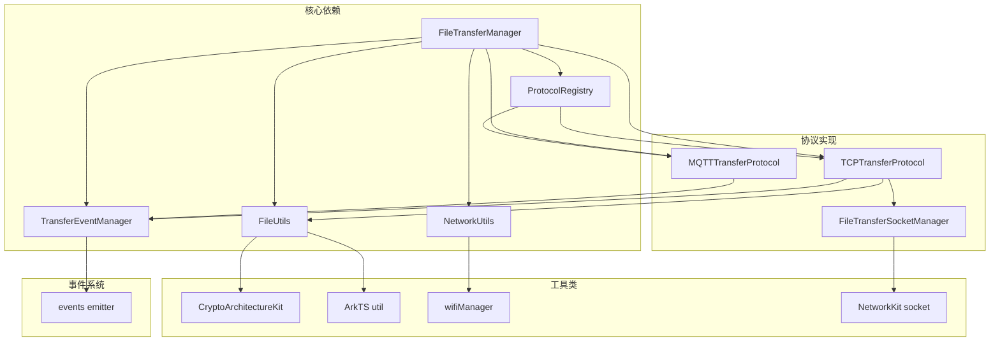

# 工具和实用程序

<cite>
**本文档引用的文件**
- [FileUtils.ets](file://entry/src/main/ets/manager/transfer/utils/FileUtils.ets)
- [NetworkUtils.ets](file://entry/src/main/ets/manager/transfer/utils/NetworkUtils.ets)
- [TransferEvents.ets](file://entry/src/main/ets/manager/transfer/event/TransferEvents.ets)
- [TransferDataModels.ets](file://entry/src/main/ets/manager/transfer/model/TransferDataModels.ets)
- [TransferProtocolInterface.ets](file://entry/src/main/ets/manager/transfer/protocol/TransferProtocolInterface.ets)
- [FileTransferManager.ets](file://entry/src/main/ets/manager/transfer/FileTransferManager.ets)
- [FileTransferSocketManager.ets](file://entry/src/main/ets/manager/transfer/socket/FileTransferSocketManager.ets)
- [TCPTransferProtocol.ets](file://entry/src/main/ets/manager/transfer/protocol/TCPTransferProtocol.ets)
- [ProtocolRegistry.ets](file://entry/src/main/ets/manager/transfer/protocol/ProtocolRegistry.ets)
- [TransferExamples.ets](file://entry/src/main/ets/manager/transfer/examples/TransferExamples.ets)
- [index.ets](file://entry/src/main/ets/manager/transfer/index.ets)
- [FileTransfer.test.ets](file://entry/src/test/transfer/FileTransfer.test.ets)
</cite>

## 目录
1. [简介](#简介)
2. [项目结构](#项目结构)
3. [核心组件](#核心组件)
4. [架构概览](#架构概览)
5. [详细组件分析](#详细组件分析)
6. [依赖分析](#依赖分析)
7. [性能考虑](#性能考虑)
8. [故障排除指南](#故障排除指南)
9. [结论](#结论)
10. [附录](#附录)

## 简介
本文档深入解析OpenHarmony文件传输系统中的工具和实用程序模块，重点关注三个核心组件：
- **FileUtils**：文件操作工具类，提供文件分块、重组、哈希计算等核心功能
- **NetworkUtils**：网络状态检测工具类，负责IP地址获取、网络连接状态检查等
- **TransferEvents**：事件处理机制，实现传输过程中的事件发布和订阅

这些组件构成了整个文件传输系统的基础设施，为上层协议实现和业务逻辑提供了可靠的基础能力。

## 项目结构
文件传输模块采用清晰的分层架构，按照功能职责进行模块划分：

**图表来源**
- [FileTransferManager.ets](file://entry/src/main/ets/manager/transfer/FileTransferManager.ets#L17-L54)
- [ProtocolRegistry.ets](file://entry/src/main/ets/manager/transfer/protocol/ProtocolRegistry.ets#L7-L23)
- [FileUtils.ets](file://entry/src/main/ets/manager/transfer/utils/FileUtils.ets#L8-L8)
- [NetworkUtils.ets](file://entry/src/main/ets/manager/transfer/utils/NetworkUtils.ets#L7-L7)
- [TransferEvents.ets](file://entry/src/main/ets/manager/transfer/event/TransferEvents.ets#L62-L75)

**章节来源**
- [index.ets](file://entry/src/main/ets/manager/transfer/index.ets#L1-L45)

## 核心组件

### FileUtils 文件工具类
FileUtils是文件传输系统的核心工具类，提供以下关键功能：

#### 主要功能特性
- **文件分块处理**：将大文件分割为可管理的小块
- **文件重组**：将分块数据重新组合为完整文件
- **哈希计算**：使用SHA-256算法计算文件完整性校验值
- **数据格式转换**：支持ArrayBuffer与Base64、字符串之间的相互转换

#### 核心方法概览
- `chunkFile(data, chunkSize, taskId)`：文件分块操作
- `reassembleChunks(chunks)`：文件重组操作  
- `calculateHash(data)`：哈希值计算
- `verifyHash(data, expectedHash)`：哈希值验证
- `arrayBufferToBase64(buffer)`：二进制数据编码
- `base64ToArrayBuffer(base64)`：Base64解码
- `arrayBufferToString(buffer)`：文本转换
- `stringToArrayBuffer(str)`：字符串编码

**章节来源**
- [FileUtils.ets](file://entry/src/main/ets/manager/transfer/utils/FileUtils.ets#L8-L193)

### NetworkUtils 网络工具类
NetworkUtils专门负责网络状态检测和网络信息获取：

#### 主要功能特性
- **IP地址获取**：从WiFi管理器获取设备IPv4地址
- **网络状态检测**：检查WiFi连接状态
- **网络参数获取**：获取子网掩码、网关地址
- **格式验证**：验证IP地址格式和端口号有效性

#### 核心方法概览
- `getIpAddress()`：获取设备IP地址
- `isNetworkConnected()`：检查网络连接状态
- `getSubnetMask()`：获取子网掩码
- `getGateway()`：获取网关地址
- `isValidIpAddress(ip)`：验证IP地址格式
- `validatePort(port, defaultPort)`：端口有效性验证

**章节来源**
- [NetworkUtils.ets](file://entry/src/main/ets/manager/transfer/utils/NetworkUtils.ets#L7-L131)

### TransferEvents 事件处理机制
TransferEvents实现了完整的事件发布-订阅模式，支持传输过程中的事件通知：

#### 事件系统架构
- **事件ID枚举**：定义了传输过程中的各种事件类型
- **事件数据结构**：标准化的事件数据格式
- **事件管理器**：提供事件的发送、监听和管理功能
- **监听器配置**：支持优先级设置和回调函数

#### 事件类型
- 传输开始/完成/失败/取消事件
- TCP连接建立/断开事件
- 文件分块接收事件
- 传输进度更新事件

**章节来源**
- [TransferEvents.ets](file://entry/src/main/ets/manager/transfer/event/TransferEvents.ets#L11-L30)
- [TransferEvents.ets](file://entry/src/main/ets/manager/transfer/event/TransferEvents.ets#L62-L206)

## 架构概览

### 整体架构设计

**图表来源**
- [FileTransferManager.ets](file://entry/src/main/ets/manager/transfer/FileTransferManager.ets#L17-L54)
- [TransferEvents.ets](file://entry/src/main/ets/manager/transfer/event/TransferEvents.ets#L62-L75)
- [FileUtils.ets](file://entry/src/main/ets/manager/transfer/utils/FileUtils.ets#L8-L8)
- [NetworkUtils.ets](file://entry/src/main/ets/manager/transfer/utils/NetworkUtils.ets#L7-L7)
- [TCPTransferProtocol.ets](file://entry/src/main/ets/manager/transfer/protocol/TCPTransferProtocol.ets#L23-L38)

### 数据流图

**图表来源**
- [FileTransferManager.ets](file://entry/src/main/ets/manager/transfer/FileTransferManager.ets#L105-L187)
- [TCPTransferProtocol.ets](file://entry/src/main/ets/manager/transfer/protocol/TCPTransferProtocol.ets#L123-L205)
- [TransferEvents.ets](file://entry/src/main/ets/manager/transfer/event/TransferEvents.ets#L161-L196)

**章节来源**
- [FileTransferManager.ets](file://entry/src/main/ets/manager/transfer/FileTransferManager.ets#L17-L375)
- [TCPTransferProtocol.ets](file://entry/src/main/ets/manager/transfer/protocol/TCPTransferProtocol.ets#L23-L351)

## 详细组件分析

### FileUtils 文件操作详解

#### 文件分块算法

**图表来源**
- [FileUtils.ets](file://entry/src/main/ets/manager/transfer/utils/FileUtils.ets#L16-L39)

#### 文件重组流程

**图表来源**
- [FileUtils.ets](file://entry/src/main/ets/manager/transfer/utils/FileUtils.ets#L46-L70)

#### 哈希计算实现

FileUtils使用OpenHarmony的CryptoArchitectureKit进行SHA-256哈希计算：

**章节来源**
- [FileUtils.ets](file://entry/src/main/ets/manager/transfer/utils/FileUtils.ets#L77-L115)

### NetworkUtils 网络状态检测

#### IP地址获取机制

NetworkUtils通过WiFi管理器获取网络信息，并将整数形式的IP地址转换为标准的点分十进制格式：

**图表来源**
- [NetworkUtils.ets](file://entry/src/main/ets/manager/transfer/utils/NetworkUtils.ets#L12-L29)

#### 网络状态检测

NetworkUtils提供多种网络状态检测方法：

**章节来源**
- [NetworkUtils.ets](file://entry/src/main/ets/manager/transfer/utils/NetworkUtils.ets#L35-L87)

### TransferEvents 事件处理机制

#### 事件管理器架构

TransferEvents采用单例模式实现事件管理，支持完整的事件生命周期管理：

**图表来源**
- [TransferEvents.ets](file://entry/src/main/ets/manager/transfer/event/TransferEvents.ets#L62-L206)

#### 事件监听器配置

事件系统支持灵活的监听器配置，包括事件ID、优先级和回调函数：

**章节来源**
- [TransferEvents.ets](file://entry/src/main/ets/manager/transfer/event/TransferEvents.ets#L49-L56)

### 数据模型定义

#### 核心数据结构

文件传输系统定义了完整的数据模型体系：

**图表来源**
- [TransferDataModels.ets](file://entry/src/main/ets/manager/transfer/model/TransferDataModels.ets#L10-L113)

**章节来源**
- [TransferDataModels.ets](file://entry/src/main/ets/manager/transfer/model/TransferDataModels.ets#L10-L113)

## 依赖分析

### 组件间依赖关系

**图表来源**
- [FileTransferManager.ets](file://entry/src/main/ets/manager/transfer/FileTransferManager.ets#L5-L11)
- [TCPTransferProtocol.ets](file://entry/src/main/ets/manager/transfer/protocol/TCPTransferProtocol.ets#L5-L9)

### 外部依赖分析

系统主要依赖以下OpenHarmony框架组件：

- **CryptoArchitectureKit**：提供加密算法支持（SHA-256哈希）
- **ArkTS util**：提供基础数据转换工具
- **wifiManager**：提供WiFi网络状态查询
- **NetworkKit socket**：提供TCP Socket通信能力
- **events emitter**：提供事件发布-订阅机制

**章节来源**
- [FileUtils.ets](file://entry/src/main/ets/manager/transfer/utils/FileUtils.ets#L6-L7)
- [NetworkUtils.ets](file://entry/src/main/ets/manager/transfer/utils/NetworkUtils.ets#L5-L5)
- [FileTransferSocketManager.ets](file://entry/src/main/ets/manager/transfer/socket/FileTransferSocketManager.ets#L5-L7)

## 性能考虑

### 文件分块优化策略

1. **分块大小选择**：默认128KB，可根据网络环境调整
2. **内存管理**：使用ArrayBuffer避免不必要的数据复制
3. **哈希计算**：采用异步计算避免阻塞主线程
4. **进度跟踪**：实时更新传输进度减少用户等待时间

### 网络连接优化

1. **连接复用**：TCP连接建立后可重复使用
2. **超时控制**：合理的超时设置避免资源浪费
3. **重试机制**：智能重试避免单点故障
4. **端口管理**：动态端口分配避免冲突

### 事件系统优化

1. **事件优先级**：高优先级事件优先处理
2. **内存泄漏防护**：及时清理已完成任务的事件监听
3. **异步处理**：事件处理不影响主业务流程
4. **批量处理**：多个事件合并处理提高效率

## 故障排除指南

### 常见问题及解决方案

#### 文件传输失败
**问题描述**：传输过程中出现错误导致失败
**可能原因**：
- 网络连接中断
- 目标设备不可达
- 文件哈希校验失败
- 内存不足

**解决方案**：
1. 检查网络连接状态
2. 验证目标设备IP地址
3. 确认文件完整性
4. 清理内存释放空间

#### 事件监听失效
**问题描述**：事件监听器无法接收到传输事件
**可能原因**：
- 事件ID不匹配
- 监听器未正确注册
- 事件优先级设置不当
- 内存泄漏导致监听器丢失

**解决方案**：
1. 确认事件ID常量定义
2. 检查监听器注册代码
3. 调整事件优先级设置
4. 及时清理不再使用的监听器

#### 网络状态检测异常
**问题描述**：NetworkUtils无法获取正确的网络信息
**可能原因**：
- WiFi权限未授权
- 设备无网络连接
- API调用时机不当
- 异常处理缺失

**解决方案**：
1. 检查WiFi权限配置
2. 验证网络连接状态
3. 确保在合适时机调用API
4. 添加完善的异常处理

**章节来源**
- [FileTransfer.test.ets](file://entry/src/test/transfer/FileTransfer.test.ets#L177-L203)

### 调试技巧

1. **日志分析**：利用console.info输出关键信息
2. **状态监控**：定期检查任务状态和进度
3. **内存监控**：关注ArrayBuffer的内存使用
4. **网络监控**：实时监控网络连接状态
5. **事件追踪**：确保事件的正确发送和接收

## 结论

OpenHarmony文件传输系统的工具和实用程序模块展现了良好的架构设计和实现质量：

### 技术优势
- **模块化设计**：清晰的功能分离便于维护和扩展
- **异步处理**：充分利用异步编程避免阻塞
- **事件驱动**：基于事件的松耦合设计
- **错误处理**：完善的异常处理机制
- **性能优化**：针对移动设备的性能考量

### 应用价值
- **易用性**：简洁的API设计降低使用门槛
- **可靠性**：多层错误处理确保系统稳定
- **可扩展性**：插件化的协议设计支持新协议接入
- **可维护性**：清晰的代码结构便于后续开发

### 发展建议
1. **功能增强**：可考虑添加更多传输协议支持
2. **性能优化**：进一步优化大数据传输性能
3. **安全加强**：增加传输加密和身份认证
4. **监控完善**：添加更详细的性能监控指标

## 附录

### API参考

#### FileUtils 方法摘要
- `chunkFile(data, chunkSize=128*1024, taskId)`：文件分块
- `reassembleChunks(chunks)`：文件重组
- `calculateHash(data)`：哈希计算（异步）
- `verifyHash(data, expectedHash)`：哈希验证（异步）

#### NetworkUtils 方法摘要
- `getIpAddress()`：获取IP地址
- `isNetworkConnected()`：检查网络状态
- `isValidIpAddress(ip)`：IP格式验证
- `validatePort(port, defaultPort)`：端口验证

#### TransferEvents 方法摘要
- `emit(eventId, taskId, data, priority)`：发送事件
- `on(eventId, callback, priority)`：注册监听器
- `off(eventId)`：移除监听器
- `emitTransferStart/Progress/Complete/Failed/Cancelled()`：专用事件发送

### 使用示例

完整的使用示例可在以下文件中找到：
- [TransferExamples.ets](file://entry/src/main/ets/manager/transfer/examples/TransferExamples.ets#L12-L201)

这些示例涵盖了从基本文件传输到复杂场景的完整使用流程，是学习和参考的最佳资料。