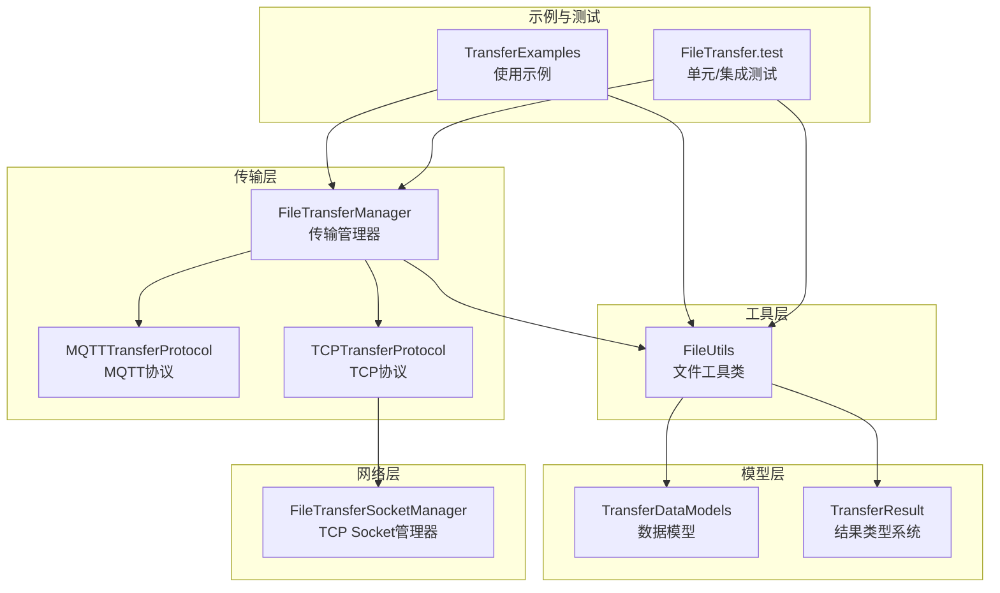
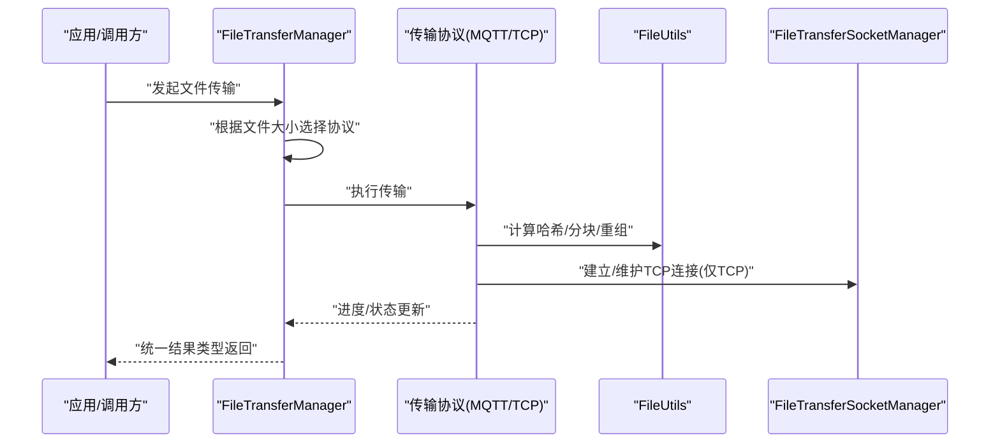
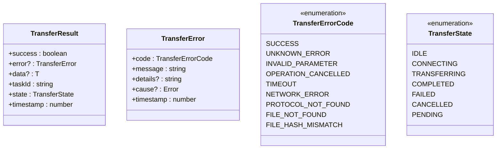
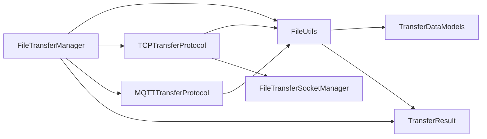
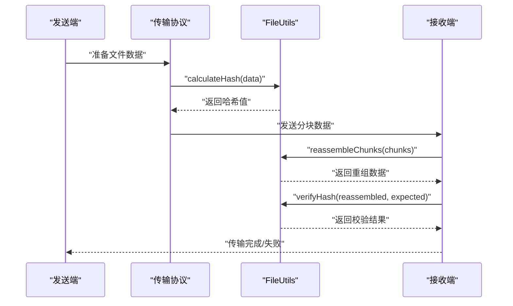

# 文件工具类

<cite>
**本文引用的文件**
- [FileUtils.ets](file://entry/src/main/ets/manager/transfer/utils/FileUtils.ets)
- [TransferResult.ets](file://entry/src/main/ets/manager/transfer/model/TransferResult.ets)
- [TransferProtocolInterface.ets](file://entry/src/main/ets/manager/transfer/protocol/TransferProtocolInterface.ets)
- [FileTransferManager.ets](file://entry/src/main/ets/manager/transfer/FileTransferManager.ets)
- [TCPTransferProtocol.ets](file://entry/src/main/ets/manager/transfer/protocol/TCPTransferProtocol.ets)
- [MQTTTransferProtocol.ets](file://entry/src/main/ets/manager/transfer/protocol/MQTTTransferProtocol.ets)
- [FileTransferSocketManager.ets](file://entry/src/main/ets/manager/transfer/socket/FileTransferSocketManager.ets)
- [TransferExamples.ets](file://entry/src/main/ets/manager/transfer/examples/TransferExamples.ets)
- [FileTransfer.test.ets](file://entry/src/test/transfer/FileTransfer.test.ets)
</cite>

## 更新摘要
**变更内容**
- 新增统一的结果类型系统，提供标准化的传输结果结构
- 改进的错误处理机制，包含详细的错误码和错误信息
- 增强的文件验证功能，支持更精确的哈希校验和错误报告
- 更新的API文档以反映新的结果类型系统

## 目录
1. [简介](#简介)
2. [项目结构](#项目结构)
3. [核心组件](#核心组件)
4. [架构概览](#架构概览)
5. [详细组件分析](#详细组件分析)
6. [结果类型系统](#结果类型系统)
7. [依赖关系分析](#依赖关系分析)
8. [性能考量](#性能考量)
9. [故障排查指南](#故障排查指南)
10. [结论](#结论)
11. [附录](#附录)

## 简介
本文档面向文件工具类，系统化梳理 FileUtils 类的静态方法，覆盖文件分块、重组、哈希计算与验证、Base64 编解码、文本与二进制互转等核心能力，并结合新的统一结果类型系统和改进的文件验证功能。文档同时提供与传输协议、Socket 管理器及示例代码的关联说明，帮助读者在实际工程中高效使用这些工具方法。

## 项目结构
围绕文件传输与工具方法的相关目录与文件如下：
- utils：FileUtils 工具类所在位置
- model：传输数据模型定义（文件信息、分块数据、传输任务等）
- protocol：传输协议实现（MQTT、TCP）
- socket：TCP Socket 管理器
- examples：传输示例与使用演示
- test：单元测试与集成测试

**图表来源**
- [FileUtils.ets:1-196](file://entry/src/main/ets/manager/transfer/utils/FileUtils.ets#L1-L196)
- [TransferResult.ets:1-275](file://entry/src/main/ets/manager/transfer/model/TransferResult.ets#L1-L275)
- [TransferDataModels.ets:1-113](file://entry/src/main/ets/manager/transfer/model/TransferDataModels.ets#L1-L113)

**章节来源**
- [FileUtils.ets:1-196](file://entry/src/main/ets/manager/transfer/utils/FileUtils.ets#L1-L196)
- [TransferResult.ets:1-275](file://entry/src/main/ets/manager/transfer/model/TransferResult.ets#L1-L275)

## 核心组件
- 文件工具类：提供文件分块、重组、哈希计算与验证、Base64 编解码、文本与二进制互转等静态方法。
- 结果类型系统：统一的传输结果结构，包含成功/失败状态、错误信息、任务ID、传输状态等。
- 数据模型：定义 FileInfo、ChunkData、TransferTask、TCPHandshakeMessage、TransferOptions 等核心数据结构。
- 传输管理器：负责协议选择、任务调度、进度跟踪与事件分发。
- 传输协议：MQTTTransferProtocol（小文件直传）、TCPTransferProtocol（大文件分块传输）。
- Socket 管理器：统一管理 TCP 连接生命周期与消息收发。
- 示例与测试：演示典型使用场景与验证工具方法正确性的测试用例。

**章节来源**
- [FileUtils.ets:1-196](file://entry/src/main/ets/manager/transfer/utils/FileUtils.ets#L1-L196)
- [TransferResult.ets:1-275](file://entry/src/main/ets/manager/transfer/model/TransferResult.ets#L1-L275)
- [FileTransferManager.ets:1-648](file://entry/src/main/ets/manager/transfer/FileTransferManager.ets#L1-L648)

## 架构概览
FileUtils 在传输链路中的角色与交互如下：

**图表来源**
- [FileTransferManager.ets:167-274](file://entry/src/main/ets/manager/transfer/FileTransferManager.ets#L167-L274)
- [TCPTransferProtocol.ets:222-422](file://entry/src/main/ets/manager/transfer/protocol/TCPTransferProtocol.ets#L222-L422)
- [MQTTTransferProtocol.ets:165-200](file://entry/src/main/ets/manager/transfer/protocol/MQTTTransferProtocol.ets#L165-L200)
- [FileUtils.ets:20-194](file://entry/src/main/ets/manager/transfer/utils/FileUtils.ets#L20-L194)
- [FileTransferSocketManager.ets:1-354](file://entry/src/main/ets/manager/transfer/socket/FileTransferSocketManager.ets#L1-L354)

## 详细组件分析

### FileUtils 类方法详解

#### 1) chunkFile 文件分块
- 功能：将 ArrayBuffer 按指定块大小切分为多个 ChunkData，末块标记 isLastChunk。
- 参数
  - data: ArrayBuffer（原始文件数据）
  - chunkSize: number（默认 128KB），单位字节
  - taskId: string（所属任务 ID）
- 返回：ChunkData[]（分块数组）
- 使用场景
  - TCP 协议大文件传输前的预处理
  - 便于网络分段传输与重传控制
- 错误处理
  - 无显式抛错；若 data 为空，将产生 0 个分块
- 性能与内存
  - 使用 slice 生成视图，避免拷贝大块数据
  - 建议 chunkSize 与网络 MTU、带宽匹配，避免过大导致内存压力

**章节来源**
- [FileUtils.ets:20-43](file://entry/src/main/ets/manager/transfer/utils/FileUtils.ets#L20-L43)

#### 2) reassembleChunks 文件重组
- 功能：将按 chunkIndex 排序的分块数组重组为完整 ArrayBuffer。
- 参数：chunks: ChunkData[]（需按 chunkIndex 升序排列）
- 返回：ArrayBuffer（重组后的完整数据）
- 使用场景
  - TCP 接收端收到所有分块后进行重组
- 错误处理
  - 若 chunks 为空，抛出错误
  - 内部对数组进行排序，确保顺序正确
- 性能与内存
  - 先计算总长度，一次性分配目标缓冲区，再顺序写入，减少多次扩容

**章节来源**
- [FileUtils.ets:50-74](file://entry/src/main/ets/manager/transfer/utils/FileUtils.ets#L50-L74)

#### 3) calculateHash 哈希计算（SHA-256）
- 功能：对 ArrayBuffer 计算 SHA-256 哈希，返回十六进制字符串。
- 参数：data: ArrayBuffer
- 返回：Promise<string>（十六进制哈希字符串）
- 使用场景
  - 传输前生成文件指纹，用于完整性校验
  - 与 verifyHash 配合进行端到端校验
- 错误处理
  - try/catch 包裹底层加密操作，捕获异常并抛出
- 性能与内存
  - 异步计算，避免阻塞主线程
  - 建议仅对必要数据计算哈希，避免重复计算

**章节来源**
- [FileUtils.ets:81-103](file://entry/src/main/ets/manager/transfer/utils/FileUtils.ets#L81-L103)

#### 4) verifyHash 哈希验证
- 功能：比较给定数据的实际哈希与期望哈希是否一致。
- 参数：data: ArrayBuffer，expectedHash: string
- 返回：Promise<boolean>（是否匹配）
- 使用场景
  - 接收端完成重组后进行完整性校验
- 错误处理
  - 内部调用 calculateHash，异常时返回 false 并记录日志

**章节来源**
- [FileUtils.ets:111-119](file://entry/src/main/ets/manager/transfer/utils/FileUtils.ets#L111-L119)

#### 5) arrayBufferToBase64 Base64 编码
- 功能：将 ArrayBuffer 编码为 Base64 字符串。
- 参数：buffer: ArrayBuffer
- 返回：string（Base64 字符串）
- 使用场景
  - MQTT 协议中将二进制数据编码为字符串传输
- 错误处理
  - 依赖底层编码器，异常时由调用方处理

**章节来源**
- [FileUtils.ets:126-132](file://entry/src/main/ets/manager/transfer/utils/FileUtils.ets#L126-L132)

#### 6) base64ToArrayBuffer Base64 解码
- 功能：将 Base64 字符串解码回 ArrayBuffer。
- 参数：base64: string
- 返回：ArrayBuffer
- 使用场景
  - 接收端将 MQTT 传输的 Base64 字符串还原为二进制
- 错误处理
  - 依赖底层解码器，异常时由调用方处理

**章节来源**
- [FileUtils.ets:139-145](file://entry/src/main/ets/manager/transfer/utils/FileUtils.ets#L139-L145)

#### 7) arrayBufferToString 文本解码
- 功能：将 ArrayBuffer 按 UTF-8 解码为字符串。
- 参数：buffer: ArrayBuffer
- 返回：string
- 使用场景
  - 文本文件或 JSON 数据的解码

**章节来源**
- [FileUtils.ets:152-155](file://entry/src/main/ets/manager/transfer/utils/FileUtils.ets#L152-L155)

#### 8) stringToArrayBuffer 文本编码
- 功能：将字符串按 UTF-8 编码为 ArrayBuffer。
- 参数：str: string
- 返回：ArrayBuffer
- 使用场景
  - 文本数据准备为二进制传输

**章节来源**
- [FileUtils.ets:162-165](file://entry/src/main/ets/manager/transfer/utils/FileUtils.ets#L162-L165)

#### 9) getFileInfo 文件信息获取（预留实现）
- 功能：从文件路径提取基础信息（文件名、ID、时间戳等）。
- 参数：filePath: string
- 返回：Promise<FileInfo>
- 使用场景
  - 传输前构建 FileInfo 对象
- 错误处理
  - 当前为占位实现，后续需接入具体文件系统 API

**章节来源**
- [FileUtils.ets:172-185](file://entry/src/main/ets/manager/transfer/utils/FileUtils.ets#L172-L185)

#### 10) generateFileId 文件唯一标识生成
- 功能：生成基于时间戳与随机数的文件 ID。
- 参数：无
- 返回：string
- 使用场景
  - 为文件与任务建立稳定标识
- 已废弃：推荐使用从 TransferDataModels 导入的 generateFileId 函数

**章节来源**
- [FileUtils.ets:192-194](file://entry/src/main/ets/manager/transfer/utils/FileUtils.ets#L192-L194)

## 结果类型系统

### 统一结果结构
新的结果类型系统提供了标准化的传输结果结构，确保所有传输操作都返回一致的格式：

**图表来源**
- [TransferResult.ets:86-99](file://entry/src/main/ets/manager/transfer/model/TransferResult.ets#L86-L99)
- [TransferResult.ets:69-80](file://entry/src/main/ets/manager/transfer/model/TransferResult.ets#L69-L80)
- [TransferResult.ets:13-64](file://entry/src/main/ets/manager/transfer/model/TransferResult.ets#L13-L64)

### 错误码体系
结果类型系统包含完整的错误码枚举，涵盖所有可能的传输错误类型：

- **成功状态**：SUCCESS
- **通用错误**：UNKNOWN_ERROR, INVALID_PARAMETER, OPERATION_CANCELLED, TIMEOUT, NETWORK_ERROR
- **协议错误**：PROTOCOL_NOT_FOUND, PROTOCOL_NOT_SUPPORTED, PROTOCOL_INITIALIZATION_FAILED
- **连接错误**：CONNECTION_FAILED, CONNECTION_LOST, CONNECTION_TIMEOUT, CONNECTION_REJECTED
- **传输错误**：TRANSFER_FAILED, TRANSFER_INTERRUPTED, SEND_FAILED, RECEIVE_FAILED
- **文件错误**：FILE_NOT_FOUND, FILE_TOO_LARGE, FILE_CORRUPTED, FILE_HASH_MISMATCH
- **分块传输错误**：CHUNK_SEND_FAILED, CHUNK_RECEIVE_FAILED, CHUNK_OUT_OF_ORDER, CHUNK_MISSING
- **服务器错误**：SERVER_START_FAILED, SERVER_NOT_RUNNING
- **MQTT 特定错误**：MQTT_NOT_CONNECTED, MQTT_PUBLISH_FAILED
- **TCP 特定错误**：TCP_HANDSHAKE_FAILED, TCP_SERVER_BUSY

**章节来源**
- [TransferResult.ets:13-64](file://entry/src/main/ets/manager/transfer/model/TransferResult.ets#L13-L64)

### 工具函数
结果类型系统提供了实用的工具函数来创建标准的结果对象：

- `createSuccessResult(taskId, data?)`：创建成功的传输结果
- `createErrorResult(taskId, code, message, details?, cause?)`：创建失败的传输结果
- `createTransferError(code, message, details?, cause?)`：创建传输错误对象
- `errorFromException(error, defaultCode?)`：从异常创建传输错误
- `getDefaultErrorMessage(code)`：获取错误码对应的默认消息

**章节来源**
- [TransferResult.ets:145-232](file://entry/src/main/ets/manager/transfer/model/TransferResult.ets#L145-L232)

## 依赖关系分析
- FileUtils 与数据模型
  - 依赖 ChunkData、FileInfo 等模型接口，确保分块与文件元数据结构一致。
- 与结果类型系统
  - 通过 TransferResult 接口统一返回所有传输操作的结果
  - 错误处理使用 TransferErrorCode 枚举提供标准化的错误码
- 与传输协议
  - TCP 协议在发送前调用 FileUtils 进行分块与哈希计算；接收后调用重组与哈希验证。
  - MQTT 协议在发送前调用 FileUtils 将二进制数据编码为 Base64。
- 与 Socket 管理器
  - TCP 协议通过 Socket 管理器进行连接与数据发送，FileUtils 专注于数据层面的处理。

**图表来源**
- [FileUtils.ets:1-196](file://entry/src/main/ets/manager/transfer/utils/FileUtils.ets#L1-L196)
- [TransferResult.ets:1-275](file://entry/src/main/ets/manager/transfer/model/TransferResult.ets#L1-L275)
- [TCPTransferProtocol.ets:1-852](file://entry/src/main/ets/manager/transfer/protocol/TCPTransferProtocol.ets#L1-L852)
- [MQTTTransferProtocol.ets:1-293](file://entry/src/main/ets/manager/transfer/protocol/MQTTTransferProtocol.ets#L1-L293)
- [FileTransferSocketManager.ets:1-354](file://entry/src/main/ets/manager/transfer/socket/FileTransferSocketManager.ets#L1-L354)
- [FileTransferManager.ets:1-648](file://entry/src/main/ets/manager/transfer/FileTransferManager.ets#L1-L648)

## 性能考量
- 分块策略
  - TCP 默认分块大小为 128KB，适合大多数网络环境；可根据带宽与延迟调整。
  - 分块数量与内存占用近似线性相关，建议优先保证分块大小适中，避免过多小块。
- 哈希计算
  - SHA-256 为 CPU 密集型操作，建议仅在必要时计算；对大文件可考虑增量校验或分块校验。
- Base64 编解码
  - 编码会增加约 33% 的体积，适合文本通道传输；二进制通道优先直接传输。
- 内存管理
  - 重组阶段一次性分配目标缓冲区，避免多次扩容；分块阶段使用 slice 生成视图，减少拷贝。
- 结果类型系统
  - 统一的结果结构减少了类型检查的复杂性，提高了代码的可维护性。
  - 错误码系统提供了快速的错误分类和处理机制。

## 故障排查指南
- 分块/重组异常
  - 确认分块数组按 chunkIndex 升序排列；重组前检查数组非空。
- 哈希计算失败
  - 捕获底层异常并记录错误信息；确认输入数据有效。
- Base64 编解码错误
  - 确保编码/解码使用的字符集一致（UTF-8）；检查输入字符串合法性。
- 传输中断
  - TCP 协议中检查连接状态与重试机制；MQTT 协议中确认主题与客户端状态。
- 结果类型系统问题
  - 检查 TransferResult 的 success 字段判断传输是否成功
  - 使用 TransferErrorCode 枚举进行错误分类和处理
  - 通过 errorFromException 工具函数获取详细的错误信息

**章节来源**
- [FileUtils.ets:50-74](file://entry/src/main/ets/manager/transfer/utils/FileUtils.ets#L50-L74)
- [FileUtils.ets:81-119](file://entry/src/main/ets/manager/transfer/utils/FileUtils.ets#L81-L119)
- [FileUtils.ets:126-165](file://entry/src/main/ets/manager/transfer/utils/FileUtils.ets#L126-L165)
- [TransferResult.ets:145-232](file://entry/src/main/ets/manager/transfer/model/TransferResult.ets#L145-L232)
- [TCPTransferProtocol.ets:427-494](file://entry/src/main/ets/manager/transfer/protocol/TCPTransferProtocol.ets#L427-L494)
- [MQTTTransferProtocol.ets:165-200](file://entry/src/main/ets/manager/transfer/protocol/MQTTTransferProtocol.ets#L165-L200)

## 结论
FileUtils 为文件传输提供了关键的数据处理能力：分块与重组保障大文件可靠传输，哈希计算与验证确保数据完整性，Base64 编解码与文本/二进制互转满足不同传输通道需求。新的统一结果类型系统提供了标准化的传输结果结构和完整的错误码体系，使得错误处理更加规范和易于维护。结合 FileTransferManager 的协议选择与事件机制，以及 TCP 协议与 Socket 管理器的网络支撑，形成了一套完整的文件传输工具链。建议在实际工程中遵循本文的分块策略、哈希校验与内存管理最佳实践，充分利用新的结果类型系统提供的标准化接口，以获得更稳健与高效的传输体验。

## 附录

### API 一览与使用场景
- chunkFile：大文件传输前分块
- reassembleChunks：接收端重组
- calculateHash/verifyHash：完整性校验
- arrayBufferToBase64/base64ToArrayBuffer：MQTT 传输前后的编解码
- arrayBufferToString/stringToArrayBuffer：文本数据处理
- getFileInfo/generateFileId：文件元数据与标识生成

**章节来源**
- [FileUtils.ets:20-194](file://entry/src/main/ets/manager/transfer/utils/FileUtils.ets#L20-L194)

### 结果类型系统使用示例
- 成功结果创建：`createSuccessResult(taskId, data)`
- 失败结果创建：`createErrorResult(taskId, code, message, details, cause)`
- 错误对象创建：`createTransferError(code, message, details, cause)`
- 异常转换：`errorFromException(error, defaultCode)`

**章节来源**
- [TransferResult.ets:145-232](file://entry/src/main/ets/manager/transfer/model/TransferResult.ets#L145-L232)

### 代码示例路径（不含代码内容）
- 基本文件传输示例：[TransferExamples.ets:12-35](file://entry/src/main/ets/manager/transfer/examples/TransferExamples.ets#L12-L35)
- 大文件传输示例：[TransferExamples.ets:40-60](file://entry/src/main/ets/manager/transfer/examples/TransferExamples.ets#L40-L60)
- 错误处理示例：[TransferExamples.ets:163-191](file://entry/src/main/ets/manager/transfer/examples/TransferExamples.ets#L163-L191)
- 完整传输流程示例：[TransferExamples.ets:196-232](file://entry/src/main/ets/manager/transfer/examples/TransferExamples.ets#L196-L232)

### 单元测试覆盖点
- 分块与重组：[FileTransfer.test.ets:40-61](file://entry/src/test/transfer/FileTransfer.test.ets#L40-L61)
- 哈希计算与验证：[FileTransfer.test.ets:62-82](file://entry/src/test/transfer/FileTransfer.test.ets#L62-L82)
- Base64 编解码一致性：[FileTransfer.test.ets:84-92](file://entry/src/test/transfer/FileTransfer.test.ets#L84-L92)

### 传输流程时序图（文件哈希校验）

**图表来源**
- [TCPTransferProtocol.ets:273-277](file://entry/src/main/ets/manager/transfer/protocol/TCPTransferProtocol.ets#L273-L277)
- [TCPTransferProtocol.ets:454-467](file://entry/src/main/ets/manager/transfer/protocol/TCPTransferProtocol.ets#L454-L467)
- [FileUtils.ets:81-119](file://entry/src/main/ets/manager/transfer/utils/FileUtils.ets#L81-L119)