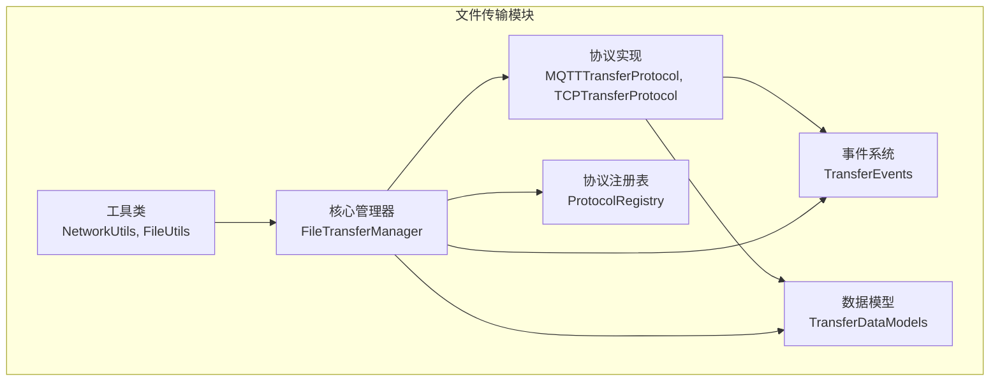
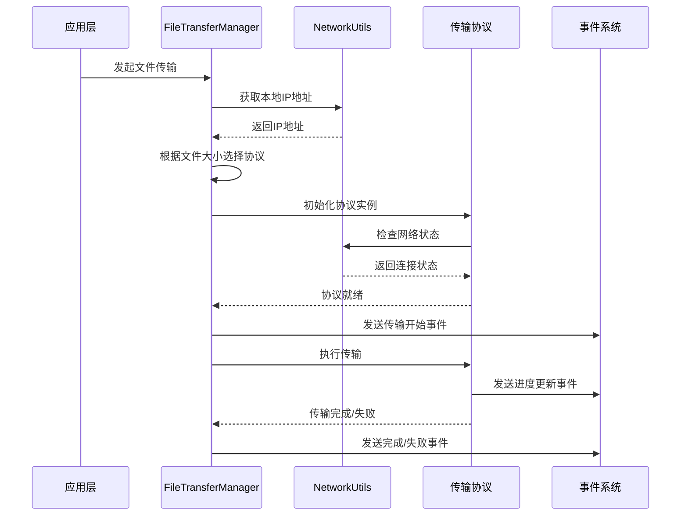
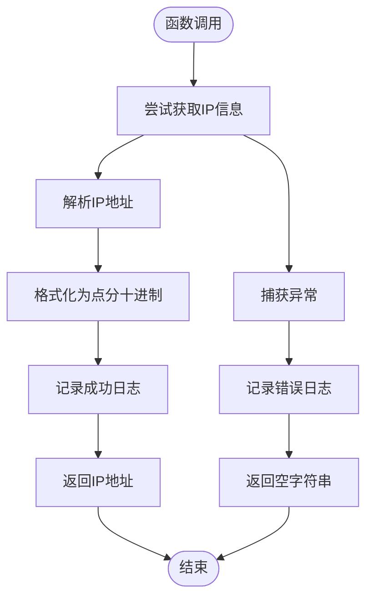
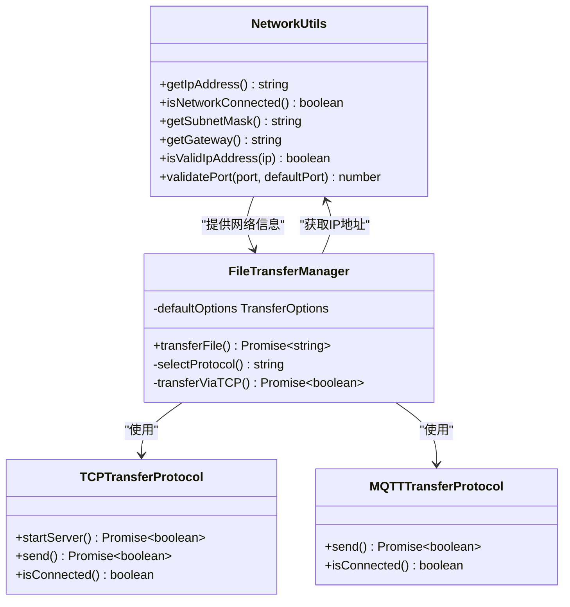
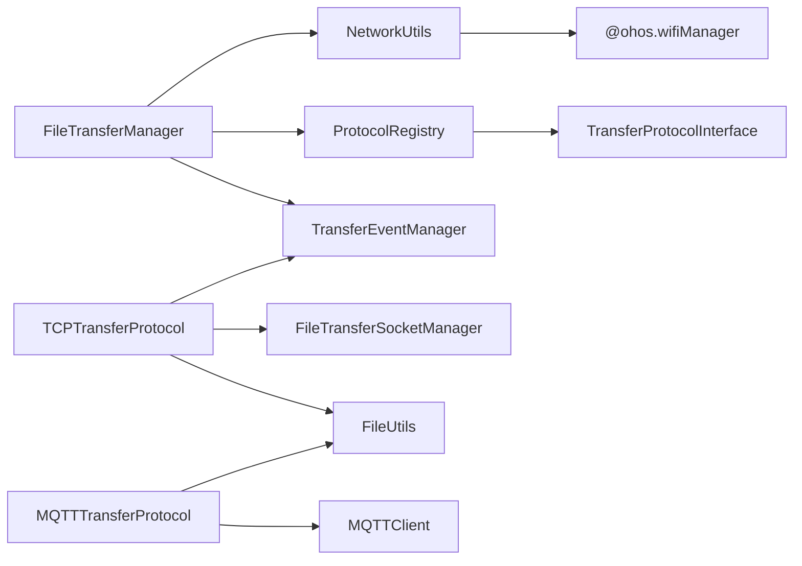
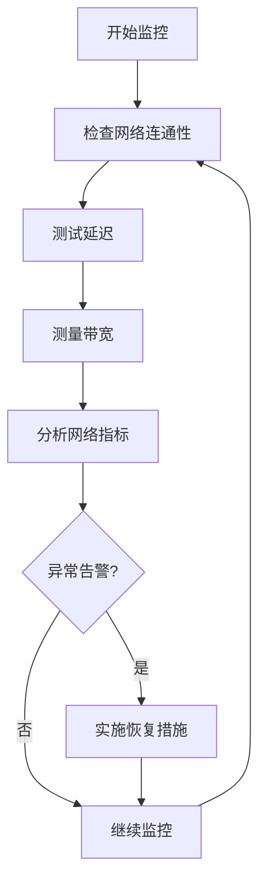

# 网络工具类

<cite>
**本文档引用的文件**
- [NetworkUtils.ets](file://entry/src/main/ets/manager/transfer/utils/NetworkUtils.ets)
- [FileTransferManager.ets](file://entry/src/main/ets/manager/transfer/FileTransferManager.ets)
- [TCPTransferProtocol.ets](file://entry/src/main/ets/manager/transfer/protocol/TCPTransferProtocol.ets)
- [MQTTTransferProtocol.ets](file://entry/src/main/ets/manager/transfer/protocol/MQTTTransferProtocol.ets)
- [TransferEvents.ets](file://entry/src/main/ets/manager/transfer/event/TransferEvents.ets)
- [FileUtils.ets](file://entry/src/main/ets/manager/transfer/utils/FileUtils.ets)
- [TransferDataModels.ets](file://entry/src/main/ets/manager/transfer/model/TransferDataModels.ets)
- [TransferProtocolInterface.ets](file://entry/src/main/ets/manager/transfer/protocol/TransferProtocolInterface.ets)
- [ProtocolRegistry.ets](file://entry/src/main/ets/manager/transfer/protocol/ProtocolRegistry.ets)
- [index.ets](file://entry/src/main/ets/manager/transfer/index.ets)
</cite>

## 目录
1. [简介](#简介)
2. [项目结构](#项目结构)
3. [核心组件](#核心组件)
4. [架构概览](#架构概览)
5. [详细组件分析](#详细组件分析)
6. [依赖关系分析](#依赖关系分析)
7. [性能考虑](#性能考虑)
8. [故障排除指南](#故障排除指南)
9. [结论](#结论)
10. [附录](#附录)

## 简介
本文件为网络工具类NetworkUtils的详细API文档，深入解释其在网络状态检测、连接测试、IP地址获取、网络类型判断等方面的功能。同时结合文件传输模块的整体架构，提供网络连接状态监控、带宽检测、延迟测量的实际代码示例，并解释不同网络环境下的适配策略和故障处理机制。

## 项目结构
网络工具类位于文件传输模块的工具类目录下，与协议实现、事件系统、数据模型等共同构成完整的文件传输体系。

**图表来源**
- [index.ets](file://entry/src/main/ets/manager/transfer/index.ets#L1-L45)

**章节来源**
- [index.ets](file://entry/src/main/ets/manager/transfer/index.ets#L1-L45)

## 核心组件
NetworkUtils类提供以下核心功能：
- 设备IP地址获取
- 网络连接状态检测
- 子网掩码获取
- 网关地址获取
- IP地址格式验证
- 端口号有效性验证

**章节来源**
- [NetworkUtils.ets](file://entry/src/main/ets/manager/transfer/utils/NetworkUtils.ets#L1-L131)

## 架构概览
NetworkUtils在网络传输架构中扮演关键角色，为文件传输管理器提供网络状态信息，支撑协议选择和连接建立决策。

**图表来源**
- [FileTransferManager.ets](file://entry/src/main/ets/manager/transfer/FileTransferManager.ets#L105-L187)
- [NetworkUtils.ets](file://entry/src/main/ets/manager/transfer/utils/NetworkUtils.ets#L12-L44)

## 详细组件分析

### NetworkUtils类详解

#### IP地址获取方法

**图表来源**
- [NetworkUtils.ets](file://entry/src/main/ets/manager/transfer/utils/NetworkUtils.ets#L12-L29)

**方法签名**: `static getIpAddress(): string`
- **实现原理**: 通过WiFi管理器获取IP信息，将整数形式的IP地址转换为标准的点分十进制格式
- **返回值**: 成功返回IPv4地址字符串，失败返回空字符串
- **使用场景**: 文件传输前获取本机IP地址，用于TCP协议的服务器监听和客户端连接
- **异常处理**: 捕获WiFi管理器调用异常，记录错误日志并返回空字符串

**章节来源**
- [NetworkUtils.ets](file://entry/src/main/ets/manager/transfer/utils/NetworkUtils.ets#L12-L29)

#### 网络连接状态检测
**方法签名**: `static isNetworkConnected(): boolean`
- **实现原理**: 调用WiFi管理器的WiFi激活状态检查方法
- **返回值**: `true`表示WiFi激活且网络连接正常，`false`表示网络连接异常
- **使用场景**: 传输前的网络健康检查，决定是否允许发起传输
- **异常处理**: 捕获异常并返回`false`，确保调用方能够正确处理网络异常

**章节来源**
- [NetworkUtils.ets](file://entry/src/main/ets/manager/transfer/utils/NetworkUtils.ets#L35-L44)

#### 子网掩码获取
**方法签名**: `static getSubnetMask(): string`
- **实现原理**: 从WiFi管理器获取IP信息中的netmask字段，转换为点分十进制格式
- **返回值**: 子网掩码地址字符串
- **使用场景**: 网络配置验证和路由计算
- **异常处理**: 异常时返回默认值"255.255.255.0"

**章节来源**
- [NetworkUtils.ets](file://entry/src/main/ets/manager/transfer/utils/NetworkUtils.ets#L51-L66)

#### 网关地址获取
**方法签名**: `static getGateway(): string`
- **实现原理**: 从WiFi管理器获取IP信息中的gateway字段，转换为点分十进制格式
- **返回值**: 网关地址字符串
- **使用场景**: 网络连通性测试和路由验证
- **异常处理**: 异常时返回空字符串

**章节来源**
- [NetworkUtils.ets](file://entry/src/main/ets/manager/transfer/utils/NetworkUtils.ets#L72-L87)

#### IP地址格式验证
**方法签名**: `static isValidIpAddress(ip: string): boolean`
- **实现原理**: 使用正则表达式验证IPv4格式，然后检查每个数字段范围(0-255)
- **返回值**: `true`表示有效IPv4地址，`false`表示无效
- **使用场景**: 用户输入验证、配置文件检查
- **复杂度**: O(n)，其中n为IP地址字符串长度

**章节来源**
- [NetworkUtils.ets](file://entry/src/main/ets/manager/transfer/utils/NetworkUtils.ets#L94-L110)

#### 端口号验证
**方法签名**: `static validatePort(port: number | undefined, defaultPort: number = 8888): number`
- **实现原理**: 检查端口号是否为undefined或NaN，验证范围(1-65535)，超出范围使用默认端口
- **返回值**: 有效的端口号
- **使用场景**: 传输配置验证，确保端口范围合法
- **异常处理**: 超出范围时记录警告并使用默认端口

**章节来源**
- [NetworkUtils.ets](file://entry/src/main/ets/manager/transfer/utils/NetworkUtils.ets#L118-L129)

### 与其他组件的交互关系

**图表来源**
- [NetworkUtils.ets](file://entry/src/main/ets/manager/transfer/utils/NetworkUtils.ets#L7-L131)
- [FileTransferManager.ets](file://entry/src/main/ets/manager/transfer/FileTransferManager.ets#L17-L375)
- [TCPTransferProtocol.ets](file://entry/src/main/ets/manager/transfer/protocol/TCPTransferProtocol.ets#L23-L351)
- [MQTTTransferProtocol.ets](file://entry/src/main/ets/manager/transfer/protocol/MQTTTransferProtocol.ets#L10-L185)

## 依赖关系分析

**图表来源**
- [NetworkUtils.ets](file://entry/src/main/ets/manager/transfer/utils/NetworkUtils.ets#L5)
- [FileTransferManager.ets](file://entry/src/main/ets/manager/transfer/FileTransferManager.ets#L5-L12)
- [TCPTransferProtocol.ets](file://entry/src/main/ets/manager/transfer/protocol/TCPTransferProtocol.ets#L5-L10)
- [MQTTTransferProtocol.ets](file://entry/src/main/ets/manager/transfer/protocol/MQTTTransferProtocol.ets#L5-L9)

**章节来源**
- [NetworkUtils.ets](file://entry/src/main/ets/manager/transfer/utils/NetworkUtils.ets#L1-L131)
- [FileTransferManager.ets](file://entry/src/main/ets/manager/transfer/FileTransferManager.ets#L1-L375)

## 性能考虑
- **IP地址获取**: WiFi管理器调用可能涉及系统服务访问，建议缓存结果避免频繁查询
- **异常处理**: 所有网络操作都包含try-catch块，确保不会因网络异常影响整体应用稳定性
- **默认值策略**: 对于获取失败的情况提供合理的默认值，保证业务流程的连续性
- **日志记录**: 关键操作包含详细日志，便于性能监控和问题诊断

## 故障排除指南

### 常见网络问题诊断

#### IP地址获取失败
- **症状**: `getIpAddress()`返回空字符串
- **可能原因**: WiFi未启用、权限不足、系统服务异常
- **解决方案**: 检查WiFi状态、确认应用权限、重启网络服务

#### 网络连接状态异常
- **症状**: `isNetworkConnected()`始终返回false
- **可能原因**: WiFi管理器不可用、系统API调用失败
- **解决方案**: 实施重试机制、提供降级策略

#### 端口冲突
- **症状**: TCP传输启动失败
- **可能原因**: 端口被占用、权限不足
- **解决方案**: 使用`validatePort()`获取有效端口、检查防火墙设置

### 网络监控最佳实践

**章节来源**
- [NetworkUtils.ets](file://entry/src/main/ets/manager/transfer/utils/NetworkUtils.ets#L12-L129)

## 结论
NetworkUtils类提供了简洁而强大的网络工具集，为文件传输系统奠定了可靠的网络基础。其设计遵循了错误优先的原则，通过完善的异常处理和默认值策略确保了系统的稳定性和用户体验。结合文件传输管理器的智能协议选择机制，能够在不同的网络环境下提供最优的传输体验。

## 附录

### API使用示例路径
- **基本IP获取**: [NetworkUtils.ets](file://entry/src/main/ets/manager/transfer/utils/NetworkUtils.ets#L12-L29)
- **网络状态检查**: [NetworkUtils.ets](file://entry/src/main/ets/manager/transfer/utils/NetworkUtils.ets#L35-L44)
- **端口验证**: [NetworkUtils.ets](file://entry/src/main/ets/manager/transfer/utils/NetworkUtils.ets#L118-L129)

### 相关数据模型
- **传输配置**: [TransferDataModels.ets](file://entry/src/main/ets/manager/transfer/model/TransferDataModels.ets#L101-L112)
- **传输进度**: [TransferProtocolInterface.ets](file://entry/src/main/ets/manager/transfer/protocol/TransferProtocolInterface.ets#L40-L57)

### 事件系统集成
- **事件定义**: [TransferEvents.ets](file://entry/src/main/ets/manager/transfer/event/TransferEvents.ets#L11-L30)
- **事件监听**: [TransferEvents.ets](file://entry/src/main/ets/manager/transfer/event/TransferEvents.ets#L115-L130)