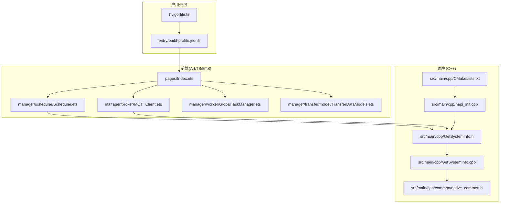
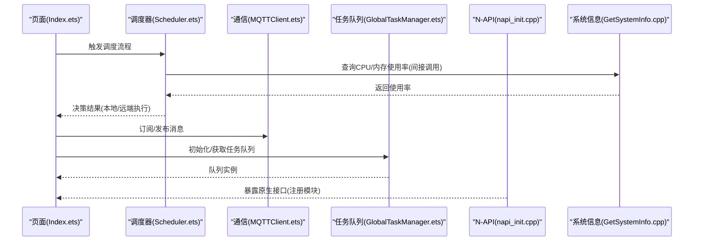
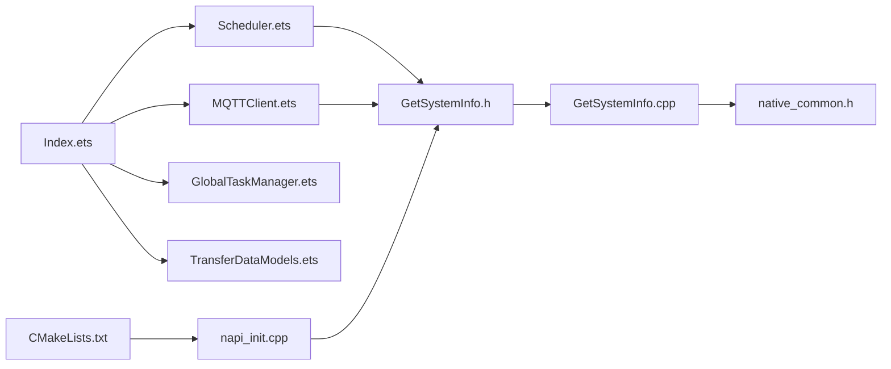

# 代码规范

<cite>
**本文引用的文件**
- [CMakeLists.txt](file://entry/src/main/cpp/CMakeLists.txt)
- [napi_init.cpp](file://entry/src/main/cpp/napi_init.cpp)
- [GetSystemInfo.h](file://entry/src/main/cpp/GetSystemInfo.h)
- [GetSystemInfo.cpp](file://entry/src/main/cpp/GetSystemInfo.cpp)
- [native_common.h](file://entry/src/main/cpp/common/native_common.h)
- [MQTTClient.ets](file://entry/src/main/ets/manager/broker/MQTTClient.ets)
- [Scheduler.ets](file://entry/src/main/ets/manager/scheduler/Scheduler.ets)
- [Index.ets](file://entry/src/main/ets/pages/Index.ets)
- [TransferDataModels.ets](file://entry/src/main/ets/manager/transfer/model/TransferDataModels.ets)
- [GlobalTaskManager.ets](file://entry/src/main/ets/manager/worker/GlobalTaskManager.ets)
- [build-profile.json5](file://entry/build-profile.json5)
- [hvigorfile.ts](file://hvigorfile.ts)
</cite>

## 目录
1. 引言
2. 项目结构
3. 核心组件
4. 架构总览
5. 详细组件分析
6. 依赖关系分析
7. 性能考虑
8. 故障排查指南
9. 结论
10. 附录

## 引言
本文件面向 ArkTS/ETS 与 C++ 混合开发场景，提供统一的代码规范与最佳实践，涵盖命名约定、缩进与注释标准、C++ 编码规范、JavaScript 与 C++ 交互标准、格式化工具配置、注释规范（JSDoc 与 C++ 注释）、代码审查检查清单与质量评估标准，并结合仓库现有实现给出可操作的示例与图示。

## 项目结构
本项目采用“应用壳层 + 模块化功能域”的组织方式：
- 应用壳层：entry 模块负责打包与构建配置，包含 ArkTS 前端与 C++ 原生模块。
- 前端（ArkTS/ETS）：按领域划分管理器（manager），如 broker（通信）、scheduler（调度）、transfer（传输）、worker（工作线程）等。
- 原生（C++）：通过 N-API 暴露能力，供 ArkTS 调用，包含头文件保护、函数与类命名、错误处理宏等规范。

图表来源
- [hvigorfile.ts](file://hvigorfile.ts#L1-L7)
- [build-profile.json5](file://entry/build-profile.json5#L1-L39)
- [Index.ets](file://entry/src/main/ets/pages/Index.ets#L1-L75)
- [Scheduler.ets](file://entry/src/main/ets/manager/scheduler/Scheduler.ets#L1-L105)
- [MQTTClient.ets](file://entry/src/main/ets/manager/broker/MQTTClient.ets#L1-L223)
- [GlobalTaskManager.ets](file://entry/src/main/ets/manager/worker/GlobalTaskManager.ets#L1-L27)
- [TransferDataModels.ets](file://entry/src/main/ets/manager/transfer/model/TransferDataModels.ets#L1-L113)
- [CMakeLists.txt](file://entry/src/main/cpp/CMakeLists.txt#L1-L13)
- [napi_init.cpp](file://entry/src/main/cpp/napi_init.cpp#L1-L31)
- [GetSystemInfo.h](file://entry/src/main/cpp/GetSystemInfo.h#L1-L24)
- [GetSystemInfo.cpp](file://entry/src/main/cpp/GetSystemInfo.cpp#L1-L181)
- [native_common.h](file://entry/src/main/cpp/common/native_common.h#L1-L99)

章节来源
- [hvigorfile.ts](file://hvigorfile.ts#L1-L7)
- [build-profile.json5](file://entry/build-profile.json5#L1-L39)

## 核心组件
- 前端页面与导航：Index 页面作为入口，承载标签页与基础状态管理。
- 调度器：负责设备信息收集、评分与任务分发。
- 通信客户端：基于 MQTT 的异步客户端，支持订阅、发布与事件派发。
- 工作线程与任务队列：全局任务队列初始化与获取。
- 数据模型：文件传输相关的核心数据结构。
- 原生模块：通过 N-API 暴露 CPU/内存使用率查询能力。

章节来源
- [Index.ets](file://entry/src/main/ets/pages/Index.ets#L1-L75)
- [Scheduler.ets](file://entry/src/main/ets/manager/scheduler/Scheduler.ets#L1-L105)
- [MQTTClient.ets](file://entry/src/main/ets/manager/broker/MQTTClient.ets#L1-L223)
- [GlobalTaskManager.ets](file://entry/src/main/ets/manager/worker/GlobalTaskManager.ets#L1-L27)
- [TransferDataModels.ets](file://entry/src/main/ets/manager/transfer/model/TransferDataModels.ets#L1-L113)
- [GetSystemInfo.h](file://entry/src/main/cpp/GetSystemInfo.h#L1-L24)
- [GetSystemInfo.cpp](file://entry/src/main/cpp/GetSystemInfo.cpp#L1-L181)

## 架构总览
前端通过页面与管理器协作完成业务编排，原生模块通过 N-API 向前端暴露系统资源查询能力。构建系统由 Hvigor 驱动，C++ 源码通过 CMake 组织并链接系统 N-API 库。

图表来源
- [Index.ets](file://entry/src/main/ets/pages/Index.ets#L1-L75)
- [Scheduler.ets](file://entry/src/main/ets/manager/scheduler/Scheduler.ets#L1-L105)
- [MQTTClient.ets](file://entry/src/main/ets/manager/broker/MQTTClient.ets#L1-L223)
- [GlobalTaskManager.ets](file://entry/src/main/ets/manager/worker/GlobalTaskManager.ets#L1-L27)
- [napi_init.cpp](file://entry/src/main/cpp/napi_init.cpp#L1-L31)
- [GetSystemInfo.cpp](file://entry/src/main/cpp/GetSystemInfo.cpp#L1-L181)

## 详细组件分析

### 命名约定与注释规范（ArkTS/ETS）
- 类与接口
  - 类名使用帕斯卡命名法（PascalCase），如 Scheduler、MQTTClient、FileInfo。
  - 接口名使用帕斯卡命名法，如 MQTTOptionsType、TransferTask。
- 方法与函数
  - 方法名使用驼峰命名法（camelCase），如 init、getInstance、workScheduler。
  - 导出接口使用帕斯卡命名法，如 export { Scheduler }。
- 变量与常量
  - 私有成员使用小写开头加下划线前缀（如私有静态实例字段），或直接小写开头（如 URL、clientId）。
  - 常量使用全大写下划线分隔（如 EVENTID、RESULT_EVENT_ID）。
- 注释
  - 类与公共方法建议使用 JSDoc 风格注释，说明职责、参数、返回值与异常。
  - 示例参考：[Scheduler.ets](file://entry/src/main/ets/manager/scheduler/Scheduler.ets#L9-L13)、[MQTTClient.ets](file://entry/src/main/ets/manager/broker/MQTTClient.ets#L184-L190)。

章节来源
- [Scheduler.ets](file://entry/src/main/ets/manager/scheduler/Scheduler.ets#L1-L105)
- [MQTTClient.ets](file://entry/src/main/ets/manager/broker/MQTTClient.ets#L1-L223)

### 缩进与格式（ArkTS/ETS）
- 缩进：统一使用 4 空格缩进。
- 大括号：控制块与函数体的大括号独占一行。
- 行宽：建议不超过 120 列，必要时换行。
- 导入顺序：标准库/框架 → 第三方 → 项目内相对导入，保持稳定顺序。
- 示例参考：页面结构与组件装饰器使用，如 [Index.ets](file://entry/src/main/ets/pages/Index.ets#L9-L11)。

章节来源
- [Index.ets](file://entry/src/main/ets/pages/Index.ets#L1-L75)

### 注释规范（JSDoc 与 C++ 注释）
- ArkTS/ETS（JSDoc）
  - 类与公共方法需提供简要描述、参数说明、返回值与可能抛出的异常。
  - 示例参考：[MQTTClient.ets](file://entry/src/main/ets/manager/broker/MQTTClient.ets#L184-L190)。
- C++（头文件与实现）
  - 头文件使用标准的头文件保护宏，避免重复包含。
  - 函数与类的注释应说明用途、输入输出、边界条件与错误处理策略。
  - 示例参考：[GetSystemInfo.h](file://entry/src/main/cpp/GetSystemInfo.h#L1-L24)、[GetSystemInfo.cpp](file://entry/src/main/cpp/GetSystemInfo.cpp#L1-L181)。

章节来源
- [GetSystemInfo.h](file://entry/src/main/cpp/GetSystemInfo.h#L1-L24)
- [GetSystemInfo.cpp](file://entry/src/main/cpp/GetSystemInfo.cpp#L1-L181)
- [MQTTClient.ets](file://entry/src/main/ets/manager/broker/MQTTClient.ets#L184-L190)

### C++ 编码规范
- 头文件保护
  - 使用形如 #ifndef HEADER_NAME_H #define HEADER_NAME_H ... #endif 的标准保护结构。
  - 示例参考：[GetSystemInfo.h](file://entry/src/main/cpp/GetSystemInfo.h#L2-L3)。
- 函数命名
  - 静态成员函数与普通函数采用清晰语义的驼峰命名，如 GetCpuUsage、calculateCpuUtilization。
  - 示例参考：[GetSystemInfo.h](file://entry/src/main/cpp/GetSystemInfo.h#L13-L14)。
- 变量定义与作用域
  - 局部变量尽量靠近首次使用处；避免在循环外声明循环变量。
  - 常量使用 constexpr 或 const；对路径、标签等使用 const char*。
  - 示例参考：[GetSystemInfo.cpp](file://entry/src/main/cpp/GetSystemInfo.cpp#L8)。
- 错误处理与日志
  - 使用统一的错误断言与返回宏，确保异常路径一致。
  - 示例参考：[native_common.h](file://entry/src/main/cpp/common/native_common.h#L21-L56)。
- N-API 模块注册
  - 使用 EXTERN_C 包裹导出函数，构造 napi_property_descriptor 数组，注册模块名与导出项。
  - 示例参考：[napi_init.cpp](file://entry/src/main/cpp/napi_init.cpp#L6-L15)、[napi_init.cpp](file://entry/src/main/cpp/napi_init.cpp#L17-L25)。

章节来源
- [GetSystemInfo.h](file://entry/src/main/cpp/GetSystemInfo.h#L1-L24)
- [GetSystemInfo.cpp](file://entry/src/main/cpp/GetSystemInfo.cpp#L1-L181)
- [native_common.h](file://entry/src/main/cpp/common/native_common.h#L1-L99)
- [napi_init.cpp](file://entry/src/main/cpp/napi_init.cpp#L1-L31)

### JavaScript 与 C++ 交互标准（N-API）
- 模块注册
  - 在 C++ 中构造 napi_module，设置 nm_register_func 指向初始化函数，导出函数名与属性描述符。
  - 示例参考：[napi_init.cpp](file://entry/src/main/cpp/napi_init.cpp#L17-L25)。
- 参数与返回值
  - 使用 napi_get_cb_info 获取上下文与参数；使用 napi_create_* 创建返回值。
  - 示例参考：[GetSystemInfo.cpp](file://entry/src/main/cpp/GetSystemInfo.cpp#L10-L29)。
- 生命周期与资源释放
  - 对打开的文件流、网络句柄等及时关闭与释放；错误路径统一返回 nullptr 或抛出异常。
  - 示例参考：[GetSystemInfo.cpp](file://entry/src/main/cpp/GetSystemInfo.cpp#L54-L69)、[GetSystemInfo.cpp](file://entry/src/main/cpp/GetSystemInfo.cpp#L134-L140)。

章节来源
- [napi_init.cpp](file://entry/src/main/cpp/napi_init.cpp#L1-L31)
- [GetSystemInfo.cpp](file://entry/src/main/cpp/GetSystemInfo.cpp#L1-L181)

### 代码格式化工具配置与使用
- ArkTS/ETS
  - 使用构建配置中的 ArkTS 编译选项进行一致性编译，避免手动格式化差异。
  - 参考：[build-profile.json5](file://entry/build-profile.json5#L4-L6)。
- C++
  - 使用 CMake 组织源码与包含目录，遵循头文件保护与函数命名规范。
  - 参考：[CMakeLists.txt](file://entry/src/main/cpp/CMakeLists.txt#L1-L13)。
- 构建与打包
  - Hvigor 作为系统任务插件，无需自定义插件即可完成构建。
  - 参考：[hvigorfile.ts](file://hvigorfile.ts#L1-L7)。

章节来源
- [build-profile.json5](file://entry/build-profile.json5#L1-L39)
- [CMakeLists.txt](file://entry/src/main/cpp/CMakeLists.txt#L1-L13)
- [hvigorfile.ts](file://hvigorfile.ts#L1-L7)

### 注释规范（C++）
- 头文件注释
  - 使用标准版权与许可声明，置于文件顶部。
  - 示例参考：[native_common.h](file://entry/src/main/cpp/common/native_common.h#L1-L14)。
- 类与方法注释
  - 类声明与公共方法需提供简要说明与用途描述。
  - 示例参考：[GetSystemInfo.h](file://entry/src/main/cpp/GetSystemInfo.h#L11-L22)。
- 宏与常量
  - 对复杂宏提供简要说明，便于维护。
  - 示例参考：[native_common.h](file://entry/src/main/cpp/common/native_common.h#L21-L56)。

章节来源
- [native_common.h](file://entry/src/main/cpp/common/native_common.h#L1-L99)
- [GetSystemInfo.h](file://entry/src/main/cpp/GetSystemInfo.h#L1-L24)

### 代码审查检查清单与质量评估标准
- 命名一致性
  - 类/接口：帕斯卡命名法；方法：驼峰命名法；常量：全大写。
- 注释完整性
  - 公共类与方法具备 JSDoc 注释；C++ 头文件具备版权与许可声明。
- 错误处理
  - N-API 调用使用统一断言与错误抛出宏；文件读取失败路径明确。
- 可读性
  - 缩进统一、行宽合理、导入顺序稳定。
- 交互规范
  - N-API 模块注册与导出项一致；参数与返回值类型清晰。
- 示例参考
  - [MQTTClient.ets](file://entry/src/main/ets/manager/broker/MQTTClient.ets#L1-L223)
  - [GetSystemInfo.cpp](file://entry/src/main/cpp/GetSystemInfo.cpp#L1-L181)
  - [native_common.h](file://entry/src/main/cpp/common/native_common.h#L1-L99)

章节来源
- [MQTTClient.ets](file://entry/src/main/ets/manager/broker/MQTTClient.ets#L1-L223)
- [GetSystemInfo.cpp](file://entry/src/main/cpp/GetSystemInfo.cpp#L1-L181)
- [native_common.h](file://entry/src/main/cpp/common/native_common.h#L1-L99)

### 具体代码示例（路径指引）
- ArkTS/ETS
  - 页面与组件装饰器与状态管理：[Index.ets](file://entry/src/main/ets/pages/Index.ets#L9-L28)
  - 调度器类与方法注释：[Scheduler.ets](file://entry/src/main/ets/manager/scheduler/Scheduler.ets#L9-L70)
  - 通信客户端类与 JSDoc 注释：[MQTTClient.ets](file://entry/src/main/ets/manager/broker/MQTTClient.ets#L184-L203)
  - 数据模型接口与字段注释：[TransferDataModels.ets](file://entry/src/main/ets/manager/transfer/model/TransferDataModels.ets#L1-L113)
  - 全局任务队列初始化与获取：[GlobalTaskManager.ets](file://entry/src/main/ets/manager/worker/GlobalTaskManager.ets#L8-L21)
- C++
  - 头文件保护与类声明：[GetSystemInfo.h](file://entry/src/main/cpp/GetSystemInfo.h#L2-L22)
  - N-API 模块注册与导出：[napi_init.cpp](file://entry/src/main/cpp/napi_init.cpp#L17-L30)
  - 错误断言与返回宏：[native_common.h](file://entry/src/main/cpp/common/native_common.h#L21-L56)
  - 系统资源查询实现：[GetSystemInfo.cpp](file://entry/src/main/cpp/GetSystemInfo.cpp#L10-L115)

章节来源
- [Index.ets](file://entry/src/main/ets/pages/Index.ets#L1-L75)
- [Scheduler.ets](file://entry/src/main/ets/manager/scheduler/Scheduler.ets#L1-L105)
- [MQTTClient.ets](file://entry/src/main/ets/manager/broker/MQTTClient.ets#L1-L223)
- [TransferDataModels.ets](file://entry/src/main/ets/manager/transfer/model/TransferDataModels.ets#L1-L113)
- [GlobalTaskManager.ets](file://entry/src/main/ets/manager/worker/GlobalTaskManager.ets#L1-L27)
- [GetSystemInfo.h](file://entry/src/main/cpp/GetSystemInfo.h#L1-L24)
- [napi_init.cpp](file://entry/src/main/cpp/napi_init.cpp#L1-L31)
- [native_common.h](file://entry/src/main/cpp/common/native_common.h#L1-L99)
- [GetSystemInfo.cpp](file://entry/src/main/cpp/GetSystemInfo.cpp#L1-L181)

## 依赖关系分析
- 前端模块间依赖
  - 页面依赖管理器模块；管理器内部再依赖具体子模块（broker、scheduler、transfer、worker）。
- 原生模块依赖
  - CMake 组织源码并链接系统 N-API 库；N-API 初始化模块注册导出函数。
- 构建系统
  - Hvigor 提供系统任务，entry/build-profile.json5 配置 ArkTS 与外部原生构建参数。

图表来源
- [Index.ets](file://entry/src/main/ets/pages/Index.ets#L1-L75)
- [Scheduler.ets](file://entry/src/main/ets/manager/scheduler/Scheduler.ets#L1-L105)
- [MQTTClient.ets](file://entry/src/main/ets/manager/broker/MQTTClient.ets#L1-L223)
- [GlobalTaskManager.ets](file://entry/src/main/ets/manager/worker/GlobalTaskManager.ets#L1-L27)
- [TransferDataModels.ets](file://entry/src/main/ets/manager/transfer/model/TransferDataModels.ets#L1-L113)
- [GetSystemInfo.h](file://entry/src/main/cpp/GetSystemInfo.h#L1-L24)
- [GetSystemInfo.cpp](file://entry/src/main/cpp/GetSystemInfo.cpp#L1-L181)
- [native_common.h](file://entry/src/main/cpp/common/native_common.h#L1-L99)
- [CMakeLists.txt](file://entry/src/main/cpp/CMakeLists.txt#L1-L13)
- [napi_init.cpp](file://entry/src/main/cpp/napi_init.cpp#L1-L31)

章节来源
- [build-profile.json5](file://entry/build-profile.json5#L1-L39)
- [hvigorfile.ts](file://hvigorfile.ts#L1-L7)

## 性能考虑
- 前端
  - 避免在渲染路径中执行阻塞逻辑；将耗时任务放入 worker 或后台线程。
  - 合理使用事件派发与状态管理，减少不必要的重绘。
- 原生
  - 文件读取与解析应尽早失败并返回；避免重复打开文件。
  - 计算密集型任务（如 CPU/内存利用率计算）应使用短间隔采样与限幅，防止过度占用。
- 示例参考：[GetSystemInfo.cpp](file://entry/src/main/cpp/GetSystemInfo.cpp#L72-L115)、[GetSystemInfo.cpp](file://entry/src/main/cpp/GetSystemInfo.cpp#L162-L179)。

章节来源
- [GetSystemInfo.cpp](file://entry/src/main/cpp/GetSystemInfo.cpp#L1-L181)

## 故障排查指南
- N-API 调用失败
  - 使用统一错误断言宏捕获并抛出错误信息，定位失败原因。
  - 参考：[native_common.h](file://entry/src/main/cpp/common/native_common.h#L21-L56)。
- 文件读取失败
  - 检查文件路径与权限；在失败时记录日志并返回默认值或空值。
  - 参考：[GetSystemInfo.cpp](file://entry/src/main/cpp/GetSystemInfo.cpp#L54-L69)、[GetSystemInfo.cpp](file://entry/src/main/cpp/GetSystemInfo.cpp#L134-L140)。
- 模块未注册或导出项缺失
  - 确认 napi_module 的 nm_register_func 与导出函数名一致；检查 CMake 链接的库。
  - 参考：[napi_init.cpp](file://entry/src/main/cpp/napi_init.cpp#L17-L30)、[CMakeLists.txt](file://entry/src/main/cpp/CMakeLists.txt#L12-L13)。

章节来源
- [native_common.h](file://entry/src/main/cpp/common/native_common.h#L1-L99)
- [GetSystemInfo.cpp](file://entry/src/main/cpp/GetSystemInfo.cpp#L1-L181)
- [napi_init.cpp](file://entry/src/main/cpp/napi_init.cpp#L1-L31)
- [CMakeLists.txt](file://entry/src/main/cpp/CMakeLists.txt#L1-L13)

## 结论
本规范以仓库现有实现为基础，明确了 ArkTS/ETS 与 C++ 混合开发的命名、注释、缩进与交互标准，并提供了格式化工具配置与质量评估要点。建议在后续迭代中持续完善注释覆盖率与错误处理一致性，确保跨语言模块的可维护性与稳定性。

## 附录
- 术语
  - N-API：OpenHarmony 提供的跨语言调用接口。
  - JSDoc：用于生成文档的注释语法。
- 参考文件
  - [build-profile.json5](file://entry/build-profile.json5#L1-L39)
  - [hvigorfile.ts](file://hvigorfile.ts#L1-L7)