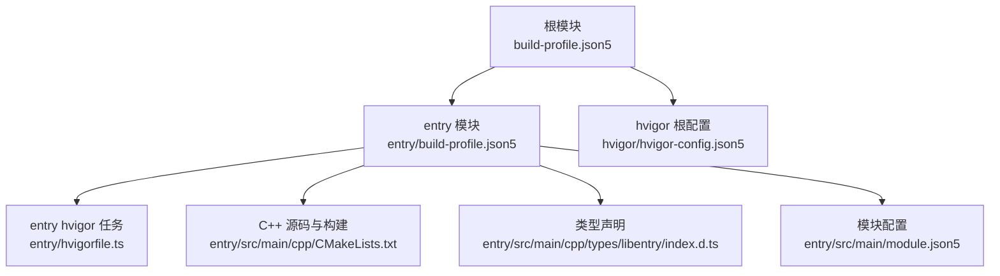
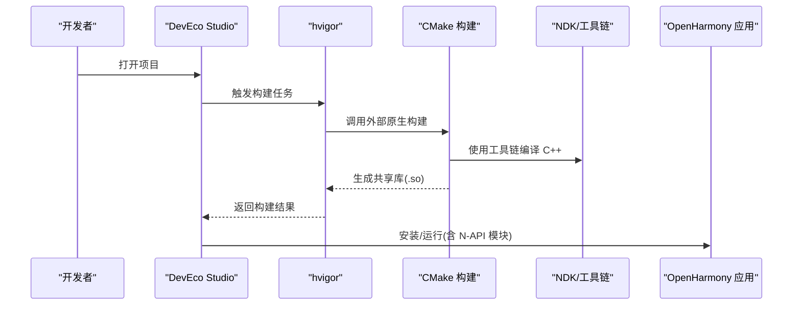
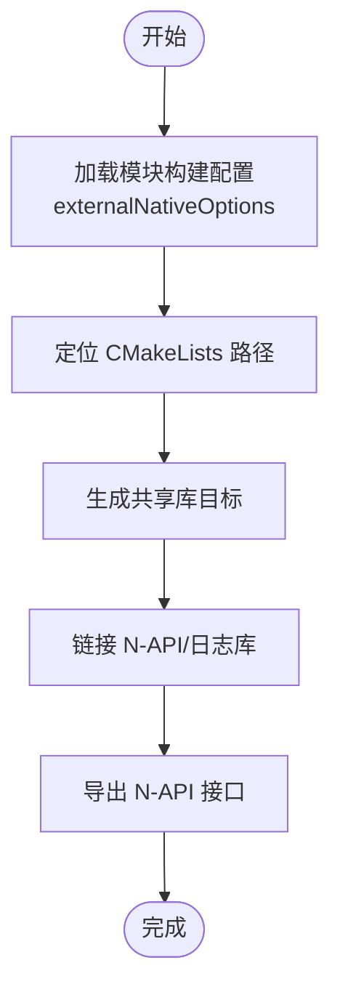
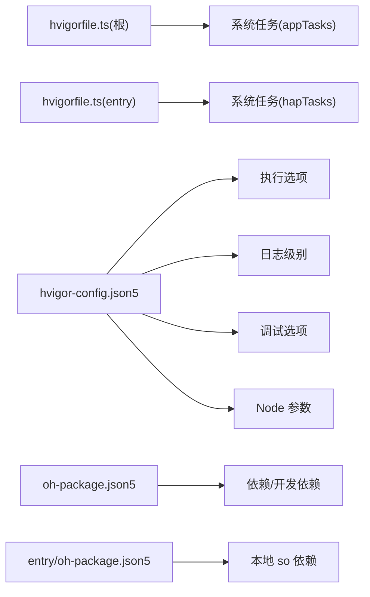
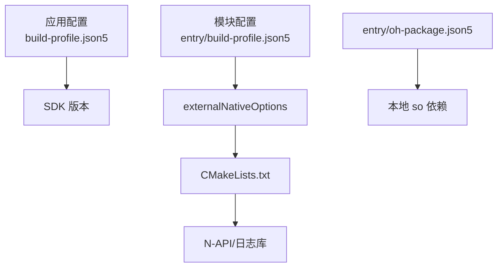

# 开发环境搭建

<cite>
**本文档引用的文件**
- [build-profile.json5](file://build-profile.json5)
- [hvigorfile.ts](file://hvigorfile.ts)
- [hvigor-config.json5](file://hvigor/hvigor-config.json5)
- [entry/build-profile.json5](file://entry/build-profile.json5)
- [entry/hvigorfile.ts](file://entry/hvigorfile.ts)
- [entry/src/main/cpp/CMakeLists.txt](file://entry/src/main/cpp/CMakeLists.txt)
- [entry/src/main/cpp/napi_init.cpp](file://entry/src/main/cpp/napi_init.cpp)
- [entry/src/main/cpp/GetSystemInfo.h](file://entry/src/main/cpp/GetSystemInfo.h)
- [entry/src/main/cpp/GetSystemInfo.cpp](file://entry/src/main/cpp/GetSystemInfo.cpp)
- [entry/src/main/cpp/common/native_common.h](file://entry/src/main/cpp/common/native_common.h)
- [oh-package.json5](file://oh-package.json5)
- [entry/oh-package.json5](file://entry/oh-package.json5)
- [entry/src/main/module.json5](file://entry/src/main/module.json5)
- [entry/src/main/cpp/types/libentry/index.d.ts](file://entry/src/main/cpp/types/libentry/index.d.ts)
</cite>

## 目录
1. [简介](#简介)
2. [项目结构](#项目结构)
3. [核心组件](#核心组件)
4. [架构总览](#架构总览)
5. [详细组件分析](#详细组件分析)
6. [依赖分析](#依赖分析)
7. [性能考虑](#性能考虑)
8. [故障排除指南](#故障排除指南)
9. [结论](#结论)
10. [附录](#附录)

## 简介
本指南面向 OpenHarmony 应用开发者，围绕本仓库的混合开发（ArkTS + C++ N-API）与构建系统（hvigor + CMake）进行环境搭建与配置说明。内容涵盖：
- OpenHarmony 开发环境安装与配置（DevEco Studio、SDK、模拟器）
- C++ 混合开发环境（CMake 工具链、NDK 集成、编译器配置）
- N-API 接口开发环境（头文件路径、链接库配置）
- 构建工具 hvigor 的配置与依赖管理
- 常见问题排查（编译错误、链接失败等）
- 开发工具使用技巧与调试配置

## 项目结构
该仓库采用多模块结构，根模块负责应用级签名与产品配置，entry 模块为入口模块，包含 ArkTS 页面与 C++ N-API 混合代码。

图表来源
- [build-profile.json5](file://build-profile.json5#L1-L51)
- [entry/build-profile.json5](file://entry/build-profile.json5#L1-L39)
- [hvigor/hvigor-config.json5](file://hvigor/hvigor-config.json5#L1-L21)
- [entry/hvigorfile.ts](file://entry/hvigorfile.ts#L1-L7)
- [entry/src/main/cpp/CMakeLists.txt](file://entry/src/main/cpp/CMakeLists.txt#L1-L13)
- [entry/src/main/cpp/types/libentry/index.d.ts](file://entry/src/main/cpp/types/libentry/index.d.ts#L1-L6)
- [entry/src/main/module.json5](file://entry/src/main/module.json5#L1-L86)

章节来源
- [build-profile.json5](file://build-profile.json5#L1-L51)
- [entry/build-profile.json5](file://entry/build-profile.json5#L1-L39)
- [hvigor/hvigor-config.json5](file://hvigor/hvigor-config.json5#L1-L21)
- [entry/hvigorfile.ts](file://entry/hvigorfile.ts#L1-L7)

## 核心组件
- 应用级构建配置：定义签名、产品版本、目标 ABI 等。
- 模块级构建配置：启用外部原生构建（CMake），指定 CMakeLists 路径与 ABI 过滤。
- hvigor 任务：根与模块分别配置系统任务与插件扩展点。
- C++ N-API 模块：通过 CMake 构建共享库，导出 CPU/Mem 使用率接口。
- 类型声明：为 N-API 导出函数提供 TypeScript 类型定义。
- 模块清单：声明能力权限与页面配置。

章节来源
- [build-profile.json5](file://build-profile.json5#L18-L36)
- [entry/build-profile.json5](file://entry/build-profile.json5#L7-L14)
- [hvigorfile.ts](file://hvigorfile.ts#L1-L7)
- [entry/hvigorfile.ts](file://entry/hvigorfile.ts#L1-L7)
- [entry/src/main/cpp/CMakeLists.txt](file://entry/src/main/cpp/CMakeLists.txt#L1-L13)
- [entry/src/main/cpp/types/libentry/index.d.ts](file://entry/src/main/cpp/types/libentry/index.d.ts#L1-L6)
- [entry/src/main/module.json5](file://entry/src/main/module.json5#L1-L86)

## 架构总览
OpenHarmony 混合开发流程概览如下：

图表来源
- [hvigorfile.ts](file://hvigorfile.ts#L1-L7)
- [entry/hvigorfile.ts](file://entry/hvigorfile.ts#L1-L7)
- [entry/build-profile.json5](file://entry/build-profile.json5#L7-L14)
- [entry/src/main/cpp/CMakeLists.txt](file://entry/src/main/cpp/CMakeLists.txt#L1-L13)

## 详细组件分析

### CMake 与 N-API 模块配置
- 外部原生构建：通过模块级 build-profile 启用 externalNativeOptions，指向 CMakeLists 路径与 ABI 过滤。
- CMakeLists：设置最小版本、包含目录、构建共享库、链接 OpenHarmony 提供的 N-API/日志库。
- N-API 初始化：导出 getCpuUsage/getMemUsage，注册模块名与导出表。
- 类型声明：为 ArkTS 层提供调用接口的类型定义。

图表来源
- [entry/build-profile.json5](file://entry/build-profile.json5#L7-L14)
- [entry/src/main/cpp/CMakeLists.txt](file://entry/src/main/cpp/CMakeLists.txt#L1-L13)
- [entry/src/main/cpp/napi_init.cpp](file://entry/src/main/cpp/napi_init.cpp#L1-L31)
- [entry/src/main/cpp/types/libentry/index.d.ts](file://entry/src/main/cpp/types/libentry/index.d.ts#L1-L6)

章节来源
- [entry/build-profile.json5](file://entry/build-profile.json5#L7-L14)
- [entry/src/main/cpp/CMakeLists.txt](file://entry/src/main/cpp/CMakeLists.txt#L1-L13)
- [entry/src/main/cpp/napi_init.cpp](file://entry/src/main/cpp/napi_init.cpp#L1-L31)
- [entry/src/main/cpp/GetSystemInfo.h](file://entry/src/main/cpp/GetSystemInfo.h#L1-L24)
- [entry/src/main/cpp/GetSystemInfo.cpp](file://entry/src/main/cpp/GetSystemInfo.cpp#L1-L181)
- [entry/src/main/cpp/common/native_common.h](file://entry/src/main/cpp/common/native_common.h#L1-L99)
- [entry/src/main/cpp/types/libentry/index.d.ts](file://entry/src/main/cpp/types/libentry/index.d.ts#L1-L6)

### hvigor 构建与依赖管理
- 根 hvigorfile：引入系统任务，作为构建入口。
- 模块 hvigorfile：为 entry 模块指定系统任务（HAP 任务）。
- hvigor 根配置：提供执行模式、日志级别、调试选项与 Node 参数的可选开关。
- 包管理：根与模块的 oh-package.json5 定义依赖与开发依赖，entry 模块声明本地 so 文件依赖。

图表来源
- [hvigorfile.ts](file://hvigorfile.ts#L1-L7)
- [entry/hvigorfile.ts](file://entry/hvigorfile.ts#L1-L7)
- [hvigor-config.json5](file://hvigor/hvigor-config.json5#L1-L21)
- [oh-package.json5](file://oh-package.json5#L1-L17)
- [entry/oh-package.json5](file://entry/oh-package.json5#L1-L13)

章节来源
- [hvigorfile.ts](file://hvigorfile.ts#L1-L7)
- [entry/hvigorfile.ts](file://entry/hvigorfile.ts#L1-L7)
- [hvigor-config.json5](file://hvigor/hvigor-config.json5#L1-L21)
- [oh-package.json5](file://oh-package.json5#L1-L17)
- [entry/oh-package.json5](file://entry/oh-package.json5#L1-L13)

### 模块清单与权限配置
- 模块类型为 entry，声明主 Ability、页面、设备类型与安装策略。
- 请求权限覆盖网络、位置、蓝牙等场景，便于后续功能扩展。

章节来源
- [entry/src/main/module.json5](file://entry/src/main/module.json5#L1-L86)

## 依赖分析
- 应用 SDK 版本：compileSdkVersion/compatibleSdkVersion/targetSdkVersion 均为 6.0.0(20)，建议在 IDE 中选择对应 SDK。
- 模块外部原生构建：entry 模块启用 externalNativeOptions，确保 CMake 被正确调用。
- N-API 库依赖：CMake 链接 libhilog_ndk.z.so 与 libace_napi.z.so，需确保 SDK 提供相应库文件。
- 本地 so 依赖：entry 模块通过 file: 协议绑定本地 so，需保证路径与 ABI 一致。

图表来源
- [build-profile.json5](file://build-profile.json5#L22-L26)
- [entry/build-profile.json5](file://entry/build-profile.json5#L7-L14)
- [entry/src/main/cpp/CMakeLists.txt](file://entry/src/main/cpp/CMakeLists.txt#L12-L13)
- [entry/oh-package.json5](file://entry/oh-package.json5#L8-L10)

章节来源
- [build-profile.json5](file://build-profile.json5#L22-L26)
- [entry/build-profile.json5](file://entry/build-profile.json5#L7-L14)
- [entry/src/main/cpp/CMakeLists.txt](file://entry/src/main/cpp/CMakeLists.txt#L12-L13)
- [entry/oh-package.json5](file://entry/oh-package.json5#L8-L10)

## 性能考虑
- 并行与增量构建：hvigor-config.json5 提供并行与增量编译开关，建议在本地开发时开启以提升效率。
- 类型检查：可按需开启 typeCheck 以在构建阶段发现类型问题。
- 日志级别：根据调试需要调整 logging.level，避免过多输出影响性能。
- CMake 调试符号：示例中保留调试符号，便于定位问题；发布版本可按需移除。

章节来源
- [hvigor-config.json5](file://hvigor/hvigor-config.json5#L6-L20)

## 故障排除指南
- 编译错误（找不到 N-API 头文件或库）
  - 现象：包含 napi/native_api.h 或链接 libhilog_ndk.z.so/libace_napi.z.so 失败。
  - 排查：确认 SDK 版本与 build-profile 中的 SDK 版本一致；检查 CMake include_directories 与 target_link_libraries 设置。
  - 参考文件
    - [entry/src/main/cpp/CMakeLists.txt](file://entry/src/main/cpp/CMakeLists.txt#L9-L13)
    - [entry/src/main/cpp/GetSystemInfo.h](file://entry/src/main/cpp/GetSystemInfo.h#L6-L9)
- 链接失败（ABI 不匹配或缺少 so）
  - 现象：链接时报错，提示找不到对应 ABI 的库或符号。
  - 排查：核对 abiFilters 与实际生成的 .so ABI 是否一致；确认 entry/oh-package.json5 中的本地 so 路径有效。
  - 参考文件
    - [entry/build-profile.json5](file://entry/build-profile.json5#L11-L13)
    - [entry/oh-package.json5](file://entry/oh-package.json5#L8-L10)
- N-API 注册失败或导出函数不可用
  - 现象：ArkTS 调用 getCpuUsage/getMemUsage 报未定义。
  - 排查：确认 napi_init.cpp 中模块名与导出表正确；检查 CMake 生成的共享库是否被正确打包到 HAP。
  - 参考文件
    - [entry/src/main/cpp/napi_init.cpp](file://entry/src/main/cpp/napi_init.cpp#L17-L30)
    - [entry/src/main/cpp/types/libentry/index.d.ts](file://entry/src/main/cpp/types/libentry/index.d.ts#L1-L6)
- hvigor 任务异常
  - 现象：构建中断或任务未执行。
  - 排查：检查 hvigorfile.ts 的 system/plugins 配置；查看 hvigor-config.json5 的执行选项与日志级别。
  - 参考文件
    - [hvigorfile.ts](file://hvigorfile.ts#L3-L6)
    - [entry/hvigorfile.ts](file://entry/hvigorfile.ts#L3-L6)
    - [hvigor-config.json5](file://hvigor/hvigor-config.json5#L5-L20)

## 结论
本指南基于仓库现有配置，给出了 OpenHarmony 混合开发环境的搭建要点与排障思路。建议在 DevEco Studio 中导入项目后，优先核对 SDK 版本与 ABI 设置，确保 CMake 与 hvigor 任务链路畅通，再进行功能开发与调试。

## 附录
- 开发工具使用技巧
  - 在 DevEco Studio 中使用“构建”面板查看 hvigor 输出，定位问题。
  - 利用 hvigor-config.json5 的并行/增量选项加速本地迭代。
  - 通过模块清单声明必要的权限，避免运行期权限不足导致的功能异常。
- 调试配置
  - CMake 保留调试符号便于断点调试。
  - 使用 ArkTS 控制台与日志接口（来自 N-API 日志库）辅助定位问题。