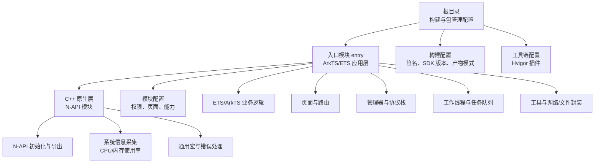
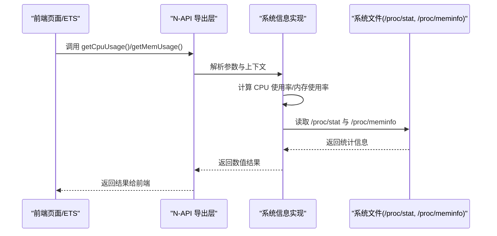
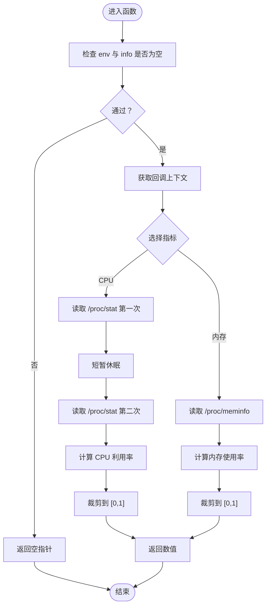
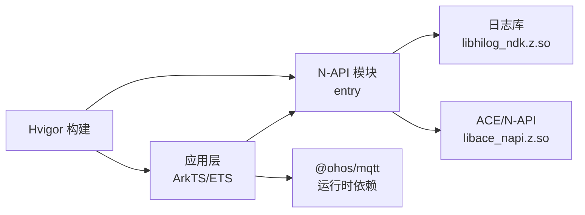

# 开发者指南

<cite>
**本文引用的文件**
- [build-profile.json5](file://build-profile.json5)
- [hvigorfile.ts](file://hvigorfile.ts)
- [oh-package.json5](file://oh-package.json5)
- [entry/build-profile.json5](file://entry/build-profile.json5)
- [entry/hvigorfile.ts](file://entry/hvigorfile.ts)
- [entry/src/main/cpp/CMakeLists.txt](file://entry/src/main/cpp/CMakeLists.txt)
- [entry/src/main/cpp/napi_init.cpp](file://entry/src/main/cpp/napi_init.cpp)
- [entry/src/main/cpp/GetSystemInfo.cpp](file://entry/src/main/cpp/GetSystemInfo.cpp)
- [entry/src/main/cpp/GetSystemInfo.h](file://entry/src/main/cpp/GetSystemInfo.h)
- [entry/src/main/cpp/common/native_common.h](file://entry/src/main/cpp/common/native_common.h)
- [entry/src/main/module.json5](file://entry/src/main/module.json5)
</cite>

## 目录
1. [简介](#简介)
2. [项目结构](#项目结构)
3. [核心组件](#核心组件)
4. [架构总览](#架构总览)
5. [详细组件分析](#详细组件分析)
6. [依赖分析](#依赖分析)
7. [性能考虑](#性能考虑)
8. [故障排查指南](#故障排查指南)
9. [结论](#结论)
10. [附录](#附录)

## 简介
本指南面向开发者，帮助您完成开发环境搭建、依赖安装与调试配置；记录编码与注释规范、版本控制流程；解释 C++ 混合开发与 N-API 接口实现；提供代码贡献、评审与发布流程；总结常见问题与调试技巧、性能优化建议，并阐明项目结构与模块划分原则。

## 项目结构
本仓库采用多模块结构，根目录包含应用级配置与入口模块（entry）。入口模块内含 ArkTS/ETS 前端逻辑与 C++ 原生扩展（通过 N-API 暴露能力），并通过 CMake 进行原生构建，由 Hvigor 驱动打包与签名。

图表来源
- [entry/src/main/module.json5](file://entry/src/main/module.json5#L1-L86)
- [entry/src/main/cpp/CMakeLists.txt](file://entry/src/main/cpp/CMakeLists.txt#L1-L13)
- [entry/src/main/cpp/napi_init.cpp](file://entry/src/main/cpp/napi_init.cpp#L1-L31)
- [entry/src/main/cpp/GetSystemInfo.cpp](file://entry/src/main/cpp/GetSystemInfo.cpp#L1-L181)

章节来源
- [build-profile.json5](file://build-profile.json5#L1-L51)
- [hvigorfile.ts](file://hvigorfile.ts#L1-L7)
- [oh-package.json5](file://oh-package.json5#L1-L17)
- [entry/build-profile.json5](file://entry/build-profile.json5#L1-L39)
- [entry/hvigorfile.ts](file://entry/hvigorfile.ts#L1-L7)
- [entry/src/main/module.json5](file://entry/src/main/module.json5#L1-L86)

## 核心组件
- 应用与模块配置：定义产品签名、SDK 版本、构建模式、模块类型与页面/能力清单。
- 原生构建与 N-API：通过 CMake 编译共享库，导出 getCpuUsage 与 getMemUsage 接口。
- 工具链与打包：Hvigor 驱动构建、签名与产物生成。
- 依赖管理：npm/yarn 锁定与运行时依赖（如 @ohos/mqtt）。

章节来源
- [build-profile.json5](file://build-profile.json5#L18-L35)
- [entry/build-profile.json5](file://entry/build-profile.json5#L7-L14)
- [entry/src/main/cpp/CMakeLists.txt](file://entry/src/main/cpp/CMakeLists.txt#L12-L13)
- [entry/src/main/cpp/napi_init.cpp](file://entry/src/main/cpp/napi_init.cpp#L7-L14)
- [oh-package.json5](file://oh-package.json5#L9-L16)

## 架构总览
下图展示从前端调用到原生接口再到系统资源读取的整体流程。

图表来源
- [entry/src/main/cpp/napi_init.cpp](file://entry/src/main/cpp/napi_init.cpp#L7-L14)
- [entry/src/main/cpp/GetSystemInfo.cpp](file://entry/src/main/cpp/GetSystemInfo.cpp#L10-L49)
- [entry/src/main/cpp/GetSystemInfo.cpp](file://entry/src/main/cpp/GetSystemInfo.cpp#L72-L115)
- [entry/src/main/cpp/GetSystemInfo.cpp](file://entry/src/main/cpp/GetSystemInfo.cpp#L162-L179)

## 详细组件分析

### CMake 构建配置
- 最低版本与工程名：声明 CMake 最低版本与工程名称。
- 头文件路径：包含源码根目录与 include 目录。
- 调试符号：启用调试符号保留策略。
- 目标与链接：构建共享库并链接 ACE/NAPI 与日志库。

章节来源
- [entry/src/main/cpp/CMakeLists.txt](file://entry/src/main/cpp/CMakeLists.txt#L1-L13)

### N-API 模块初始化与导出
- 模块注册：通过 napi_module 定义模块名与注册函数。
- 属性导出：将 getCpuUsage 与 getMemUsage 注册为可调用属性。
- 全局构造：使用构造器自动注册模块。

章节来源
- [entry/src/main/cpp/napi_init.cpp](file://entry/src/main/cpp/napi_init.cpp#L17-L30)
- [entry/src/main/cpp/napi_init.cpp](file://entry/src/main/cpp/napi_init.cpp#L7-L14)

### 系统信息采集实现
- CPU 使用率：解析 /proc/stat，两次采样计算空闲时间差与总时间差，得到利用率。
- 内存使用率：解析 /proc/meminfo，计算可用内存占比。
- 参数校验与错误日志：对空指针与回调信息进行检查并记录日志。
- 线程休眠：采样间隔以减少抖动。

图表来源
- [entry/src/main/cpp/GetSystemInfo.cpp](file://entry/src/main/cpp/GetSystemInfo.cpp#L10-L49)
- [entry/src/main/cpp/GetSystemInfo.cpp](file://entry/src/main/cpp/GetSystemInfo.cpp#L72-L115)
- [entry/src/main/cpp/GetSystemInfo.cpp](file://entry/src/main/cpp/GetSystemInfo.cpp#L162-L179)

章节来源
- [entry/src/main/cpp/GetSystemInfo.cpp](file://entry/src/main/cpp/GetSystemInfo.cpp#L10-L49)
- [entry/src/main/cpp/GetSystemInfo.cpp](file://entry/src/main/cpp/GetSystemInfo.cpp#L72-L115)
- [entry/src/main/cpp/GetSystemInfo.cpp](file://entry/src/main/cpp/GetSystemInfo.cpp#L162-L179)

### 通用宏与错误处理
- 统一断言与错误提取：提供 ASSERT、NAPI_CALL、GET_AND_THROW_LAST_ERROR 等宏，简化错误处理与异常抛出。
- 属性与方法声明：提供便捷的属性/函数/Getter/Setter 声明宏，统一导出风格。

章节来源
- [entry/src/main/cpp/common/native_common.h](file://entry/src/main/cpp/common/native_common.h#L21-L56)
- [entry/src/main/cpp/common/native_common.h](file://entry/src/main/cpp/common/native_common.h#L58-L96)

### 模块与权限配置
- 模块类型与主元素：定义模块类型、主页面与能力入口。
- 权限列表：声明网络、位置、蓝牙等权限及其使用场景。
- 页面与能力：配置首页、标签页与启动窗口等。

章节来源
- [entry/src/main/module.json5](file://entry/src/main/module.json5#L2-L13)
- [entry/src/main/module.json5](file://entry/src/main/module.json5#L36-L84)

## 依赖分析
- 应用级依赖：@ohos/mqtt（运行时）、@ohos/hypium、@ohos/hamock（测试）。
- 构建与打包：Hvigor 驱动，按产品与目标生成 debug/release 产物。
- 原生库：链接 libhilog_ndk.z.so 与 libace_napi.z.so，确保日志与 N-API 支持。

图表来源
- [entry/src/main/cpp/CMakeLists.txt](file://entry/src/main/cpp/CMakeLists.txt#L12-L13)
- [oh-package.json5](file://oh-package.json5#L9-L16)
- [hvigorfile.ts](file://hvigorfile.ts#L1-L7)

章节来源
- [oh-package.json5](file://oh-package.json5#L9-L16)
- [entry/src/main/cpp/CMakeLists.txt](file://entry/src/main/cpp/CMakeLists.txt#L12-L13)
- [hvigorfile.ts](file://hvigorfile.ts#L1-L7)

## 性能考虑
- 原生接口开销：N-API 调用存在上下文切换成本，建议批量调用或合并数据请求。
- I/O 与采样：系统文件读取与短暂休眠用于稳定采样，避免过于频繁调用导致抖动。
- 构建优化：开启 PGO（若需要）与按需混淆规则，Release 模式下启用优化与裁剪。
- 日志级别：生产环境降低日志量，仅保留必要 INFO/WARN/ERR。

## 故障排查指南
- N-API 回调失败：检查 env 与 info 是否为空，确认回调上下文获取是否成功。
- 文件读取失败：确认 /proc/stat 与 /proc/meminfo 可访问，注意权限与平台差异。
- 构建报错：核对 CMakeLists 中头文件路径与链接库是否存在；确认 ABI 过滤与编译器工具链。
- 打包签名：核对签名配置与证书路径，确保 storeFile/storePassword 一致。

章节来源
- [entry/src/main/cpp/GetSystemInfo.cpp](file://entry/src/main/cpp/GetSystemInfo.cpp#L12-L21)
- [entry/src/main/cpp/GetSystemInfo.cpp](file://entry/src/main/cpp/GetSystemInfo.cpp#L54-L69)
- [entry/src/main/cpp/CMakeLists.txt](file://entry/src/main/cpp/CMakeLists.txt#L9-L13)
- [build-profile.json5](file://build-profile.json5#L3-L16)

## 结论
本项目通过 CMake 与 N-API 实现了 ArkTS/ETS 与 C++ 的高效混合开发，结合 Hvigor 完成构建与签名。遵循本文档的开发与调试流程，可快速定位问题并持续优化性能与稳定性。

## 附录

### 开发环境搭建与依赖安装
- 安装 DevEco Studio 与 OpenHarmony SDK。
- 准备 C/C++ 工具链与 CMake（满足最低版本要求）。
- 安装 npm/yarn 并执行依赖安装，确保 @ohos/mqtt、@ohos/hypium、@ohos/hamock 可用。
- 配置签名材料与证书路径，确保与构建配置一致。

章节来源
- [build-profile.json5](file://build-profile.json5#L3-L16)
- [oh-package.json5](file://oh-package.json5#L9-L16)

### 调试设置
- 启用调试模式：使用 debug 构建模式，保留调试符号。
- 原生断点：在 CMakeLists 中保留调试符号，使用 GDB/LLDB 调试。
- 日志输出：利用日志库输出关键路径，便于定位问题。

章节来源
- [entry/src/main/cpp/CMakeLists.txt](file://entry/src/main/cpp/CMakeLists.txt#L6-L7)
- [entry/src/main/cpp/CMakeLists.txt](file://entry/src/main/cpp/CMakeLists.txt#L12-L13)

### 编码标准与注释规范
- C++：使用统一的错误处理宏，保持函数入参校验与返回值一致性。
- ETS/ArkTS：遵循项目既有命名与注释风格，保持接口文档化。
- 注释：对复杂算法与边界条件添加注释，便于后续维护。

章节来源
- [entry/src/main/cpp/common/native_common.h](file://entry/src/main/cpp/common/native_common.h#L21-L56)

### 版本控制流程
- 分支策略：主分支保护，特性分支开发，提交信息清晰描述变更。
- 提交规范：遵循项目约定的提交模板，关联 Issue/PR。
- 合并与审核：通过 Pull Request 合并，至少一名维护者批准。

### 代码贡献流程
- Fork 仓库 -> 新建分支 -> 提交修改 -> 发起 PR -> 代码评审 -> 合并。
- 评审要点：功能正确性、性能影响、兼容性、安全性与可维护性。

### 代码审查标准
- 接口设计：参数与返回值明确，错误处理完备。
- 原生安全：避免空指针、越界访问与资源泄漏。
- 文档与注释：关键逻辑有注释，对外接口有说明。

### 发布流程
- 构建 Release：按产品配置生成签名产物，执行混淆与优化。
- 包管理：更新版本号与依赖锁文件，推送标签与发布说明。
- 测试验证：自动化测试与手动回归测试通过后方可发布。

### 常见开发问题与调试技巧
- 原生模块未加载：检查模块名与注册函数是否匹配，确认共享库已正确链接。
- 数据异常：核对采样间隔与裁剪逻辑，避免误判。
- 构建失败：检查 CMakeLists 语法与依赖库路径，确认 ABI 与编译器版本。

### 性能优化建议与最佳实践
- 合理采样：避免过密采样导致抖动，必要时缓存短期结果。
- I/O 优化：减少重复打开文件，合并读取操作。
- 构建优化：启用必要的编译优化与链接时优化，按需裁剪无用符号。