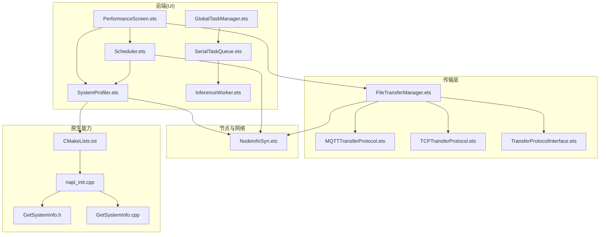
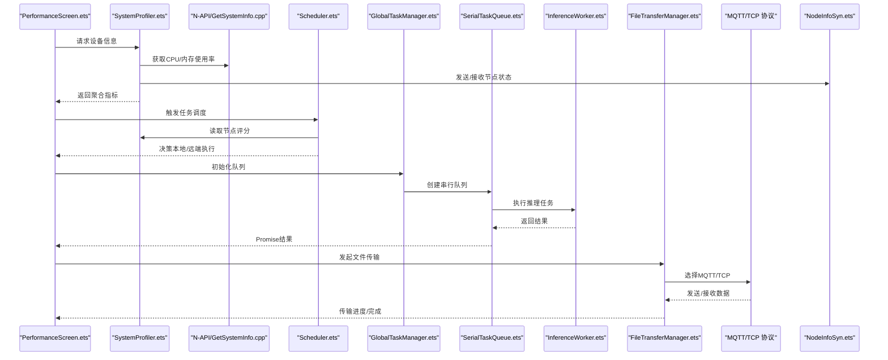
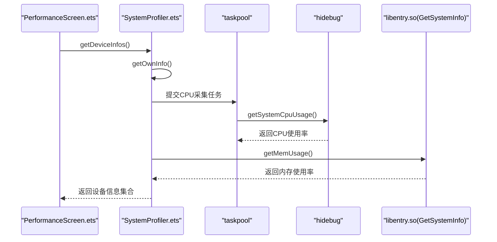
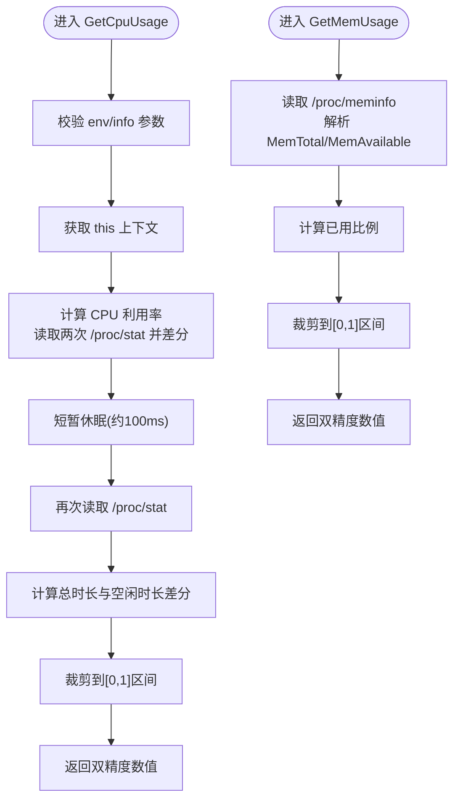
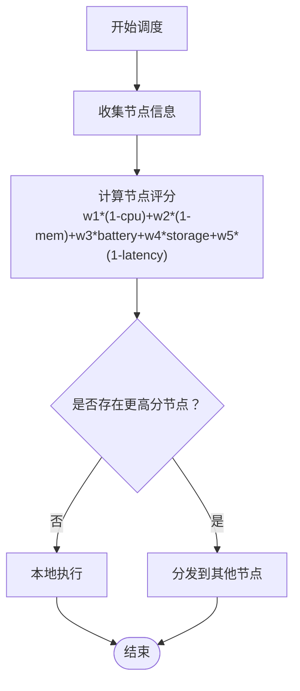
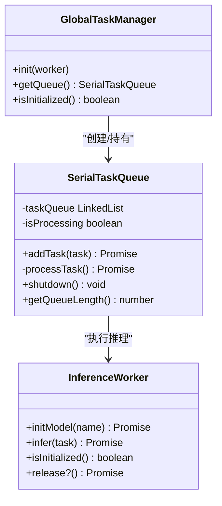
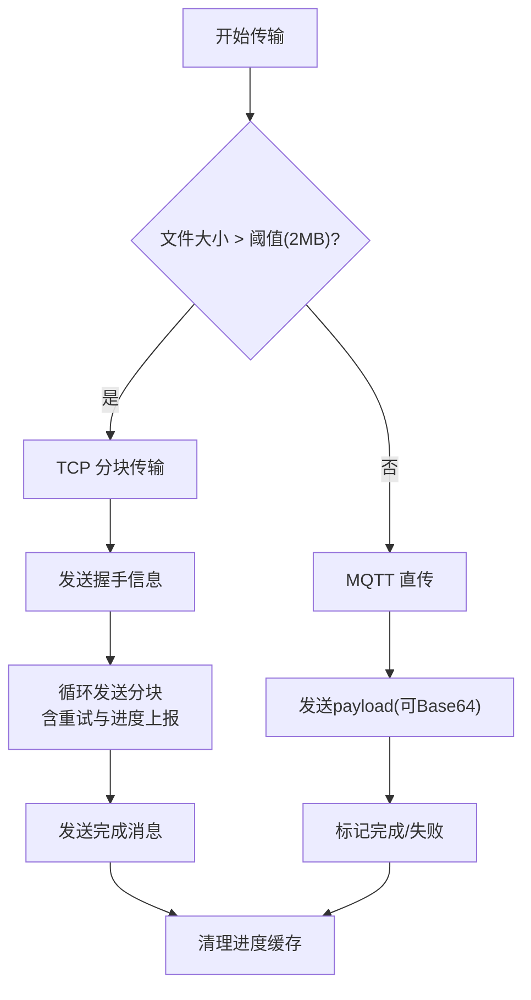
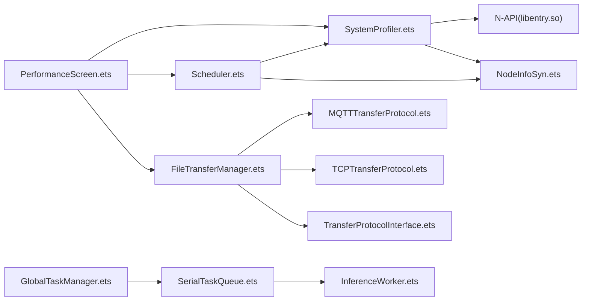

# 性能优化

<cite>
**本文引用的文件**
- [CMakeLists.txt](file://entry/src/main/cpp/CMakeLists.txt)
- [napi_init.cpp](file://entry/src/main/cpp/napi_init.cpp)
- [GetSystemInfo.h](file://entry/src/main/cpp/GetSystemInfo.h)
- [GetSystemInfo.cpp](file://entry/src/main/cpp/GetSystemInfo.cpp)
- [SystemProfiler.ets](file://entry/src/main/ets/manager/monitor/SystemProfiler.ets)
- [Scheduler.ets](file://entry/src/main/ets/manager/scheduler/Scheduler.ets)
- [GlobalTaskManager.ets](file://entry/src/main/ets/manager/worker/GlobalTaskManager.ets)
- [SerialTaskQueue.ets](file://entry/src/main/ets/manager/worker/SerialTaskQueue.ets)
- [InferenceWorker.ets](file://entry/src/main/ets/manager/worker/InferenceWorker.ets)
- [FileTransferManager.ets](file://entry/src/main/ets/manager/transfer/FileTransferManager.ets)
- [TransferProtocolInterface.ets](file://entry/src/main/ets/manager/transfer/protocol/TransferProtocolInterface.ets)
- [MQTTTransferProtocol.ets](file://entry/src/main/ets/manager/transfer/protocol/MQTTTransferProtocol.ets)
- [TCPTransferProtocol.ets](file://entry/src/main/ets/manager/transfer/protocol/TCPTransferProtocol.ets)
- [NodeInfoSyn.ets](file://entry/src/main/ets/manager/broker/monitor/NodeInfoSyn.ets)
- [PerformanceScreen.ets](file://entry/src/main/ets/pages/tabs/PerformanceScreen.ets)
</cite>

## 目录
1. [简介](#简介)
2. [项目结构](#项目结构)
3. [核心组件](#核心组件)
4. [架构总览](#架构总览)
5. [详细组件分析](#详细组件分析)
6. [依赖关系分析](#依赖关系分析)
7. [性能考虑](#性能考虑)
8. [故障排查指南](#故障排查指南)
9. [结论](#结论)
10. [附录](#附录)

## 简介
本技术指南聚焦于 OpenHarmony 应用在实际运行中的性能优化实践，围绕内存管理、CPU 使用优化、I/O 性能提升、系统监控与分析、任务调度优化、并发与资源分配、网络通信优化、UI 渲染性能优化，以及 C++ 混合代码（JNI/N-API）的性能要点，结合仓库中已实现的监控采集、任务队列、传输协议与调度策略，提供可落地的优化建议与实施方案。

## 项目结构
该项目采用 ArkTS + C++ 混合架构，前端使用 ArkTS/ArkUI 构建页面与业务逻辑，后端通过 N-API 暴露 C++ 能力（如系统 CPU/内存采集），并通过 MQTT/TCP 协议进行设备间文件传输与节点信息同步，配合调度器进行任务分发与负载均衡。

图示来源
- [PerformanceScreen.ets](file://entry/src/main/ets/pages/tabs/PerformanceScreen.ets#L1-L204)
- [SystemProfiler.ets](file://entry/src/main/ets/manager/monitor/SystemProfiler.ets#L1-L120)
- [Scheduler.ets](file://entry/src/main/ets/manager/scheduler/Scheduler.ets#L1-L105)
- [GlobalTaskManager.ets](file://entry/src/main/ets/manager/worker/GlobalTaskManager.ets#L1-L27)
- [SerialTaskQueue.ets](file://entry/src/main/ets/manager/worker/SerialTaskQueue.ets#L1-L104)
- [InferenceWorker.ets](file://entry/src/main/ets/manager/worker/InferenceWorker.ets#L1-L90)
- [FileTransferManager.ets](file://entry/src/main/ets/manager/transfer/FileTransferManager.ets#L1-L375)
- [TransferProtocolInterface.ets](file://entry/src/main/ets/manager/transfer/protocol/TransferProtocolInterface.ets#L1-L120)
- [MQTTTransferProtocol.ets](file://entry/src/main/ets/manager/transfer/protocol/MQTTTransferProtocol.ets#L1-L185)
- [TCPTransferProtocol.ets](file://entry/src/main/ets/manager/transfer/protocol/TCPTransferProtocol.ets#L1-L351)
- [NodeInfoSyn.ets](file://entry/src/main/ets/manager/broker/monitor/NodeInfoSyn.ets#L1-L173)
- [CMakeLists.txt](file://entry/src/main/cpp/CMakeLists.txt#L1-L13)
- [napi_init.cpp](file://entry/src/main/cpp/napi_init.cpp#L1-L31)
- [GetSystemInfo.h](file://entry/src/main/cpp/GetSystemInfo.h#L1-L24)
- [GetSystemInfo.cpp](file://entry/src/main/cpp/GetSystemInfo.cpp#L1-L181)

章节来源
- [PerformanceScreen.ets](file://entry/src/main/ets/pages/tabs/PerformanceScreen.ets#L1-L204)
- [SystemProfiler.ets](file://entry/src/main/ets/manager/monitor/SystemProfiler.ets#L1-L120)
- [Scheduler.ets](file://entry/src/main/ets/manager/scheduler/Scheduler.ets#L1-L105)
- [GlobalTaskManager.ets](file://entry/src/main/ets/manager/worker/GlobalTaskManager.ets#L1-L27)
- [SerialTaskQueue.ets](file://entry/src/main/ets/manager/worker/SerialTaskQueue.ets#L1-L104)
- [InferenceWorker.ets](file://entry/src/main/ets/manager/worker/InferenceWorker.ets#L1-L90)
- [FileTransferManager.ets](file://entry/src/main/ets/manager/transfer/FileTransferManager.ets#L1-L375)
- [TransferProtocolInterface.ets](file://entry/src/main/ets/manager/transfer/protocol/TransferProtocolInterface.ets#L1-L120)
- [MQTTTransferProtocol.ets](file://entry/src/main/ets/manager/transfer/protocol/MQTTTransferProtocol.ets#L1-L185)
- [TCPTransferProtocol.ets](file://entry/src/main/ets/manager/transfer/protocol/TCPTransferProtocol.ets#L1-L351)
- [NodeInfoSyn.ets](file://entry/src/main/ets/manager/broker/monitor/NodeInfoSyn.ets#L1-L173)
- [CMakeLists.txt](file://entry/src/main/cpp/CMakeLists.txt#L1-L13)
- [napi_init.cpp](file://entry/src/main/cpp/napi_init.cpp#L1-L31)
- [GetSystemInfo.h](file://entry/src/main/cpp/GetSystemInfo.h#L1-L24)
- [GetSystemInfo.cpp](file://entry/src/main/cpp/GetSystemInfo.cpp#L1-L181)

## 核心组件
- 系统监控与性能分析
  - SystemProfiler：聚合设备 CPU、内存、存储、电池、网络延迟等指标，提供并发采集与任务池执行。
  - N-API 模块：通过 C++ 读取 /proc 统计信息，向 JS 暴露 CPU/内存使用率接口。
- 任务调度与并发
  - Scheduler：基于节点评分（CPU/内存/电量/存储/延迟）选择最优执行节点。
  - GlobalTaskManager + SerialTaskQueue：串行化推理任务，避免资源争用，支持队列长度与关闭清理。
  - InferenceWorker：推理任务接口抽象，支持多类型输入与结果。
- 网络传输与 I/O
  - FileTransferManager：统一传输入口，按文件大小自动选择 MQTT/TCP 协议。
  - TransferProtocolInterface：传输协议标准化接口。
  - MQTTTransferProtocol：小文件直传，带重试与进度模拟。
  - TCPTransferProtocol：大文件分块传输，握手、重试、进度上报、完成确认。
- 节点信息同步
  - NodeInfoSyn：设备间状态广播、延迟测试、去重更新。
- UI 展示
  - PerformanceScreen：定时刷新设备指标，展示 CPU/内存/存储/电池状态。

章节来源
- [SystemProfiler.ets](file://entry/src/main/ets/manager/monitor/SystemProfiler.ets#L1-L120)
- [napi_init.cpp](file://entry/src/main/cpp/napi_init.cpp#L1-L31)
- [GetSystemInfo.cpp](file://entry/src/main/cpp/GetSystemInfo.cpp#L1-L181)
- [Scheduler.ets](file://entry/src/main/ets/manager/scheduler/Scheduler.ets#L1-L105)
- [GlobalTaskManager.ets](file://entry/src/main/ets/manager/worker/GlobalTaskManager.ets#L1-L27)
- [SerialTaskQueue.ets](file://entry/src/main/ets/manager/worker/SerialTaskQueue.ets#L1-L104)
- [InferenceWorker.ets](file://entry/src/main/ets/manager/worker/InferenceWorker.ets#L1-L90)
- [FileTransferManager.ets](file://entry/src/main/ets/manager/transfer/FileTransferManager.ets#L1-L375)
- [TransferProtocolInterface.ets](file://entry/src/main/ets/manager/transfer/protocol/TransferProtocolInterface.ets#L1-L120)
- [MQTTTransferProtocol.ets](file://entry/src/main/ets/manager/transfer/protocol/MQTTTransferProtocol.ets#L1-L185)
- [TCPTransferProtocol.ets](file://entry/src/main/ets/manager/transfer/protocol/TCPTransferProtocol.ets#L1-L351)
- [NodeInfoSyn.ets](file://entry/src/main/ets/manager/broker/monitor/NodeInfoSyn.ets#L1-L173)
- [PerformanceScreen.ets](file://entry/src/main/ets/pages/tabs/PerformanceScreen.ets#L1-L204)

## 架构总览
下图展示了从 UI 到原生采集、任务队列、传输协议与节点同步的整体流程。

图示来源
- [PerformanceScreen.ets](file://entry/src/main/ets/pages/tabs/PerformanceScreen.ets#L1-L204)
- [SystemProfiler.ets](file://entry/src/main/ets/manager/monitor/SystemProfiler.ets#L1-L120)
- [GetSystemInfo.cpp](file://entry/src/main/cpp/GetSystemInfo.cpp#L1-L181)
- [Scheduler.ets](file://entry/src/main/ets/manager/scheduler/Scheduler.ets#L1-L105)
- [GlobalTaskManager.ets](file://entry/src/main/ets/manager/worker/GlobalTaskManager.ets#L1-L27)
- [SerialTaskQueue.ets](file://entry/src/main/ets/manager/worker/SerialTaskQueue.ets#L1-L104)
- [InferenceWorker.ets](file://entry/src/main/ets/manager/worker/InferenceWorker.ets#L1-L90)
- [FileTransferManager.ets](file://entry/src/main/ets/manager/transfer/FileTransferManager.ets#L1-L375)
- [MQTTTransferProtocol.ets](file://entry/src/main/ets/manager/transfer/protocol/MQTTTransferProtocol.ets#L1-L185)
- [TCPTransferProtocol.ets](file://entry/src/main/ets/manager/transfer/protocol/TCPTransferProtocol.ets#L1-L351)
- [NodeInfoSyn.ets](file://entry/src/main/ets/manager/broker/monitor/NodeInfoSyn.ets#L1-L173)

## 详细组件分析

### 系统监控与性能分析（SystemProfiler）
- 功能要点
  - 使用 PerformanceAnalysisKit 获取系统 CPU 使用率，兼容旧版内存信息通过 N-API 调用 C++ 采集。
  - 通过任务池并发采集 CPU，避免阻塞主线程。
  - 聚合设备名、电池、存储、网络延迟等信息，形成设备维度的性能画像。
- 性能影响
  - 任务池并发采集降低 UI 卡顿风险。
  - N-API 调用需注意线程切换与错误处理，避免频繁调用造成抖动。
- 优化建议
  - 控制采集频率（例如 10s 一次），避免过度采样。
  - 对 CPU 使用率采用滑动窗口平滑，减少瞬时波动对调度的影响。
  - 在低端设备上优先使用系统接口，必要时降级到 N-API。

图示来源
- [SystemProfiler.ets](file://entry/src/main/ets/manager/monitor/SystemProfiler.ets#L1-L120)
- [PerformanceScreen.ets](file://entry/src/main/ets/pages/tabs/PerformanceScreen.ets#L1-L204)
- [napi_init.cpp](file://entry/src/main/cpp/napi_init.cpp#L1-L31)
- [GetSystemInfo.cpp](file://entry/src/main/cpp/GetSystemInfo.cpp#L1-L181)

章节来源
- [SystemProfiler.ets](file://entry/src/main/ets/manager/monitor/SystemProfiler.ets#L1-L120)
- [PerformanceScreen.ets](file://entry/src/main/ets/pages/tabs/PerformanceScreen.ets#L1-L204)
- [napi_init.cpp](file://entry/src/main/cpp/napi_init.cpp#L1-L31)
- [GetSystemInfo.cpp](file://entry/src/main/cpp/GetSystemInfo.cpp#L1-L181)

### C++ 混合代码与 N-API（内存/CPU 采集）
- 功能要点
  - CMake 配置保留调试符号，便于性能分析与定位。
  - N-API 暴露 CPU/内存使用率接口，供 JS 调用。
  - C++ 侧通过解析 /proc 文件统计 CPU 利用率，读取 /proc/meminfo 计算内存使用率。
- 性能影响
  - I/O 读取 /proc 有一定开销，应避免高频调用。
  - 线程休眠用于两次采样差分，需注意采样间隔与精度平衡。
- 优化建议
  - 采样间隔建议 ≥100ms，避免过于频繁触发磁盘 I/O。
  - 使用缓存最近一次结果并在 UI 刷新周期内复用。
  - 对解析逻辑做边界检查与早退，减少无效工作。

图示来源
- [GetSystemInfo.cpp](file://entry/src/main/cpp/GetSystemInfo.cpp#L1-L181)
- [GetSystemInfo.h](file://entry/src/main/cpp/GetSystemInfo.h#L1-L24)
- [napi_init.cpp](file://entry/src/main/cpp/napi_init.cpp#L1-L31)
- [CMakeLists.txt](file://entry/src/main/cpp/CMakeLists.txt#L1-L13)

章节来源
- [GetSystemInfo.cpp](file://entry/src/main/cpp/GetSystemInfo.cpp#L1-L181)
- [GetSystemInfo.h](file://entry/src/main/cpp/GetSystemInfo.h#L1-L24)
- [napi_init.cpp](file://entry/src/main/cpp/napi_init.cpp#L1-L31)
- [CMakeLists.txt](file://entry/src/main/cpp/CMakeLists.txt#L1-L13)

### 任务调度优化（Scheduler）
- 功能要点
  - 基于节点评分选择最优执行节点，评分综合 CPU、内存、电量、存储、延迟。
  - 本地节点评分最高则本地执行，否则通过任务分发模块发送到其他节点。
- 性能影响
  - 评分权重直接影响任务分配公平性与整体吞吐。
  - 节点信息来自广播与同步模块，需保证时效性与一致性。
- 优化建议
  - 动态调整权重参数，结合历史负载与任务特征自适应。
  - 对低电量/高延迟节点设置惩罚因子，避免将其作为首选。
  - 引入预热与迁移策略，减少频繁切换带来的抖动。

图示来源
- [Scheduler.ets](file://entry/src/main/ets/manager/scheduler/Scheduler.ets#L1-L105)
- [SystemProfiler.ets](file://entry/src/main/ets/manager/monitor/SystemProfiler.ets#L1-L120)
- [NodeInfoSyn.ets](file://entry/src/main/ets/manager/broker/monitor/NodeInfoSyn.ets#L1-L173)

章节来源
- [Scheduler.ets](file://entry/src/main/ets/manager/scheduler/Scheduler.ets#L1-L105)
- [SystemProfiler.ets](file://entry/src/main/ets/manager/monitor/SystemProfiler.ets#L1-L120)
- [NodeInfoSyn.ets](file://entry/src/main/ets/manager/broker/monitor/NodeInfoSyn.ets#L1-L173)

### 并发控制与资源分配（队列与 Worker）
- 功能要点
  - GlobalTaskManager 提供全局串行队列单例，避免并发冲突。
  - SerialTaskQueue 串行执行任务，支持队列长度查询与关闭清理。
  - InferenceWorker 抽象推理任务接口，支持多种输入类型与结果结构。
- 性能影响
  - 串行队列简单可靠，但吞吐受限；若推理耗时较长，可考虑拆分为多个 Worker 或引入并行池。
  - Promise 化接口便于 UI 与业务层异步处理。
- 优化建议
  - 对长耗时任务拆分阶段，暴露阶段性进度。
  - 在队列空闲时进行轻量任务合并，提高资源利用率。
  - 对可并行的独立任务，设计并行 Worker 池与任务切片。

图示来源
- [GlobalTaskManager.ets](file://entry/src/main/ets/manager/worker/GlobalTaskManager.ets#L1-L27)
- [SerialTaskQueue.ets](file://entry/src/main/ets/manager/worker/SerialTaskQueue.ets#L1-L104)
- [InferenceWorker.ets](file://entry/src/main/ets/manager/worker/InferenceWorker.ets#L1-L90)

章节来源
- [GlobalTaskManager.ets](file://entry/src/main/ets/manager/worker/GlobalTaskManager.ets#L1-L27)
- [SerialTaskQueue.ets](file://entry/src/main/ets/manager/worker/SerialTaskQueue.ets#L1-L104)
- [InferenceWorker.ets](file://entry/src/main/ets/manager/worker/InferenceWorker.ets#L1-L90)

### 网络通信优化（传输协议与带宽利用）
- 功能要点
  - FileTransferManager 自动根据文件大小选择协议：>2MB 用 TCP，≤2MB 用 MQTT。
  - MQTTTransferProtocol：小文件直传，带重试与进度模拟。
  - TCPTransferProtocol：大文件分块传输，握手、重试、进度上报、完成确认。
- 性能影响
  - 协议选择直接影响吞吐与稳定性。
  - TCP 分块大小、重试次数、超时时间决定传输效率与可靠性。
- 优化建议
  - TCP 分块大小建议 128KB~1MB，结合网络质量动态调整。
  - 增加重传退避策略与拥塞控制（如指数退避+抖动）。
  - 对 MQTT 传输增加压缩与批量发送，减少消息数量。
  - 传输完成后及时清理进度缓存，避免内存泄漏。

图示来源
- [FileTransferManager.ets](file://entry/src/main/ets/manager/transfer/FileTransferManager.ets#L1-L375)
- [MQTTTransferProtocol.ets](file://entry/src/main/ets/manager/transfer/protocol/MQTTTransferProtocol.ets#L1-L185)
- [TCPTransferProtocol.ets](file://entry/src/main/ets/manager/transfer/protocol/TCPTransferProtocol.ets#L1-L351)

章节来源
- [FileTransferManager.ets](file://entry/src/main/ets/manager/transfer/FileTransferManager.ets#L1-L375)
- [TransferProtocolInterface.ets](file://entry/src/main/ets/manager/transfer/protocol/TransferProtocolInterface.ets#L1-L120)
- [MQTTTransferProtocol.ets](file://entry/src/main/ets/manager/transfer/protocol/MQTTTransferProtocol.ets#L1-L185)
- [TCPTransferProtocol.ets](file://entry/src/main/ets/manager/transfer/protocol/TCPTransferProtocol.ets#L1-L351)

### UI 渲染性能优化（页面与组件）
- 功能要点
  - PerformanceScreen 定时刷新设备指标，使用选择器与网格布局展示 CPU/内存/存储/电池。
  - 使用 ArkUI 组件与状态绑定，避免不必要的重绘。
- 性能影响
  - 定时器频率过高会增加主线程压力。
  - 列表/网格渲染在大数据量时需注意虚拟化与懒加载。
- 优化建议
  - 将刷新频率从 10s 调整为 15~30s，或根据场景动态调整。
  - 对图表组件使用最小化重绘策略，仅在数据变化时更新。
  - 使用 @Provide/@Consume 双向同步时避免深层嵌套导致的全量更新。

章节来源
- [PerformanceScreen.ets](file://entry/src/main/ets/pages/tabs/PerformanceScreen.ets#L1-L204)

### 任务调度与并发控制（调度器与队列）
- 功能要点
  - Scheduler 基于评分决策，NodeInfoSyn 提供节点状态与延迟测试。
  - GlobalTaskManager/SerialTaskQueue 保障任务有序执行。
- 性能影响
  - 评分权重与节点信息准确性直接影响调度效果。
  - 队列阻塞会放大任务延迟，需结合限流与优先级。
- 优化建议
  - 引入任务优先级与配额控制，避免高优任务被长时间推理阻塞。
  - 对热点节点设置容量上限，防止过载。
  - 延迟测试周期性触发，动态修正评分中的延迟项。

章节来源
- [Scheduler.ets](file://entry/src/main/ets/manager/scheduler/Scheduler.ets#L1-L105)
- [NodeInfoSyn.ets](file://entry/src/main/ets/manager/broker/monitor/NodeInfoSyn.ets#L1-L173)
- [GlobalTaskManager.ets](file://entry/src/main/ets/manager/worker/GlobalTaskManager.ets#L1-L27)
- [SerialTaskQueue.ets](file://entry/src/main/ets/manager/worker/SerialTaskQueue.ets#L1-L104)

## 依赖关系分析
- 组件耦合
  - SystemProfiler 依赖 N-API 与 PerformanceAnalysisKit，同时与 NodeInfoSyn 交互。
  - Scheduler 依赖 SystemProfiler 与 NodeInfoSyn 的节点信息。
  - FileTransferManager 依赖协议接口与事件管理器，协议实现依赖 Socket/文件工具。
  - UI 层依赖监控与传输模块，形成闭环反馈。
- 外部依赖
  - hidebug、taskpool、statfs、batteryInfo 等系统能力。
  - MQTT 客户端与网络工具。

图示来源
- [PerformanceScreen.ets](file://entry/src/main/ets/pages/tabs/PerformanceScreen.ets#L1-L204)
- [SystemProfiler.ets](file://entry/src/main/ets/manager/monitor/SystemProfiler.ets#L1-L120)
- [NodeInfoSyn.ets](file://entry/src/main/ets/manager/broker/monitor/NodeInfoSyn.ets#L1-L173)
- [Scheduler.ets](file://entry/src/main/ets/manager/scheduler/Scheduler.ets#L1-L105)
- [FileTransferManager.ets](file://entry/src/main/ets/manager/transfer/FileTransferManager.ets#L1-L375)
- [MQTTTransferProtocol.ets](file://entry/src/main/ets/manager/transfer/protocol/MQTTTransferProtocol.ets#L1-L185)
- [TCPTransferProtocol.ets](file://entry/src/main/ets/manager/transfer/protocol/TCPTransferProtocol.ets#L1-L351)
- [TransferProtocolInterface.ets](file://entry/src/main/ets/manager/transfer/protocol/TransferProtocolInterface.ets#L1-L120)
- [GlobalTaskManager.ets](file://entry/src/main/ets/manager/worker/GlobalTaskManager.ets#L1-L27)
- [SerialTaskQueue.ets](file://entry/src/main/ets/manager/worker/SerialTaskQueue.ets#L1-L104)
- [InferenceWorker.ets](file://entry/src/main/ets/manager/worker/InferenceWorker.ets#L1-L90)

章节来源
- [PerformanceScreen.ets](file://entry/src/main/ets/pages/tabs/PerformanceScreen.ets#L1-L204)
- [SystemProfiler.ets](file://entry/src/main/ets/manager/monitor/SystemProfiler.ets#L1-L120)
- [NodeInfoSyn.ets](file://entry/src/main/ets/manager/broker/monitor/NodeInfoSyn.ets#L1-L173)
- [Scheduler.ets](file://entry/src/main/ets/manager/scheduler/Scheduler.ets#L1-L105)
- [FileTransferManager.ets](file://entry/src/main/ets/manager/transfer/FileTransferManager.ets#L1-L375)
- [MQTTTransferProtocol.ets](file://entry/src/main/ets/manager/transfer/protocol/MQTTTransferProtocol.ets#L1-L185)
- [TCPTransferProtocol.ets](file://entry/src/main/ets/manager/transfer/protocol/TCPTransferProtocol.ets#L1-L351)
- [TransferProtocolInterface.ets](file://entry/src/main/ets/manager/transfer/protocol/TransferProtocolInterface.ets#L1-L120)
- [GlobalTaskManager.ets](file://entry/src/main/ets/manager/worker/GlobalTaskManager.ets#L1-L27)
- [SerialTaskQueue.ets](file://entry/src/main/ets/manager/worker/SerialTaskQueue.ets#L1-L104)
- [InferenceWorker.ets](file://entry/src/main/ets/manager/worker/InferenceWorker.ets#L1-L90)

## 性能考虑
- 内存管理
  - 避免在 UI 刷新周期内频繁创建临时对象，尽量复用。
  - 传输完成后及时清理进度缓存与分块缓冲，防止内存泄漏。
  - 对大对象（如图像/音频）使用流式处理，避免一次性加载。
- CPU 使用优化
  - 控制系统监控采样频率与并发度，避免 UI 卡顿。
  - 对长耗时任务拆分阶段，暴露中间状态，提升感知性能。
- I/O 性能提升
  - TCP 分块大小与重试策略需结合网络环境动态调整。
  - MQTT 传输可启用压缩与批量发送，减少消息数量。
- UI 渲染优化
  - 减少不必要的状态更新与组件重建，使用局部刷新。
  - 图表组件尽量使用轻量级绘制，避免复杂动画。
- C++ 混合代码优化
  - N-API 调用需注意线程切换成本，尽量批量化调用。
  - 保留调试符号便于性能分析，发布时再按需剥离。

## 故障排查指南
- 系统监控
  - 若 CPU/内存采集失败，检查 N-API 导出函数与参数校验，确认权限与路径正确。
  - 任务池执行异常时，查看错误码与堆栈，确保异常被捕获并降级。
- 传输问题
  - MQTT 传输失败：检查主题订阅、Broker 连接状态与重试策略。
  - TCP 传输卡住：检查分块发送、握手与完成消息，确认连接 ID 与超时设置。
- 调度异常
  - 节点评分异常：检查 NodeInfoSyn 的延迟测试与信息去重逻辑。
  - 任务未执行：确认队列状态与 Worker 初始化状态。

章节来源
- [SystemProfiler.ets](file://entry/src/main/ets/manager/monitor/SystemProfiler.ets#L1-L120)
- [MQTTTransferProtocol.ets](file://entry/src/main/ets/manager/transfer/protocol/MQTTTransferProtocol.ets#L1-L185)
- [TCPTransferProtocol.ets](file://entry/src/main/ets/manager/transfer/protocol/TCPTransferProtocol.ets#L1-L351)
- [NodeInfoSyn.ets](file://entry/src/main/ets/manager/broker/monitor/NodeInfoSyn.ets#L1-L173)
- [SerialTaskQueue.ets](file://entry/src/main/ets/manager/worker/SerialTaskQueue.ets#L1-L104)

## 结论
本项目在性能优化方面已具备较为完善的监控采集、任务调度与传输协议体系。建议后续重点围绕以下方向深化：动态权重与自适应调度、传输协议的拥塞控制与压缩、UI 渲染的细粒度优化、以及持续性能监控与基准测试的自动化落地。

## 附录
- 性能基准测试与持续监控实施方案（建议）
  - 基准测试
    - 场景覆盖：小文件(MQTT)、大文件(TCP)、推理任务(不同输入类型)、多节点调度。
    - 指标定义：吞吐、延迟、抖动、CPU/内存峰值、成功率。
    - 工具链：结合系统接口与自定义埋点，输出标准化报告。
  - 持续监控
    - 将 SystemProfiler 数据接入监控平台，设置阈值告警与趋势分析。
    - 对关键路径（传输、推理、调度）埋点，定期生成性能报告。