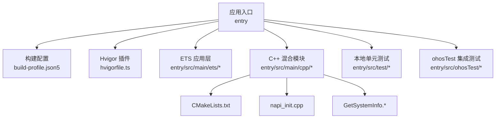
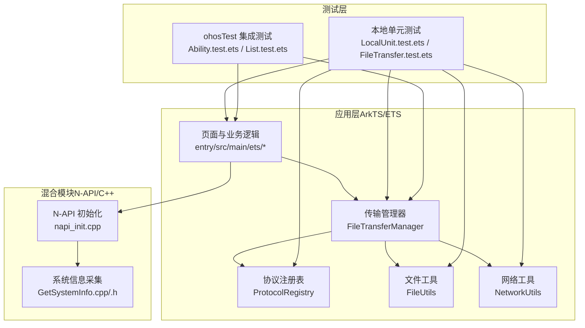
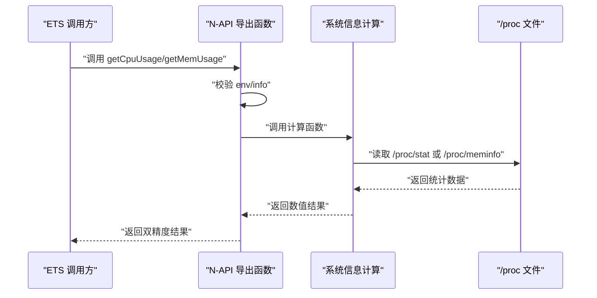
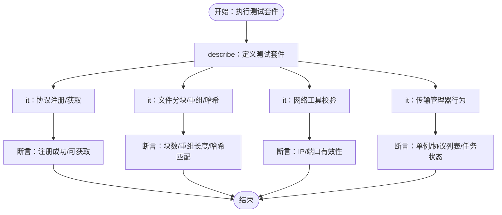
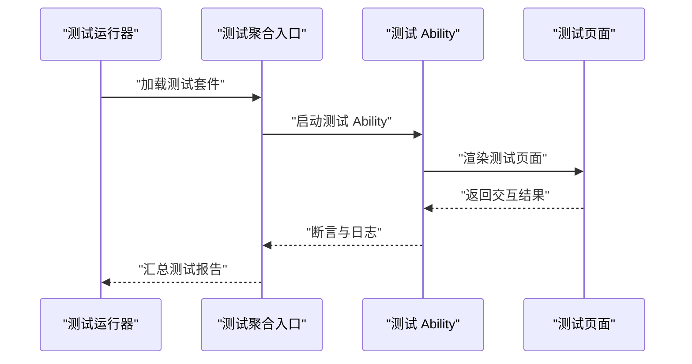

# 调试与测试

<cite>
**本文引用的文件**
- [CMakeLists.txt](file://entry/src/main/cpp/CMakeLists.txt)
- [build-profile.json5](file://entry/build-profile.json5)
- [hvigorfile.ts](file://entry/hvigorfile.ts)
- [napi_init.cpp](file://entry/src/main/cpp/napi_init.cpp)
- [GetSystemInfo.h](file://entry/src/main/cpp/GetSystemInfo.h)
- [GetSystemInfo.cpp](file://entry/src/main/cpp/GetSystemInfo.cpp)
- [LocalUnit.test.ets](file://entry/src/test/LocalUnit.test.ets)
- [List.test.ets](file://entry/src/test/List.test.ets)
- [FileTransfer.test.ets](file://entry/src/test/transfer/FileTransfer.test.ets)
- [module.json5（ohosTest）](file://entry/src/ohosTest/module.json5)
- [Ability.test.ets](file://entry/src/ohosTest/ets/test/Ability.test.ets)
- [List.test.ets（ohosTest）](file://entry/src/ohosTest/ets/test/List.test.ets)
</cite>

## 目录
1. [简介](#简介)
2. [项目结构](#项目结构)
3. [核心组件](#核心组件)
4. [架构总览](#架构总览)
5. [详细组件分析](#详细组件分析)
6. [依赖关系分析](#依赖关系分析)
7. [性能考虑](#性能考虑)
8. [故障排查指南](#故障排查指南)
9. [结论](#结论)
10. [附录](#附录)

## 简介
本指南面向 OpenHarmony 应用的调试与测试实践，覆盖以下主题：
- 日志输出与断点调试：基于 ArkTS/ETS 的日志与断点，以及 C++ 混合代码（N-API）的调试要点。
- 性能分析：CPU/内存使用统计接口的调用与观测路径。
- 单元测试：测试框架配置、用例组织与断言方法。
- 集成测试：模块间协作、端到端流程与系统级验证策略。
- C++ 混合代码调试：N-API 接口注册、导出函数与常见问题定位。
- 性能与压力测试：内存泄漏检测、性能瓶颈分析与覆盖率质量度量建议。
- 常见问题诊断与解决方案。

## 项目结构
该应用采用“Stage 模式”构建，包含 ETS 应用层与 C++ 混合模块（N-API），并通过 Hvigor 构建系统统一编排。测试分为本地单元测试与 ohosTest 集成测试两套体系。

图表来源
- [build-profile.json5](file://entry/build-profile.json5#L1-L39)
- [hvigorfile.ts](file://entry/hvigorfile.ts#L1-L7)
- [CMakeLists.txt](file://entry/src/main/cpp/CMakeLists.txt#L1-L13)

章节来源
- [build-profile.json5](file://entry/build-profile.json5#L1-L39)
- [hvigorfile.ts](file://entry/hvigorfile.ts#L1-L7)

## 核心组件
- C++ 混合模块（N-API）
  - 提供系统信息查询能力（CPU/内存使用率），通过 N-API 导出给 ArkTS/ETS 使用。
  - 关键实现位于 N-API 初始化与系统信息计算函数。
- 测试框架与用例
  - 本地单元测试使用 @ohos/hypium 框架；集成测试使用 @ohos/hypium 与 testkit。
  - 用例覆盖协议注册、文件分块/重组、哈希校验、网络工具与传输管理器等模块。

章节来源
- [napi_init.cpp](file://entry/src/main/cpp/napi_init.cpp#L1-L31)
- [GetSystemInfo.h](file://entry/src/main/cpp/GetSystemInfo.h#L1-L24)
- [GetSystemInfo.cpp](file://entry/src/main/cpp/GetSystemInfo.cpp#L1-L181)
- [LocalUnit.test.ets](file://entry/src/test/LocalUnit.test.ets#L1-L33)
- [FileTransfer.test.ets](file://entry/src/test/transfer/FileTransfer.test.ets#L1-L205)
- [Ability.test.ets](file://entry/src/ohosTest/ets/test/Ability.test.ets#L1-L35)

## 架构总览
下图展示从 ETS 层到 N-API 混合模块的数据流与调用关系，以及测试层对各模块的覆盖方式。

图表来源
- [napi_init.cpp](file://entry/src/main/cpp/napi_init.cpp#L1-L31)
- [GetSystemInfo.h](file://entry/src/main/cpp/GetSystemInfo.h#L1-L24)
- [GetSystemInfo.cpp](file://entry/src/main/cpp/GetSystemInfo.cpp#L1-L181)
- [LocalUnit.test.ets](file://entry/src/test/LocalUnit.test.ets#L1-L33)
- [FileTransfer.test.ets](file://entry/src/test/transfer/FileTransfer.test.ets#L1-L205)
- [Ability.test.ets](file://entry/src/ohosTest/ets/test/Ability.test.ets#L1-L35)

## 详细组件分析

### C++ 混合模块（N-API）调试与分析
- N-API 注册与导出
  - 通过构造 napi_property_descriptor 数组，将 C++ 方法导出为 JS 可调用的属性。
  - 使用 napi_define_properties 完成属性定义，确保导出名称与参数顺序一致。
- 系统信息采集
  - CPU 使用率：读取 /proc/stat，两次采样间隔后计算空闲时间差与总时间差，得到利用率。
  - 内存使用率：解析 /proc/meminfo，计算可用内存占比。
  - 日志：使用 LOGI/LOGE 输出成功与失败信息，便于定位。
- 调试要点
  - 在 N-API 回调中检查 env/info 是否为空，避免空指针。
  - 对系统文件读取失败进行降级处理（返回 0.0）。
  - 断点建议：在导出函数入口、系统文件读取处、计算结果边界处设置断点。
  - 性能：采样间隔与计算复杂度可控，避免频繁高开销调用。

图表来源
- [napi_init.cpp](file://entry/src/main/cpp/napi_init.cpp#L7-L14)
- [GetSystemInfo.cpp](file://entry/src/main/cpp/GetSystemInfo.cpp#L10-L50)
- [GetSystemInfo.cpp](file://entry/src/main/cpp/GetSystemInfo.cpp#L72-L115)
- [GetSystemInfo.cpp](file://entry/src/main/cpp/GetSystemInfo.cpp#L162-L179)

章节来源
- [napi_init.cpp](file://entry/src/main/cpp/napi_init.cpp#L1-L31)
- [GetSystemInfo.h](file://entry/src/main/cpp/GetSystemInfo.h#L1-L24)
- [GetSystemInfo.cpp](file://entry/src/main/cpp/GetSystemInfo.cpp#L1-L181)

### 单元测试：用例设计与运行
- 测试框架
  - @ohos/hypium：提供 describe/it/expect 等 API，支持生命周期钩子（beforeAll/beforeEach/afterEach/afterAll）。
  - testkit：用于集成测试场景，提供更丰富的断言与异步能力。
- 用例组织
  - 协议注册表：验证注册/获取/列举协议。
  - 文件工具：分块/重组、哈希计算与校验、Base64 转换。
  - 网络工具：IP 校验、端口验证。
  - 传输管理器：单例、协议选择策略、默认配置、任务列表。
  - 集成场景：模拟完整传输流程（含错误处理）。
- 断言与日志
  - 使用 expect(...).assert* 系列断言。
  - 使用 console.info/hilog.info 输出中间状态，便于定位失败点。

图表来源
- [LocalUnit.test.ets](file://entry/src/test/LocalUnit.test.ets#L1-L33)
- [FileTransfer.test.ets](file://entry/src/test/transfer/FileTransfer.test.ets#L13-L175)

章节来源
- [LocalUnit.test.ets](file://entry/src/test/LocalUnit.test.ets#L1-L33)
- [FileTransfer.test.ets](file://entry/src/test/transfer/FileTransfer.test.ets#L1-L205)

### 集成测试：端到端与系统测试策略
- ohosTest 模块
  - 通过 module.json5 配置测试 Ability 与页面资源，便于系统级启动与交互。
  - 测试入口由 List.test.ets 聚合，Ability.test.ets 提供基础断言与日志示例。
- 策略建议
  - 页面导航与事件：验证页面切换、事件触发与回调。
  - 能力与权限：验证测试 Ability 的 exported 属性与技能配置。
  - 端到端：结合本地单元测试，串联模块间调用链路，模拟真实用户路径。
  - 系统测试：在多设备类型（如 tablet/default）上验证兼容性。

图表来源
- [module.json5（ohosTest）](file://entry/src/ohosTest/module.json5#L1-L38)
- [List.test.ets（ohosTest）](file://entry/src/ohosTest/ets/test/List.test.ets#L1-L5)
- [Ability.test.ets](file://entry/src/ohosTest/ets/test/Ability.test.ets#L1-L35)

章节来源
- [module.json5（ohosTest）](file://entry/src/ohosTest/module.json5#L1-L38)
- [List.test.ets（ohosTest）](file://entry/src/ohosTest/ets/test/List.test.ets#L1-L5)
- [Ability.test.ets](file://entry/src/ohosTest/ets/test/Ability.test.ets#L1-L35)

## 依赖关系分析
- 构建与编译
  - build-profile.json5 指定 Stage 模式与外部原生构建路径，启用 arm64-v8a ABI。
  - CMakeLists.txt 定义共享库、包含目录与链接库（ACE N-API 与 HiLog）。
- 运行时依赖
  - N-API 模块需在应用启动时注册，导出函数供 ETS 调用。
  - 测试模块独立于主模块，通过 ohosTest 目标参与构建与安装。

图表来源
- [build-profile.json5](file://entry/build-profile.json5#L1-L39)
- [hvigorfile.ts](file://entry/hvigorfile.ts#L1-L7)
- [CMakeLists.txt](file://entry/src/main/cpp/CMakeLists.txt#L1-L13)

章节来源
- [build-profile.json5](file://entry/build-profile.json5#L1-L39)
- [hvigorfile.ts](file://entry/hvigorfile.ts#L1-L7)
- [CMakeLists.txt](file://entry/src/main/cpp/CMakeLists.txt#L1-L13)

## 性能考虑
- 日志与观测
  - C++ 层使用 LOGI/LOGE 输出关键指标，便于在设备侧快速定位异常。
  - ETS 层使用 console.info/hilog.info 输出中间状态，辅助定位业务逻辑问题。
- 性能分析建议
  - CPU/内存使用：通过 N-API 导出的接口在关键路径调用，观察趋势变化。
  - I/O 与网络：对文件分块、哈希计算与网络工具进行基准测试，识别瓶颈。
  - 内存泄漏：结合测试用例清理逻辑（如传输完成后清理任务），配合系统内存监控工具进行回归验证。
- 覆盖率与质量度量
  - 建议在 CI 中开启覆盖率收集，结合单元测试与集成测试，持续跟踪关键模块的覆盖情况。

章节来源
- [GetSystemInfo.cpp](file://entry/src/main/cpp/GetSystemInfo.cpp#L10-L50)
- [FileTransfer.test.ets](file://entry/src/test/transfer/FileTransfer.test.ets#L118-L175)

## 故障排查指南
- N-API 导出函数返回空
  - 检查 env/info 是否为空，确认导出函数签名与注册项一致。
  - 参考路径：[napi_init.cpp](file://entry/src/main/cpp/napi_init.cpp#L7-L14)
- 系统文件读取失败
  - /proc 文件不可读或格式异常时，返回 0.0 并记录错误日志。
  - 参考路径：[GetSystemInfo.cpp](file://entry/src/main/cpp/GetSystemInfo.cpp#L54-L69)，[GetSystemInfo.cpp](file://entry/src/main/cpp/GetSystemInfo.cpp#L135-L140)
- 测试断言失败
  - 使用断言日志与 console/hilog 输出定位失败点，逐步缩小范围。
  - 参考路径：[LocalUnit.test.ets](file://entry/src/test/LocalUnit.test.ets#L24-L31)，[Ability.test.ets](file://entry/src/ohosTest/ets/test/Ability.test.ets#L25-L33)
- 集成测试无法启动
  - 检查 ohosTest 模块配置与页面资源路径，确保 TestAbility 正确导出。
  - 参考路径：[module.json5（ohosTest）](file://entry/src/ohosTest/module.json5#L14-L35)

章节来源
- [napi_init.cpp](file://entry/src/main/cpp/napi_init.cpp#L7-L14)
- [GetSystemInfo.cpp](file://entry/src/main/cpp/GetSystemInfo.cpp#L54-L69)
- [GetSystemInfo.cpp](file://entry/src/main/cpp/GetSystemInfo.cpp#L135-L140)
- [LocalUnit.test.ets](file://entry/src/test/LocalUnit.test.ets#L24-L31)
- [Ability.test.ets](file://entry/src/ohosTest/ets/test/Ability.test.ets#L25-L33)
- [module.json5（ohosTest）](file://entry/src/ohosTest/module.json5#L14-L35)

## 结论
本指南提供了从日志、断点到性能分析的全链路调试方法，结合单元与集成测试策略，覆盖 C++ 混合代码与 ETS 业务逻辑。建议在开发与回归阶段持续运行测试，关注关键模块覆盖率与性能指标，以保障应用稳定性与可维护性。

## 附录
- 构建与运行
  - 使用 Stage 模式与 arm64-v8a ABI，确保原生模块与应用协同构建。
  - 参考路径：[build-profile.json5](file://entry/build-profile.json5#L1-L39)，[CMakeLists.txt](file://entry/src/main/cpp/CMakeLists.txt#L1-L13)
- 测试运行入口
  - 本地测试：通过 List.test.ets 聚合本地单元测试。
  - 集成测试：通过 ohosTest 的 List.test.ets 聚合 Ability.test.ets。
  - 参考路径：[List.test.ets](file://entry/src/test/List.test.ets#L1-L5)，[List.test.ets（ohosTest）](file://entry/src/ohosTest/ets/test/List.test.ets#L1-L5)