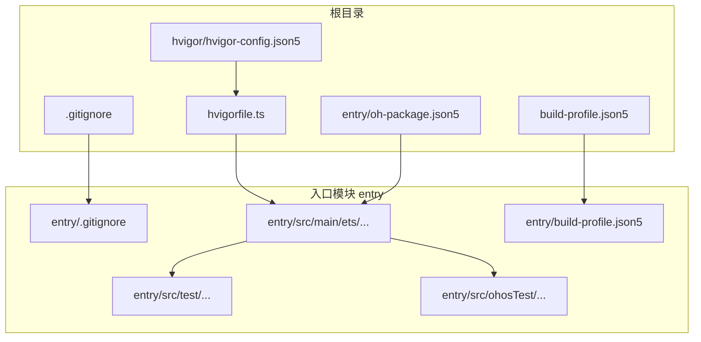
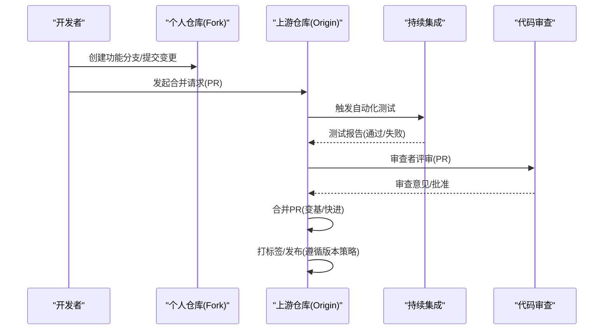
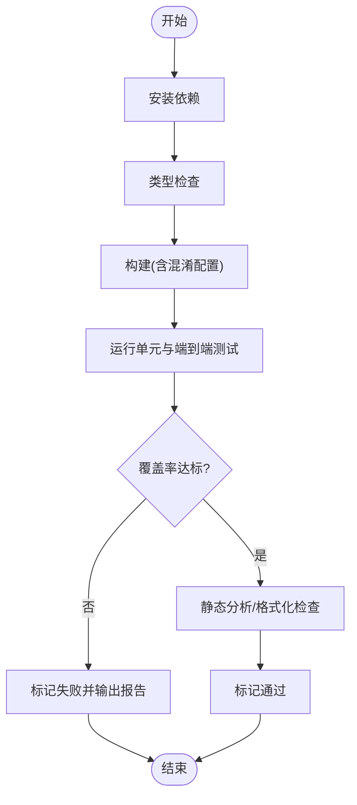
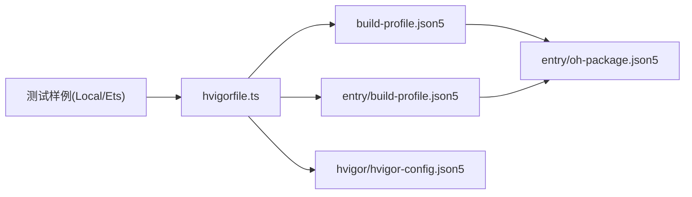

# 贡献流程

<cite>
**本文引用的文件**
- [.gitignore](file://.gitignore)
- [entry/.gitignore](file://entry/.gitignore)
- [build-profile.json5](file://build-profile.json5)
- [entry/build-profile.json5](file://entry/build-profile.json5)
- [hvigorfile.ts](file://hvigorfile.ts)
- [hvigor/hvigor-config.json5](file://hvigor/hvigor-config.json5)
- [entry/oh-package.json5](file://entry/oh-package.json5)
- [entry/src/test/List.test.ets](file://entry/src/test/List.test.ets)
- [entry/src/test/LocalUnit.test.ets](file://entry/src/test/LocalUnit.test.ets)
- [entry/src/ohosTest/ets/test/Ability.test.ets](file://entry/src/ohosTest/ets/test/Ability.test.ets)
- [entry/src/ohosTest/ets/test/List.test.ets](file://entry/src/ohosTest/ets/test/List.test.ets)
- [entry/src/main/ets/manager/transfer/IMPLEMENTATION_SUMMARY.md](file://entry/src/main/ets/manager/transfer/IMPLEMENTATION_SUMMARY.md)
- [entry/src/main/ets/manager/transfer/QUICK_REFERENCE.md](file://entry/src/main/ets/manager/transfer/QUICK_REFERENCE.md)
- [entry/src/main/ets/pages/TestClientPage.ets](file://entry/src/main/ets/pages/TestClientPage.ets)
</cite>

## 目录
1. [简介](#简介)
2. [项目结构](#项目结构)
3. [核心组件](#核心组件)
4. [架构总览](#架构总览)
5. [详细组件分析](#详细组件分析)
6. [依赖分析](#依赖分析)
7. [性能考虑](#性能考虑)
8. [故障排查指南](#故障排查指南)
9. [结论](#结论)
10. [附录](#附录)

## 简介
本文件面向贡献者，系统化梳理本项目的代码贡献流程与最佳实践，涵盖：
- Git 工作流与分支管理策略
- 功能分支创建、提交规范与合并请求流程
- 代码审查标准与检查要点（含自动化测试要求）
- 版本控制最佳实践（提交信息格式、标签与发布）
- Pull Request 模板与审查清单
- 持续集成与自动化测试配置与使用
- 常见贡献场景处理（缺陷修复、功能新增、文档改进）
- 发布周期与版本管理策略

## 项目结构
本仓库采用模块化组织，入口模块为 entry，核心业务位于 ETS 源码树中，并包含单元测试与端到端测试样例。构建与打包通过 Hvigor 驱动，测试框架采用 @ohos/hypium。

图表来源
- [.gitignore](file://.gitignore#L1-L11)
- [entry/.gitignore](file://entry/.gitignore#L1-L6)
- [build-profile.json5](file://build-profile.json5#L1-L51)
- [entry/build-profile.json5](file://entry/build-profile.json5#L1-L39)
- [hvigorfile.ts](file://hvigorfile.ts#L1-L7)
- [hvigor/hvigor-config.json5](file://hvigor/hvigor-config.json5#L1-L21)
- [entry/oh-package.json5](file://entry/oh-package.json5#L1-L13)

章节来源
- file://.gitignore#L1-L11
- file://entry/.gitignore#L1-L6
- file://build-profile.json5#L1-L51
- file://entry/build-profile.json5#L1-L39
- file://hvigorfile.ts#L1-L7
- file://hvigor/hvigor-config.json5#L1-L21
- file://entry/oh-package.json5#L1-L13

## 核心组件
- 构建与打包
  - Hvigor 作为构建系统，提供系统任务与插件扩展点；构建配置在根与模块级分别定义，支持 ArkTS 编译与原生 C++ 集成。
- 测试体系
  - 单元测试：基于 @ohos/hypium 的本地测试样例，提供测试套件生命周期钩子。
  - 端到端测试：能力测试样例，覆盖页面与能力场景。
  - 示例页面：TestClientPage 展示客户端初始化、任务提交与销毁流程，便于手工验证。
- 文档与实现
  - 文件传输模块文档：实现总结与快速参考，覆盖架构、API、配置与最佳实践。

章节来源
- file://hvigorfile.ts#L1-L7
- file://entry/build-profile.json5#L1-L39
- file://entry/src/test/LocalUnit.test.ets#L1-L33
- file://entry/src/ohosTest/ets/test/Ability.test.ets#L1-L29
- file://entry/src/main/ets/pages/TestClientPage.ets#L102-L151
- file://entry/src/main/ets/manager/transfer/IMPLEMENTATION_SUMMARY.md#L1-L320
- file://entry/src/main/ets/manager/transfer/QUICK_REFERENCE.md#L1-L248

## 架构总览
下图展示贡献流程中的关键交互：开发者在功能分支上迭代，提交变更并通过 PR 进行审查；CI 在 PR 合并前运行自动化测试；发布阶段依据版本策略打标签并产出制品。

## 详细组件分析

### Git 工作流与分支管理策略
- 分支策略
  - 主分支：保护分支，仅允许经审查的 PR 合并。
  - 功能分支：按功能或修复创建短命分支，命名建议采用前缀+简要描述，例如 feature/xxx、fix/xxx。
  - 预发布分支：临近发布时创建，用于集中修复与回归测试。
- 提交与合并
  - 提交前先同步主干，再进行 rebase 以保持线性历史。
  - 合并方式推荐使用 squash 或 rebase 以保证提交历史整洁；避免不必要的“Merge branch”提交。
- 标签与发布
  - 采用语义化版本（SemVer），在合并到主干后打标签并发布。
  - 标签名格式：vMAJOR.MINOR.PATCH，必要时追加预发布后缀与元数据。

章节来源
- file://.gitignore#L1-L11
- file://entry/.gitignore#L1-L6

### 提交规范
- 提交信息格式
  - 标题：简明扼要，首字母大写，不超过 50 字符；使用动词短语，体现变更意图。
  - 正文：说明动机与影响，必要时引用问题编号；限制每行宽度。
  - 页脚：关联 Issue/PR 编号、安全注意、破坏性变更说明等。
- 示例模板（标题/正文/页脚三段式）
  - 标题：feat(模块名)：新增某功能
  - 正文：描述背景、方案与影响范围
  - 页脚：Refs #123, BREAKING CHANGE: ...
- 提交粒度
  - 小而完整的变更优先；避免一次提交包含无关内容。
  - 若需回滚，尽量保持原子性。

章节来源
- file://entry/src/main/ets/manager/transfer/IMPLEMENTATION_SUMMARY.md#L1-L320
- file://entry/src/main/ets/manager/transfer/QUICK_REFERENCE.md#L1-L248

### 合并请求流程与审查清单
- PR 流程
  - 在发起 PR 前确保本地测试通过、文档更新、变更最小化。
  - PR 描述中明确变更目的、影响范围、测试方法与风险提示。
- 审查清单
  - 代码质量：命名规范、复杂度控制、注释与文档齐备。
  - 功能正确性：覆盖边界条件与异常路径；提供测试用例。
  - 性能与安全：避免阻塞操作、资源泄漏与敏感信息泄露。
  - 兼容性：破坏性变更需标注并提供迁移指引。
  - CI 通过：确保所有检查项（语法、类型、测试、格式化）通过。
- 审查反馈处理
  - 对每个评论逐条回复并更新代码；必要时补充测试或文档。
  - 合并前再次确认历史整洁与标签/版本策略一致。

章节来源
- file://entry/src/test/LocalUnit.test.ets#L1-L33
- file://entry/src/ohosTest/ets/test/Ability.test.ets#L1-L29
- file://entry/src/test/List.test.ets#L1-L5
- file://entry/src/ohosTest/ets/test/List.test.ets#L1-L5

### 自动化测试与持续集成
- 测试框架与用法
  - 单元测试：使用 @ohos/hypium 的 describe/it/expect 等 API，提供生命周期钩子。
  - 端到端测试：覆盖页面与能力场景，便于集成验证。
  - 示例页面：TestClientPage 提供客户端初始化、任务提交与销毁流程，便于手工验证与回归。
- 构建与执行
  - Hvigor 作为构建系统，系统任务不可修改，可通过插件扩展能力。
  - 构建配置区分 debug/release，支持混淆规则与外部原生构建参数。
- CI 建议
  - 触发条件：PR 与主干推送。
  - 步骤：安装依赖、类型检查、构建、运行全部测试、覆盖率统计、静态分析。
  - 结果：失败时阻断合并；通过后允许审查与合并。

图表来源
- [hvigorfile.ts](file://hvigorfile.ts#L1-L7)
- [hvigor/hvigor-config.json5](file://hvigor/hvigor-config.json5#L1-L21)
- [entry/build-profile.json5](file://entry/build-profile.json5#L1-L39)
- [entry/src/test/LocalUnit.test.ets](file://entry/src/test/LocalUnit.test.ets#L1-L33)
- [entry/src/ohosTest/ets/test/Ability.test.ets](file://entry/src/ohosTest/ets/test/Ability.test.ets#L1-L29)

章节来源
- file://hvigorfile.ts#L1-L7
- file://hvigor/hvigor-config.json5#L1-L21
- file://entry/build-profile.json5#L1-L39
- file://entry/src/test/LocalUnit.test.ets#L1-L33
- file://entry/src/ohosTest/ets/test/Ability.test.ets#L1-L29
- file://entry/src/test/List.test.ets#L1-L5
- file://entry/src/ohosTest/ets/test/List.test.ets#L1-L5
- file://entry/src/main/ets/pages/TestClientPage.ets#L102-L151

### 常见贡献场景处理
- 缺陷修复（Bug Fix）
  - 新建 fix/xxx 分支，提供最小可复现步骤与测试用例；在 PR 中说明问题背景与修复方案。
- 功能新增（Feature）
  - 新建 feature/xxx 分支，先设计文档与接口，再实现并在 PR 中附带设计说明与测试策略。
- 文档改进（Docs）
  - 更新相关 README、快速参考与实现总结；确保示例可运行、链接有效。
- 回归与兼容性
  - 修复或变更可能影响既有行为时，提供迁移指南与兼容策略；必要时引入渐进式变更。

章节来源
- file://entry/src/main/ets/manager/transfer/IMPLEMENTATION_SUMMARY.md#L1-L320
- file://entry/src/main/ets/manager/transfer/QUICK_REFERENCE.md#L1-L248

### 版本控制最佳实践
- 提交信息
  - 使用上述规范，确保可追溯性与可读性。
- 标签管理
  - 语义化版本打标签，与发布说明配套；避免重复或错乱标签。
- 发布流程
  - 合并后打标签并发布；若存在破坏性变更，提前在预发布分支验证并公告。

章节来源
- file://entry/oh-package.json5#L1-L13

### 发布周期与版本管理策略
- 发布节奏
  - 建议采用固定周期（如每两周）或按功能里程碑发布；预发布分支用于稳定与回归。
- 版本策略
  - 语义化版本：MAJOR.MINOR.PATCH；PATCH 用于热修复，MINOR 用于向后兼容的新功能，MAJOR 用于破坏性变更。
- 文档与公告
  - 发布说明需包含变更摘要、已知问题、迁移指南与致谢。

章节来源
- file://entry/oh-package.json5#L1-L13

## 依赖分析
- 构建与工具链
  - Hvigor：系统任务与插件扩展；模块级构建配置与混淆规则。
  - 构建选项：外部原生构建路径、ABI 过滤、编译器优化与混淆规则。
- 测试依赖
  - @ohos/hypium：测试框架；本地与端到端测试样例。
- 包管理
  - 模块包信息：名称、版本、依赖声明等。

图表来源
- [hvigorfile.ts](file://hvigorfile.ts#L1-L7)
- [build-profile.json5](file://build-profile.json5#L1-L51)
- [entry/build-profile.json5](file://entry/build-profile.json5#L1-L39)
- [hvigor/hvigor-config.json5](file://hvigor/hvigor-config.json5#L1-L21)
- [entry/oh-package.json5](file://entry/oh-package.json5#L1-L13)

章节来源
- file://hvigorfile.ts#L1-L7
- file://build-profile.json5#L1-L51
- file://entry/build-profile.json5#L1-L39
- file://hvigor/hvigor-config.json5#L1-L21
- file://entry/oh-package.json5#L1-L13

## 性能考虑
- 构建性能
  - 启用增量编译与并行编译；合理配置 ABI 过滤与混淆规则。
- 测试性能
  - 将耗时测试拆分为本地与端到端两类；利用测试套件生命周期钩子减少重复初始化。
- 传输模块性能
  - 分块传输与连接池复用；根据网络环境调整阈值与分块大小；提供进度与事件监听以提升可观测性。

章节来源
- file://hvigor/hvigor-config.json5#L1-L21
- file://entry/build-profile.json5#L1-L39
- file://entry/src/main/ets/manager/transfer/QUICK_REFERENCE.md#L1-L248

## 故障排查指南
- 构建失败
  - 检查构建配置与原生 CMake 路径；确认 ABI 过滤与编译器参数；查看 Hvigor 日志级别。
- 测试失败
  - 本地测试与端到端测试分别定位；核对测试套件生命周期钩子与断言；关注日志输出。
- 示例页面问题
  - 使用 TestClientPage 验证客户端初始化、任务提交与销毁流程；检查日志滚动与状态更新。

章节来源
- file://hvigor/hvigor-config.json5#L1-L21
- file://entry/src/test/LocalUnit.test.ets#L1-L33
- file://entry/src/ohosTest/ets/test/Ability.test.ets#L1-L29
- file://entry/src/main/ets/pages/TestClientPage.ets#L102-L151

## 结论
本贡献流程以清晰的分支策略、严格的提交规范与自动化测试为核心，结合 SemVer 的版本管理与发布策略，确保高质量交付与可维护性。建议团队在实践中持续优化 CI 步骤与文档，提升协作效率与一致性。

## 附录
- PR 模板（建议）
  - 标题：简述变更
  - 摘要：背景、目标、影响范围
  - 变更点：代码/文档/测试改动清单
  - 测试方法：如何验证（本地/端到端/示例页面）
  - 风险与回滚：潜在风险与回滚方案
  - 关联：Issue/PR/设计文档链接
- 审查清单（建议）
  - 代码质量：命名、注释、复杂度、异常处理
  - 功能正确性：边界与异常、测试覆盖
  - 性能与安全：阻塞、资源、敏感信息
  - 兼容性：破坏性变更与迁移
  - CI：全部检查项通过
- 文件传输模块参考
  - 实现总结与快速参考文档，包含 API、配置与最佳实践。

章节来源
- file://entry/src/main/ets/manager/transfer/IMPLEMENTATION_SUMMARY.md#L1-L320
- file://entry/src/main/ets/manager/transfer/QUICK_REFERENCE.md#L1-L248