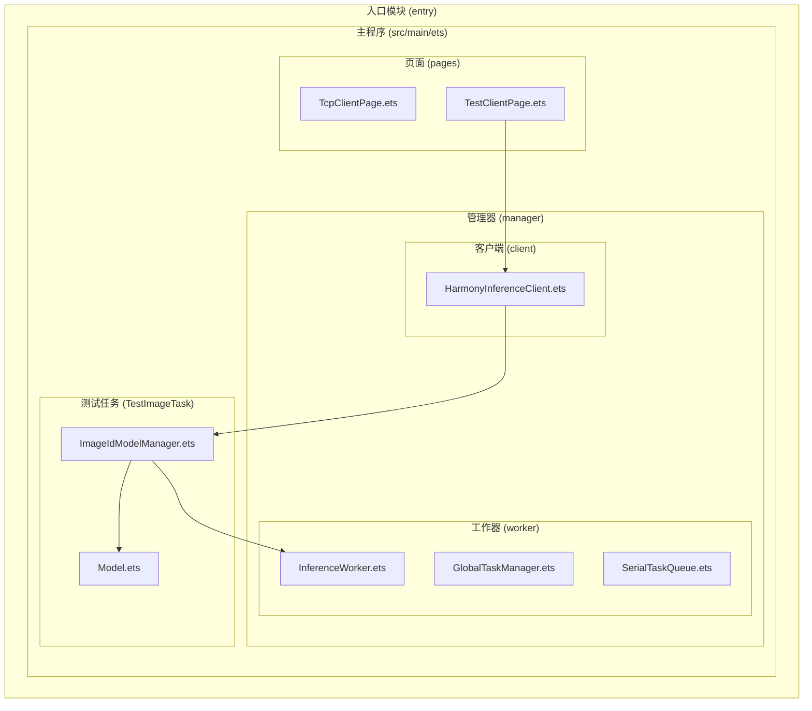
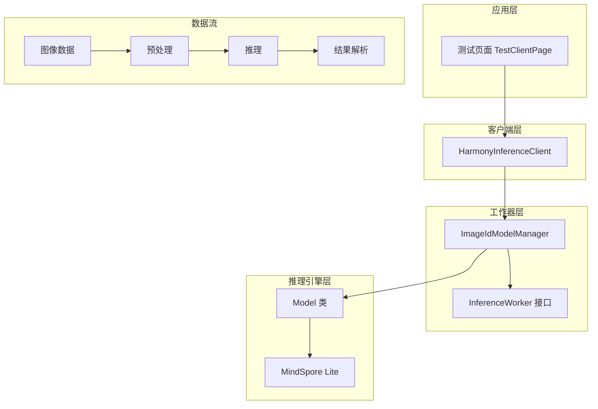
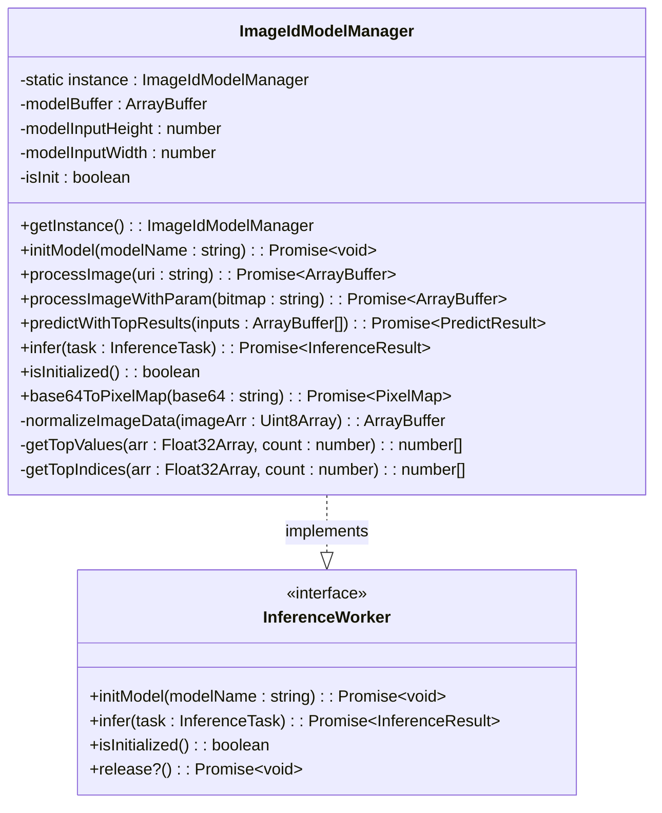
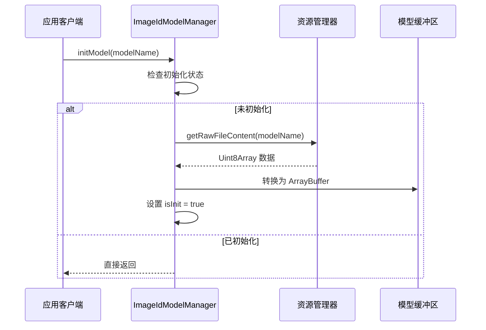
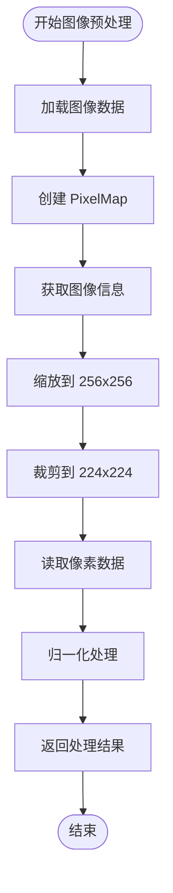
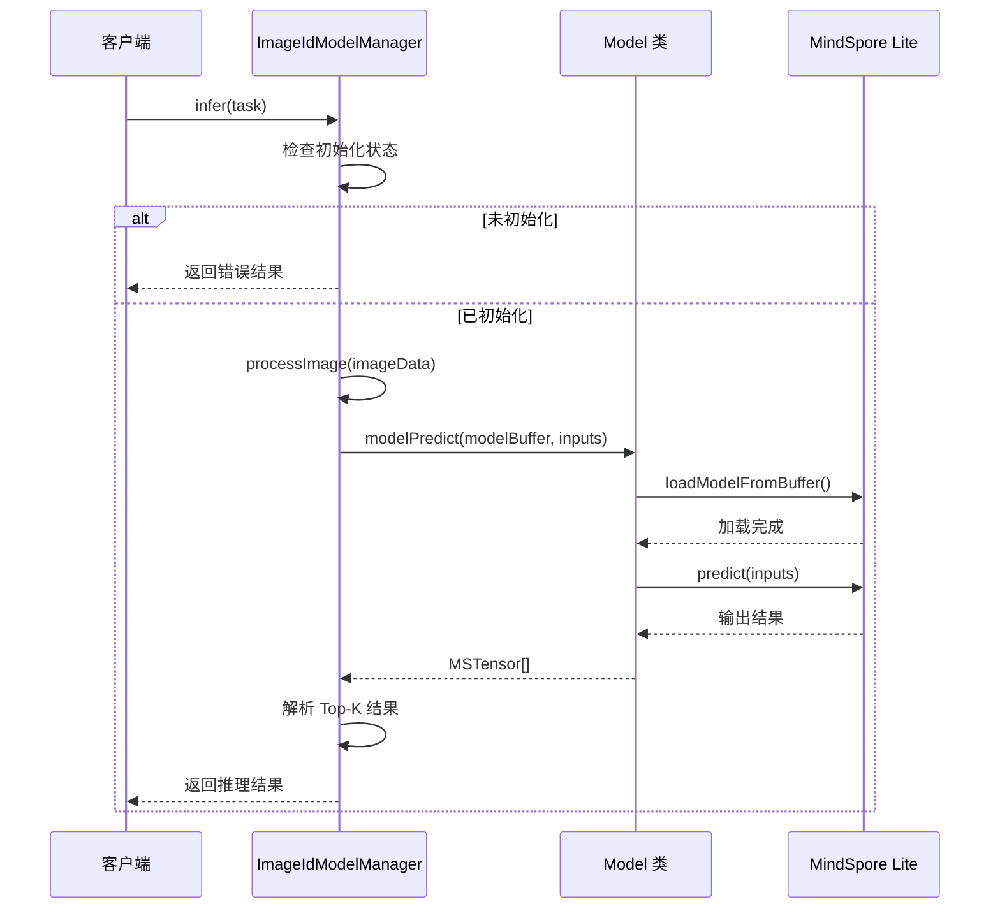
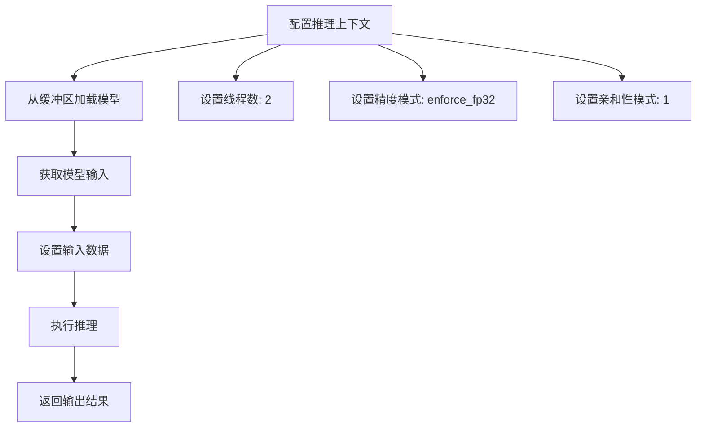
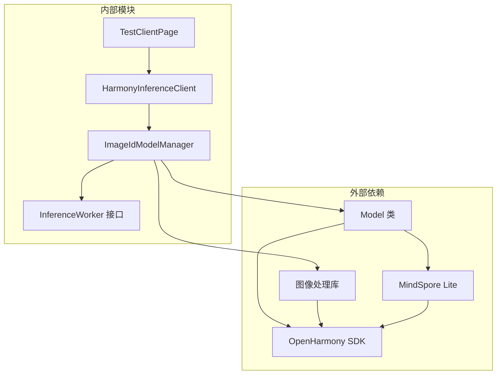
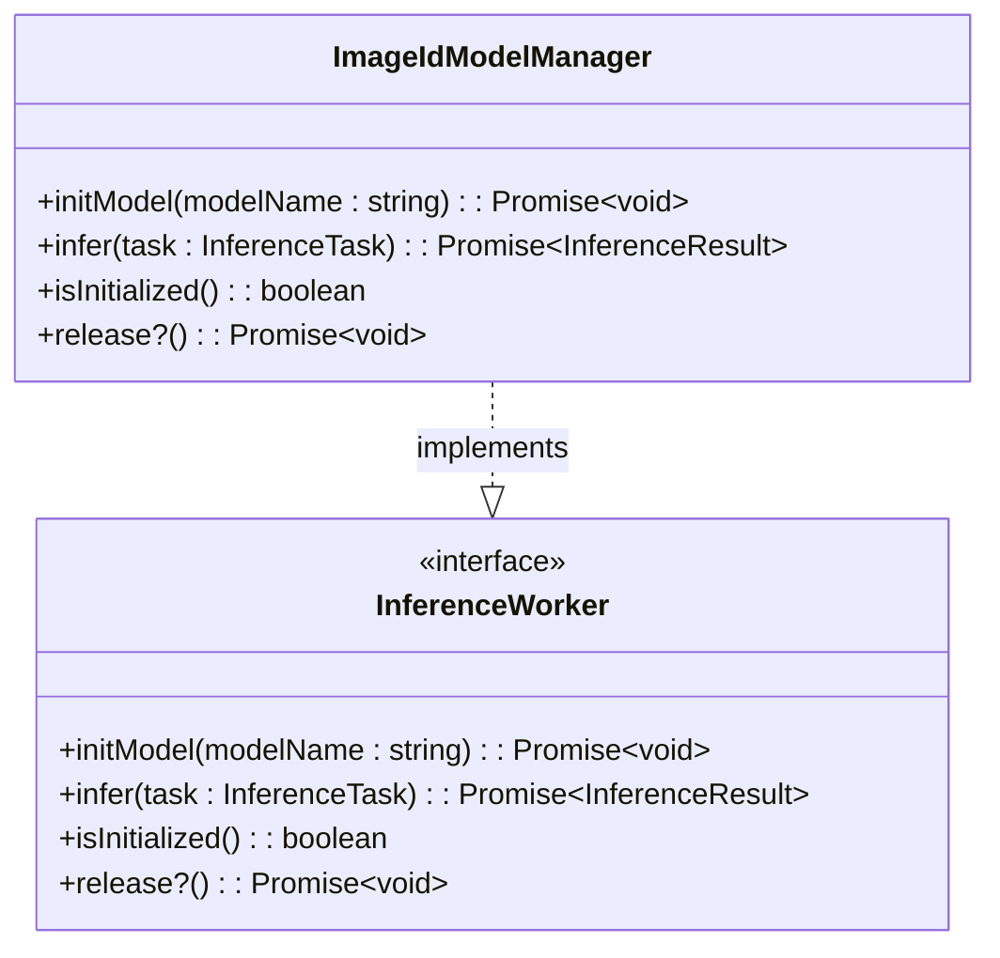

# 图像识别模型管理器

<cite>
**本文档引用的文件**
- [ImageIdModelManager.ets](file://entry/src/main/ets/TestImageTask/ImageIdModelManager.ets)
- [Model.ets](file://entry/src/main/ets/TestImageTask/Model.ets)
- [InferenceWorker.ets](file://entry/src/main/ets/manager/worker/InferenceWorker.ets)
- [HarmonyInferenceClient.ets](file://entry/src/main/ets/manager/HarmonyInferenceClient.ets)
- [TestClientPage.ets](file://entry/src/main/ets/pages/TestClientPage.ets)
</cite>

## 目录
1. [简介](#简介)
2. [项目结构](#项目结构)
3. [核心组件](#核心组件)
4. [架构概览](#架构概览)
5. [详细组件分析](#详细组件分析)
6. [依赖关系分析](#依赖关系分析)
7. [性能考虑](#性能考虑)
8. [故障排除指南](#故障排除指南)
9. [结论](#结论)
10. [附录](#附录)

## 简介

ImageIdModelManager 是一个基于 OpenHarmony 平台的图像识别模型管理器，实现了 InferenceWorker 接口，专门用于处理图像识别任务。该管理器集成了模型加载、图像预处理、推理执行和结果解析等功能，为上层应用提供了完整的图像识别解决方案。

该模块采用单例模式设计，确保在整个应用程序生命周期中只有一个模型管理器实例存在。它支持多种图像输入格式，包括文件路径、Base64 编码和直接的图像数据，并提供了灵活的预处理选项。

## 项目结构

该项目采用基于功能模块的组织方式，主要目录结构如下：



**图表来源**
- [ImageIdModelManager.ets](file://entry/src/main/ets/TestImageTask/ImageIdModelManager.ets#L1-L258)
- [InferenceWorker.ets](file://entry/src/main/ets/manager/worker/InferenceWorker.ets#L1-L90)
- [HarmonyInferenceClient.ets](file://entry/src/main/ets/manager/HarmonyInferenceClient.ets#L1-L357)

**章节来源**
- [ImageIdModelManager.ets](file://entry/src/main/ets/TestImageTask/ImageIdModelManager.ets#L1-L258)
- [InferenceWorker.ets](file://entry/src/main/ets/manager/worker/InferenceWorker.ets#L1-L90)

## 核心组件

### ImageIdModelManager 类

ImageIdModelManager 是整个图像识别系统的核心类，实现了 InferenceWorker 接口的所有方法。其主要特性包括：

- **单例模式**: 确保全局唯一实例
- **模型管理**: 负责模型文件的加载和缓存
- **图像预处理**: 提供多种图像处理和标准化功能
- **推理执行**: 调用底层推理引擎执行预测
- **结果解析**: 将推理输出转换为用户友好的格式

### Model 类

Model 类封装了具体的推理逻辑，使用 MindSpore Lite 引擎进行模型推理。其关键功能包括：

- **上下文配置**: 设置推理环境参数
- **模型加载**: 从内存缓冲区加载模型
- **输入设置**: 将预处理后的数据设置为模型输入
- **推理执行**: 执行模型预测并返回结果

### InferenceWorker 接口

InferenceWorker 定义了推理工作器的标准接口，确保不同类型的推理任务可以统一管理：

- **initModel**: 初始化模型
- **infer**: 执行推理任务
- **isInitialized**: 检查初始化状态
- **release**: 释放资源（可选）

**章节来源**
- [ImageIdModelManager.ets](file://entry/src/main/ets/TestImageTask/ImageIdModelManager.ets#L31-L258)
- [Model.ets](file://entry/src/main/ets/TestImageTask/Model.ets#L1-L42)
- [InferenceWorker.ets](file://entry/src/main/ets/manager/worker/InferenceWorker.ets#L75-L90)

## 架构概览

图像识别系统的整体架构采用分层设计，从上到下分为应用层、客户端层、工作器层和推理引擎层：



**图表来源**
- [TestClientPage.ets](file://entry/src/main/ets/pages/TestClientPage.ets#L1-L151)
- [HarmonyInferenceClient.ets](file://entry/src/main/ets/manager/HarmonyInferenceClient.ets#L52-L357)
- [ImageIdModelManager.ets](file://entry/src/main/ets/TestImageTask/ImageIdModelManager.ets#L31-L258)
- [Model.ets](file://entry/src/main/ets/TestImageTask/Model.ets#L1-L42)

## 详细组件分析

### ImageIdModelManager 类详细分析

#### 类结构和属性



**图表来源**
- [ImageIdModelManager.ets](file://entry/src/main/ets/TestImageTask/ImageIdModelManager.ets#L31-L258)
- [InferenceWorker.ets](file://entry/src/main/ets/manager/worker/InferenceWorker.ets#L75-L90)

#### 模型初始化流程



**图表来源**
- [ImageIdModelManager.ets](file://entry/src/main/ets/TestImageTask/ImageIdModelManager.ets#L45-L53)

#### 图像预处理流程



**图表来源**
- [ImageIdModelManager.ets](file://entry/src/main/ets/TestImageTask/ImageIdModelManager.ets#L55-L95)

#### 推理执行流程



**图表来源**
- [ImageIdModelManager.ets](file://entry/src/main/ets/TestImageTask/ImageIdModelManager.ets#L205-L237)
- [Model.ets](file://entry/src/main/ets/TestImageTask/Model.ets#L5-L39)

### Model 类详细分析

#### 推理上下文配置

Model 类使用 MindSpore Lite 引擎进行推理，其上下文配置具有以下特点：

- **目标设备**: CPU
- **线程配置**: 2个线程
- **精度模式**: 强制 FP32
- **亲和性模式**: 线程亲和性启用

#### 模型加载和推理过程



**图表来源**
- [Model.ets](file://entry/src/main/ets/TestImageTask/Model.ets#L8-L39)

**章节来源**
- [ImageIdModelManager.ets](file://entry/src/main/ets/TestImageTask/ImageIdModelManager.ets#L31-L258)
- [Model.ets](file://entry/src/main/ets/TestImageTask/Model.ets#L1-L42)

## 依赖关系分析

### 组件依赖关系



**图表来源**
- [ImageIdModelManager.ets](file://entry/src/main/ets/TestImageTask/ImageIdModelManager.ets#L1-L8)
- [Model.ets](file://entry/src/main/ets/TestImageTask/Model.ets#L1-L2)
- [HarmonyInferenceClient.ets](file://entry/src/main/ets/manager/HarmonyInferenceClient.ets#L1-L13)
- [TestClientPage.ets](file://entry/src/main/ets/pages/TestClientPage.ets#L1-L6)

### 接口实现关系

ImageIdModelManager 完全实现了 InferenceWorker 接口的所有方法，确保了与其他推理工作器的一致性：



**图表来源**
- [InferenceWorker.ets](file://entry/src/main/ets/manager/worker/InferenceWorker.ets#L75-L90)
- [ImageIdModelManager.ets](file://entry/src/main/ets/TestImageTask/ImageIdModelManager.ets#L31-L258)

**章节来源**
- [InferenceWorker.ets](file://entry/src/main/ets/manager/worker/InferenceWorker.ets#L1-L90)
- [ImageIdModelManager.ets](file://entry/src/main/ets/TestImageTask/ImageIdModelManager.ets#L31-L258)

## 性能考虑

### 内存管理优化

1. **模型缓冲区复用**: 模型加载后缓存在内存中，避免重复加载
2. **像素数据处理**: 使用 TypedArray 进行高效的数值计算
3. **图像缓冲区管理**: 合理分配和释放图像处理缓冲区

### 推理性能优化

1. **线程配置**: 设置合适的线程数量以平衡性能和功耗
2. **精度模式**: 使用 FP32 确保推理精度
3. **输入数据格式**: 预先进行数据标准化减少推理时间

### 图像处理优化

1. **缩放策略**: 使用固定比例缩放保持图像质量
2. **裁剪优化**: 预设裁剪参数减少计算开销
3. **数据类型选择**: 使用 Float32Array 进行高效的数值运算

## 故障排除指南

### 常见问题及解决方案

#### 模型加载失败

**问题症状**:
- 初始化时抛出异常
- 推理结果为空
- 控制台显示模型加载错误

**可能原因**:
- 模型文件路径错误
- 模型文件损坏
- 权限不足无法访问模型文件

**解决方案**:
1. 验证模型文件路径正确性
2. 检查模型文件完整性
3. 确认应用具有读取权限

#### 推理错误

**问题症状**:
- 推理过程中抛出异常
- 返回结果格式不正确
- 性能异常低下

**可能原因**:
- 输入数据格式不正确
- 模型版本不兼容
- 内存不足

**解决方案**:
1. 验证输入数据格式符合要求
2. 检查模型版本兼容性
3. 监控内存使用情况

#### 内存泄漏

**问题症状**:
- 应用内存持续增长
- 推理多次后出现内存警告
- 系统响应变慢

**可能原因**:
- 图像缓冲区未正确释放
- 回调函数持有引用
- 大量对象未及时销毁

**解决方案**:
1. 确保所有图像缓冲区正确释放
2. 清理事件监听器和定时器
3. 及时清理大型对象引用

### 调试技巧

1. **启用详细日志**: 利用控制台输出调试信息
2. **监控内存使用**: 定期检查内存占用情况
3. **性能分析**: 使用性能分析工具识别瓶颈
4. **单元测试**: 编写测试用例验证功能正确性

**章节来源**
- [ImageIdModelManager.ets](file://entry/src/main/ets/TestImageTask/ImageIdModelManager.ets#L80-L95)
- [Model.ets](file://entry/src/main/ets/TestImageTask/Model.ets#L36-L39)

## 结论

ImageIdModelManager 是一个功能完整、设计合理的图像识别模型管理器，具有以下优势：

1. **架构清晰**: 采用分层设计，职责分离明确
2. **接口统一**: 实现标准 InferenceWorker 接口，便于扩展
3. **性能优化**: 采用多种优化策略提升推理效率
4. **错误处理**: 完善的错误处理机制确保系统稳定性
5. **易于使用**: 提供简单易用的 API 接口

该模块为 OpenHarmony 平台上的图像识别应用提供了坚实的基础，开发者可以在此基础上快速构建各种图像识别功能。

## 附录

### 使用示例

#### 基本使用流程

```typescript
// 1. 获取单例实例
const modelManager = ImageIdModelManager.getInstance();

// 2. 初始化模型
await modelManager.initModel('mobilenetv2.ms');

// 3. 处理图像
const imageData = await modelManager.processImage(imageUri);

// 4. 执行推理
const result = await modelManager.predictWithTopResults([imageData]);

// 5. 获取结果
console.log('Top-5 结果:', result.maxArray);
console.log('Top-5 索引:', result.maxIndexArray);
```

#### 高级配置选项

- **模型输入尺寸**: 可通过修改 `modelInputHeight` 和 `modelInputWidth` 属性调整
- **预处理参数**: 可根据具体需求调整缩放和裁剪参数
- **推理上下文**: 可配置线程数量、精度模式等参数

### 最佳实践

1. **资源管理**: 确保正确释放图像和模型资源
2. **错误处理**: 始终检查初始化状态和操作结果
3. **性能监控**: 定期监控内存使用和推理时间
4. **测试覆盖**: 编写充分的单元测试和集成测试
5. **文档维护**: 保持代码注释和文档的及时更新