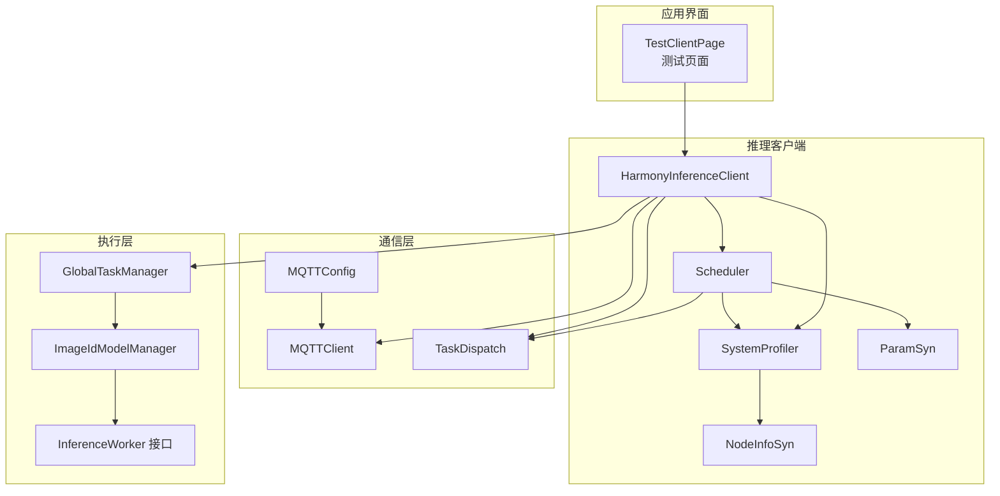
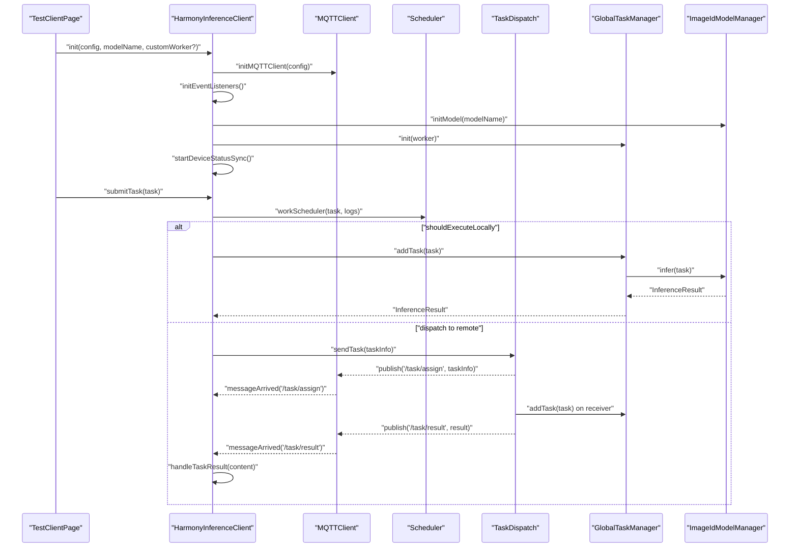
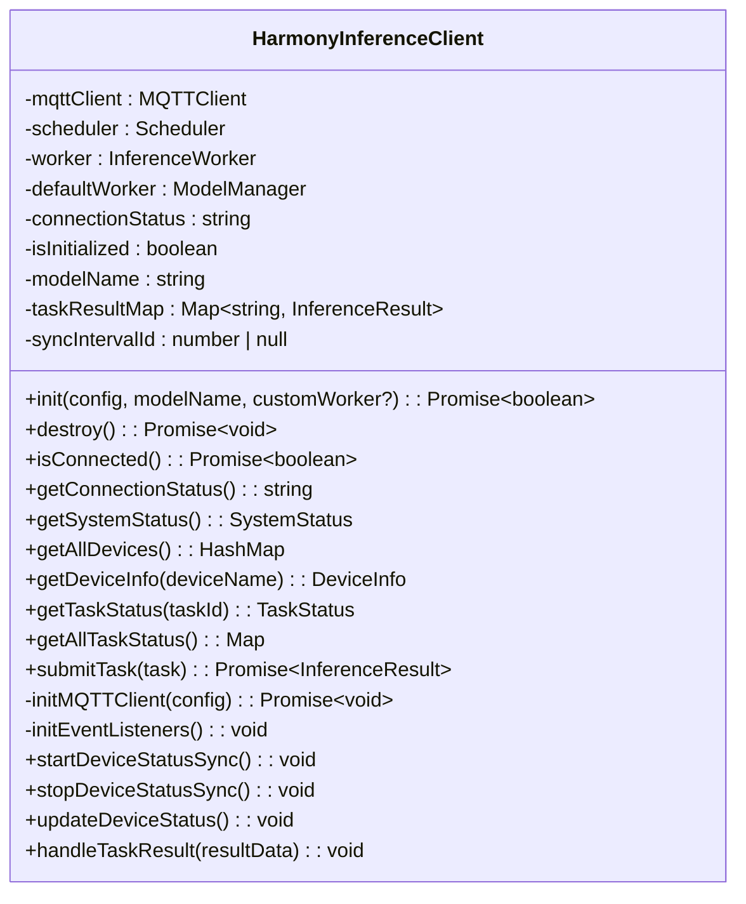
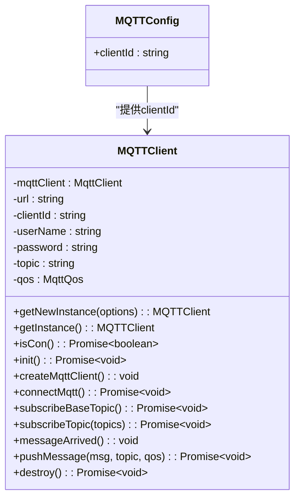
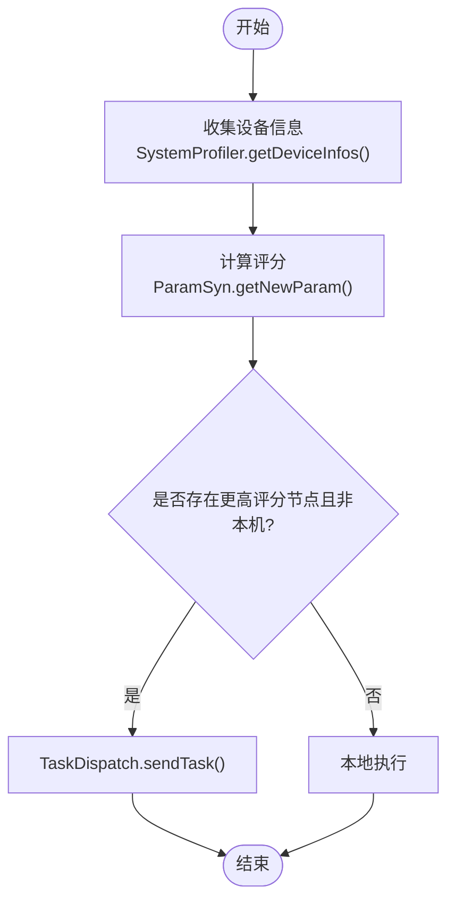
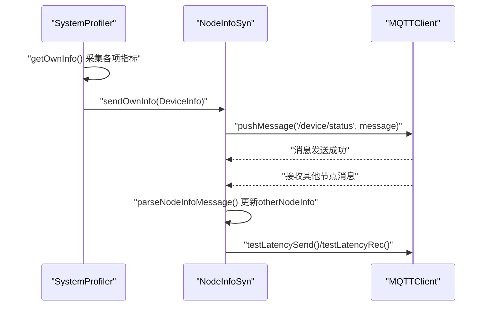
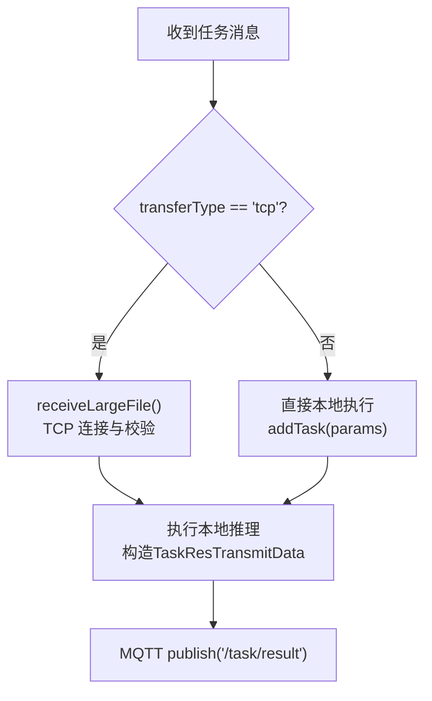
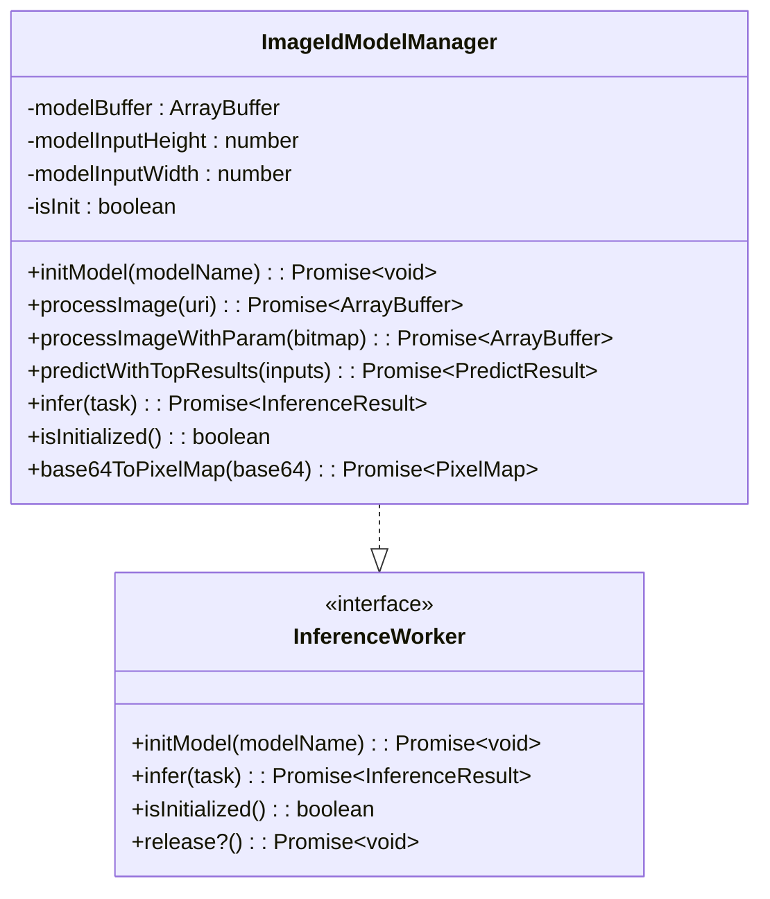
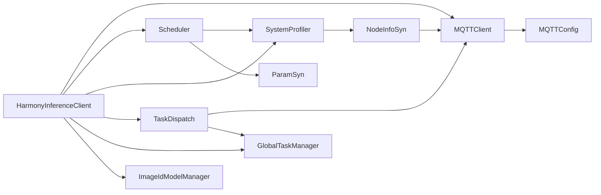

# 推理客户端

<cite>
**本文引用的文件**
- [HarmonyInferenceClient.ets](file://entry/src/main/ets/manager/HarmonyInferenceClient.ets)
- [MQTTClient.ets](file://entry/src/main/ets/manager/broker/MQTTClient.ets)
- [MQTTConfig.ets](file://entry/src/main/ets/manager/broker/MQTTConfig.ets)
- [Scheduler.ets](file://entry/src/main/ets/manager/scheduler/Scheduler.ets)
- [SystemProfiler.ets](file://entry/src/main/ets/manager/monitor/SystemProfiler.ets)
- [NodeInfoSyn.ets](file://entry/src/main/ets/manager/broker/monitor/NodeInfoSyn.ets)
- [ParamSyn.ets](file://entry/src/main/ets/manager/broker/paramOpt/ParamSyn.ets)
- [TaskDispatch.ets](file://entry/src/main/ets/manager/broker/task/TaskDispatch.ets)
- [InferenceWorker.ets](file://entry/src/main/ets/manager/worker/InferenceWorker.ets)
- [GlobalTaskManager.ets](file://entry/src/main/ets/manager/worker/GlobalTaskManager.ets)
- [ImageIdModelManager.ets](file://entry/src/main/ets/TestImageTask/ImageIdModelManager.ets)
- [TestClientPage.ets](file://entry/src/main/ets/pages/TestClientPage.ets)
</cite>

## 更新摘要
**所做更改**
- 更新日志标准化改进部分，反映统一的 '[HarmonyInference] [Client]' 前缀格式
- 新增错误处理增强和上下文信息提供能力说明
- 更新设备状态同步机制部分，反映新增的定时器管理和资源清理功能
- 新增定时器泄漏防护机制的详细说明
- 更新 destroy() 方法的资源清理流程
- 增强故障排查指南中关于定时器管理的内容

## 目录
1. [简介](#简介)
2. [项目结构](#项目结构)
3. [核心组件](#核心组件)
4. [架构总览](#架构总览)
5. [详细组件分析](#详细组件分析)
6. [依赖关系分析](#依赖关系分析)
7. [性能考量](#性能考量)
8. [故障排查指南](#故障排查指南)
9. [结论](#结论)
10. [附录](#附录)

## 简介
本文件为 HarmonyInferenceClient 推理客户端的详细 API 文档，面向初学者与资深开发者，覆盖初始化配置、任务提交、连接管理、系统状态与任务状态等关键能力。文档基于真实代码库进行分析，包含来自实际代码的示例路径，解释与 Scheduler、MQTTClient、ModelManager 的关系，并提供常见问题的诊断与修复建议。

**更新** 本次更新重点关注日志标准化改进，所有模块采用统一的 '[HarmonyInference] [模块名]' 前缀格式，增强了错误处理和上下文信息提供能力，同时改进了设备状态同步机制，包括定时器管理、资源清理和泄漏防护等关键功能。

## 项目结构
该模块位于应用入口的 ETS 层，围绕"推理客户端"为中心，向上对接 UI 页面，向下集成 MQTT 通信、任务调度、系统状态采集与模型推理 Worker。关键目录与文件如下：
- 推理客户端：HarmonyInferenceClient.ets
- 通信层：MQTTClient.ets、MQTTConfig.ets、TaskDispatch.ets、NodeInfoSyn.ets、ParamSyn.ets
- 调度层：Scheduler.ets
- 监控与系统状态：SystemProfiler.ets
- 推理执行：InferenceWorker.ets、GlobalTaskManager.ets、ImageIdModelManager.ets
- 示例页面：TestClientPage.ets

**图表来源**
- [HarmonyInferenceClient.ets:52-457](file://entry/src/main/ets/manager/HarmonyInferenceClient.ets#L52-L457)
- [Scheduler.ets:14-530](file://entry/src/main/ets/manager/scheduler/Scheduler.ets#L14-L530)
- [SystemProfiler.ets:43-120](file://entry/src/main/ets/manager/monitor/SystemProfiler.ets#L43-L120)
- [NodeInfoSyn.ets:40-173](file://entry/src/main/ets/manager/broker/monitor/NodeInfoSyn.ets#L40-L173)
- [ParamSyn.ets:13-40](file://entry/src/main/ets/manager/broker/paramOpt/ParamSyn.ets#L13-L40)
- [MQTTClient.ets:24-223](file://entry/src/main/ets/manager/broker/MQTTClient.ets#L24-L223)
- [MQTTConfig.ets:1-7](file://entry/src/main/ets/manager/broker/MQTTConfig.ets#L1-L7)
- [TaskDispatch.ets:98-324](file://entry/src/main/ets/manager/broker/task/TaskDispatch.ets#L98-L324)
- [GlobalTaskManager.ets:4-27](file://entry/src/main/ets/manager/worker/GlobalTaskManager.ets#L4-L27)
- [InferenceWorker.ets:1-127](file://entry/src/main/ets/manager/worker/InferenceWorker.ets#L1-L127)
- [ImageIdModelManager.ets:31-257](file://entry/src/main/ets/TestImageTask/ImageIdModelManager.ets#L31-L257)
- [TestClientPage.ets:1-196](file://entry/src/main/ets/pages/TestClientPage.ets#L1-L196)

**章节来源**
- [HarmonyInferenceClient.ets:1-457](file://entry/src/main/ets/manager/HarmonyInferenceClient.ets#L1-L457)
- [TestClientPage.ets:1-196](file://entry/src/main/ets/pages/TestClientPage.ets#L1-L196)

## 核心组件
- HarmonyInferenceClient：推理客户端主入口，负责初始化、连接管理、任务提交、系统状态查询与任务状态跟踪。
- MQTTClient：MQTT 异步客户端，负责连接、订阅、发布与事件转发。
- Scheduler：任务调度器，基于系统状态与参数权重选择最优节点执行任务。
- SystemProfiler：系统状态采集器，聚合 CPU、内存、存储、电量与网络延迟。
- NodeInfoSyn：节点信息同步与延迟测试。
- ParamSyn：参数同步，提供调度评分权重。
- TaskDispatch：任务分发与结果回传，支持小文件直接传输与大文件 TCP 传输。
- InferenceWorker：推理执行接口，定义模型初始化、推理执行与释放资源。
- GlobalTaskManager：全局任务队列管理，统一调度本地推理任务。
- ImageIdModelManager：图像识别模型管理与推理实现。
- TestClientPage：演示页面，展示初始化、连接检查、系统状态查询与任务提交流程。

**章节来源**
- [HarmonyInferenceClient.ets:52-457](file://entry/src/main/ets/manager/HarmonyInferenceClient.ets#L52-L457)
- [MQTTClient.ets:24-223](file://entry/src/main/ets/manager/broker/MQTTClient.ets#L24-L223)
- [Scheduler.ets:14-530](file://entry/src/main/ets/manager/scheduler/Scheduler.ets#L14-L530)
- [SystemProfiler.ets:43-120](file://entry/src/main/ets/manager/monitor/SystemProfiler.ets#L43-L120)
- [NodeInfoSyn.ets:40-173](file://entry/src/main/ets/manager/broker/monitor/NodeInfoSyn.ets#L40-L173)
- [ParamSyn.ets:13-40](file://entry/src/main/ets/manager/broker/paramOpt/ParamSyn.ets#L13-L40)
- [TaskDispatch.ets:98-324](file://entry/src/main/ets/manager/broker/task/TaskDispatch.ets#L98-L324)
- [InferenceWorker.ets:1-127](file://entry/src/main/ets/manager/worker/InferenceWorker.ets#L1-L127)
- [GlobalTaskManager.ets:4-27](file://entry/src/main/ets/manager/worker/GlobalTaskManager.ets#L4-L27)
- [ImageIdModelManager.ets:31-257](file://entry/src/main/ets/TestImageTask/ImageIdModelManager.ets#L31-L257)
- [TestClientPage.ets:1-196](file://entry/src/main/ets/pages/TestClientPage.ets#L1-L196)

## 架构总览
HarmonyInferenceClient 作为协调者，串联 MQTT 通信、任务调度、系统状态与推理执行。其核心交互流程如下：

**图表来源**
- [HarmonyInferenceClient.ets:163-457](file://entry/src/main/ets/manager/HarmonyInferenceClient.ets#L163-L457)
- [MQTTClient.ets:68-223](file://entry/src/main/ets/manager/broker/MQTTClient.ets#L68-L223)
- [Scheduler.ets:30-530](file://entry/src/main/ets/manager/scheduler/Scheduler.ets#L30-L530)
- [TaskDispatch.ets:107-324](file://entry/src/main/ets/manager/broker/task/TaskDispatch.ets#L107-L324)
- [GlobalTaskManager.ets:8-21](file://entry/src/main/ets/manager/worker/GlobalTaskManager.ets#L8-L21)
- [ImageIdModelManager.ets:205-237](file://entry/src/main/ets/TestImageTask/ImageIdModelManager.ets#L205-L237)

## 详细组件分析

### HarmonyInferenceClient 推理客户端
- 单例模式：getInstance 提供全局唯一实例。
- 初始化流程：设置 MQTT 客户端、事件监听器、模型初始化、全局任务队列初始化、设备状态同步启动。
- 连接管理：定时检查 MQTT 连接状态，维护 connectionStatus。
- 系统状态：通过 SystemProfiler 获取 own/other/all 设备信息。
- 任务提交：委托 Scheduler 决策本地或远程执行；本地通过 GlobalTaskManager 加入队列；远程通过 MQTT 事件等待结果。
- 任务状态：维护 Map 记录任务状态与结果，支持查询与遍历。
- **新增** 定时器管理：通过 syncIntervalId 成员变量跟踪设备状态同步定时器，防止定时器泄漏。
- **新增** 日志标准化：所有操作均采用统一的 `[HarmonyInference] [Client]` 前缀格式，增强错误处理和上下文信息提供能力。

**图表来源**
- [HarmonyInferenceClient.ets:52-457](file://entry/src/main/ets/manager/HarmonyInferenceClient.ets#L52-L457)

**章节来源**
- [HarmonyInferenceClient.ets:52-457](file://entry/src/main/ets/manager/HarmonyInferenceClient.ets#L52-L457)

### MQTTConfig 与 MQTTClient
- MQTTConfig：提供全局 MQTTOption，初始化后同步 clientId。
- MQTTClient：异步 MQTT 客户端，负责连接、订阅多个主题、消息到达事件转发、发布消息与销毁。

**图表来源**
- [MQTTConfig.ets:1-7](file://entry/src/main/ets/manager/broker/MQTTConfig.ets#L1-L7)
- [MQTTClient.ets:24-223](file://entry/src/main/ets/manager/broker/MQTTClient.ets#L24-L223)

**章节来源**
- [MQTTConfig.ets:1-7](file://entry/src/main/ets/manager/broker/MQTTConfig.ets#L1-L7)
- [MQTTClient.ets:24-223](file://entry/src/main/ets/manager/broker/MQTTClient.ets#L24-L223)

### Scheduler 任务调度器
- 依据 SystemProfiler 的设备信息与 ParamSyn 的权重参数计算节点评分，选择最优节点。
- 若最优节点非本机，则通过 TaskDispatch 发送到目标设备；若为本机则本地执行。

**图表来源**
- [Scheduler.ets:30-530](file://entry/src/main/ets/manager/scheduler/Scheduler.ets#L30-L530)
- [SystemProfiler.ets:43-120](file://entry/src/main/ets/manager/monitor/SystemProfiler.ets#L43-L120)
- [ParamSyn.ets:13-40](file://entry/src/main/ets/manager/broker/paramOpt/ParamSyn.ets#L13-L40)
- [TaskDispatch.ets:107-126](file://entry/src/main/ets/manager/broker/task/TaskDispatch.ets#L107-L126)

**章节来源**
- [Scheduler.ets:14-530](file://entry/src/main/ets/manager/scheduler/Scheduler.ets#L14-L530)

### SystemProfiler 与 NodeInfoSyn
- SystemProfiler：采集 CPU、内存、存储、电量、延迟，形成 DeviceInfo 并通过 NodeInfoSyn 发布到 /device/status。
- NodeInfoSyn：解析其他节点上报的设备信息，维护 otherNodeInfo；支持延迟测试消息的发送与接收。

**图表来源**
- [SystemProfiler.ets:43-120](file://entry/src/main/ets/manager/monitor/SystemProfiler.ets#L43-L120)
- [NodeInfoSyn.ets:40-173](file://entry/src/main/ets/manager/broker/monitor/NodeInfoSyn.ets#L40-L173)
- [MQTTClient.ets:148-182](file://entry/src/main/ets/manager/broker/MQTTClient.ets#L148-L182)

**章节来源**
- [SystemProfiler.ets:10-120](file://entry/src/main/ets/manager/monitor/SystemProfiler.ets#L10-L120)
- [NodeInfoSyn.ets:40-173](file://entry/src/main/ets/manager/broker/monitor/NodeInfoSyn.ets#L40-L173)

### TaskDispatch 任务分发与结果回传
- 小文件：直接通过 MQTT 发布到 /task/assign。
- 大文件：通过 TCPTransferProtocol（协议文件存在但逻辑为 TODO）实现，先发布任务通知，再由接收端主动连接。
- 结果回传：通过 /task/result 主题回传，HarmonyInferenceClient 监听并处理。

**图表来源**
- [TaskDispatch.ets:187-324](file://entry/src/main/ets/manager/broker/task/TaskDispatch.ets#L187-L324)
- [MQTTClient.ets:190-203](file://entry/src/main/ets/manager/broker/MQTTClient.ets#L190-L203)

**章节来源**
- [TaskDispatch.ets:98-324](file://entry/src/main/ets/manager/broker/task/TaskDispatch.ets#L98-L324)

### InferenceWorker 与 ImageIdModelManager
- InferenceWorker：定义 initModel、infer、isInitialized、release 等接口。
- ImageIdModelManager：实现 InferenceWorker，负责图像预处理、模型推理与 Top-K 结果提取。

**图表来源**
- [InferenceWorker.ets:75-127](file://entry/src/main/ets/manager/worker/InferenceWorker.ets#L75-L127)
- [ImageIdModelManager.ets:31-257](file://entry/src/main/ets/TestImageTask/ImageIdModelManager.ets#L31-L257)

**章节来源**
- [InferenceWorker.ets:1-127](file://entry/src/main/ets/manager/worker/InferenceWorker.ets#L1-L127)
- [ImageIdModelManager.ets:31-257](file://entry/src/main/ets/TestImageTask/ImageIdModelManager.ets#L31-L257)

### GlobalTaskManager 与 SerialTaskQueue
- GlobalTaskManager：全局任务队列初始化与获取，确保单例与统一调度。
- SerialTaskQueue：序列化任务队列，按顺序执行推理任务。

**章节来源**
- [GlobalTaskManager.ets:4-27](file://entry/src/main/ets/manager/worker/GlobalTaskManager.ets#L4-L27)

### 推理客户端 API 规范与使用模式

- 初始化配置
  - MQTTConfig：包含 url、clientId、userName、password、topic、qos 等字段。
  - 初始化：调用 init(config, modelName, customWorker?)，内部完成 MQTT 初始化、事件监听、模型初始化、全局队列初始化与设备状态同步。
  - 参考示例路径：[TestClientPage 初始化:54-61](file://entry/src/main/ets/pages/TestClientPage.ets#L54-L61)

- 连接管理
  - isConnected：检查 MQTT 连接状态。
  - getConnectionStatus：获取连接状态字符串。
  - 参考示例路径：[TestClientPage 连接检查:63-69](file://entry/src/main/ets/pages/TestClientPage.ets#L63-L69)

- 系统状态 SystemStatus
  - 字段：ownDevice、otherDevices、allDevices，均返回 HashMap<string, DeviceInfo>。
  - DeviceInfo 字段：deviceName、batteryLevel、memoryUsage、cpuUsage、storageFree、latency。
  - 参考示例路径：[HarmonyInferenceClient 系统状态:273-284](file://entry/src/main/ets/manager/HarmonyInferenceClient.ets#L273-L284)

- 任务状态 TaskStatus
  - 字段：taskId、status（'pending' | 'running' | 'completed' | 'failed'）、result、error。
  - 参考示例路径：[HarmonyInferenceClient 任务状态:42-48](file://entry/src/main/ets/manager/HarmonyInferenceClient.ets#L42-L48)

- 任务提交与执行
  - submitTask(task)：提交 InferenceTask，返回 InferenceResult。
  - 本地执行：通过 GlobalTaskManager 队列执行。
  - 远程执行：通过 TaskDispatch 发送到目标设备，等待 /task/result 回传。
  - 参考示例路径：[TestClientPage 提交任务:94-110](file://entry/src/main/ets/pages/TestClientPage.ets#L94-L110)

- **新增** 设备状态同步管理
  - startDeviceStatusSync()：启动设备状态同步定时器，每10秒更新一次系统状态。
  - stopDeviceStatusSync()：停止设备状态同步定时器，清理定时器资源。
  - destroy()：销毁客户端时自动停止设备状态同步，防止定时器泄漏。
  - syncIntervalId：定时器ID成员变量，用于跟踪和管理定时器生命周期。

- **新增** 资源清理
  - destroy()：关闭 MQTT、释放 Worker、移除事件监听、停止设备状态同步。
  - 参考示例路径：[TestClientPage 销毁客户端:118-125](file://entry/src/main/ets/pages/TestClientPage.ets#L118-L125)

- **新增** 日志标准化改进
  - 统一前缀格式：所有模块采用 `[HarmonyInference] [模块名]` 前缀格式。
  - 增强错误处理：提供详细的错误信息和上下文。
  - 上下文信息：包含任务ID、设备名称、操作类型等关键信息。
  - 参考示例路径：[HarmonyInferenceClient 日志:100-103](file://entry/src/main/ets/manager/HarmonyInferenceClient.ets#L100-L103)

**章节来源**
- [HarmonyInferenceClient.ets:163-457](file://entry/src/main/ets/manager/HarmonyInferenceClient.ets#L163-L457)
- [TestClientPage.ets:54-125](file://entry/src/main/ets/pages/TestClientPage.ets#L54-L125)

## 依赖关系分析
- HarmonyInferenceClient 依赖 MQTTClient、Scheduler、SystemProfiler、NodeInfoSyn、ParamSyn、TaskDispatch、GlobalTaskManager、InferenceWorker。
- Scheduler 依赖 SystemProfiler、ParamSyn、TaskDispatch。
- SystemProfiler 依赖 NodeInfoSyn、MQTTOption。
- TaskDispatch 依赖 MQTTClient、GlobalTaskManager、NetworkUtils、FileUtils、TCPTransferProtocol。
- ImageIdModelManager 实现 InferenceWorker。

**图表来源**
- [HarmonyInferenceClient.ets:1-14](file://entry/src/main/ets/manager/HarmonyInferenceClient.ets#L1-L14)
- [Scheduler.ets:1-8](file://entry/src/main/ets/manager/scheduler/Scheduler.ets#L1-L8)
- [SystemProfiler.ets:1-9](file://entry/src/main/ets/manager/monitor/SystemProfiler.ets#L1-L9)
- [NodeInfoSyn.ets:1-9](file://entry/src/main/ets/manager/broker/monitor/NodeInfoSyn.ets#L1-L9)
- [ParamSyn.ets:1-7](file://entry/src/main/ets/manager/broker/paramOpt/ParamSyn.ets#L1-L7)
- [TaskDispatch.ets:1-10](file://entry/src/main/ets/manager/broker/task/TaskDispatch.ets#L1-L10)
- [GlobalTaskManager.ets:1-3](file://entry/src/main/ets/manager/worker/GlobalTaskManager.ets#L1-L3)
- [ImageIdModelManager.ets:1-8](file://entry/src/main/ets/TestImageTask/ImageIdModelManager.ets#L1-L8)
- [MQTTClient.ets:1-10](file://entry/src/main/ets/manager/broker/MQTTClient.ets#L1-L10)
- [MQTTConfig.ets:1-7](file://entry/src/main/ets/manager/broker/MQTTConfig.ets#L1-L7)

**章节来源**
- [HarmonyInferenceClient.ets:1-14](file://entry/src/main/ets/manager/HarmonyInferenceClient.ets#L1-L14)
- [Scheduler.ets:1-8](file://entry/src/main/ets/manager/scheduler/Scheduler.ets#L1-L8)
- [SystemProfiler.ets:1-9](file://entry/src/main/ets/manager/monitor/SystemProfiler.ets#L1-L9)
- [NodeInfoSyn.ets:1-9](file://entry/src/main/ets/manager/broker/monitor/NodeInfoSyn.ets#L1-L9)
- [ParamSyn.ets:1-7](file://entry/src/main/ets/manager/broker/paramOpt/ParamSyn.ets#L1-L7)
- [TaskDispatch.ets:1-10](file://entry/src/main/ets/manager/broker/task/TaskDispatch.ets#L1-L10)
- [GlobalTaskManager.ets:1-3](file://entry/src/main/ets/manager/worker/GlobalTaskManager.ets#L1-L3)
- [ImageIdModelManager.ets:1-8](file://entry/src/main/ets/TestImageTask/ImageIdModelManager.ets#L1-L8)
- [MQTTClient.ets:1-10](file://entry/src/main/ets/manager/broker/MQTTClient.ets#L1-L10)
- [MQTTConfig.ets:1-7](file://entry/src/main/ets/manager/broker/MQTTConfig.ets#L1-L7)

## 性能考量
- 本地执行：通过 GlobalTaskManager 的序列化队列保证任务有序执行，避免并发冲突。
- 远程执行：TaskDispatch 对大文件采用 TCP 传输（协议文件存在但逻辑为 TODO），需在网络稳定与带宽充足场景下使用。
- 调度评分：ParamSyn 提供权重参数，影响节点选择；建议根据设备实际负载动态调整。
- **新增** 定时器管理：每 10 秒更新一次系统状态，避免频繁采集造成性能开销。通过 syncIntervalId 管理定时器，防止定时器泄漏导致内存泄漏。
- **新增** 日志标准化：统一的日志格式减少了日志解析复杂度，提高了调试效率。

**更新** 新增定时器泄漏防护机制，确保长时间运行的客户端不会因定时器累积而出现内存泄漏问题。日志标准化改进提升了系统的可观测性和故障排查效率。

## 故障排查指南
- 初始化失败
  - 检查 MQTTConfig 的 url、clientId、userName、password 是否正确。
  - 确认 MQTT 服务器可达且认证通过。
  - 查看 `[HarmonyInference] [Client]` 前缀的日志获取详细错误信息。
  - 参考路径：[HarmonyInferenceClient 初始化:163-196](file://entry/src/main/ets/manager/HarmonyInferenceClient.ets#L163-L196)

- 连接断开
  - 使用 isConnected() 检查连接状态；查看 HarmonyInferenceClient 的 connectionStatus。
  - MQTTClient 内部具备自动重连机制，但仍需确认网络与服务器状态。
  - 查看 `[HarmonyInference] [MQTT]` 前缀的日志获取连接状态详情。
  - 参考路径：[MQTTClient 连接与订阅:84-123](file://entry/src/main/ets/manager/broker/MQTTClient.ets#L84-L123)

- 任务超时
  - submitTask 在远程执行时设置 30 秒超时，超时将抛出错误。
  - 建议优化网络环境或减少任务数据量；必要时调整超时策略。
  - 查看 `[HarmonyInference] [Client]` 前缀的日志获取任务执行详情。
  - 参考路径：[HarmonyInferenceClient 任务提交:326-457](file://entry/src/main/ets/manager/HarmonyInferenceClient.ets#L326-L457)

- 结果未返回
  - 确认 /task/result 主题订阅与事件转发正常。
  - 检查 TaskDispatch 的 sendTaskResult 是否成功发布。
  - 查看 `[HarmonyInference] [TaskDispatch]` 前缀的日志获取传输状态。
  - 参考路径：[TaskDispatch 结果回传:272-281](file://entry/src/main/ets/manager/broker/task/TaskDispatch.ets#L272-L281)

- 大文件传输异常
  - TCP 传输逻辑为 TODO，当前仅支持小文件直接传输。
  - 建议将大文件拆分为小文件或优化模型与输入数据大小。
  - 查看 `[HarmonyInference] [TaskDispatch]` 前缀的日志获取传输详情。
  - 参考路径：[TaskDispatch 大文件传输:133-165](file://entry/src/main/ets/manager/broker/task/TaskDispatch.ets#L133-L165)

- **新增** 定时器泄漏问题
  - 如果发现应用内存持续增长，检查是否正确调用了 destroy() 方法。
  - 确保在组件卸载或页面关闭时调用 destroy() 来停止设备状态同步定时器。
  - 检查 syncIntervalId 是否被正确设置为 null。
  - 查看 `[HarmonyInference] [Client]` 前缀的日志获取定时器状态信息。
  - 参考路径：[HarmonyInferenceClient 定时器管理:243-266](file://entry/src/main/ets/manager/HarmonyInferenceClient.ets#L243-L266)

- **新增** 设备状态同步异常
  - 检查 startDeviceStatusSync() 是否重复调用导致定时器叠加。
  - 确认 stopDeviceStatusSync() 在 destroy() 中被正确调用。
  - 验证 syncIntervalId 的状态是否正确更新。
  - 查看 `[HarmonyInference] [Client]` 前缀的日志获取同步状态详情。
  - 参考路径：[HarmonyInferenceClient 设备状态同步:243-266](file://entry/src/main/ets/manager/HarmonyInferenceClient.ets#L243-L266)

- **新增** 日志标准化问题
  - 如果发现日志格式不统一，检查各模块是否正确使用 `[HarmonyInference] [模块名]` 前缀。
  - 确保所有错误信息都包含完整的上下文信息。
  - 查看 `[HarmonyInference] [Scheduler]`、`[HarmonyInference] [SystemProfiler]` 等前缀的日志获取详细状态信息。
  - 参考路径：[Scheduler 日志:141-148](file://entry/src/main/ets/manager/scheduler/Scheduler.ets#L141-L148)

**章节来源**
- [HarmonyInferenceClient.ets:163-457](file://entry/src/main/ets/manager/HarmonyInferenceClient.ets#L163-L457)
- [MQTTClient.ets:84-123](file://entry/src/main/ets/manager/broker/MQTTClient.ets#L84-L123)
- [TaskDispatch.ets:133-165](file://entry/src/main/ets/manager/broker/task/TaskDispatch.ets#L133-L165)
- [Scheduler.ets:141-148](file://entry/src/main/ets/manager/scheduler/Scheduler.ets#L141-L148)

## 结论
HarmonyInferenceClient 通过 MQTT 通信、系统状态感知与任务调度，实现了跨设备的推理任务分发与执行。其清晰的接口设计与模块化架构，既满足初学者快速上手，也为高级用户提供了扩展空间。

**更新** 本次更新重点加强了资源管理和定时器控制机制，通过新增的 stopDeviceStatusSync() 方法和 syncIntervalId 成员变量，有效解决了定时器泄漏问题，提高了系统的稳定性和可靠性。日志标准化改进统一了各模块的日志格式，增强了系统的可观测性和故障排查效率。建议在生产环境中关注网络稳定性、任务数据大小与调度参数的动态优化，同时确保正确调用 destroy() 方法进行资源清理。

## 附录
- 示例页面 TestClientPage 展示了完整的初始化、连接检查、系统状态查询与任务提交流程，可作为开发参考。
- 参考路径：[TestClientPage:1-196](file://entry/src/main/ets/pages/TestClientPage.ets#L1-L196)

**章节来源**
- [TestClientPage.ets:1-196](file://entry/src/main/ets/pages/TestClientPage.ets#L1-L196)