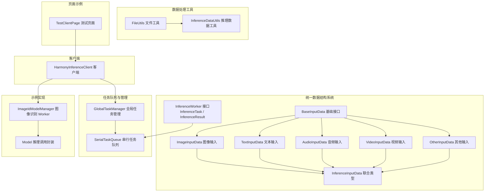
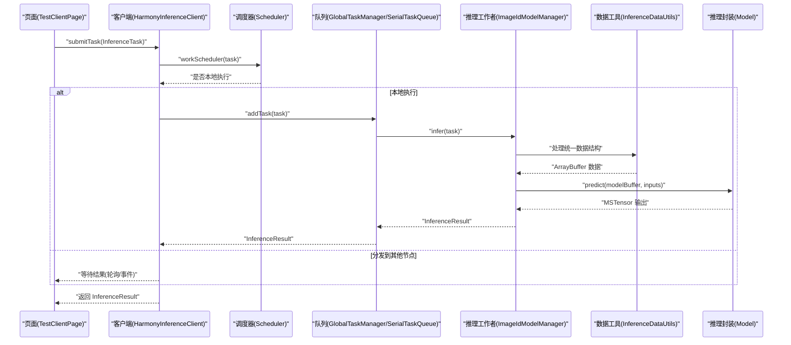
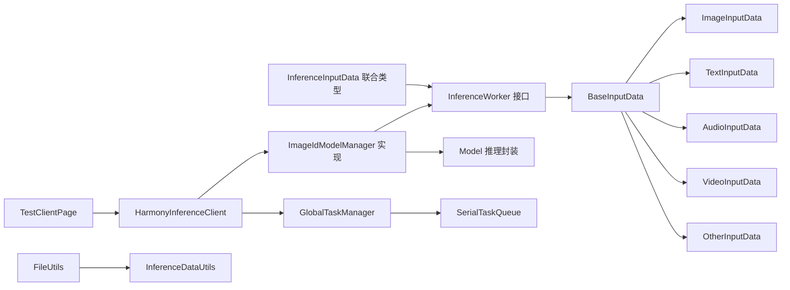

# 推理工作者接口

<cite>
**本文引用的文件**
- [InferenceWorker.ets](file://entry/src/main/ets/manager/worker/InferenceWorker.ets)
- [InferenceDataUtils.ets](file://entry/src/main/ets/manager/worker/InferenceDataUtils.ets)
- [GlobalTaskManager.ets](file://entry/src/main/ets/manager/worker/GlobalTaskManager.ets)
- [SerialTaskQueue.ets](file://entry/src/main/ets/manager/worker/SerialTaskQueue.ets)
- [HarmonyInferenceClient.ets](file://entry/src/main/ets/manager/HarmonyInferenceClient.ets)
- [ImageIdModelManager.ets](file://entry/src/main/ets/TestImageTask/ImageIdModelManager.ets)
- [Model.ets](file://entry/src/main/ets/TestImageTask/Model.ets)
- [TestClientPage.ets](file://entry/src/main/ets/pages/TestClientPage.ets)
- [FileUtils.ets](file://entry/src/main/ets/manager/transfer/utils/FileUtils.ets)
</cite>

## 更新摘要
**变更内容**
- 新增统一数据结构系统，所有输入数据通过 ArrayBuffer 处理
- 引入 BaseInputData 接口和各种输入数据类型
- 新增 InferenceDataUtils 工具类用于数据处理
- 更新 InferenceTask 数据结构，使用 InferenceInputData 联合类型
- 扩展不同推理类型的输入数据格式

## 目录
1. [简介](#简介)
2. [项目结构](#项目结构)
3. [核心组件](#核心组件)
4. [架构总览](#架构总览)
5. [详细组件分析](#详细组件分析)
6. [统一数据结构系统](#统一数据结构系统)
7. [依赖关系分析](#依赖关系分析)
8. [性能考量](#性能考量)
9. [故障排查指南](#故障排查指南)
10. [结论](#结论)
11. [附录](#附录)

## 简介
本文件面向 InferenceWorker 推理工作者接口，提供从接口规范、抽象方法定义到实现要求的完整说明。文档以仓库中的真实代码为依据，结合任务定义、结果结构、模型初始化与资源释放等关键流程，给出可操作的实现指南与最佳实践。通过统一数据结构系统，所有输入数据现在都通过 ArrayBuffer 处理，包括 BaseInputData 接口、ImageInputData、TextInputData、AudioInputData、VideoInputData 和 OtherInputData 接口，以及 InferenceInputData 联合类型。同时，通过图像识别示例展示如何实现自定义推理工作者，并解释不同推理类型的扩展机制与常见问题的解决方案。

## 项目结构
本项目围绕"推理工作者接口"构建了完整的推理执行链路，现已升级到统一数据结构系统：
- 接口与数据模型定义位于 worker 层，包含统一的数据结构
- 任务队列与全局管理器负责串行化与生命周期管理
- 客户端封装 MQTT、调度与任务提交逻辑
- 示例实现位于 TestImageTask，演示图像识别 Worker 的完整实现
- 数据处理工具类提供 ArrayBuffer 与各种格式之间的转换

**图表来源**
- [InferenceWorker.ets:22-74](file://entry/src/main/ets/manager/worker/InferenceWorker.ets#L22-L74)
- [InferenceDataUtils.ets:1-36](file://entry/src/main/ets/manager/worker/InferenceDataUtils.ets#L1-L36)
- [FileUtils.ets:126-165](file://entry/src/main/ets/manager/transfer/utils/FileUtils.ets#L126-L165)

**章节来源**
- [InferenceWorker.ets:1-127](file://entry/src/main/ets/manager/worker/InferenceWorker.ets#L1-L127)
- [InferenceDataUtils.ets:1-36](file://entry/src/main/ets/manager/worker/InferenceDataUtils.ets#L1-L36)
- [GlobalTaskManager.ets:1-27](file://entry/src/main/ets/manager/worker/GlobalTaskManager.ets#L1-L27)
- [SerialTaskQueue.ets:1-104](file://entry/src/main/ets/manager/worker/SerialTaskQueue.ets#L1-L104)
- [HarmonyInferenceClient.ets:1-374](file://entry/src/main/ets/manager/HarmonyInferenceClient.ets#L1-L374)
- [ImageIdModelManager.ets:1-257](file://entry/src/main/ets/TestImageTask/ImageIdModelManager.ets#L1-L257)
- [Model.ets:1-42](file://entry/src/main/ets/TestImageTask/Model.ets#L1-L42)
- [TestClientPage.ets:1-183](file://entry/src/main/ets/pages/TestClientPage.ets#L1-L183)
- [FileUtils.ets:1-195](file://entry/src/main/ets/manager/transfer/utils/FileUtils.ets#L1-L195)

## 核心组件
- **InferenceWorker 接口**：定义模型初始化、推理执行、初始化状态查询以及可选的资源释放方法。
- **统一数据结构系统**：包含 BaseInputData 基础接口和各种输入数据类型，所有数据统一通过 ArrayBuffer 处理。
- **InferenceTask 任务**：统一的任务载体，包含任务标识、模型名、输入类型、规范化输入数据与可选参数。
- **InferenceResult 结果**：统一的结果载体，包含执行状态、消息与按输入类型划分的结果数据。
- **InferenceDataUtils 工具类**：提供数据大小估算、格式转换等辅助功能。
- **GlobalTaskManager**：全局任务队列的初始化与获取入口。
- **SerialTaskQueue**：串行化执行队列，负责任务排队、并发控制与错误处理。
- **HarmonyInferenceClient**：客户端封装，负责 MQTT 初始化、事件监听、任务提交与结果等待。
- **ImageIdModelManager**：图像识别 Worker 的具体实现，展示如何接入 InferenceWorker 接口。
- **Model**：基于 AI 框架的推理调用封装，供 Worker 使用。

**章节来源**
- [InferenceWorker.ets:113-126](file://entry/src/main/ets/manager/worker/InferenceWorker.ets#L113-L126)
- [InferenceWorker.ets:22-74](file://entry/src/main/ets/manager/worker/InferenceWorker.ets#L22-L74)
- [InferenceDataUtils.ets:3-36](file://entry/src/main/ets/manager/worker/InferenceDataUtils.ets#L3-L36)
- [HarmonyInferenceClient.ets:326-370](file://entry/src/main/ets/manager/HarmonyInferenceClient.ets#L326-L370)
- [SerialTaskQueue.ets:13-104](file://entry/src/main/ets/manager/worker/SerialTaskQueue.ets#L13-L104)
- [ImageIdModelManager.ets:31-257](file://entry/src/main/ets/TestImageTask/ImageIdModelManager.ets#L31-L257)
- [Model.ets:5-39](file://entry/src/main/ets/TestImageTask/Model.ets#L5-L39)

## 架构总览
下图展示了从页面发起任务到推理执行与结果返回的端到端流程，现在包含了统一数据结构系统的处理。

**图表来源**
- [TestClientPage.ets:118-132](file://entry/src/main/ets/pages/TestClientPage.ets#L118-L132)
- [HarmonyInferenceClient.ets:326-370](file://entry/src/main/ets/manager/HarmonyInferenceClient.ets#L326-L370)
- [SerialTaskQueue.ets:24-83](file://entry/src/main/ets/manager/worker/SerialTaskQueue.ets#L24-L83)
- [ImageIdModelManager.ets:204-236](file://entry/src/main/ets/TestImageTask/ImageIdModelManager.ets#L204-L236)
- [InferenceDataUtils.ets:7-24](file://entry/src/main/ets/manager/worker/InferenceDataUtils.ets#L7-L24)
- [Model.ets:5-39](file://entry/src/main/ets/TestImageTask/Model.ets#L5-L39)

## 详细组件分析

### InferenceWorker 接口与统一数据结构
- **接口职责**
  - initModel(modelName): Promise<void> —— 初始化模型，准备推理所需的资源。
  - infer(task): Promise<InferenceResult> —— 执行推理，返回统一结果结构。
  - isInitialized(): boolean —— 查询初始化状态。
  - release?(): Promise<void> —— 可选的资源释放方法。
- **统一数据结构**
  - BaseInputData：所有输入数据的基础接口，包含 type 字段作为联合类型的判别字段。
  - ImageInputData：图像输入，强制使用 ArrayBuffer，包含 buffer、format、width、height 等属性。
  - TextInputData：文本输入，包含 text 和可选的 encoding 属性。
  - AudioInputData：音频输入，包含 buffer、sampleRate、channels 等属性。
  - VideoInputData：视频输入，包含 buffer 和可选的 fps 等属性。
  - OtherInputData：其他自定义二进制输入，包含 buffer 和可选的 metadata。
  - InferenceInputData：统一的规范化输入数据联合类型，包含所有输入数据类型。

**章节来源**
- [InferenceWorker.ets:113-126](file://entry/src/main/ets/manager/worker/InferenceWorker.ets#L113-L126)
- [InferenceWorker.ets:22-74](file://entry/src/main/ets/manager/worker/InferenceWorker.ets#L22-L74)

### InferenceTask 任务定义
- **任务结构**
  - taskId: string —— 任务唯一标识。
  - modelName?: string —— 指定使用的模型名。
  - type: InferenceInputType —— 输入类型（图像/文本/音频/视频/其他）。
  - data: InferenceInputData —— 统一的规范化输入数据。
  - params?: Record<string, string | number | boolean | ArrayBuffer> —— 可选参数。
- **参数类型**
  - 支持字符串、数字、布尔值和 ArrayBuffer 类型的参数。
  - ArrayBuffer 类型参数可用于传递二进制数据或配置信息。

**章节来源**
- [InferenceWorker.ets:2-13](file://entry/src/main/ets/manager/worker/InferenceWorker.ets#L2-L13)

### InferenceResult 结果结构
- **结果定义**
  - success: boolean —— 执行是否成功。
  - message?: string —— 成功或失败的消息。
  - result?: ImageResult | TextResult | AudioResult | CustomResult —— 按类型返回的结果。
- **结果类型**
  - 图像识别：ImageResult 包含置信度数组与最大索引数组。
  - 文本处理：TextResult 包含识别文本与可选置信度。
  - 音频处理：AudioResult 包含转写文本与可选处理后音频数据。
  - 其他类型：CustomResult 包含原始二进制数据与可选元数据。

**章节来源**
- [InferenceWorker.ets:78-108](file://entry/src/main/ets/manager/worker/InferenceWorker.ets#L78-L108)

### InferenceDataUtils 工具类
- **功能特性**
  - estimateInputDataSize(input: InferenceInputData): number —— 估算统一数据结构的大小。
  - 支持文本类型按字符数估算，其他类型按 ArrayBuffer.byteLength 计算。
  - 提供数据格式转换的辅助方法。
- **使用场景**
  - 任务调度时的资源估算。
  - 内存管理和性能优化。
  - 数据传输前的大小计算。

**章节来源**
- [InferenceDataUtils.ets:3-36](file://entry/src/main/ets/manager/worker/InferenceDataUtils.ets#L3-L36)

## 统一数据结构系统

### BaseInputData 基础接口
- **设计目的**
  - 作为所有输入数据类型的基类，确保类型安全和统一处理。
  - type 字段作为联合类型的判别字段，便于运行时类型检查。
- **核心属性**
  - type: InferenceInputType —— 与枚举一一对应，确保类型一致性。

**章节来源**
- [InferenceWorker.ets:22-25](file://entry/src/main/ets/manager/worker/InferenceWorker.ets#L22-L25)

### 各种输入数据类型

#### ImageInputData（图像输入）
- **强制要求**
  - buffer: ArrayBuffer —— 必须使用二进制数据。
- **可选属性**
  - format?: string —— 原始格式（如 jpeg、png）。
  - width?: number —— 图像宽度。
  - height?: number —— 图像高度。
- **使用场景**
  - 图像识别、分类、检测等视觉任务。
  - 支持多种图像格式的统一处理。

**章节来源**
- [InferenceWorker.ets:28-35](file://entry/src/main/ets/manager/worker/InferenceWorker.ets#L28-L35)

#### TextInputData（文本输入）
- **核心属性**
  - text: string —— 文本内容。
  - encoding?: string —— 编码信息，默认 UTF-8。
- **应用场景**
  - 文本分类、情感分析、OCR 等自然语言处理任务。
  - 支持多语言文本的统一处理。

**章节来源**
- [InferenceWorker.ets:38-43](file://entry/src/main/ets/manager/worker/InferenceWorker.ets#L38-L43)

#### AudioInputData（音频输入）
- **必需属性**
  - buffer: ArrayBuffer —— 音频二进制数据。
  - sampleRate: number —— 采样率。
  - channels: number —— 声道数。
- **应用场景**
  - 语音识别、音频分类、音乐分析等任务。
  - 支持多种音频格式的统一处理。

**章节来源**
- [InferenceWorker.ets:46-51](file://entry/src/main/ets/manager/worker/InferenceWorker.ets#L46-L51)

#### VideoInputData（视频输入）
- **必需属性**
  - buffer: ArrayBuffer —— 视频二进制数据。
- **可选属性**
  - fps?: number —— 帧率。
- **应用场景**
  - 视频分析、动作识别、视频分类等任务。
  - 支持多格式视频的统一处理。

**章节来源**
- [InferenceWorker.ets:54-59](file://entry/src/main/ets/manager/worker/InferenceWorker.ets#L54-L59)

#### OtherInputData（其他输入）
- **必需属性**
  - buffer: ArrayBuffer —— 自定义二进制数据。
- **可选属性**
  - metadata?: string —— 元数据描述。
- **应用场景**
  - 自定义推理任务。
  - 传感器数据、JSON 配置等特殊格式。

**章节来源**
- [InferenceWorker.ets:62-66](file://entry/src/main/ets/manager/worker/InferenceWorker.ets#L62-L66)

### InferenceInputData 联合类型
- **类型定义**
  - 统一的规范化输入数据联合类型，包含所有输入数据类型。
- **优势**
  - 简化接口设计，统一数据处理流程。
  - 提高类型安全性，减少运行时错误。
  - 便于扩展新的输入类型。

**章节来源**
- [InferenceWorker.ets:69-74](file://entry/src/main/ets/manager/worker/InferenceWorker.ets#L69-L74)

## 依赖关系分析
- **接口层**
  - InferenceWorker 定义了统一的抽象，便于替换不同推理后端。
  - 新增的统一数据结构系统确保所有输入数据的一致性。
- **实现层**
  - ImageIdModelManager 实现 InferenceWorker，内部依赖 Model 封装推理调用。
  - InferenceDataUtils 提供数据处理辅助功能。
- **管理层**
  - GlobalTaskManager 与 SerialTaskQueue 负责任务串行化与生命周期管理。
- **客户端层**
  - HarmonyInferenceClient 组合 MQTT、调度器与队列，对外提供统一的提交与销毁能力。
- **页面层**
  - TestClientPage 作为示例，演示如何构造任务并提交。
- **工具层**
  - FileUtils 提供 ArrayBuffer 与各种格式之间的转换。
  - InferenceDataUtils 提供数据大小估算等功能。

**图表来源**
- [InferenceWorker.ets:22-74](file://entry/src/main/ets/manager/worker/InferenceWorker.ets#L22-L74)
- [ImageIdModelManager.ets:31-257](file://entry/src/main/ets/TestImageTask/ImageIdModelManager.ets#L31-L257)
- [Model.ets:5-39](file://entry/src/main/ets/TestImageTask/Model.ets#L5-L39)
- [HarmonyInferenceClient.ets:326-370](file://entry/src/main/ets/manager/HarmonyInferenceClient.ets#L326-L370)
- [GlobalTaskManager.ets:8-13](file://entry/src/main/ets/manager/worker/GlobalTaskManager.ets#L8-L13)
- [SerialTaskQueue.ets:19-21](file://entry/src/main/ets/manager/worker/SerialTaskQueue.ets#L19-L21)
- [TestClientPage.ets:52-65](file://entry/src/main/ets/pages/TestClientPage.ets#L52-L65)
- [FileUtils.ets:126-165](file://entry/src/main/ets/manager/transfer/utils/FileUtils.ets#L126-L165)
- [InferenceDataUtils.ets:3-36](file://entry/src/main/ets/manager/worker/InferenceDataUtils.ets#L3-L36)

**章节来源**
- [HarmonyInferenceClient.ets:326-370](file://entry/src/main/ets/manager/HarmonyInferenceClient.ets#L326-L370)
- [GlobalTaskManager.ets:1-27](file://entry/src/main/ets/manager/worker/GlobalTaskManager.ets#L1-L27)
- [SerialTaskQueue.ets:1-104](file://entry/src/main/ets/manager/worker/SerialTaskQueue.ets#L1-L104)
- [ImageIdModelManager.ets:1-257](file://entry/src/main/ets/TestImageTask/ImageIdModelManager.ets#L1-L257)
- [Model.ets:1-42](file://entry/src/main/ets/TestImageTask/Model.ets#L1-L42)
- [TestClientPage.ets:1-183](file://entry/src/main/ets/pages/TestClientPage.ets#L1-L183)
- [FileUtils.ets:1-195](file://entry/src/main/ets/manager/transfer/utils/FileUtils.ets#L1-L195)
- [InferenceDataUtils.ets:1-36](file://entry/src/main/ets/manager/worker/InferenceDataUtils.ets#L1-L36)

## 性能考量
- **串行化执行**
  - SerialTaskQueue 保证同一时刻仅有一个任务在执行，避免并发竞争与资源争用，适合 CPU 密集型推理。
- **队列长度与延迟**
  - getQueueLength() 可用于监控积压，结合业务策略进行限流或降级。
- **模型加载与预处理**
  - initModel 应尽量在应用启动阶段完成，减少运行时开销。
  - 预处理逻辑（如图像缩放、裁剪、归一化）应尽可能复用与缓存中间结果。
- **统一数据结构的优势**
  - 减少类型转换开销，提高数据处理效率。
  - 统一的 ArrayBuffer 处理简化了内存管理。
- **远程执行与等待**
  - 远程执行时，客户端通过轮询或事件等待结果，建议设置合理的超时与重试策略。
- **数据大小估算**
  - InferenceDataUtils.estimateInputDataSize 可用于资源规划和任务调度。

**章节来源**
- [InferenceDataUtils.ets:7-24](file://entry/src/main/ets/manager/worker/InferenceDataUtils.ets#L7-L24)

## 故障排查指南
- **初始化失败**
  - 症状：客户端初始化返回失败或抛出异常。
  - 排查：确认 MQTT 配置正确、模型路径有效、资源可访问；检查 initModel 是否被调用且成功。
- **未初始化即提交任务**
  - 症状：submitTask 抛出"未初始化"异常。
  - 排查：确保先调用 init，再提交任务；检查 isInitialized 状态。
- **推理失败**
  - 症状：InferenceResult.success 为 false，message 中包含错误信息。
  - 排查：检查输入类型与数据格式是否匹配；确认模型已加载；查看 Worker 内部日志。
- **队列积压**
  - 症状：getQueueLength 持续增长，响应变慢。
  - 排查：降低任务频率、优化模型推理耗时、考虑并行化（需评估资源限制）。
- **资源未释放**
  - 症状：长时间运行后内存或句柄泄漏。
  - 排查：确保 destroy 被调用；若 Worker 实现了 release，确保其被触发。
- **数据格式错误**
  - 症状：统一数据结构处理失败或类型转换异常。
  - 排查：确认输入数据符合对应接口要求；检查 ArrayBuffer 的有效性；验证数据完整性。

**章节来源**
- [HarmonyInferenceClient.ets:326-370](file://entry/src/main/ets/manager/HarmonyInferenceClient.ets#L326-L370)
- [SerialTaskQueue.ets:86-97](file://entry/src/main/ets/manager/worker/SerialTaskQueue.ets#L86-L97)
- [ImageIdModelManager.ets:204-236](file://entry/src/main/ets/TestImageTask/ImageIdModelManager.ets#L204-L236)

## 结论
InferenceWorker 接口提供了清晰、可扩展的推理抽象，配合统一数据结构系统与串行任务队列及客户端封装，能够稳定地支撑多设备、多任务的推理场景。统一的数据结构系统通过 BaseInputData 和各种输入数据类型，实现了所有输入数据的 ArrayBuffer 统一处理，提高了类型安全性与代码复用性。通过图像识别示例，可以快速理解如何实现自定义推理工作者，并在此基础上扩展文本、音频、视频等其他推理类型。建议在生产环境中关注初始化时机、资源释放、队列监控以及统一数据结构的正确使用，以获得更好的稳定性与性能。

## 附录

### 接口规范与实现要点
- **必须实现的方法**
  - initModel(modelName): 加载并准备模型资源，失败需抛出异常或返回错误结果。
  - infer(task): 严格校验输入类型与数据完整性，返回标准化 InferenceResult。
  - isInitialized(): 返回当前初始化状态。
  - release?(): 若存在外部资源（如句柄、缓存），应在该方法中释放。
- **参数与返回值**
  - InferenceTask 的 params 字段可用于传递可选参数（如 Top-K 数量、采样率等）。
  - InferenceResult 的 result 字段按输入类型选择对应结果结构，确保调用方可安全解构。
- **统一数据结构的使用**
  - 所有输入数据必须符合对应的接口定义。
  - 确保 ArrayBuffer 的有效性和完整性。
  - 正确处理可选属性和元数据。
- **扩展机制**
  - 新增推理类型：在 BaseInputData 接口基础上扩展，实现相应的输入数据类型。
  - 替换推理后端：只需实现 InferenceWorker 接口，保持 initModel/infer/isInitialized/release 行为一致。

**章节来源**
- [InferenceWorker.ets:113-126](file://entry/src/main/ets/manager/worker/InferenceWorker.ets#L113-L126)
- [InferenceWorker.ets:22-74](file://entry/src/main/ets/manager/worker/InferenceWorker.ets#L22-L74)
- [ImageIdModelManager.ets:204-236](file://entry/src/main/ets/TestImageTask/ImageIdModelManager.ets#L204-L236)

### 不同推理类型的实现思路

#### 图像识别
- **输入数据**
  - ImageInputData：包含 ArrayBuffer、可选的 format、width、height。
  - 支持多种图像格式的统一处理。
- **处理流程**
  - 图像解码、尺寸缩放、裁剪、通道顺序与归一化。
  - 转换为模型所需的 Float32Array。
- **推理结果**
  - 返回 Top-K 结果，包含置信度数组与最大索引数组。

#### 文本处理
- **输入数据**
  - TextInputData：包含 text 和可选的 encoding。
  - 支持多语言文本的统一处理。
- **处理流程**
  - 文本清洗、分词、编码为模型输入张量。
  - 处理特殊字符和编码问题。
- **推理结果**
  - 返回识别文本与可选置信度。

#### 音频处理
- **输入数据**
  - AudioInputData：包含 ArrayBuffer、sampleRate、channels。
  - 支持多种音频格式的统一处理。
- **处理流程**
  - 重采样、分帧、特征提取。
  - 频域变换和特征向量生成。
- **推理结果**
  - 返回转写文本与可选处理后音频数据。

#### 视频处理
- **输入数据**
  - VideoInputData：包含 ArrayBuffer 和可选的 fps。
  - 支持多格式视频的统一处理。
- **处理流程**
  - 帧提取、光流分析、时空特征提取。
  - 时间序列建模和特征聚合。
- **推理结果**
  - 返回视频分析结果，如动作分类、行为识别等。

#### 其他类型
- **输入数据**
  - OtherInputData：包含自定义 ArrayBuffer 和可选 metadata。
  - 支持传感器数据、JSON 配置等特殊格式。
- **处理流程**
  - 按领域需求转换为模型输入。
  - 特征工程和数据预处理。
- **推理结果**
  - 返回 CustomResult，包含原始二进制数据与元数据。

**章节来源**
- [InferenceWorker.ets:28-66](file://entry/src/main/ets/manager/worker/InferenceWorker.ets#L28-L66)
- [ImageIdModelManager.ets:55-132](file://entry/src/main/ets/TestImageTask/ImageIdModelManager.ets#L55-L132)

### 数据格式转换工具

#### ArrayBuffer 与 Base64 转换
- **FileUtils 提供的功能**
  - arrayBufferToBase64(buffer: ArrayBuffer): string —— 将 ArrayBuffer 转换为 Base64 字符串。
  - base64ToArrayBuffer(base64: string): ArrayBuffer —— 将 Base64 字符串转换回 ArrayBuffer。
- **使用场景**
  - 网络传输中的数据编码。
  - 存储和分享二进制数据。
  - 与 Web API 的兼容性处理。

#### 字符串与 ArrayBuffer 转换
- **FileUtils 提供的功能**
  - arrayBufferToString(buffer: ArrayBuffer): string —— 将 ArrayBuffer 转换为字符串。
  - stringToArrayBuffer(str: string): ArrayBuffer —— 将字符串转换为 ArrayBuffer。
- **使用场景**
  - 文本数据的处理和存储。
  - JSON 数据的序列化和反序列化。
  - 编码转换和字符处理。

**章节来源**
- [FileUtils.ets:126-165](file://entry/src/main/ets/manager/transfer/utils/FileUtils.ets#L126-L165)

### 常见问题与解决方案

#### 问题：输入类型不匹配导致推理失败
- **原因**：task.type 与实际数据类型不一致。
- **解决方案**：在 infer 中严格判断 task.type，不支持的类型返回错误结果；确保构造 InferenceTask 时使用正确的数据类型。

#### 问题：模型未初始化
- **原因**：在 infer 开头检查 isInitialized，未初始化返回错误。
- **解决方案**：确保 init 已调用；检查模型文件的有效性；验证模型加载过程。

#### 问题：队列阻塞
- **原因**：任务处理速度慢或队列过长。
- **解决方案**：监控队列长度，必要时降低任务并发；优化模型推理耗时；考虑异步处理。

#### 问题：远程执行结果未返回
- **原因**：网络通信或事件监听问题。
- **解决方案**：检查事件监听与轮询逻辑，设置合理超时时间并记录日志。

#### 问题：统一数据结构使用不当
- **原因**：输入数据不符合接口定义或 ArrayBuffer 无效。
- **解决方案**：确认输入数据符合对应接口要求；检查 ArrayBuffer 的有效性；验证数据完整性；使用 InferenceDataUtils 进行数据验证。

**章节来源**
- [ImageIdModelManager.ets:204-236](file://entry/src/main/ets/TestImageTask/ImageIdModelManager.ets#L204-L236)
- [SerialTaskQueue.ets:51-83](file://entry/src/main/ets/manager/worker/SerialTaskQueue.ets#L51-L83)
- [HarmonyInferenceClient.ets:348-370](file://entry/src/main/ets/manager/HarmonyInferenceClient.ets#L348-L370)
- [InferenceDataUtils.ets:7-24](file://entry/src/main/ets/manager/worker/InferenceDataUtils.ets#L7-L24)