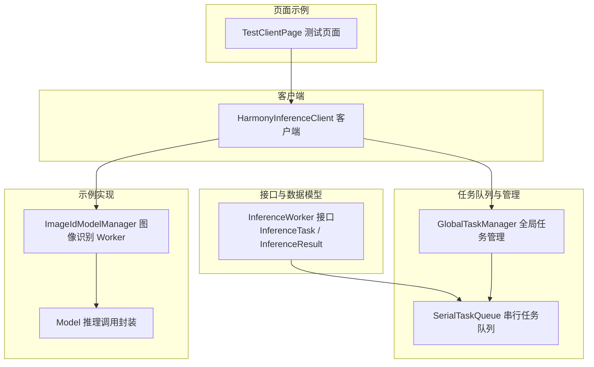
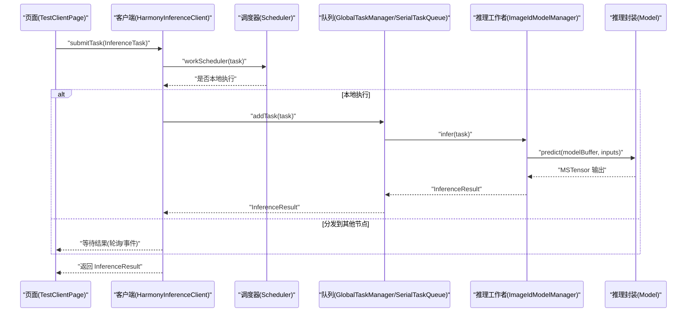
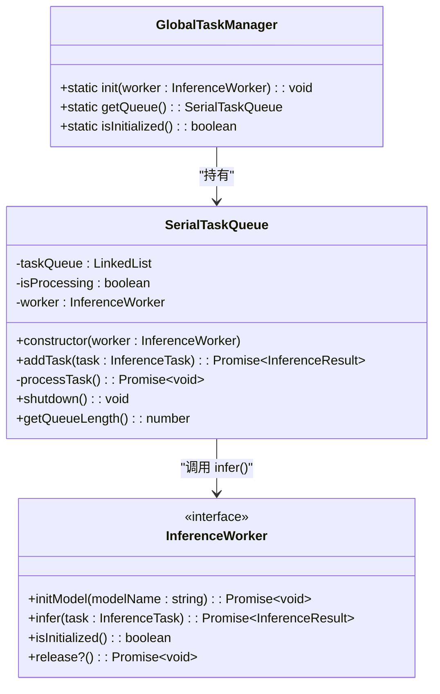
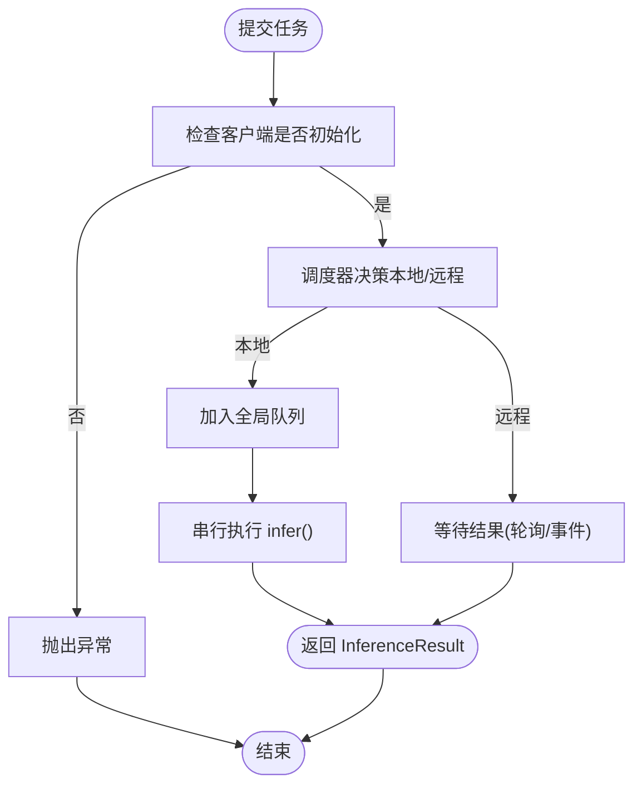
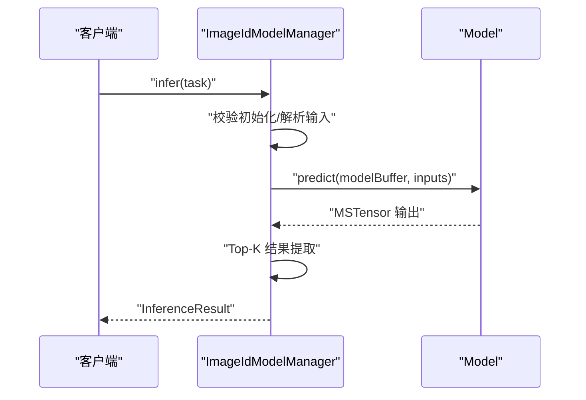
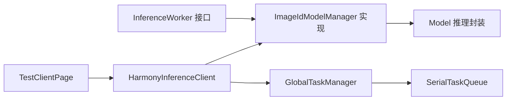

# 推理工作者接口

<cite>
**本文引用的文件**
- [InferenceWorker.ets](file://entry/src/main/ets/manager/worker/InferenceWorker.ets)
- [GlobalTaskManager.ets](file://entry/src/main/ets/manager/worker/GlobalTaskManager.ets)
- [SerialTaskQueue.ets](file://entry/src/main/ets/manager/worker/SerialTaskQueue.ets)
- [HarmonyInferenceClient.ets](file://entry/src/main/ets/manager/HarmonyInferenceClient.ets)
- [ImageIdModelManager.ets](file://entry/src/main/ets/TestImageTask/ImageIdModelManager.ets)
- [Model.ets](file://entry/src/main/ets/TestImageTask/Model.ets)
- [TestClientPage.ets](file://entry/src/main/ets/pages/TestClientPage.ets)
</cite>

## 目录
1. [简介](#简介)
2. [项目结构](#项目结构)
3. [核心组件](#核心组件)
4. [架构总览](#架构总览)
5. [详细组件分析](#详细组件分析)
6. [依赖关系分析](#依赖关系分析)
7. [性能考量](#性能考量)
8. [故障排查指南](#故障排查指南)
9. [结论](#结论)
10. [附录](#附录)

## 简介
本文件面向 InferenceWorker 推理工作者接口，提供从接口规范、抽象方法定义到实现要求的完整说明。文档以仓库中的真实代码为依据，结合任务定义、结果结构、模型初始化与资源释放等关键流程，给出可操作的实现指南与最佳实践。同时，通过图像识别示例展示如何实现自定义推理工作者，并解释不同推理类型的扩展机制与常见问题的解决方案。

## 项目结构
本项目围绕“推理工作者接口”构建了完整的推理执行链路：
- 接口与数据模型定义位于 worker 层
- 任务队列与全局管理器负责串行化与生命周期管理
- 客户端封装 MQTT、调度与任务提交逻辑
- 示例实现位于 TestImageTask，演示图像识别 Worker 的完整实现

图表来源
- [InferenceWorker.ets](file://entry/src/main/ets/manager/worker/InferenceWorker.ets#L1-L90)
- [GlobalTaskManager.ets](file://entry/src/main/ets/manager/worker/GlobalTaskManager.ets#L1-L27)
- [SerialTaskQueue.ets](file://entry/src/main/ets/manager/worker/SerialTaskQueue.ets#L1-L104)
- [HarmonyInferenceClient.ets](file://entry/src/main/ets/manager/HarmonyInferenceClient.ets#L1-L357)
- [ImageIdModelManager.ets](file://entry/src/main/ets/TestImageTask/ImageIdModelManager.ets#L1-L258)
- [Model.ets](file://entry/src/main/ets/TestImageTask/Model.ets#L1-L42)
- [TestClientPage.ets](file://entry/src/main/ets/pages/TestClientPage.ets#L1-L151)

章节来源
- [InferenceWorker.ets](file://entry/src/main/ets/manager/worker/InferenceWorker.ets#L1-L90)
- [GlobalTaskManager.ets](file://entry/src/main/ets/manager/worker/GlobalTaskManager.ets#L1-L27)
- [SerialTaskQueue.ets](file://entry/src/main/ets/manager/worker/SerialTaskQueue.ets#L1-L104)
- [HarmonyInferenceClient.ets](file://entry/src/main/ets/manager/HarmonyInferenceClient.ets#L1-L357)
- [ImageIdModelManager.ets](file://entry/src/main/ets/TestImageTask/ImageIdModelManager.ets#L1-L258)
- [Model.ets](file://entry/src/main/ets/TestImageTask/Model.ets#L1-L42)
- [TestClientPage.ets](file://entry/src/main/ets/pages/TestClientPage.ets#L1-L151)

## 核心组件
- InferenceWorker 接口：定义模型初始化、推理执行、初始化状态查询以及可选的资源释放方法。
- InferenceTask 任务：统一的任务载体，包含任务标识、模型名、输入类型、输入数据与可选参数。
- InferenceResult 结果：统一的结果载体，包含执行状态、消息与按输入类型划分的结果数据。
- GlobalTaskManager：全局任务队列的初始化与获取入口。
- SerialTaskQueue：串行化执行队列，负责任务排队、并发控制与错误处理。
- HarmonyInferenceClient：客户端封装，负责 MQTT 初始化、事件监听、任务提交与结果等待。
- ImageIdModelManager：图像识别 Worker 的具体实现，展示如何接入 InferenceWorker 接口。
- Model：基于 AI 框架的推理调用封装，供 Worker 使用。

章节来源
- [InferenceWorker.ets](file://entry/src/main/ets/manager/worker/InferenceWorker.ets#L75-L89)
- [HarmonyInferenceClient.ets](file://entry/src/main/ets/manager/HarmonyInferenceClient.ets#L163-L196)
- [SerialTaskQueue.ets](file://entry/src/main/ets/manager/worker/SerialTaskQueue.ets#L13-L104)
- [ImageIdModelManager.ets](file://entry/src/main/ets/TestImageTask/ImageIdModelManager.ets#L31-L258)
- [Model.ets](file://entry/src/main/ets/TestImageTask/Model.ets#L5-L39)

## 架构总览
下图展示了从页面发起任务到推理执行与结果返回的端到端流程。

图表来源
- [TestClientPage.ets](file://entry/src/main/ets/pages/TestClientPage.ets#L94-L110)
- [HarmonyInferenceClient.ets](file://entry/src/main/ets/manager/HarmonyInferenceClient.ets#L309-L353)
- [SerialTaskQueue.ets](file://entry/src/main/ets/manager/worker/SerialTaskQueue.ets#L24-L83)
- [ImageIdModelManager.ets](file://entry/src/main/ets/TestImageTask/ImageIdModelManager.ets#L205-L237)
- [Model.ets](file://entry/src/main/ets/TestImageTask/Model.ets#L5-L39)

## 详细组件分析

### InferenceWorker 接口与数据模型
- 接口职责
  - initModel(modelName): Promise<void> —— 初始化模型，准备推理所需的资源。
  - infer(task): Promise<InferenceResult> —— 执行推理，返回统一结果结构。
  - isInitialized(): boolean —— 查询初始化状态。
  - release?(): Promise<void> —— 可选的资源释放方法。
- 任务定义 InferenceTask
  - taskId: string —— 任务唯一标识。
  - modelName?: string —— 指定使用的模型名。
  - type: InferenceInputType —— 输入类型（图像/文本/音频/视频/其他）。
  - data: ImageInputData | TextInputData | AudioInputData | ArrayBuffer —— 输入数据。
  - params?: Record<string, string | number | boolean | ArrayBuffer> —— 可选参数。
- 结果定义 InferenceResult
  - success: boolean —— 执行是否成功。
  - message?: string —— 成功或失败的消息。
  - result?: ImageResult | TextResult | AudioResult | CustomResult —— 按类型返回的结果。
- 输入类型与结果类型
  - 图像识别：ImageResult 包含置信度数组与最大索引数组。
  - 文本处理：TextResult 包含识别文本与可选置信度。
  - 音频处理：AudioResult 包含转写文本与可选处理后音频数据。
  - 其他类型：CustomResult 包含原始二进制数据与可选元数据。

章节来源
- [InferenceWorker.ets](file://entry/src/main/ets/manager/worker/InferenceWorker.ets#L2-L71)
- [InferenceWorker.ets](file://entry/src/main/ets/manager/worker/InferenceWorker.ets#L75-L89)

### 任务队列与全局管理
- GlobalTaskManager
  - init(worker): 初始化全局串行队列。
  - getQueue(): 获取队列实例。
  - isInitialized(): 检查是否已初始化。
- SerialTaskQueue
  - addTask(task): 将任务加入队列并返回 Promise 结果。
  - processTask(): 串行取出任务并调用 worker.infer。
  - shutdown(): 关闭队列并拒绝未执行任务。
  - getQueueLength(): 返回当前队列长度。

图表来源
- [GlobalTaskManager.ets](file://entry/src/main/ets/manager/worker/GlobalTaskManager.ets#L4-L26)
- [SerialTaskQueue.ets](file://entry/src/main/ets/manager/worker/SerialTaskQueue.ets#L13-L104)
- [InferenceWorker.ets](file://entry/src/main/ets/manager/worker/InferenceWorker.ets#L75-L89)

章节来源
- [GlobalTaskManager.ets](file://entry/src/main/ets/manager/worker/GlobalTaskManager.ets#L1-L27)
- [SerialTaskQueue.ets](file://entry/src/main/ets/manager/worker/SerialTaskQueue.ets#L1-L104)

### 客户端与调度
- HarmonyInferenceClient
  - init(config, modelName, customWorker?): 初始化 MQTT、事件监听、模型与全局队列。
  - submitTask(task): 通过调度器决定本地执行或远程执行，本地则走队列，远程则等待结果。
  - destroy(): 释放 MQTT、Worker 资源与事件监听。
- 调度器 Scheduler
  - workScheduler(task, logMessages): 基于设备性能评分选择最优节点，若非本机则分发任务。

图表来源
- [HarmonyInferenceClient.ets](file://entry/src/main/ets/manager/HarmonyInferenceClient.ets#L309-L353)
- [SerialTaskQueue.ets](file://entry/src/main/ets/manager/worker/SerialTaskQueue.ets#L51-L83)

章节来源
- [HarmonyInferenceClient.ets](file://entry/src/main/ets/manager/HarmonyInferenceClient.ets#L163-L196)
- [HarmonyInferenceClient.ets](file://entry/src/main/ets/manager/HarmonyInferenceClient.ets#L309-L353)

### 图像识别 Worker 实现示例
- ImageIdModelManager
  - 单例模式：getInstance() 提供全局唯一实例。
  - initModel(modelName): 从资源管理器读取模型文件到内存。
  - infer(task): 校验初始化状态，按输入类型处理数据，调用模型预测，组装结果。
  - isInitialized(): 返回初始化状态。
  - 其他工具方法：图像预处理、Base64 转 PixelMap、Top-K 结果提取等。
- Model
  - 基于 AI 框架加载模型、设置输入、执行推理并返回输出张量。

图表来源
- [ImageIdModelManager.ets](file://entry/src/main/ets/TestImageTask/ImageIdModelManager.ets#L205-L237)
- [Model.ets](file://entry/src/main/ets/TestImageTask/Model.ets#L5-L39)

章节来源
- [ImageIdModelManager.ets](file://entry/src/main/ets/TestImageTask/ImageIdModelManager.ets#L31-L258)
- [Model.ets](file://entry/src/main/ets/TestImageTask/Model.ets#L1-L42)

### 页面测试与使用示例
- TestClientPage
  - 提供初始化、连接状态检查、系统状态查看、提交测试任务与销毁客户端的 UI 操作。
  - 构造 InferenceTask（图像类型），调用客户端 submitTask 并展示结果。

章节来源
- [TestClientPage.ets](file://entry/src/main/ets/pages/TestClientPage.ets#L31-L110)

## 依赖关系分析
- 接口层
  - InferenceWorker 定义了统一的抽象，便于替换不同推理后端。
- 实现层
  - ImageIdModelManager 实现 InferenceWorker，内部依赖 Model 封装推理调用。
- 管理层
  - GlobalTaskManager 与 SerialTaskQueue 负责任务串行化与生命周期管理。
- 客户端层
  - HarmonyInferenceClient 组合 MQTT、调度器与队列，对外提供统一的提交与销毁能力。
- 页面层
  - TestClientPage 作为示例，演示如何构造任务并提交。

图表来源
- [InferenceWorker.ets](file://entry/src/main/ets/manager/worker/InferenceWorker.ets#L75-L89)
- [ImageIdModelManager.ets](file://entry/src/main/ets/TestImageTask/ImageIdModelManager.ets#L31-L258)
- [Model.ets](file://entry/src/main/ets/TestImageTask/Model.ets#L5-L39)
- [HarmonyInferenceClient.ets](file://entry/src/main/ets/manager/HarmonyInferenceClient.ets#L163-L196)
- [GlobalTaskManager.ets](file://entry/src/main/ets/manager/worker/GlobalTaskManager.ets#L8-L13)
- [SerialTaskQueue.ets](file://entry/src/main/ets/manager/worker/SerialTaskQueue.ets#L19-L21)
- [TestClientPage.ets](file://entry/src/main/ets/pages/TestClientPage.ets#L54-L61)

章节来源
- [HarmonyInferenceClient.ets](file://entry/src/main/ets/manager/HarmonyInferenceClient.ets#L163-L196)
- [GlobalTaskManager.ets](file://entry/src/main/ets/manager/worker/GlobalTaskManager.ets#L1-L27)
- [SerialTaskQueue.ets](file://entry/src/main/ets/manager/worker/SerialTaskQueue.ets#L1-L104)
- [ImageIdModelManager.ets](file://entry/src/main/ets/TestImageTask/ImageIdModelManager.ets#L1-L258)
- [Model.ets](file://entry/src/main/ets/TestImageTask/Model.ets#L1-L42)
- [TestClientPage.ets](file://entry/src/main/ets/pages/TestClientPage.ets#L1-L151)

## 性能考量
- 串行化执行
  - SerialTaskQueue 保证同一时刻仅有一个任务在执行，避免并发竞争与资源争用，适合 CPU 密集型推理。
- 队列长度与延迟
  - getQueueLength() 可用于监控积压，结合业务策略进行限流或降级。
- 模型加载与预处理
  - initModel 应尽量在应用启动阶段完成，减少运行时开销。
  - 预处理逻辑（如图像缩放、裁剪、归一化）应尽可能复用与缓存中间结果。
- 远程执行与等待
  - 远程执行时，客户端通过轮询或事件等待结果，建议设置合理的超时与重试策略。

[本节为通用指导，无需列出章节来源]

## 故障排查指南
- 初始化失败
  - 症状：客户端初始化返回失败或抛出异常。
  - 排查：确认 MQTT 配置正确、模型路径有效、资源可访问；检查 initModel 是否被调用且成功。
- 未初始化即提交任务
  - 症状：submitTask 抛出“未初始化”异常。
  - 排查：确保先调用 init，再提交任务；检查 isInitialized 状态。
- 推理失败
  - 症状：InferenceResult.success 为 false，message 中包含错误信息。
  - 排查：检查输入类型与数据格式是否匹配；确认模型已加载；查看 Worker 内部日志。
- 队列积压
  - 症状：getQueueLength 持续增长，响应变慢。
  - 排查：降低任务频率、优化模型推理耗时、考虑并行化（需评估资源限制）。
- 资源未释放
  - 症状：长时间运行后内存或句柄泄漏。
  - 排查：确保 destroy 被调用；若 Worker 实现了 release，确保其被触发。

章节来源
- [HarmonyInferenceClient.ets](file://entry/src/main/ets/manager/HarmonyInferenceClient.ets#L198-L225)
- [SerialTaskQueue.ets](file://entry/src/main/ets/manager/worker/SerialTaskQueue.ets#L86-L97)
- [ImageIdModelManager.ets](file://entry/src/main/ets/TestImageTask/ImageIdModelManager.ets#L205-L237)

## 结论
InferenceWorker 接口提供了清晰、可扩展的推理抽象，配合串行任务队列与客户端封装，能够稳定地支撑多设备、多任务的推理场景。通过图像识别示例，可以快速理解如何实现自定义推理工作者，并在此基础上扩展文本、音频等其他推理类型。建议在生产环境中关注初始化时机、资源释放与队列监控，以获得更好的稳定性与性能。

[本节为总结性内容，无需列出章节来源]

## 附录

### 接口规范与实现要点
- 必须实现的方法
  - initModel(modelName): 加载并准备模型资源，失败需抛出异常或返回错误结果。
  - infer(task): 严格校验输入类型与数据完整性，返回标准化 InferenceResult。
  - isInitialized(): 返回当前初始化状态。
  - release?(): 若存在外部资源（如句柄、缓存），应在该方法中释放。
- 参数与返回值
  - InferenceTask 的 params 字段可用于传递可选参数（如 Top-K 数量、采样率等）。
  - InferenceResult 的 result 字段按输入类型选择对应结果结构，确保调用方可安全解构。
- 扩展机制
  - 新增推理类型：在 InferenceInputType 与相应输入/结果接口中扩展，Worker 中增加类型分支处理。
  - 替换推理后端：只需实现 InferenceWorker 接口，保持 initModel/infer/isInitialized/release 行为一致。

章节来源
- [InferenceWorker.ets](file://entry/src/main/ets/manager/worker/InferenceWorker.ets#L75-L89)
- [ImageIdModelManager.ets](file://entry/src/main/ets/TestImageTask/ImageIdModelManager.ets#L205-L237)

### 不同推理类型的实现思路
- 图像识别
  - 输入：ImageInputData（图像 URI 或 Base64）。
  - 处理：图像解码、尺寸缩放、裁剪、通道顺序与归一化。
  - 推理：调用模型预测，提取 Top-K 结果。
- 文本处理
  - 输入：TextInputData（文本字符串）。
  - 处理：文本清洗、分词、编码为模型输入张量。
  - 推理：返回识别文本与可选置信度。
- 音频处理
  - 输入：AudioInputData（音频缓冲区、采样率、声道数）。
  - 处理：重采样、分帧、特征提取。
  - 推理：返回转写文本与可选处理后音频数据。
- 其他类型
  - 输入：ArrayBuffer 或自定义结构。
  - 处理：按领域需求转换为模型输入。
  - 推理：返回 CustomResult，包含原始二进制数据与元数据。

章节来源
- [InferenceWorker.ets](file://entry/src/main/ets/manager/worker/InferenceWorker.ets#L23-L71)
- [ImageIdModelManager.ets](file://entry/src/main/ets/TestImageTask/ImageIdModelManager.ets#L55-L118)

### 常见问题与解决方案
- 问题：输入类型不匹配导致推理失败
  - 解决：在 infer 中严格判断 task.type，不支持的类型返回错误结果。
- 问题：模型未初始化
  - 解决：在 infer 开头检查 isInitialized，未初始化返回错误；确保 init 已调用。
- 问题：队列阻塞
  - 解决：监控队列长度，必要时降低任务并发；优化模型推理耗时。
- 问题：远程执行结果未返回
  - 解决：检查事件监听与轮询逻辑，设置合理超时时间并记录日志。

章节来源
- [ImageIdModelManager.ets](file://entry/src/main/ets/TestImageTask/ImageIdModelManager.ets#L205-L237)
- [SerialTaskQueue.ets](file://entry/src/main/ets/manager/worker/SerialTaskQueue.ets#L51-L83)
- [HarmonyInferenceClient.ets](file://entry/src/main/ets/manager/HarmonyInferenceClient.ets#L322-L347)