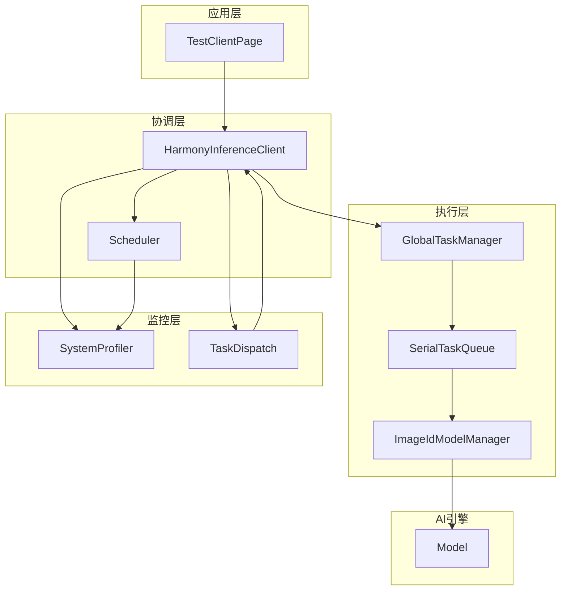
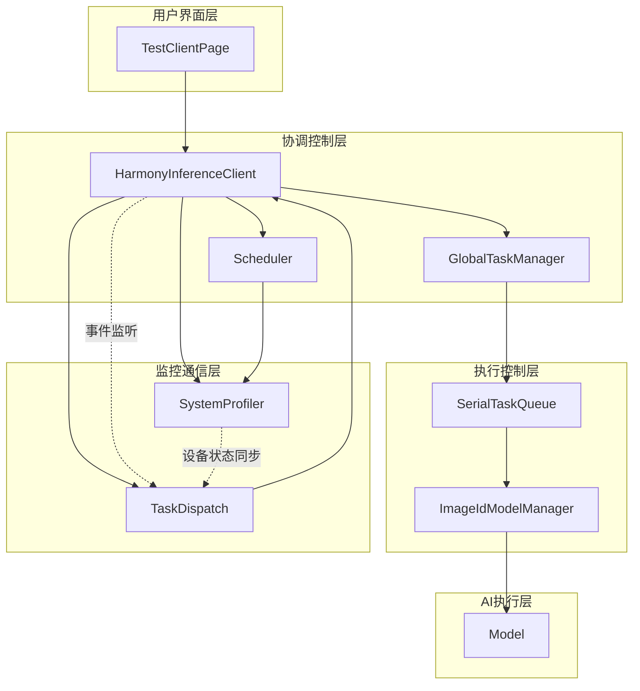
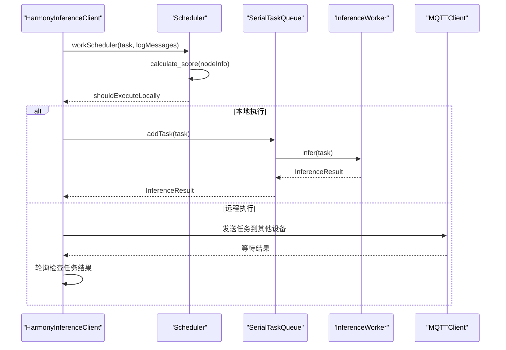
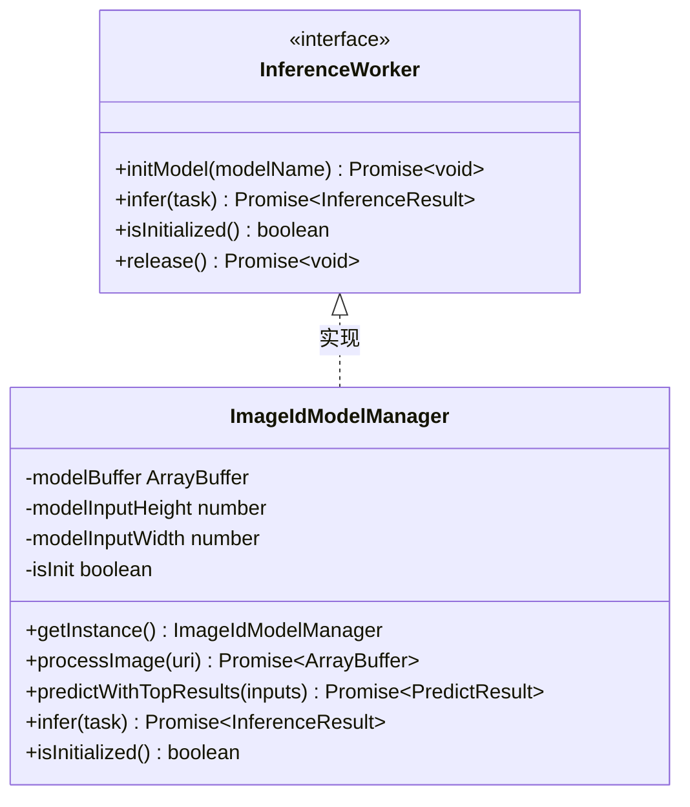
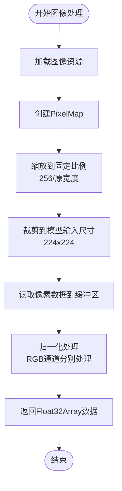
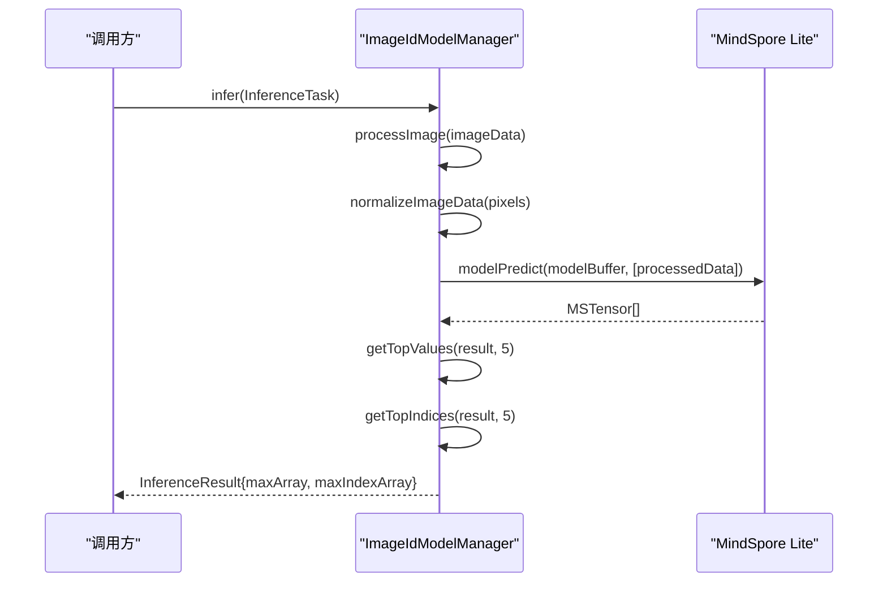
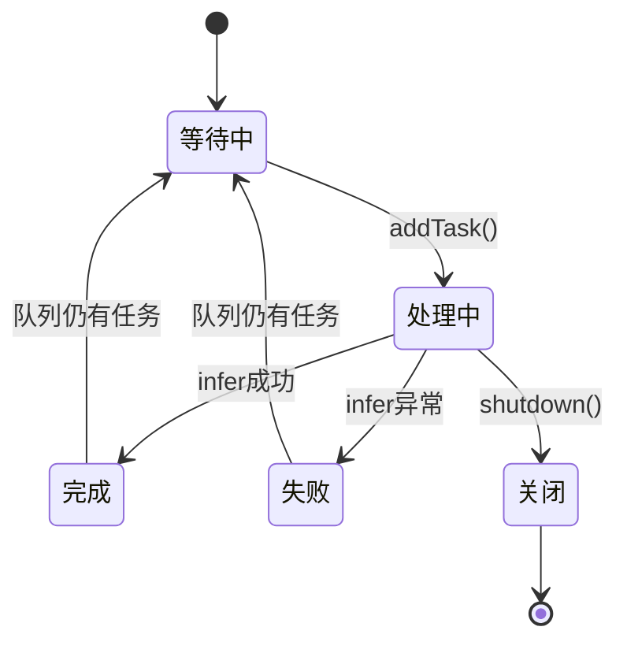
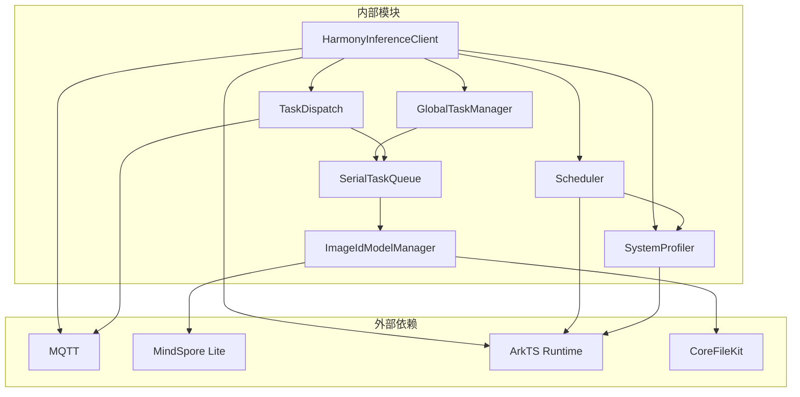

# 推理核心模块

<cite>
**本文档引用的文件**
- [HarmonyInferenceClient.ets](file://entry/src/main/ets/manager/HarmonyInferenceClient.ets)
- [InferenceWorker.ets](file://entry/src/main/ets/manager/worker/InferenceWorker.ets)
- [ImageIdModelManager.ets](file://entry/src/main/ets/TestImageTask/ImageIdModelManager.ets)
- [Model.ets](file://entry/src/main/ets/TestImageTask/Model.ets)
- [GlobalTaskManager.ets](file://entry/src/main/ets/manager/worker/GlobalTaskManager.ets)
- [SerialTaskQueue.ets](file://entry/src/main/ets/manager/worker/SerialTaskQueue.ets)
- [Scheduler.ets](file://entry/src/main/ets/manager/scheduler/Scheduler.ets)
- [SystemProfiler.ets](file://entry/src/main/ets/manager/monitor/SystemProfiler.ets)
- [TaskDispatch.ets](file://entry/src/main/ets/manager/broker/task/TaskDispatch.ets)
- [TestClientPage.ets](file://entry/src/main/ets/pages/TestClientPage.ets)
</cite>

## 目录
1. [简介](#简介)
2. [项目结构](#项目结构)
3. [核心组件](#核心组件)
4. [架构概览](#架构概览)
5. [详细组件分析](#详细组件分析)
6. [依赖关系分析](#依赖关系分析)
7. [性能考虑](#性能考虑)
8. [故障排除指南](#故障排除指南)
9. [结论](#结论)
10. [附录](#附录)

## 简介
推理核心模块是一个基于 OpenHarmony 平台的分布式推理框架，主要包含以下核心能力：
- 推理任务的统一接口定义和执行管理
- 图像识别模型的集成与优化
- 分布式任务调度与负载均衡
- 任务队列管理和并发控制
- 设备状态监控与动态调度

该模块通过 HarmonyInferenceClient 作为统一入口，协调各个子系统完成端到端的推理服务。

## 项目结构
推理核心模块位于项目的 manager 和 TestImageTask 目录下，采用分层架构设计：



**图表来源**
- [HarmonyInferenceClient.ets](file://entry/src/main/ets/manager/HarmonyInferenceClient.ets#L52-L357)
- [Scheduler.ets](file://entry/src/main/ets/manager/scheduler/Scheduler.ets#L14-L105)
- [GlobalTaskManager.ets](file://entry/src/main/ets/manager/worker/GlobalTaskManager.ets#L4-L27)

**章节来源**
- [HarmonyInferenceClient.ets](file://entry/src/main/ets/manager/HarmonyInferenceClient.ets#L1-L357)
- [InferenceWorker.ets](file://entry/src/main/ets/manager/worker/InferenceWorker.ets#L1-L90)

## 核心组件
推理核心模块包含以下关键组件：

### 推理任务接口层
- **InferenceTask**: 统一的推理任务定义，支持图像、文本、音频等多种输入类型
- **InferenceResult**: 标准化的推理结果格式
- **InferenceWorker**: 推理执行接口，定义了模型初始化、推理执行等标准方法

### 执行管理层
- **HarmonyInferenceClient**: 协调器，负责整体流程控制和组件编排
- **GlobalTaskManager**: 全局任务管理器，提供单例模式的任务队列管理
- **SerialTaskQueue**: 串行任务队列，确保推理任务按顺序执行

### 模型执行层
- **ImageIdModelManager**: 图像识别模型管理器，实现具体的推理逻辑
- **Model**: MindSpore Lite 模型推理封装

### 分布式调度层
- **Scheduler**: 任务调度器，基于设备状态进行智能调度
- **TaskDispatch**: 任务分发器，处理跨设备的任务传输

**章节来源**
- [InferenceWorker.ets](file://entry/src/main/ets/manager/worker/InferenceWorker.ets#L1-L90)
- [HarmonyInferenceClient.ets](file://entry/src/main/ets/manager/HarmonyInferenceClient.ets#L52-L357)

## 架构概览
推理核心模块采用分层架构，各层职责清晰分离：



**图表来源**
- [HarmonyInferenceClient.ets](file://entry/src/main/ets/manager/HarmonyInferenceClient.ets#L83-L154)
- [Scheduler.ets](file://entry/src/main/ets/manager/scheduler/Scheduler.ets#L30-L57)
- [SystemProfiler.ets](file://entry/src/main/ets/manager/monitor/SystemProfiler.ets#L43-L120)

## 详细组件分析

### HarmonyInferenceClient 协调器
HarmonyInferenceClient 是整个推理系统的核心协调器，负责：

#### 主要职责
- **初始化管理**: 管理 MQTT 连接、模型初始化、事件监听器注册
- **任务调度**: 通过 Scheduler 决定任务执行位置（本地或远程）
- **结果处理**: 管理任务状态跟踪和结果回调
- **资源管理**: 统一的生命周期管理和资源释放

#### 核心方法流程



**图表来源**
- [HarmonyInferenceClient.ets](file://entry/src/main/ets/manager/HarmonyInferenceClient.ets#L317-L353)
- [Scheduler.ets](file://entry/src/main/ets/manager/scheduler/Scheduler.ets#L30-L57)

#### 关键配置参数
- **MQTTConfig**: MQTT 连接配置，包括 URL、clientId、用户名、密码等
- **模型名称**: 指定要加载的推理模型文件
- **自定义 Worker**: 支持注入自定义的推理执行器

**章节来源**
- [HarmonyInferenceClient.ets](file://entry/src/main/ets/manager/HarmonyInferenceClient.ets#L163-L196)
- [HarmonyInferenceClient.ets](file://entry/src/main/ets/manager/HarmonyInferenceClient.ets#L309-L353)

### InferenceWorker 接口扩展性
InferenceWorker 接口定义了推理执行的标准规范：

#### 接口设计原则
- **统一抽象**: 所有推理执行器都必须实现相同的方法签名
- **异步设计**: 所有操作都是异步的，支持 Promise 返回
- **可扩展性**: 支持自定义实现，如 ImageIdModelManager

#### 方法详解
- **initModel(modelName)**: 异步初始化模型，加载必要的资源
- **infer(task)**: 执行推理任务，返回标准化结果
- **isInitialized()**: 检查模型是否已初始化
- **release()**: 可选的资源释放方法



**图表来源**
- [InferenceWorker.ets](file://entry/src/main/ets/manager/worker/InferenceWorker.ets#L76-L89)
- [ImageIdModelManager.ets](file://entry/src/main/ets/TestImageTask/ImageIdModelManager.ets#L31-L258)

**章节来源**
- [InferenceWorker.ets](file://entry/src/main/ets/manager/worker/InferenceWorker.ets#L76-L89)
- [ImageIdModelManager.ets](file://entry/src/main/ets/TestImageTask/ImageIdModelManager.ets#L31-L258)

### ImageIdModelManager 图像处理能力
ImageIdModelManager 是专门的图像识别模型管理器，具备完整的图像处理流水线：

#### 图像预处理流程


**图表来源**
- [ImageIdModelManager.ets](file://entry/src/main/ets/TestImageTask/ImageIdModelManager.ets#L55-L133)

#### 核心处理能力
- **图像加载**: 支持从资源管理器和文件系统加载图像
- **像素格式转换**: 将图像转换为 RGBA 格式并提取 RGB 通道
- **数据归一化**: 使用 ImageNet 预训练模型的标准均值和方差进行归一化
- **内存管理**: 优化内存使用，避免内存泄漏

#### 推理执行流程


**图表来源**
- [ImageIdModelManager.ets](file://entry/src/main/ets/TestImageTask/ImageIdModelManager.ets#L205-L237)
- [Model.ets](file://entry/src/main/ets/TestImageTask/Model.ets#L5-L39)

**章节来源**
- [ImageIdModelManager.ets](file://entry/src/main/ets/TestImageTask/ImageIdModelManager.ets#L55-L237)
- [Model.ets](file://entry/src/main/ets/TestImageTask/Model.ets#L5-L39)

### 任务队列管理系统
任务队列系统确保推理任务的有序执行和资源管理：

#### SerialTaskQueue 设计
- **串行执行**: 确保任务按提交顺序依次执行
- **异步处理**: 每个任务完成后立即开始下一个任务
- **错误处理**: 完整的异常捕获和错误传播机制
- **资源清理**: 支持队列关闭时的资源清理

#### 任务生命周期管理


**图表来源**
- [SerialTaskQueue.ets](file://entry/src/main/ets/manager/worker/SerialTaskQueue.ets#L51-L82)

**章节来源**
- [SerialTaskQueue.ets](file://entry/src/main/ets/manager/worker/SerialTaskQueue.ets#L13-L103)
- [GlobalTaskManager.ets](file://entry/src/main/ets/manager/worker/GlobalTaskManager.ets#L4-L27)

### 分布式调度系统
分布式调度系统实现了智能的任务分发和负载均衡：

#### 调度算法
调度器使用加权评分算法选择最优执行节点：

```mermaid
flowchart LR
subgraph "设备评估"
CPU[CPU使用率权重]
MEM[内存使用率权重]
BAT[电池电量权重]
STOR[存储空间权重]
LAT[网络延迟权重]
end
subgraph "评分计算"
SCORE[综合评分 = Σ(权重×指标)]
end
CPU --> SCORE
MEM --> SCORE
BAT --> SCORE
STOR --> SCORE
LAT --> SCORE
SCORE --> SELECT[选择最高分设备]
SELECT --> LOCAL{是否为本地设备?}
LOCAL --> |是| EXEC_LOCAL[本地执行]
LOCAL --> |否| EXEC_REMOTE[远程执行]
```

**图表来源**
- [Scheduler.ets](file://entry/src/main/ets/manager/scheduler/Scheduler.ets#L66-L70)

#### 参数优化
调度器支持动态参数优化，通过 `paramSyn` 模块获取最优权重配置。

**章节来源**
- [Scheduler.ets](file://entry/src/main/ets/manager/scheduler/Scheduler.ets#L30-L57)
- [SystemProfiler.ets](file://entry/src/main/ets/manager/monitor/SystemProfiler.ets#L43-L120)

## 依赖关系分析



**图表来源**
- [HarmonyInferenceClient.ets](file://entry/src/main/ets/manager/HarmonyInferenceClient.ets#L1-L14)
- [ImageIdModelManager.ets](file://entry/src/main/ets/TestImageTask/ImageIdModelManager.ets#L1-L8)

**章节来源**
- [HarmonyInferenceClient.ets](file://entry/src/main/ets/manager/HarmonyInferenceClient.ets#L1-L14)
- [ImageIdModelManager.ets](file://entry/src/main/ets/TestImageTask/ImageIdModelManager.ets#L1-L8)

## 性能考虑
推理核心模块在设计时充分考虑了性能优化：

### 内存管理
- **缓冲区复用**: 使用 Float32Array 进行高效的数值计算
- **及时释放**: 图像处理完成后及时释放 PixelMap 资源
- **内存监控**: 通过 SystemProfiler 监控内存使用情况

### 并发控制
- **串行队列**: 避免多个推理任务同时访问共享资源
- **异步处理**: 所有 I/O 操作都是异步的，不阻塞主线程
- **超时机制**: 任务执行设置了合理的超时时间

### 网络优化
- **智能调度**: 基于设备状态的负载均衡
- **大文件传输**: 对于大模型文件使用 TCP 传输协议
- **连接池**: 复用 MQTT 连接，减少连接开销

## 故障排除指南

### 常见问题及解决方案

#### 1. 模型初始化失败
**症状**: 调用 `init()` 方法返回 false
**原因**: 
- 模型文件不存在或路径错误
- 权限不足无法访问模型文件
- MQTT 连接失败

**解决方案**:
- 检查模型文件是否正确放置在资源目录
- 验证文件权限设置
- 确认 MQTT 服务器可达性

#### 2. 推理任务超时
**症状**: `submitTask()` 抛出超时异常
**原因**:
- 远程设备无响应
- 网络连接不稳定
- 目标设备负载过高

**解决方案**:
- 检查网络连接状态
- 查看目标设备的系统状态
- 调整超时参数或重试策略

#### 3. 图像处理异常
**症状**: `processImage()` 返回空数据
**原因**:
- 图像格式不支持
- 内存不足
- 图像损坏

**解决方案**:
- 确认图像格式为支持的格式
- 检查可用内存
- 验证图像文件完整性

#### 4. 任务队列积压
**症状**: 任务执行延迟增加
**原因**:
- 单个任务处理时间过长
- 队列长度过大
- 系统资源不足

**解决方案**:
- 优化单个任务的处理逻辑
- 实施任务优先级机制
- 增加系统资源或扩展设备集群

**章节来源**
- [HarmonyInferenceClient.ets](file://entry/src/main/ets/manager/HarmonyInferenceClient.ets#L198-L225)
- [SerialTaskQueue.ets](file://entry/src/main/ets/manager/worker/SerialTaskQueue.ets#L85-L96)

## 结论
推理核心模块通过精心设计的分层架构和标准化接口，提供了完整的分布式推理解决方案。其主要优势包括：

1. **高度模块化**: 各组件职责明确，便于维护和扩展
2. **强一致性**: 通过串行队列确保推理结果的确定性
3. **智能化调度**: 基于设备状态的动态负载均衡
4. **完善的监控**: 全面的系统状态监控和性能追踪
5. **良好的扩展性**: 通过 InferenceWorker 接口支持多种推理引擎

该模块为构建高性能的分布式 AI 应用提供了坚实的基础，开发者可以根据具体需求定制推理算法和调度策略。

## 附录

### API 参考

#### HarmonyInferenceClient 主要方法
- `init(config, modelName, customWorker)`: 初始化客户端
- `submitTask(task)`: 提交推理任务
- `destroy()`: 释放资源
- `isConnected()`: 检查连接状态
- `getSystemStatus()`: 获取系统状态

#### InferenceWorker 接口方法
- `initModel(modelName)`: 初始化模型
- `infer(task)`: 执行推理
- `isInitialized()`: 检查初始化状态
- `release()`: 释放资源（可选）

#### 配置参数说明
- **MQTTConfig**: MQTT 连接配置
  - `url`: 服务器地址
  - `clientId`: 客户端标识
  - `userName`: 用户名
  - `password`: 密码
  - `topic`: 订阅主题
  - `qos`: 服务质量等级

- **InferenceTask**: 推理任务配置
  - `taskId`: 任务唯一标识
  - `modelName`: 模型名称
  - `type`: 输入数据类型
  - `data`: 输入数据
  - `params`: 额外参数

**章节来源**
- [HarmonyInferenceClient.ets](file://entry/src/main/ets/manager/HarmonyInferenceClient.ets#L163-L196)
- [InferenceWorker.ets](file://entry/src/main/ets/manager/worker/InferenceWorker.ets#L2-L12)