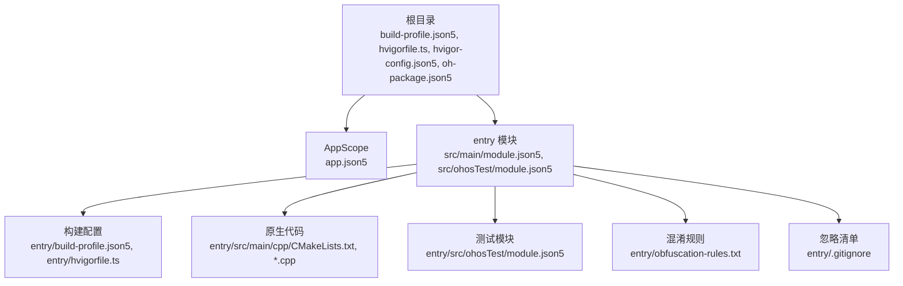
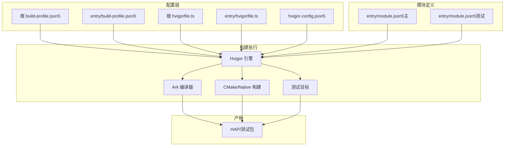
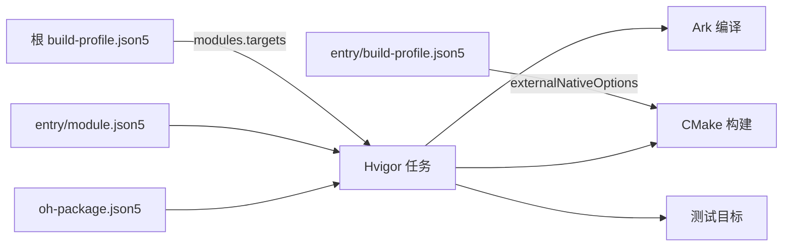
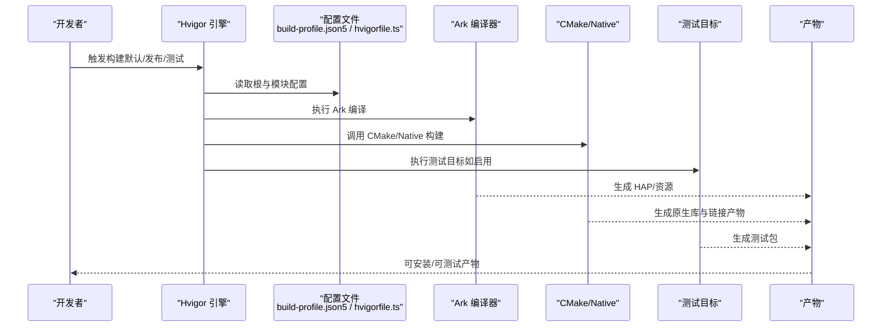

# 构建和部署

<cite>
**本文引用的文件**
- [build-profile.json5（根）](file://build-profile.json5)
- [hvigorfile.ts（根）](file://hvigorfile.ts)
- [hvigor-config.json5](file://hvigor/hvigor-config.json5)
- [oh-package.json5（根）](file://oh-package.json5)
- [build-profile.json5（entry 模块）](file://entry/build-profile.json5)
- [hvigorfile.ts（entry 模块）](file://entry/hvigorfile.ts)
- [module.json5（entry 主模块）](file://entry/src/main/module.json5)
- [module.json5（entry 测试模块）](file://entry/src/ohosTest/module.json5)
- [obfuscation-rules.txt（entry 模块）](file://entry/obfuscation-rules.txt)
- [.gitignore（entry 模块）](file://entry/.gitignore)
- [app.json5（AppScope）](file://AppScope/app.json5)
- [CMakeLists.txt（entry 模块原生代码）](file://entry/src/main/cpp/CMakeLists.txt)
- [GetSystemInfo.cpp（entry 模块原生代码）](file://entry/src/main/cpp/GetSystemInfo.cpp)
- [oh-package.json5（entry 包）](file://entry/oh-package.json5)
</cite>

## 目录
1. [简介](#简介)
2. [项目结构](#项目结构)
3. [核心组件](#核心组件)
4. [架构总览](#架构总览)
5. [详细组件分析](#详细组件分析)
6. [依赖分析](#依赖分析)
7. [性能考虑](#性能考虑)
8. [故障排除指南](#故障排除指南)
9. [结论](#结论)
10. [附录](#附录)

## 简介
本文件面向构建与部署场景，系统化梳理 OpenHarmony/HarmonyOS 应用的构建配置、编译参数与目标设置，解析 hvigor 构建脚本的实现细节与可扩展点，说明模块配置中的权限声明与能力定义，并给出部署流程、环境要求、性能优化建议、版本管理与发布流程以及常见问题排查方法。重点覆盖以下文件与主题：
- build-profile.json5：应用级构建配置、签名、产品与模块目标映射
- hvigorfile.ts：构建任务系统与插件扩展入口
- module.json5：模块类型、页面、能力与权限声明
- entry 模块的构建配置与原生集成
- 部署与测试流程、版本与发布策略、性能优化与故障排除

## 项目结构
本仓库采用多模块布局，根目录包含应用级配置与全局包信息，entry 子模块包含主应用与测试模块的源码、构建配置与原生 C/C++ 代码。

图表来源
- [build-profile.json5（根）](file://build-profile.json5#L1-L51)
- [hvigorfile.ts（根）](file://hvigorfile.ts#L1-L7)
- [hvigor-config.json5](file://hvigor/hvigor-config.json5#L1-L21)
- [oh-package.json5（根）](file://oh-package.json5#L1-L17)
- [build-profile.json5（entry 模块）](file://entry/build-profile.json5#L1-L39)
- [hvigorfile.ts（entry 模块）](file://entry/hvigorfile.ts#L1-L7)
- [module.json5（entry 主模块）](file://entry/src/main/module.json5#L1-L86)
- [module.json5（entry 测试模块）](file://entry/src/ohosTest/module.json5#L1-L38)
- [CMakeLists.txt（entry 模块原生代码）](file://entry/src/main/cpp/CMakeLists.txt#L1-L13)

章节来源
- [build-profile.json5（根）](file://build-profile.json5#L1-L51)
- [hvigorfile.ts（根）](file://hvigorfile.ts#L1-L7)
- [hvigor-config.json5](file://hvigor/hvigor-config.json5#L1-L21)
- [oh-package.json5（根）](file://oh-package.json5#L1-L17)
- [build-profile.json5（entry 模块）](file://entry/build-profile.json5#L1-L39)
- [hvigorfile.ts（entry 模块）](file://entry/hvigorfile.ts#L1-L7)
- [module.json5（entry 主模块）](file://entry/src/main/module.json5#L1-L86)
- [module.json5（entry 测试模块）](file://entry/src/ohosTest/module.json5#L1-L38)
- [CMakeLists.txt（entry 模块原生代码）](file://entry/src/main/cpp/CMakeLists.txt#L1-L13)

## 核心组件
- 应用级构建配置（根 build-profile.json5）
  - 签名配置：包含证书路径、密钥别名、算法与存储口令等
  - 产品配置：SDK 版本、运行时 OS、目标 SDK
  - 构建模式：debug/release
  - 模块映射：entry 模块的目标与产品关联
- 模块级构建配置（entry/build-profile.json5）
  - 编译类型：stageMode
  - Ark 编译器优化：可选 PGO 配置占位
  - 外部原生构建：CMakeLists 路径、ABI 过滤、编译参数
  - 构建选项集：release 模式下的混淆规则启用与规则文件
  - 目标：default、ohosTest
- hvigor 构建脚本
  - 根 hvigorfile.ts：使用 appTasks，不可修改系统部分，预留 plugins 扩展
  - entry hvigorfile.ts：使用 hapTasks，用于 HAP 构建与测试目标
- 模块定义与权限
  - entry 主模块：类型 entry，页面、能力、设备类型、安装方式、权限声明
  - entry 测试模块：类型 feature，测试能力与页面
- 原生集成
  - CMakeLists：原生库构建、头文件包含、链接库
  - GetSystemInfo.cpp：CPU/内存使用率采集示例，供 NAPI 接口调用

章节来源
- [build-profile.json5（根）](file://build-profile.json5#L1-L51)
- [build-profile.json5（entry 模块）](file://entry/build-profile.json5#L1-L39)
- [hvigorfile.ts（根）](file://hvigorfile.ts#L1-L7)
- [hvigorfile.ts（entry 模块）](file://entry/hvigorfile.ts#L1-L7)
- [module.json5（entry 主模块）](file://entry/src/main/module.json5#L1-L86)
- [module.json5（entry 测试模块）](file://entry/src/ohosTest/module.json5#L1-L38)
- [CMakeLists.txt（entry 模块原生代码）](file://entry/src/main/cpp/CMakeLists.txt#L1-L13)
- [GetSystemInfo.cpp（entry 模块原生代码）](file://entry/src/main/cpp/GetSystemInfo.cpp#L1-L181)

## 架构总览
下图展示从配置到产物的关键路径：hvigor 读取根与模块级配置，按目标选择构建任务，结合 Ark 编译、原生 CMake 构建与测试目标，最终生成可安装包与测试包。

图表来源
- [build-profile.json5（根）](file://build-profile.json5#L1-L51)
- [hvigorfile.ts（根）](file://hvigorfile.ts#L1-L7)
- [build-profile.json5（entry 模块）](file://entry/build-profile.json5#L1-L39)
- [hvigorfile.ts（entry 模块）](file://entry/hvigorfile.ts#L1-L7)
- [hvigor-config.json5](file://hvigor/hvigor-config.json5#L1-L21)
- [module.json5（entry 主模块）](file://entry/src/main/module.json5#L1-L86)
- [module.json5（entry 测试模块）](file://entry/src/ohosTest/module.json5#L1-L38)

## 详细组件分析

### 组件一：应用级构建配置（根 build-profile.json5）
- 签名配置
  - 名称与类型：default、HarmonyOS
  - 材料字段：证书路径、密钥别名、profile、签名算法、store 文件与口令
- 产品配置
  - 名称与签名：default
  - SDK：compileSdkVersion、compatibleSdkVersion、targetSdkVersion
  - 运行时：runtimeOS
- 构建模式：debug、release
- 模块映射
  - entry 模块：srcPath 指向 ./entry，目标 default 绑定产品 default

章节来源
- [build-profile.json5（根）](file://build-profile.json5#L1-L51)

### 组件二：模块级构建配置（entry/build-profile.json5）
- apiType：stageMode
- buildOption
  - arkOptions：PGO 占位注释
  - externalNativeOptions：指定 CMakeLists 路径、abiFilters（arm64-v8a）、空字符串参数与 C++ 编译标志
- buildOptionSet.release
  - 启用 Ark 混淆，通过 ruleOptions.files 指向 obfuscation-rules.txt
- targets：default、ohosTest

章节来源
- [build-profile.json5（entry 模块）](file://entry/build-profile.json5#L1-L39)
- [obfuscation-rules.txt（entry 模块）](file://entry/obfuscation-rules.txt#L1-L18)

### 组件三：hvigor 构建脚本
- 根 hvigorfile.ts
  - system 使用 appTasks，不可修改
  - plugins 留空，用于后续扩展
- entry hvigorfile.ts
  - system 使用 hapTasks，适配 HAP 构建与测试目标
  - plugins 留空

章节来源
- [hvigorfile.ts（根）](file://hvigorfile.ts#L1-L7)
- [hvigorfile.ts（entry 模块）](file://entry/hvigorfile.ts#L1-L7)

### 组件四：模块定义与权限（entry/module.json5）
- 模块元数据
  - 名称、类型（entry）、描述、主元素（EntryAbility）、设备类型、安装方式
- 页面与资源
  - pages 指向主页面配置文件
- 能力（abilities）
  - EntryAbility：源入口、导出、技能（home 入口实体与动作）
- 权限声明（requestPermissions）
  - WIFI 信息、位置、蓝牙、网络访问、媒体位置等，含使用场景与原因说明
- 设备类型与安装策略
  - 支持 default、tablet；deliveryWithInstall=true；installationFree=false

章节来源
- [module.json5（entry 主模块）](file://entry/src/main/module.json5#L1-L86)

### 组件五：测试模块定义（entry/module.json5 测试）
- 类型：feature
- 主元素：TestAbility
- 页面与技能：home 入口
- 安装策略：deliveryWithInstall=true；installationFree=false

章节来源
- [module.json5（entry 测试模块）](file://entry/src/ohosTest/module.json5#L1-L38)

### 组件六：原生集成与 CMake
- CMakeLists
  - 最低版本、工程名、头文件包含、构建共享库 entry、链接 libhilog_ndk.z.so、libace_napi.z.so
  - 保留调试符号（strip-debug）
- GetSystemInfo.cpp
  - 提供 CPU/内存使用率计算与 NAPI 接口封装，日志输出便于调试

章节来源
- [CMakeLists.txt（entry 模块原生代码）](file://entry/src/main/cpp/CMakeLists.txt#L1-L13)
- [GetSystemInfo.cpp（entry 模块原生代码）](file://entry/src/main/cpp/GetSystemInfo.cpp#L1-L181)

### 组件七：Hvigor 执行与日志配置（hvigor-config.json5）
- execution：可配置分析模式、守护进程、增量编译、并行编译、类型检查等开关（当前为注释态）
- logging：日志级别（注释态）
- debugging：堆栈跟踪（注释态）
- nodeOptions：JVM 内存上限（注释态）

章节来源
- [hvigor-config.json5](file://hvigor/hvigor-config.json5#L1-L21)

### 组件八：包与依赖（oh-package.json5）
- 根包：名称、版本、依赖与开发依赖（如 @ohos/mqtt、@ohos/hypium、@ohos/hamock）
- entry 包：本地原生库依赖（libentry.so）

章节来源
- [oh-package.json5（根）](file://oh-package.json5#L1-L17)
- [oh-package.json5（entry 包）](file://entry/oh-package.json5#L1-L13)

### 组件九：忽略与预览（entry/.gitignore 与 .preview）
- 忽略：node_modules、oh_modules、.preview、build、.cxx、.test
- 预览：包含缓存、配置、默认产物与预览构建参数文件

章节来源
- [.gitignore（entry 模块）](file://entry/.gitignore#L1-L6)

## 依赖分析
- 配置耦合
  - 根 build-profile.json5 的 modules[].targets 与 entry 目标绑定，决定 hvigor 执行哪些目标
  - entry/build-profile.json5 的 externalNativeOptions 与 CMakeLists 路径强关联
- 任务耦合
  - 根 hvigorfile.ts 使用 appTasks，entry 使用 hapTasks，分别负责应用与 HAP 构建
- 模块耦合
  - module.json5 决定页面、能力与权限，影响打包与安装行为
- 外部依赖
  - @ohos/mqtt、@ohos/hypium、@ohos/hamock 等

图表来源
- [build-profile.json5（根）](file://build-profile.json5#L37-L49)
- [build-profile.json5（entry 模块）](file://entry/build-profile.json5#L7-L14)
- [hvigorfile.ts（根）](file://hvigorfile.ts#L3-L6)
- [hvigorfile.ts（entry 模块）](file://entry/hvigorfile.ts#L3-L6)
- [module.json5（entry 主模块）](file://entry/src/main/module.json5#L1-L86)
- [oh-package.json5（根）](file://oh-package.json5#L9-L15)

章节来源
- [build-profile.json5（根）](file://build-profile.json5#L37-L49)
- [build-profile.json5（entry 模块）](file://entry/build-profile.json5#L7-L14)
- [hvigorfile.ts（根）](file://hvigorfile.ts#L3-L6)
- [hvigorfile.ts（entry 模块）](file://entry/hvigorfile.ts#L3-L6)
- [module.json5（entry 主模块）](file://entry/src/main/module.json5#L1-L86)
- [oh-package.json5（根）](file://oh-package.json5#L9-L15)

## 性能考虑
- 并行与增量编译
  - 在 hvigor-config.json5 中启用并行与增量编译可显著缩短构建时间（当前为注释态，可按需开启）
- Ark 编译优化
  - release 构建已启用 Ark 混淆，配合 obfuscation-rules.txt 控制混淆粒度
  - 可评估 PGO（build-profile.json5 中 arkOptions 注释占位）以进一步提升运行时性能
- 原生构建
  - 保留调试符号（strip-debug）便于定位问题；发布前可根据需要调整 strip 行为
  - ABI 过滤仅保留 arm64-v8a，减少产物体积与编译时间
- 日志与类型检查
  - 适度开启类型检查有助于早期发现错误，但会增加编译时间

[本节为通用建议，不直接分析具体文件]

## 故障排除指南
- 构建失败（找不到签名材料或证书）
  - 检查根 build-profile.json5 中 signingConfigs 的 certpath、storeFile、口令等是否有效且存在
- 原生构建异常
  - 确认 entry/build-profile.json5 的 externalNativeOptions.path 指向正确 CMakeLists
  - 检查 CMakeLists.txt 的 include_directories 与 target_link_libraries 是否匹配实际库
- 测试目标未生成
  - 确认 entry/build-profile.json5 的 targets 包含 ohosTest，entry/hvigorfile.ts 使用 hapTasks
- 权限未生效
  - 检查 module.json5 的 requestPermissions 字段是否完整，reason 与 usedScene 是否与能力匹配
- 预览/缓存导致的构建不一致
  - 清理 entry/.preview 目录或遵循 .gitignore 规则清理构建产物

章节来源
- [build-profile.json5（根）](file://build-profile.json5#L3-L16)
- [build-profile.json5（entry 模块）](file://entry/build-profile.json5#L7-L14)
- [hvigorfile.ts（entry 模块）](file://entry/hvigorfile.ts#L3-L6)
- [module.json5（entry 主模块）](file://entry/src/main/module.json5#L36-L84)
- [.gitignore（entry 模块）](file://entry/.gitignore#L1-L6)

## 结论
本项目采用清晰的分层配置与标准的 hvigor 任务体系，结合 Ark 编译与原生 CMake 构建，实现了从配置到产物的可控交付。通过合理启用并行与增量编译、优化 Ark 混淆与 PGO、精简 ABI 与清理构建缓存，可在保证质量的前提下提升构建效率。模块权限与能力定义明确，便于在不同设备类型与安装策略下稳定运行。

[本节为总结性内容，不直接分析具体文件]

## 附录

### A. 部署流程与环境要求
- 环境要求
  - Node.js、OpenHarmony SDK、CMake、NDK 工具链
- 部署步骤（概要）
  - 使用 hvigor 执行构建（默认与 release），生成 HAP 与测试包
  - 通过 DevEco Studio 或命令行安装到设备/模拟器
  - 运行测试目标验证功能
- 发布准备
  - 切换至 release 模式，确保签名与混淆配置生效
  - 清理 .preview、build、.cxx 等中间产物

[本节为通用流程说明，不直接分析具体文件]

### B. 版本管理与发布流程
- 版本号
  - 根与模块均具备 version 字段，建议统一维护并在发布前校验
- 依赖版本
  - 通过 oh-package.json5 管理依赖与开发依赖，发布前锁定版本
- 发布策略
  - 使用 release 构建模式生成正式包，配合签名与混淆策略

章节来源
- [oh-package.json5（根）](file://oh-package.json5#L3-L4)
- [oh-package.json5（entry 包）](file://entry/oh-package.json5#L3-L4)
- [build-profile.json5（根）](file://build-profile.json5#L28-L35)

### C. 关键流程时序图：构建与测试

图表来源
- [build-profile.json5（根）](file://build-profile.json5#L1-L51)
- [build-profile.json5（entry 模块）](file://entry/build-profile.json5#L1-L39)
- [hvigorfile.ts（根）](file://hvigorfile.ts#L1-L7)
- [hvigorfile.ts（entry 模块）](file://entry/hvigorfile.ts#L1-L7)