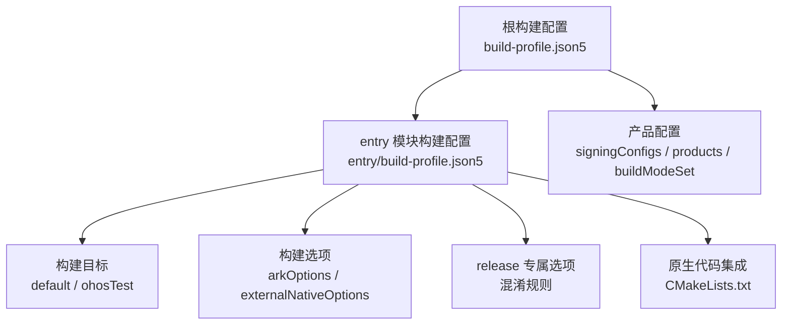
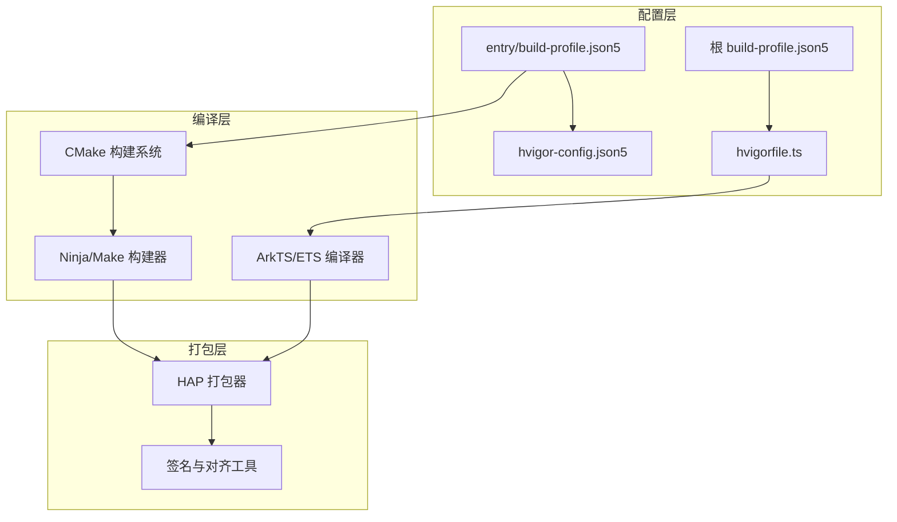
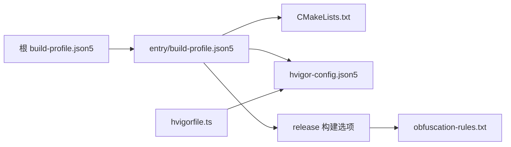

# 构建配置

<cite>
**本文引用的文件**
- [build-profile.json5（根）](file://build-profile.json5)
- [build-profile.json5（entry模块）](file://entry/build-profile.json5)
- [CMakeLists.txt（原生代码）](file://entry/src/main/cpp/CMakeLists.txt)
- [obfuscation-rules.txt（混淆规则）](file://entry/obfuscation-rules.txt)
- [hvigorfile.ts（根hvigor任务）](file://hvigorfile.ts)
- [hvigor-config.json5（hvigor配置）](file://hvigor/hvigor-config.json5)
- [module.json5（entry模块描述）](file://entry/src/main/module.json5)
</cite>

## 目录
1. [简介](#简介)
2. [项目结构与构建入口](#项目结构与构建入口)
3. [核心构建配置项详解](#核心构建配置项详解)
4. [架构总览](#架构总览)
5. [组件深度解析](#组件深度解析)
6. [依赖关系分析](#依赖关系分析)
7. [性能与参数调优](#性能与参数调优)
8. [故障排查指南](#故障排查指南)
9. [结论](#结论)

## 简介
本文件面向OpenHarmony应用的构建配置，系统性解读构建配置文件与相关脚本，重点覆盖：
- build-profile.json5 中的 apiType、buildOption、buildOptionSet、targets 等关键字段
- arkOptions 与 externalNativeOptions 的配置要点与影响
- release 构建下的混淆规则启用与优化设置
- 多目标构建（default、ohosTest）的用途与差异
- 原生代码通过 CMakeLists.txt 的集成方式
- 构建参数调优与性能优化策略
- 常见构建问题的诊断与解决思路

## 项目结构与构建入口
该工程采用模块化组织，根目录与 entry 模块均存在构建配置文件。根级配置定义了签名、产品配置与构建模式集合；entry 模块配置了具体的构建选项、目标以及原生代码集成路径。

图表来源
- [build-profile.json5（根）](file://build-profile.json5#L1-L51)
- [build-profile.json5（entry模块）](file://entry/build-profile.json5#L1-L39)

章节来源
- [build-profile.json5（根）](file://build-profile.json5#L1-L51)
- [build-profile.json5（entry模块）](file://entry/build-profile.json5#L1-L39)

## 核心构建配置项详解
本节逐项解释关键配置项及其作用范围与影响。

- apiType
  - 作用：指定API类型为 stageMode，表明使用分阶段编译模式，有利于在开发与发布阶段进行差异化优化。
  - 影响：与 ArkTS 编译器、资源处理、打包流程等环节协同工作，决定产物形态与优化策略。

- buildOption
  - 作用：定义通用构建选项，适用于所有构建模式。
  - 子项：
    - arkOptions：ArkTS/ETS 编译期优化与分析相关配置（如 PGO apPath 注释提示）。
    - externalNativeOptions：外部原生代码集成配置，包含 CMakeLists 路径、编译参数、C++ 编译标志、ABI 过滤等。

- buildOptionSet
  - 作用：按构建模式（如 release）覆盖或补充构建选项。
  - 示例：在 release 模式下启用混淆规则，并指定规则文件路径。

- targets
  - 作用：定义可构建的目标集，默认 default 与 ohosTest。
  - 差异：default 通常用于主应用构建，ohosTest 用于测试模块构建，两者在依赖、权限、打包策略上可能不同。

章节来源
- [build-profile.json5（entry模块）](file://entry/build-profile.json5#L1-L39)

## 架构总览
从构建视角看，OpenHarmony 应用由“配置层”“编译层”“打包层”组成。配置层由 build-profile.json5 与 hvigor 配置文件定义；编译层由 ArkTS/ETS 编译器与 CMake/Ninja 等工具链执行；打包层生成最终产物（HAP/APK 等）。

图表来源
- [build-profile.json5（根）](file://build-profile.json5#L1-L51)
- [build-profile.json5（entry模块）](file://entry/build-profile.json5#L1-L39)
- [hvigor-config.json5（hvigor配置）](file://hvigor/hvigor-config.json5#L1-L21)
- [hvigorfile.ts（根hvigor任务）](file://hvigorfile.ts#L1-L7)

## 组件深度解析

### 组件一：构建模式与产品配置（根级）
- signingConfigs：定义默认签名材料（证书、密钥别名、密码、签名算法、存储文件等），确保发布版本可被系统信任。
- products：定义产品维度的 SDK 版本、运行时 OS、目标 SDK 等，保证编译与兼容性一致。
- buildModeSet：声明可用的构建模式（如 debug、release），作为构建命令选择的基础。

章节来源
- [build-profile.json5（根）](file://build-profile.json5#L1-L51)

### 组件二：模块级构建选项（entry 模块）
- apiType：stageMode，配合 ArkTS 编译器进行分阶段优化。
- buildOption：
  - arkOptions：预留 PGO apPath 等优化项（当前注释未启用）。
  - externalNativeOptions：
    - path：指向原生代码的 CMakeLists 路径。
    - arguments/cppFlags：扩展 CMake 参数与 C++ 编译标志（当前为空）。
    - abiFilters：限定 ABI（当前仅 arm64-v8a）。
- buildOptionSet.release：
  - 启用混淆规则，指定规则文件路径，实现发布版的代码混淆与体积优化。
- targets：
  - default：主应用构建目标。
  - ohosTest：测试模块构建目标。

章节来源
- [build-profile.json5（entry模块）](file://entry/build-profile.json5#L1-L39)

### 组件三：原生代码集成（CMakeLists.txt）
- 最低 CMake 版本要求与项目名称。
- 包含头文件目录与库链接，明确共享库 entry 的源文件与依赖的 NDK/ACE 接口库。
- 保留调试符号（strip-debug），便于发布后调试与定位问题。

章节来源
- [CMakeLists.txt（原生代码）](file://entry/src/main/cpp/CMakeLists.txt#L1-L13)

### 组件四：混淆规则（obfuscation-rules.txt）
- 提供混淆选项与保留项的说明，支持属性名混淆、全局名混淆、紧凑化、日志移除、命名缓存打印/复用等。
- 在 release 构建中通过 build-profile.json5 启用，提升代码安全性与体积优化效果。

章节来源
- [obfuscation-rules.txt（混淆规则）](file://entry/obfuscation-rules.txt#L1-L18)
- [build-profile.json5（entry模块）](file://entry/build-profile.json5#L16-L30)

### 组件五：Hvigor 构建任务与配置
- hvigorfile.ts：根级使用 appTasks，entry 使用 hapTasks，分别对应应用与 HAP 模块的任务体系。
- hvigor-config.json5：提供执行、日志、调试、Node 选项等可选配置开关，便于在 CI/本地进行性能与稳定性调优。

章节来源
- [hvigorfile.ts（根hvigor任务）](file://hvigorfile.ts#L1-L7)
- [hvigorfile.ts（entry模块）](file://entry/hvigorfile.ts#L1-L6)
- [hvigor-config.json5（hvigor配置）](file://hvigor/hvigor-config.json5#L1-L21)

### 组件六：模块描述与权限（module.json5）
- 定义模块类型、设备类型、页面、能力、权限等元信息，影响打包与安装行为。
- 权限列表包含网络、位置、蓝牙、媒体位置等，需根据实际业务启用/裁剪。

章节来源
- [module.json5（entry模块描述）](file://entry/src/main/module.json5#L1-L86)

## 依赖关系分析
构建配置之间的耦合关系如下：
- 根级 build-profile.json5 决定签名与产品基线，entry 模块在此基础上叠加自身构建选项。
- entry 模块的 externalNativeOptions 指向 CMakeLists.txt，形成“配置 -> 原生构建”的依赖链。
- hvigorfile.ts 决定任务类型，hvigor-config.json5 控制执行策略，共同影响构建速度与稳定性。
- release 构建通过 buildOptionSet 引入混淆规则，与 ArkTS 编译器协同完成发布优化。

图表来源
- [build-profile.json5（根）](file://build-profile.json5#L1-L51)
- [build-profile.json5（entry模块）](file://entry/build-profile.json5#L1-L39)
- [CMakeLists.txt（原生代码）](file://entry/src/main/cpp/CMakeLists.txt#L1-L13)
- [hvigor-config.json5（hvigor配置）](file://hvigor/hvigor-config.json5#L1-L21)
- [hvigorfile.ts（根hvigor任务）](file://hvigorfile.ts#L1-L7)
- [obfuscation-rules.txt（混淆规则）](file://entry/obfuscation-rules.txt#L1-L18)

## 性能与参数调优
以下建议基于现有配置与通用实践，帮助提升构建效率与产物质量：

- 并行与增量构建
  - 在 hvigor-config.json5 中启用并行与增量编译，减少重复编译时间。
  - 合理设置 typeCheck 开关，平衡类型检查与构建速度。

- 构建模式选择
  - debug 模式侧重快速迭代与调试；release 模式启用混淆与优化，提升安全性和体积表现。
  - 通过 buildModeSet 明确区分两种模式，避免误用。

- 原生代码优化
  - externalNativeOptions 的 abiFilters 可按需裁剪，减少产物体积与编译时间。
  - CMakeLists.txt 中保留调试符号（strip-debug）便于发布后问题定位，但需权衡体积与安全。

- ArkTS/ETS 优化
  - 若有 PGO 数据，可在 arkOptions 中启用 apPath，以获得更佳的运行时性能。
  - 合理使用混淆规则，结合 keep 选项保护关键接口与属性名。

- Hvigor 调优
  - daemon 与 parallel 默认开启可提升速度；在资源受限环境可按需关闭。
  - 日志级别与堆内存限制可根据 CI/本地环境调整。

章节来源
- [hvigor-config.json5（hvigor配置）](file://hvigor/hvigor-config.json5#L1-L21)
- [build-profile.json5（entry模块）](file://entry/build-profile.json5#L1-L39)
- [CMakeLists.txt（原生代码）](file://entry/src/main/cpp/CMakeLists.txt#L1-L13)

## 故障排查指南
- 原生代码无法找到或编译失败
  - 检查 externalNativeOptions.path 是否正确指向 CMakeLists.txt。
  - 确认 CMakeLists.txt 中的 include_directories 与 target_link_libraries 配置完整。
  - 验证 abiFilters 与设备 ABI 兼容。

- 混淆导致运行异常
  - 在 release 构建中启用混淆规则，请使用 keep 选项保护关键接口与属性名。
  - 如问题复杂，可临时禁用混淆定位问题范围。

- 构建缓慢或内存不足
  - 在 hvigor-config.json5 中调整并行度、增量编译与日志级别。
  - 适当降低 Node 堆内存上限，避免 OOM。

- 签名或打包失败
  - 核对根级 build-profile.json5 中 signingConfigs 的证书与密码是否有效。
  - 确保产物与目标 SDK 版本匹配。

- 测试目标构建异常
  - 确认 entry 模块 hvigorfile.ts 使用的是 hapTasks。
  - 检查 ohosTest 目标所需的依赖与权限配置。

章节来源
- [build-profile.json5（entry模块）](file://entry/build-profile.json5#L1-L39)
- [CMakeLists.txt（原生代码）](file://entry/src/main/cpp/CMakeLists.txt#L1-L13)
- [hvigor-config.json5（hvigor配置）](file://hvigor/hvigor-config.json5#L1-L21)
- [hvigorfile.ts（根hvigor任务）](file://hvigorfile.ts#L1-L7)

## 结论
本项目构建配置清晰地划分了“根级产品与签名基线”“模块级构建选项与目标”“原生代码集成与混淆规则”“Hvigor 执行与日志配置”。通过合理利用这些配置，可以在保证构建稳定性的前提下，显著提升开发效率与发布质量。建议在实际项目中持续优化 ABI 过滤、并行与增量编译、混淆规则与调试符号策略，以适配不同场景与设备生态。