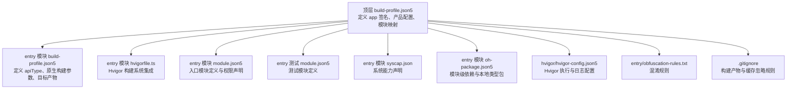
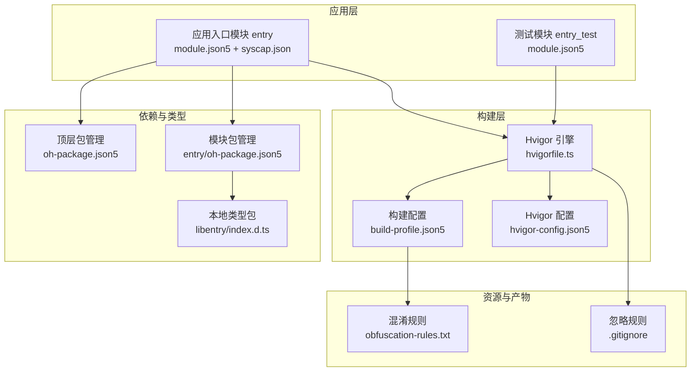
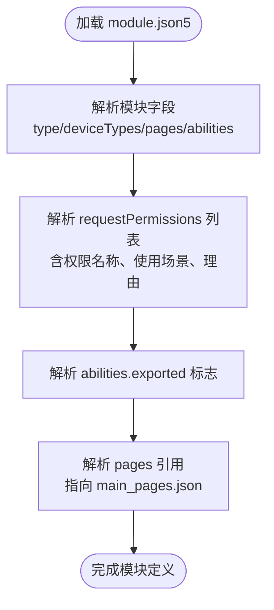
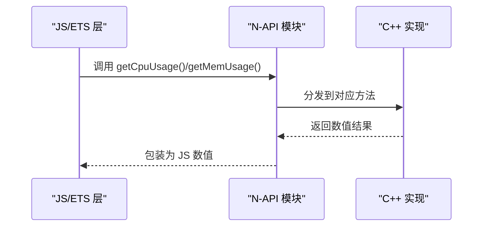
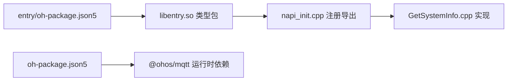

# 模块配置

<cite>
**本文引用的文件**
- [entry/src/main/module.json5](file://entry/src/main/module.json5)
- [entry/src/ohosTest/module.json5](file://entry/src/ohosTest/module.json5)
- [entry/hvigorfile.ts](file://entry/hvigorfile.ts)
- [entry/build-profile.json5](file://entry/build-profile.json5)
- [build-profile.json5](file://build-profile.json5)
- [oh-package.json5](file://oh-package.json5)
- [entry/oh-package.json5](file://entry/oh-package.json5)
- [hvigor/hvigor-config.json5](file://hvigor/hvigor-config.json5)
- [entry/obfuscation-rules.txt](file://entry/obfuscation-rules.txt)
- [entry/src/main/syscap.json](file://entry/src/main/syscap.json)
- [entry/src/main/resources/base/profile/main_pages.json](file://entry/src/main/resources/base/profile/main_pages.json)
- [entry/src/main/cpp/napi_init.cpp](file://entry/src/main/cpp/napi_init.cpp)
- [entry/src/main/cpp/GetSystemInfo.cpp](file://entry/src/main/cpp/GetSystemInfo.cpp)
- [entry/src/main/cpp/types/libentry/index.d.ts](file://entry/src/main/cpp/types/libentry/index.d.ts)
- [entry/src/main/cpp/types/libentry/oh-package.json5](file://entry/src/main/cpp/types/libentry/oh-package.json5)
- [entry/src/main/ets/manager/monitor/SystemProfiler.ets](file://entry/src/main/ets/manager/monitor/SystemProfiler.ets)
- [.gitignore](file://.gitignore)
</cite>

## 目录
1. [简介](#简介)
2. [项目结构](#项目结构)
3. [核心组件](#核心组件)
4. [架构总览](#架构总览)
5. [详细组件分析](#详细组件分析)
6. [依赖关系分析](#依赖关系分析)
7. [性能与构建优化](#性能与构建优化)
8. [故障排查指南](#故障排查指南)
9. [结论](#结论)
10. [附录](#附录)

## 简介
本文件围绕模块配置进行系统化说明，重点覆盖以下方面：
- module.json5 中的模块定义、权限声明与能力配置
- hvigorfile.ts 的构建脚本逻辑与自定义构建流程
- 模块间依赖关系与导入导出配置
- 系统能力声明与运行时权限设置
- 模块打包与分发配置
- 最佳实践与安全考虑
- 版本兼容性与升级策略

## 项目结构
本仓库采用多模块结构，入口模块为 entry，包含主应用与测试模块；顶层与模块内均存在构建与包管理配置文件，用于统一管理签名、SDK 版本、目标产物与构建选项。

图表来源
- [build-profile.json5](file://build-profile.json5#L37-L50)
- [entry/build-profile.json5](file://entry/build-profile.json5#L1-L39)
- [entry/hvigorfile.ts](file://entry/hvigorfile.ts#L1-L7)
- [entry/src/main/module.json5](file://entry/src/main/module.json5#L1-L86)
- [entry/src/ohosTest/module.json5](file://entry/src/ohosTest/module.json5#L1-L38)
- [entry/src/main/syscap.json](file://entry/src/main/syscap.json#L1-L13)
- [entry/oh-package.json5](file://entry/oh-package.json5#L1-L13)
- [hvigor/hvigor-config.json5](file://hvigor/hvigor-config.json5#L1-L21)
- [entry/obfuscation-rules.txt](file://entry/obfuscation-rules.txt#L1-L18)
- [.gitignore](file://.gitignore#L1-L11)

章节来源
- [build-profile.json5](file://build-profile.json5#L1-L51)
- [entry/build-profile.json5](file://entry/build-profile.json5#L1-L39)
- [entry/hvigorfile.ts](file://entry/hvigorfile.ts#L1-L7)
- [entry/src/main/module.json5](file://entry/src/main/module.json5#L1-L86)
- [entry/src/ohosTest/module.json5](file://entry/src/ohosTest/module.json5#L1-L38)
- [entry/src/main/syscap.json](file://entry/src/main/syscap.json#L1-L13)
- [entry/oh-package.json5](file://entry/oh-package.json5#L1-L13)
- [hvigor/hvigor-config.json5](file://hvigor/hvigor-config.json5#L1-L21)
- [entry/obfuscation-rules.txt](file://entry/obfuscation-rules.txt#L1-L18)
- [.gitignore](file://.gitignore#L1-L11)

## 核心组件
- 入口模块定义与权限：通过 module.json5 声明模块类型、页面、能力与运行时权限，明确权限使用场景与理由。
- 测试模块定义：测试模块同样以 module.json5 描述，便于独立构建与测试。
- 构建系统：Hvigor 作为构建引擎，结合 hvigorfile.ts 与 build-profile.json5 驱动编译、打包与签名。
- 系统能力：通过 syscap.json 声明 AI 推理等系统能力，供编译期与运行期校验。
- 本地类型与原生桥接：通过 oh-package.json5 与 NAPI 导出接口，实现 JS/ETS 与 C++ 能力互通。
- 打包与分发：顶层 build-profile.json5 统一签名与产品配置，entry 模块 build-profile.json5 控制目标产物与混淆策略。

章节来源
- [entry/src/main/module.json5](file://entry/src/main/module.json5#L1-L86)
- [entry/src/ohosTest/module.json5](file://entry/src/ohosTest/module.json5#L1-L38)
- [entry/hvigorfile.ts](file://entry/hvigorfile.ts#L1-L7)
- [entry/build-profile.json5](file://entry/build-profile.json5#L1-L39)
- [build-profile.json5](file://build-profile.json5#L1-L51)
- [entry/src/main/syscap.json](file://entry/src/main/syscap.json#L1-L13)
- [entry/oh-package.json5](file://entry/oh-package.json5#L1-L13)
- [entry/src/main/cpp/napi_init.cpp](file://entry/src/main/cpp/napi_init.cpp#L1-L30)
- [entry/src/main/cpp/GetSystemInfo.cpp](file://entry/src/main/cpp/GetSystemInfo.cpp#L1-L50)

## 架构总览
下图展示模块配置在整体工程中的位置与交互关系：

图表来源
- [entry/src/main/module.json5](file://entry/src/main/module.json5#L1-L86)
- [entry/src/ohosTest/module.json5](file://entry/src/ohosTest/module.json5#L1-L38)
- [entry/hvigorfile.ts](file://entry/hvigorfile.ts#L1-L7)
- [entry/build-profile.json5](file://entry/build-profile.json5#L1-L39)
- [hvigor/hvigor-config.json5](file://hvigor/hvigor-config.json5#L1-L21)
- [oh-package.json5](file://oh-package.json5#L1-L17)
- [entry/oh-package.json5](file://entry/oh-package.json5#L1-L13)
- [entry/src/main/cpp/types/libentry/index.d.ts](file://entry/src/main/cpp/types/libentry/index.d.ts#L1-L5)
- [entry/obfuscation-rules.txt](file://entry/obfuscation-rules.txt#L1-L18)
- [.gitignore](file://.gitignore#L1-L11)

## 详细组件分析

### 模块定义与权限声明（module.json5）
- 模块类型与页面：入口模块声明为 entry 类型，定义主元素、页面集合与设备类型，支持默认与平板设备。
- 能力与导出：声明 EntryAbility，具备技能实体与动作，支持被系统桌面启动；导出标志启用，允许外部访问。
- 权限声明：集中于 requestPermissions 字段，包含网络、蓝牙、定位、媒体位置等权限，并为部分权限提供使用场景与理由，便于用户理解授权目的。
- 页面配置：通过 profile 引用 main_pages.json，集中管理首页路径。

图表来源
- [entry/src/main/module.json5](file://entry/src/main/module.json5#L1-L86)
- [entry/src/main/resources/base/profile/main_pages.json](file://entry/src/main/resources/base/profile/main_pages.json#L1-L6)

章节来源
- [entry/src/main/module.json5](file://entry/src/main/module.json5#L1-L86)
- [entry/src/main/resources/base/profile/main_pages.json](file://entry/src/main/resources/base/profile/main_pages.json#L1-L6)

### 测试模块定义（module.json5）
- 模块类型为 feature，主元素为 TestAbility，页面引用 test_pages.json，技能与入口行为与入口模块一致，便于测试场景复用。

章节来源
- [entry/src/ohosTest/module.json5](file://entry/src/ohosTest/module.json5#L1-L38)

### 构建脚本与自定义流程（hvigorfile.ts）
- 构建系统：使用内置的 hapTasks 插件，无需自定义插件扩展，满足标准 HAP 构建需求。
- 自定义扩展：plugins 数组预留自定义插件位点，可按需接入额外构建步骤或工具链。

章节来源
- [entry/hvigorfile.ts](file://entry/hvigorfile.ts#L1-L7)

### 构建配置与目标产物（build-profile.json5）
- 构建模式：apiType 设为 stageMode，适配 Stage 模式下的开发与发布流程。
- Ark 编译：保留 arkOptions 占位，便于后续开启 PGO 等优化。
- 外部原生：externalNativeOptions 指定 CMakeLists.txt 路径与 ABI 过滤，限定 arm64-v8a。
- 构建选项集：release 目标启用混淆，规则文件位于 obfuscation-rules.txt。
- 目标产物：定义 default 与 ohosTest 两个目标，分别对应主应用与测试模块。

章节来源
- [entry/build-profile.json5](file://entry/build-profile.json5#L1-L39)

### 应用级构建与签名（顶层 build-profile.json5）
- 签名配置：定义 default 签名项，包含证书、密钥别名、密码与存储路径等敏感信息。
- 产品配置：声明 default 产品，设置 SDK 版本与运行时 OS。
- 构建模式：debug 与 release 双模式。
- 模块映射：将 entry 模块映射到 default 产品，确保构建时正确识别源路径与目标。

章节来源
- [build-profile.json5](file://build-profile.json5#L1-L51)

### 系统能力声明（syscap.json）
- 设备类型：声明 devices 支持 default 与 tablet。
- 开发阶段能力：通过 development.addedSysCaps 添加 AI 推理能力，供编译期与运行期校验。

章节来源
- [entry/src/main/syscap.json](file://entry/src/main/syscap.json#L1-L13)

### 本地类型与原生桥接（oh-package.json5 与 NAPI）
- 模块依赖：entry/oh-package.json5 声明本地类型包 libentry.so，指向本地类型目录。
- 类型定义：libentry/index.d.ts 提供 getCpuUsage 与 getMemUsage 的类型签名。
- NAPI 注册：napi_init.cpp 将 C++ 方法注册为 N-API 模块，供 JS/ETS 调用；GetSystemInfo.cpp 实现 CPU 与内存使用率查询。
- 类型包元数据：libentry/oh-package.json5 指定 types 文件与版本信息。

图表来源
- [entry/src/main/cpp/napi_init.cpp](file://entry/src/main/cpp/napi_init.cpp#L1-L30)
- [entry/src/main/cpp/GetSystemInfo.cpp](file://entry/src/main/cpp/GetSystemInfo.cpp#L1-L50)
- [entry/src/main/cpp/types/libentry/index.d.ts](file://entry/src/main/cpp/types/libentry/index.d.ts#L1-L5)
- [entry/src/main/cpp/types/libentry/oh-package.json5](file://entry/src/main/cpp/types/libentry/oh-package.json5#L1-L6)

章节来源
- [entry/oh-package.json5](file://entry/oh-package.json5#L1-L13)
- [entry/src/main/cpp/napi_init.cpp](file://entry/src/main/cpp/napi_init.cpp#L1-L30)
- [entry/src/main/cpp/GetSystemInfo.cpp](file://entry/src/main/cpp/GetSystemInfo.cpp#L1-L50)
- [entry/src/main/cpp/types/libentry/index.d.ts](file://entry/src/main/cpp/types/libentry/index.d.ts#L1-L5)
- [entry/src/main/cpp/types/libentry/oh-package.json5](file://entry/src/main/cpp/types/libentry/oh-package.json5#L1-L6)

### 运行时权限与能力使用（示例：系统状态采集）
- 权限使用：SystemProfiler 在采集系统状态时调用隐藏调试接口，若失败则抛出业务错误，体现权限与能力使用时的异常处理。
- 能力声明：syscap.json 中声明 AI 能力，配合 ArkTS/ETS 使用推理相关 API。

章节来源
- [entry/src/main/ets/manager/monitor/SystemProfiler.ets](file://entry/src/main/ets/manager/monitor/SystemProfiler.ets#L35-L79)
- [entry/src/main/syscap.json](file://entry/src/main/syscap.json#L1-L13)

## 依赖关系分析
- 模块依赖：entry 通过 oh-package.json5 引入本地类型包 libentry.so，实现 JS/ETS 与 C++ 的桥接。
- 顶层依赖：顶层 oh-package.json5 声明 @ohos/mqtt 等运行时依赖，entry 通过自身 oh-package.json5 引入本地类型包。
- 锁定文件：entry/oh-package-lock.json5 记录本地类型包的锁定信息，保证构建一致性。

图表来源
- [entry/oh-package.json5](file://entry/oh-package.json5#L1-L13)
- [oh-package.json5](file://oh-package.json5#L1-L17)
- [entry/src/main/cpp/napi_init.cpp](file://entry/src/main/cpp/napi_init.cpp#L1-L30)
- [entry/src/main/cpp/GetSystemInfo.cpp](file://entry/src/main/cpp/GetSystemInfo.cpp#L1-L50)

章节来源
- [entry/oh-package.json5](file://entry/oh-package.json5#L1-L13)
- [oh-package.json5](file://oh-package.json5#L1-L17)
- [entry/oh-package-lock.json5](file://entry/oh-package-lock.json5#L1-L19)

## 性能与构建优化
- 混淆策略：release 目标启用混淆，规则由 obfuscation-rules.txt 定义，建议在保证可维护性的前提下合理配置保留项。
- 并行与增量：hvigor-config.json5 提供并行与增量编译开关占位，可根据团队规模与 CI 环境启用以提升效率。
- 原生 ABI：externalNativeOptions 限制 ABI 为 arm64-v8a，减少交叉编译成本，同时确保目标设备兼容性。

章节来源
- [entry/build-profile.json5](file://entry/build-profile.json5#L16-L30)
- [entry/obfuscation-rules.txt](file://entry/obfuscation-rules.txt#L1-L18)
- [hvigor/hvigor-config.json5](file://hvigor/hvigor-config.json5#L5-L11)
- [entry/build-profile.json5](file://entry/build-profile.json5#L7-L14)

## 故障排查指南
- 构建失败（签名/证书）：检查顶层 build-profile.json5 中 signingConfigs 的证书路径与密码是否正确。
- 混淆问题：确认 obfuscation-rules.txt 已在 build-profile.json5 的 release 目标中启用，避免关键 API 被误混淆。
- 原生编译异常：核对 externalNativeOptions 的 CMakeLists.txt 路径与 ABI 设置，确保与实际工程一致。
- 权限未生效：检查 module.json5 中 requestPermissions 的使用场景与理由字段，确保与实际业务一致。
- 类型缺失：确认 entry/oh-package.json5 正确声明本地类型包，且 libentry/index.d.ts 与 oh-package.json5 的 types 字段匹配。
- 忽略规则影响：留意 .gitignore 与构建产物忽略规则，避免误提交或误清理。

章节来源
- [build-profile.json5](file://build-profile.json5#L3-L16)
- [entry/build-profile.json5](file://entry/build-profile.json5#L16-L30)
- [entry/build-profile.json5](file://entry/build-profile.json5#L7-L14)
- [entry/src/main/module.json5](file://entry/src/main/module.json5#L36-L84)
- [entry/oh-package.json5](file://entry/oh-package.json5#L1-L13)
- [entry/src/main/cpp/types/libentry/oh-package.json5](file://entry/src/main/cpp/types/libentry/oh-package.json5#L1-L6)
- [.gitignore](file://.gitignore#L1-L11)

## 结论
本项目通过清晰的模块配置与构建体系，实现了入口模块与测试模块的分离、权限与能力的显式声明、以及本地类型与原生能力的桥接。建议在保持现有结构的基础上，进一步完善权限最小化原则、能力使用场景说明与混淆规则的精细化配置，以提升安全性与可维护性。

## 附录

### 版本兼容性与升级策略
- SDK 版本：顶层 build-profile.json5 中 compileSdkVersion、compatibleSdkVersion、targetSdkVersion 均为 6.0.0(20)，建议在升级 SDK 时同步更新模块与第三方依赖版本。
- 运行时 OS：runtimeOS 固定为 HarmonyOS，升级时需验证运行时兼容性与能力声明。
- 升级建议：先在 devDependencies 中验证新版本兼容性，再逐步替换生产依赖；对原生模块与类型包进行回归测试。

章节来源
- [build-profile.json5](file://build-profile.json5#L18-L26)